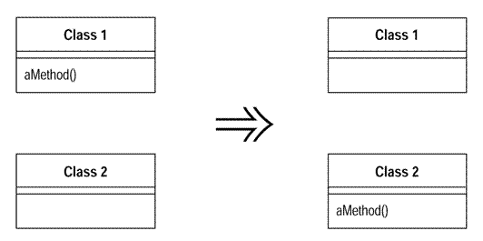
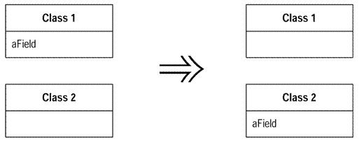
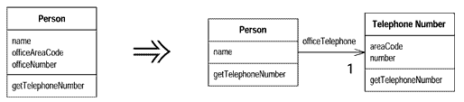
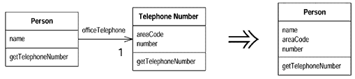
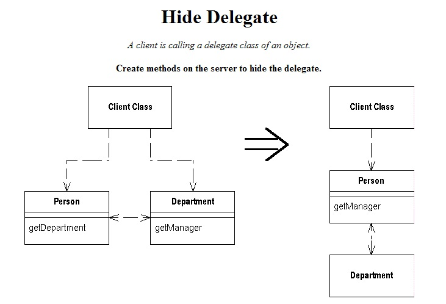
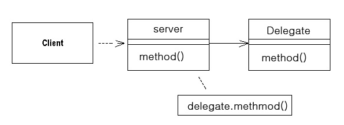
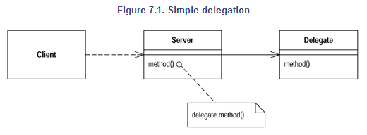
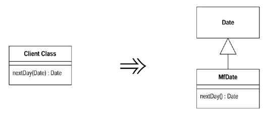

# 7장. Moving Features Between Objects

[TOC]

## Move Method
메소드가 자신이 정의된 클래스보다 다른 클래스의 기능을 더 많이 사용하고 있다면,
이 메소드를 가장 많이 사용하고 있는 클래스에 비슷한 몸체를 가진 새로운 메소드를 만들어라.
그리고 이전 메소드는 간단한 위임으로 바꾸거나 완전히 제거하라.


### 동기
* 메소드를 옮기는 경우
 * 클래스가 너무 많은 동작을 가지고 있을 때,
 * 다른 클래스와 공동으로 일하는 부분이 너무 많아서 단단히 결합되어 있을 때,
* 메소드를 옮겨야 할지 결정하기 어렵다면,
 * 아마 중요한 문제가 아닐것이다..
 * 직감에 따라 선택한다. 나중에 언제든지 다시 변경할 수 있기 때문이다.

### 절차
1. 소스 클래스에 정의된 소스 메소드에 의해 사용되는 모든 부분을 조사한다.
 * 관련된 메소드를 한번에 옮기는 것이 더 쉬울 수 있다.
1. 소스 클래스의 서브클래스나 수퍼클래스에서 옮기려고 하는 메소드에 대한 다른 선언이 있는지 확인한다.
 * 다른 선언이 있다면, 다형성이 타겟 클래스에서도 역시 표현될 수 있는 경우에만 옮길 수 있을 것이다.
1. 타겟 클래스에 메소드를 정의한다.
 * 소스 메소드에서 타겟 메소드로 코드를 복사한다. 그리고 그 메소드가 타겟 클레스에서 동작하도록 적절히 수정한다.
1. 타겟 클래스에서 소스 객체를 참조할 방법이 없다면 새로운 메소드에 소스 객체의 참조를 파라미터로 넘겨야 한다.
 * 타겟 클래스를 컴파일한다.
1. 소스 클래스에서 적절한 타겟 객체를 참조하는 방법을 결정한다.
 * 타겟 클래스를 넘겨주는 필드나 메소드가 소스 클래스에 없다면, 타겟 클래스를 넘겨주는 메소드를 쉽게 만들 수 있는지 살펴보라.
 * 쉽지 않다면, 타겟 클래스를 저장할 수 있는 필드를 소스 클래스에 만들 필요가 있다.
1. 소스 메소드를 위임 메소드로 바꾼다.
1. 컴파일, 테스트한다.
1. 소스 메소드를 제거할지 위임 메소드로 남겨둘지 결정한다.
 * 소스 메소드를 참조하는 부분이 많다면, 소스 메소드를 위임 메소드로 남겨두는 것이 더 쉬운 방법이다.
1. 소스 메소드를 제거한다면, 소스 메소드를 참조하고 있는 부분을 타겟 메소드를 참조하도록 수정한다.
1. 컴파일, 테스트한다.

### 예제

* 새로운 계좌 타입이 추가될 예정이고, 각각 당좌 대월액을 계산하는 규칙을 가지고 있다면,
```java
class Account...
   double overdraftCharge() {
       if (_type.isPremium()) {
           double result = 10;
           if (_daysOverdrawn > 7) result += (_daysOverdrawn - 7) * 0.85;
           return result;
       }
       else return _daysOverdrawn * 1.75;
   }

   double bankCharge() {
       double result = 4.5;
       if (_daysOverdrawn > 0) result += overdraftCharge();
       return result;
   }
   private AccountType _type;
   private int _daysOverdrawn;
```

* 계좌타입 클래스에 계산 식을 옮기고...
```java
 class AccountType...
   double overdraftCharge(int daysOverdrawn) {
       if (isPremium()) {
           double result = 10;
           if ( daysOverdrawn > 7) result += ( daysOverdrawn - 7) * 0.85;
           return result;
       }
       else return daysOverdrawn * 1.75;
   }
```
* 소스 클래스의 메소드 몸체를 위임으로 대체...
```java
class Account...
   double overdraftCharge() {
       return _type.overdraftCharge(_daysOverdrawn);
   }
```
* 위임으로 대체했던 메소드를 제거하기 위해서 그 메소드를 호출하는 부분을 모두 재지정...
```java
 class Account...
   double bankCharge() {
       double result = 4.5;
       if (_daysOverdrawn > 0) result += _type.overdraftCharge(_daysOverdrawn);
       return result;
   }
```
* 소스 클래스의 메소드를 제거...
* 만약 메소드가 Account 클래스의 다른 메소드를 호출했다면 다음과 같이 파라미터로 소스 객체를 넘겨주어야 한다.
```java
class AccountType...
   double overdraftCharge(Account account) {
       if (isPremium()) {
           double result = 10;
           if (account.getDaysOverdrawn() > 7)
              result += (account.getDaysOverdrawn() - 7) * 0.85;
           return result;
       }
       else return account.getDaysOverdrawn() * 1.75;
   }
```

## Move Field
==필드가 자신이 정의된 클래스보다 다른 클래스에 의해서 더 많이 사용되고 있다면==, 타겟 클래스에 새로운 필드를 만들고 기존 필드를 사용하고 있는 모든 부분을 변경하라.



### 동기
* 어떤 필드가 자신이 속한 클래스보다 다른 클래스의 메소드에서 더 많이 사용되고 있을 때,
* 다른 클래스가 get/set 메소드를 통해서 이 필드를 간접적으로 많이 사용하고 있을 때,
* Extract Class를 적용할 때, 필드를 먼저 옮기고 메소드를 옮긴다.

### 절차
1. 필드가 public으로 선언되어 있으면 ==Encapsulate Field==를 사용한다.
1. 필드에 자주 접근하는 메소드를 옮기려고 하거나, 많은 메소드가 이 필드에 접근하고 있다면 ==Self Encapsulate Field==를 사용하는 것이 유용.
1. 컴파일, 테스트를 한다.
1. 타겟 클래스에 필드와 그 필드에 대한 get/set 메소드를 만든다.
1. 타겟 클래스를 컴파일한다.
1. 소스 클래스에서 타겟 객체를 참조하는 방법을 결정한다.
 * 타겟 클래스를 넘겨주는 필드나 메소드가 소스 클래스에 없다면
    * 타겟 클래스를 넘겨주는 메소드를 만들거나
	* 그것이 힘들다면, 소스 클래스에 타겟 클래스를 저장할 수 있는 필드를 만들 필요가 있다.
1. 소스 클래스에 있는 필드를 제거한다.
1. 소스 필드를 참조하고 있는 모든 부분을 타겟 클래스에 있는 적당한 메소드를 참조하도록 바꾼다.
 * 변수에 접근하는 코드는 타겟 객체의 get 메소드를 호출하게 변경.
 * 변수에 할당하는 코드는 타겟 객체의 set 메소드를 호출하게 변경.
 * 필드가 private으로 선언되어 있지 않다면, 소스 클래스의 모든 서브 클래스를 살펴봐야 한다.
1. 컴파일, 테스트를 한다.


### 예제
* _interestRate필드를 AccountType? 클래스로 옮긴다.
```java
class Account...
   private AccountType _type;
   private double _interestRate;

   double interestForAmount_days (double amount, int days) {
       return _interestRate * amount * days / 365;
   }
```
* AccountType? 클래스에 필드와 접근자를 만든다.
```java
class AccountType...
   private double _interestRate;

   void setInterestRate (double arg) {
       _interestRate = arg;
   }

   double getInterestRate () {
       return _interestRate;
   }
```
* Account 클래스에 있는 메소드가 AccountType? 클래스에 있는 메소드를 사용하도록 재지정하고  Account 클래스의 _interestRate 필드를 제거한다.
```java
  private double _interestRate;

   double interestForAmount_days (double amount, int days) {
       return _type.getInterestRate() * amount * days / 365;
   }
```

#### 자체 캡슐화(self-encapsulation) 사용
* 많은 메소드가 Account 클래스의 _interestRate 필드를 사용하고 있을 때
```java
class Account...
    private AccountType _type;
    private double _interestRate;

    double interestForAmount_days (double amount, int days) {
        return getInterestRate() * amount * days / 365;
    }

    private void setInterestRate (double arg) {
        _interestRate = arg;
    }

    private double getInterestRate () {
        return _interestRate;
    }
```

* 접근자 재 지정
```java
    double interestForAmountAndDays (double amount, int days) {
        return getInterestRate() * amount * days / 365;
    }

    private void setInterestRate (double arg) {
        _type.setInterestRate(arg);
    }

    private double getInterestRate () {
        return _type.getInterestRate();
    }
```

## Extract Class

==두 개의 클래스가 해야 할 일을 하나의 클래스가 하고 있는 경우,== 새로운 클래스를 만들어서 관련있는 필드와 메소드를 예전 클래스에서 새로운 클래스로 옮겨라


### 동기
* 클래스의 책임이 점점 커지고 늘어남에 따라 클래스는 복잡해진다.
* 좋은 신호
 * 데이터의 부분 집합과 메소드의 부분 집합이 같이 몰려다닐 때,
 * 같이 변하거나 특별히 서로에게 의존적인 데이터의 부분 집합,
*  개발의 후반부에 클래스를 서브타입(subtype)으로 두는 방법

### 절차
1. 클래스의 책임을 어떻게 나눌지를 결정하라.
1. 분리된 책임을 떠맡을 새로운 클래스를 만든다.
 * 책임을 분리한 후 이전 클래스의 책임이 이름과 더 이상 맞지 않는다면, 이전 클래스의 이름을 변경한다.
1. 이전 클래스에서 새로 만든 클래스에 대한 링크를 만든다.
 * 필요하기 전까지는 새로 만든 클래스에서 이전 클래스로 가는 링크(back link)를 만들지 말라.
1. 옮기고자 하는 각각의 필드에 대해 ==Move Field==를 사용한다.
1. 각각의 필드를 옮길 때마다 컴파일, 테스트를한다.
1. ==Move Method==를 사용해서 이전 클래스에서 새로 만든 클래스로 메소드를 옮긴다. 저수준 메소드(호출하기 보다는 호출되는 메소드)부터 시작해서 점점 고수준의 메소드에 적용한다.
1. 각각의 메소들를 옮길 때마다 컴파일, 테스트를 한다.
1. 각 클래스를 검토하고, 인터페이스를 줄인다.
1. 새로운 클래스를 공개할지 결정한다. 새로운 클래스를 공개하기로 결정했다면, 참조 객체로 드러낼지 또는 불변성 값 객체(immutable value object)로 드러낼지를 결정한다.

### 예제
```java
class Person...
    public String getName() {
        return _name;
    }
    public String getTelephoneNumber() {
        return ("(" + _officeAreaCode + ") " + _officeNumber);
    }
    String getOfficeAreaCode() {
        return _officeAreaCode;
    }
    void setOfficeAreaCode(String arg) {
        _officeAreaCode = arg;
    }
    String getOfficeNumber() {
        return _officeNumber;
    }
    void setOfficeNumber(String arg) {
        _officeNumber = arg;
    }

    private String _name;
    private String _officeAreaCode;
    private String _officeNumber;
```

* 전화번호화 관련된 동작을 별도의 클래스로 분리해보자.
  * TelephoneNumber 클래스를 정의한다.
  * Person 클래스에서 TelephoneNumber 클래스에 대한 링크를 만든다.

```java
class TelephoneNumber {
}

class Person {
    private TelephoneNumber _officeTelephone = new TelephoneNumber();
    ...
}
```
* 하나의 필드에 ==Move Field==를 적용한다.

```java
class TelephoneNumber {
    String getAreaCode() {
        return _areaCode;
    }
    void setAreaCode(String arg) {
        _areaCode = arg;
    }
    private String _areaCode;
  }

class Person {
	...
    public String getTelephoneNumber() {
        return ("(" + getOfficeAreaCode() + ") " + _officeNumber);
    }
    String getOfficeAreaCode() {
        return _officeTelephone.getAreaCode();
    }
    void setOfficeAreaCode(String arg) {
        _officeTelephone.setAreaCode(arg);
    }
```

* 다른 필드도 옮기고 ==Move Method==를 사용하여 메소드를 옮긴다.

```java
class Person...
    public String getName() {
        return _name;
    }
    public String getTelephoneNumber(){
        return _officeTelephone.getTelephoneNumber();
    }
    TelephoneNumber getOfficeTelephone() {
        return _officeTelephone;
    }

    private String _name;
    private TelephoneNumber _officeTelephone = new TelephoneNumber();


class TelephoneNumber...
    public String getTelephoneNumber() {
        return ("(" + _areaCode + ") " + _number);
    }
    String getAreaCode() {
        return _areaCode;
    }
    void setAreaCode(String arg) {
        _areaCode = arg;
    }
    String getNumber() {
        return _number;
    }
    void setNumber(String arg) {
        _number = arg;
    }
    private String _number;
    private String _areaCode;
```

* 새로운 클래스를 클라이언트에게 얼마나 공개할지 결정한다.
 * 왜곡의 위험을 고려할 필요가 있다.
   * 전화번호 객체를 공개하고, 클라이언트 혹은 클라이언트의 클라이언트가 지역코드를 변경할 수도 있다.
	1. 임의의 객체가 TelephoneNumber의 모든 부분을 변경할 수 있다는 사실을 받아들인다.
		* Change Value to Reference를 고려한다.
		* Person 객체가 전화번호에 대한 접근점이 된다.
	1. 어느 누구도 Person 객체를 거치지 않고 TelephoneNumber의 속성을 변경하지 못하게 한다.
		* 불변성(immutable)으로 만들거나,
		* TelephoneNumber에 대한 불변성 인터페이스(immutable interface)만을 제공한다.
	1. TelephoneNubmer를 전달하기 전에 복사한 후 변경불가로 만든다.
		* 사용자들이 값을 변경할 수 있다고 생각하기 때문에 혼란을 일으킬 수 있다.
		* 여러 곳으로 전달 된다면 클라이언트 사이에 왜곡 문제를 일으킬 수 있다.
* Extract Class는 두 개의 결과 클래스가 독립된 락(lock)을 가질 수 있기 때문에 컨커런트 프로그램(concurrent program)의 가용성을 향상시키는 일반적인 기법
* 두 객체에 락을 걸 필요가 없다면 이 기법을 실시하지 않아도 된다.

## Inline Class

==클래스가 하는 일이 많지 않은 경우,== 그 클래스에 있는 모든 변수와 메소드를 다른 클래스로 옮기고 그 클래스를 제거하라.


### 동기
* InlineClass 는 ==Extract Class==와 반대
* 클래스가 더 이상 제 몫을 하지 못하고 더 이상 존재할 필요가 없는 경우

### 절차
1. 흡수하는 클래스에 소스 클래스의 public 필드와 메소드를 선언한다.
1. 소스 클래스 메소드에 대한 인터페이스를 분리하는 것이 이치에 맞다면, 인라인화 하기 전에 ==Extract Interface==를 사용하라.
1. 소스 클래스를 참조하고 있는 모든 부분을 흡수하는 클래스를 참조하도록 변경한다.
1. 컴파일, 테스트를 한다.
1. ==Move Method==와 ==Move Field==를 사용하여, 소스 클래스에 있는 모든 변수와 메소드를 흡수하는 클래스로 옮긴다.
1. 짧고 간단한 장례식을 거행한다.

### 예제
* Person 클래스에 TelephoneNumber 클래스를 합친다.

```java
class Person...
    public String getName() {
        return _name;
    }
    public String getTelephoneNumber(){
        return _officeTelephone.getTelephoneNumber();
    }
    TelephoneNumber getOfficeTelephone() {
        return _officeTelephone;
    }

    private String _name;
    private TelephoneNumber _officeTelephone = new TelephoneNumber();


class TelephoneNumber...
    public String getTelephoneNumber() {
        return ("(" + _areaCode + ") " + _number);
    }
    String getAreaCode() {
        return _areaCode;
    }
    void setAreaCode(String arg) {
        _areaCode = arg;
    }
    String getNumber() {
        return _number;
    }
    void setNumber(String arg) {
        _number = arg;
    }
    private String _number;
    private String _areaCode;
```

* Person 클래스에 TelephoneNumber 클래스에 있는, 눈에 보이는 모든 메소드(TelephoneNumber 밖에서 볼 수 있는)를 정의한다.
```java
class Person...
    String getAreaCode() {
        return _officeTelephone.getAreaCode();
    }
    void setAreaCode(String arg) {
        _officeTelephone.setAreaCode(arg);
    }
    String getNumber() {
        return _officeTelephone.getNumber();
    }
    void setNumber(String arg) {
        _officeTelephone.setNumber(arg);
    }
```

* TelephoneNumber 클래스의 클라이언트를 찾아서 Person 클래스의 인터페이스를 사용하도록 바꾼다.
```java
Person martin = new Person();
martin.getOfficeTelephone().setAreaCode("781");

 //이 코드를 아래와 같이 바꾼다.
Person martin = new Person();
martin.setAreaCode ("781");
```

* TelephoneNubmer 클래스에 아무것도 남지 않을 때까지 ==Move Method==와 ==Move Field==를 사용한다

## Hide Delegate



==클라이언트가 객체의 위임 클래스를 직접 호출하는 경우==, 서버에 메소드를 만들어서 대리객체(delegate)를 숨겨라.

### 동기

* 캡슐화를 통해 시스템의 다른 부분에 영향을 덜 받도록 하자.
* 클라이언트가 서버 객체의 메소드를 호출한다면, 클라이언트는 대리객체(delegate)에 대해 알아야 한다.



### 절차

* 대리객체의 각각의 메소드에 대해, 서버에서 간단한 위임 메소드를 만든다.
* 클라이언트가 서버를 호출하도록 바꾼다.
	* 클라이언트 클래스가 서버 클래스와 같은 패키지에 들어 있지 않다면 대리 메서드의 접근을 같은 패키지에 든 클래스만 접근할 수 있게 수정하는 것을 고려하자.
* 각 메소드를 수장할 떄 마다 컴파일, 테스트를 실시한다.
* 어떤 클라이언트도 더 이상 대리객체에 접근할 필요가 없다면, 서버 클래스에서 대리 객체에 대한 접근자를 제거한다.
* 컴파일, 테스트를 한다.
```java
  class Person {
    Department _department;

    public Department getDepartment() {
        return _department;
    }
    public void setDepartment(Department arg) {
        _department = arg;
    }
  }

  class Department {
    private String _chargeCode;
    private Person _manager;

    public Department (Person manager) {
        _manager = manager;
    }

    public Person getManager() {
        return _manager;
    }
  ...
```
* 어떤 사람의 매니저를 알려고 한다면 다음과 같이 호출하게 될것이다.
```java
  manager = john.getDepartment().getManager();
```
* Department 클래스의 매니저 정보를 관리하는 책임이 클라이언트에 드러나기 때문에 Person클래스에 위임 메소드를 만들어 다음과 같이 수정이 가능하다.
```java
    public Person getManager() {
        return _department.getManager();
    }
```

* Person 클래스의 모든 클라이언트가 이 새로 만든 메소드를 사용하도록 변경해야 한다.
```java
  manager = john.getManager();`
```

## Remove Middle Man

* ==클래스가 간단한 위임을 너무 많이 하고 있는 경우==에는, 클라이언트가 대리객체( delegate )를 직접 호출하도록 한다.



### 동기

* 대리 객체의 새로운 메소드를 사용하려 할 때마다 서버 클래스에 간단한 위임 메소드를 추가해야 한다.( cost 증가 )
* 은폐의 정도에 따라 적절했던 캡슐화가 부적절할 수도 있다. 
	* 리펙토링에서 후회는 불필요하며, 필요해질 때 마다 보수하면 된다.

### 절차

* 대리객체에 대한 접근자를 만든다.
* 서버 클래스에 있는 위임 메소드를 사용하는 각각의 클라이언트에 대해 클라이언트가 대리객체의 메소드를 호출하도록 바꾸고 서버클래스에 있는 메소드를 제거
* 각각의 메소드에 대한 작업을 마칠 때마다 컴파일, 테스트를 한다.

### 예제

* Hide Delegate의 반대로 하면 된다. 먼저 Department 클래스를 감추고 있는 Person클래스를 살펴보면
```java
	class Person...
    	Department _department;     
    	public Person getManager() {
        	return _department.getManager();

	class Department...
    	private Person _manager;
    	public Department (Person manager) {
        	_manager = manager;
    	}
```

* 클라이언트는 어떤 사람의 매니저를 찾기 위해서 다음과 같이 요청한다.
```java
	manager = john.getManager();
```

* 이 방법은 새로운 메소드가 많아 지므로 위임 메소드가 너무 많이 생기게 된다. 이때 미들맨을 제거하기 좋은 시점이다.
```java
	class Person...
		public Department getDepartment() {
        	return _department;
    	}
```

* 하나씩 메소드를 취해 작업한다. Person 클래스에 있는 위임 메소드를 사용하는 클라이언트를 찾아 대리 객체를 얻어서 사용하도록 한다.
```java
  manager = john.getDepartment().getManager();
```

## Introduce Foreign Method

==사용하고 있는 서버 클래스에 부가적인 메소드가 필요하지만 클래스를 수정할 수 없는 경우==에는, 첫 번째 인자로 서버 클래스의 인스턴스를 받는 메소드를 클라이언트에 만들어라.
```java
	Date newStart = new Date (previousEnd.getYear(),
                    previousEnd.getMonth(), previousEnd.getDate() + 1);

    Date newStart = nextDay(previousEnd);

    private static Date nextDay(Date arg) {
        return new Date (arg.getYear(),arg.getMonth(), arg.getDate() + 1);
    }
```

### 동 기

* 필요한 메소드를 여러 번 사용한다면 여러분은 이 코딩을 곳곳에 중복시켜 처리해야 한다.
* 중복되는 코드는 하나의 메소드로 만들어야 한다.
* 새로 만드는 메소드를 외래 메소드( foreign method )로 만든다.( 서버 클래스에 있어야 하는 메소드 )
* 너무나도 많은 클래스가 동일한 외래 메소드를 필요로 한다면 Introduce Local Extension을 대신 사용한다.

### 절 차

* 필요한 작업을 하는 메소드를 클라이언트 클래스에 만든다.
	* 메소드는 클라이언트 클래스의 어떤 부분에도 접근해서는 안된다. 값이 필요하다면 값을 파라미터로 넘겨야 한다.
* 첫 번째 파라미터로 서버 클래스의 인스턴스를 받도록 한다.
* 메소드에 외래 메소드, 원래의 서버 클래스에 있어야 한다. 와 같은 주석을 달아 놓는다.
	* 이렇게 해두면 나중에 이들 메소드를 옮길 기회가 생겼을 때 텍스트 검색을 이용하여 외래 메소드를 쉽게 찾을 수 있다.

### 예 제

* 원시 코드 : 대금 결제일을 연기해주는 코드
```java
	Date newStart = new Date(previousEnd.getYear(),
		previousEnd.getMonth(), previousEnd.getDate() + 1);
```

* 대입문의 우변에 있는 코드를 메소드로 뽑아 낼 수 있다. 이 메소드는 Data클래스의 외래 메소드이다.
```java
	Date newStart = nextDay(previousEnd);

	private static Date nextDay(Date arg) {
		// foreign method, should be on date
    	return new Date (arg.getYear(),arg.getMonth(), arg.getDate() + 1);
	}
```


## Introduce Local Extension



==사용하고 있는 서버 클래스에 여러 개의 메소드를 추가할 필요가 있지만, 서버 클래스를 수정할 수 없는 경우==, 필요한 추가 메소드를 포함하는 새로운 클래스를 만들어라. 이 확장 클래스를 원래 클래스의 서브클래스 또는 래퍼(wrapper) 클래스로 만들어라.

### 동 기

* 한 두개의 메소드가 필요로 한다면 Introduce foreign Method를 사용하라.
* 필요 이상으로 많아지는 경우, 적당한 장소에 메소드를 모아 두어라
* local extension은 별도의 클래스지만, 확장하고 있는 클래스의 서브클래스이다.
* local extension을 사용함으로써, 메소드와 데이터가 잘 정리된 단위로 묶여야 하는 원칙을 지키게 된다.
* 하위 클래스인 경우 다른 객체가 기존 클래스를 참조한다면 원본 클래스의 데이터가 든 객체가 두 개임을 알 수 있다. 하나의 객체가 다른 객체을 변화주지 않기 때문에 이런 경우 래퍼를 사용한다.

### 절 차

* 원래 클래스의 서브클래스나 래퍼 클래스로 확장 클래스를 만든다.
* 변환 생성자( converting constructor )를 확장 클래스에 추가한다.
	* 생성자는 원래 클래스를 인자로 받는다. 서브클래스 버전은 적당한 수퍼클래스 생성자를 호출한다. 래퍼를 사용할 경우 대리 필드에 그 인자를 할당한다.
* 새로운 기능을 확장 클래스에 추가한다.
* 필요한 곳에서 원래 클래스를 확장 클래스로 대체한다.
* 이 클래스에 대한 정의된 외래 메소드를 모두 확장 클래스로 옮겨라.

### 예 제

* 첫 번째 서브클래스 사용할지 아니면 래퍼클래스를 사용할지에 대한 결정
* 서브 클래스로 만드는 것이 더 명확하다.
```java
	Class mfDate extends Date {
    	public nextDay()...
    	public dayOfYear()...
```

* 래퍼 클래스는 위임을 사용한다.
```java
	class mfDate {
    	private Date _original;
```

#### 서브클래스를 사용하는 경우

* 먼저 원래의 Data 클래스를 상속하여 새로 클래스를 만든다.
```java
  class MfDateSub extends Date
```

* 확장 클래스 생성자는 간단한 위임으로 반복될 필요가 있다.
```java
    public MfDateSub (String dateString) {
          super (dateString);
    };
```

* 원래 클래스를 인자로 받는 변환 생성자를 추가한다.
```java
  public MfDateSub (Date arg) {
      super (arg.getTime());
  }
```

* 새로운 기능을 확장 클래스로 추가할 수 있고 Move Method를 사용해서 모든 외래 메소드를 확장 클래스로 옮길 수 있다.
```java
  client class...
    private static Date nextDay(Date arg) {
    // foreign method, should be on date
        return new Date (arg.getYear(),arg.getMonth(), arg.getDate() + 1);
    }

  // 위 코드는 다음과 같이 변경이 된다.
  class MfDate...
    Date nextDay() {
        return new Date (getYear(),getMonth(), getDate() + 1);
  }
```

#### 래퍼 클래스를 사용하는 경우

* 래퍼 클래스를 다음과 같이 선언한다.
```java
  class mfDate {
    private Date _original;
  }
```
* 래퍼 클래스를 만들 때 생성자들을 다르게 필요가 있다. 원래 생성자는 간단한 위임으로 구현한다.
```java
   public MfDateWrap (String dateString) {
       _original = new Date(dateString);
   };
```

* 변환하는 생성자는 이제 인스턴스 변수 값으로 정한다.
```java
   public MfDateWrap (Date arg) {
       _original = arg;
   }
```

* 모든 메소드를 위임하는 지루한 작업이 남는다. 여기서는 몇가지만 살펴보자.
```java
   public int getYear() {
       return _original.getYear();
   }

   public boolean equals (MfDateWrap arg) {
       return (toDate().equals(arg.toDate()));
   }
```

* Move Method를 사용해서 날짜와 관련된 동작을 새로운 클래스로 가져다 놓을 수 있다.
```java
  client class...
    private static Date nextDay(Date arg) {
    // foreign method, should be on date
        return new Date (arg.getYear(),arg.getMonth(), arg.getDate() + 1);
    }

   // 다음과 같은 코드로 된다.
                                     
  class MfDate...
    Date nextDay() {
        return new Date (getYear(),getMonth(), getDate() + 1);
  }
```

* 원래 클래스를 인자로 받는 메소드를 다루는 방법이다.
```java
public boolean after (Date arg)
```

* 원래 클래스를 변경할 수 없기 때문에 나는 한 방향으로만 after 메소드를 쓸 수 있다.
```java
  aWrapper.after(aDate)                         // can be made to work
  aWrapper.after(anotherWrapper)                // can be made to work
  aDate.after(aWrapper)                         // will not work
```

* 오버라이딩을 하는 목적은 그 클래스를 사용하는 사람에게 래퍼 클래스를 사용하고 있다는 사실을 숨기는 것이다.
* 문제는 equals와 같은 특정 시스템 메소드에서 나타난다. 원칙적으로 MfDateWrap 클래스의 equals 메소드를 다음과 같이 오버라이드 할 수 있다고 생각할 것이다.
```java
  public boolean equals (Date arg)     // causes problems
```

* equals메소드가 대칭적( a.equals(b)이면 b.equals(a) ) 이라고 가정하기 대문에 이와 같이 하는 것은 위험하다.
* 여기서 Date 클래스를 수정할 수 있었다면 이리팩토링을 사용하지 않았을 것이다. 따라서 이와 같은 상황에서는 래핑하고 있다는 사실을 드러내야 한다.
```java
  public boolean equalsDate (Date arg)
```

* Date를 지원하는 버전과 MfDateWrapper를 지원하는 버전을 모두 제공하여, 알려지지 않은 객체의 타입 검사를 피할 수 있다.
```java
  public boolean equalsDate (MfDateWrap arg)
```