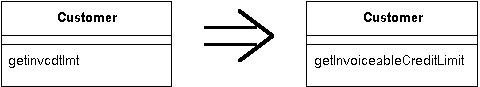

# 10장. Making Method Calls Simpler
[TOC]

## Rename Method
==메소드 이름이 그 목적을 드러내지 못하고 있다면 메소드의 이름을 바꿔라.==



### 동기
* 저자가 주장하는 코드 스타일의 중요한 부분
 * 복잡한 프로세스를 나누는 작은 메소드를 가지라는 것
 * 만약 이 스타일이 잘못 적용된다면, 작은 메소드들이 무엇을 하는지 알아내는데 어려움을 겪을수 있다.
 * **메소드의 이름을 잘 짓자**
* 이름을 잘 짓는 좋은 방법
 * 달린 주석의 의미를 생각해보고 그 주석을 메소드의 이름으로 바꾸는 것
* 인생이란 그렇듯 처음에는 적당한 이름을 짓기가 어렵다.
 * 그냥 남겨두고싶은 유혹.
 * 결국 그것은 단지 이름이니까.. <- 판단을 흐리게 하는 사악한 악마(Obfuscatis)의 농간 => 악마의 말을 듣지마라!
 * 이름이 잘못된 메소드를 반경하면, **반드시 이름을 바꿔라**
* 코드는
 * 첫째로 사람이 읽기 좋아야하고
 * 그 다음이 컴퓨터다.
 * 사람이 읽기 쉬우려면 좋은 이름을 가지고 있어야한다.
 * 메소드 이름이 명확했더라면 좀더 쉽게 할 수 있었던 일을 이름이 불명확해서 많은 시간을 소모했던 때를 상기하라.
* 이름을 잘 짓는 것은 연습이 필요한 기술이다.
 * 이 기술을 향상 시키는 것이 진정으로 숙련된 프로그래머가 되기 위한 열쇠이다.

### 절차
- 메소드 시그너처가 수퍼 클래스 또는 서브클래스에서 구현되고 있는지를 살펴본다. 만약 그렇다면, 구현된 부분에 대해서 이들 단계를 수행한다.
- 새로운 이름을 가진 새로운 메소드를 선언한다. 원래 메소드 몸체를 새로운 이름의 메소드로 복사하고, 적절히 수정한다.
- 컴파일 한다.
 - 원래 메소드는 새로 만든 메소드를 호출하도록 변경한다.
- 원래 메소드를 참조하는 부분이 적다면 이 단계를 생략해도 무방하다.
- 컴파일 테스트 한다.
- 원래 메소드를 참조하는 있는 모든 부분을 찾아서 새로운 메소드를 참조하도록 수정한다
- 각각의 변경에 대해서 컴파일, 테스트한다.
- 원래 메소드를 제거한다.
 - 원래 메소드가 인터페이스의 일부분이어서 없앨수 없다면, 그 메소드를 그대로 남겨두고 deprecated 되었다고 표시해둔다.
- 컴파일 테스트한다.

### 예제
* 어떤 사람의 전화번호를 알아내는 메소드
```java
public String getTelephoneNumber() {
       return ("(" + _officeAreaCode + ") " + _officeNumber);
   }
```

### 리팩토링
- 이 이름을 getOfficeTelephoneNumber로 바꾸기를 원한다.
- 새로운 메소드를 만들어서 원래 메소드 몸체를 새로운 메소드로 복사한다.
- 원래 메소드는 새로운 메소드를 호출하도록 변경한다.
```java
class Person...
    public String getTelephoneNumber(){
        return getOfficeTelephoneNumber();
    }
    public String getOfficeTelephoneNumber() {
        return ("(" + _officeAreaCode + ") " + _officeNumber);
    }
```
- 원래 메소드를 호출하는 부분들을 찾아서, 새로운 메소드를 호출하게 끔 한다.
- 모든 부분을 바꾸고 난 후, 원래 메소드를 없앨수 있다.
- 파라미터를 추가/삭제해야 하는 경우에도 절차는 동일하다.
- 원래 메소드를 호출하는 부분이 많지 않다면, 원래 메소드를 위임 메소드로 사용하지 않고, 호출 하는 부분을 새로운 메소드로 호출하도록 변경한다.

## Add Parameter
어떤 메소드가 그 메소드를 호출하는 부분에서 더 많은 정보를 필요로 한다면 이 정보를 넘길수 있는 객체에 대한 파라미터를 추가하라.


### 동기
- Add Parameter는 매우 일반적인 리팩토링이고, 한 경험이 있을 것이다.
- 동기
 - 간단하다. 메소드를 변경해야하는데, 변경하려면 이전에는 필요하지 않았던 정보가 필요하다.
 - 그래서 파라미터를 추가한다.
- 실제 말하려는 것은
 - 이 리팩토링을 하지 않도록 유도하는 것
 - 때로는 파라미터를 추가하는 것 대신에 다른 방법을 사용할 수 있다.
- 가능하면 다른 대안을 생각하라.
- 파라미터 길이를 증가시키지 않기 때문이다.
- 긴 파라미터 리스트는 기억하기가 어렵고 종종 데이터 덩어리를 필요로 하기 때문에 안 좋다.
- 존재하고 있는 파라미터를 살펴보라!
- 필요로 하는 정보를 현재 존재하고 있는 파라미터 중 하나에 요청할수 있는가?( 필요한 정보를 이 객체들중 하나에 요청할수 있는가? )
- 그렇지 않다면, 필요한 정보를 제공하는 메소드를 만드는 것이 이치에 맞는가? ( 메소드가 제대로 위치해 있는가?)
- 어디에 그 정보를 사용하려는가? (어디에서 사용하는가?)
- 그 동작이 그 정보를 가지고있는 다른 객체에 있어야하는게 아닌가? (정보의 위치가 어디에 있는지 확인하고 그 객체가 어디있는가?)
 - **Introduce Parameter Object**를 고려해본다.
- 결코 파라미터를 추가하지 말아야한다고 말하는 것은 아니다.
- 대안은 알고 있어야한다!

### 절차
- Add Parameter 절차는 Rename Method와 절차가 매우 유사하다.
- 메소드 시그너처가 수퍼 클래스 또는 서브클래스에서 구현되고 있는지를 살펴본다. 만약 그렇다면 각각 구현된 부분에 대해서 이들 단계를 수행한다.
- 추가된 파라미터를 가지는 새로운 메소드를 선언한다. 원래 메소드의 몸체를 새로운 메소드로 복사한다.
 - 두 개 이상의 파라미터를 추가해야 한다면, 한꺼번에 추가하는 것이 더 쉽다.
- 컴파일 한다.
- 원래 메소드 에서 새로 만든 메소드를 호출 하도록 변경한다.
 - 원래 메소드를 참조하는 부분이 적다면, 이 단계를 생략해도 무방하다.
 - 파라미터에 어떤 값이라도 넘길수 있지만, 일반적으로 객체 파라미터에는 null을 넘기고, 기본형 파라미터에는 명확히 이상한 값을 넘긴다. 숫자에서 0 이외의 다른 값을 사용해서 이런 경우를 좀더 쉽게 찾을 수 있도록 하는 것이 좋다.
- 컴파일, 테스트 한다.
- 원래 메소드를 참조하고 있는 모든 부분을 찾아서 새로운 메소드를 참조하도록 수정한다.
- 각각을 변경하고 컴파일, 테스트한다.
- 원래 메소드를 제거한다.
 - 원래 메소드가 인터페이스의 일부분이어서 없앨수 없다면, 그 메소드를 그대로 남겨두고 deprecated되었다고 표시한다.
- 컴파일, 테스트한다.

## Remove Parameter
파라미터가 메소드 몸체에서 더 이상 사용되지 않는다면, 그 파라미터를 제거하라


### 동기
- 프로그래머는 종종 파라미터를 추가하곤 하지만, 제거하기는 꺼린다
 - 불필요한 파라미터라도 문제를 일으키지는 않을테고
 - 나중에 그 파라미터를 다시 사용하게 될지도 모른다는 생각
 - 이런말을 하는 것은 판단을 흐리게 하는 악마(Obfuscatis)이다.
 - 악마를 추방하라.
- 파라미터는 필요한 정보를 나타낸다.
 - 다른 값은 다른 결과를 산출한다.
 - 메소드를 사용하는 사람에게 어떤 값을 넘겨줄 지에 대해 고민해야한다.
 - 불필요한 메소드를 제거하지 않음으로서 그 메소드를 사용하는 모든 사람들이 일을 더 많이 하게 만든다.
- 주의해야할 점은 다형성을 가진 메소드 이다.
 - 이 메소드를 구현하는 다른 부분에서 파라미터를 사용하지 않는지를 봐야한다.
 - 만일 사용한다면, 제거하지 말아야한다.
 - 별도의 메소드를 추가해도 되지만, 이와 같은 작업을 할만한 가치가 있는지 알아본다.

### 절차
- **Remove Parameter**의 절차는 **Rename Method**와 **Add Parameter**와 매우 유사하다.
- 메소드 시그너처가 수퍼클래스 또는 서브 클래스에서 구현되고 있는지를 살펴본다. 해당 클래스 또는 그 수퍼클래스가 이 파라미터를 사용하고 있다면 리팩토링 하면 안된다.
- 파라미터가 없는 새로운 메소드를 선언한다.
- 원래 메소드 몸체를 새로운 메소드로 복사한다.
 - 두 개 이상의 파라미터를 제거해야한다면, 한꺼번에 제거하는 것이 더 쉽다.
- 컴파일 한다.
- 원래 메소드에서 새로 만든 메소드를 호출 하도록 변경한다.
 - 원래 메소드를 참조하는 부분이 적다면, 이 단계를 생략해도 무방하다
- 컴파일, 테스트한다.
- 원래 메소드를 참조하는 모든 부분을 찾아서 새로운 메소드를 참조하게끔 수정한다.
- 컴파일, 테스트한다.
- 원래 메소드를 제거한다.
 - 원래 메소드가 인터페이스의 일부분이어서 없앨수 없다면, 그 메소드를 그대로 남겨두고, deperecated 되었다고 표시해 둔다.
- 컴파일, 테스트한다.


## Separate Query from Modifier

값을 리턴할 뿐만 아니라 객체의 상태도 변경하는 메소드를 가지고 있는 경우,
두 개의 메소드를 만들어서 하나는 값을 리턴하는 역할을 하고, 하나는 객체의 상태를 변경하는 역할을 하게 하라.


### 동기

* 부작용(side effect)을 가지고 있는 메소드와 부작용이 없는 메소드의 차이를 명확하게 구분하는 것이 좋다.
* 이를 따르는 좋은 규칙은, 값을 리턴하는 어떤 메소드라도 눈에 띌만한 부작용을 가지지 말아야 한다는 것이다.
* 값을 리턴하는 동시에 부작용도 가지고 있는 메소드를 발견한다면, 질의하는 부분과 변경하는 부분을 분리해야 한다.

### 절차

1. 원래 메소드와 동일한 값을 리턴하는 질의를 만든다.
	* 무엇이 리턴되는지를 알아보기 위해서 원래 메소드를 보라. 리턴된 값이 임시변수라면, 임시로 할당되는 위치를 보라.
2. 원래 메소드를 수정해서 질의에 대한 호출 결과를 리턴하도록 한다.
	* 원래 메소드의 모든 리턴 부분은 다른 것을 리턴하는 대신에 return newQuery()를 사용해야 한다.
	* 메소드가 리턴 값을 임시 변수에 한 번 할당하고 있다면, 여러분은 그것을 제거할 수 있어야 한다.
3. 컴파일, 테스트를 한다.
4. 각각의 호출부에 대해서, 원래 메소드를 호출하던 부분을 질의에 대한 호출로 대체한다. 원래 메소드에서, 질의를 호출하는 코드 앞에 원래 메소드를 호출하는 부분을 추가한다. 호출하는 메소드를 각각 변경한 후 컴파일, 테스트 한다.
5. 원래 메소드가 void 리턴 타입을 가지도록 하고 리턴 식(return expressions)을 제거한다.

### 예제

* 보안 시스템에서 악한의 이름을 알려주고, 경고를 보내는 메소드. 단 악한이 두명 이상일지라도 한번만 경고를 보낸다.
```java
String foundMiscreant(String[] people){
   for (int i = 0; i < people.length; i++) {
       if (people[i].equals ("Don")){
          sendAlert();
          return "Don";
       }
       if (people[i].equals ("John")){
          sendAlert();
          return "John";
       }
   }
   return "";
}
```

* 호출하는 코드.
```java
void checkSecurity(String[] people) {
   String found = foundMiscreant(people);
   someLaterCode(found);
}
```

* 질의하는 부분을 변경하는 부분과 분리하기 위해서, 먼저 원래 메소드와 같은 값을 리턴하지만 부작용을 가지지 않는 적당한 질의 메소드를 만들 필요가 있다.
```java
String foundPerson(String[] people){
    for (int i = 0; i < people.length; i++) {
        if (people[i].equals ("Don")){
           return "Don";
        }
        if (people[i].equals ("John")){
           return "John";
        }
    }
    return "";
}
```

* 원래 메소드의 리턴하는 모든 부분이 새로운 질의 메소드를 호출하도록 바꾼다. 바꾸고 나서 테스트 한다.
```java
String foundMiscreant(String[] people){
   for (int i = 0; i < people.length; i++) {
       if (people[i].equals ("Don")){
          sendAlert();
          return foundPerson(people);
       }
       if (people[i].equals ("John")){
          sendAlert();
          return foundPerson(people);
       }
   }
   return foundPerson(people);
}
```

* 원래 메소드를 호출하는 모든 메소드가 위의 두 메소드를 호출하도록 바꾼다. 먼저 변경 메소드(modifier)를 호출하고, 그 다음 질의 메소드를 호출한다.
```java
void checkSecurity(String[] people) {
    foundMiscreant(people);
    String found = foundPerson(people);
    someLaterCode(found);
}
```

* 이제 변경 메소드가 void 리턴 타입을 가지도록 변경할 수 있다.
```java
 void foundMiscreant (String[] people){
   for (int i = 0; i < people.length; i++) {
       if (people[i].equals ("Don")){
          sendAlert();
          return;

       }
       if (people[i].equals ("John")){
          sendAlert();
          return;
       }
   }
}
```

* 이제 원래 메소드의 이름을 바꾸는 것이 좋을 것 같다.
```java
void sendAlert (String[] people){
   for (int i = 0; i < people.length; i++) {
       if (people[i].equals ("Don")){
          sendAlert();
          return;

       }
       if (people[i].equals ("John")){
          sendAlert();
          return;
       }
   }
}
```

* 이 경우에는 변경 메소드가 질의 메소드의 몸체를 사용해서 필요한 작업을 하기 때문에 코드가 많이 중복된다. 따라서 변경 메소드에 Substitute Algorithm을 사용해서 중복된 코드를 제거할 수 있다.
```java
void sendAlert(String[] people){
   if (! foundPerson(people).equals(""))
       sendAlert();
}
```

==컨커런시 문제 (Concurrency Issues)==

멀티 쓰레드 시스템에서 작업하고 있다면, 한 번의 동작에서 테스트 하고 연산을 하는 것이 중요한 특징이라는 것을 알 것이다.
이러한 점이 Separate Query from Modifier 와 모순이 될것인가?
저자는 Doug Lea와 이 문제에 대해 이야기했고, 충돌하지는 않지만, 추가 작업이 필요하다는 결론을 내렸다.
따라서 여전히 질의 연산과 변경 연산을 분리하는 것은 유용하다. 그러나 이것을 둘 다 하는 제 3의 메소드를 계속 가질 필요가 있다.


## Parameterize Method

몇몇 메소드가 메소드 몸체에 다른 값을 포함하고 있는 것을 제외하고는,
비슷한 일을 하고 있다면,
다른 값을 파라미터로 넘겨 받는 하나의 메소드를 만들어라.


### 동기

* 기능은 비슷하지만 몇 가지 값에 따라 결과가 달라지는 메서드가 여러 개 있을 때 각 메서드를 전달된 매개변수에 따라 다른 값을 처리하는 하나의 메서드로 만들면 편리하다.
* 중복된 코드가 없어지고 유연성이 좋아진다.

### 절차

1. 각각의 반복되는 메소드를 대신할 수 있는 파라미터를 가진 메소드를 만든다.
2. 컴파일 한다.
3. 원래 메소드 중 하나를 골라서 새로운 메소드를 호출하게 한다.
4. 컴파일, 테스트를 한다.
5. 모든 메소드에 대해서 이와 같은 작업을 반복한다. 각각 끝날 때마다 테스트 한다.

### 예제

* 단순한 메소드 형식
```java
class Employee {
    void tenPercentRaise () {
        salary *= 1.1;
  }

    void fivePercentRaise () {
        salary *= 1.05;
  }
```

* 다음과 같은 메소드로 대체될 수 있다.
```java
void raise (double factor) {
	salary *= (1 + factor);
}
```

* 조금 더 복잡한 메소드 형식
```java
protected Dollars baseCharge() {
    double result = Math.min(lastUsage(),100) * 0.03;
    if (lastUsage() > 100) {
        result += (Math.min (lastUsage(),200) - 100) * 0.05;
    };
    if (lastUsage() > 200) {
        result += (lastUsage() - 200) * 0.07;
    };
    return new Dollars (result);
}
```

* 다음과 같이 대체될 수 있다.
``` java
protected Dollars baseCharge() {
    double result = usageInRange(0, 100) * 0.03;
    result += usageInRange (100,200) * 0.05;
    result += usageInRange (200, Integer.MAX_VALUE) * 0.07;
    return new Dollars (result);
}
protected int usageInRange(int start, int end) {
    if (lastUsage() > start) return Math.min(lastUsage(),end) - start;
    else return 0;
}
```

* 비결은 파라미터로 넘겨 받을 수 있는 몇개의 값을 기초로 해서 반복되는 코드를 찾아내는 것이다.


## Replace Parameter with Explicit Methods

파라미터의 값에 따라서 다른 코드를 실행하는 메소드가 있다면,
각각의 파라미터 값에 대한 별도의 메소드를 만들어라.

```java
void setValue (String name, int value) {
   if (name.equals("height"))
       _height = value;
   if (name.equals("width"))
       _width = value;
   Assert.shouldNeverReachHere();
}
```
```java
void setHeight(int arg) {
   _height = arg;
}
void setWidth (int arg) {
   _width = arg;
}
```

### 동기

* Replace Parameter with Explicit Methods 는 Parameterize Method의 반대이다.
* 어떤 파라미터에 대해 구별되는(discrete) 값을 가지고 있고, 조건문에서 이 값을 검사해서 이 값에 따라 다른 일을 할 때 이 리팩토링을 적용한다.
* 호출부는 파라미터에 값을 넘겨서 무슨 일을 하고 싶은지를 결정하고 있으므로, 별도의 메소드를 만들어서 조건문을 거치지 않도록 하는것이 낫다.
* 이렇게 하면 조건에 따른 행동을 피할 뿐만 아니라 컴파일 할 때 확인을 할 수 있고(complie time check) 인터페이스가 좀 더 명확해진다.
* 파라미터로 어떤 일을 할 지 결정하는 경우, 그 메소드를 사용하는 모든 프로그래머는 클래스에서 그 메소드를 살펴봐야 할뿐만 아니라 유효한 파라미터값을 결정해야 한다.
* 심지어 컴파일 시 확인 이 장점이 아닌 경우에도, 명시적인 인터페이스가 명확해진다는 것은 가치 있을수 있다. 예를 들어 메소드가 하는 일이 단지 내부의 boolean 값을 설정하는 경우일지라도, Switch.beOn() 이 Switch.setState(true) 보다 훨씬 더 명확하다.
* 파라미터 값들이 많이 변할 것 같다면 Replace Parameter with Explicit Methods를 사용하지 말아야 한다.
* 조건에 따른 동작이 필요하다면, Replace Conditional with Polymorphism을 사용하는 것을 고려하라.

### 절차

1. 각각의 파라미터 값에 대한 명시적인 메소드를 만든다.
2. 조건문의 각 부분에서, 새로 만든 적절한 메소드를 호출한다.
3. 각각을 변경한 후에 컴파일, 테스트를 한다.
4. 조건문 메소드를 호출하던 부분이 새로 만든 적절한 메소드를 호출하도록 변경한다.
5. 컴파일, 테스트를 한다.
6. 호출하는 부분을 모두 바꾸고 난 후에, 조건문 메소드를 제거한다.

### 예제

* 파라미터로 넘어온 값을 기초로 하여 Employee의 서브클래스 객체를 만드는 예제
	* 이런 코드는 종종 Replace Constructor with Factory Method 의 결과로 생긴다.

```java
static final int ENGINEER = 0;
static final int SALESMAN = 1;
static final int MANAGER = 2;

static Employee create(int type) {
   switch (type) {
       case ENGINEER:
          return new Engineer();
       case SALESMAN:
          return new Salesman();
       case MANAGER:
          return new Manager();
       default:
          throw new IllegalArgumentException("Incorrect type code value");
   }
}
```
* 팩토리 메소드이기 때문에, Replace Conditional with Polymorphism을 쓸 수 없다. 아직 객체를 만들지 않았기 때문이다.
* 서브클래스가 아주 많을 거라고 예상하지 않으므로, 명시적인 인터페이스를 사용하는 것이 이치에 맞는다.
* 먼저 새로운 메소드를 만든다.
```java
static Employee createEngineer() {
   return new Engineer();
}
static Employee createSalesman() {
   return new Salesman();
}
static Employee createManager() {
   return new Manager();
}
```

* switch 문 안에 있는 case 를 하나씩 명시적인 메소드에 대한 호출로 바꾼다.
```java
static Employee create(int type) {
    switch (type) {
        case ENGINEER:
        	return Employee.createEngineer();
        case SALESMAN:
        	return Employee.createSalesman();
        case MANAGER:
        	return Employee.createManager();
        default:
        	throw new IllegalArgumentException("Incorrect type code value");
    }
}
```
* 이제 원래 메소드를 호출하던 부분을 바꾼다.
```java
Employee kent = Employee.create(ENGINEER)
```
```java
Employee kent = Employee.createEngineer()
```

## Preserve Whole Object

어떤 객체에서 여러개의 값을 얻은 다음 메소드를 호출하면서 파라미터로 넘기고 있다면, 
대신 그 객체를 파라미터로 넘겨라.

```java
int low = daysTempRange().getLow();
int high = daysTempRange().getHigh();
withinPlan = plan.withinRange(low, high);
```
```java
withinPlan = plan.withinRange(daysTempRange());
```

### 동기

* 객체가 어떤 메소드를 호출할 때, 한 객체에서 얻은 여러개의 데이터 값을 파라미터로 넘겨 줄 때 발생한다.
* 이 방법의 문제점은 만약 호출된 객체가 나중에 새로운 데이타 값을 필요로 한다면, 이 메소드를 호출하고 있는 모든 부분을 찾아서 변경해야 한다는 것이다.
* 여러 개의 데이터를 넘겨주는 대신에 객체를 넘겨줌으로써 이런 문제점을 피할 수 있다.
* 파라미터 리스트가 변경에 유연하게 대처할 수 있도록 하는 것 이외에도, 종종 코드를 좀더 읽기 좋게 만든다.
	* 긴 파라미터 리스트를 가지면 변수가 어디에 있어야 하는지를 기억해야 하기 때문에 작업하기 어려울 수 있다.
	* 호출되는 객체는 중간 값을 계산하기 위해서 전체 객체(whole object, 파라미터로 넘겨 받은 값이 추출된 객체)에 있는 어떠한 다른 메소드도 이용할 수가 없기 때문에 중복된 코드가 생길수 있다.
* 단점
	* 파라미터로 객체를 넘기는 것은 파라미터로 넘겨진 객체와 호출된 객체사이에 종속성을 만든다.
	* 이것이 종속성 구조를 나쁘게 만든다면, Preserve Whole Object를 사용하지 마라.
	* 정의된 전체 객체를 아직 가지고 있지 않을 경우에는 Introduce Parameter Object가 필요하다.
	* 호출하는 객체가 자신의 데이터 값 중 여러개를 파라미터로 넘기는 경우에는, 적당한 get 메소드를 가지고 있고 종속성을 염려하지 않는다면, this 를 파라미터로 넘길 수 있다.

### 절차

1. 데이터를 가지고 있는 전체 객체를 위한 새로운 파라미터를 만든다.
2. 컴파일, 테스트를 한다.
3. 어느 파라미터를 전체 객체에서 얻어야 하는지 결정한다.
4. 하나의 파라미터를 취하고, 메소드안에서 이 파라미터를 참조하던 부분을 파라미터로 넘겨 받은 전체 객체에 있는 적당한 메소드 호출로 바꾼다.
5. 파라미터를 삭제한다.
6. 컴파일, 테스트 한다.
7. 전체 객체에서 값을 얻을 수 있는 각각의 파라미터에 대해서 반복한다.
8. 호출하는 메소드에서 삭제된 파라미터를 얻고 있는 코드를 제거한다.
9. 물론 그 코드가 어딘가 다른 곳에서 이 파라미터를 사용하고 있지 않다면.
10. 컴파일, 테스트 한다.

### 예제

* 하루동안 가장 높은 온도와 가장 낮은 온도를 기록하는 Room객체를 생각해보자. 이 온도의 범위를 미리 정의된 난방 계획에서의 온도 범위와 비교할 필요가 있다.
```java
class Room...
boolean withinPlan(HeatingPlan plan) {
    int low = daysTempRange().getLow();
    int high = daysTempRange().getHigh();
    return plan.withinRange(low, high);
}
class HeatingPlan...
boolean withinRange (int low, int high) {
    return (low >= _range.getLow() && high <= _range.getHigh());
}
private TempRange _range;
```

* 먼저 전체 객체를 파라미터 리스트에 추가한다.
```java
  class HeatingPlan...
    boolean withinRange (TempRange roomRange, int low, int high) {
        return (low >= _range.getLow() && high <= _range.getHigh());
    }

  class Room...
    boolean withinPlan(HeatingPlan plan) {
        int low = daysTempRange().getLow();
        int high = daysTempRange().getHigh();
        return plan.withinRange( daysTempRange(), low, high);
    }
```

* 파라미터 중 하나를 골라서 전체 객체에 있는 메소드로 대체한다.
```java
  class HeatingPlan...
    boolean withinRange (TempRange roomRange, int high) {
        return ( roomRange.getLow() >= _range.getLow() && high <= _range.getHigh());
    }

  class Room...
    boolean withinPlan(HeatingPlan plan) {
        int low = daysTempRange().getLow();
        int high = daysTempRange().getHigh();
        return plan.withinRange(daysTempRange(), high);
    }
```

* 필요한 모든 부분이 변경될 때까지 계속한다.
```java
  class HeatingPlan...
    boolean withinRange (TempRange roomRange) {
        return (roomRange.getLow() >= _range.getLow() && roomRange.getHigh() <= _range.getHigh());
    }
  class Room...
    boolean withinPlan(HeatingPlan plan) {
        int low = daysTempRange().getLow();
        int high = daysTempRange().getHigh();
        return plan.withinRange(daysTempRange());
    }
```

* 더이상 임시 변수가 필요하지 않다.
```java
class Room...
boolean withinPlan(HeatingPlan plan) {
    return plan.withinRange(daysTempRange());
}
```

* 전체 객체를 사용하다 보면, 동작을 다루는 것을 좀더 쉽게 하기 위해서 동작을 전체객체로 옮길 수 있다.
```java
class HeatingPlan...
boolean withinRange (TempRange roomRange) {
    return (_range.includes(roomRange));
}
class TempRange...
boolean includes (TempRange arg) {
    return arg.getLow() >= this.getLow() && arg.getHigh() <= this.getHigh();
}
```

## Replace Parameter with Method

객체가 메소드를 호출한 다음, 결과를 다른 메소드에 대한 파라미터로 넘기고 있다. 수신자(Receiver - 파라미터를 넘겨받는 메소드) 또한 이 메소드를 호출할 수 있다면, 
그 파라미터를 제거하고 수신자가 그 메소드를 호출하도록 하라

```java
int basePrice = _quantity * _itemPrice;
discountLevel = getDiscountLevel();
double finalPrice = discountedPrice (basePrice, discountLevel);
```
```java
int basePrice = _quantity * _itemPrice;
double finalPrice = discountedPrice (basePrice);
```

### 동기

* 어떤 메소드가 파라미터로 넘겨 받는 값을 다른 방법을 사용해서 얻을 수 있다면, 그렇게 해야한다.
* 객체가 그 객체에 있는 메소드를 호출하고 있고, 넘겨줄 파라미터를 계산하는 과정에서 호출하는 메소드의 다른 파라미터를 참조하지 않고 있다면, 계산하는 과정을 수신자(receiver) 메소드 안에 추가함으로써 이 파라미터를 제거할 수 있다.
	* 호출하는 객체에 대한 참조를 가지고 있는 다른 객체에 있는 메소드를 호출하고 있는 경우에도 성립한다.
* 계산하는 부분이 호출하는 메소드의 다른 파라미터에 의존하고 있다면, 이 파라미터는 제거할 수 없다. 왜냐하면 이 파라미터는 메번 호출에서 변할 것이기 때문이다.
* 인터페이스 변경의 결과로 긴 빌드 절차나 내장된 수많은 코드를 바꿔야 하는 것과 같이 전체 프로그램에 고통스러운 결과가 생기는 경우에 대해서는 예외를 둔다.

### 절차

1. 필요하다면, 파라미터를 계산하는 부분을 메소드로 뽑아낸다.
2. 메소드 몸체에서 파라미터를 참조하고 있는 부분을 메소드에 대한 참조로 바꾼다.
3. 각각 바꾸고 나서 컴파일, 테스트를 한다.
4. Remove Parameter를 사용해서 그 파라미터를 제거한다.

### 예제

* 주문 할인에 대해 별로 있을 것 같지 않은 또 다른 변형은 다음과 같다.
```java
public double getPrice() {
   int basePrice = _quantity * _itemPrice;
   int discountLevel;
   if (_quantity > 100) discountLevel = 2;
   else discountLevel = 1;
   double finalPrice = discountedPrice (basePrice, discountLevel);
   return finalPrice;
}
private double discountedPrice (int basePrice, int discountLevel) {
   if (discountLevel == 2) return basePrice * 0.1;
   else return basePrice * 0.05;
}
```

* 할인 정도를 계산하는 부분을 뽑아내는 것부터 시작한다.
```java
public double getPrice() {
   int basePrice = _quantity * _itemPrice;
   int discountLevel = getDiscountLevel();
   double finalPrice = discountedPrice (basePrice, discountLevel);
   return finalPrice;
}
private int getDiscountLevel() {
   if (_quantity > 100) return 2;
   else return 1;
}
```

* discountedPrice 메소드에서 파라미터를 참조하는 부분을 다음과 같이 한다.
```java
private double discountedPrice (int basePrice, int discountLevel) {
   if (getDiscountLevel() == 2) return basePrice * 0.1;
   else return basePrice * 0.05;
}
```

* Remove Parameter 를 사용한다.
```java
public double getPrice() {
   int basePrice = _quantity * _itemPrice;
   int discountLevel = getDiscountLevel();
   double finalPrice = discountedPrice (basePrice);
   return finalPrice;
}
private double discountedPrice (int basePrice) {
   if (getDiscountLevel() == 2) return basePrice * 0.1;
   else return basePrice * 0.05;
}
```

* 이제 임시 변수를 없앨 수 있다.
```java
public double getPrice() {
   int basePrice = _quantity * _itemPrice;
   double finalPrice = discountedPrice (basePrice);
   return finalPrice;
}
```

* 다른 파라미터와 임시변수를 제거한다.
```java
public double getPrice() {
   return discountedPrice ();
}
private double discountedPrice () {
   if (getDiscountLevel() == 2) return getBasePrice() * 0.1;
   else return getBasePrice() * 0.05;
}
private double getBasePrice() {
   return _quantity * _itemPrice;
}
```

* discountedPrice 메소드에 Inline Method를 사용하는 것이 낫다.
```java
private double getPrice () {
   if (getDiscountLevel() == 2) return getBasePrice() * 0.1;
   else return getBasePrice() * 0.05;
}
```

##Introduce Parameter Object
여러 개의 매개변수가 항상 붙어 다닐 땐 그 매개변수들을 객체로 바꾸자.


### 동기
* 데이터 전부를 운반하는 객체로 바꾸기.
    * 늘 함께 전달되는 특정 파라미터 그룹이 있는 경우
    * 여러 개의 메소드가 하나 혹은 여러개의 클래스에서 이 파라미터 그룹을 사용하는 경우
* 파라미터 리스트의 길이를 줄이므로 유용하다.
* 파라미터를 한 덩이로 만들면 기능을 새로 만든 클래스로 옮길 수 있다.
	* 여러 메소드 안에서 파라미터 값을 공통으로 조작하는 경우, 이 동작을 새로운 객체로 옮김으로써 많은 중복된 코드를 제거할 수 있다.

###절차
* 대체하려는 파라미터 그룹을 나타낼 새로운 클래스를 만든다. 그 클래스를 불변성(immutable)으로 한다.
* 컴파일 한다.
* Add Parameter를 사용하여 새로 만든 클래스를 파라미터에 추가한다. 이 메소드를 호출하는 모든 부분에서 null을 설정한다.
	* 메소드를 호출하는 부분이 많다면, 원래 메소드 시그너쳐를 그대로 가지고 원래 메소드가 새로운 메소드를 호출하게 할 수 있다.
	* 원래 메소드에 리팩토링을 적용한 뒤, 원래 메소드 호출 부분을 새로운 메소드를 호출하도록 바꾸고, 원래 메소드를 제거하라.
* 데이터 덩어리에 있는 각각의 파라미터에 대해, 시그너처에서 그 파라미터를 제거한다. 메소드를 호출하는 부분과 메소드 몸체를 수정하여 제거한 파라미터 값 대신에 파라미터 객체를 사용하도록 하라.
* 각각의 파라미터를 제거하고 난 후에 컴파일, 테스트를 한다.
* 관련된 파라미터를 제거하고 난 후에, Move Method를 사용하여 파라미터 객체로 옮길 수 있는 동작을 찾아본다.
	* 메소드의 일부분이라면 먼저 Extract Method를 사용하여 새로운 메소드를 만들고 이 메소드를 파라미터 객체로 옮겨라.

### 예제

* ```java
class Entry...
    Entry (double value, Date chargeDate) {
        _value = value;
        _chargeDate = chargeDate;
    }
    Date getDate(){
        return _chargeDate;
    }
    double getValue(){
        return _value;
    }
    private Date _chargeDate;
    private double _value;
```

* Account 클래스에는 임금액 컬렉션이 들어 있고,
	* 두 날짜 사이의 계좌 입출금 현황을 알아내는 메서드가 들어가 있다.
* ```java
 class Account...
		double getFlowBetween (Date start, Date end) {
            double result = 0;
            Enumeration e = _entries.elements();
            while (e.hasMoreElements()) {
                Entry each = (Entry) e.nextElement();
                if (each.getDate().equals(start) ||
                    each.getDate().equals(end) ||
                     (each.getDate().after(start) && each.getDate().before(end)))
                {
                    result += each.getValue();
                }
            }
            return result;
        }
		private Vector _entries = new Vector();

  		//client code...
    	double flow = anAccount.getFlowBetween(startDate, endDate);
```

* 시작일과 종료일을 범위를 처리하는 단순 데이터 클래스를 선언한다.
	* DataRange 클래스의 모든 값을 final로 선언하여 변경불가로 만들었다.
	* 자바의 매개변수는 값을 이용한 전달 방식을 사용하는데 그 원리를 흉내
	* 이 리팩토링 기법은 반드시 DataRange 클래스가 변경 불가여야 한다.
* ```java
class DateRange {
        DateRange (Date start, Date end) {
            _start = start;
            _end = end;
        }
        Date getStart() {
            return _start;
        }
        Date getEnd() {
            return _end;
        }
        private final Date _start;
        private final Date _end;
}
```

* 먼저 파라미터 리스트에 범위 클래스를 추가한다.
```java
class Account...
    double getFlowBetween (Date start, Date end, DateRange range ) {
        double result = 0;
        Enumeration e = _entries.elements();
        while (e.hasMoreElements()) {
            Entry each = (Entry) e.nextElement();
            if (each.getDate().equals(start) ||
                each.getDate().equals(end) ||
                (each.getDate().after(start) && each.getDate().before(end)))
            {
                result += each.getValue();
            }
        }
        return result;
    }

    //client code...
    double flow = anAccount.getFlowBetween(startDate, endDate, null);
```

* 파라미터 중 하나(start)를 제거하고 대신 새로운 객체를 사용한다.
```java
class Account...
    double getFlowBetween(Date end, DateRange range) {
        double result = 0;
        Enumeration e = _entries.elements();
        while (e.hasMoreElements()) {
            Entry each = (Entry) e.nextElement();
            if (each.getDate().equals(range.getStart()) ||
                each.getDate().equals(end) ||
                (each.getDate().after(range.getStart()) && each.getDate().before(end))) {
                result += each.getValue();
            }
        }
        return result;
    }

  	//client code...
    double flow = anAccount.getFlowBetween(endDate, new DateRange (startDate, null));
```

* 다음 파라미터를 제거한다.(end)
```java
class Account...
    double getFlowBetween(DateRange range) {
        double result = 0;
        Enumeration e = _entries.elements();
        while (e.hasMoreElements()) {
            Entry each = (Entry) e.nextElement();
            if (each.getDate().equals(range.getStart()) ||
                each.getDate().equals(range.getEnd()) ||
                (each.getDate().after(range.getStart()) && each.getDate().before(range.getEnd()))) {
                result += each.getValue();
            }
        }
        return result;
    }

   //client code...
   double flow = anAccount.getFlowBetween(new DateRange (startDate, endDate));
```

* 다른 메소드의 동작을 새로운 객체로 옮김으로써 좀 더 많은 가치를 얻을 수 있다.
* Extract Method와 Move Method를 이용하여 다음과 같이 바꿀 수 있다.
```java
class Account {
    double getFlowBetween(DateRange range) {
        double result = 0;
        Enumeration e = _entries.elements();
        while (e.hasMoreElements()) {
            Entry each = (Entry) e.nextElement();
            if (range.includes(each.getDate())) {
                result += each.getValue();
            }
        }
        return result;
    }
}

 class DateRange {
    boolean includes(Date arg) {
        return (arg.equals(_start) ||
                arg.equals(_end) ||
                (arg.after(_start) && arg.before(_end)));
    }
}
```


##Remove Setting Method
생성할 때 지정한 필드 값이 절대로 변경되지 말아야 할 땐 그 필드를 설정하는 모든 쓰기 메서드를 삭제하자.


###동기
* 객체가 생성되고 나서 어떤 필드 값이 바뀌는 것을 원하지 않는다면,
	* set 메소드를 제공하지 마라(그 필드는 final로 만들어라).
	* 의도가 명확해지고, 그 필드 값이 변할지도 모르는 가능성이 없어진다.
* 간접 접근 방식(indirect variable access)를 맹목적으로 사용할 때 발생한다.
	* 속성, 쓰기 메서드를 생성자 안에까지 넣는다.

###절차
* set 메소드가 단지 생성자에서만 호출되는지, 생성자에 의해 호출되는 메소드 안에서 호출되는지 검사한다.
* 생성자가 그 변수를 직접 접근하도록 수정한다.
	* 서브클래스에서 수퍼클래스의 private 필드 값을 설정하고 있는 경우에는, 수퍼 클래스에 proteted 메소드(이상적으로는 생성자)를 제공하도록 시도해봐야 한다.
	* 어떤 경우라도 수퍼클래스 메소드의 이름을 지을 때 set 메소드와 혼동 되는 이름을 짓지 마라.
* 컴파일, 테스트를 한다.
* 값을 설정하는 메소드를 제거하고 그 필드를 final로 한다.
* 컴파일 한다.
* 필드가 final이 아니라면, final로 선언한다.
* 컴파일, 테스트를 한다.


###예제
* ```java
class Account {
	private String _id;
	Account (String id) {
		setId(id);
	}

	void setId (String arg) {
		_id = arg;
	}
}
```
* 위의 코드는 다음과 같이 바뀐다.
```java
class Account {
	private final String _id;
	Account (String id) {
		_id = id;
	}
}
```

* 문제는 코드를 조금 변형하면 드러난다.

* 첫 번째 문제. 매개변수로 계한을 수행 할 경우
```java
class Account {
	private String _id;
	Account (String id) {
		setId(id);
	}
	
	void setId (String arg) {
		_id = "ZZ" + arg;
	}
}
```

* 변경이 간단하고, 생성자가 하나라면 생성자를 수정해도 되지만,
	* 변경이 복잡하거나 별도의 메서드를 호출해야 할 때는 따로 메서드를 하나 작성해야 한다.
	* 이때 메서드 이름은 의도가 확실히 드라나게 정해야 한다.
* ```java
class Account {
	private final String _id;
	Account (String id) {
		initializeId(id);
	}
	
	void initializeId (String arg) {
		_id = "ZZ" + arg;
	}
}
```

* 두 번째 문제. 하위클래스가 상위클래스의 private 변수를 초기화하는 경우
```java
class InterestAccount extends Account {
	private double _interestRate;
	public InterestAccount (String id, double rate) {
		setId(id);
		_interestRate = rate;
	}
}
```

* 문제는 id 변수에 직접 접근해서 값을 설정할 수 없다.
	* 최선의 방법은 상위클래스 생성자를 사용하는 것이다.
* ```java
class InterestAccount extends Account {
	private double _interestRate;
	public InterestAccount (String id, double rate) {
		super(id);
		_interestRate = rate;
	}
}
```

* 혹시 그 방법을 사용할 수 없을 땐,
	* 잘 지어진 메서드를 사용하는 게 최선이다.
* ```java
class InterestAccount extends Account {
	private double _interestRate;
	public InterestAccount (String id, double rate) {
		initializeId(id);
		_interestRate = rate;
	}
}
```

* 세 번째 문제. 컬렉션 값을 설정하는 경우
```java
class Person {
	private Vector _courses

	Vector getCourses() {
		return _courses;
	}
	void setCourses (Vector arg) {
		_courses - arg
	}
}
```

* 컬렉션 값을 설정한는 부분 대신, 컬렉션에 어떤 것을 추가 삭제하는 기능으로 대체하고 싶은 경우
	* 컬렉션 캡슐화 기법을 참고한다.

##Hide Method
메서드가 다른 클래스에 사용되지 않을 땐 그 메서드의 반환 타입을 private로 만들자.


### 동기
* 리팩토링을 하면서 종종 메소드의 접근 권한을 바꿀 경우가 있다.
    * 접근 권한을 확장해야 할 경우는 찾기 쉽다.
	* 반대로 접근 권한을 줄이는 것은 정기적으로 검사하여 찾아내야 한다.
* 거의 캡슐화된 데이터 보관 클래스를 가지고 시작할 때,
    * 클래스 안에 넣은 기능이 많을수록, get/set 메소드의 상당 부분이 공개될 필요가 없어지므로, 그 메소드를 숨긴다.
	* get/set 메소드를 private으로 만들고 직접 접근(direct variable access)을 사용하여 메소드를 제거할 수도 있다.

### 절차
* 메소드의 접근 권한을 좀 더 줄일 수 있는지 정기적으로 검사한다.
    * lint 형식의 도구를 사용하고 때때로 직접 검사하라. 그리고 다른 클래스에서 그 메소드를 호출하는 부분을 제거할 때 검사하라.
    * 특히 set 메소드에서 이와 같은 경우를 검사하라.
* 가능하면 각각의 메소드 접근 권한을 private으로 한다.
* private 타입으로 만들 때마다 테스트를 실시하자.
	* 컴파일러는 자연히 검사하기 때문에, 하나씩 컴파일 할 필요가 없다. 어떤 것이 잘못되고 있다면, 찾아내기도 쉽다.

##Replace Constructor with Factory Method
객체를 생성할 때 단순한 생성만 수행하게 해야 할 땐 생성자를 팩토리 메서드로 교체하자
```java
Employee (int type) {
	_type = type;
}
```
```java
static Employee create(int type) {
	return new Employee(type);
}
```


###동기
* 분류 부호를 서브클래스로 대체할 때,
	* 분류 코드 값을 가지고 생성되는 객체를 가지고 있었지만, 이제는 서브클래스를 필요로 하는 객체를 가지고 있으며,
	* 분류 코드에 의해 서브 클래스가 결정이 되고, 생성자는 단지 요청된 객체의 인스턴스만 리턴할 수 있는 경우, -> 팩토리 메소드로 대체
* 생성자가 너무 제한적인 경우에도, 팩토리 메소드를 사용
* 팩토리 메소드는 Change Value To Reference에 필수적이다.
* 팩토리 메소드는 파라미터의 숫자와 타입값이 범위를 벗어날 경우에 다른 생성 동작을 나타내는데 사용될 수도 있다.

###절차
* 팩토리 메소드를 만들다. 이 메소드의 몸체에서 현재의 생성자를 호출하도록 한다.
* 생성자를 호출하고 있는 모든 부분이 팩토리 메소드를 호출하도록 바꾼다.
* 각각을 바꾸고 나서 컴파일, 테스트를 한다.
* 생성자를 private으로 선언한다.
* 컴파일한다.

### 예제

* 사원 급여 시스템 예제
```java
class Employee {
       private int _type;
       static final int ENGINEER = 0;
       static final int SALESMAN = 1;
       static final int MANAGER = 2;

       Employee (int type) {
           _type = type;
       }
}
```

* 타입 코드에 대응하는 Employee의 서브 클래스를 만들고 싶다. 팩토리 메소드가 필요하다.
```java
static Employee create(int type) {
      return new Employee(type);
   }
```

* 생성자를 호출하는 부분을 팩토리 메소드 호출로 바꾸고, 생성자를 private으로 바꾼다.
```java
    // client code...
    Employee eng = Employee.create(Employee.ENGINEER);

    class Employee...
        private Employee (int type) {
        	_type = type;
        }
```

* 여기서는, 생성된 객체의 클래스에서 생성 호출의 결과를 받는 수신 메서드를 분리했다는 점 이외에 크게 얻은 것이 없다.

### 예제 : 문자열을 이용한 서브클래스 객체 생성

* 분류 코드를 Employee의 서브클래스로 바꾸기 위해서 Replace Type Code with Subclass를 적용하면,
	* 팩토리 메소드를 사용하여 서브클래스를 클라이언트로부터 감출 수 있다.
* ```java
static Employee create(int type) {
       switch (type) {
           case ENGINEER:
              return new Engineer();
           case SALESMAN:
              return new Salesman();
           case MANAGER:
              return new Manager();
           default:
              throw new IllegalArgumentException("Incorrect type code value");
       }
   }
```

* 위의 코드는 case 문을 가지게 된다. 새로운 서브클래스를 추가할 때, switch문도 업데이트해야한다.
* 이 경우 Class.forName을 사용하는 것이 좋은 방법
	* 파라미터의 타입을 바꾸는 것 : Rename Method의 변형
* 파라미터로 String 값을 받는 새로운 메소드를 만든다.
```java
static Employee create (String name) {
       try {
           return (Employee) Class.forName(name).newInstance();
       } catch (Exception e) {
           throw new IllegalArgumentException ("Unable to instantiate" + name);
       }
   }
```

* 타입 값을 정수로 받는 팩토리 메소드에서 이 메소드를 호출하도록 바꾼다.
```java
class Employee {
   static Employee create(int type) {
       switch (type) {
           case ENGINEER:
              return create("Engineer");
           case SALESMAN:
              return create("Salesman");
           case MANAGER:
              return create("Manager");
           default:
              throw new IllegalArgumentException("Incorrect type code value");
       }
   }
```

* 그리고 create 메소드를 호출하는 부분을 찾아서 아래와 같이 바꾼다.
* ```java
Employee.create(ENGINEER)
 ```
* ```java
 Employee.create("Engineer")
```


*  이 방법은 서브 클래스를 추가할 때 create 메소드를 업데이트 할 필요가 없다.
	* 그러나, 컴파일 할 때 오류를 체크할 수 없다.
	* 오타로 인해 런타임 에러가 발생한다.
* 이것이 중요한 문제라면 명시적인 메소드를 사용한다.
	* 하위 클래스를 하나 추가 할 때마다 새 메서드도 추가해야햔다.
* 유연성과 안정성 사이의 절충점
* 방법을 잘못 택했을 때는 다음을 사용해서 번복할 수 있다.
    * Parameterize Method
    * Replace Parameter with Explicit Methods
* Class.forName 사용시 주의해야 하는 이유
    * 서브 클래스 이름이 클라이언트에 드러난다.
    * 다른 문자열을 사용하여 팩토리 메소드로 다른 동작을 행할 수도 있으므로 아주 나쁘지는 않다.
    * 팩토리 메소드를 제거하기 위해 Inline Method를 사용하지 않는 이유다.

###예제 : 명시적 메소드로 서브클래스 객체 생성

* 직접 작성한 메서드를 사용해서 하위클래스를 은폐
	* 변하지 않는 몇 개의 서브클래스만 가지고 있는 경우에 유용

* 하위 클래스에 해당하는 팩토리 메서드 정의
```java
class Person...
   static Person createMale(){
       return new Male();
   }
   static Person createFemale() {
       return new Female();
   }
```

* 생성자를 호출하는 부분을 다음과 같이 바꾼다.
* ```java
 Person kent = new Male();
```
* ```java
 Person kent = Person.createMale();
```


* 수퍼클래스가 서브클래스 정보를 알고 있는 상태 유지
	* 이것을 피하고 싶다면, Product Trader와 같은 좀 더 복잡한 체계가 필요하다.
	* 대부분의 경우에는 이런 복잡한 기법은 불필요하다.


##Encapsulate Downcast
메서드가 반환하는 객체를 호출 부분에서 하향 타입 변환해야 할 땐 하향 타입 변환 기능을 메서드 안으로 옮기자.

```java
Object lastReading() {
	return readings.lastElement();
}
```
```java
Reading lastReading() {
	return (Reading) readings.lastElement();
}
```

### 동기
* 템플릿이 없는 자바에선 컬렉션에서 객체를 꺼낼 때마다 하향 타입 변환을 해야하는 것이 보통이다.
* 제네릭
	* 컬렉션 클래스들은 Object형으로 요소를 저장한다.
	* 별도의 형 변환(Casting)이 필요 없이 <>사이에 선언하였던 객체자료 형으로 검출되어 편리하다.
* 다운캐스팅은 가능하면 적게 사용해야 한다.
	* 가능하면 가장 구체적인 타입을 항상 제공해야 한다.
* Iterator나 컬렉션을 리턴하는 메소드에서 이러한 상황이 많다.
	* 무엇을 하는데 사용하고 있느지 살펴보고 그에 맞는 메소드를 제공하라.

###절차
* 메소드를 호출한 결과를 다운캐스트 해야 할 경우를 찾아본다.
	* 종종 Iterator나 컬렉션을 리턴하는 메소드에서 나타난다.
* 다운캐스트 하는 것을 메소드 안으로 옮긴다.
	* 컬렉션을 리턴하는 메소드에 대해서는 Encapsulate Collection을 사용하라.

###예제

* 서적 컬렉션에 든 마지막 서적을 반환하는 메서드
```java
Object lastReading() {
 	  return readings.lastElement();
 }
```

* 위의 메소드는 다음과 같이 바꿔야 한다.
```java
Reading lastReading() {
  	 return (Reading) readings.lastElement();
 }
```

* Reading 컬렉션이 Site 클래스 안에 있다고 할 때, 다음과 같은 코드가 있다.
```java
  Reading lastReading = (Reading) theSite.readings().lastElement()
```

* 여기서 다운 캐스팅을 내부로 넣어, 어떤 컬렉션을 사용하고 있는지 숨긴다.
```java
  Reading lastReading = theSite.lastReading();

  class Site...
        Reading lastReading() {
            return (Reading) readings().lastElement();
        }
```

* 메소드가 서브클래스를 리턴하도록 바꾸는 것은 메소드의 시그너처를 변경하지만, 컴파일러는 수퍼클래스 대신에 서브 클래스를 사용할 수 있다는 것을 알고 있기 때문에 코드를 망치지 않는다.
* 서브클래스가 수퍼클래스의 계약을 깨는 일을 하지 않을 것이라는 점을 보증해야 한다.

## Replace Error Code with Exception
==메소드가 에러를 나타내는 특별한 코드를 가지고 있다면==, 대신 예외를 던져라.
```java
int withdraw(int amount) {
    if (amount > _balance)
     	return -1;
    else {
     	_balance -= amount;
         return 0;
    }
}

=>

void withdraw(int amount) throws BalanceException {
    if (amount > _balance) throw new BalanceException();
    	_balance -= amount;
}
```
### 동기
- 에러 코드가 발생하였을 때, 호출부로 알릴 필요가 있다.
- Unix 와 C에 기초한 시스템들은 전통적으로 루틴의 성공 또는 실패를 나타내는 코드를 리턴한다.
- 자바의 경우 Exception 수단을 가지고 있다.

### 절차
**일반적인 경우**
1. 예외가 검사되어야 하는지(checked) 검사되지 말아야 하는지(unchecked)를 결정한다.
 - 호출전에 조건을 테스트하는 책임이 있다면, 비검사 예외( unckecked exception )
 - 예외 검사 예외( checked exception )라면, 새로운 예외를 만들거나 이미 존재하는 예외를 사용
1. 호출부를 모두 찾아서 예외를 사용하도록 조정한다.
 - 비검사 예외라면, 호출하는 부분이 메소드를 호출하기에 앞서 적절한 검사를 하도록 조정 -> 컴파일 -> 테스트
 - 검사 예외라며, 호출하는 부분이 try 블록 안에서 메소드를 호출하도록 조정한다.
1. 새로운 용법을 반영하도록 메소드의 시그너처를 바꿔라.

**호출하는 부분이 많아 좀더 점진적으로 하는 경우**
1. 예외가 검사되어야 하는지 ( checked ) 검사되지 말아야 하는지 (unchecked)를 결정한다.
1. 예외를 사용하는 새로운 메소드를 만든다.
1. 원래 메소드의 몸체에서 새로운 메소드를 호출하도록 수정한다.
1. 컴파일, 테스트한다.
1. 원래 메소드를 호출하던 부분들이 새로운 메소드를 호출하도록 조정한다. 각각 바꾸고 나서 컴파일, 테스트를 한다.
1. 원래 메소드를 삭제한다.

### 예제
* 은행계좌에서 잔액이상을 인출할 수 없다고 가정한다.
```java
 class Account...
   int withdraw(int amount) {
       if (amount > _balance)
           return -1;
       else {
           _balance -= amount;
           return 0;
       }
   }
   private int _balance;
```
 - 검사/비검사 결정을 한다.
   - 잔액을 검사하는 것이 호출부의 책임인지 아니면 인출 루틴의 책임임지를 결정한다.
   - 호출부의 책임과 루틴의 책임으로 분리해서 설명한다.

### 리팩토링
#### 비검사 예외(Unchecked Exception)를 사용하는 경우
* 호출부에서 사전 검사를 한다고 예상한다.
```java
if (account.withdraw(amount) == -1)
	handleOverdrawn();
else
	doTheUsualThing();

 =>

 if (!account.canWithdraw(amount))
	handleOverdrawn();
 else {
    account.withdraw(amount);
    doTheUsualThing();
 }
```
* 컴파일/테스트 한다.
* 에러 코드를 제거해야 하고 에러 경우에 대해 예외를 던져야 한다.
```java
   void withdraw(int amount) {
       if (amount > _balance)
           throw new IllegalArgumentException ("Amount too large");
       _balance -= amount;
   }
```
* assertion을 사용하여 좀 더 명확하게 나타내는 경우
```java
 class Account...
   void withdraw(int amount) {
       Assert.isTrue ("amount too large", amount > _balance);
       _balance -= amount;
   }

 class Assert...
   static void isTrue (String comment, boolean test) {
       if (! test) {
           throw new RuntimeException ("Assertion failed: " + comment);
       }
   }
```

#### 검사 예외(checked Exception)를 사용하는 경우
* 적당한 예외 클래스를 만든다.
```java
class BalanceException extends Exception {}
```
* 다음과 같이 호출하는 부분을 조정한다.
```java
try {
    account.withdraw(amount);
    doTheUsualThing();
} catch (BalanceException e) {
    handleOverdrawn();
}
```
* withdraw 메소드가 위에서 만든 예외를 사용하도록 변경한다.
```java
void withdraw(int amount) throws BalanceException {
    if (amount > _balance)
    	throw new BalanceException();
    _balance -= amount;
}
```
* 이와 같은 절차에서 어려운 점은 호출하는 모든 부분과 호출되는 루틴을 한 번에 바꿔야 한다는 것이다. 만약 한 번에 바꾸지 않으면 컴파일러는 에러를 발생할 것이다. 만약 호출하는 부분이 많다면 컴파일과 테스트 단계 없이 한 번에 하기에는 너무 큰 변경일 수 있다.
* 임시로 중개하는 메소드를 사용할 수 있다.
```java
if (account.withdraw(amount) == -1)
  handleOverdrawn();
else doTheUsualThing();
.
.
.
 class Account ...
  int withdraw(int amount) {
      if (amount > _balance)
          return -1;
      else {
          _balance -= amount;
          return 0;
      }
   }
```
* 첫 번째 단계는 예외를 사용하는 새로운 인출 메소드( new withdraw )를 만드는 것이다.
```java
void newWithdraw(int amount) throws BalanceException {
    if (amount > _balance)
    	throw new BalanceException();
    _balance -= amount;
}
```
* 그 다음 withdraw 메소드가 새로운 메소드를 사용하도록 조정
```java
int withdraw(int amount) {
    try {
        newWithdraw(amount);
        return 0;
    } catch (BalanceException e) {
		return -1;
    }
}
```
* 위 작업이 끝나고 나면 컴파일하고 테스트 할 수 있다.
```java
try {
    account.newWithdraw(amount);
    doTheUsualThing();
} catch (BalanceException e) {
	handleOverdrawn();
}
```
* 모든 작업을 마치고 나면 원래 메소드를 없애고 ==Rename Method==를 사용해서 새로운 메소드가 원래 메소드의 이름을 가지도록 바꿀 수 있다.


## Replace Exception with Test
==호출부에서 먼저 검사할 수 있는 조건에 대해 예외를 던지고 있다면==, 호출부가 먼저 검사하도록 바꿔라.
```java
 double getValueForPeriod (int periodNumber) {
     try {
         return _values[periodNumber];
     } catch (ArrayIndexOutOfBoundsException e) {
         return 0;
     }
 }

 =>

 double getValueForPeriod (int periodNumber) {
     if (periodNumber >= _values.length) return 0;
     return _values[periodNumber];
 }
```

### 동기
- 예외는 ==Replace Error Code with Exception==을 사용해서 복잡한 코드를 피하도록 한다.
- 예외가 과도하게 사용될 수 있고, 그렇다면 예외를 사용해서 얻게 되는 즐거움이 없어진다.
- 예외가 조건 테스트를 대신하는 역할을 하면 안된다. 호출부에서 동작을 호출하기전에 조건을 테스트 할 수 있도록 제공해야 한다.

### 절차
- 테스트를 앞에 두고 catch블록에 있는 코드를 if문의 적당한 부분에 복사한다.
- catch 블록에 assertion을 추가해서 catch 블록이 실행되고 있는지 알아야 한다.
- 컴파일 / 테스트 한다.
- catch 블록을 제거하고, catch 블록이 더 이상 없다면 try블록을 제거한다.
- 컴파일, 테스트 한다.

### 예제
- 리소스를 관리하는 객체를 생성하여 데이터베이스 커넥션에 이용하는 예제를 이용한다.
- 리소스 풀(pool)을 가지고 하나는 사용이 가능한 풀이고, 다른 하나는 할당된 리소스 풀이다.
- 클라이언트가 리소스를 원하면, 사용 가능한 리소스 풀에서 리소스를 클라이언트에 넘겨주고, 그 리소스를 사용 가능한 리소스 풀에서 할당된 리소스 풀로 옮긴다.
- 클라이언트가 해제하면 매니저는 사용 가능한 리소스 풀로 넘긴다. 클라이언트가 리소스를 요청했는데 리소스가 없다면 매니저에서 리소스를 만든다.
```java
 class ResourcePool
   Resource getResource() {
       Resource result;
       try {
           result = (Resource) _available.pop();
           _allocated.push(result);
           return result;
       } catch (EmptyStackException e) {
           result = new Resource();
           _allocated.push(result);
           return result;
       }
 }
 Stack _available;
 Stack _allocated;
```
### 리팩토링
- 이 경우 리소스를 다 써버리는 것은 예상치 못한 사건이 아니라서 예외를 사용하면 안된다.
- 예외를 제거하기 위해서 먼저 맨 앞에 적당한 테스트를 추가하고 거기에 사용 가능한 리소스가 없을 때의 동작을 하도록 한다.
```java
Resource getResource() {
    Resource result;
    if (_available.isEmpty()) {
        result = new Resource();
        _allocated.push(result);
        return result;
    } else {
		try {
            result = (Resource) _available.pop();
            _allocated.push(result);
            return result;
		} catch (EmptyStackException e) {
            result = new Resource();
            _allocated.push(result);
            return result;
		}
	}
}
```
* 위 같은 코드에서 예외는 결코 발생하지 않아야 한다. 이 것을 검사하기 위해 assertion을 추가한다.
```java
   Resource getResource() {
       Resource result;
       if (_available.isEmpty()) {
           result = new Resource();
           _allocated.push(result);
           return result;
       }
       else {
           try {
               result = (Resource) _available.pop();
               _allocated.push(result);
               return result;
           } catch (EmptyStackException e) {
              Assert.shouldNeverReachHere("available was empty on pop");
              result = new Resource();
              _allocated.push(result);
              return result;
           }
       }
   }

 class Assert...
   static void shouldNeverReachHere(String message) {
       throw new RuntimeException (message);
   }
```
* 컴파일 / 테스트 한다. 이 모든것이 잘된다면 try블록을 완전 제거 한다.
```java
Resource getResource() {
    Resource result;
    if (_available.isEmpty()) {
        result = new Resource();
        _allocated.push(result);
        return result;
    }
    else {
        result = (Resource) _available.pop();
        _allocated.push(result);
        return result;
    }
}
```
* 작업을 마친 후, 보통 조건문 코드를 정리할 수 있다는 것을 알 수 있다. 여기서는 ==Consolidate Duplicate Conditional Fragments==를 사용한다.
```java
Resource getResource() {
    Resource result;
    if (_available.isEmpty())
        result = new Resource();
    else
        result = (Resource) _available.pop();
        _allocated.push(result);
    return result;
}
```
