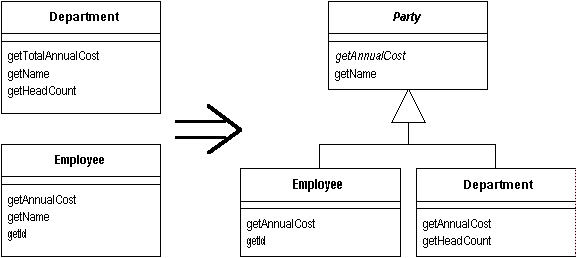

# 11장 일반화 다루기(Dealing with Generalization)
[TOC]

## Pull Up Field
==두 서버클래스가 동일한 필드를 가지고 있다면,== 그 필드를 슈퍼클래스로 옮겨라.


### 동기
- 리팩토링을 통하여 결합된다면 종종 서브클래스들이 중복된 기능을 발견하게 되다.
- 비슷한 방법으로 사용하고 있다면 슈퍼클래스로 옮기도록 해야 한다.

### 절차
- 대상 필드들이 동일한 방법으로 사용되고 있는지를 확인한다.
- 만약 같은 용도로 사용이 되고 있다면, 슈퍼클래스 적용할 메소드를 서브클래스에 생성한다.
- 컴파일 / 테스트 한다.
- 슈퍼클래스에 새로운 필드를 생성한다.
- 서브 클래스 필드를 지운다.
- 컴파일 / 테스트 한다.
- 새로운 필드에 대해 ==Self Encapsulate Field==를 사용하도록 고려한다.

## Pull Up Method
==동일한 일을 하는 메소드를 여러 서브클래스에서 가지고 있다면,== 이 메소드를 슈퍼클래스로 옮겨라.


### 동기
- 두개의 서브 클래스에서 잘 동작할지라도 버그가 발생할 수 있다.
- 비슷한 용도로 사용되는 경우 파라미터를 이용하여 통합화 할 수 있다.
- 서브클래스에는 변수가 존재하고, 슈퍼클래스에 변수가 존재하지 않을 경우 추상 메소드로 해결이 가능하다.

### 절차
- 메소드들을 조사해서 그것이 동일한지 확인한다.
- 메소드가 서로 다른 시그너처를 가지고 있다면, 수퍼클래스에서 사용하고 싶은 시그너처로 바꾼다.
- 수퍼클래스에서 새로운 메소드를 만들고, 메소드 중 하나의몸체를 새로운 메소드에 복사해서 적절히 수정한 후 컴파일 한다.
 - 엄격한 타입 체크와 서브 클래스에 존재하지만, 슈퍼클래스에 존재하지 않는 메소드를 호출한다면 추상 메소드로 선언하라.
 - 메소드가 서브 클래스에 있는 필드를 사용하고 있다면, Pull Up Field 또는 Self Encapsulate Field를 사용하여 get메소드를 선언하여 사용한다.
- 서브클래스 중 하나를 골라서 메소드를 삭제한다.
- 컴파일 / 테스트 한다.
- 수퍼클래스 메소드만 남을 때까지 서브클래스 메소드를 삭제하고 테스트를 계속한다.
- 필요한 타입을 수퍼클래스로 변경할 수 있는지 살펴보기 위해서 이 메소드의 호출부를 살펴본다.

### 예제
* 두 개의 서브클래스( RegularCustomer?, PreferredCustomer?)를 가진 Customer 클래스가 있다.


* 두 개의 서브클래스에 정의 되어있는 createBill의 코드는 동일한다.
```java
    // createBill 메소드는 각각의 클래스에서 동일하다.
    void createBill (date Date) {
        double chargeAmount = chargeFor(lastBillDate, date);
        addBill (date, charge);
    }
```

### 리팩토링
- 각각의 클래스 메소드에 있는 createBill을 수퍼클래스로 옮길수가 없는데, 왜냐하면 chargeFor 메소드가 서로 다르기 때문에 추상 메소드를 선언해야 한다.
```java
class Customer...
	abstract double chargeFor(date start, date end);
```


## Pull Up Constructor Body
==서브클래스들이 대부분 동일한 몸체를 가진 생성자를 가지고 있다면,== 수퍼클래스에 생성자를 만들고 서브클래스 메소드에서 이것을 호출하라.
```java
class Manager extends Employee...
    public Manager (String name, String id, int grade) {
        _name = name;
        _id = id;
        _grade = grade;
    }

=>

public Manager (String name, String id, int grade) {
	super (name, id);
	_grade = grade;
}
```

### 동기
- 생성자는 일반 메소드와 다르게 다루기가 까다롭다. 생성자에 대해 제약이 많기 때문이다.
- 공통된 동작을 가지는 메소드를 서브클래스에서 발견한다면, 가장 먼저 떠올리는 생각은 공통된 동작을 뽑아 수퍼클래스로 옮기는 것이다.
- 서브클래스에 의해 호출되는 수퍼클래스 생성자가 필요로 하는데 위 소스와 같이 수정하면 된다.
- 여기서 Pull Up Method 사용할 수 없는데 생성자는 상속을 할 수 없기 때문이다.
- 리펙토링이 복잡해 진다면, 대신 Replace Constructor With Factory Method 고려해 보아야 한다.

### 절차
- 수퍼클래스 생성자를 정의한다.
- 서브 클래스 생성자에서 앞 부분에 있는 공통된 코드를 수퍼클래스 생성자로 옮긴다.
 - 생성자 코드 전체를 옮겨야 할지 모른다.
 - 공통된 코드를 생성자의 앞 부분으로 옮기도록 시도하라.
- 서브클래스 생성자에서 첫 번째 단계로 수퍼클래스 생성자를 호출한다.
 - 모든 코드가 공통이라면, 이것이 서브클래스 생성자에 있는 유일한 코드이다.
- 컴파일 / 테스트를 한다.
 - 나중에 다른 공통된 코드를 보면, ==Extract Method==를 사용해서 공통되는 코드를 뽑아내고 ==Pull Up Method==를 사용해서 상속 구조 위쪽으로 올려라.

### 예제
* 다음은 Manager 클래스와 Employee 클래스이다.
 ```java
class Employee...
    protected String _name;
    protected String _id;
 
 class Manager extends Employee...
public Manager (String name, String id, int grade) {
    _name = name;
    _id = id;
    _grade = grade;
}

 private int _grade;
```
	* 
### 리팩토링
* Employee에 있는 필드는 Employee의 생성자에서 값이 정해져야 한다.
 ```java
  class Employee
    protected Employee (String name, String id) {
        _name = name;
        _id = id;
    }
```
* 그런 후 서브클래스에서 이것을 호출한다.
 ```java
    public Manager (String name, String id, int grade) {
        super (name, id);
        _grade = grade;
    }
```
* 나중에 공통된 코드가 있을 때 변화가 생긴다. 다음과 같은 코드가 있다고 하자.
```java
class Employee...
    boolean isPriviliged() {..}
    void assignCar() {..}

 class Manager...
public Manager (String name, String id, int grade) {
    super (name, id);
    _grade = grade;
    if (isPriviliged())
    	assignCar(); //every subclass does this
}

 boolean isPriviliged() {
    return _grade > 4;
}
```
* assignCar 동작은 grade값이 필드에 할당된 후에 실행되어야 하기 때문에 수퍼클래스 생성자로 옮길 수 없다.
 * 그래서 Extract Method와 Pull Up Method가 필요하다.
 ```java
  class Employee...
    void initialize() {
        if (isPriviliged()) assignCar();
    }

   class Manager...
    public Manager (String name, String id, int grade) {
        super (name, id);
        _grade = grade;
        initialize();
 ```

## Push Down Method

상위 클래스에 있는 기능을 일부 하위클래스만 사용할 땐 그 기능을 관련된 하위클래스 안으로 옮기자.


### 동기

* 상위 클래스의 기능을 특정 하위클래스로 옮겨야 할 때 사용한다.
	* 상속 받는 하위 클래스들 중 일부 클래스만 사용을 하는 경우.
* Extract Subclass를 실시 할 때 흔히 사용한다.

### 절차

1. 상위 클래스에 있던 메소드를 이 클래스를 상속 받는 모든 하위 클래스에 복사.
2. 상위 클래스의 메소드를 제거한다.
3. 컴파일과 테스트를 한다.
4. 필요 없는 곳의 메소드를 삭제한다.
5. 컴파일과 테스트를 한다.

## Push Down Field

일부 하위클래스만이 사용하는 필드가 있을 땐 그 필드를 사용하는 하위클래스로 옮기자.


### 동기

* 필드가 상위클래스엔 필요 없고 하위클래스에만 필요할 때 사용

### 절차

1. 모든 하위클래스에 필드를 선언한다.
2. 상위클래스에서 필드를 삭제한다.
3. 컴파일과 테스트를 한다.
4. 필요 없는 곳에서 필드를 삭제한다.
5. 컴파일과 테스트를 한다.

## Extract Subclass

일부 인스턴스에 의해서만 사용되는 기능이 든 클래스가 있을 땐,
그 기능 부분을 전담하는 하위클래스를 작성하자.


### 동기

* 클래스의 기능을 그 클래스의 일부 인스턴스만 사용할 때 적용한다.
* type code가 사용되면, Replace Type Code with Subclass나 Replace Type Code with State/Strategy를 사용할 수 있다.
* Extract Subclass - 객체 생성 후에 클래스에 기초한(class-based) 동작을 변경할 수 없다.
* Extract Class - 다른 컨포넌트를 플러그인 해서 클래스에 기초한 동작을 변경할 수 있다. 서브클래스만 사용해서 변형된 것들을 나타낼 수 있다.

### 절차

1. 상속하여 하위 클래스를 새로 정의한다.
2. 생성자를 제공한다.
	* 간단하면, param를 받아서 super를 호출한다.
	* 하위 클래스를 사용하고 있다는 것을 감추기 위해서 Replace Constructor with Factory Method를 사용한다.
3. 상위 클래스의 생성자를 호출하는 곳을 새로운 하위 클래스의 생성자를 호출하도록 바꾼다.
	* 다른 param이 필요하면, Rename Method를 사용한다.
	* super가 더 이상 직접 생성될 필요가 없으면, 추상클래스로 선언한다.
4. Push Down Method와 Push Down Field를 사용하여 하위 클래스로 옮긴다.
	* Method를 먼저 옮기는 것이 쉽다.
	* public Method를 옮기면, 변수나 param의 type을 재정의 해야 할 수 있다.
5. 상속 구조를 나타내는 필드를 Self Encapsulate Field로 삭제한다.
	* 접근자를 사용하는 클래스 밖의 Method를 Move Method를 사용하여 클래스 안으로 옮긴다.
	* 후에, Replace Conditional with Polymorphism을 사용한다.
6. 각각을 하위 클래스로 옮긴 후에, 컴파일, 테스트를 한다.

### 예제

* 동네 정비소에서 작업 종류별 가격을 구하는 JobItem 클래스
```java
class JobItem...
       public JobItem ( int unitPrice, int quantity, boolean isLabor, Employee employee ) {
              _unitPrice = unitPrice;
              _quantity = quantity;
              _isLabor = isLabor;
              _employee = employee;
       }

       public int getTotalPrice() {
              return getUnitPrice() * _quantity;
       }

       public int getUnitPrice() {
              return ( _isLabor ) ? _employee.getRate() : _unitPrice;
       }

       public int getQuantity() {
              return _quantity;
       }

       public Employee getEmployee() {
              return _employee;
       }

       private int _unitPrice;
       private int _quantity;
       private Employee _enployee;
       private boolean _isLabor;
class Employee...
       public Employee ( int rate ) {
              _rate = rate;
       }

       public int getRate() {
              return _rate;
       }

       private int _rate;
```

* LaborItem을 sub class로 뽑아낸다.
```java
class LaborItem extends JobItem {}
```

* JobItem의 생성자 시그너처를 복사하여, LaborItem의 생성자를 만든다.
```java
       class LaborItem extends JobItem {
              public LoborItem ( int unitPrice, int quantity, boolean isLabor, Employee employee ) {
              	super ( unitPrice, quantity, isLabor, employee );
              }
       }
```

* JobItem 생성자 호출을 LaborItem의 생성자 호출로 바꾸는 경우를 찾는다.
```java
JobItem j1 = new JobItem ( 0, 5, true, kent );
JobItem j1 = new LaborItem ( 0, 5, true, kent );
```

* Rename Method를 사용하여 파라미터 리스트를 정리한다.
* super에 새 생성자를 만들고 기존의 것을 protected로 바꾼다.
```java
class JobItem...
    protected JobItem ( int unitPrice, int quantity, boolean isLabor, Employee employee ) {
        _unitPrice = unitPrice;
        _quantity = quantity;
        _isLabor = isLabor;
        _employee = employee;
    }
    public JobItem ( int unitPrice, int quantity ) {
    	this ( unitPrice, quantity, false, null );
	}
```

* 외부로부터의 호출은 새로운 생성자를 사용한다.
```java
JobItem j1 = new LaborItem ( 10, 15 );
```

* sub 클래스 생성자에 Rename Method를 사용한다.
```java
class LaborItem extends JobItem {
    public LoborItem ( int quantity, Employee employee ) {
    	super ( 0, quantity, true, employee );
    }
}
```

* JobItem의 메소드와 필드를 서브클래스로 옮긴다.
* getEmployee 메소드에 Push Down Method를 적용한다.
```java
       class LaborItem...
              public Employee getEmployee() {
                     return _employee;
              }
       }
       class JobItem...
              protected Employee _employee;
```

* _employee를 protected로 만든 후에, super의 생성자를 정리해서 LaborItem 클래스에서만 변경 가능하도록 수정한다.
```java
       class JobItem...
              protected JobItem ( int unitPrice, int quantity, boolean isLabor ) {
                     _unitPrice = unitPrice;
                     _quantity = quantity;
                     _isLabor = isLabor;
              }
       class LaborItem...
              public LoborItem ( int quantity, Employee employee ) {
                     super ( 0, quentity, true );
                     _employee = employee;
              }
```

* _isLabor는 JobItem에서는 항상 false, LaborItem에서는 항상 true이므로, Self Encapsulate Field를 사용하고 다형성 상수 메소드를 사용하도록 하고, 삭제한다.
```java
       class JobItem...
              protected boolean isLabor () {
                     return false;
              }
       class LaborItem...
              protected boolean isLabor () {
                     return true;
              }
```

* _isLabor 메소드를 사용하는 부분을 Replace Conditional with Polymorphism을 사용하여 리팩토링 한다.
```java
       class JobItem...
              public int getUnitPrice () {
                     return (isLabor()) ? _employee.getRate() : _unitPrice;
              }
       class JobItem...
              public int getUnitPrice () {
                     return _unitPrice;
              }
       class LaborItem...
              public int getUnitPrice () {
                     return _employee.getRate();
              }
```

* 데이터를 사용하는 메소드를 서브클래스로 옮기면, 데이터에 Push Down Field를 사용할 수 있다.
	* sub 클래스로 옮길 수 없다는 것은 작업이 더 필요하다는 것으로, Push Down Method또는 Replace Conditional with Polymorphism을 사용할 수 있다.
* _unitPrice는 LaborItem이 아닌 경우에만 사용되므로, PartsItem 클래스를 만들수 있다.
	* 이 작업이 끝나면 JobItem은 추상 클래스가 될 것이다.

## Extract Superclass

기능이 비슷한 두 클래스가 있을 땐 상위클래스를 작성하고 공통된 기능들을 그 상위클래스로 옮기자.



### 동기

* 중복된 코드( 동일한 방법, 또는 서로 다른 방법으로 비슷한 일을 하는 클래스)는 상속을 통해 단순화가 가능하다.
* 대안 Extract Class
	* 두 리펙토링의 차이는 기본적으로 상속이냐 위임이냐의 차이
* 두 클래스가 기능뿐 아니라 인터페이스도 같다면 상속 방식이 더 간단하다.
* Replace Inheritance with Delegation으로 잘못된 선택을 되돌릴 수 있다.

### 절차

1. 빈 추상 클래스를 만들고, 원래 클래스들이 이 클래스를 상속하도록 한다.
2. Pull Up Field, Pull Up Method, Pull Up Constructor Body로 공통 요소들을 Super로 옮긴다.
	* 시그너처는 다르지만 같은 목적의 Method는, Rename Method를 사용한다.
	* 시그너처는 같지만 Body가 다른 Method는, Super에 추상 Method를 선언한다.
	* 동일한 일을 하지만, Body가 다른 Method는, Substitute Algorithm을 사용하여 Method Body를 다른 Method로 복사한다.
3. 각각을 Super로 옮길 때마다 컴파일과 테스트를 한다.
4. Sub클래스에 남아 있는 Method에 대해서, 공통된 부분이 있다면, Extract Method 적용후에, Pull Up Method를 할 수 있다.
	* 흐름이 비슷하다면, Form Template Method를 사용할 수도 있다.
5. Sub클래스들의 각 클라이언트를 검사하여 공통된 인터페이스만 사용한다면, 타입을 Super 클래스로 바꿀 수 있다.

### 예제

* Employee와 Department 클래스
	1. 이름(_name)을 갖고 있다.
	2. 연간비용(annualCost)와 관련한 Method가 있다.
```java
class Employee..
       public Employee ( String name, String id, int annualCost ) {
              _name = name;
              _id = id;
              _annualCost = annualCost;
       }
       public int getAnnualCost() {
              return _annualCost;
       }

       public String getID() {
              return _id;
       }
       public String getName() {
              return _name;
       }
       private String _name;
       private int _annualCost;
       private String _id;

       public class Department ...
              public Department ( String name ) {
                     _name = name;
              }
              public int getTotalAnnualCost () {
                     Enumeration e = getStaff();
                     int result = 0;
                     while ( e.hasMoreElement() ) {
                            Employee each = (Employee) e.nextElement();
                            result += each.getAnnualCost();
                     }
                     return result;
              }
              public int getHeadCount() {
                     return _staff.size();
              }
              public Enumeration getStaff() {
                     return _staff.elements();
              }
              public void addStaff ( Employee arg ) {
                     _staff.addElement( arg );
              }
              public String getName() {
                     return _name;
              }
              private String _name;
              private Vector _staff = new Vector();
```

* Super 클래스를 만들어 기존의 클래스들이 이 클래스를 상속 하도록 한다.
```java
abstract class Party {}
class Employee extends Party...
class Department extends Party...
```

* 공통 기능을 Super로 옮긴다. (_name)
	* Pull Up Field
```java
class Party...
       protected String _name;
```
	* Pull Up Method - get Method
```java
class Party {
       public String getName() {
              return _name;
       }
```
	* Pull Up Constructor Body
```java
class Party...
       protected Party ( String name ) {
              _name = name;
       }
       private String _name;
class Employee..
       public Employee ( String name, String id, int annualCost ) {
              super (name);
              _id = id;
              _annualCost = annualCost;
       }
class Department ...
       public Department ( String name ) {
              super (name);
       }
```
	* Rename Method로 이름을 같게 한다.
```java
class Department extends Party {
       public int getAnnualCost () {
              Enumeration e = getStaff();
              int result = 0;
              while ( e.hasMoreElement() ) {
                     Employee each = (Employee) e.nextElement();
                     result += each.getAnnualCost();
              }
              return result;
       }
```
	* 몸체가 다르므로 Pull Up Method를 사용할 수 없다. 추상 Method를 선언한다.
```java
abstract public int getAnnualCost ()
```

* Super 클래스를 바로 사용할 수 있는지 알아본다.
* Employee 클래스 중에서 getAnnualCost()만을 사용하므로 Party 클래스로 바꿀 수 있다.
```java
class Department...
       public int getAnnualCost () {
              Enumeration e = getStaff();
              int result = 0;
              while ( e.hasMoreElement() ) {
                     Party each = (Party) e.nextElement();
                     result += each.getAnnualCost();
              }
              return result;
       }
```

* Department와 Employee를 Composite Pattern으로 다룰 수 있다.
	* staff의 필드 이름을 바꾼다.
		* addStaff Method의 이름을 바꾸면서, param이 Party 클래스가 되도록 한다.
	* headCount Method를 재귀적으로 구현한다.
		* Employee의 headCount 는 1을 리턴하고, Department의 headCount 메소드에는 Substitute Algorithm을 사용하여 부서의 머릿수를 합한다.

## Extract Interface

클래스 인터페이스의 같은 부분을 여러 클라이언트가 사용하거나
두 클래스에 인터페이스의 일부분이 공통으로 들어 있을 땐 공통 부분을 인터페이스로 빼내자.


### 동기

* 클래스의 일부분만 사용하거나, 여러 클래스를 함께 사용하는 경우.
	* 특정 부분을 독립 시켜 책임을 명확하게 한다.
* 다중 상속
	* 기능의 각 부분을 담당하는 클래스를 작성하고 그것들을 구현부에서 연동한다.
* 공통된 동작이 많다면, Extract Superclass를 사용하지만, java에서는 하나의 superclass만 허용된다.
* 공통된 인터페이스만 갖게 할 경우, Extract Interface를 사용하지만, 중복 코드의 냄새가 난다.
	* Extract Class로 개선 가능.
* 서로 다른 상황에서 별개의 역할을 갖고 있을때, 인터페이스를 사용한다.

### 절차

1. 빈 인터페이스를 만든다.
2. 공통된 기능을 인터페이스에 선언한다.
3. 그 인터페이스를 상속 구현하는 관련 클래스들을 선언하자.
4. 그 인터페이스를 사용하게 클라이언트의 타입 선언 코드를 수정하자.

### 예제

* TimeSheet 클래스 - 직원에 대한 비용을 산출한다. 직원의 등급과 기술 보유 여부를 확인하는 기능이 필요하다.
```java
double charge ( Employee emp, int days ) {
       int base = emp.getRate() * days;
       if ( emp.hasSpecialSkill() )
              return base * 1.05;
       else return base;
}
```

* 등급과 기술 보유 여부를 확인하는 부분만 필요하므로, 필요한 것만 인터페이스를 정의한다.
```java
interface Billable {
       public int getRate();
       public boolean hasSpecialSkill();
}
```

* Employee 클래스가 이 인터페이스를 구현 하도록 선언한다.
```java
class Employee implements Billable ...
```

* charge 메소드의 선언을 변경한다.
```java
double charge ( Billable emp, int days ) {
       int base = emp.getRate() * days;
       if ( emp.hasSpecialSkill() )
              return base * 1.05;
       else return base;
}
```

* 여러 클래스가 인터페이스를 사용할 경우에 유용하다.
* Computer의 비용을 계산하고 싶을 때, Computer를 Billable로 만들기 위해서 Billable 인터페이스를 구현하면 된다.

## Collapse Hierarchy
수퍼클래스와 서브클래스가 거의 다르지 않다면 합쳐라.


### 동기
* 상속을 과용한 나머지 클래스 관계가 아주 복합해지는 경우가 많다.
	* 계층을 리팩토링하는 과정에선 주로 메서드와 필드를 계층의 위아래로 옮기게 된다.
* 이 작업을 거쳐 더 이상 필요 없는 서브클래스를 제거하자.

### 절차
* 제거할 클래스(수퍼클래스, 서브클래스) 선택.
* Pull Up Field와 Pull Up Method또는 Push Down Method와 Push Down Field를 사용하여 제거 대상 클래스의 모든 기능과 데이터를 옮긴다.
* 컴파일, 테스트
* 제거될 클래스에 대한 참조를 합친 클래스를 참조하도록 수정한다.
	* 변수 선언, 매개변수 대입, 생성자도 이에 맞게 수정한다.
* 빈 클래스를 제거한다.
* 컴파일, 테스트


## Form Template Method
각각의 서브클래스가 동일한 순서로 비슷한 단계를 행하지만 단계가 완전히 같지는 않은 메소드가 있다면,
각 단계를 별도의 메서드로 뽑아내어 메서드를 같게 만든 후 그 메서드를 수퍼클래스로 옮긴다.


### 동기
* 상속은 중복된 기능을 없애는 강력한 수단이다.
	* 하위클래스에 들어 있는 두 메서드가 비슷하다면 둘을 합쳐서 하나의 상위클래스로 만드는 것이 좋다.
* 중복된 코드를 제거해야 하는데 코드가 완전히 같지 않고 일부만 같은 경우가 흔히 발생한다.
	* 순서를 상위클래스로 옮기고 재정의를 통해 각 단계가 고유의 작업을 다른 방식으로 수행하게 하면 된다.

### 절차
* 메소드들을 분해하여 추출된 메소드들이 동일하거나 완전히 다르게 한다.
* Pull Up Method를 사용하여 동일한 메소드를 수퍼 클래스로 옮기자.
* 서로 다른 메소드는 Rename Method를 사용하여 각 단계에서의 모든 메소드의 시그너처가 같아지도록 한다.
	* 이렇게 하면 메서드 호출 순서가 같다는 점에선 원본 메서드들이 같아지지만, 아직 하위클래스/모듈의 호출방식이 다르다.
* 각각의 시그너처를 변경한 후 컴파일, 테스트.
* 원래의 메소드들 중 하나에 Pull Up Method를 사용한다. 서로 다른 메소드들의 시그너처는 수퍼클래스에 추상 메소드로 정의한다.
* 컴파일, 테스트를 한다.
* 그 외의 메소드를 제거하고 컴파일,테스트를 한다.

### 예제
* Customer클래스엔 내역을 출력하는 두 메소드
	* statement메서드는 고객의 대여료 내역을 ASCII 인코딩으로 출력
* ```java
public String statement() {
        Enumeration rentals = _rentals.elements();
        String result = getName() + "고객님의 대여 기록\n";
        while (rentals.hasMoreElements()) {
            Rental each = (Rental) rentals.nextElement();
            //이번에 대여하는 비디오의 정보와 대여료를 출력
            result += "\t" + each.getMovie().getTitle() + "\t" +
                      String.valueOf(each.getCharge()) + "\n";
        }
        //푸터 행 추가
        result += "누적 대여료 : " + String.valueOf(getTotalCharge()) + "\n";
        result += "적립 포인트 : " + String.valueOf(getTotalFrequentRenterPoints());
        return result;
}
```

* htmlStatement 메서드는 고객의 대여료 내역을 HTML로 출력
```java
public String htmlStatement() {
        Enumeration rentals = _rentals.elements();
        String result = "<H1><EM>" + getName() + "고객님의 대여 기록</EM></H1><P>\n";
        while (rentals.hasMoreElements()) {
            Rental each = (Rental) rentals.nextElement();
            //이번에 대여하는 비디오의 정보와 대여료를 출력
            result += each.getMovie().getTitle() + ": " +
                      String.valueOf(each.getCharge()) + "<BR>\n";
        }
        //푸터 행 추가
        result += "<P>누적 대여료 : <EM>" + String.valueOf(getTotalCharge()) + "</EM><P>\n";
        result += "적립 포인트 : <EM>" +
                  String.valueOf(getTotalFrequentRenterPoints()) + "</EM><P>";
        return result;
}
```


* 두 메서드가 어떤 공통 상위 클래스의 하위클래스가 되게 정리해야 한다.
	* 내역을 출력하는 메서드를 Strategy 패턴 적용하여 작성
* ```java
class Statement {}
class TextStatement extends Statement {}
class HtmlStatement extends Statement {}
```


* Move Method적용
	* 두 개의 statement 메서드를 하위클래스로 옮긴다.
* ```java
class Customer {

    public String statement() {
        return new TextStatement().value(this);
    }

    public String htmlStatement() {
        return new HtmlStatement().value(this);
    }
}
```


* 내역 출력에 Strategy 패턴 사용

```java
class TextStatement {

    public String value(Customer aCustomer) {
        Enumeration rentals = aCustomer.getRentals();
        String result = aCustomer.getName() + "고객님의 대여 기록\n";
        while (rentals.hasMoreElements()) {
            Rental each = (Rental) rentals.nextElement();
            //이번에 대여하는 비디오의 정보와 대여료를 출력
            result += "\t" + each.getMovie().getTitle() + "\t" +
                      String.valueOf(each.getCharge()) + "\n";
        }

        //푸터 행 추가
        result += "누적 대여료 : " + String.valueOf(aCustomer.getTotalCharge()) + "\n";
        result += "적립 포인트 : " + String.valueOf(aCustomer.getTotalFrequentRenterPoints());
        return result;
    }
}

 class HtmlStatement {

    public String value(Customer aCustomer) {
        Enumeration rentals = aCustomer.getRentals();
        String result = "<H1><EM>" + getName() + "고객님의 대여 기록</EM></H1><P>\n";
        while (rentals.hasMoreElements()) {
            Rental each = (Rental) rentals.nextElement();
            //이번에 대여하는 비디오의 정보와 대여료를 출력
            result += each.getMovie().getTitle() + ": " + String.valueOf(each.getCharge()) + "<BR>\n";
        }

        //푸터 행 추가
        result += "<P>누적 대여료 : <EM>" + String.valueOf(aCustomer.getTotalCharge()) + "</EM><P>\n";
        result += "적립 포인트 : <EM>" +
                  String.valueOf(aCustomer.getTotalFrequentRenterPoints()) + "</EM><P>";
        return result;
    }
}
```


* 두 statment 메서드를 하위클래스로 옮기면서 그 메서드들의 이름을 더욱 전략에 맞게 변경했다.
	* 두 메서드명을 같게 한 이유는 둘의 차이가 메서드가 아니라 클래스에 있기 때문이다.


* 비슷한 두 메서드를 하위클래스에 넣으면 템플릿 메서드 형성을 적용할 수 있다.
	* Extract Method를 사용하여 메소드간의 다른 부분을 추출해서 다른 코드를 비슷한 코드와 분리한다.
	* 추출할 때마다 내용은 다르고 시그너처는 같은 메서드를 작성한다.


* Header 출력
	* 두 메서드 모두 Customer 클래스를 이용하여 정보를 얻지만,
	* 결과 문자열은 다른 형식으로 출력된다.
	* 이 문자열을 형식화하는 부분을 시그니처가 같은 별도의 메서드로 빼낼 수 있다.
* ```java
class TextStatement {

    String headerString(Customer aCustomer) {
        return aCustomer.getName() + "고객님의 대여 기록\n";
    }

    public String value(Customer aCustomer) {
        Enumeration rentals = aCustomer.getRentals();
        String result = headerString (aCustomer);
        while (rentals.hasMoreElements()) {
            Rental each = (Rental) rentals.nextElement();
            //이번에 대여하는 비디오의 정보와 대여료를 출력
            result += "\t" + each.getMovie().getTitle() + "\t" +
                      String.valueOf(each.getCharge()) + "\n";
        }

        //푸터 행 추가
        result += "누적 대여료 : " + String.valueOf(aCustomer.getTotalCharge()) + "\n";
        result += "적립 포인트 : " + String.valueOf(aCustomer.getTotalFrequentRenterPoints());
        return result;
    }
}

 class HtmlStatement {

    String headerString(Customer aCustomer) {
        return "<H1><EM>" + getName() + "고객님의 대여 기록</EM></H1><P>\n";
    }

    public String value(Customer aCustomer) {
        Enumeration rentals = aCustomer.getRentals();
        String result = headerString (aCustomer);
        while (rentals.hasMoreElements()) {
            Rental each = (Rental) rentals.nextElement();
            //이번에 대여하는 비디오의 정보와 대여료를 출력
            result += each.getMovie().getTitle() + ": " +
                      String.valueOf(each.getCharge()) + "<BR>\n";
        }

        //푸터 행 추가
        result += "<P>누적 대여료 : <EM>" + String.valueOf(aCustomer.getTotalCharge()) + "</EM><P>\n";
        result += "적립 포인트 : <EM>" +
                  String.valueOf(aCustomer.getTotalFrequentRenterPoints()) + "</EM><P>";
        return result;
    }
}
```

* eachRentalString 및 footer 분리
```java
class TextStatement {
    public String value(Customer aCustomer) {
        Enumeration rentals = aCustomer.getRentals();
        String result = headerString(aCustomer);
        while (rentals.hasMoreElements()) {
            Rental each = (Rental) rentals.nextElement();
            result += eachRentalString (each);
        }
        result += footerString (aCustomer);
        return result;
    }

    String eachRentalString(Rental aRental) {
        return "\t" + aRental.getMovie().getTitle() + "\t" +
               String.valueOf(aRental.getCharge()) + "\n";
    }

    String footerString(Customer aCustomer) {
        return "누적 대여료 : " + String.valueOf(aCustomer.getTotalCharge()) + "\n"
       		   + "적립 포인트 : " + String.valueOf(aCustomer.getTotalFrequentRenterPoints());
    }
}

 class HtmlStatement {
    public String value(Customer aCustomer) {
        Enumeration rentals = aCustomer.getRentals();
        String result = headerString(aCustomer);
        while (rentals.hasMoreElements()) {
            Rental each = (Rental) rentals.nextElement();
            result += eachRentalString (each);
        }
        result += footerString (aCustomer);
        return result;
    }

    String eachRentalString(Rental aRental) {
        return aRental.getMovie().getTitle() + ": " +
               String.valueOf(aRental.getCharge()) + "<BR>\n";
    }

    String footerString(Customer aCustomer) {
        return "<P>누적 대여료 : <EM>" + String.valueOf(aCustomer.getTotalCharge()) + "</EM><P>\n"
               + "적립 포인트 : <EM>" + String.valueOf(aCustomer.getTotalFrequentRenterPoints()) + "</EM><P>";
    }
}
```


* 이렇게 수정하고 나면 두 value 메서드가 상당히 비슷하게 보인다.
	* 그러므로 두 메서드 중 하나에 Pull Up Method 적용
	* 메서드를 올릴 때 하위클래스의 메서드를 abstract로 선언해야 한다.
* ```java
class Statement {
    public String value(Customer aCustomer) {
        Enumeration rentals = aCustomer.getRentals();
        String result = headerString(aCustomer);
        while (rentals.hasMoreElements()) {
            Rental each = (Rental) rentals.nextElement();
            result += eachRentalString(each);
        }
        result += footerString(aCustomer);
        return result;
    }

    abstract String headerString(Customer aCustomer);

    abstract String eachRentalString(Rental aRental);

    abstract String footerString(Customer aCustomer);
}
```


* TextStatment의 value 메서드를 삭제하고 컴파일과 테스트를 실시한다.
	* 그래도 코드가 작동하면 HtmlStatement와 value 메서드도 삭제하고 컴파일과 테스트를 실시한다.


* 템플릿 메소드가 적용된 후의 클래스 다이어그램


* 이 리팩토링 기법을 실시하고 나면 새로운 종류의 내역을 추가하기가 쉽다.
	* 단지 Statement의 하위클래스를 작성하고 그 안에 3개의 abstract 타입 메서드를 상속구현하면 된다.

## Replace Inheritance with Delegation
서브클래스가 수퍼클래스 인터페이스의 일부만 사용하거나 데이터를 상속받지 않게 해야할 경우, 수퍼 클래스를 위한 필드를 만들고, 메소드들이 수퍼 클래스에 위임하도록 변경한 후 상속 관계를 제거한다.


###동기
* 주로 한 클래스에서부터 상속을 시작했다가,
	*  대부분의 상위클래스 작업이 하위클래스엔 별로 적절하지 않음을 깨닫는다.
* 클래스의 기능이 인터페이스에 제대로 반영되지 않았거나,
* 서브클래스에 적합하지 않은 상당량의 데이터를 상속하고 있거나,
* 수퍼클래스 protected 메소드들이 서브클래스에서 허용되지 않기 때문
* 코드는 의도와 달리 복잡해지고 혼동하기 쉬워져서 이를 해결해야 하는 문제가 추가된다.
* 상속 대신 위임을 이용하면 위임받은 클래스의 일부만 사용하려는 의도가 더욱 확실해진다.
	* 인터페이스의 어느 부분을 사용하고 어느 부분을 무시할지를 개발자가 제어할 수 있다.
	* 단지 위임하는 메서드를 추가로 작성하면 된다.

###절차
* 수퍼클래스의 인스턴스를 참조하는 필드를 서브클래스에 만든다. 그리고 이 필드를 this로 초기화한다.
* 서브클래스에 정의된 각 메소드가 위임 필드를 사용하도록 바꾼다. 컴파일, 테스트를 한다.
	* super 메서드를 호출하는 하위클래스의 모든 메서드는 수정할 수 없거나, 수정할 수 있더라도 무한 루프에 빠질 가능성이 있다.
	* 이런 메서드를 수정하려면 상속 구조를 깨야 한다.
* 서브클래스 선언을 제거하고 대리객체를 대입하는 부분에 새로운 객체를 대입하도록 바꾼다.
* 클라이언트가 사용하는 각 수퍼클래스 메소드에 대해서, 간단한 위임 메소드를 추가한다.
* 컴파일, 테스트를 한다.

### 예제
* 부적절한 상속의 예
	* 스택을 벡터의 하위 클래스로 만든 코드
* ```java
class MyStack extends Vector {

    public void push(Object element) {
        insertElementAt(element, 0);
    }

    public Object pop() {
        Object result = firstElement();
        removeElementAt(0);
        return result;
    }
}
```


* 클라이언트가 스택으로 네 대의 메서드 push, pop, size, isEmpty 만 호출함을 발경
	* size, isEmpty 메서드는 Vector 클래스에서 상속됨
	* 위임받을 Vector 클래스에 필드를 만든다.
	* 이 필드를 this에 연결하면 이 리팩토링을 실시하는 동안 위임과 상속을 혼용할 수 있다.
* ```java
        private Vector _vector = this;
```

* 위임 사용
```java
    public void push(Object element){
                _vector.insertElementAt(element,0);
        }

        public Object pop(){
                Object result = _vector.firstElement();
                _vector.removeElementAt(0);
                return result;
        }
```

* 상속 관계 제거
```java
class MyStack {
    private Vector _vector = new Vector();
}
```

* 클라이언트가 사용하는 메서드에 기능을 위임하는 위임 메소드 추가
```java
	public int size() {
        return _vector.size();
    }

    public boolean isEmpty() {
        return _vector.isEmpty();
    }
```

* 테스트 실시
	* 위임 메서드를 잊고 추가하지 않았다면 컴파일 과정에서 경고가 뜰 것이다.

## Replace Delegation with Inheritance
위임을 사용하고 있는데 전체 인터페이스에 대해 간단한 위임을 자주 작성하고 있다면, 위임하는 클래스를 대리객체의 서브클래스로 만들어라.


### 동기
* 대리객체의 모든 메소드를 사용하고 있다면 상속을 사용하자.
* 위임하고 있는 클래스의 모든 메소드를 사용하고 있을 경우에만 적용하자.
	* 서브클래스는 항상 수퍼클래스의 인터페이스를 따라가야 하기 때문
* Remove Middle Man, Extract Superclass, Extract Interface사용을 고려해보자.
* 대리객체가 둘 이상의 객체에 의해 공유되고 있고 가변성(mutable)인 경우 더 이상 데이터를 공유하지 못하므로 상속으로 대체 할 수 없다.
	* 객체가 변경 불가일 떈 바로 복사할 수도 있고 다른 부분에선 모르기 때문에 데이터 공유가 문제되지 않는다.

###절차
* 위임하는 객체를 대리객체의 서브클래스로 만든다.
* 컴파일한다.
	* 이때 일부 메서드가 충돌할 수도 있다.
	* 반환 타입, 예외, 개방도가 다르지만 메서드명이 같을 수 있다.
	* 이 문제는 Rename Method를 적용해 수정하자.
* 대리객체에 대한 필드가 그 객체 자신이 되도록 정한다.
* 단순 위임 메소드들을 제거한다.
* 컴파일, 테스트를 한다.
* 다른 모든 위임을 그 객체 자신에 대한 호출로 바꾼다.
* 대리객체에 대한 필드를 제거한다.

###예제

* 간단한 Employee 클래스는 간단한 Person 객체에 위임한다.
```java
class Employee {
    Person _person = new Person();
    public String getName() {
        return _person.getName();
    }
    public void setName(String arg) {
        _person.setName(arg);
    }
    public String toString() {
        return "Emp: " + _person.getLastName();
    }
}

 class Person {
    String _name;
    public String getName() {
        return _name;
    }
    public void setName(String arg) {
        _name = arg;
    }
    public String getLastName() {
        return _name.substring(_name.lastIndexOf(' ') + 1);
    }
}
```

* 서브클래스 선언
```java
class Employee extends Person
```

* 대리필드에 대리객체 자체를 할당한다.
* ```java
class Employee extends Person{
    Person _person = new Person();

    public Employee (){
    	this._person = this;
    }

    public String toString() {
        return "Emp: " + _person.getLastName();
    }
}
```

* 대리객체의 메소드를 직접 호출을 사용하도록 변경한다.
```java
    public String toString() {
        return "Emp : " + getLastName();
    }
```

* 위임메서드를 사용하는 모든 메서드를 삭제했으면 _person 필드 제거


