# 12장 Big Refactorings
[TOC]

## Tease Apart Inheritance
하나의 상속 계층이 두 작업을 동시에 수행할 땐 상속 계층을 하나 더 만들어서 위임을 통해 다른 계층을 호출하자.

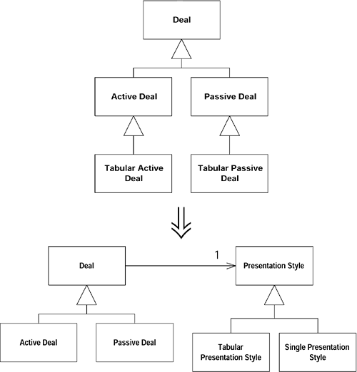

### 동기
하루 하루 작업해 나가다보니 단순한 처리를 위해 추가했던 서브 클래스의 역할들이 중복되어 추가되어 있다면 정리를 하자.

(상속 구조의 특정 레벨에 있는 클래스들이 같은 형용사로 시작하는 이름의 서브 클래스를 각각 가지고 있다면 아마 하나의 상속 구조에서 두가지 작업을 하고 있을 가능성이 높다.)

### 절차
1. 상속 구조에서 처리하고 있는 서로 다른 작업을 확인하고 리팩토링 대상을 표를 사용해 정리한다.
1. 어떤 작업이 더 중요한지, 어떤 작업을 현재 상속 구조에 남기고 어떤 작업을 다른 상속구조로 분리할지를 결정한다.
1. 공통의 수퍼 클래스에 ==Extract Class== 를 사용하여 보조 작업을 위해 객체를 만들고 이 객체를 보관하기 위해 인스턴스 변수를 만든다.
1. 원래의 상속 구조에 있던 각각의 서브 클래스에 대해서, 추출된 객체를 상속하여 서브 클래스를 만든다. 전 단계에서 만든 인스턴스 변수를 이 서브클래스의 인스턴스로 초기화 한다.
1. 각각의 서브 클래스에 대해 ==Move Method== 를 사용하여 추출된 객체의 서브클래스로 기능을 옮긴다.
1. 서브 클래스에 더이상 코드가 없으면 서브클래스를 삭제한다.
1. 모든 서브클래스가 제거될 때까지 반복. 새로만든 상속 구조에 ==Pull Up Method== 나 ==Pull Up Field== 등과 같은 리펙토링을 더 적용할 수 있는지 살펴본다.

### 예제

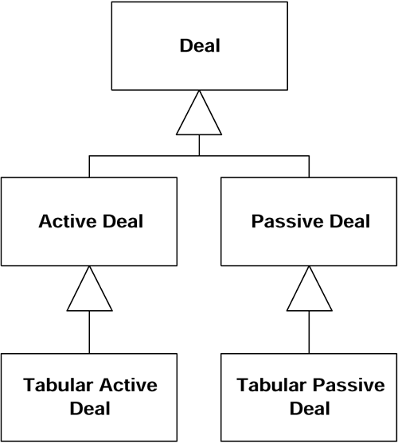

* Deal이라는 하나의 거래를 처리하는 클래스를 만들었다가 여러개의 거래를 표현하도록 서브 클래스를 추가했는데, 이번엔 프리젠테이션을 표현하기 위해 또 서브 클래스를 각각의 서브클래스에 추가하게 된 상황이다.

* 리팩토링 대상을 정리한다.
|| | |
|----|--------|--------|
|Deal|Active Deal|Passive Deal|
|Tabular Deal | | ||

* 중요도를 봤을 때 메인은 Deal 이였으니 프리젠테이션역할을 하는 tablar 클래스를 분리하도록 한다.
* 이 객체를 보관하기 위해 인스턴스 변수를 만들어 Deal에 넣는다.
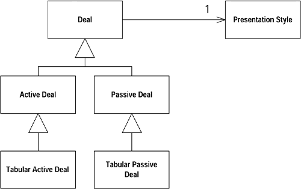

* 원래 상속 구조에 있던 각각의 서브 클래스를 새로운 프리젠테이션 스타일 클래스 서브 클래스로 넣는다.
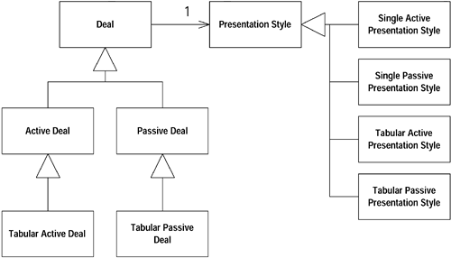

* 서브 클래스를 사용하던 인스턴스들을 새로운 서브 클래스 인스턴스로 초기화 한다.
```java
ActiveDeal constructor
        ...presentation = new SingleActivePresentationStyle(); ...
```

* Move Method 와 Move Field 를 사용하여 Deal의 서브 클래스에 있는 프리젠 테이션과 관련된 메소드와 변수를 PresentationStyle 의 서브 클래스로 옮긴다.

* 정리가 끝나면 Tabular* 클래스에는 코드가 남아 있지 않게 되기 때문에 클래스를 삭제한다.
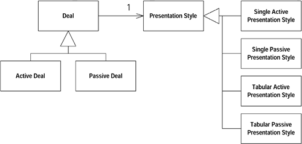

* 프리젠테이션들을 관리하는 클래스를 만들었기 때문에 분리되있는 active-passive 클래스를 제거한다.
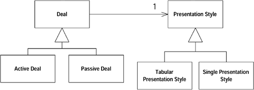

* single과 tabular 구분도 변수값으로 해결이 된다면 서브클래스를 제거해서 프리젠테이션스타일 클래스에서 관리하도록 한다.
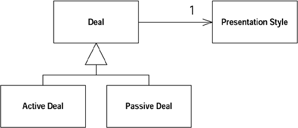

## Convert Procedural Design to Objects
절차적 스타일(procedural style)로 작성된 코드가 있으면, 데이터 레코드를 객체로 바꾸고, 동작을 쪼개서 객체로 옮겨라.

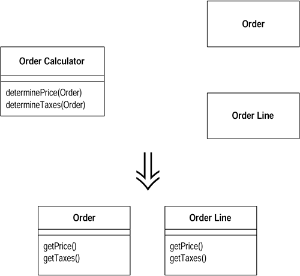

### 동기
데이터가 거의 없는 클래스에 아주 긴 절차 메소드에 복잡한 처리구조가 있다면 각 레코드 타입을 데이터 객체로 변경하여 처리로직을 옮기자.

그렇다고 strategy 객체같은 작은 규모의 객체를 다시 나누라는 것은 아니다.

### 절차
1. 각각의 레코드 아입을 취해 접근자를 가지는 덤 데이터 객체(dumb data object)로 바꾼다. 만약 관계형 데이터 베이스를 사용한다면, 각각의 테이블을 취해서 덤 데이터 객체로 바꾼다.
1. 모든 절차적 코드를 취해서 하나의 클래스에 넣는다. 클래스를 싱글톤으로 만들거나 (재초기화를 쉽게 하기 위해서), 또는 메소드들을 static로 만들 수 있다.
1. 각각의 긴 프로시저를 취해서 Extract Method 와 다른 관계된 리펙토링을 적용하여 분해한다. 프로시저를 분해함에 따라 Move Method를 사용하여 각각을 적절한 덤 데이터 클래스로 옮긴다.
1. 원래의 클래스에서 모든 동작이 제거될 때까지 계속한다. 만약 원래의 클래스가 순수한 절차적 클래스였다면, 그 클래스를 제거하는 것이 무척 만족스러울 것이다.

### 예제
```java
public String statement() {
      double totalAmount = 0;
      int frequentRenterPoints = 0;
      Enumeration rentals = _rentals.elements();
      String result = "Rental Record for " + getName() + "\n";
      while (rentals.hasMoreElements()) {
          double thisAmount = 0;
          Rental each = (Rental) rentals.nextElement();

          thisAmount = amountFor(each);

          // add frequent renter points
          frequentRenterPoints ++;
          // add bonus for a two day new release rental
          if ((each.getMovie().getPriceCode() == Movie.NEW_RELEASE) &&
              each.getDaysRented() > 1) frequentRenterPoints ++;

          //show figures for this rental
          result += "\t" + each.getMovie().getTitle()+ "\t" +
              String.valueOf(thisAmount) + "\n";
          totalAmount += thisAmount;

       }
       //add footer lines
       result +=  "Amount owed is " + String.valueOf(totalAmount) + "\n";
       result += "You earned " + String.valueOf(frequentRenterPoints) +
            " frequent renter points";
       return result;

    }
}
private double amountFor(Rental each) {
double thisAmount = 0;
switch (each.getMovie().getPriceCode()) {
   case Movie.REGULAR:
       thisAmount += 2;
       if (each.getDaysRented() > 2)
           thisAmount += (each.getDaysRented() - 2) * 1.5;
      break;
   case Movie.NEW_RELEASE:
       thisAmount += each.getDaysRented() * 3;
       break;
   case Movie.CHILDRENS:
       thisAmount += 1.5;
       if (each.getDaysRented() > 3)
           thisAmount += (each.getDaysRented() - 3) * 1.5;
       break;
}
return thisAmount;
}
```

## Separate Domain from Presentation
도메인 로직을 포함하고 있는 GUI클래스를 가지고 있다면, 도메인 로직을 분리하여 도메인 클래스를 만들어라.

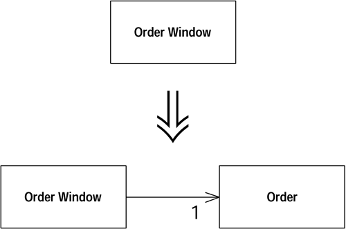

### 동기
- 모델 - 뷰 - 컨트롤러 (MVC) 구조로 되어 있지 않은 구조를 모델(도메인로직)과 뷰로 분리하자.
- 이러한 구조는 복잡한 두 부분을 좀 더 쉽게 수정할 수 있도록 하고, 동일한 도메인 로직에 여러가지 뷰를 가질 수 있도록 할 수도 있는 확장성을 갖는다.

### 절차
- 각각의 윈도우에 대한 도메인 클래스를 작성한다.
- 만약 테이블을 가지고 있다면, 테이블의 행(row)을 표현하는 클래스를 만든다. 윈도우를 위한 도메인 클래스에서 컬렉션을 사용하여 행 도메인 객체를 저장한다.
- 윈도우의 데이터를 검토한다. 사용자 인터페이스에서 나타낼 목적으로만 사용되는 데이터는 윈도우에 그대로 남겨둔다. 도메인 로직에서는 사용되지만 윈도우에서는 실제로 표시되지 않는다면 Move Method를 사용하여 도메인 객체로 옮긴다. 만약 데이터가 사용자 인터페이스와 도메인 로직 양쪽에서 사용된다면 Duplicate Observerd Data 를 사용하여 데이터가 양쪽 모두에 있도록 하고 동기화 시킨다.
- 프리젠테이션 클래스의 로직을 검토한다. Extract Method 를 사용하여 프리젠테이션 로직에서 도메인 로직을 분리한다. 도메인 로직을 분리한 후 Move Method를 사용하여 도메인 객체로 옮긴다.
- 작업이 끝나면 GUI를 처리하는 프리젠테이션 클래스와 비지니스 로직을 처리하는 도메인 객체를 갖게된다. 도메인 객체는 제대로 분해되지 않았겠지만, 좀 더 리펙토링하여 이것을 처리한다.

### 예제
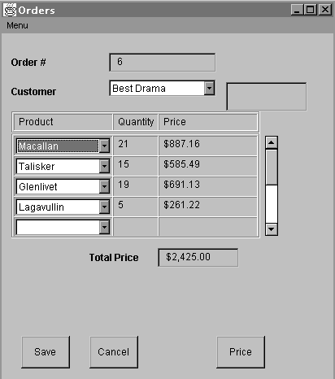

- 이 프로그램의 모든 동작이 OrderWindow? 하나의 클래스 안에서 처리된다고 가정한다. 그리고 데이터 베이스는 아래의 구조로 되어 있다.
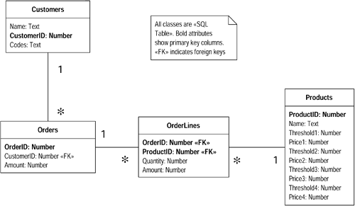

- Order 클래스를 만든다.
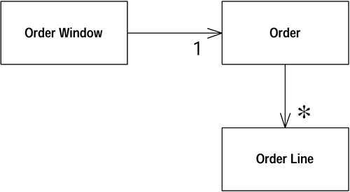
 - 여러개의 주문라인을 표시하기 위해 OrderLine 클래스도 만든다.

- GUI에 직접 표현되지 않는 Customers 테이블의 데이터들은 Move Method 를 사용하여 간단하게 도메인 클래스로 이동시킨다
- GUI에 표현되는 데이터들은 Duplicate Observerd Data 를 사용하여 Order클래스에 도메인 필드를 하나 넣고 이에 대응하는 AWT필드를 OrderWindow에 넣으면서 옮긴다.
- OrderWindow에 sql호출구문이 있다면 Order클래스로 바로 옮기고 작업하는것도 빠른 처리가 가능하다.

- 수정을 마친 후의 클래스 구조
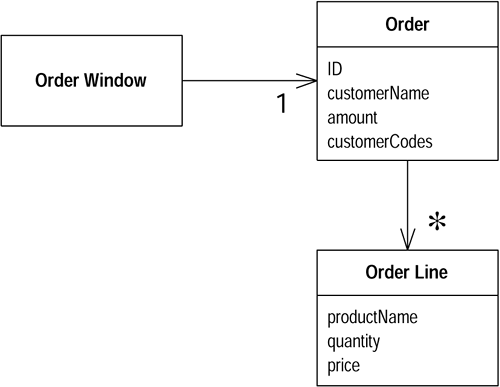

## Extract Hierarchy
너무 많은 작업을 하거나 또는 부분적으로라도 많은 조건문이 있는 클래스에 대해서는 각각의 서브 클래스가 특정 작업을 담당하도록 클래스의 상속 구조를 만들어라.
- Replace Type Code with Subclasses
- Replace Type Code with State/Strategy
- Replace Conditional with Polymorphism
- Replace Constructor with Factory Method
- Extract Method
- Extract Class

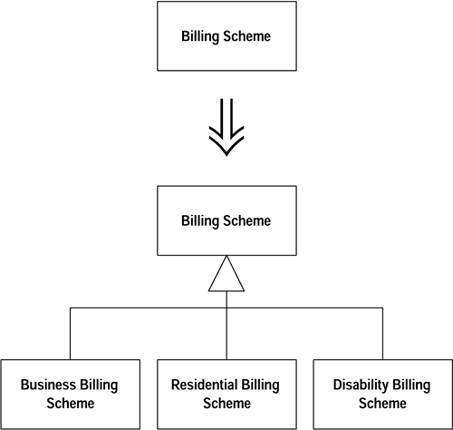

### 동기
처음엔 간단한 클래스 구조였지만 플래그를 하나씩 추가하면서 분기를 나누고 조건을 추가하다보면 코드가 지저분해지고 많아지게 된다. (캔도 따고 나무도 자르고 레이저 포인트로도 사용할 수 있는 스위스 군용 나이프 같은 클래스)

이 리펙토링의 전제 조건은 조건로직이 객체의 존속 기간동안 변하지 않고 남아있어야 한다. 그게 아니라면 Extract Class 리펙토링을 사용하도록 하자.

이 리펙토링은 하루만에 끝날 수 없고 엉클어진 디자인의 매듭을 푸는데 몇 주 혹은 몇 달이 걸릴 수 있으며, 쉽고 명확한 단계에 대한 작업을 한 다음 휴식을 취하도록 하자.

### 절차
**각각의 동작이 명확하지 않은 경우**
- 클래스가 처리하고 잇는 각각의 작업을 확인한다. 객체의 존속기간동안 각각의 동작이 변할 수 있다면 ==Extract Class== 를 사용하여 이런 기능을 별도의 클래스로 분리한다.
- 각각의 작업을 담당할 서브 클래스를 만들고 원래의 클래스에 ==Replace Constructor with Factory Method== 를 사용한다 팩토리 메소드가 적절한 서브 클래스의 인스턴스를 리턴하도록 만든다.
- 한번에 하나씩, 조건 로직을 포함하는 메소드를 서브 클래스로 복사하고 서브 클래스의 의도된 기능에 맞도록 메소드를 손질한다. 조건문을 메소드의 다른 부분과 분리하는 것이 필요하다면 수퍼 클래스에서 ==Extract Method== 를 사용하라.
- 수퍼클래스를 abstract로 선언할 수 있을 때까지 각각의 특별한 작업을 분리한다.
- 수퍼클래스에 있는 메소드가 모든 서브 클래스에서 오버라이드 되어 있다면 메소드 몸체를 제거하고 abstract 로 선언한다.


**각각의 동작이 명확한 경우**
- 각각의 작업에 대한 서브 클래스를 만든다.
- ==Replace Constructor with Factory Method== 를 사용하여 각각의 작업에 대해 적절한 서브 클래스의 인스턴스를 리턴하도록 한다. 만약 각각의 작업을 타입 코드로 구별하고 있다면 ==Replace Type Code with Subclasses==를 사용하라. 객체 존속 기간동안 담당 작업을 다른것으로 바꿀 수 있다면 ==Refactoring/Replace Type Code with State/Strategy==를 사용하라.
- 조건 로직을 포함하고 있는 메소드를 취해서 ==Replace Conditional with Polymorphism==을 적용한다. 만약 메소드의 전체 부분이 바뀌지 않는다면 ==Extract Method==를 사용하여 바뀌는 부분과 분리한다.

### 예제
- 각각의 동작이 명확하다면  Replace ==Type Code with Subclasses, Refactoring/Replace Type Code with State/Strategy ,Replace Conditional with Polymorphism== 를 사용한다.

- **각각의 동작이 명확하지 않다면 아래 예제를 참고한다.**
 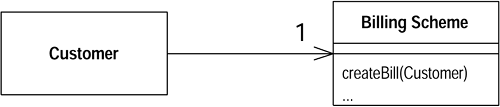
 - 요금 계산서를 요청하는 프로그램으로 이 안에는 여름과 겨울에 다른 요금이 적용되고, 주거지 소규모 기업, 생활 보조금을 받는 고객, 장애인 등에 따라 다른 요금제가 적용되게 된다.
 - 많은 플래그가 존재하는 클래스를 정리하기 위해 먼저 각각의 작업을 담당할 서브 클래스를 만든다.
 (장애인 요금체계를 정리하기 위한 객체를 나눈 모습)
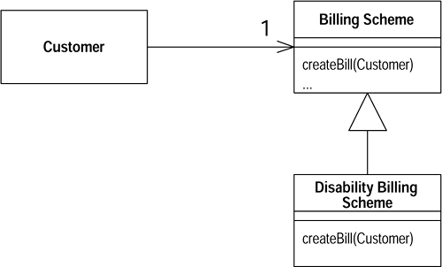
 - Replace Constructor with Factory Method를 사용하여 정리한다.
 - BillingScheme에 있는 여러 메소드를 보고 새로 생성한 클래스에 해당하는 메소드들을 서브 클래스에 복사한다.
   - 복사한 메소드내의 불필요한 코드를 제거한다.
    ```java
    if (disabilityScheme()) doSomething
    ->  doSomething
```
 - 이런 과정을 반복하여 변하는 코드와 그렇지 않은 코드를 ==Extract Mehtod, Decompose Conditional==을 사용하여 분리해 나간다.
 - 장애인 요금체계를 분리한것과 같이 생활 보조금 고객에 대한 로직을 분리했다면 두 클래스를 비교해보고 연관관계가 존재하며 서브클래스로 연결시킬 수 있다면 그렇게 정리하도록 한다.