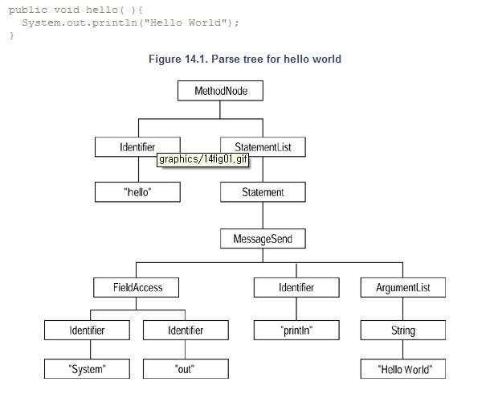

# 14장 리팩토링 도구

* 코드를 리팩토링 하는데 가장 큰 장애물 가운데 하나는 리팩토링을 지원하는 도구가 거의 없다는 것이다.

## 도구를 이용한 리팩토링

* 자동화된 도구로 리팩토링 하는 것과 손으로 리팩토링을 하는 것은 느낌이 완전히 다르다.
* 적절한 곳에 테스트 스위트로 안전망을 치고 작업을 한다 하더라도, 수작업으로 리팩토링을 하는 것은 시간이 많이 걸리는 작업이다.
* 이 간단한 사실 때문에 많은 프로그래머들이 리팩토링을 해야 한다는 것을 알면서도 하지 않는다.
* 리팩토링 지원 도구를 사용한다면, 리팩토링을 프로그래밍과 구별하기가 어려워진다.
* "지금은 리팩토링을 하고, 지금은 프로그래밍을 한다"라는 식으로 말하기 보다는, 아마 "메소드의 이 부분을 뽑아내서 수퍼클래스로 보내고, 지금 새로 만들어서 작업하고 있는 서브클래스에 새로 만든 메소드를 호출하도록 코드를 추가한다."와 같은 식으로 말할 것이다.
* 자동화된 리팩토링 도구를 사용할 때는 테스트를 해야 할 필요가 없기 때문이다.
* 도구를 이용한 리팩토링은 테스트에도 영향을 미친다. 많은 리팩토링이 자동으로 처리되기 때문에 테스트를 많이 하지 않아도 된다.
* 그러나 자동화될 수 없는 리팩토링이 항상 존재하기 때문에 테스트 단계가 없어지지는 않는다.

## 리팩토링 도구에 대한 기술적 판단기준

* 리팩토링 도구의 주된 목적은 프로그래머가 프로그램을 다시 테스트하지 않고도 코드를 리팩토링 할 수 있도록 하는 것이다.
* 테스트는 자동화되어 있다 할지라도 시간이 많이 드는 작업이고, 테스트를 안 한다면 리팩토링 프로세스는 속도를 훨씬 빠르게 할 수 있다.

## 프로그램 데이터베이스

* 특정 메소드에 대해 잠재적으로 그 메소드를 참조할 수 있는 호출부를 찾는 기능.
* 특정 인스턴스 변수에 대해 그 변수를 읽고 쓰는 모든 메소드를 찾는 것과 같이, 프로그램 전체에서 여러 프로그램 엔티티(entity)를 검색할 수 있는 능력.

## 파스 트리(parse tree)

* 대부분의 리팩토링은 시스템에서 메소드 수준 이하의 부분에 대한 조작을 해야 한다.
* 파스 트리는 메소드 자체의 내부구조를 표현하기 위한 데이터 구조이다.

## 정확성

* 도구를 사용하여 리팩토링을 하더라도 프로그램의 동작은 그대로 유지해야 한다.
* 동작을 완전하게 보존하는 것은 불가능하다.(리팩토링으로 인해 몇 밀리세컨드 빨라지거나 느려질 수 있다).
* 보통 프로그램에 영향을 미치지 않지만, 프로그램이 엄밀히 실시간 제한조건을 요구한다면 프로그램이 부정확하게 동작하는 원인이 될 수 있다.

## 리팩토링 도구에 대한 실질적 판단기준

* 도구의 목적은 사람이 하는 특정 작업을 지원하는 것이다.

## 속도

* 매우 복잡한 경우에는 리팩토링을 수행하는데 필요한 분석(analysis)과 변환(transformation) 시간이 많이 걸릴 수 있다.
* 정확성과 상대적 시간 비용은 항상 고려해야 한다.
* 분석이 너무 오래 걸릴 경우 프로그래머에게 필요한 정보를 물어보도록 하는 것이다.

## 작업취소(undo)

* 자동화된 리팩토링은 디자인에 대해 탐험적 접근방법을 가능하게 한다.

## 도구와의 통합

* 통합 개발 환경은 에디터, 컴파일러, 링커, 디버거와 프로그램을 개발하는데 필요한 다른 도구를 통합했다.
* 초기에는 IDE에 리팩토링 브라우저가 포함되어 있지 않았기 때문에 아무도 리팩토링 도구를 사용하지 않았다.
* 도구를 바로 옆에 있도록 한 것이 큰 차이를 만들었다.