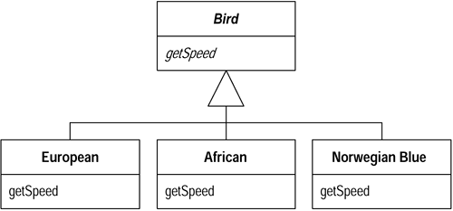
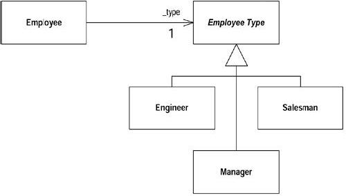

# 9장. Simplifying Conditional Expressions

[toc]

## Decompose Conditional
복잡한 조건문(if-then-else)이 있는 경우, if, then, else 부분을 각각 메소드로 추출하라.
```java
if (date.before(SUMMER_START) || date.after(SUMMER_END))
    charge = quantity * _winterRate + _winterServiceCharge;
else charge = quantity * _summerRate;
```
```java
if (notSummer(date))
    charge = winterCharge(quantity);
else charge = summerCharge (quantity);
```

### 동기
* 일반적으로 프로그램에서 가장 복잡한 부분 가운데 하나가 복잡한 조건 논리이다.
* 조건을 검사하는 코드와 실제로 동작하는 코드를 보고 원리는 알 수 있지만, 왜 그렇게 되는지를 알기 힘들어서 주로 문제가 된다.
* 코드를 분해하고 코드를 의도에 맞는 이름을 가진 메소드 호출로 바꿔서 의도를 좀더 명확하게 할 수 있다.
* 조건이 눈에 잘 들어오고 로직의 흐름을 알아보기 쉽다.
* 각각의 분기에 대한 이유를 명확히 할 수 있다.

### 절차
* if 절을 하나의 메소드로 뽑아낸다.
* then 절과 else 절을 각각의 메소드로 뽑아낸다.
* 만약 중첩된 조건문을 발견한다면 Replace Nested Conditional with Guard Clauses를 사용해야 하는지 살펴본다.
* Replace Nested Conditional with Guard Clauses 사용하는 것이 적절하지 않다면, 각각의 조건문을 분해한다.

### 예제
**난방비에 대한 요금을 계산하는데 여름과 겨울에 따라 다른 경우**

* if 절을 메소드로 추출한다.
```java
if (date.before(SUMMER_START) || date.after(SUMMER_END))
	charge = quantity * _winterRate + _winterServiceCharge;
else charge = quantity * _summerRate;
```

* 조건식을 메소드를 추출한다.
```java
private double notSummer(Date date) {
	return date.before(SUMMER_START) || date.after(SUMMER_END);
}
```

* 조건식 자리에 추출한 메서드를 호출한다.
```java
if (notSummer(date))
	charge = quantity * _winterRate + _winterServiceCharge;
else charge = quantity * _summerRate;
```

* if 절에서 반환하는 계산식도 메소드로 추출한다.
```java
private double winterCharge(int quantity) {
	return quantity * _winterRate + _winterServiceChage;
}
```
* 계산식 자리에 추출한 메서드를 호출한다.
```java
if (notSummer(date))
	charge = winterCharge(quantity);
else charge = quantity * _summerRate;
```

* else 절에서 반환하는 계산식도 메소드로 추출한다.
```java
private double summerCharge(int quantity) {
	return quantity * _summerRate;
}
```
* 계산식 자리에 추출한 메서드를 호출한다.
```java
if (notSummer(date))
    charge = winterCharge(quantity);
else charge = quantity * _summerRate;
```

* 리팩토링 완료 결과
```java
if (notSummer(date))
    charge = winterCharge(quantity);
else charge = summerCharge(quantity);

 private double notSummer(Date date) {
    return date.before(SUMMER_START) || date.after(SUMMER_END);
}

 private double summerCharge(int quantity) {
    return quantity * _summerRate;
}

 private double winterCharge(int quantity) {
    return quantity * _winterRate + _winterServiceChage;
}
```

## Consolidate Conditional Expression
여러 조건식의 결과가 같을때는 하나의 조건식으로 결합하여 메소드로 추출해라.
```java
double disabilityAmount() {
    if (_seniority < 2) return 0;
    if (_monthsDisabled > 12) return 0;
    if (_isPartTime) return 0;
    // 장애인 공제액 계산
}
```
```java
double disabilityAmount() {
    if (isNotEligableForDisability()) return 0;
    // disability amount 계산
}
```

### 동기
* 때때로 각각 검사하는 조건은 다르지만 결과가 모두 같을 때가 간혹 있다.
	* 이런 것을 보면 AND와 OR을 사용하여 하나의 결과를 가지는 하나의 조건 검사로 통합해야 한다.
* 조건 코드를 통합하는 것이 중요한 두 가지 이유
    * 여러 개의 검사를 OR로 연결하여 실제로는 하나의 검사를 하고 있다는 것을 보여줌으로써 검사를 좀더 명확하게 한다.
    * 이 리팩토링이 종종 Extract Method를 시작할 수 있는 환경을 만들어 준다.
* 조건식을 메서드로 추출하면 처리 중인 기능의 상태를 표현하던 코드가 기능 수행 목적을 표현하는 코드로 바뀐다.
* 그 조건 검사식이 정말로 독립적이고 하나의 검사로 생각되지 말아야 한다면, 이 리팩토링을 하지 말아야한다.

### 절차

* 부작용(side effect)을 가지고 있는 조건문이 있는지 확인한다.
	* 만약 부작용이 있다면, 이 리팩토링을 할 수 없다.
* 여러 개의 조건문을 논리 연산자를 사용하는 하나의 조건문으로 대체한다.
* 컴파일, 테스트를 한다.
* 조건에 대해 Extract Method를 사용하는 것을 고려한다.

### 예제
** OR를 사용하는 경우 **

* 여러 조건을 OR로 연결하여 동일한 효과를 가지는 하나의 문장으로 바꾼다.
```java
double disabilityAmount() {
    if (_seniority < 2) return 0;
    if (_monthsDisabled > 12) return 0;
    if (_isPartTime) return 0;
    // disability amount 계산
}
```

* 모든 조건문이 0을 반환하므로 하나의 조건문으로 만든다.
```java
double disabilityAmount() {
    if ((_seniority < 2) || (_monthsDisabled > 12) || (_isPartTime)) return 0;
    // disability amount 계산
}
```

* 이 조건문이 무엇을 하는지 알수있게 Extract Mehod를 적용한다.
```java
double disabilityAmount() {
    if (isNotEligibleForDisability()) return 0;
    // disability amount 계산
}
boolean isNotEligibleForDisability() {
	return ((_seniority < 2) || (_monthsDisabled > 12) || (_isPartTime));
}
```

** AND를 사용하는 경우 **

* 여러 조건을 AND로 연결하여 동일한 효과를 가지는 하나의 문장으로 바꾼다.
```java
if (onVacation())
	if (lengthOfService() > 10)
		return 1;
return 0.5;
```

* 겹친 조건문을 논리곱 연산자로 연결시킨다.
```java
if (onVacation() && lengthOfService() > 10) return 1;
else return 0.5;
```

* 루틴이 단지 조건을 테스트하고 값을 리턴한다면, 그 루틴을 삼항 연산자(ternary operator)를 사용하여 하나의 리턴 문장으로 바꾼다.
```java
return (onVacation() && lengthOfService() > 10) ? 1 : 0.5;
```

## Consolidate Duplicate Conditional Fragments
조건절의 모든 절에 동일한 실행 코드가 있을 경우, 동일한 코드를 조건문 밖으로 옮겨라.
```java
if (isSpecialDeal()) {
    total = price * 0.95;
    send();
}
else {
    total = price * 0.98;
    send();
}
```
```java
if (isSpecialDeal())
    total = price * 0.95;
else
    total = price * 0.98;
send();
```

### 동기
* 조건문의 모든 조건 구간 안에서 실행 되는 동일한 코드를 보게 된다.
* 이런 경우 코드를 조건문 밖으로 옮기면 각 절이 공통적으로 실행할 기능과 서로 다르게 실행할 기능을 한눈에 알 수 있다.

### 절차
* 조건에 상관 없이 동일하게 실행 되는 코드를 확인한다.
* 공통으로 사용되는 코드가 시작 부분에 있다면, 그 코드를 조건문 앞으로 옮긴다.
* 공통으로 사용되는 코드가 끝 부분에 있다면, 그 코드를 조건문 뒤로 옮긴다.
* 공통으로 사용되는 코드가 중간 부분에 있다면, 그 코드의 앞 또는 뒤에 있는 코드와 위치를 바꿀 수 있는지 살펴본다.
	* 만약 가능하다면, 조건문의 앞이나 끝 절로 뺀 후 앞의 단계처럼 조건문 앞이나 뒤로 뺀다.
* 만약 공통 코드가 둘 이상일 땐 그 코드를 메소드로 추출해야 한다.

### 예제
* ```java
if (isSpecialDeal()) {
    total = price * 0.95;
    send();
}
else {
    total = price * 0.98;
    send();
}
```

* send 메서드 if절과 else절 모두 실행되므로 조건절 밖으로 빼준다.
```java
if (isSpecialDeal()) {
    total = price * 0.95;
else
    total = price * 0.98;
send();
```

* 예외 처리 방식에도 이 기법을 적용시킬 수 있다.
	* try 구간과 모든 catch 구간 안의 예외발생 명령 뒤에 공통적으로 들어있으면,
	* 그 코드를 final 구간으로 옮긴다.

## Remove Control Flag
boolean 식에서 컨트롤 플래그 역할을 하는 변수가 있는 경우, 그 변수를 break 문이나 return 문으로 바꾼다.

### 동기
* 일련의 조건식이 있을 때, 종종 루프를 빠져 나올 때를 결정하기 위해 사용되는 컨트롤 플래그를 보게 된다.
```java
done 변수에 false 값 할당
while done이 false인 동안
    if (조건식)
        do something
        done 변수에 true 값 할당
    루프의 다음 단계로 넘어감
```
* 이것은 하나의 시작점(entry point)과 하나의 종료점(exit point)을 가지는 루틴을 요구하는 구조적 프로그래밍의 원칙에서 나왔다.
* 하나의 종료점 규칙은 코드 안의 각종 특이한 컨트롤 플래그로 인해 꼬여있는 조건문을 초래한다.
* 프로그래밍 언어가 복잡한 조건문에서 벗어나기 위해서 break와 continue를 가지는 이유이다.
* 컨트롤 플래그를 제거했을 때 조건문의 진정한 의도를 쉽게 파악할 수 있다.

### 절차
** 컨트롤 플래그를 처리하는 명확한 방법은 break 또는 continue를 사용하는 것이다.**

* 논리문(logical statement) 밖으로 나오도록 하는 컨트롤 플래그의 값을 찾는다.
* 논리문 밖으로 나오도록, 컨트롤 플래그에 값을 설정하던 부분을 찾아 break나 continue 문으로 바꾼다.
* 각각의 변경에 대해 컴파일, 테스트를 한다.
* break나 continue를 사용하지 않는 다른 접근 방법은 다음과 같다.
    * 로직을 메소드로 뽑아낸다.
    * 논리문 밖으로 나오도록 하는 컨트롤 플래그의 값을 찾는다.
    * 논리문 밖으로 나오도록 컨트롤 플래그에 값을 설정하던 부분을 return으로 바꾼다.
    * 각각의 변경에 대해 컴파일, 테스트를 한다.
* break와 continue가 있는 언어를 사용할 때라 하더라도, 메소드를 뽑아내고 return을 사용하라.
	* return 문은 메서드 안에서 맨 끝에 있기 마련이고,
	* return 문을 넣으면 그 뒤에 더 이상 실행할 코드가 없음을 분명히 나타낼 수 있다.
* 컨트롤 플래그가 결과 값(result information)을 나타내는지 유의하라.
	* 이런 경우, break문을 사용한다면 컨트롤 플래그는 여전히 필요하지만,
	* 만약 메소드로 뽑아냈다면 그 값을 리턴할 수 있다.

### 예제

**컨트롤 플래그를 break로 대체하는 경우**

* 사람들 중에 Don과 John이 있는지 검사하는 코드
```java
void checkSecurity(String[] people) {
    boolean found = false;
    for (int i = 0; i < people.length; i++) {
        if (! found) {
            if (people[i].equals("Don")) {
                sendAlert();
                 found = true;
            }
            if (people[i].equals("John")) {
                sendAlert();
                 found = true;
            }
        }
    }
}
```

* 변수 found에 true를 대입하는 부분이 제어 플래그이다.
	* found를 한번에 한 부분씩 break 문으로 바꾼다.
* ```java
void checkSecurity(String[] people) {
    boolean found = false;
    for (int i = 0; i < people.length; i++) {
        if (! found) {
            if (people[i].equals("Don")) {
                sendAlert();
                 break;
            }
            if (people[i].equals("John")) {
                sendAlert();
                found = true;
            }
        }
    }
}
```

* 나머지 부분도 break 문으로 바꾼다.
```java
void checkSecurity(String[] people) {
    boolean found = false;
    for (int i = 0; i < people.length; i++) {
        if (! found) {
            if (people[i].equals("Don")) {
                sendAlert();
                break;
            }
            if (people[i].equals("John")) {
                sendAlert();
                 break;
            }
        }
    }
}
```
* 컨트롤 플래그를 참조하는 모든 부분을 제거한다.
```java
void checkSecurity(String[] people) {
    for (int i = 0; i < people.length; i++) {
        if (people[i].equals("Don")) {
            sendAlert();
            break;
        }
        if (people[i].equals("John")) {
            sendAlert();
            break;
        }
    }
}
```

**컨트롤 플래그의 결과를 리턴하는 경우**


* 다른 형식은 return을 사용하는 것이다.
```java
void checkSecurity(String[] people) {
    String found = "";
    for (int i = 0; i < people.length; i++) {
        if (found.equals("")) {
            if (people[i].equals("Don")) {
                sendAlert();
                found = "Don";
            }
            if (people[i].equals("John")) {
                sendAlert();
                found = "John";
            }
        }
    }
    someLaterCode(found);
}
```

* found의 값을 결정하는 코드를 별도의 메소드로 뽑아낸다.
```java
void checkSecurity(String[] people) {
    String found = foundMiscreant(people);
    someLaterCode(found);
}

 String foundMiscreant(String[] people) {
    String found = "";
    for (int i = 0; i < people.length; i++) {
        if (found.equals("")) {
            if (people[i].equals("Don")) {
                sendAlert();
                 found = "Don";
            }
            if (people[i].equals("John")) {
                sendAlert();
                 found = "John";
            }
        }
    }
     return found;
}
```

* 컨트롤 플래그를 return으로 대체한다.
```java
String foundMiscreant(String[] people) {
    String found = "";
    for (int i = 0; i < people.length; i++) {
        if (found.equals("")) {
            if (people[i].equals("Don")) {
                sendAlert();
                 return "Don";
            }
            if (people[i].equals("John")) {
                sendAlert();
                found = "John";
            }
        }
    }
    return found;
}
```
```java
String foundMiscreant(String[] people) {
    for (int i = 0; i < people.length; i++) {
        if (people[i].equals("Don")) {
            sendAlert();
            return "Don";
        }
        if (people[i].equals("John")) {
            sendAlert();
             return "John";
        }
    }
     return "";
}
```
* 값을 리턴하지 않는 경우에도 사용할 수 있다. 인자가 없는 return을 사용하면 된다.
* 부작용(side effect)이 있는 함수에서는 문제를 일으킬 수 있다.
* 그런 경우 Separate Query from Modifier를 사용한다.

## Replace Nested Conditional With Guard Clauses
메소드에 조건문이 있어서 정상적인 실행 경로를 파악하기 힘들 땐, 모든 특별한 경우에 대해서 보호절(Guard Clause)를 사용하라
```java
double getPayAmount()
{
    double result;
    if (_isDead) result = deadAmount();
    else {
            if (_isDeparated) result = separatedAmount();
            else {
                    if (_isRetired) result = retiredAmount();
                    else    result = normalPayAmount();
            }
    }
    return result;
}
```
```java
double getPayAmount()
{
    if (_isDead) return deadAmount();
    if (_isDeparated) return separatedAmount();
    if (_isRetired) return retiredAmount();
    return normalPayAmount();
}
```

### 동기
* 조건문은 주로 두 가지의 행태를 띤다.
	* 어느 한쪽 코스가 정상적인 동작 부분인지를 검사하는 것
	* 조건문의 한 결과만 정상적인 동작을 나타내고, 다른 한 경우는 비정상적 동작을 나타내는 상황
* 조건문의 의도를 코드로 나타내라
	* 둘다 정상적인 동작 부분이라면, if, else를 가진 조건을 사용하라.
	* 조건이 예외적인 조건이라면, 조건을 검사하고 true면 리턴하라. 이런 경우를 보호절(guard clause)[Beck]이라고 한다.
* if-then-else 문을 사용하면
	* if 구간과 else 구간의 비중이 동등하다. 따라서 코드를 보는 사람은 if 구간과 else 구간의 비중이 같다고 판단한다.
* 보호절(guard clause)
	* 이것은 드문 경우이고, 만약에 이 경우가 일어난다면 뭔가를 하고 밖으로 나가라!
* 메소드는 하나의 시작점(entry point)와 하나의 종료점(exit point)를 가져야한다?
	* 현대 언어에서 하나의 시작점은 중요하지만, 하나의 종료점은 별로 유용한 규칙이 아니다.
	* 명확함이 더 중요한 원칙 이다. 굳이 한 개의 종료점을 고집하지 말자.

### 절차
* 각각의 조건절에 보호절을 넣어라.
	* 그 보호절은 값을 리턴하거나 예외를 발생시킨다.
* 각각의 검사 부분을 보호절로 바꾼후 컴파일, 테스트를 한다.
	* 모든 보호절이 동일한 결과를 산출한다면, Consolidate Conditional Expression을 사용하라.

### 예제

* 사망 직원, 해고 직원, 은퇴 직원의 경우 특수 규칙이 적용되는 급여 정산 시스템
```java
 double getPayAmount()
{
	double result;
	if (_isDead) result = deadAmount();
	else {
		if (_isDeparated) result = separatedAmount();
		else {
			if (_isRetired) result = retiredAmount();
			else	result = normalPayAmount();
		}
	}
	return result;
}
```

* 조건문으로 인해 정상적인 실행 경로를 알 수 없다.
	* 감시절을 사용하면 코드를 이해하기 쉬워진다.
	* 감시절을 위에서 부터 차례로 넣는다.
* ```java
 double getPayAmount()
{
	double result;
	if (_isDead) return deadAmount();
	else {
		if (_isDeparated) result = separatedAmount();
		else {
			if (_isRetired) result = retiredAmount();
			else	result = normalPayAmount();
		}
	}
	return result;
}
```
* ```java
 double getPayAmount()
{
	double result;
	if (_isDead) return deadAmount();
	if (_isDeparated) return separatedAmount();
	if (_isRetired) result = retiredAmount();
	else	result = normalPayAmount();
	return result;
}
```
* ```java
 double getPayAmount()
{
	double result;
	if (_isDead) return deadAmount();
	if (_isDeparated) return separatedAmount();
	if (_isRetired) return retiredAmount();
	result = normalPayAmount();
	return result;
}
```

* result 임시변수는 이제 필요없으므로 제거한다.
```java
 double getPayAmount()
{
	if (_isDead) return deadAmount();
	if (_isDeparated) return separatedAmount();
	if (_isRetired) return retiredAmount();
	return normalPayAmount();
}
```
* 메서드에 더 이상 중요한 작업이 남아있지 않은 경우
	* 메서드를 빠져나오게 해서 관심이 없음을 나타낸다.
	* 빈 else 문을 놔두면 보는이에게 혼란을 준다.

**예제 : 조건문을 역순으로 만들기**

* 여러 겹의 조건문을 감시절로 전환 기법을 실시
```java
public double getAdjustedCapital()
{
    double result = 0.0;
    if (_capital > 0.0)
    {
        if (_intRate > 0.0 && _duration > 0.0) {
                result = (_income/_duration) * ADJ_FACTOR);
        }
    }
    return result;
}
```

* 감시절을 넣기 전에 조건문을 역순으로 만든다.
```java
public double getAdjustedCapital()
{
	double result = 0.0;
    if (_capital <= 0.0) return result;
    if (_intRate > 0.0 && _duration > 0.0) {
    	result = (_income / _duration) * ADJ_FACTOR;
    }
    return result;
}
```

* 다음 조건문은 약간 더 복작하므로 두단계로 나눠 역순으로 만든다.
	* 우선 논리부정(NOT) 연산자를 앞에 붙인다.
* ```java
public double getAdjustedCapital() {
	double result = 0.0;
    if (_capital <= 0.0) return result;
    if (!(_intRate > 0.0 && _duration > 0.0)) return result;
    result = (_income / _duration) * ADJ_FACTOR;
    return result;
}
```

* 논리부정(NOT) 연산자를 다음과 같이 단순화한다.
```java
public double getAdjustCapital() {
	double result = 0.0;
    if (_capital <= 0.0) return result;
    if (_intRate <= 0.0 || _duration <= 0.0) return result;
    result = (_intRate / _duration) * ADJ_FACTOR;
    return result;
}
```

* 감시절의 return 문에 명시적 값을 붙인다.
	* 감시절의 실패 결과를 한눈에 알수 있다.
	* 이럴때 마법숫자를 기호 상수로 전환 기법도 고려한다.
* ```java
public double getAdjustedCapital() {
	double result = 0.0;
    if (_capital <= 0.0) return 0.0;
    if (_intRate <= 0.0 || _duration <= 0.0) return 0.0;
    result = (_income / _duration) * ADJ_FACTOR
    return result;
}
```

* 임시변수를 제거한다.
```java
public double getAdjustedCapital() {
    if (_capital <= 0.0) return 0.0;
    if (_intRate <= 0.0 || _duration <= 0.0) return 0.0;
    return (_income / _duration) * ADJ_FACTOR
}
```

## Replace Conditional with Polymorphism
객체의 타입에 따라 다른 기능을 실행하는 조건문을 가지고 있는 경우, 조건문의 각 부분을 서브클래스에 있는 오버라이딩 메소드(overriding method)로 옮겨라. 그리고 원래 메소드를 abstract 타입으로 수정한다.
```java
double getSpeed() {
    switch (_type) {
        case EUROPEAN:
            return getBaseSpeed();
        case AFRICAN:
            return getBaseSpeed() - getLoadFactor() * _numberOfCoconuts;
        case NORWEGIAN_BLUE:
            return (_isNailed) ? 0 : getBaseSpeed(_voltage);
    }
    throw new RuntimeException ("Should be unreachable");
}
```


### 동기

* 타입 코드에 따라서 분기하는 switch 문, 도는 타입 문자열에 따라 분기하는 if-then-else 문이 객체지향 프로그램에서는 일반적이지 않다.
* 서브클래스를 사용한다면 새로운 타입을 추가하고 싶을 때, 단지 새로운 서브클래스를 만들고 적당한 메소드를 제공하면 된다.
* 클래스를 사용하는 클라이언트는 그 서브클래스에 대해서 알 필요가 없다
* 시스템에서 종속성(dependency)를 줄이고 업데이트하는 것을 쉽게 한다.

### 절차
** Replace Conditional with Polymorphism을 적용하기 위해서는 필요한 상속 구조를 가져야 한다.**
* 상속구조를 가지고 있지 않다면, 만들어야 한다.
    * 첫번째 방법은 분류 부호를 하위클래스로 전환을 적용
    * 두번째 방법은 분류 부호를 상태/전략 패턴으로 전환을 적용
    * 하위클래스 전환 방식이 제일 간단하므로 가능하면 그 기법을 사용하는 것이 좋다.
    * 그러나 객체가 생성된 후 분류 부호를 수정하면 분류 부호를 하위클래스나 상태/전략 패턴으로 바꿀 수 없다.
    * 클래스에 이미 하위클래스를 작성했다면, 상태/전략 패턴으로 전환하는 기법을 사용해야한다.
    * 여러개의 case 문이 하나의 분류 부호 값에 따라 다른 코드를 실행할 땐 그 분류 부호를 대체할 하나의 상속 구조를 만들어야한다.

** 조건문을 재정의 클래스로 만드는 과정이다. 이것을 적용할 조건문은 switch-case문이나 if문이다. **
* 조건문이 좀더 큰 메소드의 한 부분이라면, 그 조건문 부분을 취해서 Extract Method를 사용한다.
* 필요하다면 Move Method를 사용하여 조건문을 최상위 클래스로 옮긴다.
* 하위클래스 중에 하나를 선택하여 조건문 메소드를 오버라이드하는 메서드를 작성한다.
* 조건문에서 필요한 부분을 하위클래스에 복사하고 적절히 수정한다.
	* 수퍼클래스에 일부 private 메서드를 protected로 수정해야 할 경우가 많다.
* 컴파일, 테스트를 한다.
* 메소드로 복사해 넣은 조건문 안의 절은 제거한다.
* 컴파일, 테스트를 한다.
* 조건문의 모든 조건 부분이 서브클래스 메소드로 옮겨질 때까지 이 작업을 계속한다.
* 상위 클래스 메소드를 abstract 타입으로 만든다.

### 예제

* Replace Type code with State/Strategy를 적용하고 난 후의 클래스
```java
class Employee...
    int payAmount() {
    switch(getType()) {
        case EmployeeType.ENGINEER:
            return _monthlySalary;
        case EmployeeType.SALESMAN:
            return _monthlySalary + _commission;
        case EmployeeType.MANAGER:
            return _monthlySalary + _bonus;
        default:
            throw new RuntimeException("Incorrect Employee");
    }
}
```

```java
private EmployeeType _type;

 int getType() {
		return _type.getTypeCode();
}

 abstract class EmployeeType...
		abstract int getTypeCode();

 class Engineer extends EmployeeType...
        int getTypeCode() {
            return Employee.ENGINEER;
        }

    //... and other subclass
```

* case문은 이미 하위 클래스 메서드로 적절히 추출되어 있다.
	* 그 메서드를 하위클래스로 만들 EmployeeType 클래스로 옮겨야 한다.
	* Employee 클래스의 데이터가 필요하므로 Employee 클래스를 인자로 전달해야한다.
* 
```java
class EmployeeType...
    int payAmount(Employee emp) {
        switch (getTypeCod()) {
        case ENGINEER:
            return emp.getMonthlySalary()
        case SALESMAN:
            return emp.getMonthlySalary() + emp.getCommission();
        case MANAGER:
            return emp.getMonthlySalary() + emp.getBonus();
        default:
            throw new RuntimeException("Incorrect Employee");
    }
}
```

* Employee 클래스에 있는 payAmount 메소드가 새로운 클래스에 실제 작업을 위임하도록 바꾼다.
```java
class Employee...
    int payAmount() {
        return _type.payAmount(this);
    }
```

* 타입 코드가 Enginner인 경우에 실행되는 부분을 Engineer 클래스에 재정의한다.
```java
class Engineer...
    int payAmount(Employee emp) {
        return emp.getMonthlySalary()
    }
```

* 새로운 메소드는 기술자(engineer)인 경우에 실행되고, payAmount 메소드를 오버라이드한다.
```java
class EmployeeType...
    int payAmount(Employee emp) {
        switch (getTypeCod()) {
        case ENGINEER:
            throw new RuntimeException ("Should be being overridden");
            return emp.getMonthlySalary()
        case SALESMAN:
            return emp.getMonthlySalary() + emp.getCommission();
        case MANAGER:
            return emp.getMonthlySalary() + emp.getBonus();
        default:
            throw new RuntimeException("Incorrect Employee");
    }
```

* 나머지 절도 같은 과정을 반복해서 재정의한다.
```java
class Engineer extends EmployeeType {

    @Override
    public int getTypeCode() {
        return EmployeeType.ENGINEER;
    }

    @Override
    public int payAmount(Employee employee) {
        return employee.getMonthlySalary();
    }
}

 class Salesman extends EmployeeType {

    @Override
    public int getTypeCode() {
        return EmployeeType.SALESMAN;
    }

    @Override
    public int payAmount(Employee employee) {
        return employee.getMonthlySalary() + employee.getMonthlySalary();
    }
}

 class Manager extends EmployeeType {

    @Override
    public int getTypeCode() {
        return EmployeeType.MANAGER;
    }

    @Override
    public int payAmount(Employee employee) {
        return employee.getMonthlySalary() + employee.getBonus();
    }
}
```

* 상위 클래스 메소드를 abstract로 선언한다.
```java
class EmployeeType...
    abstract int payAmount(Employee emp);
```

## Introduce Null Object
null 체크를 반복적으로 하고 있다면 ==null 값을 null 객체로 대체하라==
```java
if (customer == null)
	plan = BillingPlan.basic();
else
	plan = customer.getPlan();
```


### 동기
* 다형성의 진가
  * 객체의 타입을 묻고, 그 답을 기초로 하여 어떤 동작을 호출하는 대신 단지 그 동작을 호출하는 것. 
    객체는 타입에 따라서 적절한 동작을 한다.
* 이렇게 다형성의 진가를 누리기 힘든곳 중의 하나가 필드에 null값을 가지고 있는 곳이다.

### 절차
1. 소스 클래스에 서브클래스를 만들어서 소스 클래스의 null 버젼 역할을 하도록 한다.
1. 소스 클래스와 null 클래스에 isNull 메소드를 만든다. 이 메소드는 소스 클래스에서 false를 null 클래스에서는 true를 리턴해야한다.
 * isNull메소드를 정의하고 있는 명시적인 Nullable 인터페이스를 만드는 것이 유용할수도 있다.
 * 다른 방법으로 null인지 검사하기 위해서 검사 인터페이스(testing interface)를 사용할 수도 있다.
1. 컴파일 한다.
1. 소스 객체를 요구했을때 null을 리턴할수 있는곳을 모두 찾아 null 대신 null객체를 리턴하도록 한다.
1. 소스 타입의 변수가 null과 비교되는 곳을 찾아서, isNull 메소드를 호출하도록 한다.
 * 여러 개의 소스에 대한 작업을 하는 경우에는, 한번에 하나의 소스와 그 소스의 클라이언트를 대체하고 컴파일과 테스트를 한다.
 * null이 나오면 안되는 곳에 null인지 검사하는 몇개의 assertion을 추가하는 것은 유용할수 있다.
1. 컴파일 테스트 한다.
1. 클라이언트가 null이 아니면 동작하고, null이면 다른 동작을 하는 경우를 찾는다.
1. null 클래스에 있는 메소드를 오버라이드 하여 클라이언트에서 null인 경우에 실행되는 동작을 하게끔 한다.
1. 오버라이드된 동작을 사용하는 것에 대한 조건검사(null체크) 를 제거하고, 컴파일과 테스트한다.

### 예제
* 공익(Utility)회사는 주택과 아파트등 공익 서비스(전기, 수도 등)를 이용하는 장소에 대해서 알고 있고, 장소(Site)는 하나의 고객(Customer)만을 가질 수 있다.
```java
class Site...

    Customer getCustomer() {
        return _customer;
    }
    Customer _customer;
```
```java
class Customer...

    public String getName() {...}
    public BillingPlan getPlan() {...}
    public PaymentHistory getHistory() {...}
```
```java
class PaymentHistory...
	int getWeeksDelinquentInLastYear() //미납 내역 건수
```

* 클라이언트는 get메소드를 통해서 위의 데이터를 얻지만, 때로는 어떤 장소(Site)에 대한 고객(Customer)를 모를수도 있다. ( 이사를 갔는데 누가 이사왔는지 모를수 있다.)
 * Customer가 null이 될수 있으므로 이에 대응하는 코드를 작성해야 한다.
  ```java
    Customer customer = site.getCustomer();
	BillingPlan plan;
    if (customer == null) plan = BillingPlan.basic();
    else plan = customer.getPlan();
 ...
    String customerName;
    if (customer == null) customerName = "occupant";
    else customerName = customer.getName();
 ...
	int weeksDelinquent;
	if (customer == null) weeksDelinquent = 0;
	else weeksDelinquent = customer.getHistory().getWeeksDelinquentInLastYear();
```

### 리팩토링
* NullCustomer 클래스를 만들고, Customer 클래스가 null 체크 query를 지원하도록 수정한다.
```java
 class NullCustomer extends Customer {
    public boolean isNull() {
        return true;
    }
  }

  class Customer...
    public boolean isNull() {
        return false;
    }

    protected Customer() {} //needed by the NullCustomer
```
* 만일 Customer 클래스를 수정할 수 없다면 검사 인터페이스를 사용하는 방안을 고려하자.
* Nullable 인터페이스를 구현하여, Null 객체를 사용하고 있다는 것을 알릴 수 있다.
```java
  interface Nullable {
    boolean isNull();
  }

  class Customer implements Nullable
```
* NullCustomer를 만드는 factory 메소드를 만든다. 이러면 클라이언트는 null 클래스에 대해 알 필요가 없다.
 ```java
  class Customer...
    static Customer newNull() {
        return new NullCustomer();
    }
 ```
* foo == null 형태의 테스트를 foo.isNull() 형태의 테스트로 바꾼다.
* Customer 객체를 요구하는 모든 곳을 찾아서 null대신 NullCustomer를 리턴하도록 수정한다.
```java
  class Site...
    Customer getCustomer() {
        return (_customer == null) ?
            Customer.newNull():
            _customer;
    }
```
* foo == null 대신에 isNull() 로 테스트하도록 한다.
```java
Customer customer = site.getCustomer();
BillingPlan plan;
if (customer.isNull()) plan = BillingPlan.basic();
else plan = customer.getPlan();
...
String customerName;
if (customer.isNull()) customerName = "occupant";
else customerName = customer.getName();
...
int weeksDelinquent;
if (customer.isNull()) weeksDelinquent = 0;
else weeksDelinquent = customer.getHistory().getWeeksDelinquentInLastYear();
```
 * 객체가 곳곳에 퍼져있다면, 추적하기 어려울수 있다.
 * 이 프로세스를 작은 단계로 나누기는 어렵다.
 * 이 단계가 끝나고, 컴파일과 테스트를 하고 별 문제가 없다면 웃을수 있다.
 * foo == null 대신에 isNull을 사용하면서 얻는 이익은 거의 없다.
 * 다음 과정인 NullCustomer 클래스로 동작을 옮기고 조건문을 제거함으로서 이익을 얻는다.

* NullCustomer 클래스로 동작을 옮기고 조건문을 제거한다.
```java
class NullCustomer...
    public String getName(){
    	return "occupant";
    }

    public void setPlan (BillingPlan arg) {}
```
```java
String customerName;
if (customer.isNull()) customerName = "occupant";
else customerName = customer.getName();
==>
String customerName = customer.getName();
```
```java
if (! customer.isNull())
    customer.setPlan(BillingPlan.special());
==>
customer.setPlan(BillingPlan.special());
```
* 이와 같은 동작은 옮기는 것은 대부분의 클라이언트가 동일한 반응을 원할때만 의미가 있다.
 * 일반적인 반응과는 다른 반응을 원하는 클라이언트는 여전히 isNull을 사용하여 테스트할수 있다.
 * 많은 클라이언트가 동일한 것을 원할때 이익을 얻는다. 이들을 기본(default) null동작을 사용해서 처리할수 있기때문이다.

### 참고
#### 검사 인터페이스 (testing interface)
* 검사 인터페이스는 isNull 메소드를 정의하는 것에 대한 대안.
* 아무것도 정의되어 있지 않은 null 인터페이스를 만든다.
 ```java
 interface Null {}
 ```
* NULL 객체가 null 인터페이스를 구현하도록 한다.
 ```java
 class NullCustomer extends Customer implements Null...
 ```
* instanceof 연산자를 사용해서 null인지를 테스트한다.
 ```java
 aCustomer instanceof Null```
* 대개 instanceof 연산자를 사용하지 말아야하지만, 이경우는 괜찮다. 이 방법은 Customer class를 변경할 필요가 없기때문에 특별한 이점을 가지고 있다.

## Introduce Assertion
코드의 한 부분이 프로그램의 상태에 대해서 어떤 것을 가정하고 있으면 ==asertion 을 써서 가정을 명시되게 만들어라.==
```java
double getExpenseLimit() {
   // should have either expense limit or a primary project
   return (_expenseLimit != NULL_EXPENSE) ?
       _expenseLimit:
       _primaryProject.getMemberExpenseLimit();
}

==>

double getExpenseLimit() {
   Assert.isTrue (_expenseLimit != NULL_EXPENSE || _primaryProject != null);
   return (_expenseLimit != NULL_EXPENSE) ?
       _expenseLimit:
       _primaryProject.getMemberExpenseLimit();
}
```

### 동기
* 종종 코드의 특정 부분은 어떤 조건이 참(true) 일때만 동작한다.
* 이런 가정이 명확히 기술되어 있지 않고, 알고리즘을 살펴봐야만 이해할 수 있다. 또는 주석으로 기술되어 있다.
* 이를 assertion을 써서 그 가정이 명시되게 한다.
* assert은
 * 항상 참이라고 가정되는 조건문
 * assertion이 실패하면 프로그래머가 실수 했다는 뜻이다.
 * assertion의 실패는 항상 비검사 예외(unchecked exception)를 발생해야한다.
 * 일반적으로 완성된 코드에서는 제거된다.
 * 의사소통과 디버깅 보조 기구 역할을 한다.
   * 의사소통 : assertion 코드를 읽는 사람이 그 코드가 가정하고 있는 것을 이해하는데 도움을 준다.
   * 디버깅 : 어떤 버그가 발생한 원인을 발견하는데 도움

### 절차
* assertion은 시스템 가동에 영향을 끼치면 안되므로, assertion을 추가해도 동작은 항상 변하지 않는다.
* 어떤 조건이 참이라고 가정하고 있는 때, 그 것을 기술하는 assertion을 추가한다.
 * assertion 동작을 하는데 쓸수 있는 assert 클래스를 만들어라
* assertion 남용에 주의하라
 * 코드 부분에 대하여 참이라고 생각하는 곳을 확인하기 위해 모든곳에 assertion을 사용하지는 않는다
 * 참이 될 필요가 있는 것들을 검사하기 위해서만 assertion을 사용해야한다.
 * assertion을 남용하는 것은 관리하기에 어려운 논리가 중복되게 할수 있다.
* 코드가 assertion 없이 동작한다면, 그 assertion은 도움이 되기 보다는 혼란스럽고 나중에 수정에 방해가 될수 있다.
 * 항상 코드가 assertion이 실패하는 경우에도 여전히 동작하는지를 물어보라. 만약 동작한다면 assertion을 제거하라.
* assertion에서 중복되는 코드에 주의하라.
 * 중복된 코드 냄새는 assertion을 모든 곳에서 사용하는 것만큼이나 나쁘다. 중복을 제거하기 위해서 **Extract Method**를 자유롭게 사용하라.

### 예제
 * 지출 한도 예제
  * 직원은 개인적으로 지출 한도가 주어질수 있다.
  * 만약 직원이 프로젝트에 선임되면, 그 주요한 프로젝트의 지출 한도를 사용할수 있다.
  * 직원이 개인 지출 한도와 주요한 프로젝트를 둘다 가지고 있을 필요는 없지만, 하나는 가지고 있어야한다. ==> 이 가정은 지출 한도를 사용하는 코드에서 당연한 것이다.
	```java
class Employee...
    private static final double NULL_EXPENSE = -1.0;
    private double _expenseLimit = NULL_EXPENSE;
    private Project _primaryProject;

	double getExpenseLimit() {
       return (_expenseLimit != NULL_EXPENSE) ?
           _expenseLimit:
           _primaryProject.getMemberExpenseLimit();
    }

    boolean withinLimit (double expenseAmount) {
       return (expenseAmount <= getExpenseLimit());
    }
	```

### 리팩토링

* 해당 코드는 직원들이 프로젝트나 개인 지출 한도 중 하나를 가지고 있다는 암묵적(implicit) 가정을 포함하고 있다.
 ```java
  double getExpenseLimit() {
    Assert.isTrue (_expenseLimit != NULL_EXPENSE || _primaryProject != null);

    return (_expenseLimit != NULL_EXPENSE) ?
    _expenseLimit:
    _primaryProject.getMemberExpenseLimit();
   }
```
 * 이 assertion은 어떤 동작도 변경시키지 않는다.

* 조건이 참이 아니면 Runtime Exception이 발생한다.(withinLimit 메소드 안에서 NullPointerExcetpion을 발생하거나, Assert.isTrue 에서 RuntimeException을 발생한다.)
* 어떤 상황에서는 assertion이 버그를 찾는데 도움을 준다. => 그것은 뭔가 잘못된 곳에 좀더 가까이 있기때문이다.
* 그러나 대부분은 assertion은 그 코드가 어떻게 동작하고, 가정하고 있는 것이 무엇인지를 전달하는데 도움을 준다.
* assertion문 내의 조건문을 Extract Method를 사용.
 * 중복된 코드를 없애거나
 * 조건문의 의도를 명확히 하기 위해서
* assertion은 쉽게 제거 될수 있어야한다.
 * 완성된 코드의 퍼포먼스에 영향을 끼치지 않아야한다.
 * Assert와 같은 유틸리티 클래스는 확실히 도움이 된다.
 * 하지만 assertion 파라미터 안에 있는 수식은 어쨌든 실행된다. 그것을 멈추려면
    ```java
   double getExpenseLimit() {
		Assert.isTrue (Assert.ON &&
            (_expenseLimit != NULL_EXPENSE || _primaryProject != null));

        return (_expenseLimit != NULL_EXPENSE) ?
           _expenseLimit:
           _primaryProject.getMemberExpenseLimit();
   }

    or

   double getExpenseLimit() {
		if (Assert.ON)
           Assert.isTrue (_expenseLimit != NULL_EXPENSE || _primaryProject != null);

       return (_expenseLimit != NULL_EXPENSE) ?
           _expenseLimit:
           _primaryProject.getMemberExpenseLimit();
   }
    ```
* 많은 프로그래머들은 Assert 클래스를 사용하는 것을 선호하고, 코드 완성 시점에 필터를 사용하여 (perl) assert를 사용하는 모든 라인을 제거한다.
* Assert 클래스는 다양한 메소드를 가져야한다
 * isTure
 * equals
 * shouldNeverReachHeader
