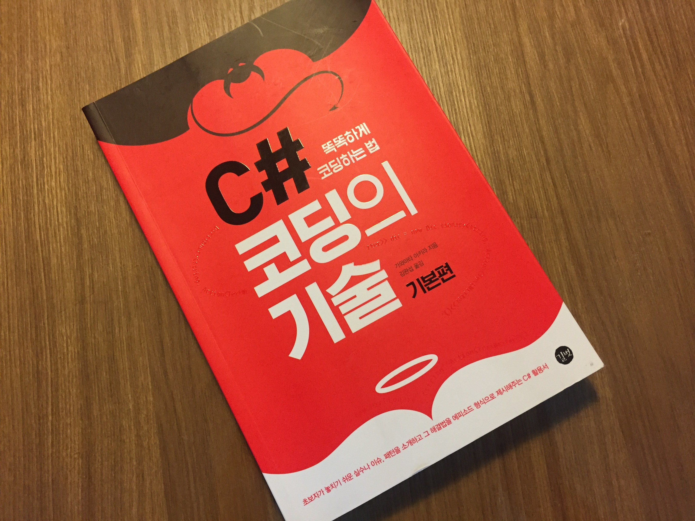
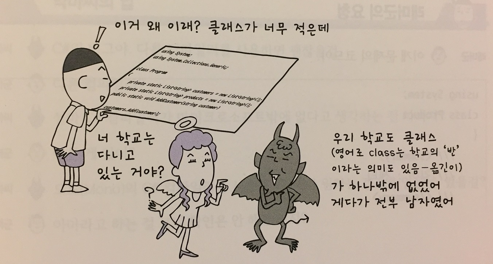
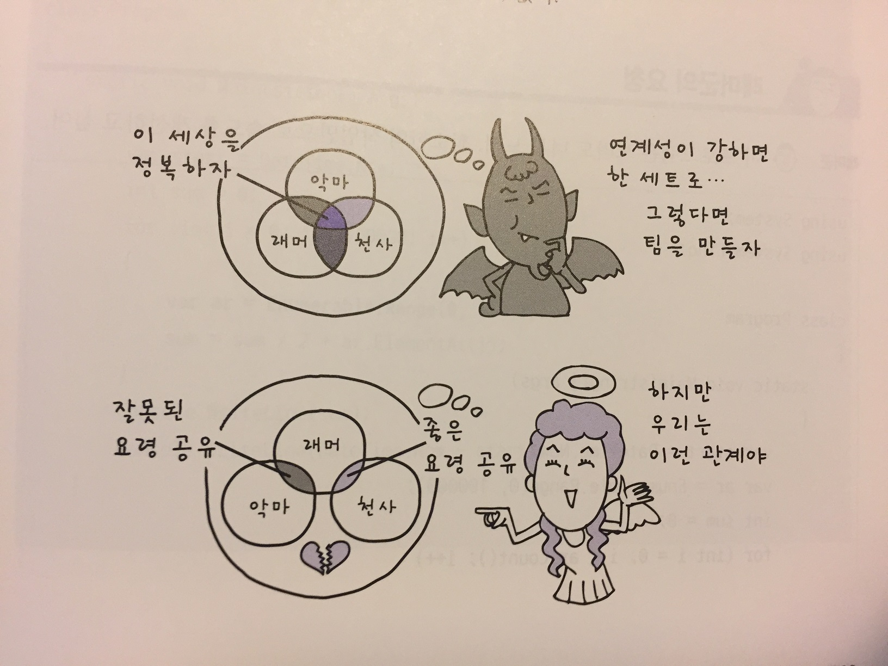
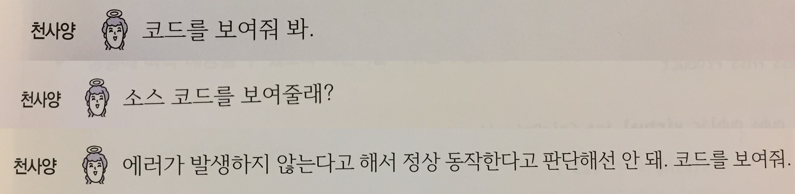

# [리뷰] C# 코딩의 기술 기본편

## 책이 주었던 느낌

책을 처음 받았을 때 생각보다 아담한 사이즈였고 책을 펼쳐보니 대화식의 짤막한 단원들로 구성이 되어 있어서 기본편 답게 가벼운 내용을 다루겠구나라고 생각했었습니다. 하지만 책을 완독하고 난 후에는 기본편이라고만 보기에는 깊은 내용들이 많이 담겨있었고, 실무에서 반드시 필요한 지식들로 가득했습니다. 마치 이펙티브 시리즈를 보는 것 처럼 각 단원마다 버릴 내용이 없었고, 개그 요소를 섞어가며(저자가 일본인이라서 일본식 개그가 많았지만) 딱딱한 주제들을 재미있게 풀어나가는 필력 또한 감탄스러웠습니다. 

이 책에는 신입 개발자 느낌의 래머군과 이 래머군이 업무를 진행하면서 생기는 궁금증들에 대해 조언 또는 토론을 진행하는 악마와 천사가 등장합니다. 악마는 악마답게 그럴싸하지만 완벽한 답이 아닌, 또는 잘못된 답을 알려주고 천사가 이를 비판하며 모범답안을 제시합니다. 이러한 진행 과정이 대화체를 통해 이루어지는데 평소에 개발자들과 주고 받았던 대화들과 비슷한 부분들이 많아서 여러모로 공감을 해가며 재미있게 읽을 수 있었습니다. 

이렇게 재미 요소를 넣어가며 쉽게 풀어나가다보니 어떤 주제에서는 조금 더 깊게 다뤄주었으면 좋겠는데 언급만 하고 지나가는 경우가 다소 있었습니다. 이런 부분에서는 언급된 내용들을 단초로 검색을 통해 궁금증을 해소할 수 있었습니다. 너무 자세한 내용을 이 책에서 다루게 된다면 흥미가 떨어질 수도 있을 것 같다는 생각에 기본편이라는 타이틀 답게 이 정도 수준이 책에서 다루는 내용으로 적절한 것 같다고 생각을 했습니다.

## 책의 구성

책의 구성을 살펴보면 먼저 **1장에서는 언어 사양 문제**를 다루고 있는데, 이는 비단 C#을 위한 내용만은 아니었습니다. 개인적인 생각으로 이 책은 C#이라기 보다는 C 계열의 객체지향 프로그래밍 언어들 중 어떠한 언어를 사용하는 개발자든 읽으면 많은 도움이 될 것이라고 생각을 합니다. 저 또한 최근에는 자바를 더 많이 사용하고 있는데 책을 읽어 나가며 많은 부분에서 도움이 되었습니다.

**2장에서는 라이브러리 문제**에 대해 다루고 있는데, 가장 C#에 특화된 장이었습니다. 다른 언어들에는 해당되지 않는 내용들이 많았고, 마지막 자바여 편히 잠들라 라는 단원에서는 제목만 보고 C# 추종자 같은 느낌이 들었지만 그런 내용은 아니었고 C#과 자바의 언어적 지향점이 다르다는 것과 언어마다의 특성을 잘 이해해야 한다는 내용이었습니다. 특히 같은 객체지향 언어라고 해서 쉽게 보고 쉽게 구현해낼 수 있다는 생각이 나중에 큰 화를 부를 수 있겠다는 생각을 하였습니다. 사실 얼마전까지만해도 자바스크립트가 자바랑은 다르긴 하지만 금방 배워서 쓸 수 있겠지라는 생각으로 웹개발에 도전했었는데 나름 잘 구현했다고 생각했던 코드에서 의도하지 않았던 동작을 하고 서비스에 악영향을 미치는 것을 보고 언어에 대해서 제대로 알고 사용을 해야겠다는 것을 느꼈었습니다. 대부분의 문제들이 언어에 대해 제대로 이해하지 못하고 사용한 부분에서 발생했었습니다. 

**3장에서는 개발 환경 문제**에 대해 다루고 있는데, GAC이라는 것은 이 책을 통해 처음 알게되었습니다. 글로벌로 참조를 하여 여러 애플리케이션에서 참조할 수 있다니, 좋은 점도 있겠지만 책에서 언급한 것 처럼 많은 주의를 기울여야 할 것 같았습니다. 그리고 버전에 대한 부분에 대해서도 언급을 하는데 실제로 업무를 하면서 자바스크립트의 특정 라이브러리를 사용하다가 최신 버전으로 버전업을 하니 잘 돌아가던 코드에서 오류가 났던 적이 있었습니다. 널리 알려진 단체에서 개발한 라이브러리에서도 버전업을 하면 이전 버전을 사용하던 부분에서 오류가 발생하는 경우가 간혹 있는데, 하물며 인터넷에 떠도는 각종 라이브러리들은 통보도 없이 변경되는 경우가 허다합니다. 그러므로 버전 변경은 꼼꼼한 확인을 통해 이상이 없다는 것을 검증한 후에 사용을 해야합니다.

**4장에서는 알고리즘 문제**에 대해서 다루고 있는데, 악마가 조언하는 알고리즘들을 보니 자꾸 저를 보는 것 같아 부끄러운 마음이 들기도 하고 웃기기도 했습니다. 읽는 내내 악마를 보면 자기 주관이 없고 이리저리 흔들리는 모습을 보니 자꾸 거울을 보는 듯한 느낌이 들었습니다. 

이에 반해 천사의 경우에는 거두절미하고 코드를 보여줘라는 대사와 함께 추측하지 않고 자신이 알고 있는 팩트를 가지고 조리있게 얘기하는 걸 보고 느끼는 부분이 많았습니다. 

마지막 **5장은 비주얼 스튜디오**에 대한 내용이므로 팁이라 생각하고 가볍게 읽어보면 좋을 것 같습니다. 

## 결론

이 책의 장점은 대화체를 사용한다는 점과 이로 인해 처음부터 끝까지 술술 읽힌다는 것입니다. IT 전문서를 읽다보면 처음 의지와는 달리 점점 흥미를 읽고 포기하는 경우가 많은데 이 책은 끝까지 재미있게 읽을 수 있었습니다. 코딩의 기술 시리즈는 C# 실전편이 존재하고, C#외에도 파이썬과 자바편도 있는데 한번씩 읽어보고 싶은 마음이 들었습니다. 현업에 입문한 신입 개발자들이나 개발에 지쳐 잠시 머리를 식히고 싶은 개발자 분들께 이 책을 추천합니다.