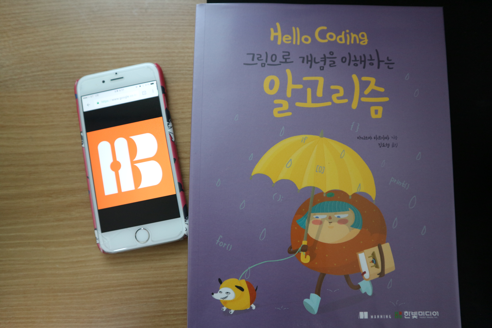
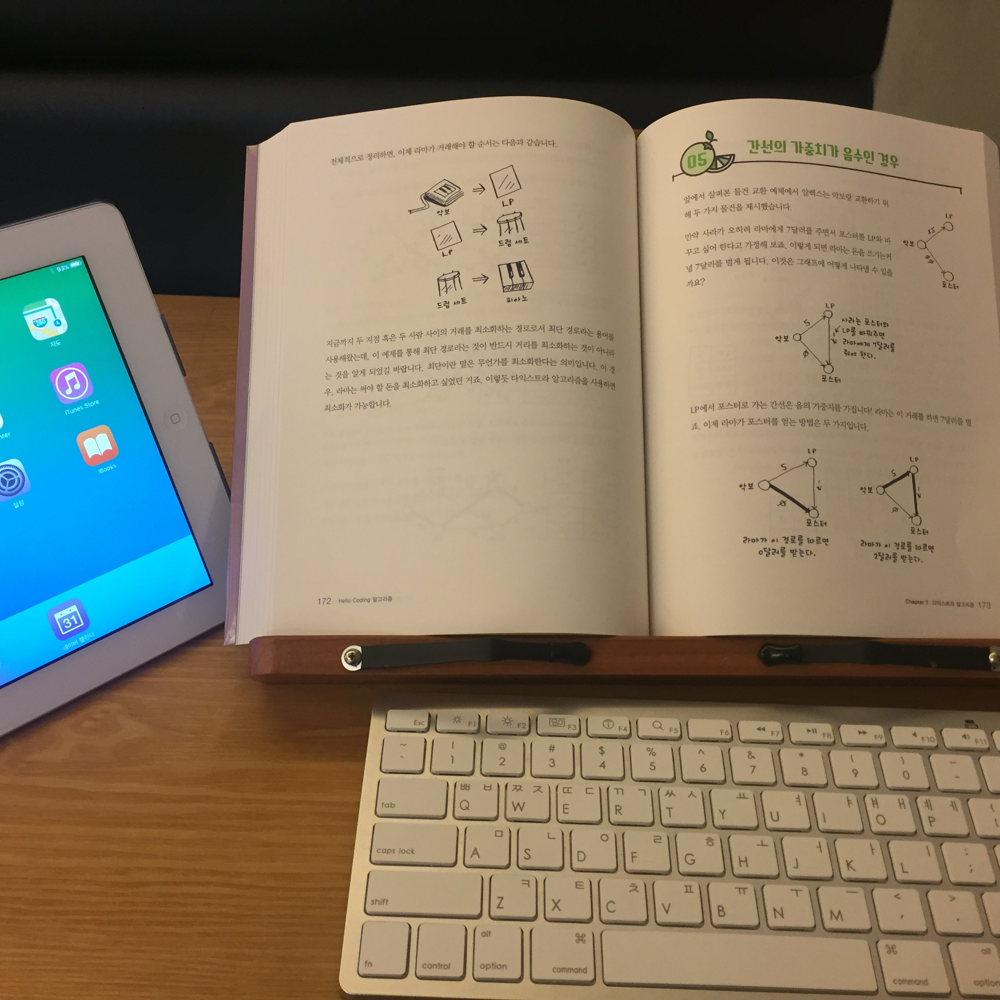
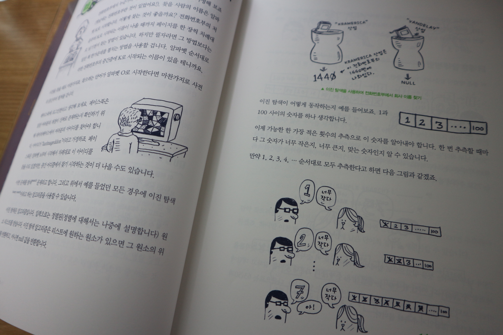
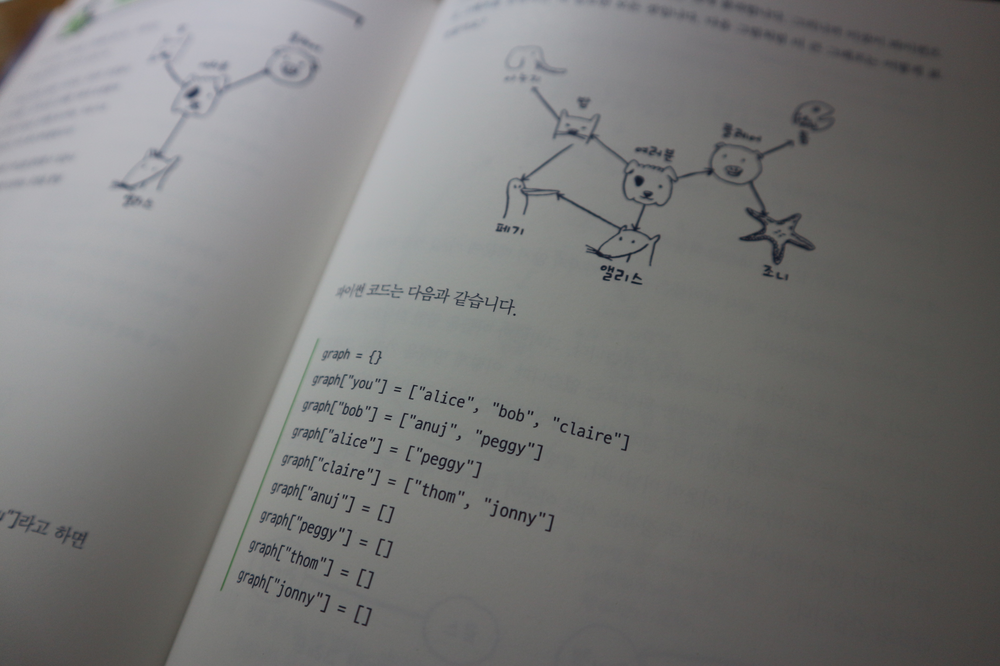
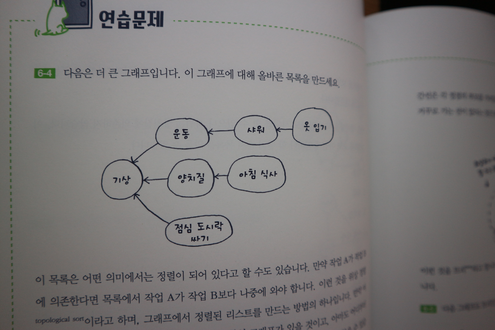
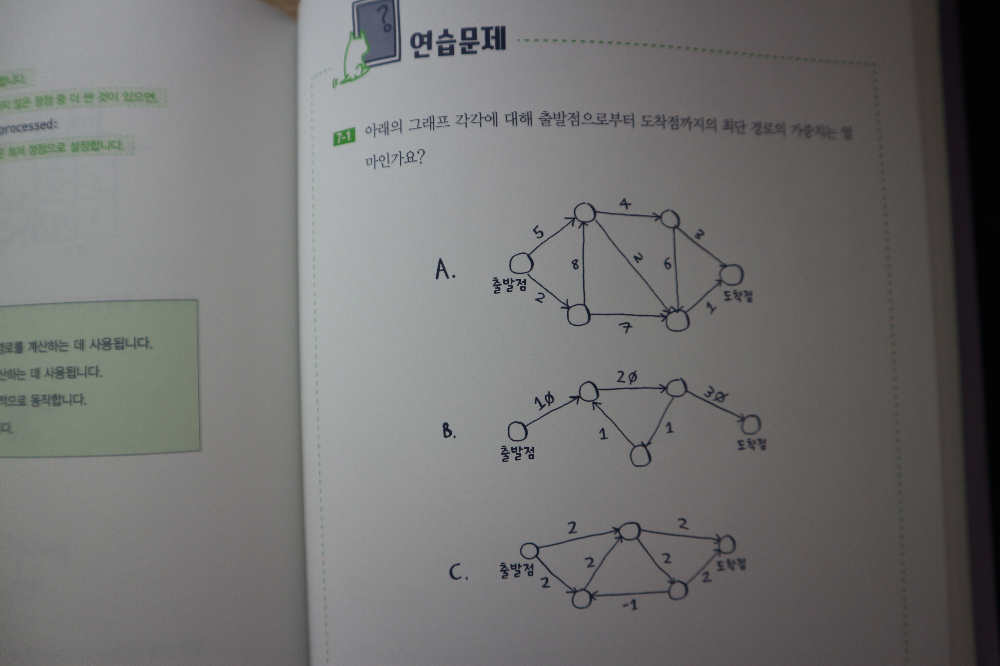
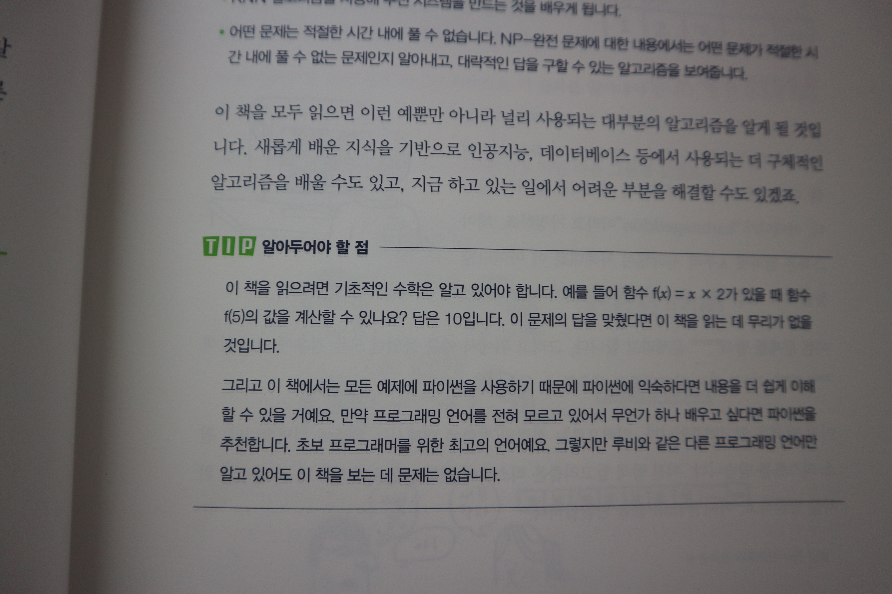

알고리즘과 자료구조에 대한 공부는 대학교 이후로는 크게 신경을 쓰지 않고 지내오다가 면접을 봐야하는 시점이 되었을 때 벼락치기로 공부를 하고는 했었습니다. 취업이나 이직을 위해 각 회사의 필기/실기 시험과 기술면접 시에 항상 문제가 되었던 항목이 이 알고리즘이었는데 평소에는 왜 그렇게 하기가 싫고 오래 지속하기가 힘든지.. 혼자 하기가 힘들어서 그룹 스터디를 진행하기도 했었는데 구성원 모두 2~3주차가 되는 시점에서 시들해지더니 결국에는 흐지부지하게 끝나버리기도 했었습니다. 원인이 무엇인지 골똘히 생각을 해보니까 알고리즘 공부는 단기간에 확 티나는 것도 아니었고, 실무에서는 이미 잘 구현된 라이브러리를 사용하기 때문에 이해했다고 해서 딱히 써먹을 곳도 없었기 때문이지 않았을까 생각했습니다. **가장 큰 문제**는 **처음부터 너무 어려운 알고리즘 책을 선택**했었다는 것.. 문제를 볼때마다 좌절감을 맛보았기 때문에 포기가 빨랐었다고 생각합니다.

반면에 **Hello Coding 그림으로 개념을 이해하는 알고리즘**을 읽으면서 느낀 점은 설명하기 어려운 부분들을 정말 쉽게 잘 표현했다는 것이었습니다. 그림의 힘이 대단하구나를 다시 한번 느낄 수 있었는데, 대학교 시절에 텍스트만으로 가득한 자료구조 책으로 공부할 때는 그렇게 어렵게만 느껴지던 알고리즘/자료구조 내용이 이 책을 읽을 때는 머릿속에 쏙쏙 들어왔습니다. 물론 이미 배웠던 내용들이라 사전 지식이 있었던 것이 도움이 되긴 했겠지만 처음 공부를 했더라도 이 책이었다면 이해가 정말 쉬웠을 것이라는 생각이 들었습니다. 

글의 전개를 보면 **가장 먼저 이 알고리즘으로 대체 무엇을 할 수 있는지**를 알려줍니다. 책을 읽으며 마음에 드는 부분 중 하나였는데, 사실 알고리즘을 학습한다고 해도 초급자의 경우에는 대체 이걸로 뭘한다는 거지? 라는 생각이 들 수 있기 때문에 먼저 무엇을 할 수 있는지를 알게 되면 다음 설명에 더 집중을 할 수 있게 됩니다. 

다음으로는 기초적이고 쉬운 개념부터 **그림을 통해 설명**을 해가면서 이해를 시켜주고, 그 이해를 토대로 **파이썬 코드**를 보여주며 실제 구현을 보여줍니다. 그리고 나서 이 알고리즘이 **성능은 어느정도인지 빅오 표기법을 통해 증명**을 시켜줍니다. 빅오 표기법에 모른다면 이 책을 꼭 보시길 추천합니다. 저 또한 가볍게만 알고 있었는데 이 책을 통해 확실히 개념을 잡을 수 있었습니다. (이 또한 그림으로 쉽게 설명되어있어요)  그리고 각 챕터의 끝부분의 **연습문제**를 풀어보면서 개념을 더 확고히 다질 수 있었습니다. 연습문제의 난이도는 상당히 쉬운 편이라서 부담없이 풀어 볼 수가 있을 것입니다.

이 책의 내용 중 **그래프**의 내용을 보면 먼저 이 알고리즘을 통해서 체커 게임에서 가장 적은 수로 승리할 수 있는 방법을 계산한다던지, 맞춤법 검사기 또는 가장 가까운 의사 선생님 찾기와 같은 것을 할 수 있다고 얘기합니다. 저는 이 내용을 보고 그래프에 대해 잘 몰랐기 때문에 급 관심이 생기게 되었습니다. 그래서 그 뒤에 나오는 내용들에 훨씬 더 집중을 하게 되었습니다. 그 뒤로는 **최단 경로**에 대한 간단한 예제를 그림을 통해 설명을 시작하고, 이러한 최단 경로를 찾기 위해서 **너비 우선 탐색**이라는 알고리즘에 대해 설명을 합니다. 너비 우선 탐색이 어떤 건지는 알겠는데 이렇게 이웃을 추가해가며 탐색하면 중복되는 이웃은 어떻게 하지? 라는 의문이 들 때 쯤 바로 이에 대한 언급과 해결책을 보여줍니다. 이웃을 탐색하는 로직과 이웃의 이웃을 추가하는 로직, 이미 탐색한 이웃인지를 검사하는 로직 등 반복문을 수행하는 경우가 많은데 성능이 별로 좋지 않은거 아닌가? 라는 의문이 들 때쯤 성능에 대해 빅오 표기법으로 설명을 해줍니다. 네이버 길찾기를 이용해보면 최단 경로도 중요하지만 그보다는 시간이 가장 적게 걸리는 경로가 더 중요한거 아닌가? 라는 생각이 들 때쯤 **다익스트라 알고리즘**을 통해 최단 시간 경로 를 구하는 방법에 대해 알려줍니다. 마치 너가 이런 고민 하고 있을 줄 알았어 라는 듯이 모든 의문점들을 순차적으로 해소시켜줘서 나중에는 감탄만 남았었습니다. 

학교 다닐 때 이 책을 봤더라면, 면접 준비할 때 이 책을 봤더라면 더 좋았을 것 같다는 생각이 많이 들었고, 취업 준비하는 후배들에게 꼭 추천을 해주어야 겠다고 생각을 했습니다. 책을 읽고 나서 아직도 기본이 많이 부족하다는 것을 느꼈고, 여태 작성해왔던 블로그 글이너무 텍스트 위주였기 때문에 작성했던 저 조차도 시간이 지난 뒤에 다시 볼때 이해가 잘 되지 않던 부분들이 있었는데 그림을 최대한 많이 첨부해봐야 겠다는 생각이 들었습니다. 책을 읽으면서 대부분의 내용을 머릿속으로는 이해를 했지만 아직은 다른 사람에게 설명을 할 정도의 완벽한 이해는 하지 못했기 때문에 자주 꺼내읽어 볼 리스트에 추가해놓고 필요할 때마다 꺼내서 읽어봐야할 것 같습니다.