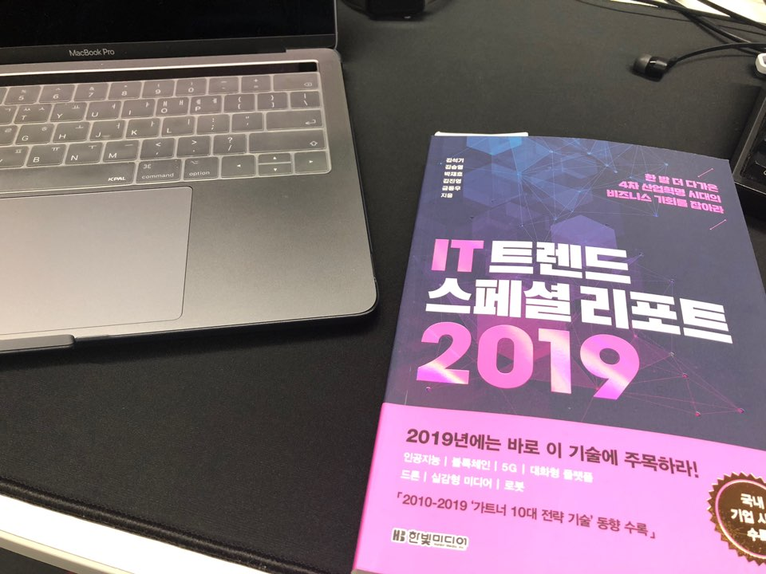

# [리뷰] IT 트렌드 스페셜 리포트

# 들어가며

해마다 IT 트렌드에 대한 도서들이 출간되는 것은 알고 있었지만 봐야할 필요성을 크게 느끼지 못하고 있었다. SNS나 IT 뉴스들을 통해 대략적인 IT 트렌드의 흐름은 인지하고 있었고, 책에 포함된 내용들이 크게 와닿는 부분들이 없었기 때문이었던 것 같다. 2018년도는 급변하는 환경을 직접적으로 느끼고 트렌드에 대한 중요성을 너무나 느꼈기 때문에 더욱 관심이 생겼다. 그래서 마이크로소프트웨어도 정기 구독 신청하고, 관련 컨퍼런스에도 자주 참석하게 되었다. 또한 이번에는 IT 트렌드에 대한 책도 한번 읽어보자는 생각이 들어서 읽기 시작하게 되었다. 

# 책을 읽으며

책을 읽으며 가장 먼저 들었던 것은 작가의 필력이었다. 나도 글쓰기를 자주 하는 편이기 때문에 이해하기 쉽게 잘 작성하는 것이 얼마나 힘들고 어려운지 잘 알고 있었는데, IT 대한 이야기를 이해하기 쉽고 재미있게 잘 작성하셔서 몰입하면서 읽을 수 있었다. 

그 중에서도 가장 기억에 남았던 것은 5G에 대한 이야기였는데 벌써부터 광고에도 등장하고 있기 때문에 더욱 관심이 갔었던 것 같다. 내용을 읽으며 다가 올 현실을 자꾸만 상상하게 되고, 관련 내용을 더 공부하고 싶다는 욕구가 들기도 했다. 산업이 발전하게되면 이로 인해 직장을 잃게 되는 사람도 많겠지만 새로운 사업이 창출되고, 이로 인해 실제로는 일자리가 더욱 늘어난다는 말에 생각해보니 최근에만 해도 VR과 AR이 등장하면서 관련 매장들도 늘어나고, 엄청나게 많은 사람들이 이 새로운 산업에 종사하고 있다는 것이 느껴져 신기하기도 하고 재미있었다. 

책의 내용 중 머신러닝에 대한 이야기는 너무도 많이 들어왔고, 블록체인에 대한 부분은 요즘 화두가 되고 있기 때문에 궁금했었는데, 이 책으로 인해 어느 정도 궁금증이 해소 되었다. 또한 블록체인 분야도 매우 전망이 있을 것이라는 생각이 들어서 공부해보고 싶기도 했다. 

# 정리

결론적으로 IT 트렌드 관련 책은 해마다 읽어봐야겠다는 생각이 들었다. 어렴풋이 알고 있던 주제들이 흐름을 알게 되고, 논리적으로 이해가 되면서 만족감을 크게 느꼈다. 이런 내용들은 재미있게 읽었다가도 금방 잊어버리기 때문에 곁에 두고 주기적으로 훑어보는 것도 좋을 것 같다. 앞으로도 트렌드에 지속적으로 관심을 가지면서 뒤쳐지지 말고 다가올 미래에 대비해야겠다.