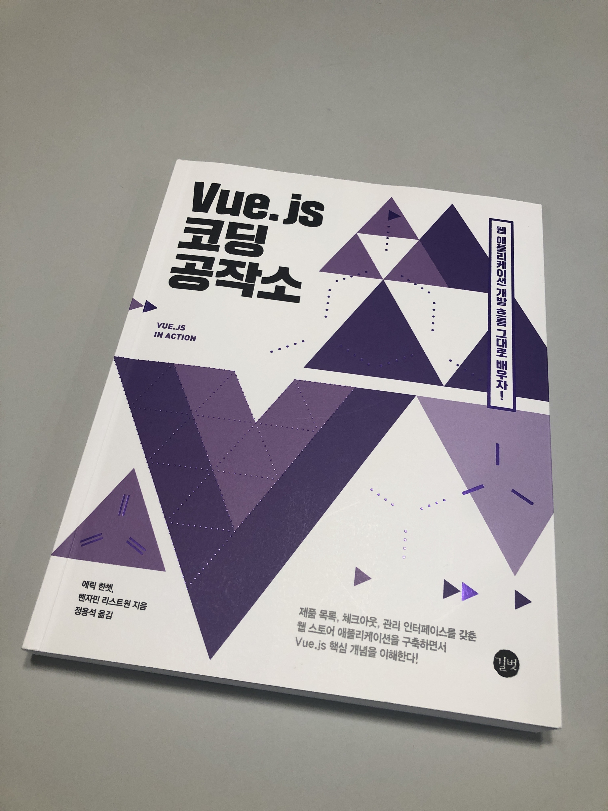
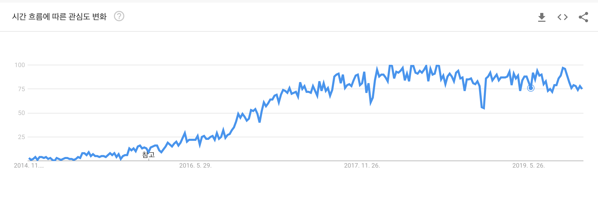

# Vue.js 코드 공작소

## 들어가며

요즘 세미나나 스터디에 참여하다보면 프론트엔드와 백엔드를 둘 다 하고 계신 분들이 참 많다. 나 또한 백엔드 개발만 해오다가 얼마전부터 프론트엔드까지 하게 되어 굉장히 힘든 나날을 보내고 있다. 한번에 사용해야 하는 언어도 여러가지이고 사상도 달라서 개발 중간 중간 헷갈릴 때가 많다. 내 생각에는 아직 백엔드에 비해 프론트엔드에 대한 기본 지식이 부족해서 인 것 같다. 백엔드도 굉장히 발전히 빠르고 공부할 것들이 넘쳐나기 때문에 둘 다의 트렌드를 따라가기에는 쉽지 않은 것이 사실이다. 이런 상황이다 보니 나의 프론트엔드에 대한 목표는 먼저 자바스크립트 기본을 익히고, 잘 만들어진 것들을 가져다 잘 사용하는 것이었다. 

개발을 하다보면 가장 힘든 부분이 초반에 프로젝트 구조를 어떻게 잡고, 유지보수하기 쉽게 개발을 할 수 있도록 설계를 하는 것인데, 이런 것들을 잡아주는 좋은 프레임워크들이 많이 존재한다. 그 중에서 가장 핫하게 사용하는 것이 React와 Angular, Vue.js 였는데 초기에는 셋 모두에 살짝 발을 담가만 보았다. 개인적으로는 Vue.js가 가장 쉬웠으며 공부하는 기간도 가장 적게 들었기 때문에 Vue.js를 선택하게 되었다.

아래 지난 5년간 트렌드에서 보는 것처럼 Vue.js에 대한 관심과 사용자가 점점 증가하고 있기 때문에 앞으로도 더 좋은 프레임워크로 성장할 것이라는 생각이 들어서 현재 실무에서도 선택하여 사용하고 있다. 

## 책을 읽으며

나는 특정 기술을 공부할 때 간단히 웹으로 검색해보고, 자세히 볼 필요가 있을 경우 책을 찾게 되는데, 실무에서 사용 중이라서 Vue.js는 제대로 공부해보고 싶은 마음이 들었다. 그래서인지 어느새 Vue.js 책만 4권이나 소지하고 있다. 굉장히 쉽고, 얇아서 읽기 편한 책으로 시작해서 조금씩 어려워보이는 책들을 찾아 읽게 되었다. 그러던 중 **Vue.js 코드 공작소**를 읽게 되었다. 이 책은 내 생각에는 초, 중급 레벨의 책이라고 생각한다. 예제를 들어 쉽게 설명을 해나가면서도, 신기하게도 내가 Vue.js를 공부하면서 어렵게 생각했던 개념들에 대해서는 상세하게 설명이 첨부되어 있었다. 그럼에도 불구하고 컴포넌트에 대한 개념 부터는 살짝 머릿속이 복잡해지기도 했다. 이렇게 잘 이해 안될 때는 역시 백문이불여일타!

내 생각에 이 책의 최고 강점은 예제라고 생각한다. 책의 예제를 하나씩 따라하다보면 최종적으로 훌륭한 웹 페이지(애완용품샵)가 완성된다. 다른 책들은 예제 간의 연관성이 별로 없어서 직접 실행해 보는 것도 있고, 귀찮아서 읽기만 하고 넘어가는 경우가 많았는데, 이 책은 완성해가는 재미가 있기 때문에 그럴 수가 없다. 설명 또한 장황하지 않고, 이해하기 쉬웠다. 

다만 이 책은 자바스크립트에 대한 기본적은 이론은 거의 포함되어 있지 않고 Vue.js에만 초점을 맞춘다. 나는 개인적으로 만족스러웠다. 일부 책들에는 자바스크립트 이론도 상당 부분 포함되어 있어서, 그냥 읽지 않고 건너 뛰는 경우도 많았다.(책의 주제에서 벗어나는 부분이기 때문에 설명도 빈약하다.) 사실 자바스크립트에 대한 이론은 더 상세하고 잘 작성된 책들이 시중에 굉장히 많기 때문에 그런 책들로 공부하면 된다고 생각한다. 그런면에서 이 책은 굉장히 만족스러웠다.

## 마무리

이 책을 읽기 전에 자바스크립트에 대한 기본 지식은 당연히 있어야한다. Vue.js와 React가 너무 많이 사용되고 있다보니 자바스크립트와 이런 프레임워크를 아예 다른 기술이라고 생각하고, 프레임워크에 집중해서 공부를 하는 경우가 있는 듯하다.(최근 대학생들이나 주니어 개발자들과 이야기해 볼 기회가 있었다.)

프레임워크도 물론 중요하지만 그 근간을 이루는 기본 지식이 매우 중요하다고 생각한다. 나 또한 이런 기초 지식이 많이 부족하기 때문에 프레임워크 공부하면서 이해가 잘 되지 않을 때가 많다. 

책을 읽고자 하는 독자들이라면 Vue.js에 대한 공부와 병행 또는 선행해서 프로그래밍 기초와 자바스크립트에 대한 기본 지식을 공부하길 권한다.