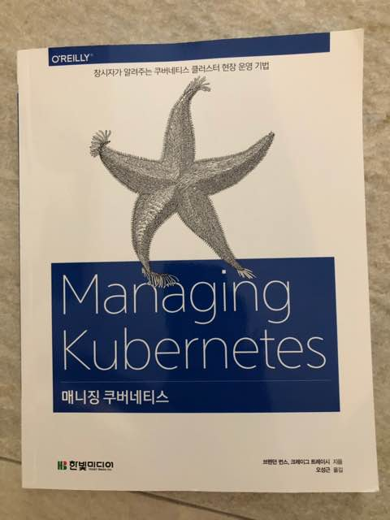

# 매니징 쿠버네티스

## 들어가며

어느정도 규모가 있는 회사라면 개발 외 다른 부분을 해결해주는 여러 팀들이 존재하겠지만 대부분의 회사들에서는 백엔드 개발자가 많은 부분을 감당해야한다. 그래서 요즘들어 백엔드 개발자가 개발만 잘해서는 부족하다는 생각을 한다. 개발 중간에도 수시로 빌드를 하고, 테스트 서버로 배포를 해야하는데 자동화 되어 있지 않고 일일이 수동으로 배포해야한다면 어떨까? 매일 많은 시간들을 허비하게 될 것이다. 그리고 실제 서비스를 런칭하게 되면 백엔드개발자가 인프라까지 생각해야 될텐데 개발, 빌드, 배포부터 서비스 런칭까지 백엔드 개발자가 이 모든 것들을 감당하는 것이 가능할까? 클라우드와 컨테이너라면 충분히 가능하다고 생각한다. 나 또한 요즘들어 컨테이너와 자동화에 관심이 많이 생겨서 개발보다 더 열심히 공부하고 있는데, 소규모 인원으로 이러한 많은 것들을 관리하고자 하는 요구사항은 어느 조직에나 필요한 부분인지 이미 많은 도구들이 만들어져 있다. 인프라 프로비저닝을 위한 도구로 많이 알려진 테라폼과 컨테이너 관련 도구로 잘 알려진 Docker와 Docker Swarm, Kubernetes와 같은 도구들이 존재한다. 기존에는 Docker를 공부하며 당연히 Docker사에서 밀고 있는 Docker Swarm이 대세가 될 것이라고 생각했는데 얼마 지나지 않아 대형 벤더들에서 쿠버네티스 기반 서비스들을 제공하면서 쿠버네티스로 대동단결 하고 있다.

## 책을 읽으며

트렌드를 따라가고자 쿠버네티스 관련 책들을 구입해서 읽어보았고, 매니징 쿠버네티스를 읽기 전 가장 최근에 읽었던 책은 쿠버네티스 인 액션이었다. 지금껏 읽었던 쿠버네티스 관련 책들은 각 기능에 대한 설명서였다면 매니징 쿠버네티스는 기능에 대한 이해를 기반으로 실제 운영에 필요한 부분들에 대한 노하우가 담겨져있다. (이펙티브 C++이나 이펙티브 자바와 비슷한 느낌) 

이미 쿠버네티스에 대해 잘 알고 있다는 전제하에 기술된 책이다보니 난이도가 꽤 있다. 대신에 전제조건을 갖춘 사람이 읽었을 땐 굉장히 큰 도움이 될 것이라 생각한다. 나는 쿠버네티스에 대한 공부를 꾸준히 하긴 했지만 실제 운영 경험이 없어서 읽을 때 어려운 부분들이 다소 존재했지만 보완할 만한 다른 글들을 찾아가며 읽었을 때 큰 문제가 문제되진 않았다. 번역서이다보니 다소 매끄럽지 않은 번역이 존재하긴 하지만 읽기 불편할 수준은 아니다. 

책의 내용이 운영적인 부분이 많고, 쿠버네티스에 대한 깊은 곳까지 파고들기 때문에 정말 이렇게 동작 하나? 하는 의문이 들기도 했는데 책의 저자가 쿠버네티스 co-founder인 브랜던 번스라서 믿고 볼 수 있었다. 책에 알고리즘적인 부분이나 동작 원리에 대한 부분을 설명할 때면 실제 코드를 첨부하기도 하고 코드에 대한 링크를 남기기도 해서 애매한 부분은 직접 코드로 확인해볼 수도 있다.

## 마무리

이제 운영을 위한 쿠버네티스 클러스터를 구축해야 하는 시점에서 굉장히 큰 도움을 준 책이었고, 아직 전부 소화해내진 못했다. 쿠버네티스는 네트워크, 보안, 파일시스템 등 광범위한 분야의 노하우가 집대성한 느낌이다. 앞으로는 쿠버네티스가 더 많은 부분을 차지할 것이라고 생각하고, 공부도 게을리하면 안되겠다는 생각을 했다. 운영을 해가며 차차 이 책과 함께 운영 노하우를 쌓아가길 기대한다.