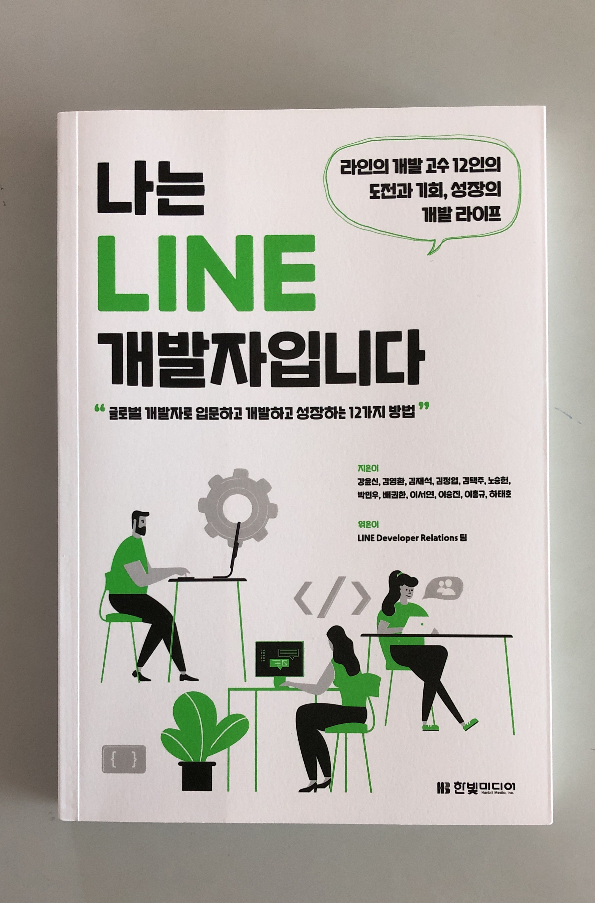
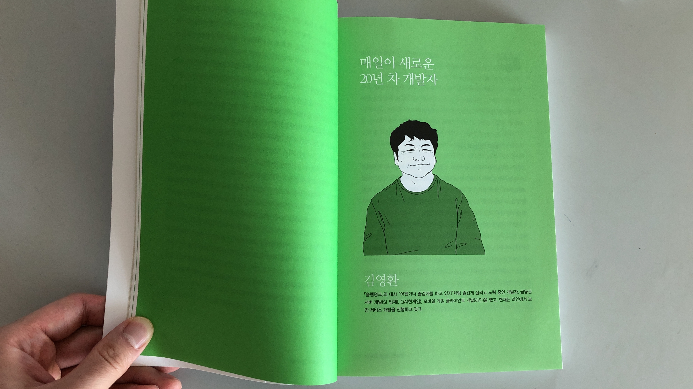
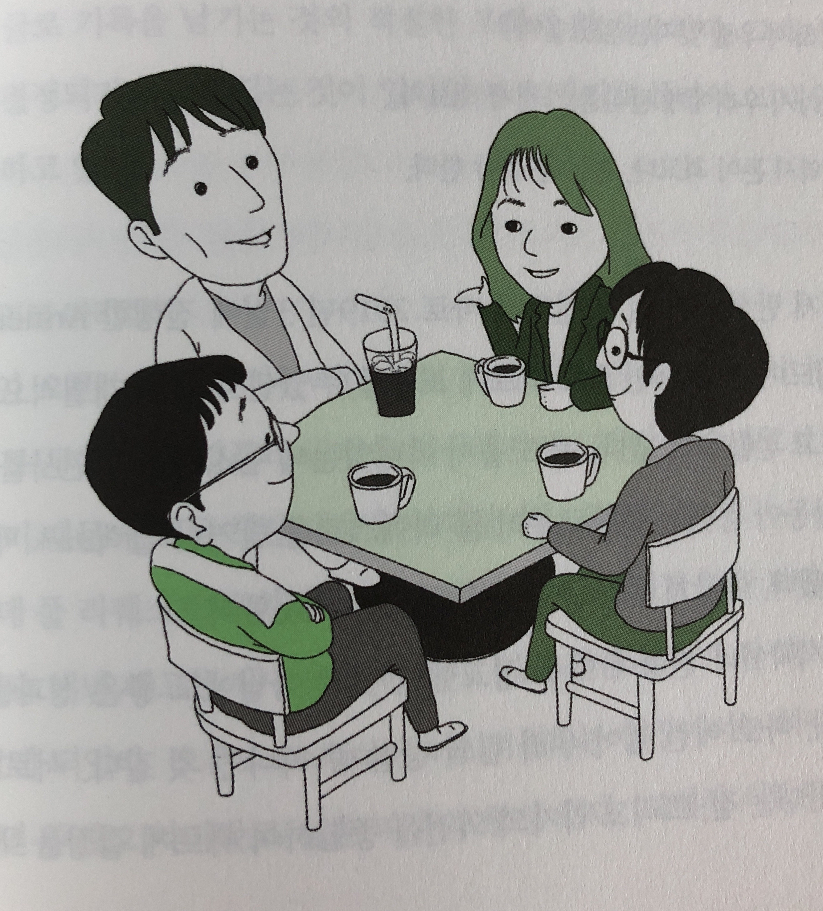

# 나는 LINE 개발자 입니다

Created By: 용호 최
Last Edited: Oct 13, 2019 1:25 PM

얼마전부터 페북 타임라인에 나는 LINE 개발자 입니다 책의 출간 소식이 간간히 들려오고 주변 지인들의 리뷰 내용들이 이어지면서 읽어보고 싶은 생각이 들었다. LINE에서의 생활이나 LINE에서 겪었던 경험담이 주를 이룰 것이라는 생각과는 달리 LINE에서의 업무 뿐만 아니라 집필하신 동종 업계 선배님들의 주옥같은 경험담이 담겨져 있었다. 처음부터 끝까지 시간가는 줄 모르고 재미있게 읽었던 것 같다.

책은 다음 4가지 주제로 나뉘어 있고, 각 주제별로 다양한 집필자들의 경험담들이 녹아있다.

1부부터 라인 개발자의 일상이라는 주제로 시작하지만 사실 내용은 신입 시절부터 라인에 오기까지의 과정과 라인에서의 업무까지 포함되어 있다. 다른 주제들도 주제에 대한 내용을 커다란 틀로 내용을 이어가지만 대부분은 자신의 개발 히스토리가 담겨져 있어서 모든 내용이 흥미 진진했다. 

시작부터 엘리트 코스를 밟아 오신분도 계시고, 창업 이후 창업한 회사가 망해서 고생을 했던 분, 창업한 회사가 라인에 인수되면서 합류하게 된 분들 등 다양한 경험담을 들으며 나와 동종 업계에 계시지만 정말 다양한 분들이 많구나라는 걸 새삼 느끼게 되었다. 다들 굉장히 노력했고, 다들 실패도 맛보았지만 이 모든 것이 밑거름이 되어 결과적으로는 성공한 현재의 자신들을 만들어 낸 것이라고 생각한다.  나 자신은 최근들어 굉장히 힘든 상황을 겪고 있다고 생각하고 있었는데 이 분들에 비하면 아무것도 아닌 엄살에 불과하다는 것을 느끼게 되었고 창피한 마음이 들었다. 

많은 내용들이 담겨있었지만 그 중에서 아래 김영환님의 글이 개인적으로 많이 와닿았다.

신입 때 내가 느꼈던 긴장감, 설렘, 두려움 등 이런 감정들을 이런 대단한 개발자도 똑같이 느꼈구나 라는 생각과 처음 신입으로 입사했을 때 잘 알려진 게임회사에 입사했다는 뿌듯함에 주변에 자랑을 했지만 실상은 회사 업무에는 모르는 것 투성이에 실수도 많이하고, 자책을 많이 했던 시기였던 것 같다. 그래서 더 잘하고 싶은 마음에 당시 C++책은 대부분 사서 읽고, 관련 세미나도 많이 찾아다녔던 기억이 있다. 그리고 나 또한 중간에 슬럼프가 찾아온 적이 있었는데 이 때 김영환님과 마찬가지로 유럽으로 리프레시 여행을 떠났었는데 다시 업무에 대한 열정을 찾는 좋은 시간이었다고 생각한다. 현재의 나도 지금 하고 있는 것들이 옳은 것일까, 선택과 집중을 해야하는 것아닌가 라는 고민을 많이 하고 있는데 글을 읽으며 많은 위로가 되었다.

이 책은 개발자라면 꼭 한번 읽어봤으면 좋겠다. 나와는 다른 방식으로 살아온 베테랑 개발 선배님들의 이야기를 읽으며 자극도 받고 많은 생각을 갖게 해주었고, 만약 독자가 신입 개발자라면 어떻게 성장하면 좋을 지에 대한 아이디어를 얻을 수 있을 것이라고 생각한다. 언젠가 힘든 시기가 오면 다시 한번 읽어봐야겠다.