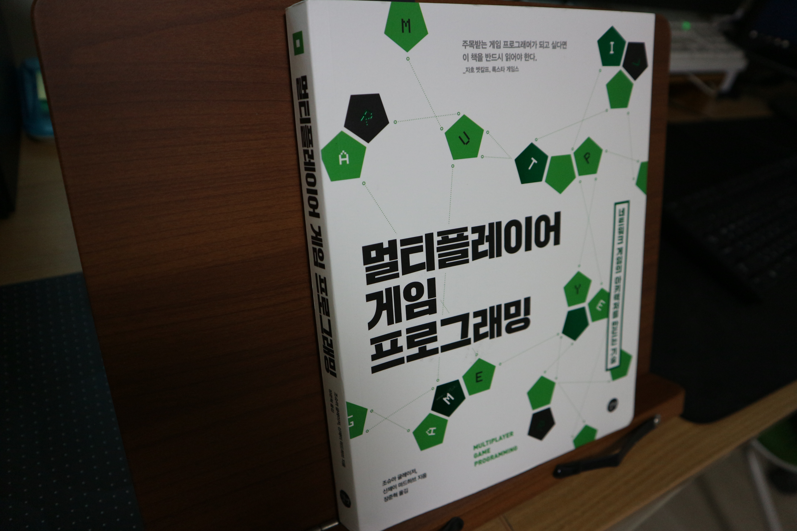

# [리뷰] 멀티플레이어 게임 프로그래밍

게임 서버 개발을 7년째 이어오면서 네트워크에 대한 깊은 지식을 항상 갈망하고 있었습니다. 학원을 다니며 CCNA를 준비해보기도 하고 두툼한 책을 구매해서 보기도 하였지만 전문용어들이 난무하고 이해하기에도 난해한 부분들이 많아서 항상 낙오를 해왔고, 어느 순간 모바일 프로그래밍으로 전향하게 되면서 네트워크에 대한 깊은 지식이 없어도 일하는데에 큰 어려움이 없어졌기 때문에 점점 네트워크에 대한 공부는 소홀해지게 되었습니다. 

하지만 최근에 인프라에 대한 관심이 생기기도 하고 클라우드를 통해 인프라를 구성하여 서비스를 해야하는 시점이 와서 네트워크에 대해 깊은 지식이 필요해지게 되었습니다. 이전에는 이론으로만 공부했었기 때문에 크게 와닿지도 않고, 왜 이러한 것들을 알아야하는지도 인식하지 못하고 주입식으로 공부를 해왔지만 현재는 서비스에 직접 네트워크 기술을 녹여내야 하기 때문에 절실함이 조금 더 생기게 되었고, 이해하는 부분에 있어서도 이 전과는 다름을 느꼈습니다. 

그러던 중에 때마침 멀티플레이어 게임 프로그래밍이라는 책을 읽게 되었고, 처음부터 끝까지 너무 재미있게 읽었습니다. 특히나 2장 인터넷의 TCP/IP 스택의 계층 구조 부분은 머릿속에 쏙쏙 들어왔고, 개인적으로는 가장 유용했던 장이었습니다. 그 전에는 이 계층 구조에 대해서 공부를 해도 감이 잘 오질 않았는데 여태 봤던 책들 중에 가장 이해하기 쉽게 잘 풀어내서 작성이 되었다고 생각합니다. 번역 하신분도 프로그래머라 그런지 책을 읽는 내내 전혀 어색함을 느끼지 못했습니다. 2장의 내용은 정리를 해두고 싶어서 제 블로그 포스팅으로 옮겨두었습니다. 이 포스팅을 참고하여 책을 읽기전에 어떠한 내용이 들어있는지 살짝 들여다 보는 것도 좋을 것 같습니다.

요즘 이 디자인으로 여러 책들이 보이는데 제목도 눈에 확 들어오고 책을 읽고 싶게끔 만드는 디자인이라 마음에 들었습니다. 책의 구성을 보면 2장까지가 뒤에 나올 코드들을 이해하기 위해 필요한 사전지식이므로 반드시 숙지를 하고 넘어가는 것이 좋고, 내용도 순차적으로 꼼꼼히 읽어 볼 것을 추천합니다. 앞에서 설명한 내용들이 뒤에도 언급되기 때문에 앞의 내용을 이해하지 못했다면 이 책은 어려운 책이 될 것입니다. 하지만 하나하나 차근히 이해해 나가면 제가 느꼈던 재미를 독자분들께서도 느끼실 수 있을 것입니다. 제가 1~3년차 시절 온라인 게임을 제작하던 때 네트워크 프로그래밍을 하며 단순히 구현된 내용을 따라 작성하던 코딩 내용이 책에서 여러부분 등장을 하였는데 설명된 부분을 보며 느낌표가 떠오른 적이 한 두번이 아닐 정도로 궁금했던 많은 부분 해소해주었습니다.

이 책에는 C++로 작성된 코드가 직접 예제로 수록되어 있고, 코드의 중요 부분들을 설명을 하고 있어서 실제 어떻게 사용이 되는지도 경험해볼 수가 있습니다. 저는 중간중간에 코드를 직접 쳐보면 읽는 흐름이 깨져서 실제로 코드를 쳐보지는 않았지만 이전에 구현을 해보았던 내용들이라 이해하는데는 큰 지장은 없었습니다. 하지만 네트워크 프로그래밍을 처음 하는 분이시라면 다 읽고 나서라도 꼭 실제로 해보실길 권하고, 책을 공부하는 방법은 자신에게 맞는 방법을 찾아서 진행하면 될 것이라 생각합니다.

이 책이 어려운 내용을 잘 풀어나가기는 하지만 그래도 이해하기 힘들었던 부분들도 있었습니다. 그러한 부분들은 여러번 반복해서 읽고, 헷갈리는 개념들은 앞에서 다시 찾아가며 진행을 하니 더디기는 했지만 이해가 될 때도 있었습니다. 결국에는 책에서 어려움을 느끼는 부분들은 제가 사전 지식이 부족해서 였던 경우가 대다수였기 때문에 이를 하나하나 짚어나가는 것도 저에겐 큰 도움이 되었습니다. 이 책을 읽으시는 분들도 이해안되는 부분을 그냥 넘어가지 마시고 다른 책이나 자료를 찾아서라도 이해를 하고 넘어가신다면 이 책을 다 읽고 난 뒤엔 네트워크에 대한 내공이 한층 업그레이드되어 있을 것입니다.

네트워크 프로그래밍에 이제 막 입문하는 분들과 저와 같은 5~10년차의 개발자에게도 네트워크 프로그래밍을 위한 기본 개념을 탄탄히 하는데 도움이 될 것이라 생각하고 반복해서 볼 것을 추천합니다. 저의 경우에는 이해하고 넘어가도 잘 잊어버려서 중요한 개념들은 따로 정리하여 자투리 시간에 핸드폰으로 빠르게 다시 읽어보며 머릿속에 새겨넣고 있습니다. 네트워크 프로그래밍에 관심 있으신 분들이라면 꼭 읽어봐야할 필독서로 이 책을 추천합니다.