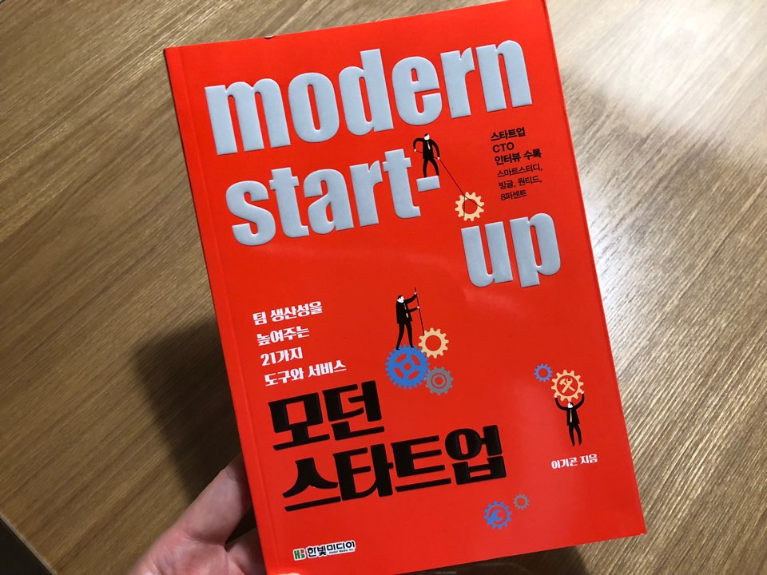
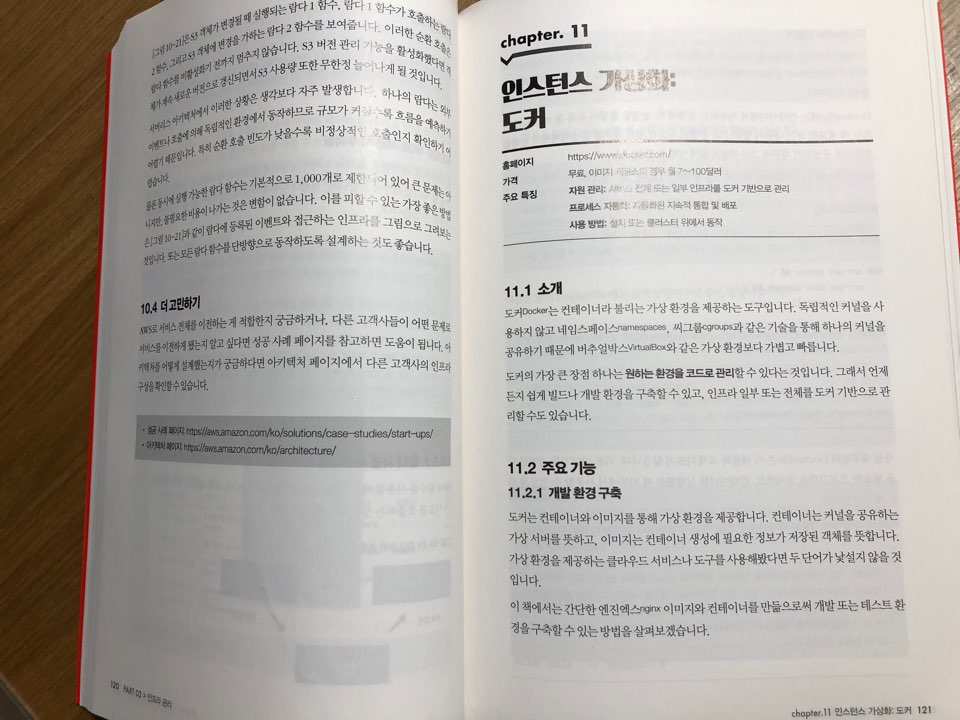

백엔드 개발을 이어오면서 회사의 규모에 상관없이 도구의 중요성은 갈 수록 더해지는 것 같다. 처음 백엔드 개발자로 일하면서는 개발에 필요한 IDE 외에는 별다른 도구를 사용하지 않았었다. 그게 불과 7년 전인데 그간 정말 많은 도구들이 생겨나고 접해보게 되었다. 그 과정에서 잘 만들어져있는 도구들을 굳이 직접 만들 필요가 없다는 것을 느끼게 되었고 많은 사람들이 개발에 참여한 오픈소스나 상용 프로그램들이 나 또는 팀에서 직접 만드는 것보다 안정적이고 퀄리티가 더 좋다고 생각한다. 그래서 현재 나는 지금 나에게 적합한, 그리고 트렌드에 맞는 도구들을 찾으려고 애쓰고 있다.

이런 면에서 이 책 모던 스타트업은 굉장히 큰 도움이 되었다. 책이 두껍지는 않은 만큼 최근 많이 사용되고 있고 유용한 도구들에 대해 핵심을 잘 요약했다고 생각한다. 또한 내가 스타트업에서 일 할 때나 현재 꽤 규모가 있는 회사에서 일할 때 접해보았던 대부분의 도구들이 포함되어 있었다. 책에서 포함하고 있는 도구들 중 현재 내가 사용하고 있는 도구는 슬랙, 지라, 깃허브, 포스트맨, 레스큐타임, AWS, 도커, 앤서블, 자빅스가 있다. 그만큼 실무에서 많이 사용하고 있는 도구들을 위주로 책에 담았다고 볼 수 있다.  

스타트업에 있을 때는 사내 시스템이 갖춰져 있지 않기 때문에 구글의 G 스위트를 굉장히 유용하게 사용했었다. 이 책이 스타트업을 위한 책이니만큼 가장 첫번째 등장하는 것이 바로 G 스위트다. 팀 또는 사내 전체에서 슬랙을 사용하기도 했었고, 현재도 슬랙은 유용하게 사용하고 있다. 레스큐타임 같은 경우에는 회사가 아닌 개인에게도 유용한 도구인데 현재는 귀찮아서 사용안하고 있지만 한 때 효율적으로 시간관리를 하는데 도움을 얻기도 했었다.

지라의 경우 비용 문제로 스타트업에서는 사용해보지 못했지만 현재 재직 중인 회사에서는 없어서는 안될 만큼 매우 활발하게 사용하고 있다. AWS에 대해서는 너무 방대하기 때문에 이 책에 담기에는 무리라서 딱 주요 기능에 대해서만 요약 설명하고 있다.

그 외에도 모니터링부터 장애 대응을 위한 도구, 데이터 분석 도구 등을 담고 있어서 이 책을 읽어 본다면 스타트업에서 서비스를 운영할 때 유용할 수 있는 도구들에 대한 안목을 넓힐 수 있는 좋은 기회가 될 것이라 생각한다. 

책은 얇은데 많은 도구들을 담고 있는 만큼 디테일한 내용을 담고 있지는 않다. 사실 유용한 도구들의 존재조차 알지 못해서 비효율적으로 서비스를 운영하는 경우도 많기 때문에 이 책의 목적 중에 하나는 스타트업을 운영하는 필요한 도구들에 대해서 소개하고, 진입장벽을 낮춰주는 것이 아닐까 생각된다.  책에서 소개하는 도구들에 대한 용도를 이해하고 도입을 결정할 때 자세한 내용은 각 도구들의 레퍼런스를 참고하는 것이 좋을 것이라 생각한다.

