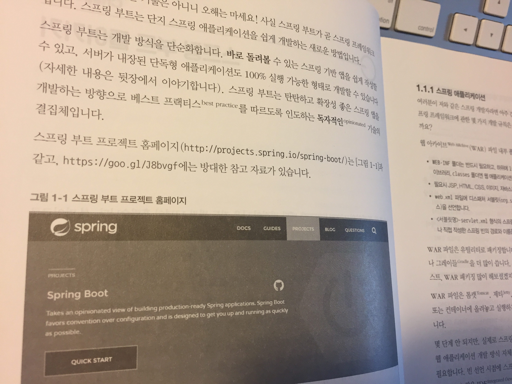
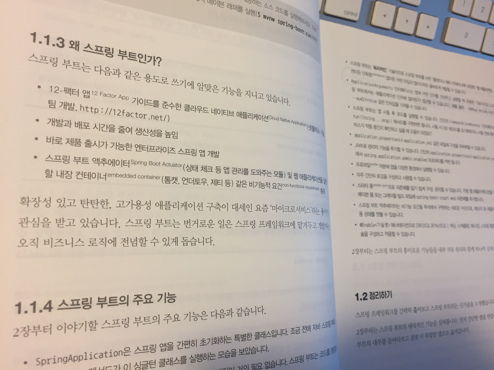
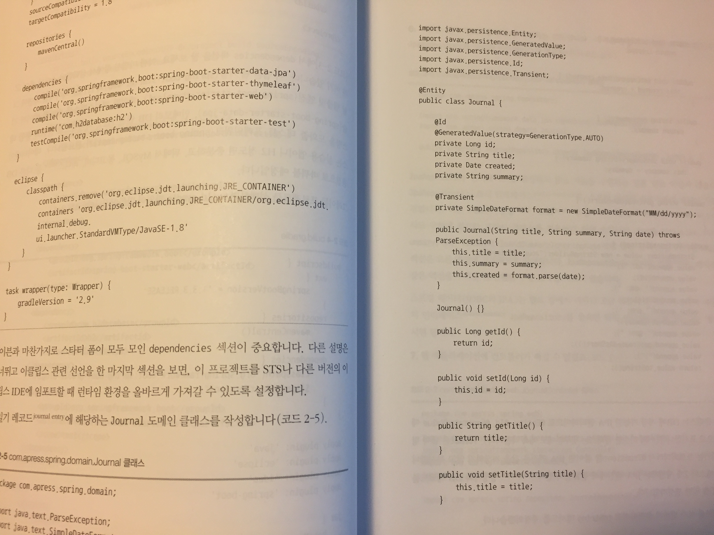

# [리뷰] 실전 스프링 부트 워크북

## 책을 펼치며

평소에 스프링에 대한 관심은 가지고 있었지만 사내에서는 서블릿 기반의 웹 서버를 사용하기 때문에 업무에서 사용할 기회가 없어서 깊이 있게 공부하지는 못하고 있었습니다. 또한 스프링을 장애 없이 현업에서 사용하기 위해서는 깊은 이해가 필요한데 팀원 모두가 공부하고 테스트해보고 적용하기까지는 많은 시간을 필요로 했습니다. 이러한 진입장벽 때문에 스프링은 거의 배제한 채로 비교적 Old한 방식의 서블릿 기반 웹서버를 계속해서 사용해오고 있었습니다.

그러던 중 커뮤니티에서 스프링 부트에 대한 세미나를 듣게 되었고, 급 관심이 생기게 되었습니다. 가장 매력적이었던 부분은 스프링에서 복잡했던 xml 파일 작성부분이 스프링 부트에서는 필요가 없다는 것이었습니다. 스프링 부트 웹 페이지에서 원하는 설정들을 체크박스 형태로 선택한 후에 Generate를 수행하면 기본 프로젝트 구성을 알아서 다 해줍니다. 그러므로 설정은 최소화하고 개발자는 개발에만 신경쓸 수 있게끔 해주고 있기 때문에 이 정도면 팀원들을 설득하고 짧은시간 내에 활용할 수 있을 것 같다는 생각이 들었습니다. 

이러한 생각을 가지고 설레는 마음으로 실전 스프링 부트 워크북이라는 책을 읽어보게 되었는데, 표지만 봐도 공부를 하고 싶어지는 욕구가 생겼습니다. 그만큼 최근에 나오는 개발 서적들의 표지나 내용물이 점점 더 깔끔하고 눈에 잘 들어오게 변화하고 있는 것 같습니다. 

## 책의 구성

대부분의 기술 서적들과 같이 시작은 스프링 부트가 무엇인지, 그리고 왜 스프링 부트를 사용해야 하는지에 대해 설명을 해주고 있습니다. 스프링과 스프링 부트의 차이가 무엇인지, 그리고 스프링 부트를 사용하면 무엇이 좋은지에 대해 궁금하신 독자들은 이부분에서 궁금증을 해소하실 수 있을 것입니다. 

책의 구성은 기본적으로 이론을 설명해주고, 이론을 활용한 코드를 생략 없이 모두 수록하고 있습니다. 그리고 이 코드에 대한 설명을 뒤에 덧붙이면서 독자의 이해를 도와줍니다. 실행에 필요한 전체 코드를 수록하고 있기 때문에 하나씩 따라 쳐 보면서 직접 어플리케이션을 구현해볼 수 있다는 것이 이 책의 장점이라고 생각합니다. 

아쉬웠던 점은 책의 대부분이 텍스트로만 이루어져 있었기 때문에 각 애너테이션 간의 관계나 클래스들 간의 관계 등 이론적인 설명들이 머릿속에 잘 그려지지 않았습니다. 그래서 같은 내용을 여러번 반복해서 읽고, 연습장에 클래스 다이어그램이나 그림을 그려가면서 읽어야 했습니다. 또한, 예제에서 사용되는 css와 js 파일이 이 예제의 프로젝트가 아닌 외부의 프로젝트에서 가져온 것이므로 해당 파일들을 직접 다운받아서 프로젝트에 첨부를 시켜주어야 하기 때문에 초반에 정상적으로 서버를 구동하는데 어려움을 겪었었습니다.(스프링 부트를 처음 사용해봐서 어떤 위치에 css와 js파일들을 위치시켜야 하는지 몰라서)

## 마치며

책에서 스프링 부트에 대한 깊은 내용은 다루고 있지 않지만 예제를 따라해보며 스프링 부트가 이런 것이다라는 것은 분명하게 느낄 수 있게 해준 책이었습니다. 데이터베이스를 사용하는 부분에 있어서도 현재 DBCP를 사용하는 것에 비해 굉장히 편리했고 매력적이었습니다. 데이터베이스나 네트워크, 보안 관련된 모듈들을 각각 신경써야 했던 기존과는 다르게 스프링 부트를 사용하면 일관된 방식으로 사용할 수 있다는 것 또한 큰 장점이라고 생각합니다. 다음 프로젝트에서는 스프링 부트를 사용하여 개발하는 것을 목표로 더 깊이 있게 살펴봐야겠습니다.