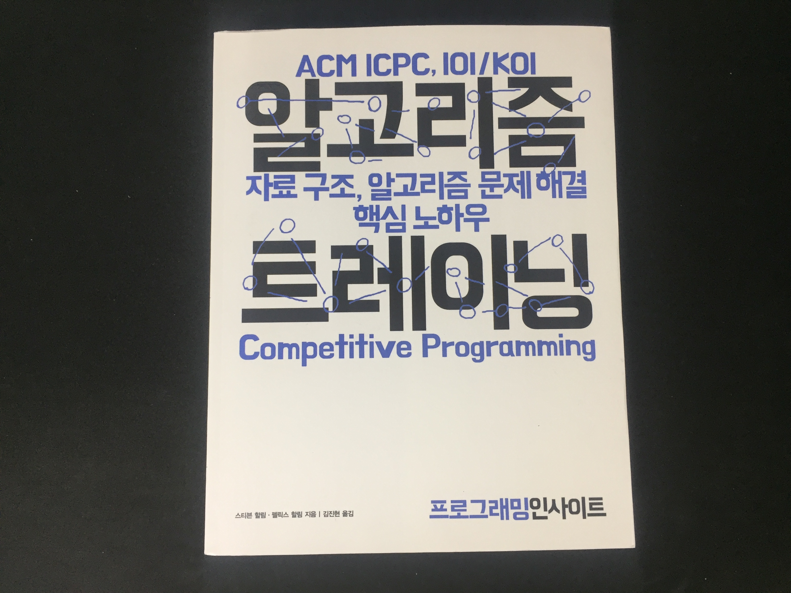
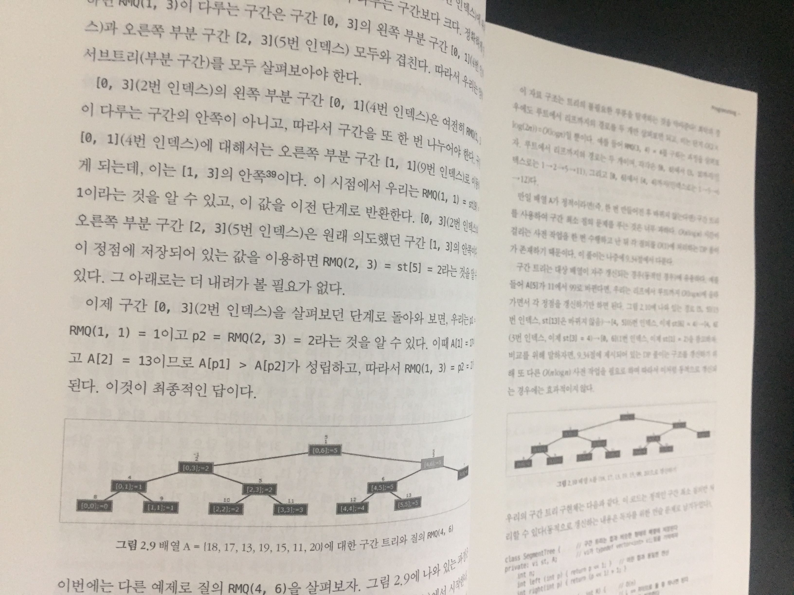
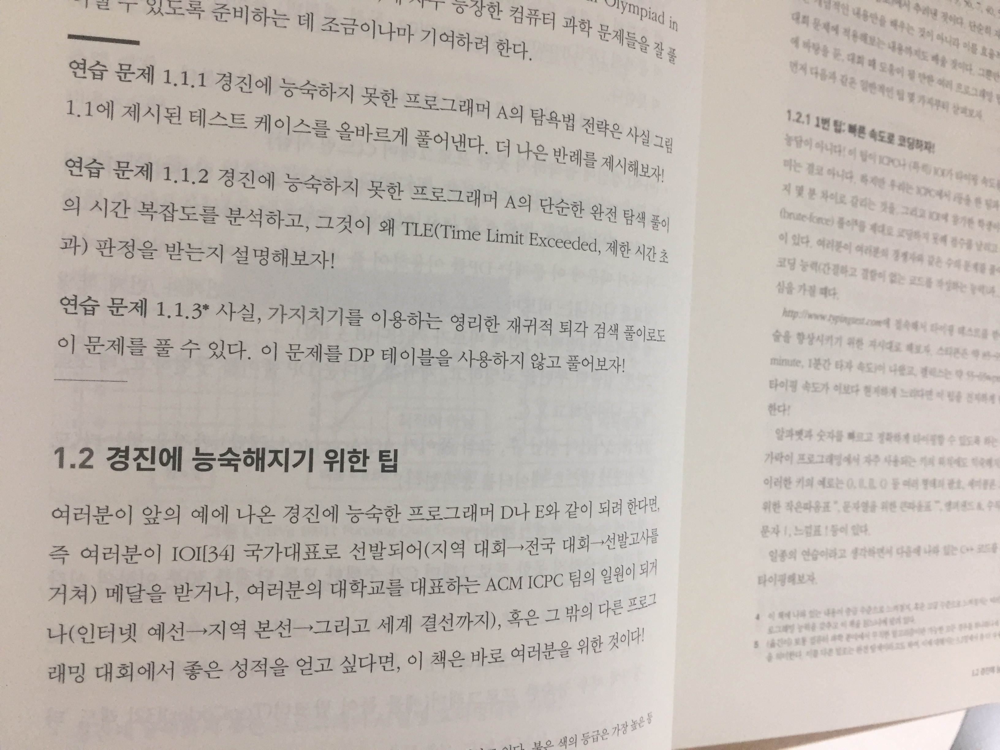
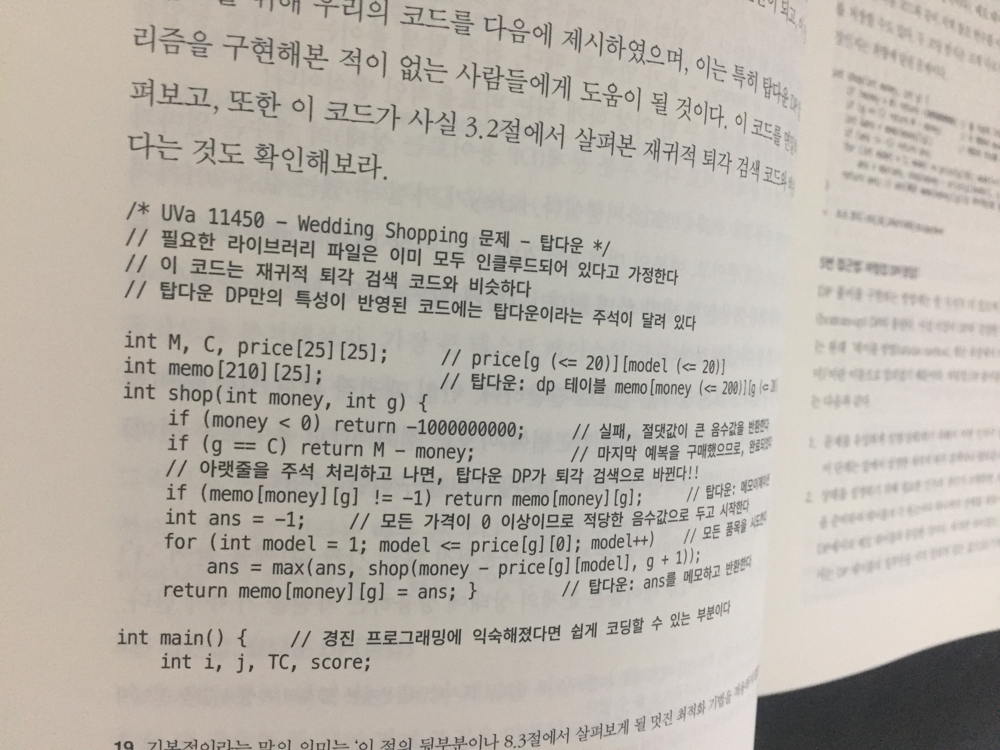
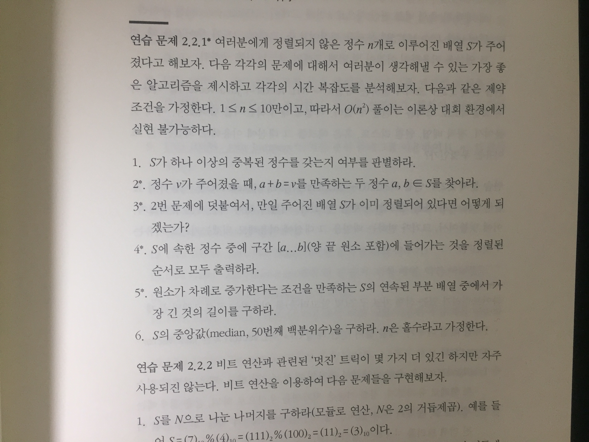

# 알고리즘 트레이닝

## 책을 펼치며

개발자로 일을 해오면서 회사에 취업을 하거나 이직을 하려 할 때 가장 걱정이 많이 되었던 부분이 알고리즘이었습니다. 큰 회사일 수록 알고리즘 풀이에 대한 난이도가 올라가고, 풀어야 할 문제들의 숫자도 점점 늘어났습니다. 알고리즘 문제를 과제로 해결해서 제출해야 될 때도 있고, 면접 보기 전에 실기 시험으로 풀이를 하기도 하고, 면접 중에 화이트보드에 그려가며 알고리즘을 풀어내야 할 때도 있었습니다. 개발자에게 필요한 기본 지식 같은 경우에는 책을 보고 공부를 하거나 겪었던 경험에 의해서 대답하기가 수월했던 반면 알고리즘은 항상 커다란 벽처럼 느껴졌었습니다. 마치 어렸을 때부터 영어공부를 해왔지만 아직도 영어 울렁증에서 벗어나지 못하는 것처럼 알고리즘 또한 내가 과연 극복해낼 수 있을까 싶은 부분이라고 생각해왔고 지금도 마찬가지 입니다. 

알고리즘 문제 풀이 능력을 향상 시키기 위해 스터디 그룹을 결성해서 같이 공부도 해보고, 개인적으로 책을 사서 공부를 해보기도 했지만 성과가 나타나기까지 너무 오랜 시간이 걸렸고 문제 하나를 풀어내도 다음 문제에서 막히다 보니 오래 지속하기가 힘들었었습니다. 그러다보니 결과적으로 알고리즘 공부는 항상 끝이 흐지부지되고 소홀해지는 것 같습니다.

이 책을 처음 받자마자 두께와 수록된 문제들에 살짝 압도당했었습니다. 이걸 과연 다 보고 문제들을 풀어낼 수 있을까? 내용 역시 만만치 않게 어려웠습니다. 솔직한 평가로 아직 제가 볼 레벨은 아니라는 생각이 들었습니다. 애초에 대상이 경시대회를 준비하는 사람들에게 맞춰져있었고, 책을 보기 위한 사전 지식 또한 필요합니다. 예를 들어, 책에서는 각 알고리즘에 대해 빅오표기법으로 비교를 하고 있는데, 빅오표기법을 모르는 상태에서 보면 해당 내용들을 온전하게 이해할 수가 없습니다. 그리고 자료구조에 대해서도 어느정도 기반 지식이 있어야 이해할 수 있는 부분들이 있습니다. 

## 책의 구성

먼저 첫 장을 살펴보면, 경시 대회에서 유용할만한 팁들을 알려주고 있습니다. 저의 경우에는 경시대회에 나갈 생각은 없지만 이 내용들이 면접을 볼 때 아주 유용할만한 팁들이라고 생각합니다. 어떠한 마음가짐으로 문제를 풀어나가야하는지, 그리고 어떠한 방식으로 접근을 해야하는지 등등 도움이 될만한 내용들을 담고 있었습니다. 

그 다음 장부터는 본격적으로 알고리즘에 대해 소개를 하고 있는데, 먼저 이론 설명부터 시작해서 이해하기 어려운 부분에 대해서는 그림으로 설명하기도 하고, 코드를 직접 첨부하여 설명을 해주기도 합니다. 거의 공백이 없이 빽빽하게 설명이 되어 있기 때문에 진도가 술술 나가지는 않았습니다. 문제들도 대부분 저에게는 어려운 수준이어서 저의 독서 성향 상 진도가 빠르게 나가지 않으면 도중에 다른 책으로 갈아타는 경우가 많아서 이론 위주로 책을 빠르게 한번 보고 문제 풀이는 나중에 하자는 전략으로 읽기 시작했습니다. 

## 마치며

사전 지식도 필요하고 결코 쉽지 않은 책임에도 불구하고 이 책이 매력적이었던 부분은 1600개 이상의 문제를 수록하고 있다는 것이었습니다. 너무 많은 문제들을 풀어야해서 시작하기도 전에 좌절해버릴 수도 있겠지만 이를 극복해낸다면 더 이상 알고리즘에 대한 걱정은 하지 않아도 될 것이라고 생각합니다. 아직 이 책을 반에 반도 흡수하지 못했다고 생각하지만 그 동안의 알고리즘 공부 경험 상 시작 당시의 의욕만큼 포기하는 속도가 빨랐던 것 같았기에 이번에는 급하게 생각하지 않고 조금씩 흡수해 볼 생각입니다.