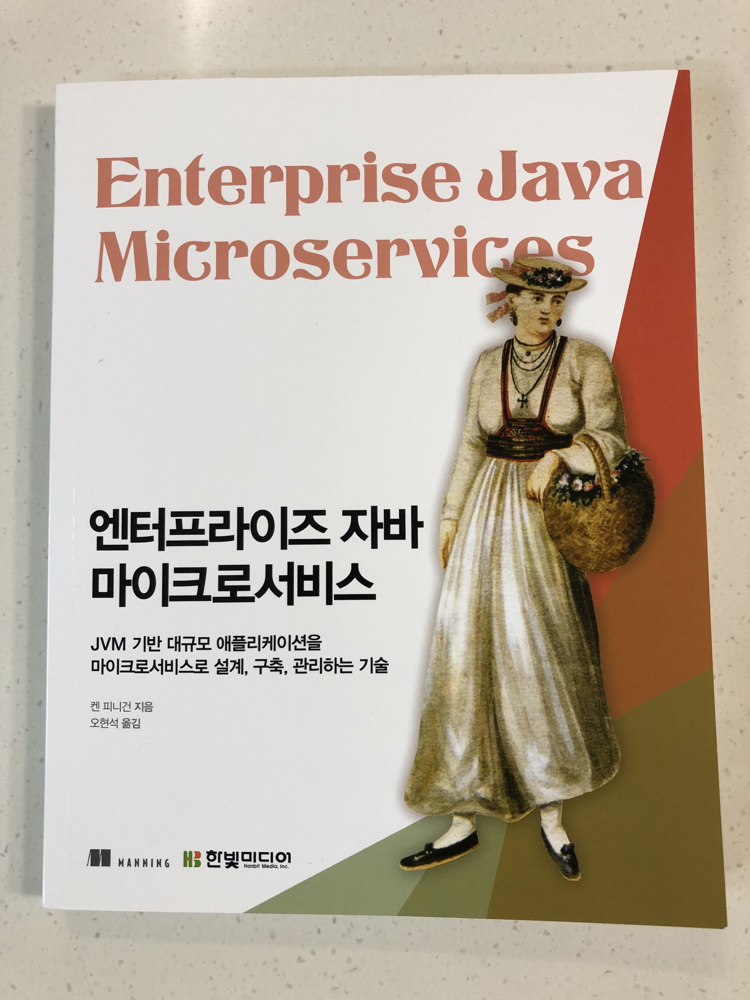
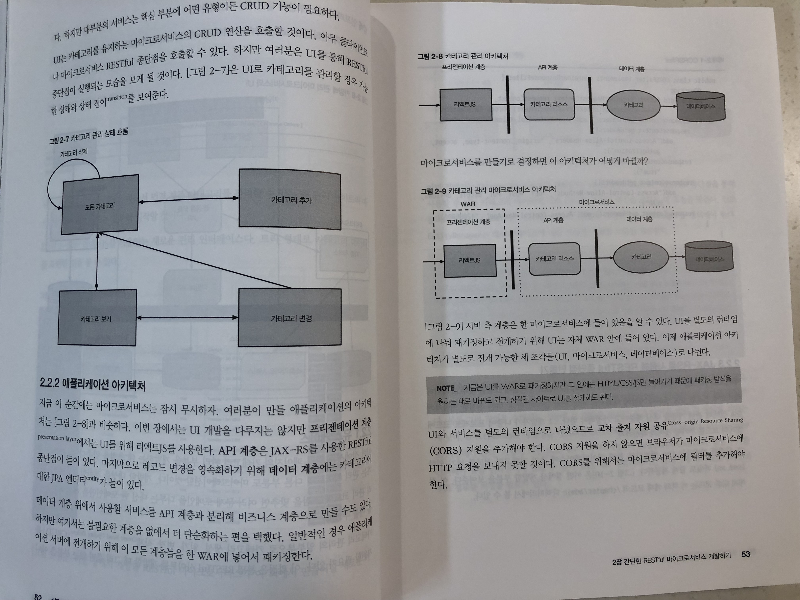

# 엔터프라이즈 자바 마이크로 서비스

## 들어가며

현재 나와 우리 팀은 프로젝트를 진행하며 필요에 따라 아키텍처를 개선해 나가는 중인데 서비스가 점점 커지면서 유지보수가 어려워지거나 여러 팀과 협업을 하다보니 자연스럽게 마이크로서비스 형태가 되어가고 있다. 서비스를 나누다 보니 외부 트래픽을 적절한 서비스로 분배해주기 위한 API Gateway가 필요하게 되고, 백엔드 서버들간 통신을 위한 내부 gateway나 큐와 같은 또다른 시스템들을 필요로 하게 되고, 아키텍처는 점점 복잡해졌다.

나중에 알고 보니 이런 복잡한 상황들을 위한 아키텍처가 마이크로서비스 아키텍처이고, 같은 고민을 이미 선배 개발자들이 해왔으며, 이미 이런 것들을 비교적 쉽게 할 수 있는 도구들이 많이 나와있는 상황이었다. 현재 진행 중인 프로젝트가 마이크로서비스를 지향하고 있지만 마이크로서비스에 이해도가 높진 않다고 생각하기 때문에 이러한 도구들을 적극 활용하는 것이 좋다고 본다.

더군다나 자바 기반의 서비스라면 잘 만들어져있는 프레임워크 위에 마이크로서비스를 더 쉽게 구현할 수 있다. **엔터프라이즈 자바 마이크로 서비스**라는 이 책에서 이러한 내용들을 잘 설명하고 있다.

## 책을 읽으며

이 책은 번역서임에도 불구하고 저자를 보지 않았다면 한국사람이 썼다고 생각할 정도로 번역 품질이 좋다. 어색한 문장을 거의 찾아보기 힘들고, 어려운 내용을 이해하기 쉽게 쓰여졌다. 

게다가 아래와 같이 설명글도 잘 작성되어 있고,

또 아래와 같이 그림도 많이 포함되어 독자들의 이해를 돕는다.

사실 나는 자바 언어로 개발은 하고 있지 않기 때문에 자바 관련 내용은 크게 도움되진 않았지만 마이크로서비스를 구현하기 위한 방법과 이론은 동일하기 때문에 언어와 무관하게 개념 이해에는 큰 도움이 되었다. 

조금 우려가 되는 부분은 나의 경우 업무 특성상 연관된 부분이 많아서 이해하는데 어렵진 않았지만 익숙치 않은 독자들이라면 처음 들어보는 도구들로 인해 혼란스러울 것 같기도 하다는 생각이 들었다. 하지만 이 또한 극복한다면 엄청난 도움이 될 것이라 생각한다.

## 마무리하며

이번에 읽을 때는 코드 부분은 스킵하고, 훑어내려가며 읽었는데 내용이 너무 좋아 다시 한번 찬찬히 읽어 봐야겠다. 잘 알려진 마이크로서비스 아키텍처 관련 책(?) 이후로 꼭 봐야할 필독서라고 생각한다.