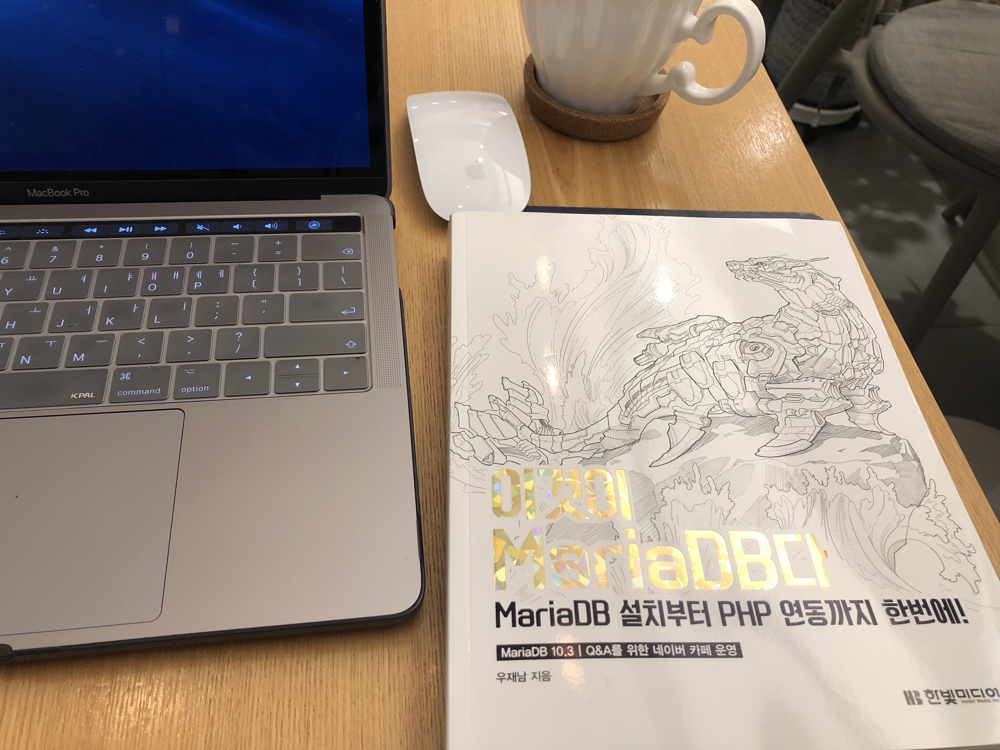
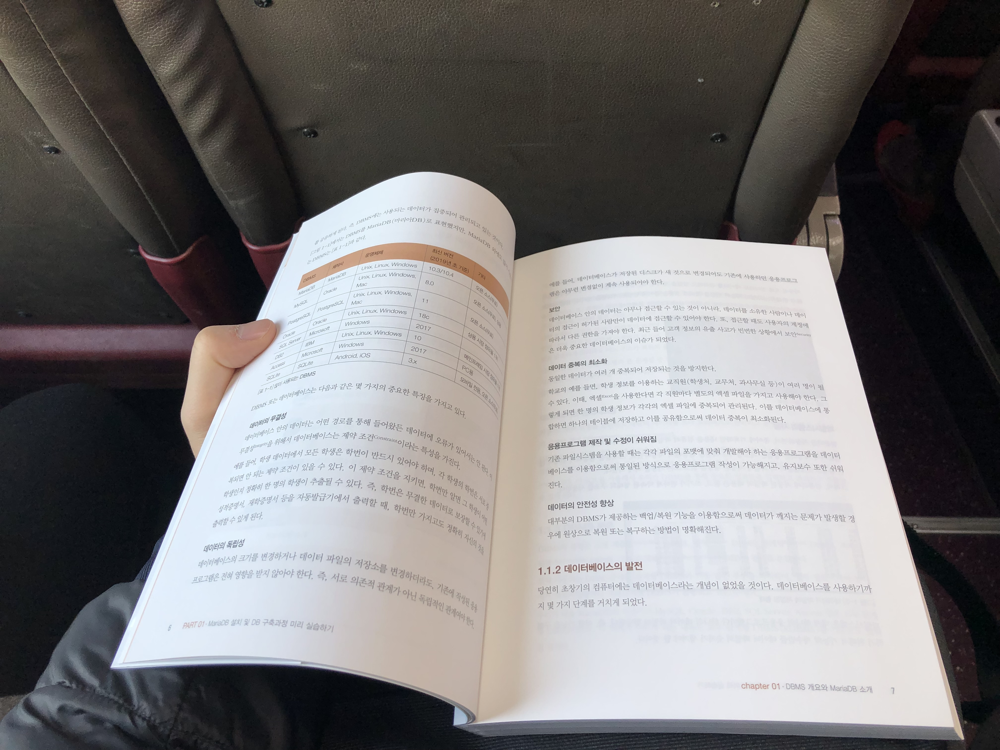

# [리뷰] 이것이 MariaDB다

## 들어가며

백엔드 개발을 하다보면 데이터베이스는 뗄래야 뗄 수 없는 관계이고 데이터베이스의 중요성에 대해서는 누구나 다 알고 있는데도 생각해보면 깊이 있게 공부해 본 적이 없는 것 같다. 내부 원리를 이해하기 보다는 검색 조건에 해당하는 필드들에 인덱스를 걸어서 성능 향상이 있는지 체크 해보는 것이 고작이었었다. 아마도 개발이 주 업무이다보니 데이터베이스 보다는 개발 쪽에 치우치치 않았나 생각된다. 제대로 알지 못하고 데이터베이스를 설계하고, 복잡한 쿼리를 프로시저에 작성하면서 실제 운영에 들어갔을 때 엄청나게 고생을 했던 기억도 있다. 

처음 접해봤던 PostgreSQL부터 MS-SQL, MySQL, MariaDB 등 다양한 데이터베이스를 사용하여 개발을 해왔는데 대부분의 쿼리가 비슷하다보니 각각의 엔진에 대해 크게 생각하지 않고 개발을 진행해왔었다. 책에서도 나와있 듯이 각각의 데이터베이스들은 특징이 있고, 같은 쿼리라도 전혀 다르게 동작하는 부분들이 존재한다. 그렇기 때문에 실제 프로덕션 레벨에서 관리를 수월하게 하려면 이러한 특징들에 대해 잘 알고 있어야 한다. 

## 책을 읽으며

Oracle이나 MS-SQL의 경우에는 비용이 굉장히 비싸기 때문에 내가 거쳤던 회사들 중 큰 회사에서는 사용하는 경우가 있었지만 스타트업에서는 대부분 MariaDB를 사용했다. 그리고 주변에 얘기 듣기로도 MariaDB를 굉장히 많이 사용하고 있는 것으로 알고 있다. 그만큼 MariaDB에 대해 잘 알고 있다면 경쟁력을 가질 수 있을 것이라고 생각한다. 그 기반을 다지기 위해 "이것이 MariaDB다" 라는 책이 적합하다고 생각한다. MariaDB에 대한 책이 시중에 그리 많지 않다는 것도 한 몫하는 것 같다. 

곧바로 쿼리에 대한 설명에 들어가지 않고 실무에서 프로젝트를 진행하는 단계를 설명하고, 데이터 모델링의 필요성과 모델링 하는 방법에 대해 설명이 선행되는 것을 보고 책의 구성이 참 잘 되어 있다고 느꼈다. 책의 저자분께서 데이터베이스 관련 책 집필도 많이 하시고 경험이 많으셔서 그런지 책을 읽어나가며 평소 궁금했던 부분들이 하나씩 풀리는 것을 느낄 수 있었다.

SQL 고급과 MariaDB 고급 장을 읽을 때는 내가 정말 많은 기능들을 모르고 썼구나를 느낄 수 있었는데, 알아두면 유용한 기능들이 많이 포함되어 있어서 실제 필요할 때 써먹어보려고 키워드들을 정리하기도 했다. 인덱스에 대한 개념도 매번 공부할 때마다 새로웠는데 어려운 개념을 이해하기 쉽게 잘 풀어서 작성되어 있어서 잊을 때마다 한번씩 꺼내보면 좋을 것 같다.

## 정리하며

사실 책만 봐서는 데이터베이스를 자유자재로 다루기는 어렵고, 실제 운영을 해보며 다양한 경험을 통해 많은 노하우를 쌓아야 한다고 생각한다. 여러가지 상황에 대응 할 수 있으려면 데이터베이스에 대한 기반지식이 있어야 하고 그 기반지식을 쌓기 위해 "이것이 MariaDB다"로 시작하는 것이 좋은 방법 중 하나라고 생각한다.