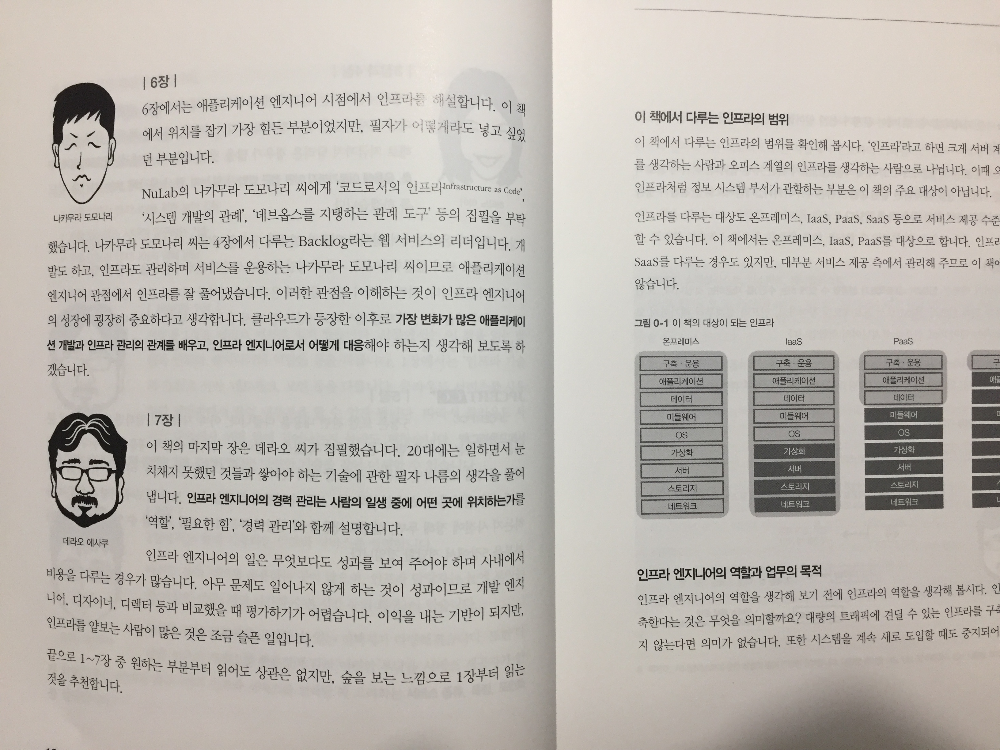
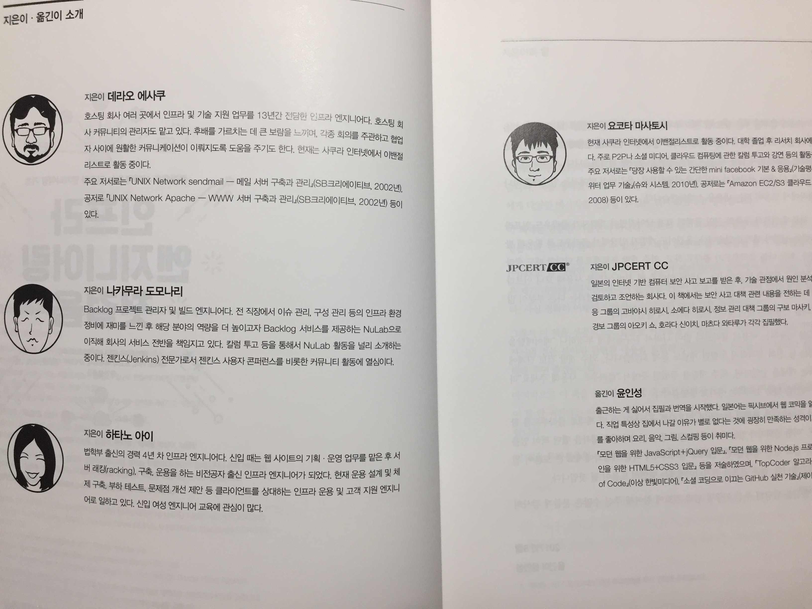

# 책을 펼치며

현재 개발 중인 프로젝트를 진행하면서 다양한 것들을 경험해보게 되었는데, 그 중 하나가 클라우드였습니다. 개인적으로 연습삼아 조금 사용해본 것에 더해서 실제 프로덕트를 서비스 하기 위해서 더 깊이 있게 공부하고 테스트해보게 되었습니다. 클라우드를 제공하는 업체별로 다양한 서비스들을 제공하고 있었는데, Google Cloud Platform의 앱엔진이라던가 AWS의 Elastic Beanstalk와 같은 PaaS 서비스를 이용하면 서버 관리에 대해 크게 신경쓰지 않아도 서비스를 하는데 무리가 없겠다는 생각이 들었었습니다. 그래서 이러한 클라우드에 대한 지식을 가진 클라이언트 프로그래머만 있으면 프로젝트를 진행하는데 별 문제가 없겠다는 생각과 함께 현재 저의 직업인 서버 개발자의 미래가 불투명해지는거 아닌가 하는 걱정이 들기 시작했었습니다. 

이번에 경험을 더 해보고 나니 클라우드의 서비스를 단순히 이용만 하는 것을 그렇게 어렵지 않았지만, 수많은 서비스들 중 어떠한 서비스가 우리 프로젝트에 잘 맞는지, 그리고 어떠한 정책에 의해서 서버를 스케일 인/아웃 하고, 아키텍처를 설계할 것인지에 대해 해결책을 제시하는 것은 그리 쉽지 않은 일이었습니다. 아무리 서버 관리를 클라우드 업체에서 해준다고 하더라도, 장애나 보안, 트래픽에 대한 대응을 위해서는 서버 관리나 인프라 관리에 대한 깊은 지식이 필요하다는 것을 깨달았습니다. 

**인프라 엔지니어링 첫걸음**이라는 책은 인프라에 대한 기반 지식을 쌓기에 좋은 책이라고 생각합니다. 인프라에 대해 잘 모르는 사람에게 기초 지식을 알려주고, 클라우드에 대한 경험이 적은 사람에게 조심해야 될 사항들과 서비스를 이용하기에 앞서서 생각해봐야 할 것들에 대해 경험에서 우러나오는 조언들이 많이 담겨져 있습니다. 

# 책의 구성

이 책은 **처음부터 순서대로 봐야 더 효과가 좋은 책**이라고 생각합니다. 먼저 인프라에 대해 이해할 수 있도록 기반 지식을 습득할 수 있는 **1장은 네트워크에 대한 기초**라고 생각하시면 될 것 같습니다. 많이 들어보았던 OSI 7계층에 대한 내용이 담겨져 있으므로 뒤에 이어질 내용들을 확실하게 이해하기 위해서는 꼭 선생되어야 한다고 생각합니다. 

**2장에서는 클라우드에 대한 기초 지식**을 담고 있는데 첫 부분에 수록된 인프라를 제공하는 기존의 서비스에서 현재에 이르기까지의 변천과정에 대해서는 몰라도 되는 내용이라고 생각은 하지만 알아두면 현재의 시스템이 왜 이렇게 되었는가를 이해하는데 도움이 될 것이라고 생각합니다. 특히 IaaS, PaaS, SaaS는 클라우드를 다루는 내용에서 자주 등장하는 개념이므로 꼭 이해를 하고 가는 것이 좋습니다. 그 외에도 클라우드에 대한 기초 지식들이 많이 담겨져 있으므로 정독하고 나면 도움이 많이 될 것이라 생각합니다.

**3장은 본격적으로 클라우드를 활용하기 위해 도움이 될만한 내용**들을 담고 있는데 개인적으로 가장 도움이 많이 되었었습니다. 앞서 언급했던 것과 같이 현재 진행 중인 서비스의 런칭을 앞두고 고민 중이었던 부분들에 대해 경험에서 우러나는 조언들이 많이 담겨져 있었기 때문입니다.  이 장을 읽고나니 너무 안일하게 서비스를 준비하고 있었다는 생각이 들었고, 이 책에서 알려주는 꿀팁들을 잘 활용해서 재정비를 할 수 있었습니다.

**4장에서는 장애 대응에 대한 내용**이 담겨져있는데, 개발 측면에서의 장애대응 뿐만 아니라 사람과 사람간의 관계에 대해서도 조언을 해주고 있었습니다. 이 책을 읽다보면 기술적인 책에 더해서 마치 경험 많은 회사 선배가 조언을 해주고 있다는 느낌이 들었습니다. 아직은 런칭까지의 시간이 있다보니 장애 대응에 대해서는 크게 신경쓰고 있지 않았는데 이 책에 나와있는 고려사항들을 잘 기록해두고 하나씩 체크를 해보면 큰 도움이 될 것 같습니다.

**5장은 보안에 관련된 내용**이었는데, 깊이 있는 내용은 아니지만 클라우드 서비스를 이용하는 독자들에게는 충분한 보안 지식이라고 생각을 합니다. 그래서 여기에 언급되는 내용들을 잘 숙지해두었다가 필요한 부분에 있어서는 다른 책이나 검색을 통해서 깊이 있는 지식을 습득한다면 클라우드에 있어서의 보안은 왠만큼은 다 해결될 것 같다는 생각이 들었습니다.

뒤에 이어지는 내용들은 데브옵스에 대한 것과 인프라 엔지니어들이 앞으로 나아가야할 방향에 대해 조언을 해주고 있으므로, 실무적인 내용은 1~5장까지라 생각합니다. 이 내용들만 잘 습득해도 클라우드 환경에서 개발을 하는데 충분히 도움이 되겠지만, 더 나은 엔지니어가 되기 위해서 6~7장의 내용도 찬찬히 읽어보시면 좋을 것 같습니다.

# 아쉬운 점

이 책에 대해 아쉬웠던 점은 크게 없었습니다. 첫걸음이라는 타이틀과 같이 그리 두껍지 않은 것도 좋았고, 내용 또한 쉽게 술술 읽히는 책이었습니다. 다만 2장의 내용이 같은 내용을 반복한다는 느낌이 들었지만 크게 거부감이 들지는 않았습니다. 만약 사내에 **신입 개발자가 들어온다면 필독하라고 권해줄만한 책**이라고 생각합니다. 

# 마치며

이 책은 여러명의 저자가 작성한 책이었는데, 첫 부분에 각 저자들의 캐릭터가 소개되어서 각 장을 작성한 저자의 이미지가 떠올라서 더 집중이 잘 되었던 것 같습니다. 별 것 아닌것 같은 컨셉인데 다른 책들과 차별되어서 신선하게 다가왔습니다. 그래서 책을 읽는 내내 선배한테 조언 듣는 기분으로 읽어나갈 수 있었습니다. 

그리고 나름 클라우드 서비스 아키텍쳐를 설계 해보면서 고민을 많이 했다고 생각했었는데, 책을 읽다보니 간과한 부분들이 많이 있었습니다. 사내에 조언을 해줄 선배가 없는 현재로써 큰 도움이 되었던 책이었습니다. 현 프로젝트 뿐만 아니라 앞으로의 프로젝트에서도 항상 더 나은 서비스를 위해 더 많이 고민을 해봐야겠습니다.