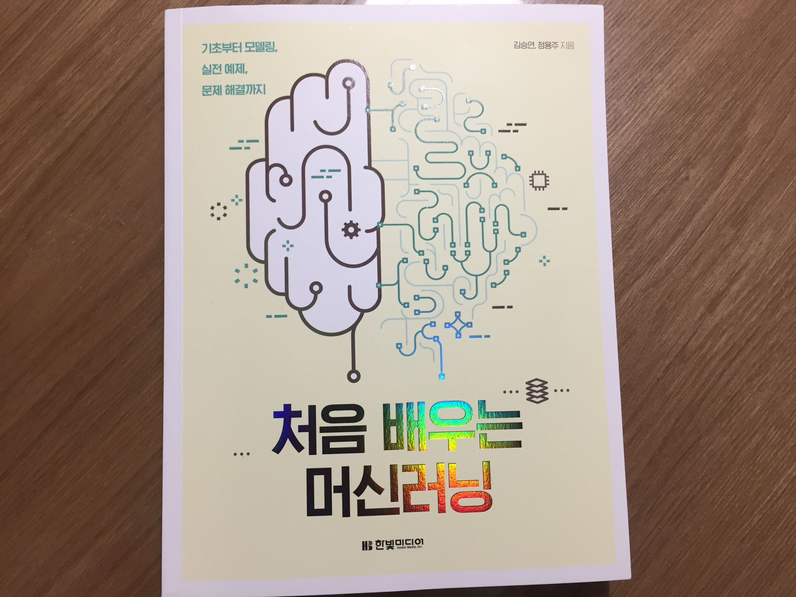
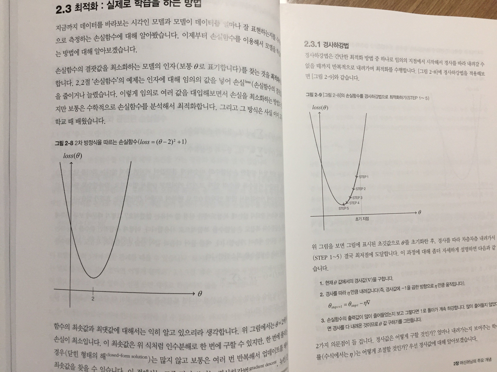
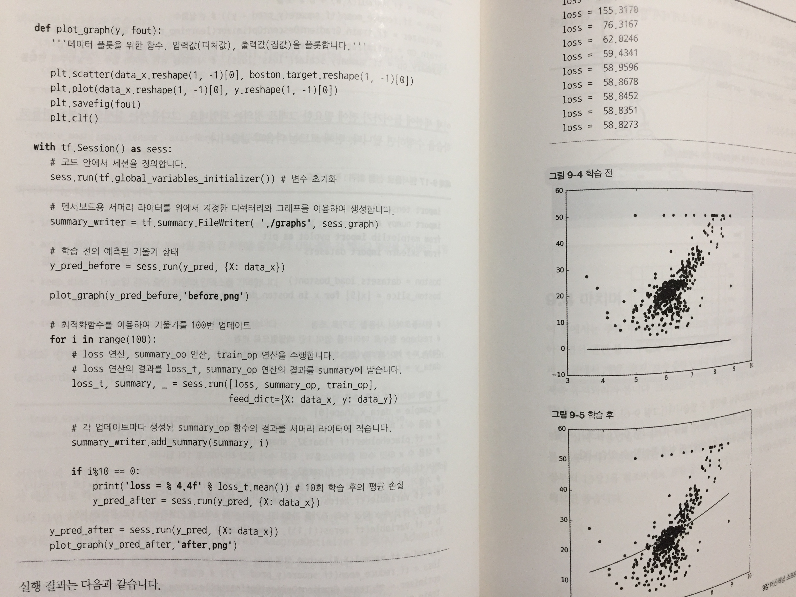
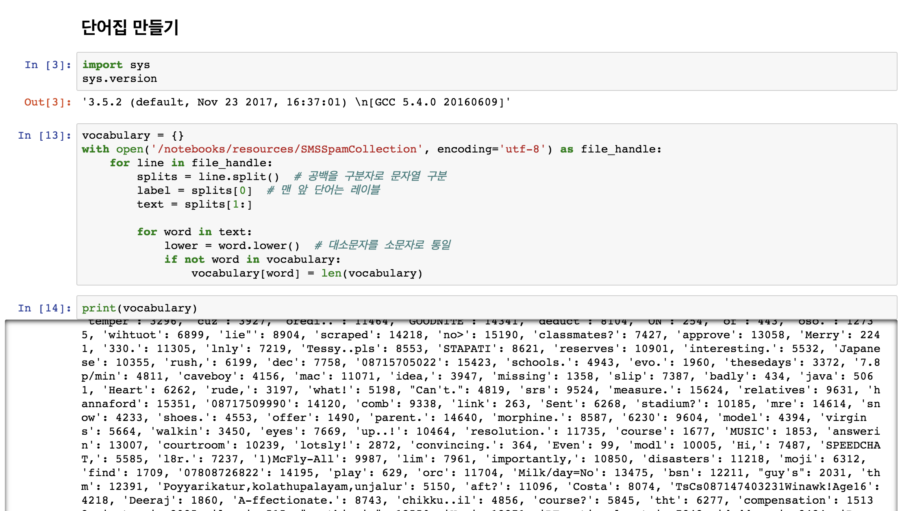

# [리뷰] 처음 배우는 머신러닝

## 책을 읽게 된 이유

얼마전까지만해도 머신러닝이라는 것은 저와는 완전히 동떨어진 기술이고, 관심은 가지만 알필요는 없을 것 같다는 생각을 가지고 있었습니다. 왜냐하면 머신러닝을 설명하는 글들을 보면 항상 복잡한 수학 공식이 적혀 있었고, 이 공식들을 사용해서 컴퓨터를 학습시켜 미래를 예측한다는 내용이었기 때문에 너무 어려워보이고 범접할 수 없는 느낌이 들었기 때문입니다. 하지만 불과 1,2년 사이에 먼 이야기 같았던 머신러닝이 점점 생활 속으로 들어오고 익숙한 단어가 되고, 주 마다 찾아가는 서점에서도 머신러닝, 딥러닝에 대한 책들이 점점 많아지는 것을 느꼈습니다. 그만큼 많은 사람들이 관심을 가지고 이에 대한 공부를 하고 있고, 제 주변에서도 관심을 가지고 살펴보는 사람들이 늘어가고 있었습니다.

최근에 회사에서 진행한 프로젝트와 주말마다 진행하는 스터디를 통해 데이터를 다루는 일이 많아지면서 이제는 머신러닝에 대해 한번 공부해보고 적용할 수 있었으면 좋겠다는 생각을 가지게 되었습니다. 그러면서 처음 머신러닝에 대한 개념을 잡기 위해 한빛미디어에서 출간한 처음 배우는 머신러닝이라는 책을 읽게 되었습니다. 처음 배우는 이라는 타이틀이 붙은 만큼 쉽게 쓰여져 있을 것이라 기대하고 읽기 시작하였습니다. 

## 이 책을 읽으려면

이 책은 머신러닝을 처음 배우는 프로그래머나, 머신러닝 전공 희망자, 데이터 과학자를 대상으로 하기 때문에 입문자를 위한 책이기는 하지만 어느정도 프로그래밍에 대한 기초지식은 있어야 한다고 생각합니다. 실전 예제에 들어가기 전까지 이론적인 부분들은 프로그래밍 지식이 없이도 읽을 수 있지만 후반부에 실제로 실습을 하는 부분에서는 파이썬을 사용하여 코딩을 하고, 파이썬 문법에 대한 언급은 없으므로, 기본적인 지식이 있어야 따라해보며 이해해 나갈 수 있을 것입니다.

## 내가 책을 읽었던 방법

입문자용 책이었기 때문에 머신러닝의 개념들에 대한 설명이 깊이 있게 들어가지는 않고 추상적인 설명이 주를 이루고 있습니다. 아마도 깊게 들어가면 수학공식이 복잡하게 나올 것이기 때문에 저와 같은 입문자들에게는 적절한 난이도라고 생각합니다. 하지만 쉽게 쓰여진 이 개념들도 종류가 너무 많다보니 머릿속에 정리가 잘 되지는 않았습니다. 수학 공식이 등장하는 부분은 대부분 이런게 있구나 하고 넘어갔고, 개념적인 설명이 있는 부분은 정독을 하며 최대한 이해해보려고 노력하며 읽어내려갔습니다. 하지만 이 또한 두세번정도 읽어도 이해가 안되면 그냥 넘어갔습니다. 머신러닝은 여러번의 시행착오를 거쳐가며 개선해나가는 과정을 통해 익숙해지고 이해가 되기 때문에 너무 이론적인 부분에서 막혀 있을 필요는 없을 것 같다는 생각이었습니다. 수학 공식 또한 이 공식이 어떠한 곳에 사용되고 왜 사용해야하는지 정도만 이해하면 어차피 검증된 라이브러리들이 잘 구현되어 있기 때문에 적절한 곳에 가져다 쓰면 된다고 생각하여 그정도 까지만 이해하고 넘어갔습니다. 

## 책을 읽으며 좋았던 점

9장까지 이론적인 내용들을 읽고나면 이제 실제로 코딩을 해볼 수 있는 실전 예제들이 등장합니다. 저는 이론적인 부분은 난해하고 조금 지겨움을 느꼈었는데 실전 예제를 직접 따라해보고 실제 결과를 눈으로 확인하니 큰 재미를 느꼈습니다. 그리고 이전에 이해가 잘 안되던 부분도 어느정도 이해가 되면서 실제 업무에 적용할 수 있을만한 요소들에 대한 인사이트를 얻을 수 있었습니다. 저는 이 과정에서 재미와 경험, 인사이트를 얻을 수 있었기 때문에 이론적인 부분을 스킵하더라도 실전 예제는 꼭 직접 해보실 것을 추천합니다. 조금씩 다른 유형의 실전 예제들이 4가지나 수록이 되어 있기 때문에 전부 다 따라해본다면 이 책에서 설명하고 있는 이론적인 부분들 또한 함께 이해가 될 것이라 생각됩니다. 

## 마무리

이 책을 읽고나서 머신러닝이라는 다가가기 힘들었던 기술에 대해 어느정도 감을 잡고, 예제를 따라해보며 더 해보고 싶어지는 재미와 나도 머신러닝을 해볼 수 있겠다는 자신감을 가질 수 있게 되어 만족스러웠습니다. 이 책의 추상적인 이론에서 조금 더 자세히 들여다 보고 싶은 분들은 유투브에서 [김성훈님의 모두를 위한 딥러닝 강좌](https://www.youtube.com/playlist?list=PLlMkM4tgfjnLSOjrEJN31gZATbcj_MpUm)를 보실 것을 추천드립니다.