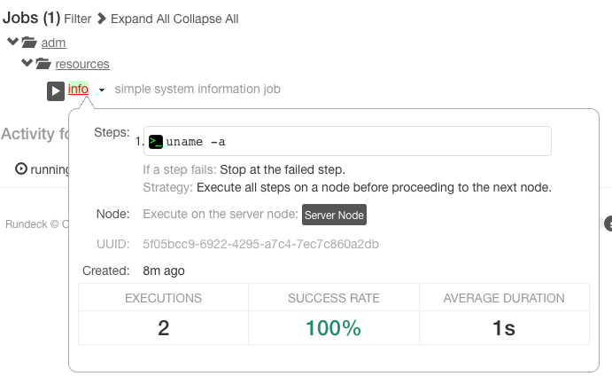

# 잡 (Jobs)

## Job을 사용하는 이유

* 반복적으로 실행되는 명령
* 그룹 내 다른 사용자가 동일한 기능을 필요로 하는 경우 재사용
* 자주 사용되는 작업의 경우에는 캡슐화되어서 다른 부분에서도 재사용

## 개요

* Job은 반복되거나 자주 실행되는 일련의 작업 절차를 재사용할 수 있도록 한다.
* Job에 엑세스하기 위한 읽기, 쓰기, 실행, 삭제 권한은 액세스 제어 정책에 의해 관리된다.
* Job이 실행 중인 경우 진행 상황 모니터링이 가능하다.
  * Job 목록
  * 개별 실행 단계에 대한 결과 확인
  * Job 실행 중단
* Job 실행에 대해 노드 정보, 각 단계별 성공 여부 및 지속 기간 등에 대한 정보가 저장된다.
* Job 실행 결과를 다운로드 하거나 외부 저장소로 전달, 메일 등으로 알림을 보낼 수 있다.

## Job 그룹

* Job은 지속적으로 추가 되어 점점 많아 질 것이기 때문에 그룹으로 구성하는 것이 유용하다.
* 그룹은 논리적인 Job의 집합이며 하나의 Job 그룹은 다른 Job 그룹 내에 존재할 수 있다.

## Job UUID

* Job이 생성될 때 고유한 식별자(UUID)가 할당된다.
* 지원 되는 형식에 한해서 UUID를 직접 할당 할 수도 있다.

## Job 실행

* 기본적으로 단일 실행으로 실행
  * 한번에 하나의 Job만 실행
  * Job 간의 의존성이 있는 경우 유용
* job간의 의존성이 없는 경우는 다중 실행이 유용할 수 있다.
  * Multiple Excutions 옵션을 Yes로 지정하여 다중 실행으로 변경 가능
* Timeout 시간 설정 가능
* Job이 실패하는 경우 재시도 횟수와 재시도 간격 지정 가능
* Job이 발생시키는 로그의 크기가 너무 커질 것을 대비하여 로그 출력에 대한 제한 지정 가능
  * 총 로그 라인의 최대 수
  * 로그 파일의 최대 크기
  * 노드별 로그 라인의 최대 수
* 로그 크기 제한에 걸릴 경우 Job을 중단시키거나 로그 출력만 중단 시킬 수 있다.
* 예약을 걸어서 주기적으로 Job이 실행되도록 할 수 있다.
  * Unix crontab 형식으로 정의
* Job을 실행하는 전략(Strategy)을 지정할 수 있다.
  * Node First : 노드 기반으로 잡을 실행하여 하나의 노드에서 명령이 다 끝난 후에 다음 노드에 명령 실행
  * Parallel : 지정된 스레드 수에 따라 병렬적으로 명령 실행
  * Sequential : 단계별로 각 노드에서 순차적으로 실행. (1 단계를 모든 노드가 실행하고 나면 2 단계를 실행)

## 알림 및 히스토리

* Job의 시작, 완료, 성공, 실패에 대한 알림을 받을 수 있다.
  * 이메일
  * Webhook
    * Webhook을 통해 slack이나 기타 어플과 연동 가능
  * HipChat
  * 그 외 알림 플러그인을 사용하여 Jira, PageDuty 등 다른 서비스와 연동 가능
* Job 실행 내역에 대한 History 확인 가능
* Job 정의에 대한 불러오기/내보내기 기능 지원

## 옵션

* 하나 이상의 옵션을 정의할 수 있고, 사용자에게 입력을 요구하도록 구성될 수 있다.
  * 사용자 입력을 매개변수로 스크립트를 실행할 수 있다.
* 옵션에 스크립트 작성 가능
* 옵션에 URL을 사용하여 외부 소스를 실행하도록 구성할 수 있고, 이를 통해 다른 도구와 통합 가능
* job에 대한 명세에 XML, YAML 사용 가능
  * job yaml : http://rundeck.org/docs/man5/job-yaml.html