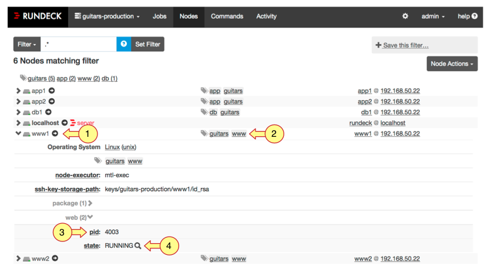
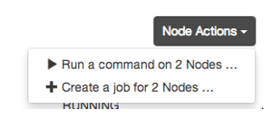

# 노드 (Nodes)

* 네트워크로 엑세스 할 물리 호스트 또는 가상 인스턴스
* 노드 분류에 태그 사용
  * 태그를 통해 필터 기능 지원


## 속성 네임스페이스 (Attribute Namespace)

* 노드에는 많은 특성들이 존재할 수 있는데 이를 네임스페이스를 사용하여 명명 규칙을 사용할 수 있다.

  ```
  {namespace}:{name} = {value}
  ```

* resources.xml 파일에서는 아래와 같이 지정한다.

  ```
  <attribute name="{namespace}:{name}" value="{value}"/>
  ```

* 네임스페이스 지정된 속성은 UI에서 자동으로 그룹화된다.

  * 예를들어 web:pid=4872, web:state=RUNNING으로 지정한 경우 아래와 같이 그룹화

    

* 네임스페이스 설정에 따라 필터링하고 필터를 저장하여 재사용할 수 있다.


## 노드 필터



1. 노드 목록에서 노드를 하나 선택하면 해당 노드에 대한 정보가 하위에 표시된다.
2. 노드 페이지의 상단에 필터 바에서 태그를 지정해서 필터링할 수 있다.
3. `web:pid: .*` 과 같이 web이라는 네임스페이스 내에 pid 어트리뷰트를 가진 모든 노드를 필터링할 수 있다.
4. `web:state: RUNNING` 과 같이 web이라는 네임스페이스 내에 state 어트리뷰트의 값이 RUNNING인 노드들을 필터링할 수 있다.


## Node 동작



* 필터 결과 지정된 노드들에 일괄적으로 명령을 실행 할 수 있다.
  * 명령은 Job 또는 command로 실행
* ACL에 의해 권한이 부여된 사용자에 한해서 명령을 수행할 수 있다.


