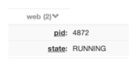

# 노드 (Nodes)

* 네트워크로 엑세스 할 물리 호스트 또는 가상 인스턴스
* 노드 분류에 태그 사용
  * 태그를 통해 필터 기능 지원


## 속성 네임스페이스 (Attribute Namespace)

* 노드에는 많은 특성들이 존재할 수 있는데 이를 네임스페이스를 사용하여 명명 규칙을 사용할 수 있다.

  ```
  {namespace}:{name} = {value}
  ```

* 위와 같이 지정된 속성은 UI에서 자동으로 그룹화된다.

  * 예를들어 web:pid=4872, web:state=RUNNING으로 지정한 경우 아래와 같이 그룹화

    

* 네임스페이스 설정에 따라 필터링하고 필터를 저장하요 재사용할 수 있다.


## Node 동작

* 필터 결과 지정된 노드들에 일괄적으로 명령을 실행 할 수 있다.
  * 명령은 Job을 기반으로 실행
* ACL에 의해 권한이 부여된 사용자에 한해서 명령을 수행할 수 있다.


