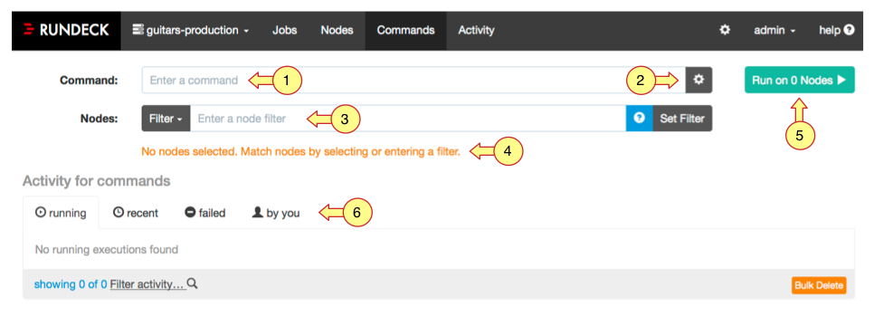
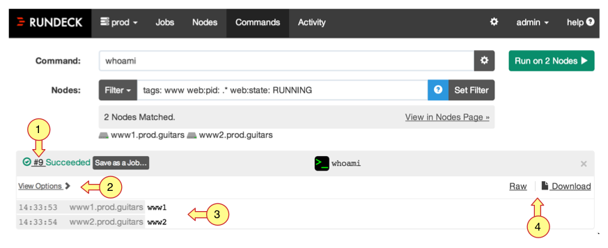
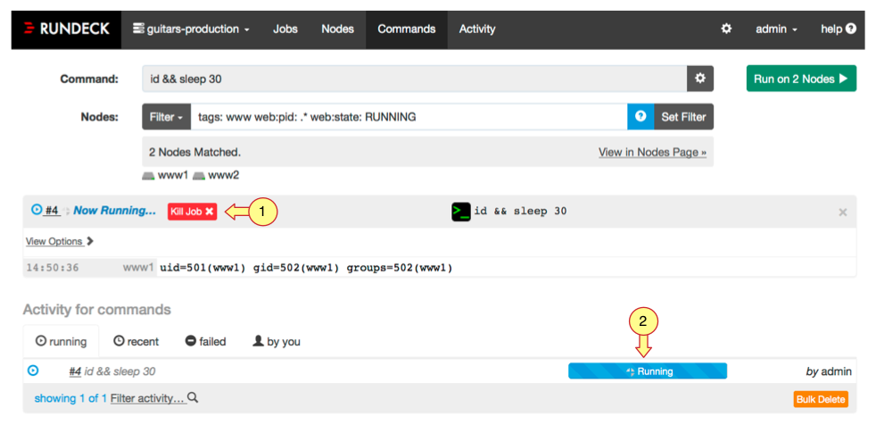
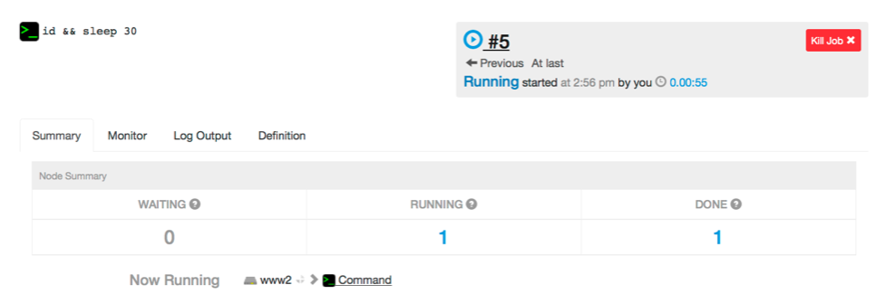

# 명령 (Commands)

* 노드에서 실행되는 단일 명령 문자열
* Rundeck GUI에서 필터링 된 Node 그룹에 명령을 실행할 수 있다.
* SSH 또는 rd 쉘 도구를 통해 실행

1. 명령 프롬프트 : 명령 문자열 입력
2. 명령 전송 설정 : 병렬 및 오류 제어를 위한 옵션 설정
3. 필터 표현식 : 노드를 그룹화하기 위한 필터 입력
4. 결과 필터링 목록 : 필터 표현식에 의해 그룹화 된 노드들이 목록으로 표시
5. 명령 실행 버튼 : 필터링 된 노드에 명령을 실행
6. 활동 보기 : 명령 실행 내역 보기

## 명령 실행

1. 실행 페이지로 연결 : 모든 실행에는 ID가 부여되고, 보고서를 볼 수 있는 별도의 페이지를 제공
2. 보기 옵션 : Output은 각 노드별로 시간 정보를 포함하여 자동으로 수집된다. 원하는 형태로 토글하여 볼 수 있다.
3. Output 수집 : 모든 Output은 각 노드별로 그룹화 된다.
4. Output 로그 링크 : 브라우저에서 바로 Output을 확인하거나 다운로드 받을 수 있다.

## 명령 실행 모니터링

1. 작업 취소 버튼 : 버튼을 눌러서 실행을 중지 시킬 수 있다.
2. 실행 상태 표시줄 : Output 보기를 닫은 상태에서도 Running 탭에서 진행 상황을 모니터링 할 수 있다.

## 명령 실행 후 리포팅

* 실행 출력만 별도로 표시되는 페이지
* 앞서 명령 실행 모니터링에서 봤던 실행 상태 표시줄을 클릭하여 리포팅 페이지로 이동 할 수 있다.

