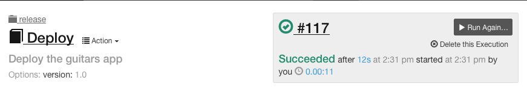
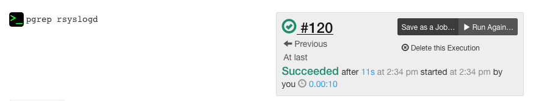
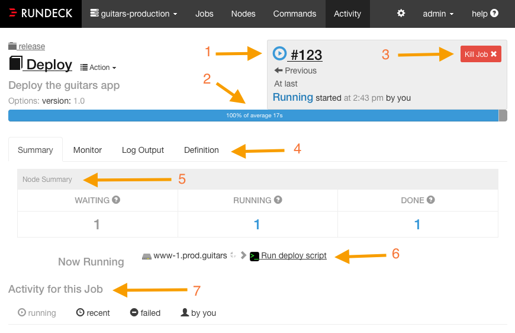
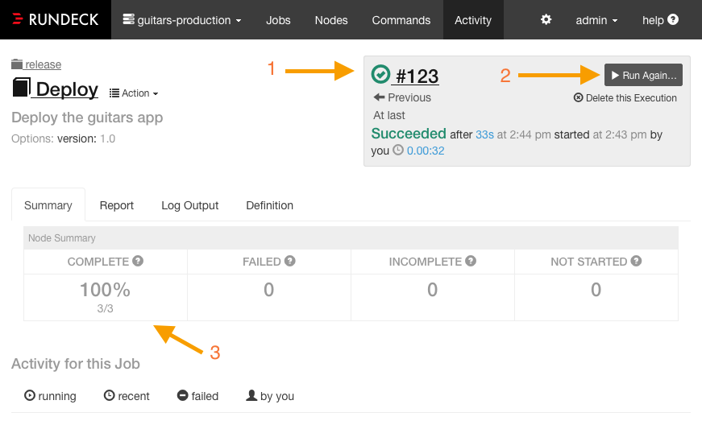
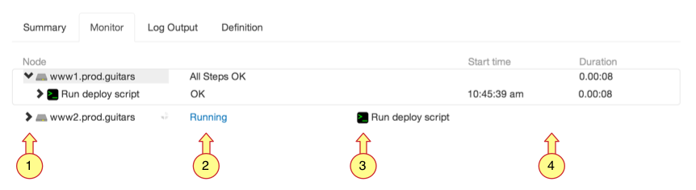
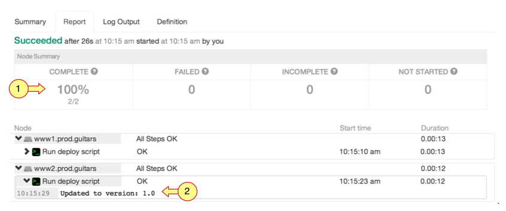
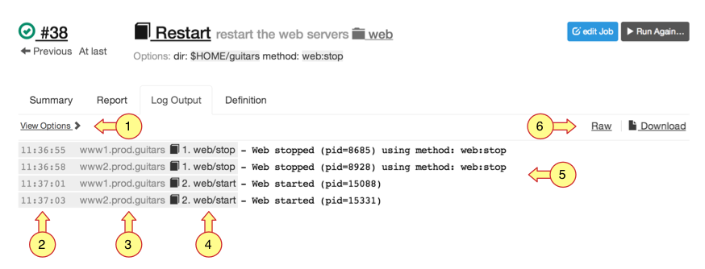
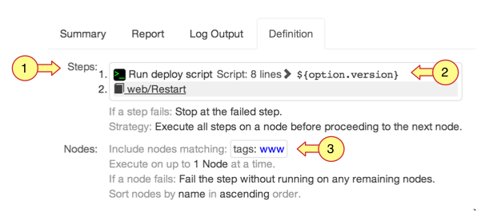

# 실행 (Excutions)

* 명령이나 잡이 실행되고 있는 상태 또는 완료된 내용에 대한 표시를 의미한다.
* 실행에 대한 데이터는 잡이나 명령에 대한 진행 상황을 모니터링하고 이 후 발생 상황을 리포팅하는데 사용된다.
* 각 실행에는 명령 또는 작업의 각 단계에서 생성된 Output과 노드의 레코드 및 각 단계별 시작/종료 시간 및 상태가 포함된다.
* 각 실행은 고유한 ID로 식별되고 URL로 표현될 수 있다.
  * 이 URL은 Rundeck의 다른 사용자들과 공유 할 수 있다.


## 잡 실행 뷰 (Job Excution view)



* 잡 실행 화면은 이름과 그룹을 표시하고, 책 모양의 아이콘으로 표현된다.


## 명령 실행 뷰 (Command Excution view)



* 명령 문자열을 실행이름으로 표시하고 아이콘은 터미널 명령 프롬프트 모양(>_)으로 표현된다.
* "Save as a Job …" 버튼을 누르면 동일한 노드 필터 정보를 사용하여 명령으로부터 잡을 생성하고 명령 문자열을 사용하여 워크플로의 첫번째 단계를 자동으로 정의할 수 있다.


## Summary 탭

* 실행 페이지에서 가장 왼쪽에 위치한 탭
* 실행 상태에 대한 간략한 뷰를 제공


### 동작 중인 경우 Summary 탭



1. 실행 상태 아이콘이며, 이 아이콘의 색이 파란색이면 현재 실행 상태임을 의미한다.
2. 경과 시간 진행률 표시 줄이며 평균 경과 시간은 이전 실행된 결과에 의해 계산된다. 경과 시간이 평균 지속 시간 내에 있으면 진행 표시 줄의 색이 파란색으로 표시된다. 평균을 초과하는 경우 주황색으로 표시된다.
3. ACL 정책에 의한 권한이 부여된 사용자의 경우 실행을 중지시킬 수 있다.
4. 요약 외 모니터, 로그 출력, 정의 탭으로 이동할 수 있다.
5. 노드 요약 테이블에서는 현재 실행 대기 중 인 노드와 실행 중인 경우에는 진행 단계를 표시하고, 실행을 마친 노드를 표시한다.
6. 현재 실행 중인 노드와 단계를 표시한다. 현재의 단계를 클릭하면 모니터뷰로 연결된다.
7. 실행 내역을 표시한다.


### 동작이 완료된 Summary 탭



1. 실행 상태 아이콘이 녹색으로 표시되고 성공 했음을 나타낸다. 실패한 경우에는 빨간색으로 표시된다.
2. "Run Again…" 버튼을 눌러서 다시 실행 시킬 수 있다.
3. 실행에 대해 각 단계별로 성공 여부에 대한 퍼센티지를 표시한다.
   * COMPLETE : 모든 단계 실행에 성공한 노드 수
   * FAILED : 실패한 단계가 존재하는 노드 수
   * INCOMPLETE : 일부 시작되지 않은 단계가 있는 노드 수
   * NOT STARTED : 모든 단계가 시작되지 않은 노드 수


## Monitor 탭

* 실행이 진행 중인 경우 Monitor탭이 활성화 된다.
* Monitor 탭을 통해 노드의 실행 상태나 단계별 실행 상태를 볼 수 있다.



1. 노드명 왼쪽의 화살표 모양의 아이콘을 클릭하면 각 단계가 표시된다. 단계를 클릭하면 Output이 표시된다.
2. 단계에 대한 상태가 표시된다. 해당 노드의 모든 단계가 완료되면 "All Steps OK"로 전환된다. 그렇지 않은 경우 "Running"으로 표시된다.
3. 현재 실행 단계가 표시된다.
4. 시작 시간과 경과 시간이 표시된다.


## Report 탭

* 실행이 완료된 경우 Report 탭이 활성화 된다.
* Report 탭을 통해 완료된 실행에 대한 보고서를 확인할 수 있다.



1. 실행에 대해 각 단계별로 성공 여부에 대한 퍼센티지를 표시한다.
   * 동작이 완료된 Summary 탭 참고
2. Monitor 탭에서 보여지는 정보와 동일


## Log Output 탭

* 각 단계에서 생성되는 Output은 Log Output 탭에 표시된다.



1. View Option을 통해 출력할 항목에 대해 체크박스로 선택할 수 있다.

   * Log view : Time / Node / Step
   * Node view : By Node / Ansi Color

2. Rundeck에서 로그를 수신한 타임스탬프 (원격 서버에서 실제로 명령을 실행한 시간이 아님)

3. 해당 단계가 수행된 노드의 이름

4. 노드에서 실행된 단계의 이름. 여기서 아이콘은 단계의 종류를 나타낸다. (잡인 경우 책 아이콘, 명령인 경우 명령 프롬프트 아이콘)

5. 단계에서 생성된 로그 Output. 표준 오류로 기록된 Output의 경우에는 갈적색(brownish red)으로 표시된다.

   * View Option에서 Ansi Color가 체크되어 있는 경우에 색이 표시된다.

6. Raw 링크를 누르면 실행에 대한 메타 데이터 없이 로그 메시지만 표시한다.

   ```
   - Web stopped (pid=8685) using method: web:stop
   - Web stopped (pid=8928) using method: web:stop
   - Web started (pid=15088)
   - Web started (pid=15331)
   ```


## Definition 탭

* 잡과 명령을 통해서 실행하는 것 외에 Definition 설정을 통해 실행을 할 수 있다.
* Definition에서는 노드 필터식과 일치하는 노드들을 포함하고, 워크 플로우 전략, 오류 처리, 동시성 설정등을 할 수 있다.



1. 각 단계가 실행 순서대로 번호가 부여된다.
2. 링크를 클릭하면 창에 스크립트가 표시된다.
3. 노드 필터링 표현식


