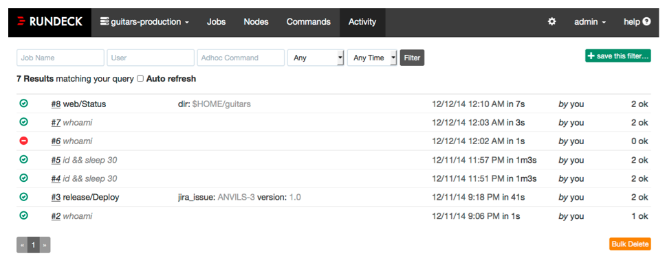

# 활동 (Activity)

* 명령이나 잡을 실행한 기록은 Rundeck 서버에 저장이되는데, Activity 페이지에서 확인 가능하다.

* 기본적으로 실행 중인 실행 및 최근 실행 내역이 나열된다.
* 필터를 적용할 수 있다.
  * 시간범위
  * 잡 이름
  * 사용자
  * 임시 명령
  * 결과
* 필터는 저장이 가능하기 때문에 반복적으로 사용되는 필터는 저장해서 사용하면 유용하다.
* 성공한 실행 목록의 경우 출력 메시지를 확인할 수 있는 링크가 제공되고, 실패한 실행 목록의 경우 빨간색 텍스트로 노드 수가 표시된다.