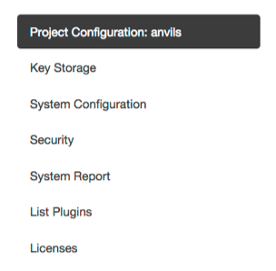
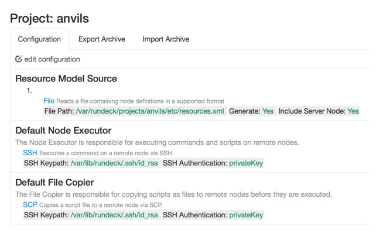
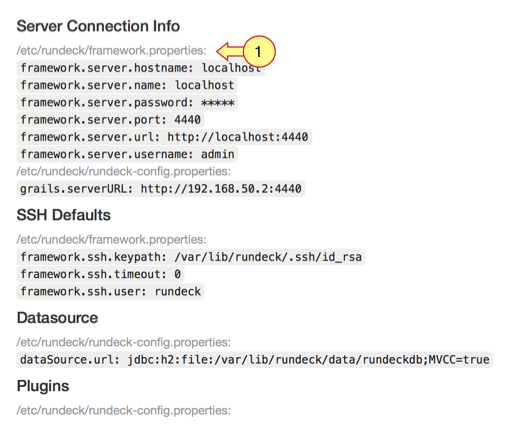
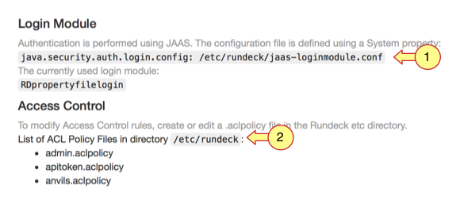

# 구성 (Configure)


## 프로젝트 구성 (Project Configuration)



* Resource Model Source : 프로젝트의 리소스 모델 소스를 추가하고 수정할 수 있다. 이 소스에는 프로젝트의 노드 정의가 들어있고, 초기 프로젝트를 생성하고 나면 하나의 소스가 이미 정의되어 있다. 
  * 리소스 모델 소스의 유형은 기본적으로 파일, 디렉토리, 스크립트, URL 소스(GET)가 지원되고, 추가적으로 플러그인을 통해 다른 유형을 지정할 수 있다.
* Default Node Executor : Rundeck이 노드에서 명령을 실행하면 Node Executor를 통해서 명령을 실행한다. 기본적으로 SSH를 사용하며 다른 Executor를 사용할 수도 있다.
* Default File Copier : Rundeck이 노드에서 스크립트를 실행할 때 File Copier를 통해 스크립트를 먼저 노드에 파일로 복사하고 난 뒤에 스크립트를 실행한다. 기본적으로 SCP를 사용하며 다른 Copier를 사용할 수도 있다.


## Key Storage

* 공개키, 개인키와 같은 암호를 관리하는 API 및 GUI를 제공한다.

* 저장된 키는 Node Executor, File Copier에서 사용된다.

* 키는 파일을 업로드하거나 텍스트를 입력하여 저장할 수 있다.

* 키를 저장할 디렉토리에 대해 디렉토리 구조를 미리 정의하여 키를 구성할 수 있다.

  * 예) 세개의 필드를 사용해서 키 관리

    ```
    keys/projects/{project}/nodes/{node}/{identity}.pem convention
    ```

    * {project} : 프로젝트 이름
    * {node} : 노드 이름
    * {identity} : 사용자의 이름


## 시스템 설정 & 보안

* Rundeck GUI를 통해 /etc/rundeck/framework.properties 파일 내용을 수정할 수 있다.

  

* Rundeck GUI를 통해 /etc/rundeck/jaas-loginmodule.conf 파일 내용을 수정할 수 있다.

  

  ​


