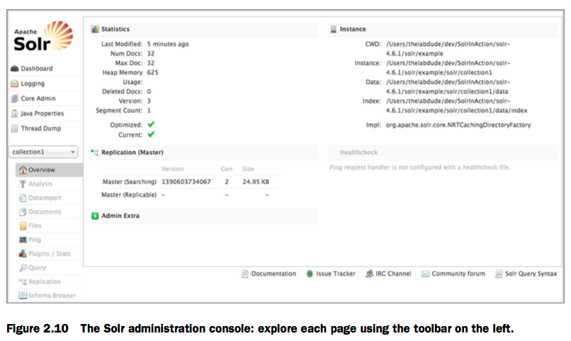

[TOC]

# 2장. Getting to know Solr (솔라에 대해 알아보자)

* 이 장에서 알아볼 내용
  * Apache Solo 4.7 다운로드 및 설치
  * 솔라 서버 예제 시작하기
  * 정렬, 페이징 및 결과 형식 지정
  * Solritas 예제 검색 UI  살펴보기


친숙하지 않은 기술을 사용하기 시작할 때 불안감을 느끼는 것은 당연한 일이지만, Solr는 설치와 사용이 쉽게 설계 되었기 때문에 마음 편히 Solr를 사용할 수 있습니다. 빠르게 기초부터 시작하여 Solr 구성을 점진적으로 복잡하게 만들 수 있습니다. 예를 들어 Solr를 사용하면 큰 인덱스를 샤드 (shards)라는 작은 하위 집합으로 분할하고 복제본을 추가하여 쿼리를 처리 할 수 있도록 용량을 늘릴 수 있습니다. 그러나 스케일 이슈가 발생하기 전까지는 인덱스 샤딩이나 복제에 대해 걱정할 필요는 없습니다.

이 장의 읽고나면 컴퓨터에서 Solr를 실행하고, Solr를 시작 및 중지하는 방법과 웹 기반 관리 콘솔을 사용하는 방법을 알게될 것이며, Solr 홈, 코어 및 컬렉션과 같은 주요 Solr 용어에 대한 기본적인 이해를 하게 될 것이다.

```
Solr 4 와 SolrCloud라는 이름은 무엇일까?
SolrCloud에 대해 들어 보았을 수도 있고, Solr4와 SolrCloud의 차이점이 무엇인지 궁금해 할 수도 있습니다. 기술적으로 SolrCloud는 Solr 4의 기능 하위 집합에 대한 코드 이름으로 Solr 서버의 내결함성이 뛰어난 클러스터의 확장을 수행하고, 구성을 쉽게 할 수 있습니다. SolrCloud는 Solr 4의 분산 설치를 구성하는 방법으로 생각하면 됩니다.
또한 SolrCloud는 Amazon EC2와 같은 클라우드 컴퓨팅 환경에서 Solr를 실행하는 것과 관계가 없지만 클라우드에서 Solr를 실행할 수는 있습니다. 우리는 이 이름의 "cloud"라는 부분이 탄력있는 확장성, 고가용성 및 클라우드 기반 서비스에서 기대할 수있는 사용 편의성을 제공하는 SolrCloud 요소 세트의 근본적인 목표를 반영한다고 생각합니다. 우리는 13장에서 SolrCloud에 대해 자세히 다룰 것입니다.
```

이제 아파치 웹 사이트에서 Solr를 다운로드하고 컴퓨터에 설치도록 합시다.


## 2.1 Getting started (시작하기)

Solr에 대해 알아보기 전에 먼저 로컬 컴퓨터에서 Solr를 실행해야합니다. Apache에서 Solr 4.7의 바이너리 배포판을 다운로드하고 압축 파일을 해제하는 것으로부터 시작합니다. 설치가 끝나면 예제 Solr 서버를 시작하고 웹 브라우저에서 Solr 관리 콘솔에 접속하여 실행 중인지 확인합니다. 이 과정에서 여러분이 선택한 OS의 명령행(command line)에서 간단한 명령을 실행하는 것이 익숙할 것이라고 가정합니다. Solr를 위한 GUI 설치 프로그램은 없지만, 프로세스가 너무 간단해서 필요가 없다는 것을 곧 알게 될 것입니다.


### 2.1.1 Installing Solr (Solr 설치하기)

Solr 설치는 바이너리 배포판 (.zip 또는 .tgz)을 다운로드하고 압축을 해제해야한다는 점에서 다소 잘못된 표현입니다. 먼저 필수 프로그램인 Java 1.6 이상 (J2SE 6)이 설치되어 있는지 확인하십시오. Java가 올바르게 설치되었는지 확인하려면 컴퓨터에 명령 행을 열고 다음을 입력하십시오.
         java --version
다음과 유사하게 출력이 되어야 합니다.

```
java version "1.6.0_24"
        JavaTM SE Runtime Environment (build 1.6.0_24-b07)
        Java HotSpotTM 64-Bit Server VM (build 19.1-b02, mixed mode)
```

Java를 설치하지 않은 경우 Oracle의 JVM (www.oracle.com/technetwork/java/javase/downloads/index.html)을 사용할 것을 추천합니다. Solr 서버가 Java를 필요로한다고해도, 애플리케이션에서 Java를 사용하여 Solr과 상호 작용해야한다는 것을 의미하지는 않습니다.

Solr와의 클라이언트 상호 작용은 HTTP를 통해 발생하므로 HTTP 클라이언트 라이브러리를 제공하는 모든 언어에서 사용할 수 있습니다. 또한 .NET, Python, Ruby, PHP 및 Java와 같은 널리 사용되는 언어에 대해 Solr에서는 여러 가지 오픈 소스 클라이언트 라이브러리를 사용할 수 있습니다.
Java가 설치되었다고 가정하고, 이제 Solr를 설치할 준비가 되었습니다. Apache는 Solr의 소스 및 바이너리 배포판을 제공합니다. 지금은 바이너리 배포판을 사용하는 설치 단계에 초점을 맞출 것이고, 12 장에서 소스로부터 Solr를 빌드하는 것을 다룹니다.

Solr의 최신 버전을 다운로드하려면, [Solr 홈페이지](http://lucene.apache.org/solr)로 이동해서 오른쪽의 Apache Solr 다운로드 버튼을 클릭하십시오. 그러면 Apache 다운로드를 위한 미러 사이트로 연결됩니다. 미러 사이트에서 최신 버전을 다운로드하여 기본 Apache 사이트에 과부하가 발생하지 않도록하는 것이 좋습니다. Windows를 사용하는 경우 solr-4.7.0.zip을 다운로드하십시오. Unix, Linux 또는 Mac OS X 사용자 인 경우 solr-4.7.0.tgz을 다운로드하십시오. 이 책의 모든 예제는 Solr 4.7.0을 기반으로하므로, Solr 4.7.0을 홈페이지에서 구할 수 없는 상태에서 예제를 따르기를 원한다면 http://archive.apache.org/dist/lucene/solr/4.7.0/에서 Apache Software Foundation의 Solr 4.7.0을 받을 수 있습니다.
다운로드 후 다운로드 한 파일을 컴퓨터의 변하지 않는 위치로 이동하십시오. Windows에서는 C:\root 디렉토리로 이동하거나 Linux에서는 /opt/solr/과 같은 위치를 선택할 수 있습니다. Windows 사용자의 경우 공백이 없는 디렉토리명으로 생성하는 것이 좋습니다. 즉, C:\Documents and Settings\ 또는 C:\Program Files\와 같은 디렉토리에 Solr를 생성하지 마십시오. Solr는 Java 기반 소프트웨어이기 때문에 공백이 포함 된 경로에 문제가 발생할 가능성이 있습니다.

Solr는 하나의 압축 파일에 자체 포함되어 있기 때문에 정식 설치 프로그램이 필요하지 않고, 압축 해제만하면 됩니다. 압축을 해제하면 모든 파일이 solr-4.7.0/ 디렉토리 아래에 생성됩니다. Windows에서는 기본적으로 지원하는 ZIP 압축 해제 또는 WinZip과 같은 도구를 사용할 수 있습니다. Unix, Linux 또는 Mac에서는 tar zxf solr-4.7.0.tgz를 실행하십시오. 그러면 그림 2.1과 같은 디렉토리 구조가 생성됩니다.
Solr 압축 파일을 해제한 위치 (.zip 또는 .tgz)는 $SOLR_INSTALL/로 이 책의 나머지 부분에서 참조합니다. Solr 홈은 다른 경로가 될 것이므로 Solr를 압축 해제한 최상위 디렉토리의 별칭으로 $SOLR_HOME/을 사용할 수 없기 때문에 이 이름을 사용합니다. Solr가 설치되었으므로 이제 시작할 준비가 되었습니다.


### 2.1.2 Starting the Solr example server (Solr 예제 서버 시작하기)

Solr를 시작하려면 명령 행을 열고 다음을 입력하십시오.

```
cd $SOLR_INSTALL/example
java -jar start.jar
```

$SOLR_INSTALL/은 Windows에서 C:\solr-4.7.0\과 같이 Solr 압축 파일의 압축을 푼 디렉토리를 나타내는 데 사용하는 별칭입니다. 위 명령은 Solr를 시작하는 것이 전부입니다.


초기화하는 동안 콘솔에 인쇄 된 일부 로그 메시지가 표시됩니다. 모두 정상적으로 작동하면 아래 또는 근처에 다음과 같은 로그 메시지가 표시됩니다.

```
3504 [main] INFO  org.eclipse.jetty.server.AbstractConnector  – Started
     SocketConnector@0.0.0.0:8983
```

**어떻게 된 일 일까요?**
뭔가 쉽게 이루어져서 어떤것이 수행되었는지 궁금할 것입니다. 컴퓨터에는 실행중인 Solr 4.7 버전이 있을 것입니다. 웹 브라우저에서 http://localhost:8983/solr의 Solr 관리 페이지에 접속하여 Solr가 올바르게 시작되었는지 확인할 수 있습니다. 그림 2.2는 Solr 관리 콘솔의 스크린 샷입니다. 잠시 시간을 내어 콘솔의 레이아웃 및 탐색 도구를 숙지하십시오.


그 뒤에서도 start.jar는 포트 8983에서 수신 대기중인 Jetty라는 Java 웹 서버를 시작했습니다. Solr은 Jetty에서 실행되는 웹 응용 프로그램입니다. 그림 2.3은 현재 컴퓨터에서 실행중인 것을 보여줍니다.


**문제 해결**
예제 서버를 시작할 때 크게 잘못되는 경우는 드뭅니다. 서버가 올바르게 시작되지 않으면 가장 일반적인 문제는 기본 포트 8983이 이미 다른 프로세스에서 사용되고 있다는 것입니다. 이 경우 java.net.Bind- Exception : Addressalreadyinuse와 같은 오류가 표시됩니다. Solr 바인딩 포트를 변경하면 쉽게 해결할 수 있습니다. 시작 명령을 변경하여 java -Djetty.port = 8080 -jar start.jar을 사용하여 Jetty가 바인드 할 다른 포트를 지정하십시오. 이 명령을 사용하여 Jetty는 8983 대신 8080 포트에 바인딩합니다.


```
Jetty vs Tomcat
Solr를 처음 배울 때는 Jetty를 사용할 것을 권합니다. 귀사에서 Tomcat 또는 Resin과 같은 다른 Java 웹 응용 프로그램 서버를 사용하는 경우에도 Solr WAR 파일을 배포 할 수 있습니다. 이 장에서 Solr에 대해 알게되었으므로 12 장에서 Solr WAR 파일을 배포하는 방법을 배우게 될 것입니다.
Solr는 Jetty를 사용하여 초기 설정 및 구성 프로세스를 간단하게 만듭니다. 그러나 이것이 Jetty가 실제 프로덕션 개발에 있어서 안좋은 선택임을 의미하지는 않습니다. 조직에 이미 표준 Java 웹 응용 프로그램 플랫폼이있는 경우 그것을 사용하면 됩니다. 그러나 선택의 여지가 있다면 Jetty를 사용해 보는 것이 좋습니다. 빠르고, 안정적이며, 성숙하며, 관리 및 사용자 지정이 쉽습니다. 실제로, Google은 App Engine에 Jetty를 사용합니다 (www.infoq.com/news/2009/08/google-chose-jetty/). 가장 까다로운 환경에서도 Solr를 실행하기 위한 견고한 플랫폼으로 Jetty에 큰 신뢰를 보냅니다!
```


**SOLR 중지**
로컬 작업의 경우 Solr를 시작한 콘솔 창에서 Ctrl-c를 눌러 Solr 서버를 종료 할 수 있습니다. 일반적으로 이것은 개발 및 테스트에 충분히 안전합니다. Jetty는 12 장에서 설명 할 서버를 중지시키는 더 안전한 메커니즘을 제공합니다.

이제 실행중인 서버가 있으므로 Solr가 설정 정보를 얻는 위치와 Lucene 색인을 관리하는 위치에 대해 잠시 알아봅시다. 시작한 예제 서버가 어떻게 구성되어 있는지 이해하고나면 응용 프로그램용 Solr 서버 설정을 하기 위한 준비가 되었을 때 도움이 될 것입니다.


### 2.1.3 Understanding Solr home (Solr 홈 이해하기)

Solr에서 코어는 일련의 설정 파일, Lucene 색인 파일 및 Solr의 트랜잭션 로그로 구성됩니다. Jetty에서 실행되는 하나의 Solr 서버는 여러 코어를 호스트 할 수 있습니다. 1 장에서 우리는 집을 위한 코어와 토지 목록을 위한 별도의 코어를 가진 부동산 검색 응용 프로그램을 설계했음을 상기하십시오. 인덱싱 된 데이터가 서로 다른 두 가지 인덱스 구조를 갖기 때문에 완전히 다른 두 개의 코어를 사용했습니다. 2.1.2 절에서 시작한 Solr 예제 서버에는 collection1이라는 단일 코어가 있습니다.
간단히 말하자면, Solr는 Collection이라는 용어도 사용합니다. Solr 클러스터의 컨텍스트에서 의미가있는 것은 단일 인덱스가 여러 서버에 분산되어 있다는 의미입니다. 결과적으로 Solr 코어가 현재 무엇인지 이해하는데 초점을 맞추는 것이 더 쉽다고 느낍니다. 우리는 SolrCloud를 다룰 때 13장에서 코어와 컬렉션의 특징에 대해 되짚어 볼 것입니다.

Solr home은 하나 이상의 코어를 캡슐화하는 디렉토리 구조로, 실제로 solr.xml이라는 구성 파일로 구성되었습니다. 그러나 Solr 4.4부터는 코어를 자동 발견 할 수 있으므로 solr.xml에서 코어를 정의 할 필요가 없습니다. 따라서 클라우드 모드에서 실행중인 Solr에만 적용되는 고급 옵션이 포함되어 있으므로 현재 예제 서버에 제공된 solr.xml 파일은 무시해도 됩니다. 또한 Solr은 애플리케이션에서 프로그래밍 방식으로 코어를 생성, 업데이트 및 삭제할 수있는 핵심 관리 API를 제공합니다. 핵심 관리 API에 대해서는 12 장에서 자세히 다룹니다.
지금 당장은 각 Solr 서버가 모든 코어를 포함하는 Solr 홈 디렉토리를 하나씩 가지고 있다는 것을 이해하는 것이 중요합니다. 전역 Java 시스템 등록 정보 solr.solr.home은 Solr 홈 디렉토리의 위치를 설정합니다. 그림 2.4는 예제 서버에 대한 기본 Solr 홈 solr의 디렉토리 목록을 보여줍니다.
우리는 4 장에서 solrconfig.xml이라는 코어의 주요 Solr 구성 파일에 대해 더 배우게 될 것 입니다. 또한 schema.xml은 문서와 쿼리에 대한 인덱스 구조와 텍스트 분석을 관리하는 주요 구성 파일이고, 이는 5장에서 모두 배우게 될 것입니다. 이제는 그림 2.4를 살펴보고 Solr 홈 디렉토리의 기본 구조를 이해하십시오.

예제 디렉토리에는 고급 기능을 탐색 할 수 있는 두 개의 다른 Solr 홈 디렉토리가 있습니다. 특히 example/example-DIH/ 디렉토리는 Solr의 DIH 기능을 학습하기위한 Solr 코어를 제공합니다. 또한 example/multicore/ 디렉토리는 다중 코어 구성의 예를 제공합니다. 이 기능에 대한 자세한 내용은이 책의 뒷부분에서 설명합니다. 지금은 색인에 문서를 추가하여 간단한 예제를 계속 진행할 것입니다. 2.2 절의 예제를 통해 작업해야합니다.


### 2.1.4 Indexing the example documents (예제 문서 인덱싱)

Solr를 처음 시작하면 색인에 document가 없습니다. 검색 할 데이터로 가득 찬 대기중인 서버입니다. 5 장에서 색인 생성에 대해 더 자세히 다룹니다. 이제는 Solr 색인에 예제 데이터를 가져와 몇 가지 쿼리를 시도해 볼 수 있도록 세부 사항을 자세히 살펴 보겠습니다. 새 명령 행 인터페이스를 열고 다음을 입력하십시오.

```
cd $SOLR_INSTALL/example/exampledocs
java -jar post.jar *.xml
```

아래와 같은 결과가 출력될 것입니다.:

```
SimplePostTool version 1.5
Posting files to base url http://localhost:8983/solr/update using content-
     type application/xml..
POSTing file gb18030-example.xml
POSTing file hd.xml
POSTing file ipod_other.xml
POSTing file ipod_video.xml
POSTing file manufacturers.xml
POSTing file mem.xml
POSTing file money.xml
POSTing file monitor.xml
POSTing file monitor2.xml
POSTing file mp500.xml
POSTing file sd500.xml
POSTing file solr.xml
POSTing file utf8-example.xml
POSTing file vidcard.xml
14 files indexed.
COMMITting Solr index changes to http://localhost:8983/solr/update..
```

post.jar 파일은 HTTP POST를 사용하여 XML 문서를 Solr에 보냅니다. 모든 문서가 Solr에 전송 된 후 post.jar 응용 프로그램은 Solr에서 예제 문서를 찾을 수 있도록 커밋을 실행합니다. 예제 문서가 성공적으로 추가되었는지 확인하려면 Solr 관리 콘솔의 쿼리 페이지 (http://localhost:8983/solr)로 이동하여 모든 문서 찾기 쿼리 (* : *)를 실행하십시오. Query 페이지로 이동하려면 왼쪽의 드롭 다운 상자에서 collection1을 선택해야합니다. 그림 2.5는 모든 문서 찾기 쿼리를 실행 한 후 표시되는 내용을 보여줍니다.
이 시점에서 몇 가지 예제 document에서 로드 된 Solr 인스턴스가 실행 중입니다.


## 2.2 Searching is what it's all about (검색이 모든 것을 의미합니다.)

이제 Solr의 빛나는 모습을 볼 시간입니다. 의심의 여지없이 Solr의 강점은 강력한 쿼리 처리입니다. 이런 식으로 생각하십시오; 검색 엔진이 반환하는 결과가 유용하지 않거나 정확하지 않은 경우 검색 엔진의 확장성 또는 빠른 처리에 누가 관심을 갖겠습니까? 이 섹션에서는 솔라 (Solr) 쿼리 처리가 실제로 작동하는 것을 볼 수 있는데, 솔라가 왜 그렇게 강력한 검색 기술인지를 알 수 있습니다.
이 절 전반에 걸쳐 우리가 실행하는 각 쿼리와 Solr가 반환하는 document, 특히 결과에서 document의 순서 사이의 링크에 주의를 기울이십시오. 이렇게하면 곧 배우게 될 3장의 코어 검색 개념을 다루게 될 때 검색 엔진처럼 생각하게끔 도움을 줄 것입니다.


### 2.2.1 Exploring Solr's query form (Solr의 쿼리 폼 탐색)

이미 Solr의 쿼리 폼을 사용하여 모든 document 찾기 쿼리를 실행했습니다. Solr가 지원하는 쿼리 폼에 대한 이해를 얻으려면이 폼의 다른 기능들을 살펴보십시오. 그림 2.6은이 폼의 주요 부분에 대한 몇 가지 주석을 제공합니다. 잠시 시간을 내어 다이어그램의 각 주석을 읽어보십시오.


그림 2.6에서는 2.1.4 절에서 추가 한 예제 document 두 개를 반환하는 쿼리를 작성합니다. 폼을 채우고 자신의 환경에서 쿼리를 실행하십시오. Solr가 반환 한 두 개의 document가 의미가 있습니까? 표 2.1은 이 예제에서 사용하는 폼 필드의 개요를 제공합니다.
1 장 (1.2.3 절)에서 설명한 것처럼, 질의 처리와 같은 Solr의 핵심 서비스와의 모든 상호 작용은 HTTP 요청으로 수행됩니다. 쿼리 폼을 채울 때 HTTP GET 요청이 생성되어 Solr로 전송됩니다. 표 2.1에 표시된 폼 필드 이름은 HTTP GET 요청에서 Solr에 전달 된 매개 변수에 해당합니다. Listing 2.1에서는 그림 2.6에서 설명한 쿼리를 실행할 때 Solr에 전송 된 HTTP GET 요청을 보여 줍니다. 요청에는 매개 변수 사이에 줄 바꿈이 포함되지 않습니다. 이 매개 변수는 별도의 매개 변수를 더 쉽게 볼 수 있도록 여기에 포함되었습니다.


**테이블 2.1 그림 2.6의 쿼리 매개 변수 개요**

| 폼 필드  | 값                           | 설명                                       |
| ----- | --------------------------- | ---------------------------------------- |
| q     | iPod                        | 기본 쿼리 매개 변수. 문서는이 매개 변수의 용어와 유사 함으로 점수가 매겨집니다. |
| fq    | manu:Belkin                 | 필터 쿼리. 결과 집합을 이 필터와 일치하는 document로 제한하지만 채점에는 영향을 주지 않습니다. 이 예에서는 제조업체 필드가 Belkin과 동일한 결과를 필터링합니다. |
| sort  | price asc                   | 정렬 필드 및 정렬 순서를 지정합니다. 이 경우 가격 필드별로 정렬 된 결과가 오름차순 (오름차순)으로 표시되어 가장 낮은 가격의 document가 먼저 나열됩니다. |
| start | 0                           | 결과의 시작 페이지를 지정합니다. 이것이 첫 번째 요청이기 때문에 첫 번째 페이지에서 0 기반 색인을 사용하기를 원합니다. 시작은 다음 페이지로 넘어 가기 위해 페이지 크기만큼 증가해야합니다. |
| rows  | 10                          | 페이지 크기; 페이지 당 반환되는 결과의 수를 제한합니다 (이 경우 10). |
| fl    | name,price, features, score | 결과 집합의 각 document에 대해 반환 할 필드 목록입니다. 점수 필드는 쿼리에 대한 각 document의 관련성 점수를 유지하는 기본 제공 필드입니다. 이 예제에서와 같이 점수 필드가 명시 적으로 반환되도록 요청해야합니다. |
| df    | text                        | 검색 할 필드를 지정하지 않은 검색어의 기본 검색 필드입니다. text는 예제 서버의 catch-all 필드입니다. |
| wt    | xml                         | 응답 작성자 유형. 응답 형식을 결정합니다.                 |


```
더 많은 예제 쿼리를 찾고 계십니까?
7 장에서 좀 더 깊이있는 쿼리를 다룹니다. 그러나 오래 기다리지 않고 더 많은 쿼리를 보고 싶다면 Solr와 함께 제공되는 튜토리얼을 살펴 보는 것이 좋습니다. 웹 브라우저에서 $SOLR_INSTALL/docs/tutorial.html을 열면 2.1.4 절에서로드 한 예제 문서에 대한 추가 쿼리를 찾을 수 있습니다.
```

이 폼은 최종 사용자를 위해 설계되지 않았다고 할 필요는 없습니다. Solr는 개발자와 관리자가 HTTP 요청을 수동으로 공식화하지 않고도 쿼리를 보내거나 클라이언트 애플리케이션을 개발하여 Solr에 쿼리를 보낼 수 있도록 쿼리 형식을 제공합니다. 그러나 Solr 기반 응용 프로그램을 사용하면 UI 개발까지 담당하게 됩니다. 2.2.5 절에서 볼 수 있듯이 Solr은 멋진 검색 응용 프로그램을 프로토 타이핑 할 수 있도록 Solritas라는 사용자 정의 가능한 검색 UI를 제공합니다.


### 2.2.2 What comes back from Solr when you search (검색 할 때 Solr로부터 되돌아 오는 것)


우리는 Solr에게 무엇이 보내 졌는지 보았습니다. 이제 결과로 어떤것이 반환되는지 알아 보겠습니다. 이 섹션의 핵심은 Solr가 쿼리와 일치하는 문서를 반환하고 Solr 클라이언트가 고품질 검색 환경을 제공하기 위해 처리 할 수있는 추가 정보를 반환한다는 것입니다. 수행되는 문구는 여러분의 솔라 클라이언트에 의한 것입니다!(The operative phrase being by your Solr client!) Solr은 사용자에게 고품질의 검색 경험을 제공하는 데 필요한 raw 데이터 및 기능을 반환합니다.
그림 2.7은 2.2.1 절에서 사용한 예제 쿼리에서 반환되는 것을 보여줍니다. 보시다시피, 결과는 XML 형식이며 최저 가격에서 최고 가격으로 정렬됩니다. 각 문서에는 iPod이라는 용어가 들어 있습니다. 총 2 개의 결과 만 있기 때문에 페이징은이 결과 집합과 연동되지 않습니다.


지금까지 XML로 반환 된 결과만 보았지만 Solr는 CSV (쉼표로 구분 된 값),  JSON (JavaScript Object Notation) 및 많이 사용되는 언어들을 위한 언어별 형식도 지원합니다. 예를 들어, Solr는 Python 형식으로 반환 할 수 있습니다. 이 형식을 사용하면 응답을 eval 함수를 사용하여 Python 객체 트리로 안전하게 파싱 할 수 있습니다.


### 2.2.3 Ranked retrieval (순위 검색)

1 장에서 언급했듯이 Solr의 쿼리 처리와 데이터베이스 또는 다른 NoSQL 데이터 저장소의 주요 차별화 요소는 순위 검색입니다. 즉, 쿼리 관련성 순으로 document를 정렬하는 프로세스로 가장 관련성이 높은 document가 먼저 나열됩니다.
2.1.4 절에서 색인을 생성한 예제 문서 중 순위가 매겨진 검색을 살펴 보겠습니다. 시작하려면 q 텍스트 박스에 iPod을 입력하고 fi 텍스트 필드에 이름, 기능 및 점수를 입력 후 실행을 클릭하십시오. 이것은 3개의 문서를 점수에 따라 내림차순으로 정렬하여 반환합니다. 잠시 결과를 살펴보고 이 간단한 쿼리의 순위가 올바른지 살펴보십시오.
직관적으로, 순서는 의미가 있습니다. 쿼리 용어 iPod은 나열된 첫 번째 document에서 세번, 이름에 두 번, 기능에서 한 번 나타납니다. 다른 document에서 한 번만 발생합니다. 점수 필드의 숫자 값은 본질적으로 의미가 없습니다. Lucene이 내부적으로 상대적 순위를 매기는 용도로만 사용되며 다른 쿼리에서 비교할 수 없습니다. 중요한 테이크 어웨이는 쿼리와 일치하는 모든 문서에 해당 쿼리에 대한 관련도 점수가 할당되고 결과가 점수에 따라 내림차순으로 반환된다는 것입니다. 점수가 높을수록 쿼리에 대한 문서의 관련성이 높아집니다.

그런 다음 쿼리를 iPod power로 변경하면 동일한 세 개의 문서가 반환되고 동일한 순서로 표시됩니다. 이는 세 문서 모두 이름 또는 기능 필드에 검색어가 모두 포함되어 있기 때문입니다. 그러나 상위 두 문서의 점수는 두 번째 쿼리의 경우 1.521과 1.398에 비해 훨씬 가깝습니다. 첫 번째 쿼리의 경우 1.333과 0.770 (반올림)입니다. 이것은 두 번째 문서에서 두 번 발생하기 때문에 의미가 있습니다. 따라서 iPod power 쿼리와의 관련성은 iPod 쿼리와의 관련성보다 훨씬 높습니다.

이제 검색어를 iPod power ^ 2로 변경하면 power query의 boost가 2 씩 증가합니다. 간단히 말해서,이 용어는 이 검색어에 대해 암시적으로 1의 boost가 있는 iPod 검색어와 비교해 두 배 중요하다는 것을 의미합니다. 동일한 3개의 문서가 반환되지만 순서는 다릅니다. 이제 이름과 기능 필드에 power라는 용어가 포함되어 있고 Solr에게 이 쿼리에 대해 iPod power로 두배나 중요하다고 설정했기 때문에 결과의 가장 중요한 문서는 Belkin Mobile Power Cord for iPod w/ Dock입니다.

이제 순위가 결정된 검색 결과를 맛볼 수 있습니다. 3, 7, 16 장에서 랭킹 검색 및 부스팅에 대해 더 배우게 될 것입니다. 페이징 및 정렬을 사용하여 3 개 이상의 document를 반환하는 쿼리로 작업하는 방법부터 시작하여 쿼리 처리의 다른 기능들을 살펴 보겠습니다.


### 2.2.4 Paging and sorting (페이징 및 정렬)

예제 Solr 인덱스에는 32개의 문서만이 포함되어 있지만 실제 Solr 인스턴스에는 일반적으로 수백만 개의 문서가 존재합니다. 전자 슈퍼마켓의 Solr 인스턴스에서 iPod에 대한 쿼리가 수천 개의 제품 및 액세서리와 일치한다고 상상해보십시오. 특히 대역폭이 제한된 모바일 장치에서 결과가 신속하게 반환되도록하려면 관련성이 가장 높은 항목이 먼저 나열된 경우에도 수천 개의 결과를 한꺼번에 반환하고 싶지는 않을 것입니다.


#### 페이징

해결책은 탐색 도구와 함께 페이지라고하는 결과의 작은 하위 집합을 반환하여 사용자가 필요한 경우 더 많은 페이지를 요청할 수있게 하는 것입니다. 페이징은 모든 쿼리가 페이지 크기 (rows)와 시작 위치 (start)를 제어하는 매개 변수를 포함한다는 점에서 Solr 쿼리 처리의 첫 번째 개념입니다. 요청에 별도로 지정되지 않은 경우 Solr는 기본 페이지 크기 인 10을 사용하지만 쿼리 요청에서 rows 매개 변수를 사용하여 조절 할 수 있습니다. 결과에서 다음 페이지를 요청하려면 start 매개 변수를 페이지 크기만큼 증가시킵니다. 예를 들어 결과의 첫 번째 페이지 (start = 0)에 있는 경우 다음 페이지를 가져 오려면 시작 매개 변수를 페이지 크기 (예 : start = 10)만큼 증가시킵니다.

기본 Lucene 색인은 많은 문서를 즉시 반환하기 위해 최적화되지 않았기 때문에 요구 사항을 만족시키기 위해 가능한 한 작은 페이지 크기를 사용하는 것이 중요합니다. 오히려 Lucene은 쿼리 처리에 최적화 되어 있기 때문에 기본 데이터 구조는 document들의 matching과 scoring를 최대화하도록 설계되었습니다. 일단 검색 결과가 확인되면 Solr는 대부분의 경우 디스크에서 데이터를 읽음으로써 각 문서를 재구성해야합니다. 가능하면 지능형 캐싱을 사용하지만 쿼리 실행에 비해 결과 구성은 비교적 느린 프로세스이며 특히 큰 페이지 크기인 경우 더 그렇습니다. 결과적으로 작은 페이지 크기를 사용해야 Solr의 성능을 더 향상시킬 수 있습니다.


#### 정렬

2.2.3 절에서 보았 듯이 결과는 관련성 점수에 따라 내림차순 (가장 높은 것부터 가장 낮은 것)으로 정렬되지만 document의 다른 필드로 결과를 정렬하도록 요청할 수 있습니다. 2.2.1 절에서 가격 필드별로 결과를 오름차순으로 정렬하여 맨 아래에 가장 저렴한 제품을 생산하는 예를 보았습니다.
정렬 및 페이징은 정렬 순서가 결과의 페이지 위치를 결정하기 때문에 직접 처리됩니다. 정렬과 페이징에 대해 생각할 수 있도록, 정렬 순서를 지정하지 않고 페이징 할 때 Solr가 결정적인 결과를 반환하는지 살펴보십시오. 얼핏 보기에도 sort 매개 변수를 지정하지 않으면 결과가 점수에 따라 내림차순으로 정렬될 것이 분명합니다. 하지만 쿼리의 모든 문서의 점수가 같으면 어떻게 해야할까요? 예를 들어, 쿼리가 inStock : true이면 일치하는 모든 문서는 동일한 점수를 갖습니다. 쿼리 폼을 사용하여 직접 확인할 수 있습니다.

점수가 같더라도 결과를 페이지 할 때 Solr는 모든 document를 결정론적 순서로 반환 할 수 있습니다. 이는 Solr가 쿼리와 일치하는 모든 document를 찾은 다음 정렬 및 페이징 오프셋을 전체 문서 세트에 적용하기 때문에 가능합니다. Solr은 정렬 및 페이징 오프셋과 독립적으로 쿼리와 일치하는 전체 문서 세트를 추적합니다. 덧붙여 말하자면 모든 문서의 점수가 같으면 Lucene에서 관리하는 내부 문서 ID를 기반의 인덱스 순서로 반환됩니다. 내부 문서 ID는 문서가 인덱싱 된 순서와 거의 비슷하지만 인덱스가 변경 될 때 변경 될 수 있으므로 이 값을 정렬에 의존해서는 안됩니다.


### 2.2.5 Expanded search features (확장 된 검색 기능)

쿼리 폼에는 쿼리 처리 중에 고급 기능을 사용할 수 있는 체크 박스 목록이 포함되어 있습니다. 그림 2.6에서 보듯이 폼에는 다음 검색 기능을 활성화하기 위한 추가 양식 필드를 나타내는 체크박스가 있습니다.

* dismax - Disjunction 최대 쿼리 파서 (7 장 참조)
* edismax - 확장 된 분리 점 최대 쿼리 파서 (7 장 참조)
* hl - 히트 하이라이팅 (9 장 참조)
* facet - Faceting (8 장 참조)
* 공간 - 지리적 거리 별 정렬과 같은 지형 공간 검색 (15 장 참조)
* 맞춤법 검사 - 검색어에 대한 맞춤법 검사 (10 장 참조)

이 체크박스 중 하나를 클릭하면 폼을 볼 때 수행 할 작업이 명확하지 않음을 알 수 있습니다. 쿼리 폼에서 이러한 검색 구성 요소를 사용하기 위해 앞 장들에서 간략히 다룰 수 없는 추가 지식이 필요하기 때문입니다. 이 책의 뒷부분에서 각 구성 요소를 자세히 다룰 예정이므로 안심하십시오.
Solritas를 사용하는 동작에 대한 검색 요소를 볼 수 있는 Solr의 검색 인터페이스 예제는 http://localhost:8983/solr/collection1/browse에서 찾을 수 있습니다. 웹 브라우저에서이 URL로 이동하면 그림 2.8과 같은 화면이 나타납니다.

그림 2.8의 상단에 나타난 것처럼 Solr는 Simple, Spatial 및 Group By 중에서 선택할 수있는 세 가지 예제를 제공합니다. 여기서 간단한 예제의 주요 측면을 간략히 살펴보고 다른 두 예제를 직접 찾아 보시길 바랍니다.
그림 2.8을 스캔하여 직장에서 다양한 검색 구성 요소를 식별합니다. 이 예제에서 흥미로운 검색 컴포넌트 중 하나는 페이지의 왼쪽에 Field facets 헤더로 시작하는 facet입니다. facet 구성 요소는 검색 결과의 필드 값을 유용한 하위 집합으로 분류하여 사용자가 쿼리를 수정하고 새로운 정보를 발견하는 데 도움을 줍니다. 예를 들어, 비디오를 검색 할 때 Solr은 세 개의 예제 문서를 반환하고 facet 구성 요소는이 문서의 cat 필드를 electronics (3), graphics card (2) 및 music (1)의 세 가지 하위 집합으로 분류합니다. 음악면 링크를 클릭하면 3 개의 문서에서 필터링 된 결과가 하나만 표시됩니다. 검색 결과 외에도 사용자가 다른 필터를 사용하여 결과를 분류하여 검색 기준을 세분화 할 수 있습니다. 8 장에서 facet에 대해 자세히 다룰 것입니다.


다음으로 그림 2.8에서 즉시 알 수없는 또 다른 검색 구성 요소, 즉 맞춤법 검사 구성 요소를 살펴 보겠습니다. 맞춤법 검사가 어떻게 작동하는지 보려면 동영상 대신 검색 창에 vydeoh를 입력하십시오. 그림 2.9와 같은 결과는 발견되지 않지만 Solr은 비디오를 의미하는지 사용자에게 효과적으로 묻는 링크를 반환합니다. 그렇다면 링크를 사용하여 검색을 다시 실행할 수 있습니다.
Solritas의 세 가지 예제에는 많은 강력한 기능이 포함되어 있으며 각각의 기능을 사용해보시길 바랍니다. 지금 당장 이동하여 나머지 관리 콘솔을 둘러 봅시다.


## 2.3 Tour of the Solr administration console (Solr 관리 콘솔 둘러보기)

이 시점에서 쿼리 폼에 대해 잘 숙지하고 있어야하므로 나머지 관리 콘솔을 간단하게 살펴 보겠습니다 (그림 2.10 참조).



관리자 패널에 시간을 낭비하는 대신, 일부 페이지를 직접 클릭해보는 것이 더 나을 것이라고 생각합니다. 따라서 관리 콘솔의 모든 링크를 방문하여 각 페이지에서 사용할 수있는 내용을 파악할 수 있도록 연습 문제를 만들어 두었습니다. 다음은 관리 콘솔이 제공하는 몇 가지 주요 내용입니다.

* Dashboard에서 Solr 인스턴스가 어떻게 구성되었는지 확인하십시오.
* 로깅에서 최근 로그 메시지를 확인하십시오.
* 일시적으로 로그 상세 설정을 Logging의 Level에서 변경하십시오.
* 코어 관리에서 다수의 코어를 추가 및 관리해보십시오.
* Java 등록 정보에서 Java 시스템 등록 정보를 확인하십시오.
* JVM의 모든 활성 스레드를 스레드 덤프에서 가져오십시오.

이러한 기본 페이지 외에도 서버의 각 코어에 대한 몇 가지 특정 코어 페이지가 있습니다. 지금까지 작업 해 온 예제 서버에는 collection1이라는 코어가 하나만 있습니다. 코어 별 페이지를 사용하면 다음을 수행 할 수 있습니다.

* 기본 코어 페이지 (예 : collection1)에서 Lucene 세그먼트 수와 같은 코어 특정 등록 정보를 봅니다.
* 코어에 Ping을 사용하여 빠른 요청을 보내서 정상인지와 응답을 확인합니다.
* 쿼리를 사용하여 코어의 인덱스에 대해 쿼리를 실행합니다.
* 스키마에서 코어에 대해 현재 활성화 되어 있는 schema.xml을 보십시오. 이에 대한 것은 5장과 6장의 schema.xml에 대한 내용에서 모두 배울 것입니다.
* Config에서 코어에 대해 현재 활성화 된 solrconfig.xml을 보십시오. 이에 대한 것은 4장의 solrconfig.xml에서 자세히 설명합니다.
* 색인이 복제를 통해 다른 서버로 어떻게 복제되는지 보십시오. 이에 대한 것은 12 장과 13 장에서 복제를 설정하는 방법에 대해 알아볼 것입니다.
* Analysis로 text를 분석한다. 6 장에서 텍스트 분석에 대한 모든 것을 배울 것입니다. 분석 폼을 사용하는 방법도 포함됩니다.
* 문서의 필드를 Schema Browser에서 분석하는 방법을 결정합니다.
* 스키마 브라우저의 Load Term Info를 사용하여 필드에서 상위 용어에 대한 정보를 얻습니다.
* 플러그 인 / 통계로 플러그인의 상태 및 구성을 봅니다. 4장에서 플러그인에 관한 모든 것을 배울 것입니다.
* documentCache에 있는 Plugins / Stats로 얼마나 많은 문서가 있는지와 같은 핵심 Solr 캐시 영역에 대한 통계를 봅니다.
* Dataimport에서 DIH를 관리하십시오. 이 예제 서버에서는 사용할 수 없습니다.

책 전반에 걸쳐 적절한 시점에 대부분의 항목들에 대한 세부 정보를 파헤쳐 보겠습니다. 예를 들어 텍스트 분석을 다루는 것은 6 장의 분석 페이지에서 모두 배우게 됩니다. 이 페이지들을 직접 살펴보고, 솔라 서버에 관한 다음 질문에 답할 수 있는지 확인하십시오.

1. Solr 서버에 대한 lucene-spec 버전 등록 정보의 가치는 무엇입니까?
2. org.apache.solr.core.SolrConfig 클래스의 로그 레벨은 무엇입니까?
3. collection1 코어의 maxDoc 속성 값은 무엇입니까?
4. java.vm.vendor Java 시스템 특성 값은 무엇입니까?
5. collection1 코어의 세그먼트 수는 얼마입니까?
6. 서버를 ping 할 때의 응답 시간은 얼마나됩니까?
7. manu 필드의 상위 용어는 무엇입니까? (힌트 : 스키마 브라우저에서 manu 필드를 선택하고, Load Term Info 버튼을 클릭하십시오.)


8. documentCache의 현재 크기는 얼마입니까? (힌트 : 통계를 생각해보십시오.)
9. Belkin Mobile Power Cord for iPod w/ Dock?가 분석 된 이유는 무엇입니까? (힌트 : 분석 페이지에서 이름 필드를 선택하십시오.)

Solr를 사용자의 특정 요구에 맞게 사용자 정의하기 위해 수행해야 할 작업들에 주의를 기울입시다.


## 2.4 Adapting the example to your needs (요구 사항에 맞게 예제 적용)

이제 예제 서버로 작업 할 기회를 얻었으므로 특정 요구 사항에 적응하는 최선의 방법에 대해 궁금해 할 것입니다. 여기에 몇 가지 선택 사항이 있습니다. example/ 디렉토리를 그대로 사용하고 필요에 따라 변경하여 시작할 수 있습니다. 그러나 example/의 복제본을 보관하고 example/의 복제본에서 응용 프로그램 별 변경 사항을 만드는 것이 더 좋습니다. 이렇게하면 자신의 응용 프로그램에서 작업 할 때 무언가를 깨뜨린 경우를 대비하여 /를 참조 할 수 있습니다.
후자의 방법을 선택하는 경우 example/보다 응용 프로그램에 더 적합한 디렉토리 이름을 선택해야합니다. 1 장에서 설명한 부동산 검색 응용 프로그램을 빌드하는 경우 예를 들어 디렉터리 이름을 realestate/로 지정할 수 있습니다. 이름을 정하고 나면 다음 단계를 수행하여 Solr에서 example/ 디렉토리의 복제본을 만듭니다.

1. 예제 / 디렉토리의 전체 복사본을 만듭니다. 예 : cp -R example realestate.
2. 복제 된 디렉토리를 정리하여 사용하지 않는 Solr 홈 디렉토리 (예 : DIH/ 및 multicore/)를 제거합니다. 다시 그것들이 필요하게 되면 example/ 디렉토리를 참조하면 됩니다.
3. Solr 홈 디렉토리에서 collection1/의 이름을 응용 프로그램에보다 직관적으로 바꿉니다.
4. core.properties를 업데이트하여 collection1을 3 단계의 코어 이름으로 대체하여 새 모음의 이름을 가리 키십시오. 예 : name = realestate.

현재로써는 Solr 구성 파일 (예 : solrconfig.xml 또는 schema.xml)을 변경할 필요가 없습니다. 이 파일들은 한번에 모든걸 설정하지 않더라도 필요에 따라 반복적으로 적용할 수 있도록 설계되었습니다.

```
색인 정리
새로운 색인으로 시작하고 싶을 때가 올 것입니다. Solr를 중지 한 후 solr/collection1/data/*와 같이 코어의 data/ 디렉토리 내용을 삭제하여 모든 document를 제거 할 수 있습니다. Solr를 다시 시작하면 0개의 document가 있는 새로운 색인이 생성됩니다.
```

섹션 2.1.2의 프로세스를 사용하여 새 디렉토리에서 Solr를 다시 시작하십시오. 예를 들어, 부동산 응용 프로그램의 복제를 다시 시작하려면 아래와 같이 수행합니다.

```
cd $SOLR_INSTALL/realestate
java -jar start.jar
```

JVM 옵션 설정, 백업 구성, 모니터링, Solr를 서비스로 설정하는 것에 대해 궁금 할 것입니다. 우리는 production으로 출시할 준비가 되었을 때만 이것들이 중요한 관심사라고 생각합니다. 그래서 우리는 Solr를 production에 대한 질문들을 12 장에서 다루고 있습니다.


## 2.5 Summary (요약)

요약하자면, Apache가 제공하는 바이너리 배포판에서 Solr 4.7을 설치하는 것으로 시작했습니다. 실제로 설치 프로세스는 다운로드 한 아카이브 (.zip 또는 .tgz)를 압축 해제한 다음 해제를 수행 할 적절한 디렉토리를 선택하는 것 뿐이었습니다. 다음으로 Solr 서버 예제를 시작하고 post.jar 명령 줄 응용 프로그램을 사용하여 예제 document를 추가했습니다.

document를 추가 한 후 Solr의 쿼리 양식을 소개하고 Solr 쿼리의 기본 구성 요소를 배웠습니다. 특히, 기본 쿼리 매개 변수 q뿐만 아니라 선택적 필터 fq를 포함하는 큐를 구성하는 방법을 배웠습니다. fl 매개 변수를 사용하여 반환되는 필드를 제어하는 방법과 sort를 사용하여 결과의 순서를 제어하는 방법을 보았습니다. 우리는 또한 결과가 관련성 점수에 따라 정렬 된 순위 검색 개념을 다루었습니다. 자세한 내용은 3 장에서 다룹니다. 또한 7 장에서 쿼리에 대해 더 많이 배우게 됩니다.

Solritas 예제 UI를 사용하여 구성 요소를 검색하고 Solr에서 작동하는 방법에 대한 통찰력을 제공했습니다. 특히, facet 구성 요소를 사용하여 사용자가 facet이라고하는 동적으로 생성 된 필터를 사용하여 검색 기준을 수정하는 방법을 보여주는 예제를 보았습니다. 또한 해당 검색어에 맞춤법이 틀린 용어가 포함되어있을 때 맞춤법 구성 요소를 사용하여 사용자에게 "Did you mean X?"메시지를 표시하는 방법에 대해서도 설명했습니다.

다음으로 Solr 관리 콘솔에서 사용할 수있는 다른 도구들에 대한 팁을 제공했습니다. Solr에 대한 유용한 도구와 통계가 많이 있습니다. 브라우저에서 관리 콘솔을 살펴 보았을 때 질문에 대답 할 수 있기를 바랍니다. 우리는 example/ 디렉토리를 복제하고 자신의 응용 프로그램에 맞게 사용자 정의하기 위한 단계를 제시했습니다. 우리는 이 방법을 시작하는 것이 좋은 방법이라고 생각합니다. 따라서 Solr를 사용자의 필요에 맞게 사용자 정의 할 때 참조 할 예제가 항상 있어야합니다.
이제 실행중인 Solr 인스턴스가 있으므로 이제 Solr 개념에 대해 배울 차례입니다. 3 장에서는 Solr를 향한 여정의 나머지 부분들에 도움이되는 핵심 검색 개념을 보다 잘 이해하게 될 것입니다.
