[TOC]


이 장에서 배울 내용

* 기존 데이터베이스 기술과 Solr의 차이점
* Solr 내부 색인의 기본 구조
* Solr가 용어, 구문 및 퍼지 매칭을 사용하여 어떻게 복잡한 쿼리를 수행하는지
* 가장 관련성이 높은 문서에 일치하는 쿼리의 점수를 위해 Solr가 계산하는 방법
* 관련 결과를 반환하는 것과 가능한 모든 결과를 반환하는 것과의 균형을 유지하는 방법
* 컨텐츠를 비정규화 된 문서로 모델링하는 방법
* 수십억 건의 문서 및 쿼리를 처리하기 위해 Solr가 서버에서 확장하는 방법

이제 Solr을 구동 했으므로 검색 엔진 작동 방법과 Solr을 사용하여 콘텐츠를 저장하고 검색하는 방법을 기본적으로 이해하는 것이 중요합니다. 이 장의 주요 목표는 Solr의 사용을 이해하고 최대한으로 사용 할 수 있도록 이론적 토대를 제공하는 것입니다.

검색 및 정보 검색에 대한 확실한 배경 지식이있는 경우 이 장의 일부 또는 전부를 건너 뛰어도 되지만 그렇지 않을 경우 이 책의 뒷부분에있는 고급 주제를 이해하고 사용자 검색 경험에 대한 품질을 극대화하는 데 도움이 될 것입니다.
이 장의 내용은 일반적으로 대부분의 검색 엔진에 적용 할 수 있지만 Solr가 각 개념을 구현한 내용에 대해 초점을 맞춥니 다. 이 장의 다 읽고 나면 Solr의 내부 색인이 어떻게 작동하는지, Solr를 사용하여 복잡한 부울 및 퍼지 쿼리를 수행하는 방법, Solr의 기본 관련성 채점 모델이 작동하는 방식 및 Solr의 아키텍처가 쿼리를 그대로 유지할 수있는 방법등을 확실하게 이해해야합니다. 많은 서버에서 수십억 개의 문서를 처리 할 수 있습니다.
검색 인덱스의 작동 방식, 검색 엔진과 쿼리 및 문서의 일치 방법, Solr가 강력한 쿼리 기능을 사용하여 과거의 문제를 찾는 방법을 포함하여 Solr에서의 검색의 핵심 개념에 대해 알아보겠습니다.


## 3.1 Searcing, matching, and finding content

관계형 데이터베이스, 키 - 값 저장소, 디스크상의 파일을 조작하는 맵 - 엔진 축소 및 그래프 데이터베이스와 같은 어려운 데이터 저장 및 검색 문제를 해결하는 데 도움이되는 다양한 종류의 시스템이 존재합니다. 특히 검색 엔진 및 Solr은 특정 유형의 문제를 해결하는 데 도움이됩니다. 많은 양의 구조화되지 않은 텍스트를 검색하고 가장 관련성이 높은 결과를 가져 오는 기능이 필요합니다.
이 섹션에서는 검색 "문서"에 대한 설명, Solr의 빠른 전체 텍스트 검색 기능의 핵심인 역 파일 색인의 개요 및 이 역 파일 색인이 어떻게 임의로 복잡한 용어, 문구 및 부분 일치 쿼리를 가능하게 하는지에 대한 광범위한 개념을 포함하여 최신 검색 엔진의 핵심 기능을 설명합니다.


### 3.1.1 What is a document? (문서란 무엇인가?)

2장에서 Solr에 일부 문서를 게시 한 후 Solr에 대한 예제 검색을 실행해봤으므로 문서를 언급 한 것은 이번이 처음이 아닙니다. 그러나 우리는 Solr에 검색 할 수있는 정보의 종류 (문서)와 그 정보가 어떻게 구성되어 있는지 확실하게 이해하고 있는 것이 중요합니다.
Solr는 문서를 저장하는 검색 엔진입니다. 처리를 위해 Solr에 전달된 모든 데이터는 문서입니다. 문서는 신문 기사, 이력서 또는 사회적 프로필, 또는 극단적 인 경우 전체 도서 일 수 있습니다.

각 문서는 하나 이상의 필드를 포함하며 각 필드는 문자열, 토큰화 된 텍스트, 부울, 날짜/시간,  위도/경도 등의 특정 필드 유형으로 모델링됩니다. 필드의 데이터가 처리되어 Solr 색인으로 매핑되는 방식을 변경하는 0개 이상의 분석 단계로 구성되어서 잠재적 필드 유형의 수는 무한합니다. 각 필드는 Solr의 스키마 (5 장에서 설명)를 특정 필드 유형으로 정의하여 Solr가 수신 한 컨텐트를 처리하는 방법을 알 수 있도록합니다. Listing 3.1은 각 필드에 정의 된 값을 보여주는 예제 문서입니다.

**Listing 3.1 Solr 문서 예제**

```
<doc>
  <field name="id">company123</field>
  <field name="companycity">Atlanta</field>
  <field name="companystate">Georgia</field>
  <field name="companyname">Code Monkeys R Us, LLC</field>
  <field name="companydescription">we write lots of code</field>
  <field name="lastmodified">2013-06-01T15:26:37Z</field>
</doc>
```

Solr에 대한 쿼리를 실행하면 이들 필드 중 하나 이상 (또는 특정 문서에 포함되지 않은 필드 조차도)에서 검색 할 수 있으며 Solr는 쿼리와 일치하는 필드의 내용을 포함하는 문서를 반환합니다.
Solr는 각 문서에 대해 유연한 스키마를 가지고 있기 때문에 "스키마가 없다"는 것은 틀린 말입니다. 모든 필드 유형은 반드시 정의되어야 하기 때문에 모든 필드 이름 (또는 동적 필드 이름 지정 패턴)을 Solr의 schema.xml에 지정해야 합니다. 이것은 모든 문서가 모든 필드를 포함해야 함을 의미하는 것은 아니며 가능한 모든 필드가 문서에 나타나야하고 처리해야하는 특정 필드 유형에 매핑 가능해야 한다는 것을 의미하지는 않습니다. Solr는 새로운 필드 이름을 가진 문서를 처음 수신 할 때 이전에 보이지 않는 필드 이름에 대한 필드 유형을 자동 추측하는 기능을 포함합니다. 이것은 필드의 데이터 유형을 검사하고 Solr의 스키마에 필드를 자동으로 추가하여 수행됩니다. 입력이 애매모호하면 Solr가 잘못된 필드 유형을 추측 할 수 있으므로 필드를 미리 정의하는 것이 좋습니다.

문서는 스키마에 정의 된 특정 필드 유형에 매핑되는 필드의 모음입니다. 문서의 각 필드는 해당 필드 유형에 따라 내용이 분석되고 나중에 해당 쿼리를 보내 문서를 검색하기 위해 해당 분석 결과가 검색 색인에 저장됩니다.  Solr 쿼리에서 반환되는 기본 검색 결과는 하나 이상의 필드가 포함 된 문서입니다.


### 3.1.2 The fundamental search problem (근본적인 검색 문제)

Solr에서 검색이 작동하는 방식에 대한 개요를 살펴보기 전에 검색 엔진이 가진 근본적인 문제를 해결하고 있는지 이해하는 것이 도움이됩니다.
사용자가 책을 검색하는 데 도움이되는 검색 기능을 만들어야 한다고 가정 해 보겠습니다. 초기 프로토타입은 그림 3.1과 비슷할 것입니다.

이제 고객이 새로운 주택을 구입하고 집을 구입하기 위해 검색 할 때 책을 찾고 싶다고 가정해보십시오. 이 검색을 위해 반환 할 수 있는 잠재적으로 관련성이있는 일부 도서 제목은 표 3.1에 나열되어 있습니다.

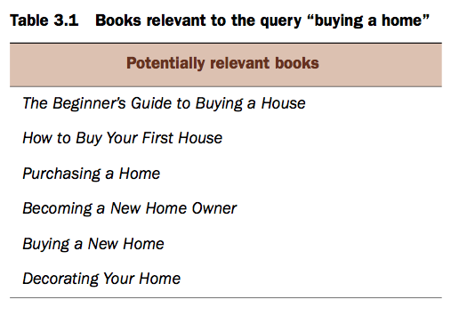

표 3.2에 나와있는 다른 모든 서적 제목은 새 주택 구입에 관심이 있는 고객과 관련이 없는 것으로 가정합니다.

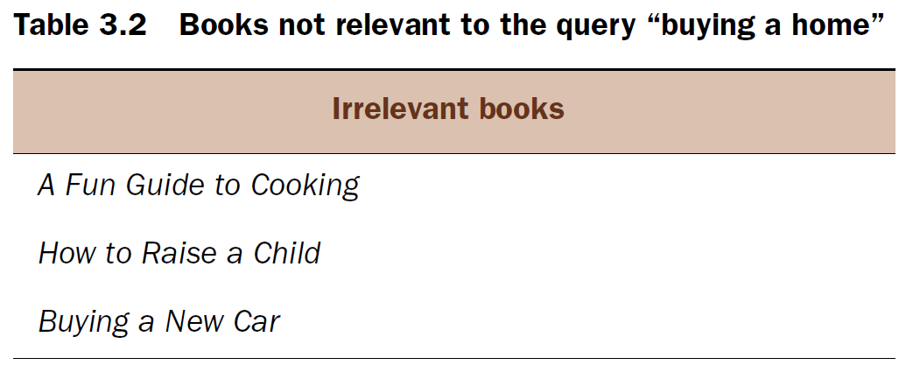

일반적인 SQL 데이터베이스를 사용하여이 검색을 구현하는 간단한 방법은 사용자가 입력하는 정확한 텍스트를 쿼리하는 것입니다.

```sql
SELECT * FROM Books
WHERE Name = 'buying a new home';
```

이 방법의 문제점은 서적 카탈로그의 서적 제목이 고객이 정확하게 입력 한 텍스트와 일치하지 않으므로 이 조회에 대한 결과를 찾을 수 없다는 것입니다. 또한 고객이 쿼리가 전체 책 제목과 정확하게 일치하는 쿼리에 대한 결과만 볼 수 있습니다.
고객의 쿼리에서 각 단어를 검색하게 하는 것이 더 나은 방법 일 수 있습니다.

```sql
SELECT * FROM Books
WHERE Name LIKE '%buying%'
AND Name LIKE '%a%'
AND Name LIKE '%home%';
```

앞의 쿼리는 기존 데이터베이스가 사용 가능한 데이터베이스 인덱스를 사용할 수 없기 때문에 처리하기가 상대적으로 성능이 좋지 않지만 표 3.3에 표시된 것처럼 고객이 원하는 단어를 모두 포함하는 결과를 반환합니다.

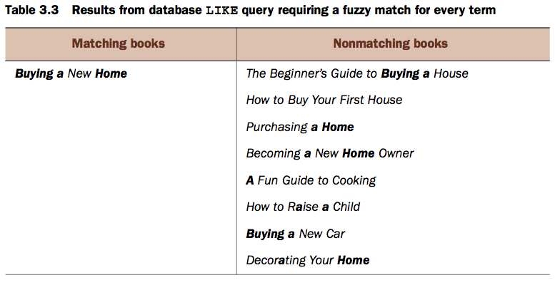

물론 고객이 검색어에 포함하는 모든 단어와 일치하도록 문서를 요구하면 지나치게 제한적이라고 생각할 수 있습니다. 다음 SQL 쿼리를 실행하여 일치하는 책 제목에 한 단어 만 존재하도록하면 검색 경험을 더욱 유연하게 만들 수 있습니다.

```sql
SELECT * FROM Books
WHERE Name LIKE '%buying%'
OR Name LIKE '%a%'
OR Name LIKE '%home%';
```

이 쿼리의 결과는 표 3.4에서 확인할 수 있습니다. 이 검색어는 일치하는 키워드 중 최소 하나만 필요하기 때문에 이 검색어는 이전 검색어보다 많은 책 제목과 일치합니다. 또한이 쿼리는 각 키워드에 부분 문자열 매칭만을 수행하기 때문에 문자 "a"가 포함 된 모든 서적 제목도 반환됩니다. 위의 예에서는 검색 조건에 사용된 모든 용어가 필요하기 때문에 문자 "a"에 매치되었지만 다른 키워드들이 더 제한적이어서 많은 결과를 반환하지는 않았습니다.

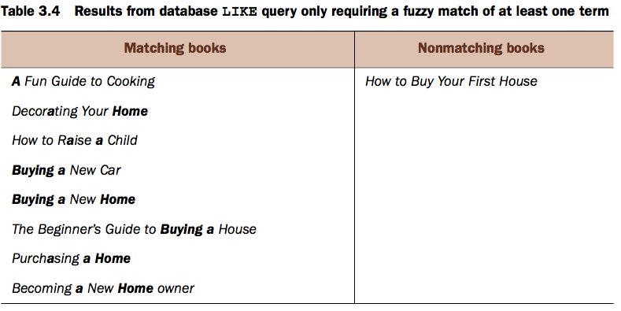

첫 번째 검색어 (모든 단어가 일치해야 함)로 인해 많은 관련 서적을 찾을 수 없었습니다. 두 번째 검색어 (일치하는 단어 중 하나만 필요함)는 더 많은 관련 서적을 찾았지만 많은 관련성 없는 서적도 발견되었습니다.
이 예제는 이 구현에서 몇 가지 어려움을 보여줍니다.

* 일부 문자열 일치만 수행하고 단어를 구분할 수 없습니다.
* "buy"와 "buying"과 같은 언어적 변이를 이해하지 못합니다.
* "buying"과 "purchasing" 또는 "home"과 "house" 같은 단어의 동의어를 이해하지 못합니다.


* "a"와 같이 중요하지 않은 단어는 예상하는 결과가 나오지 못하게합니다. (단어의 "모두"또는 "어떠한"에 일치해야하는지 여부에 따라 관련 결과를 제외하거나 관련없는 결과 포함).


* 결과에 관련성있는 정렬 순서가 없습니다. 검색어 중 하나와 일치하는 도서는 고객의 검색어에서 여러 단어 또는 모든 단어와 일치하는 책보다 자주 보여집니다.

색인을 사용하여 단어를 찾는 대신 부분 일치를 찾기 위해 검색어가 모든 책의 제목을 스캔해야하기 때문에 책 카탈로그의 크기가 커지거나 고객 쿼리 수가 늘어날수록 이러한 검색어는 느려집니다.
Solr와 같은 검색 엔진은 이러한 문제를 해결하는 데 빛을 발휘합니다. Solr는 텍스트와 유사한 단어를 확인하고, 동의어를 이해하고, "a", "the", "of"와 같은 중요하지 않은 단어를 제거하고, 얼마나 잘 수행했는지에 따라 각 결과를 채점하기 위해 콘텐츠 및 검색어에 대한 텍스트 분석을 수행 할 수 있습니다. 들어오는 쿼리와 일치하는 최상의 결과가 먼저 반환되고, 고객이 예상하지 못한 결과를 통해 페이지를 조회 할 필요가 없다는 것을 보장합니다. Solr는 전통적인 데이터베이스 모델처럼 문서를 컨텐트에 매핑하는 대신 문서에 컨텐츠를 매핑하는 인덱스를 사용하여이 모든 작업을 수행합니다. 이 역 색인은 검색 엔진의 작동 방식의 핵심입니다.

### 3.1.3 The inverted index (역 색인)

Solr은 Lucene의 역 색인 (inverse index)을 사용하여 빠른 검색 기능뿐만 아니라 쿼리 시간에 제공되는 많은 부가 기능을 제공합니다. 이 책에서는 Lucene 내부 데이터 구조에 대해서는 다루지 않지만 역 색인의 상위 구조를 이해하는 것이 중요합니다. (더 깊은 내용을 원한다면 Lucene in Action, Second Edition, Michael McCandless, Erik Hatcher, Otis Gospodnetic '[Manning, 2010]을 추천합니다.) 이전 책 검색 예제를 통해 우리는 각 용어를 각 문서에 매핑하는 색인은 표 3.5와 같습니다.

여러 문서의 전통적인 데이터베이스 표현은 문서의 모든 단어/용어를 포함하는 하나 이상의 콘텐츠 필드에 매핑 된 문서의 ID를 포함하지만 역 색인은 이를 반전하여 각 단어/용어를 포함한 모든 문서를 나타냅니다.

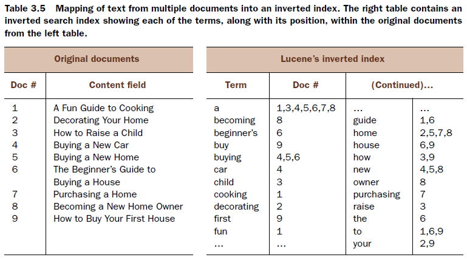

표 3.5를 보면 원래 입력 텍스트가 공백으로 나뉘어 있고 각 용어는 역 색인에 삽입되기 전에 소문자 텍스트로 변환되었지만 나머지는 모두 동일하게 유지된다는 것을 알 수 있습니다. 이러한 간단한 텍스트 변환뿐만 아니라 많은 추가 텍스트 변환이 가능하다는 점은 주목할 가치가 있습니다. 용어는 내용 분석 과정에서 수정, 추가 또는 제거 될 수 있습니다. 자세한 내용은 6 장에서 다룹니다.

역 색인에 관해서 두 가지 중요한 세부 사항을 기록해야한다.

* 색인의 모든 용어는 하나 이상의 문서에 매핑됩니다.
* 역 색인의 용어는 오름차순으로 사전 순으로 정렬됩니다.

이 역 색인의 뷰는 훌륭하게 단순화됩니다. 3.1.6 절에서 Solr의 쿼리 및 채점 기능을 향상시키기 위해 추가 정보를 색인에 저장할 수 있음을 알게 될 것입니다.
다음 섹션에서 볼 수 있듯이 Lucene의 역 색인 구조는 키워드 기반 검색의 속도와 유연성을 최대화하는 많은 강력한 쿼리 기능을 제공합니다.


### 3.1.4 Terms, phrases, and Boolean logic (용어, 구문 및 Boolean logic)

Lucene의 역 색인에서 내용이 어떻게 보이는지 살펴 보았으므로, 이제 이 색인을 사용하여 일치하는 문서를 찾는 방법에 대해 설명할 것입니다. 이 섹션에서는 역 검색 색인에서 용어와 구문을 검색하고 boolean logic 및 퍼지 쿼리를 사용하여 이러한 조회 기능을 향상시키는 기본 사항을 살펴 보겠습니다. 책 검색 예제로 돌아가서 그림 3.2에서 묘사 된 것처럼 새 집에 대한 간단한 쿼리를 살펴 보겠습니다.


지난 섹션에서 Lucene 색인에 삽입 할 때 컨텐트 필드의 모든 텍스트가 개별 용어로 분리되어 있음을 확인했습니다. 입력된 쿼리에 대해 인덱스를 쿼리하는 몇 가지 옵션 중에서 선택해야 합니다.
■ new와 house라는 서로 다른 두가지 용어 모두에 일치하는 것을 검색합니다.
■ new와 house라는 서로 다른 두가지 용어  중 하나만 일치해도 검색합니다.
■ 정확한 구문 "new house"를 검색합니다.
이러한 모든 옵션은 사용 사례에 따라 완벽하게 유효한 접근 방식이며 Lucene을 사용하여 작성된 Solr의 강력한 쿼리 기능 덕분에 Boolean logic을 사용하여 쉽게 수행 할 수 있습니다.


#### 필수 조건

첫 번째 옵션을 검토하여 쿼리를 여러 용어로 분리하고 모두 일치하도록 요구하십시오. Solr의 기본 쿼리 구문 분석기를 사용하여 이 쿼리를 작성하는 두 가지 방법이 있습니다.

* +new +house


* new AND house

이 두 요소는 논리적으로 동일하며 두 번째 예제의 경우 내부적으로 구문 분석되어서 궁극적으로 첫 번째 예제의 형태로 축소됩니다. + 기호는 단항 연산자로, 바로 뒤에 오는 쿼리 부분이 일치하는 모든 문서에 존재해야한다는 것을 의미합니다. AND 키워드는 바로 앞의 쿼리 부분과 바로 뒤의 쿼리 부분이 모두 필요하다는 것을 의미하는 이항 연산자입니다.


#### 선택 조항

Solr는 AND 연산자뿐만 아니라  OR 바이너리 연산자도 지원합니다. 즉, 이전 쿼리 부분 또는 다음 쿼리 부분이 일치하는 모든 문서에 존재해야합니다. 기본적으로 Solr은 명백한 연산자 없이 선택적 매개 변수로 쿼리의 모든 부분을 처리하도록 구성되어 다음과 동일하게 만듭니다.

* new house
* new OR house


#### 관련 조항

쿼리의 일부를 선택적 또는 필수로 만드는 것 외에 다음과 같이 쿼리 중 하나를 일치하는 문서에 존재하지 않도록 요구할 수도 있습니다.

* new house -rental
* new house NOT rental

이 쿼리에서는 rental이라는 단어가 포함 된 문서는 반환되지 않으며 new 또는 house와 일치하는 문서만 반환됩니다.


```
Solr의 기본 연산자

Solr의 기본 구성은 용어나 구(phrase) 자체가 선택적 용어라고 가정하지만 Solr의 많은 쿼리 처리기와 함께 q.op URL 매개 변수를 사용하여 쿼리 단위로 구성 할 수 있습니다.

/select/?q=new house&q.op=OR versus /select?q=new house&q.op=AND

기본 연산자를 OR에서 AND로 변경하면 명시적인 부울 연산자없이 지정된 모든 조건을 요구하는 것으로 전환됩니다. 기본 연산자가 new house 쿼리에 대한 OR이면 조건 중 하나만을 필요로 합니다. 기본 연산자가 동일한 쿼리에 대해 AND 인 경우 new 및 house라는 용어가 모두 필요합니다. 새로운 연산자 (예 : new AND home 또는 new OR home) 사이의 연산자를 명시 적으로 지정하여 기본 연산자를 재정의 할 수도 있습니다.
```


#### PHRASES

Solr는 단일 용어 검색만을 지원하지는 않습니다. 여러 단어가 순서대로 함께 표시되도록 문구를 검색 할 수도 있습니다.
■ "new home" 또는 "new house"
■ "3 bedrooms" AND "walk in closet" AND "granite countertops"


#### 그룹화 된 표현

이전 쿼리 식 외에도 Solr가 지원하는 마지막 Boolean 기본 구문 중 하나는 용어, 구 및 기타 쿼리 식을 그룹화하는 것입니다. Solr 쿼리 구문은 다음 예제와 같이 괄호를 사용하여 그룹화 용어를 통해 임의로 복잡한 쿼리를 나타낼 수 있습니다.
■ new AND (home OR  (home NOT improvement NOT depot NOT grown))
■ (+(buying purchasing -renting) +(home house residence –(+property -bedroom)))
필수 용어, 선택적 용어, 부정 용어 및 그룹화 된 표현식을 사용하면 강력하고 유연한 쿼리 기능 세트를 제공하므로 검색 색인에 대해 임의로 복잡한 조회 작업을 수행 할 수 있습니다 (다음 섹션에서 설명 할 예정).


### 3.1.5 Finding sets of documents (문서 세트 찾기)

용어, 구문 및 부울 쿼리에 대한 기본적인 이해를 바탕으로 Solr이 일치하는 문서를 찾기 위해 내부 Lucene 역 색인을 사용할 수있는 방법을 정확히 알 수 있습니다. 표 3.5에서 책의 색인을 불러오고 그 일부는 표 3.6에 나와 있습니다.

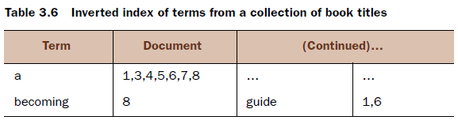

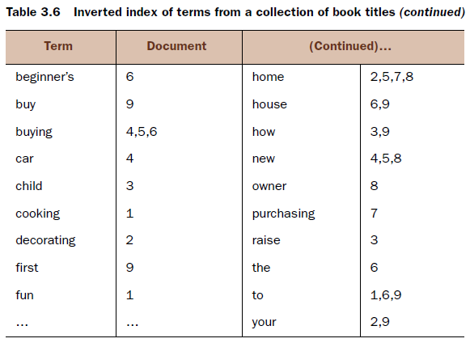


고객이 new home의 쿼리를 전달하면 Solr는 얼마나 정확하게 역 인덱스에서 해당 쿼리와 일치하는 문서를 찾을 수 있을까요?
new home에 대한 결과는 2개의 용어 쿼리입니다 (new와 home 사이에 기본 연산자가 있음을 기억하십시오.). 따라서 Lucene 색인에서 두 용어를 따로 찾아야합니다.

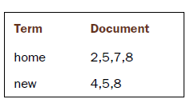

일치하는 문서 목록이 각 용어에 대해 발견되면 Lucene은 집합 연산을 수행하여 쿼리와 일치하는 적절한 최종 결과 집합을 도출합니다. 기본 연산자가 OR 라면 이 쿼리는 그림 3.3의 벤다이어그램과 같이 두 용어에 대한 결과 집합을 합친 결과가 됩니다.
마찬가지로 쿼리가 new AND home이라면 기본 연산자가 AND로 설정된 경우 두 용어에 대한 결과의 교집합은 그림 3.4와 같이 document 5와 document 8의 결과 집합을 반환하도록 계산됩니다.

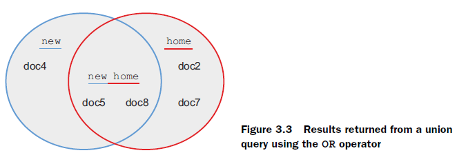

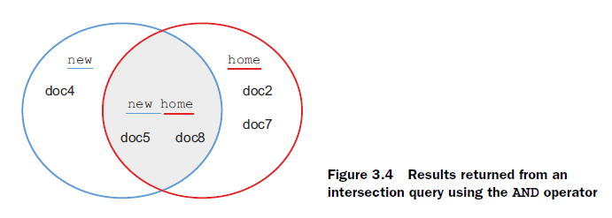

조합 및 교차 쿼리 외에도 특정 용어를 무효화하는 것이 일반적입니다. 그림 3.5는 두개의 용어 검색 쿼리의 많은 결과 집합 치환 (기본적으로 OR 연산자라고 가정)에 대해 예상되는 결과의 분석을 보여줍니다.
보시다시피 필요한 용어, 선택적 용어, 제외 용어 및 그룹화 된 용어를 검색하는 기능은 단일 키워드를 찾는 강력한 메커니즘을 제공합니다. 다음 섹션에서 볼 수 있듯이 Solr은 다수 용어 구문(jultiterm phrases)을 쿼리하는 기능도 제공합니다.

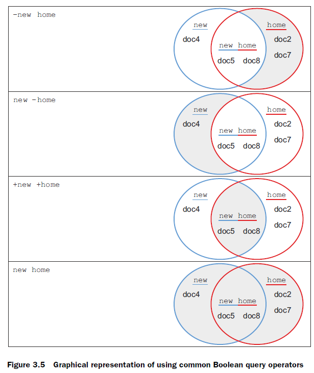


### 3.1.6 Phrase queries and term positions (구문 쿼리 및 용어 위치)

우리는 앞서 Lucene 인덱스의 용어를 쿼리하는 것 외에도 Solr에 구문을 쿼리 할 수 있음을 알았습니다. 그러나 색인에 개별 용어만 들어 있음을 상기하면 전체 구문을 검색하는 방법이 궁금 할 것입니다.
간단히 말해서 구문 쿼리의 각 용어는 Lucene 색인에서 개별적으로 조회됩니다. 쿼리 new home이 "new home"대신 제출 된 것처럼 말입니다. 그러나 겹치는 문서 세트가 발견되면 초기 역 색인 구성에서 제외했던 색인의 기능이 사용됩니다. 용어 위치라는 이 기능은 문서 내의 용어의 상대적 위치를 선택적으로 기록한 것입니다. 표 3.7은 문서 (표 왼쪽에 있음)가 용어 위치가 포함 된 역 색인으로 (표의 오른쪽에) 어떻게 매핑되는지 보여줍니다.

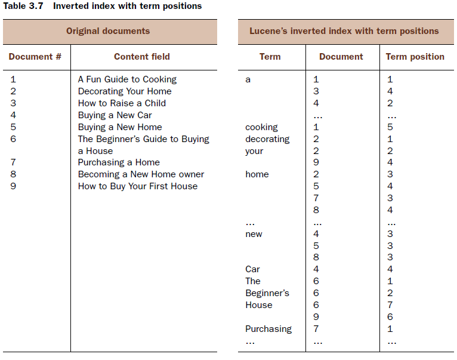

표 3.7의 역 색인에서 new AND home에 대한 쿼리가 문서 5와 8을 포함하는 결과를 산출한다는 것을 알 수 있습니다. 용어 위치는 한 단계 더 나아가서 각 용어가 나타나는 문서의 위치를 알려줍니다. 표 3.8은 토론중인 기본 용어의 교차점에만 초점을 맞춘 역 색인의 압축 된 버전을 보여줍니다 :

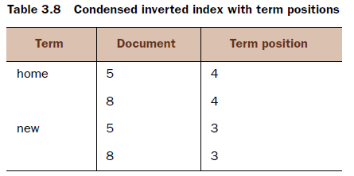

이 예에서 new는 3 위를 차지하고 home이라는 용어는 일치하는 두 문서에서 4 위를 차지합니다. 책 제목은 새 집(New Home)을 사서 새 집 소유자(New Home Owner)가되는 것이므로 이것은 의미가 있습니다. 일치 된 용어가 서로의 한 위치에 표시되도록함으로써 Solr은 해당 용어가 원본 문서에 구문을 형성하도록 할 수 있습니다. 이제 용어 위치의 힘을 보았습니다. 그들은 각각의 문서 내에서 색인 된 용어의 원래 위치를 재구성 할 수 있으므로 쿼리 시간에 특정 구문을 검색 할 수 있습니다.
특정 구문을 검색하는 것이 용어 순위에 의해 제공되는 유일한 이점은 아닙니다. 다음 섹션에서는 검색 결과의 품질을 향상시키는 데 사용  된 또 다른 훌륭한 예를 살펴볼 것입니다.


### 3.1.7 Fuzzy matching (퍼지 매칭)

주어진 검색에 대해 Solr 인덱스에서 무엇이 발견 될지 항상 정확히 알 수 있는 것은 아니기 때문에 Solr는 여러 유형의 fuzzymatching 쿼리를 수행 할 수있는 기능을 제공합니다. 유사 항목 일치는 검색 색인의 검색어에 대해 일치하지 않는 항목을 수행 할 수있는 기능으로 정의됩니다. 예를 들어 특정 접두사로 시작하는 단어 (와일드 카드 검색), 한두 문자 이내의 철자 변형 (퍼지 검색 또는 거리 검색 편집)을 원할 수 있거나 서로의 최대 거리 내에서 두 용어를 일치시킵니다 (근접 검색이라고 함). 쿼리되는 용어나 구문의 여러 변형이 검색 대상 문서 전체에 존재할 수있는 사용 사례의 경우 이러한 퍼지 매칭 기능이 강력한 도구로 사용됩니다.

이 섹션에서는 와일드 카드 검색, 범위 검색, 편집 거리 검색 및 근접 검색을 포함하여 Solr의 여러 퍼지 일치 쿼리 기능을 살펴 봅니다.


#### 와일드 카드 검색

Solr에서 퍼지 매칭의 가장 일반적인 형태 중 하나는 와일드 카드를 사용하는 것입니다. offic이라는 단어로 시작하는 문서를 찾고 싶다고 가정 해보십시오. 이를 수행하는 한 가지 방법은 가능한 모든 변형을 나열하는 쿼리를 만드는 것입니다.

* Query : office OR officer OR official OR officiate OR ...

  이 단어 목록을 검색어 앞에 표시하도록하면 고객 또는 고객을 대표하는 당신에게까지도 비합리적일 것입니다.

일치시킬 수 있는 모든 변형이 Solr 색인에 이미 존재하므로 별표 (*) 와일드 카드 문자를 사용하여 이와 동일한 기능을 수행 할 수 있습니다.

* Query : offi *는 office, officer, official 등과 일치합니다.

용어의 끝을 일치시키는 것 외에도 와일드 카드 문자는 officer과 offer 모두를 일치시키려는 경우와 같이 검색어의 내부에서도 사용할 수 있습니다.

* Query : off*r는 offer, officer, officiator 등과 일치합니다.

별표 와일드 카드 (*)는 용어에서 0 개 이상의 문자와 일치합니다. 단일 문자만 일치 시키기위한 목적으로 물음표 (?)를 사용할 수도 있습니다.

* Query : off?r는 offer에는 매치 되지만 officer에는 매치되지 않습니다.


```
주요 와일드 카드
Solr의 와일드 카드 기능은 상당히 강력하지만 특정 와일드 카드 쿼리를 실행하는 데 비용이 많이 듭니다. 와일드 카드 검색을 실행할 때마다 첫 번째 와일드 카드 이전 용어의 일부와 일치하는 역 색인의 용어를 모두 찾아야합니다. 그런 다음 해당 후보 단어 각각을 검사하여 쿼리에서 와일드 카드 패턴과 일치하는지 확인해야합니다. 이 때문에 와일드 카드 전에 용어의 시작 부분에 더 많은 문자를 지정할수록 쿼리가 더 빨리 실행됩니다. 예를 들어, the query engineer*는 쿼리 비용이 크지 않을 것입니다 (역 색인에서 용어가 거의 일치하지 않기 때문에). 그러나 e*는 문자 e로 시작하는 모든 용어와 매치를 수행하므로 비용이 많이 들게 됩니다.
이처럼 와일드 카드 쿼리를 실행하는 것은 비용이 많이 드는 작업입니다. 예를 모든 용어의 끝에 ing를 매치시키려 한다면(예 : like caring, liking, and smiling) 이는 주요 성능 문제를 일으킬 수 있습니다.
- Query : *ing
이러한 주요 와일드 카드를 사용하여 검색 할 수 있어야하는 경우 더 빠른 솔루션이 있지만 추가 구성이 필요합니다. 이 솔루션은 필드 유형의 분석 체인에 ReversedWildcardFilterFactory를 추가하여 구현됩니다 (텍스트 처리 구성에 대해서는 6장에서 설명합니다). ReversedWildcardFilterFactory는 색인 된 내용을 Solr 색인에 두 번 삽입하여 작동합니다 (각 용어의 텍스트에 한번, 각 용어의 역 텍스트에 한번).
- Index: caring  liking  smiling
         #gnirac #gnikil #gnilims
*ing를 주요 와일드 카드를 사용하여 쿼리를 실행하면 Solr는 와일드 카드 검색과 관련된 성능 문제를 해결하기 위해 역전 된 버전을 검색하여 역순으로 된 내용의 표준 와일드 카드 검색으로 바꾸어줍니다.
그러나 이 기능을 켜면 Solr 색인의 모든 용어를 이중으로 색인화해야하므로 색인 크기가 커지고 전체 검색 속도가 느려집니다. 이 기능을 사용하도록 설정하면 검색 응용 프로그램 내에서 필요하지 않은 이상 권장되지 않습니다.
```

와일드 카드 검색에 대해 주의해야 할 마지막 중요한 점은 와일드 카드가 구문 검색이 아닌 개별 검색 용어에 대해서만 작동한다는 것입니다. 예를 들면 다음과 같습니다.

* 정상 실행: softwar* eng?neering
* 실행되지 않음: "softwar* eng?neering"

구문 내에서 와일드 카드 검색이 필요한 경우 색인에 전체 구문을 단일 용어(6장 끝까지 자유자재로 사용할 수 있어야함.)로 저장해야합니다.


#### 범위 검색

Solr는 알려진 값 사이에 있는 용어를 검색하는 기능도 제공합니다. 범위 내에 속하는 특정 문서의 하위 집합을 검색하려는 경우 유용 할 수 있습니다. 예를 들어 2012 년 2 월 2 일부터 2012 년 8 월 2 일까지 6 개월 동안 작성된 문서 만 검색하려면 다음과 같이 검색을 수행 할 수 있습니다.

* Query: created:[2012-02-01T00:00.0Z TO 2012-08-02T00:00.0Z]

이 범위 쿼리 형식은 다른 필드 유형에서도 작동합니다:

* Query: yearsOld:[18 TO 21] 는 18, 19, 20, 21과 매치됩니다.
* Query: title:[boat TO boulder] 는 boat, boil, book, boulder 등과 매치됩니다.
* Query: price:[12.99 TO 14.99] 는 12.99, 13.000009, 14.99 등과 매치됩니다.

이러한 범위 쿼리 각각은 "포괄적 인"범위 구문 인 대괄호로 범위를 둘러 쌉니다. Solr는 또한 중괄호를 사용하여 배타적 인 범위 검색을 지원합니다.

* Query: yearsOld:{18 TO 21} 는 19와 20에 매치되지만 18과 21은 매치되지 않습니다.

구문이 이상하게 들릴 수도 있지만, Solr은 포괄적 인 영역과 배타적 인 영역을 혼합하고 일치시키는 기능을 제공합니다.

* Query: yearsOld:[18 TO 21} 는 18, 19, 20과 매치되지만 21에는 매치되지 않습니다.

범위 검색은 단일 용어 검색보다 느리게 수행되지만 Solr 색인 내의 특정 범위 내에있는 동적으로 정의 된 값 그룹과 일치하는 문서를 찾기 위해 엄청난 유연성을 제공합니다. 범위 쿼리에 대한 용어의 순서는 Solr 인덱스에서 발견되는 순서 (사전 적으로 정렬 된 순서)임에 유의해야합니다. 정수가 들어있는 텍스트 필드를 만들려면 1, 11, 111, 12, 120, 13 등의 순서로 해당 정수를 찾을 수 있습니다. Solr의 숫자 형 (다음 장에서 다룰 내용)은 들어오는 내용을 특별한 방법으로 색인화하여 이를 보완하지만, Solr 색인 내의 정렬 순서는 데이터의 형식에 따라 달라진다는 것을 이해하는 것이 중요합니다. Solr 인덱스에 기록 될 때 필드 내의 값이 처리됩니다. 5 장과 6 장에서 이러한 종류의 내용 분석에 대해 더 깊이있게 알아볼 것입니다.


#### FUZZY / EDIT-DISTANCE 검색

많은 검색 응용 프로그램에서 정확하게 고객의 텍스트를 일치시키는 것뿐만 아니라 맞춤법 오류나 올바른 맞춤법이 되도록 약간의 변형을 처리 할 수있는 유연성을 제공하는 것이 중요합니다. Solr은 Damerau-Levenshtein 거리를 기반으로 한 편집 거리 측정 기능을 사용하여 문자 변형을 처리 할 수있는 능력을 제공합니다. 이 거리는 대부분의 사람들의 맞춤법 오류 중 80 % 이상을 차지합니다.
Solr는 물결표 (~) 문자를 사용하여 다음과 같이 퍼지 편집 거리 검색을 수행합니다.

* Query: administrator~ Matches: adminstrator, administrater, administratior, and so forth

이 쿼리는 원래 용어 (administartor)와 원래 용어의 두 편집 거리 내의 다른 용어 모두를 일치시킵니다. 편집 거리는 삽입, 삭제, 대체 또는 문자의 조옮김으로 정의됩니다. adminstrator라는 용어 (여섯 번째 위치에서 "i"가 빠짐)는 한 문자 삭제가 있으므로 관리자와의 편집 거리 하나입니다. 마찬가지로 sadministrator는 하나의 삽입 ( "s"가 앞에 붙임)을 가지고 있기 때문에 하나의 편집 거리가 될 것이며, administrationatro라는 용어는 마지막 두 문자 가 뒤바뀌었습니다.( "or"가 " ro "로 됨)
편집 거리 검색의 엄격 성을 수정하여 검색어를 모든 편집 거리와 일치시킬 수도 있습니다.

* Query : administrator ~ 1, 하나의 편집 거리 내에서 일치합니다.


* Query : administrator ~ 2, 두 편집 거리 내에서 일치합니다. (편집 거리가 제공되지 않는 경우 기본값).
* Query : administrator ~ N, N 편집 거리 내에서 일치합니다.

거리에 대한 편집을 2번 이상 요청하면 점점 더 느려지고 예기치 않은 조건과 매칭될 확률이 높아집니다. 하나 또는 두 개의 편집 거리를 가진 용어 검색은 효율적인 Levenshtein 자동 장치를 사용하여 수행되지만 편집 거리가 두 배 이상인 경우 느린 편집 거리 구현으로 변경됩니다.


#### 근원 검색(PROXIMITY SEARCHING)

이전 섹션에서 편집 거리는 원래 용어와 비슷하지만 완전히 동일하지 않은 용어를 찾는 데 사용될 수 있음을 알았습니다. 이 편집 거리 원리는 용어 내에서 대체 문자를 검색하는 것 이외에도 적용 할 수 있고, 구문 변이에 대한 용어간에도 적용 할 수도 있습니다.
회사 내 임원을 위해 Solr 색인으로 직원 프로필을 검색하려고 한다고 가정 해 봅시다. 이를 수행하는 한 가지 방법은 회사 내에서 가능한 모든 임원 직책을 열거하는 것입니다.

* Query: "chief executive officer" OR "chief financial officer" OR "chief marketing officer" OR "chief technology officer" OR …

물론, 이것은 모든 제목을 알고 있다는 가정하에 가능합니다. 익숙하지 않은 다른 회사를 검색하거나 더 복잡한 사용 사례가있는 경우 비현실적 일 수 있습니다. 또 다른 가능한 전략은 각 용어를 독립적으로 검색하는 것입니다.

* Query: chief AND officer

이것은 가능한 모든 유스 케이스와 일치해야 하지만 문서의 어느 곳에서나 두 단어가 모두 들어있는 문서와도 일치합니다. 문제가 되는 한 가지 예는 이 텍스트를 포함하는 문서입니다. 이 사건에서 가장 큰 우려 사항은 근무중인 경찰관의 안전이었습니다.(One chief concern arising from the incident was the safety of the police officer on duty.) 이 문서는 우리의 유스 케이스에 대해 명백히 잘못된 것은 아니지만 위의 쿼리에서 이와 유사한 좋지않은 결과가 리턴 될 것입니다.
다행히 Solr는 이 문제에 대한 기본적인 해결책을 제공합니다 : proximity searching. 앞의 예에서, 좋은 전략은 Solr에게 임원 인근의 임원이 포함 된 모든 문서를 반환하도록 요청하는 것입니다. 이는 다음과 같은 예제 쿼리를 통해 수행 할 수 있습니다.

* Query: "chief officer"~1
  * Meaning: chief와 officer는 최대 한자리는 떨어져 있어야 합니다.
  * Examples: "chief executive officer", "chief financial officer"
* Query: "chief officer"~2
  * Meaning: chief와 officer 최대 두 편집 거리가 되어야 합니다.
  * Examples: "chief business development officer", "officer chief"
* Query: "chief officer"~N
  * Meaning: officer의 N 위치에서 chief를 찾습니다.

앞서 본 근접 검색은 전통적인 구문 검색의 "엉성한"버전으로 볼 수 있습니다. 사실, "chief development officer"에 대한 정확한 구문 검색은 "chief development officer"~ 0으로 쉽게 재 작성 될 수 있습니다. 이러한 검색어는 동일한 결과를 산출합니다. 편집 거리가 0이면 정확한 구문 검색을 정의하기 때문입니다. 두 메커니즘은 편집 거리를 계산하기 위해 Solr 색인에 저장된 위치 (3.1.6에서 논의한)라는 용어를 사용합니다. 또한 Solr의 근접 검색은 지정된 모든 용어가 필요하기 때문에 편집 거리를 실제로 사용하는 것이 아니라 대체 및 삭제를 허용한다는 점에 유의해야합니다 (단일 용어에 대해 퍼지 검색에서 보았 듯이) .

그러나 편집 거리의 일반적인 원칙은 용어 삽입 및 전치와 관련하여 용어 근접 검색어에도 적용됩니다. 이 줄을 따라 officer chief 텍스트와 일치시키기 위해 2( "chief officer"~ 2)를 지정해야한다는 것을 알게되었을 것입니다. 이는 첫번째 편집은 checf와 officer의 용어를 동일한 위치로 이동시키기 위함이고, 두번째 편집은 chef에게 오기 위해 한 번 더 위치를 옮기는 것입니다. 이것은 근접 검색이 실제 편집 거리(대체가 하나의 편집으로만 계산 될 수있는 경우)를 사용하지 않는다는 사실을 다시 한번 강조하는 대신 다음 질문을 해본다.  "근접 검색에 지정된 정확한 구문을 형성하기 위해 문서의 텍스트에 몇 개의 위치를 집합적으로 추가 할 수 있습니까? "


### 3.1.8 Quick recap (빠른 요약)

이 시점에서 Solr가 역 인덱스에 정보를 저장하는 방법에 대한 기본적인 이해가 필요하며 해당 인덱스를 쿼리하여 일치하는 문서를 찾습니다. 여기에는 용어 검색, Boolean logic을 사용하여 임의로 복잡한 쿼리 작성, 용어 조회 각각을 사용하는 집합 연산의 결과 가져 오기가 포함됩니다. 우리는 또한 Solr가 용어 위치를 저장하는 방법에 대해 알아보았고, 근접 쿼리와 위치 계산을 사용하여 정확한 구문과 퍼지 구문 검색을 찾기 위해 Solr가 위치를 사용하는 방법을 설명했습니다. 단일 용어 내에서 퍼지 검색을 수행하기 위해서는 와일드 카드 및 편집 거리 검색을 사용하여 철자 오류나 유사한 단어를 찾습니다. Solr의 쿼리 기능은 7 장에서 더 알아볼 것이지만 이러한 주요 작업은 대부분의 Solr 쿼리를 생성하기 위한 기초 역할을 합니다.  다음 섹션에서는 Solr의 키워드 관련성 점수 모델에 대해 알아보기 위해 필요한 배경 지식을 제공할 것입니다.


## 3.2 Relevancy (관련성)

일치하는 문서를 찾는 것이 훌륭한 검색 경험을 창출하는 첫 번째 중요한 단계이지만 이는 단지 첫 번째 단계 일뿐입니다. 대부분의 고객은 원하는 문서를 찾기 위해 검색 결과 페이지에서 다음 페이지로 이동하지 않습니다. 일반적인 경험에서 볼 때 고객의 10 %만이 대부분의 웹 사이트에서 특정 검색결과 페이지에서 다음 페이지로 이동할 의사가 있으며 1%만이 그 다음 페이지로 이동하려고 합니다.
Solr는 검색 결과의 순서가 결과 목록의 상단에서 최상의 결과를 가져온다는 것을 확실히하는 흘륭한 작업을 수행합니다. 각 문서에 대한 관련도 점수를 계산한 다음 검색 결과를 가장 높은 점수에서 가장 낮은 점수로 정렬하여이를 수행합니다. 이 섹션에서는 이러한 관련성 점수를 계산하는 방법과 해당 요인에 영향을 주는 요소에 대한 개요를 제공합니다. 우리는 Solr를 사용하는데 파악하기 어려운 측면인 Solr의 기본 관련성 계산의 이론과 관련성 점수를 계산하는 데 사용되는 특정 계산을 파헤쳐서 직관적인 예제를 제공하여 이 섹션에서 더 많은 것을 이해하도록 합니다. 먼저 쿼리의 관련성 점수 계산의 대부분을 담당하는 Similarity 클래스에 대해 알아보겠습니다.


### 3.2.1 Default similarity (기본 유사성)

Solr의 관련성 점수는 Similarity 클래스를 기반으로합니다. 이 클래스는 Solr의 schema.xml (5 장 참조)에서 필드별로 정의 할 수 있습니다. Similarity는 쿼리의 결과를 기반으로 관련성 점수가 계산되는 방식을 정의하는 Java 클래스입니다. 여러 Similarity 클래스 중 하나를 선택하거나 직접 작성할 수도 있지만 Solr의 기본 Similarity 구현과 이것이 왜 그렇게 잘 작동하는지에 대한 이론을 이해하는 것이 중요합니다.

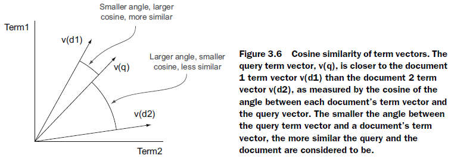

기본적으로 Solr은 Lucene (적절히 명명 된) DefaultSimilarity 클래스를 사용합니다. 이 클래스는 two-pass 모델을 사용하여 유사성을 계산합니다. 첫째, Boolean 모델 (3.1 절에서 설명)을 사용하여 고객의 쿼리와 일치하지 않는 문서를 필터링합니다. 그런 다음 쿼리를 벡터로 채점하고 그리는 벡터 공간 모델과 각 문서에 대한 추가 벡터를 사용합니다. 각 문서의 유사도 점수는 쿼리 벡터와 해당 문서의 벡터 사이의 코사인을 기반으로합니다 (그림 3.6 참조).

이 벡터 공간 채점 모델에서 용어 벡터는 각 문서에 대해 계산되고 쿼리에 대한 해당 용어 벡터와 비교됩니다. 두 벡터의 유사성은 그 사이의 코사인을 계산하여 찾을 수 있습니다. 1의 코사인은 완벽한 일치이고 0의 코사인은 유사성을 나타내지 않습니다. 보다 직관적으로, 그림 3.6에서와 같이 두 벡터가 서로 더 가까울수록 더 유사합니다. 벡터 사이의 각도가 작거나 코사인이 클수록 더 가깝습니다.

물론 이 전체 프로세스에서 가장 어려운 부분은 쿼리의 주요 기능과 각 문서의 비교 기능을 나타내는 합리적인 벡터로의 구성입니다. DefaultSimilarity 클래스의 전체적이고 복잡한 관련성 공식을 살펴 보겠습니다. 그런 다음 관련성 공식의 각 구성 요소가 수행하려고 시도하는 내용을 직관적으로 설명하기 위해 한줄 한줄 살펴 보겠습니다.

쿼리 (q)와 문서 (d)가 주어지면 그림 3.7과 같이 쿼리에 대한 문서의 유사도 점수를 계산할 수 있습니다.
와우! 이 방정식은 특히 언뜻보기에는 상당히 압도적입니다. 다행히도, 각 부분별로 분할하여 분석 할 때 훨씬 더 직관적입니다. 수학은 참고 자료로 제공되지만 검색 응용 프로그램의 Similarity 클래스를 overwrite 하지 않는 한 전체 방정식을 파고 들지 않아도 됩니다.

관련성 계산의 중요한 개념은 용어 빈도 (tf), 역 문서 빈도 (idf), 용어 강조 (t.getBoost), 필드 정규화 (norm), 조정 (cof)과 같은 그림 3.7에 표시된 상위 수준 수식의 조각으로 설명됩니다. 요인 (coord) 및 쿼리 정규화 (queryNorm)가 있습니다. 이들 각각의 목적을 살펴 봅시다.

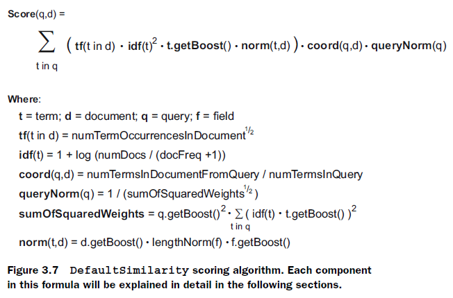


### 3.2.2 Term frequency (용어 빈도)

용어 빈도 (tf)는 특정 용어가 일치하는 문서에 나타나는 빈도를 나타내는 척도이며, 문서가 용어와 얼마나 잘 일치 하는지를 나타냅니다.
미국 대통령에 관한 기사를 신문 기사로 가득 채운 검색 색인을 검색하는 경우, 한 번만 대통령을 언급하는 기사를 찾는 것과 기사 전체에서 대통령을 지속적으로 거론하는 기사를 찾는 것 중 어떤것이 원하십니까? 기사에 대통령과 미국이 한 번씩 문맥을 포함하는 경우 (문맥에서 벗어남) 이 문구가 여러 번 포함 된 기사와 관련이 있다고 생각해야할까요?
표 3.9에서 논의 된 두 번째 기사가 첫 번째 기사보다 분명하고 두 번째 기사의 내용이이 쿼리와 더 밀접하게 관련되어 있음을 강력하게 나타냅니다.

**표 3.9 대통령과 미국을 언급 한 문서**

| 기사 1 (관령성 없음)                            | 기사 2 (관련성 높음)                            |
| ---------------------------------------- | ---------------------------------------- |
| Dr. Kohrt is the interim president of Furman University, one of the top liberal arts universities in the southern United States. In 2011, Furman was ranked the 2nd most rigorous college in the country by Newsweek magazine, behind St. John’s College (NM). Furman also consistently ranks among the most beautiful campuses to visit and ranks among the top 50 liberal arts colleges nation-wide each year. | Today, international leaders met with the President of the United States to discuss options for dealing with growing instability in global financial markets. President Obama indicated that the United States is cautiously optimistic about the potential for significant improvements in several struggling world economies pending the results of upcoming elections. The President indicated that the United States will take whatever actions necessary to promote continued stability in the global financial markets. |

일반적으로 주제가 여러 번 나타나는 경우 특정 주제 (또는 검색어)와 더 관련이있는 것으로 간주됩니다.
이것은 기본 Solr 관련 수식의 tf 구성 요소 뒤에 있는 기본 전제입니다. 검색 용어가 문서 내에 나타날수록 문서의 관련성이 높아집니다. 그러나 용어가 10 번 나오면 문서가 10배 더 관련성이 높아지는 것은 아니기 때문에 추가 용어를 줄이기 위해 tf는 검색 용어가 문서 내에 나타나는 횟수의 제곱근을 사용하여 계산되어 검색 용어의 각 후속 출현에 대한 관련성 점수에 대한 추가 공헌도를 줄입니다.


### 3.2.3 Inverse document frequency (역 문서 빈도)

모든 검색어가 동등하게 생성되는 것은 아닙니다. 누군가가 The Cat in the Hat by Dr.Seuss에 대한 라이브러리 카탈로그를 검색하는 경우를 상상해보십시오. 반환되는 최고의 결과는 cat과 hat 대신 단어의 빈도가 높은 단어를 포함하는 결과입니다. 상식은 모든 문서에서 더 드문 단어가 검색어보다 더 일반적 일 수 있음을 나타냅니다.

검색 빈도가 얼마나되는지에 대한 척도인 역 문서 빈도 (idf)는 문서 빈도 (검색 용어가 나타나는 총 문서 수)와 그 역수를 계산하여 산출됩니다. (계산을 위한 그림 3.7의 공식을 확인하십시오).
idf는 쿼리와 문서에서 용어로 사용되므로 관련성 공식에서 제곱됩니다.
그림 3.8은 The Cat in the Hat 제목에 있는 각 단어의 "경함"에 대한 시각적 인 예를 보여줍니다.  (라이브러리 서적의 일반적인 모음과 관련이 있음).

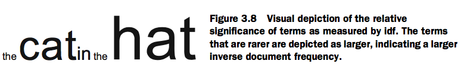

마찬가지로 대규모 이력서 수집을 통해 경험있는 Solr 개발 팀의 프로필을 검색하는 사람이 있으면 an이나 team 또는 경험자와 가장 잘 일치하는 문서 순위를 기대하지 않습니다. 대신 중요한 용어가 그림 3.9에서 가장 큰 용어와 닮아 있다고 기대할 수 있습니다.
분명히 사용자는 Solr을 알고 팀 리더가 될 수있는 사람을 찾고 있기 때문에 이러한 용어는 어떤 문서에서나 발견 될 때 상당히 두드러집니다.

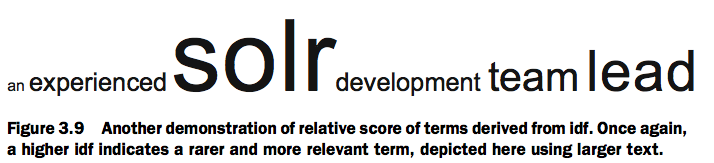

관련성 계산에서 용어 빈도와 역 문서 빈도가 함께 곱해질 때 좋은 균형을 제공합니다. 빈도라는 용어는 문서 내에서 여러 번 나타나는 용어를 의미하는 반면, 역 문서 빈도는 여러 문서에 공통적으로 나타나는 용어에 패널티를 줍니다. 따라서, the, an과 같은 영어에서 일반적인 단어들은 특정 문서에서 여러 번 나타날 수 있지만 궁극적으로 낮은 점수를 산출합니다.


### 3.2.4 Boosting (부스팅)

관련성 계산의 모든 측면을 Solr에 남겨 둘 필요는 없습니다. 콘텐츠에 대한 도메인 지식이 있는 경우 특정 분야나 용어가 다른 분야보다 더 중요한지 아닌지를 알고있는 경우 인덱싱 시간 또는 쿼리 시간에 부스트를 제공하여 해당 필드나 용어의 가중치가 적절하게 조정되도록 할 수 있습니다 .
부스트의 형태를 이해하는 가장 유연하고 쉬운 Query-time 부스팅은 다음 문법을 사용합니다 :

- Query: title:(solrinaction)^2.5description:(solrinaction)

이 예제는 title 필드의 검색 구문에 2.5를 부스트하면서 description 필드에 1.0의 기본 부스트를 제공합니다. 별도로 지정하지 않는 한 모든 용어는 기본 부스트 1.0을 받습니다. 이는 계산 된 점수에 1을 곱하여 원래 계산 된 값으로 두는 것을 의미합니다.
부스트가 1.0 보다 낮은 부스트가 사용되면 특정 조건에 불이익을 줄 수 있습니다 :

- Query: title:(solrinaction)description:(solrinaction)^0.2

부스트가 1보다 작아도 여전히 유효한 부스트가 될 수 있다는 것에 주의 하십시오. absolute 용어의 document는 패널티가 없습니다. 이 용어는 보통의 부스트 1보다 적게 부스트합니다. (Note that a boost of less than 1 is still a positive boost. It doesn’t penalize the document in absolute terms; it boosts the term less than the normal boost of 1 that it other- wise would have received.)
이러한 쿼리 시간 증가는 쿼리의 모든 부분에 적용 할 수 있습니다.

- Query: title:(solr^2in^.01action^1.5)^3OR"solrinaction"^2.5

특정 쿼리 구문 분석기는 기본적으로 전체 필드에 부스트가 적용되도록 허용합니다 (자세한 내용은 7 장 참조).
쿼리 시간 증가 외에도 인덱스 시간에 문서 내의 문서 또는 필드를 향상시킬 수 있습니다. 이러한 향상은 다음 절에서 다루는 필드 표준에 포함됩니다.


### 3.2.5 Normalization factors (정규화 요인)

기본 Solr 관련 수식은 필드 표준, 쿼리 표준 및 coord 요소의 세 가지 종류의 정규화 인수 (표준)를 계산합니다.

#### 필드 NORMS

필드 표준화 인수 (필드 표준)는 문서 당 기준으로 특정 필드의 중요성을 설명하는 요소의 조합입니다. 필드 표준은 인덱스 시간에 계산되며 Solr 인덱스의 필드 당 추가 바이트로 표시됩니다.

norm(t,d) = d.getBoost() • lengthNorm(f) • f.getBoost()

그림 3.10 필드 표준 계산. 필드 표준은 일치하는 문서의 부스트, 일치하는 필드의 부스트 및 더 긴 문서에 불이익을 주는 길이 정규화 요소를 결합합니다. 이 3 개의 비교적 개별적인 데이터는 Solr 인덱스에 단일 바이트로 저장됩니다. 이것이 단일 필드 norms 변수에 결합 된 유일한 이유입니다.

이 바이트는 많은 정보를 담고 있습니다 : 인덱싱 할 때 문서에 부스트 세트, 인덱싱 할 때 필드에 부스트 세트, 더 긴 문서를 페널티하고 더 짧은 문서를 도움이되는 길이 정규화 요소. 필드 표준은 그림 3.10의 공식을 사용하여 계산됩니다.(긴 문서에서 주어진 키워드를 찾는 것이 더 가능성이 높고 관련성이 낮다는 전제하에)
d.getBoost () 컴퍼넌트는, 문서가 Solr에 송신 될 때 적용되는 부스트를 나타내, f.getBoost () 컴퍼넌트는, 표준이 계산되는 필드에 적용되는 부스트를 나타냅니다. Solr은 동일한 필드를 여러 번 문서에 추가 할 수 있음을 언급 할 필요가 있습니다 (필드 아래에 있는 각각의 항목을 동일한 기본 Lucene 필드에 매핑하기 위해 magic을 수행함). 중복 된 필드가 궁극적으로 동일한 기본 필드에 매핑되므로 필드의 복사본이 여러 개 있으면 f.getBoost ()는 같은 이름의 여러 필드 각각에 대한 필드 부스트의 제품이됩니다.
제목 필드가 문서에 세 번 추가 된 경우 (예 : 부스트 3, 부스트 1, 부스트 0.5), 세 필드 각각에 대해 f.getBoost () 하나의 기본 필드)는 아래와 같습니다.

- Boost: (3) · (1) · (0.5) = 1.5

index-time 부스트 외에도 길이 표준이라고하는 매개 변수가 필드 norm에 인수 분해됩니다. norm의 길이는 계산 된 필드에서 항의 수의 제곱근을 취하여 계산됩니다.
또한 document boost는 document의 모든 필드의 boost가 내부적으로 구현된다는 점은 언급할만한 가치가 있습니다. 다시 말해서, 모든 문서의 boost는 궁극적으로 각 문서의 필드당 norm 안에 각각 저장되기 때문에 문서에 boost를 적용하는 것과 모든 필드에 개별적으로 동일한 부스트를 적용하는 것 사이에는 차이가 없습니다.

norm 길이의 목적은 길이가 다른 문서를 조정하여 길이가 긴 문서가 주어진 기간 동안 특정 용어를 포함 할 확률이 높아지기 때문에 부당한 이점을 갖지 못하게 하기 위함입니다.
키워드 Beijing을 검색한다고 가정해보겠습니다. 베이징에 대해 5번 언급하는 뉴스 기사가 나오기를 원하십니까? 아니면 베이징에 대해 5번만 언급하는 애매모호한 300 페이지 분량의 책을 원하십니까? 상식적으로 Beijing이 비교적 더 많이 언급되는 문서가 아마도 더 나은 결과일 것이며, 그 밖의 모든 것은 평등하다는 것을 나타냅니다. 이는 norm 길이에서 고려해야 할 사항입니다.

문서 부스트, 필드 부스트 및 norm 길이의 결과로 계산 된 전체 필드 norm은 Solr 인덱스에 저장된 단일 바이트로 인코딩됩니다. 이 제품에서 인코딩되는 정보의 양은 단일 바이트가 저장할 수있는 것보다 크기 때문에, 이 인코딩 중에 일부 정밀도 손실이 발생합니다. 사실 이 정밀도의 손실은 일반적으로 전체 관련성에 거의 영향을 미치지 않습니다. 일반적으로 다른 모든 관련성 기준의 차이를 고려할 때만이 큰 차이를 주게 됩니다.


#### QUERY NORMS

쿼리 norm은 기본 Solr 관련 계산에서 가장 흥미로운 요소 중 하나입니다. 동일한 queryNorm이 모든 문서에 적용되므로 전체적인 관련성 순서에 영향을 주지 않습니다. 이는 단순히 쿼리간에 점수를 비교하려고하는 정규화 요소 역할을합니다. 각 쿼리 용어에 대해 제곱 된 가중치의 합계를 사용하여이 요소를 생성합니다.이 요소에 나머지 관련도 점수를 곱하여 이를 정규화합니다. 쿼리 norm은 주어진 query와 일치하는 각 문서의 상대적 가중치에 영향을 주어서는 안됩니다.


#### THE COORD FACTOR

Solr 관련 기본 계산에서 고려되는 최종 정규화 계수는 coord factor입니다. 그 역할은 각 문서가 일치하는 쿼리의 양을 측정하는 것입니다. 다음 검색을 수행한다고 가정 해 보겠습니다.

* Query: AccountantAND("SanFrancisco"OR"NewYork"OR"Paris")

"New York"을 반복해서 언급 한 회계사와 달리 귀하가 언급한 각 도시에 지사를 둔 회계사를 찾는 것이 좋습니다.

이 4 가지 조건이 모두 일치하면 coord factor는 4/4입니다. 3 개가 일치하면 coord 요소는 3/4이며, 일치하는 요소가 1 개인 경우 1/4입니다.
coord 요소 뒤에있는 개념은 검색어에 더 많은 용어가 포함 된 문서는 그보다 적은 문서들보다 높은 점수를 받아야한다는 것입니다.
Solr에서 기본 관련성 알고리즘의 주요 구성 요소를 모두 논의했습니다. 우리는 관련성 점수 계산의 두 가지 가장 중요한 구성 요소 인 tf와 idf에 대해 논의했습니다. 그런 다음 tf와 idf로 계산 된 점수를 정교화하는 부스팅 및 정규화 인수를 거쳤습니다. 관련 개념 점수 계산 공식의 특정 구성 요소에 대한 확실한 개념적 이해와 자세한 개요를 통해 모든 검색 시스템에서 반환 된 결과 집합의 전체 품질을 측정하는 두 가지 중요한 측면 인 Precision와 Recall에 대해 알아볼 것입니다.


## 3.3 Precision and Recall (정밀도와 리콜)

Precision (정확도 측정) 및 Recall (철저한 측정)의 정보 검색 개념은 설명하기 쉽지만 검색 응용 프로그램을 빌드하거나 리턴 된 결과가 비즈니스 요구 사항을 충족시키지 못하는 이유를 이해하는 것도 중요합니다. 각각의 주요 개념에 대해 간단히 요약하여 설명하도록 하겠습니다.


### 3.3.1 Precision (정도)

검색 결과 집합의 정밀도 (쿼리와 일치하는 문서)는 "내가 찾고있는 문서가 반환 되었습니까?"라는 질문에 대한 답을 얻기 위한 측정 값입니다.
보다 기술적으로 Precision은 (0.0 ~ 1.0)

```
# Correct Matches / # Total Results Returned
```

 3.1 절의 새로운 집을 사는 주제에 대한 책 검색 예제로 돌아가 보자. 우리는 회사 내부의 측정을 통해 표 3.10의 책들은 이러한 검색어에 대해 일치일치 할 것이라고 생각했습니다.

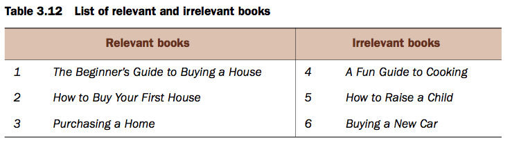

이 예에서 다른 모든 서적 제목은 새 주택 구입에 관심이있는 사람에게는 적합하지 않습니다. 표 3.11에 몇 가지 예가 나와 있습니다.

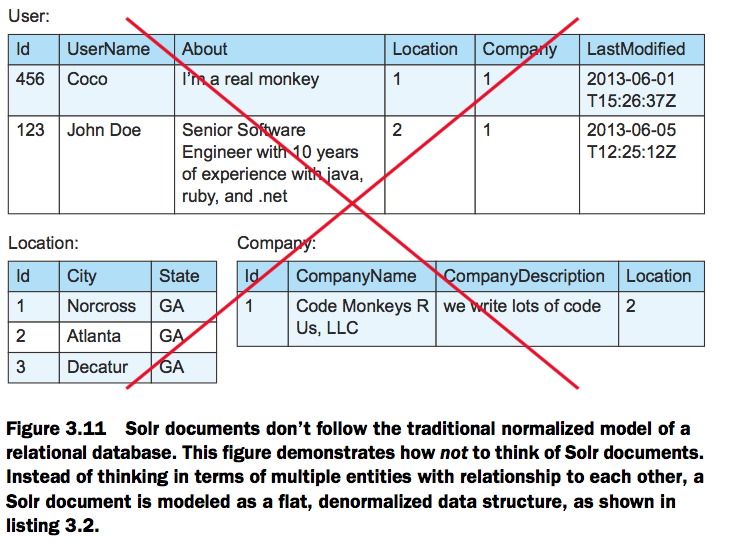

이 예제에서 반환 될 것으로 가정 된 모든 문서(documents 1, 2, 3)가 반환 된 경우 쿼리의 정밀도는 1.0이 될 것이므로 완벽 할 것입니다. (3개의 정확한 일치 / 총 3개의 일치)

그러나 6 개의 결과가 모두 반환되면 결과의 절반이 올바르지 않기 때문에 정밀도는 0.5가됩니다. 즉, 정확하지 않습니다.

마찬가지로, 관련 목록 (예 : 2번)에서 하나의 결과만 반환되면 다시 반환된 결과가 모두 정확했기 때문에 정밀도는 여전히 1.0이 됩니다.

이와 같이 Precision은 각 쿼리 결과가 "올바른지" 측정하는 하나의 척도이지만, 얼마나 정밀한 결과인지에 대해서는 아무런 주의를 기울이지 않습니다. 백만 가지의 올바른 문서 중에서 단 하나의 올바른 문서를 반환하는 쿼리는 여전히 완벽하게 정확한 것으로 간주됩니다.

Precision은 반환되는 결과의 전반적인 정확도만 고려하고 결과 집합의 포괄성은 고려하지 않기 때문에 Precision 측정을 고려하여 철저하게 계산해야합니다.


### 3.3.2 Recall

Precision은 반환되는 각 결과의 정확성을 측정하는 반면 Recall은 검색 결과가 얼마나 철저한지를 나타냅니다. 이는 "얼마나 많은 정확한 문서가 반환 되었습니까?"라는 질문에 대해 답을 하는 것입니다.

보다 기술적으로 리콜은 다음과 같이 정의됩니다.

```
# Correct Matches / (# Correct Matches + # Missed Matches)
```

회수 계산의 예를 설명하기 위해 참조용으로 관련 서적과 관련없는 서적을 보여주는 예를 표 3.12에 다시 작성하였습니다.


여섯 개의 문서가 검색 쿼리로 모두 반환 된 경우, 정확한 일치하는 항목들이 모두 발견되었고, 누락 된 일치 항목이 없기 때문에 Recall은 1이됩니다 (앞서 Precision이 0.5로 표시된 것을 봤었음).

마찬가지로 문서가 하나만 반환 된 경우 returned/recalled 해야하는 문서 중 두 개가 누락 되었기 때문에 Recall은 1/3입니다.

이것은 Precision과 Recall 사이의 중요한 차이점을 나타냅니다. 반환 된 결과가 정확하면 정밀도가 높고, 올바른 결과가 나타나면 Recall율이 높습니다. 리콜 (recall)은 모든 결과가 정확하다는 것에 상관하지 않고, Precision은 모든 결과가 존재해야 하는지에  상관하지 않습니다.

다음 섹션에서는 Precision과 Recall 사이의 적절한 균형을 맞추기 위한 전략에 대해 설명 할 것입니다.


### 3.3.3 Striking the right balance (적절한 균형 잡기)

이 둘 사이에는 분명한 긴장감이 있지만 Precision과 Recall은 상호 배타적이지 않습니다. 쿼리가 문서 1, 2 및 3 만 반환하는 이전 예제에서는 모든 결과가 정확하고 올바른 결과가 모두 있기 때문에 정밀도 및 리콜율이 모두 1.0입니다.
완벽한 정밀도 및 전체 리콜을 최대화하기 위한 것은 대부분의 모든 검색 관련성 조정을 위한 노력의 궁극적인 목표입니다. 만들어진 예제 (또는 수동으로 조정 된 결과 세트)를 사용하면 이 작업은 쉬운 것처럼 보이지만 실제로는 어려운 문제입니다.

Solr 내에서 Precision 또는 Recall을 개선하기 위해 많은 기술을 사용할 수 있지만 대부분 반환되는 전체 문서 집합에 대해 Recall을 늘리는 방향으로 나아갑니다. 공격적인 텍스트 분석 (여러 단어 변형 검색)은 더 많은 일치를 찾으려는 좋은 예이지만 텍스트 분석이 너무 공격적이어서 잘못된 단어 변형과 일치하는 경우 이러한 추가 일치가 전체 Precision을 해칠 수 있습니다.

Solr에서 Precision과 Recall 문제에 접근하는 일반적인 방법 중 하나는 전체 결과 세트에서 Recall을 측정하고 검색 결과의 첫 페이지 (또는 몇 페이지) 내에서만 Precision을 측정하는 것입니다. 이 모델을 따르면 Solr의 관련성 점수 계산 사용률을 얼마나 잘 조정했는지에 따라 검색 결과 상단에 더 나은 검색 결과가 표시되지만 검색 결과의 마지막 페이지로 이동하면 검색 결과 목록 하단에 관련성이 적은 많은 일치 검색 결과가 표시 된다는 것을 알 수 있습니다.

그러나 이것은 문제를 해결하는 한 가지 방법 일뿐입니다. 예를 들어 많은 검색 웹 사이트는 방문객이 처음 몇 페이지를 넘지 않을 것이라는 것을 알고 있기 때문에 가능한 한 많은 콘텐츠를 포함하고 싶어합니다.  처음 몇 페이지에 정확한 결과를 표시하면서 후속 페이지에 덜 정확한 일치 항목을 계속 포함할 수 있습니다.

그 결과 초기 검색어와 일치 할 수있는 키워드에 대해 관대한 결과로 전체 결과 집합에서 높은 Recall율을 얻게됩니다. 동시에 검색 결과의 긴 목록 상단에 가장 일치하는 항목이 올라 가기 때문에 결과의 첫 페이지 또는 두 페이지의 정밀도가 여전히 높습니다.

Precision과 Recall의 균형을 잘 맞추는 방법은 결국 사용 사례에 달려있습니다. 법률 적 발견과 같은 시나리오에서는 리콜 (Recall)에 중점을 두었습니다. 문서가 누락된 경우 합법적인 파급 효과가 있기 때문입니다. 다른 사용 사례의 경우 요구 사항에 따라 몇몇은 훌륭하게 일치하는 항목을 찾아내고 쿼리에 존재하는 모든 용어와 정확하게 일치하지 않는 항목들은 찾아내지 못할 수도 있습니다.

대부분의 검색 응용 프로그램은이 두 가지 양극의 중간에 위치하며 Precision과 Recall 사이의 올바른 균형을 유지하는 것이 끊임없는 도전 과제입니다. 대부분의 경우 정답이 없기 때문입니다. 그럼에도 불구하고 Precision와 Recall의 개념을 이해하고 이러한 두 가지 개념 중 하나에 변화를 일으키는 변경 사항(다른 쪽과 반비례할 가능성이 있음.)은 검색 결과의 품질을 효과적으로 향상시키는 데 중요한 역할을 합니다. 16 장은 관계를 마스터하는 데 전념하기 때문에 Precision과 Recall 사이의 긴장감을 다시 한 번 확인할 수 있습니다.

16 장에서 이러한 관련성을 익히는데 전념하기 때문에 Precision과 Recall 사이의 긴장감을 다시 한 번 확인할 수 있습니다.


## 3.4 Searching at scale (대규모 검색)

Solr의 속도, 관련성 및 powerfultext 검색 기능을 뛰어 넘는 가장 매력적인 점 중 하나는 확장성입니다. Solr은 서버를 추가하여 수십억 개의 문서와 무한한 수의 쿼리를 처리 할 수 있습니다. 12장과 13장에서는 Solr을 production 단계에서 확장하는 방법에 대한 심층적인 개요를 제공 할 것이지만, 이번 섹션에서는 확장 가능한 검색 엔진을 운영하는 데 필요한 특성에 대해 이해할 수 있는 토대를 마련 할 것입니다. 특히, 우리는 Solr 문서의 본질과 서버 간 선형 스케일링, 분산 검색의 작동 방식, 서버에 대해 생각해보는 것부터 서버 클러스터에 대한 것으로의 개념적 전환, Solr 확장의 한계에 대해 설명합니다.


### 3.4.1 The denormalized document (비정규화 문서)

Solr의 핵심은 모든 문서가 비정규화(denormalized) 되는 개념입니다. 비정규화 된 문서는 해당 필드의 값이 여러 문서에 복제되어 있어도 모든 필드가 문서 내에 자체 포함되어있는 문서를 의미합니다. 이러한 비정규화 데이터 개념은 많은 NoSQL 기술에 공통적으로 적용됩니다. 비정규화의 좋은 예는 city, state 및 postalCode 필드가 있는 사용자 프로필 문서이며, 대부분의 경우 city 및 state 필드는 각각의 고유 한 postalCode 값에 대해 모든 문서에서 동일하게 유지됩니다. 이는 문서의 가가 부분들간의 관계가 여러 개의 작은 문서로 나뉘어 질 수 있는 정규화된 문서와는 대조적인데, 쿼리 타임에 함꼐 결합할 수 있습니다. 정규화 된 문서는 postalCode 필드만을 가지며 도시와 주를 각 사용자 프로필 문서에 복제 할 필요가 없도록 고유 한 postalCode마다 별도의 위치 문서가 존재하게 됩니다. 관계형 데이터베이스에 대한 정규화 된 테이블을 구축하는 데 필요한 어떤 교육을 받았다면, Solr에 콘텐츠를 모델링 할 때 생각해볼 수있는 문을 두십시오(please leave that training at the door when thinking about modeling content into Solr). 그림 3.11은 기존의 정규화 된 데이터베이스 테이블 모델을 보여주는데, 이 모델은 Solr에서 사용할 데이터 모델링 전략이 아니라는 것을 분명히하기 위해 커다란 "X"가 그려져 있습니다.

그림 3.11에서는 "Code Monkeys R Us, LLC"라는 회사에서 근무하는 두 명의 사용자를 나타냅니다. 이 그림은 직원의 개인 정보, 위치 및 회사에 대해 별도의 테이블로 정상적으로 정규화 된 데이터를 보여 주지만 Solr 문서에서는 이러한 사용자를 나타내는 방법이 아닙니다. Listing 3.2는 이들 직원 각각이 Solr 문서에 매핑 된 비정규화 된 표현을 보여주고 있습니다.


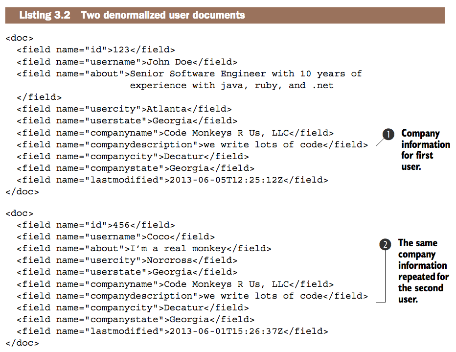

모든 회사 정보는 첫 번째(1번) 및 두 번째(2번) 사용자 문서에서 반복되므로 데이터 중복성을 줄이고 데이터 종속성을 최소화하기 위한 정규화 된 데이터베이스 설계 원칙에 어긋나는 것으로 보입니다. 전통적인 관계형 데이터베이스에서는 쿼리를 해결할 때 여러 테이블의 데이터를 조인하는 쿼리를 생성 할 수 있습니다. Solr에 몇 가지 기본 조인 기능이 있지만 (15 장에서 설명 함) 컨텐츠를 비정규 화하는 것이 비현실적인 경우에만 권장됩니다. Solr은 문서에 매핑되는 용어에 대해 알고 있지만 문서 간의 모든 관계를 기본적으로 알지 못합니다. 즉, 이전 예에서 Decatur, GA의 회사에서 근무하는 모든 사용자를 검색하려면 해당 조회에 대한 모든 사용자가 companycity 및 companystate 필드를 채워야합니다.

이 비정규화 된 문서 데이터 모델은 제한적이지만 매우 유용한 확장성을 제공합니다. 우리는 각 문서가 독립적이라는 가정을 할 수 있습니다. 즉, 관련 문서를 동일한 서버에 보관할 필요없이 여러 서버에서 문서를 분할 할 수도 있습니다 (문서는 서로 독립적이기 때문). 이처럼 문서 독립성을 전제로 가정하면 쿼리를 문서 및 여러 서버의 여러 파티션에서 병렬로 쿼리 성능을 향상시킬 수 있으므로 궁극적으로 수십억 개의 문서를 쿼리 할 수 있도록 Solr를 수평 확장 할 수 있습니다. 여러 파티션과 서버에서 확장 할 수있는 이 기능을 분산 검색이라고 하며, 바로 다음에서 다룰 것입니다.


### 3.4.2 Distributed searching (분산 검색)

모든 중요한 데이터 작업이 단일 서버를 사용하여 실행될 수 있다면 세상은 훨씬 단순해질 것입니다. 그러나 실제로는 한 번에 너무 많은 쿼리를 하거나 단일 서버가 처리 하기에는 너무 많은 양의 데이터를 검색하는 것으로 인해 검색 서버에 과부하가 걸릴 수 있습니다.

후자의 경우 두 개 이상의 개별 Solr 색인으로 콘텐츠를 분할해야하며 각 색인에는 데이터의 개별 파티션이 들어 있습니다. 그런 다음 검색이 실행될 때마다 두 서버로 전송되며 별도의 결과는 검색 엔진에서 반환되기 전에 처리되고 집계됩니다.

Solr에는 이러한 종류의 분산 검색 기능이 포함되어 있습니다. 12장에서는 프로덕션을 위해 Solr를 스케일링 할 때 데이터를 수동으로 여러 파티션으로 분할하는 방법에 대해 알아볼 것입니다. 개념적으로 각 Solr 색인 (Solr 코어라고 함)은 고유 URL을 통해 사용할 수 있으며 각 Solr 코어는 다음 구문을 사용하여 다른 Solr 코어에서 집계 검색을 수행하도록 지시할 수 있습니다.

```
http://box1:8983/solr/core1/select?q=*:*&shards=box1:8983/solr/core1, box2:8983/solr/core2,box2:8983/solr/core3
```

앞의 예제에 대한 네 가지 기능에 유의하십시오.

* shards 매개 변수는 하나 이상의 Solr 코어의 위치를 지정하는 데 사용됩니다. 샤드는 인덱스의 파티션이므로 URL의 shards 매개 변수는 Solr에게 별도의 Solr 코어에있는 데이터의 여러 파티션의 결과를 집계하도록 지시합니다.
* 검색중인 Solr 코어 (box1, core1)도 샤드 목록에 포함됩니다. 이전에 명시적으로 요청하지 않는 한 자동으로 자체를 검색하지 않습니다.
* 이 분산 검색은 여러 서버에서 검색합니다.
* 별도의 Solr 코어를 별도의 시스템에 배치 할 필요는 없습니다. 여기에는 core2와 core3가 모두 box2에 있는 경우와 동일한 시스템에 있을 수 있습니다.

여기에서 중요한 점은 Solr의 스케일링의 특성과 관련이 있습니다. 이론적으로 선형 적으로 확장되어야합니다. 왜냐하면 여러 Solr 코어의 분산 검색이 각 인덱스 파티션에서 병렬로 실행되기 때문입니다. 따라서 하나의 Solr 인덱스를 동일한 수의 문서를 사용하여 두 개의 Solr 인덱스로 분할하면 두 인덱스의 분산 검색이 약 50 % 더 빨라 집계 오버 헤드가 없습니다.

또한 이론적으로 다른 수의 서버로 확장해야합니다 (실제로는 한도에 도달하게됩니다). 추가 색인 분할을 추가 한 후 전체 조회 속도를 결정하기 위한 개념 공식 (총 문서수가 동일하다고 가정)은 다음과 같습니다.

```
(Query Speed on N+1 indexes) = Aggregation Overhead + (Query Speed on N indexes)/(N+1)
```

이 수식은 데이터가 고르게 나뉘는 파티션 수를 늘릴 때 기대할 수있는 이점을 예측할 때 유용합니다. Solr는 거의 선형으로 확장되므로 부하가 심해서 서버 리소스에 제약을 받지 않는다고 가정할 때, 추가하는 Solr 코어 (파티션)의 수에 비례하여 쿼리 시간을 줄일 수 있습니다.


### 3.4.3 Clusters vs. servers

이전 섹션에서는 크기가 큰 문서 세트를 처리 할 수 있도록 분산 검색이라는 개념을 도입했습니다. 또한 시스템에 여러 개의 또는보다 적은 수의 동일한 서버를 추가하여 높은 쿼리 볼륨의 부하 균형을 조정할 수 있습니다.
이러한 확장 전략은 모두 서버에 대한 생각부터 서버 클러스터에 대한 생각으로 전환하는 개념적 전환에 의존합니다. 서버 클러스터는 통합 기능을 수행하기 위해 함께 작동하는 여러 서버를 의미합니다.
3.4.2 절의 예제와 비슷한 다음 예제를 보도록 하겠습니다.

```
http://box1:8983/solr/core1/select?q=*:*&shards=box1:8983/solr/core1,box2:8983/solr/core2
```

이 예제는 두 개의 Solr 코어, 즉 box1의 core1과 box2의 core2를 통해 분산 검색을 수행합니다. 이 분산 검색을 실행할 때 box2가 다운되면 box1의 쿼리는 어떻게 될까요? 목록 3.3은 이 시나리오에서 Box2에 대한 실패한 연결의 오류 메시지를 포함하는 Solr의 응답을 보여줍니다.

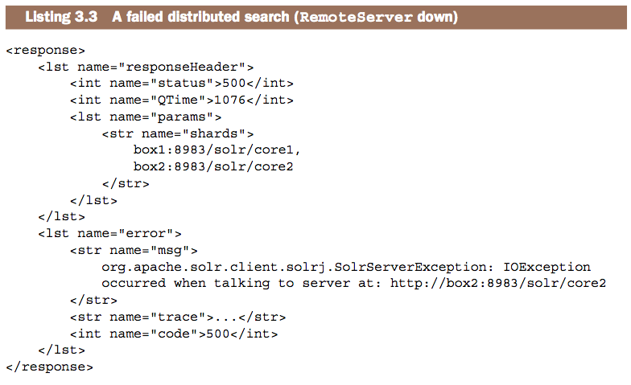

이 사용 사례에 대한 서버는 상호 의존적입니다. 검색에 사용할 수 없게되면 목록에있는 예외 사항에 표시된대로 검색에 사용할 수 없게되고 실패하기 시작합니다. 따라서 단일 서버가 아닌 단일 서버 대신 클러스터의 관점에서 생각하여, 확장을 해야하는 Solr 솔루션을 구축 할 때 이러한 서버들이 하나로 결합되어 단일 컴퓨팅 리소스로 사용된다는 점이 중요합니다. Solr는 Apache ZooKeeper를 사용하여 뛰어난 내장 클러스터 관리 기능을 제공합니다.이 기능은 13 장의 Solr-Cloud에 대한 설명에서 다룹니다.

대규모 검색에서의 핵심 개념에 대한 논의를 마무리하면서 Solr는 이 영역에서 한계를 지니고 있음을 분명히 해야하며, 그 중 몇 가지는 다음 절에서 논의 될 것입니다.


### 3.4.4 The limits of Solr (솔라의 한계)

Solr는 전체 텍스트 검색 및 데이터 분석을 지원하는 매우 강력한 문서 기반 NoSQL 데이터 스토어입니다. 우리는 Solr의 역 색인과 복잡한 키워드 기반 Boolean 쿼리 기능의 강력한 이점에 대해 이미 알아보았습니다. 또한 관련성이 얼마나 중요한지도 알았으며 Solr는 추가 서버 또는 쿼리 볼륨을 처리하기 위해 여러 서버에서 선형적으로 확장 할 수 있습니다. 그렇다면 Solr를 선택한 것이 좋은 해결책이 아닌 경우는 언제일까요? Solr의 한계는 무엇일까요?

이미 살펴본 바와 같이, 한 가지 한계는 Solr의 모든 문서간에는 어떤식으로든 관계가 없다는 것입니다. 서로 다른 문서의 서로 다른 필드에 상당한 양의 데이터를 결합하는 데는 적합하지 않으며 여러 서버에서 조인 작업을 수행 할 수 없습니다. 이것은 관계형 데이터베이스와 비교할 때 Solr의 기능적 한계이지만 문서의 독립성에 대한 이러한 가정은 관계형 데이터베이스의 한계를 훨씬 넘어서 확장 할 수 있으므로 많은 NoSQL 기술과 공통점이 있습니다.

우리는 이미 Solr 문서의 비정규화 된 특성에 대해서도 알아보았습니다. 중복되는 데이터는 해당 데이터가 적용되는 각 문서에서 반복되어 저장 되어야 합니다. 이는 여러 문서에서 공유되는 한 필드의 데이터가 변경 될 때 특히 문제가 될 수 있습니다.

소셜 네트워킹 사용자 프로필의 검색 엔진을 만들고 사용자 중 하나 인 John Doe가 Coco라는 다른 사용자와 친구가 되었다고 가정 해 봅시다. 이제 John과 Coco의 프로필을 업데이트 할 필요가 있을 뿐만 아니라 John과 Coco의 모든 친구들을 위한 "2 차 연결" 필드를 업데이트 해야합니다. 두명의 사용자가 친구가 되었다는 하나의 기본 작업에 대해 수백 가지 문서 업데이트를 해야할 수도 있습니다. 이것은 어떤면에서든 관계형이 아니라는 Solr의 개념을 다시 일깨워줍니다.

Solr의 추가 제한 사항은 현재 문서 저장 메커니즘으로 주로 사용된다는 것입니다. 즉, 문서를 삽입, 삭제 및 업데이트 할 수 있지만 단일 필드는 (쉽게) 삽입 할 수 없습니다. Solr는 현재 단일 필드를 업데이트 할 수있는 최소한의 기능을 가지고 있지만 필드의 원래 값이 인덱스에 저장되어 낭비 될 수 있습니다. 그럼에도 불구하고 Solr는 저장된 모든 필드를 내부적으로 다시 색인화하여 전체 문서를 업데이트합니다. 즉, 새 필드가 Solr에 추가되거나 기존 필드의 내용이 변경 될 때마다 Solr 색인의 모든 단일 문서가 전체 문서에서 재 처리되어야 모든 데이터에 새 필드에 대한 데이터가 채워집니다. 다른 많은 NoSQL 시스템도 이와 동일한 문제를 겪고 있지만 말뭉치(corpus) 전체의 모든 문서에서 필드를 추가하거나 변경하면 적시에 Solr로 업데이트가 전송되는 것을 보장하기 위해 문서 업데이트 조정이 필요합니다

Solr는 또한 특정 유즈 케이스에 최적화되어 있습니다. 검색 조건이 적은 검색어로 빠르게 검색어를 검색하여 일치하는 문서를 찾고 관련성 점수를 계산하고 모두 정렬 한 다음 출력을 위해 몇 가지 결과만 반환합니다. Solr는 상당히 긴 쿼리 (수천 개의 용어)를 처리하거나 상당히 큰 결과 집합을 사용자에게 반환하기 위해 최적화되지는 않았습니다.

Solr의 마지막 한계는 서버의 자동 추가 및 제거 기능과 컨텐츠를 재배포하여 부하를 처리하는 탄력적인 확장성입니다. Solr는 서버 확장성이 뛰어나지만 완전히 자동으로 탄력적인 확장이 되지는 않습니다. 최근 클러스터 관리를 위해 Apache Zoo-Keeper를 사용하는 SolrCloud (13장에서 다룹니다)가 이 탄력적 확장성을 위한 첫 걸음이지만 아직 해결해야 할 많은 기능이 있습니다. 예를 들어 Solr는 자동으로 콘텐츠를 다시 공유 할 수 없으며 콘텐츠 증가 및 쿼리 부하를 동적으로 처리하기 위해 인덱스 복제본 수를 늘릴 수 없습니다. 커뮤니티의 많은 스마트한 사람들이 이러한 장기적인 목표를 향해 노력하고 있으며, Solr은 매 출시마다 이에 점점 더 가까워지고 있습니다.


## 3.5 Summary (요약)

이 장에서는 Solr의 검색 기능의 기초가 되는 주요 검색 개념에 대해 설명했습니다. 우리는 Solr의 역 색인 구조와 복잡한 Boolean 쿼리를 신속하게 실행할 수있는 방법으로 용어를 문서에 매핑하는 방법에 대해 알아보았습니다. 또한 퍼지 쿼리 및 구문 쿼리가 위치 정보를 사용하여 맞춤법 검사 및 Solr 색인의 용어 및 구문 변형을 일치시키는 방법에 대해서도 설명했습니다.

Solr가 사용하는 기본 관련성 수식을 배치하고 각 관련성 점수가 어떻게 작동하는지, 그리고 왜 존재 하는지를 개념적으로 설명하면서 Solr 관련성에 대해 자세히 살펴 보았습니다.
우리는 정보 검색 분야에서 두 가지 상반된 세력으로 작용하는 Precision과 Recall의 개념을 간략히 소개하고 검색 결과가 우리의 목표를 충족시키는 지 여부를 판단 할 수있는 훌륭한 개념적 틀을 제공했습니다.

마지막으로, 단일 시스템에서 컨텐츠가 증가하여 합리적으로 처리 할 수있는 범위를 넘어서더라도 검색 시간을 유지하거나 줄이기 위해 쿼리 실행을 병렬화 할 수 있도록 문서 내 컨텐츠 비정규화에 대한 것과 분산 검색에 대한 Solr의 확장 방법의 핵심 개념에 대해 설명했습니다. 검색 아키텍처를 확장 할 때 서버와 대조적으로 클러스터라는 관점에서 생각해 보았고, Solr의 한계점과 Solr이 그다지 적합하지 않을 때의 사용 사례를 살펴 보았습니다.

이제 이 시점에서 이 책의 나머지 부분에서 Solr의 핵심 기능을 이해하는 데 필요한 개념적 배경을 모두 갖추어야 하고, 킬러 검색 응용 프로그램을 구축하는 데 필요한 가장 중요한 개념을 확실하게 파악해야합니다.

다음 장에서는 Solr의 주요 구성 설정을 살펴보면 이 장에서 설명하는 많은 기능을 더 세부적으로 제어 할 수 있습니다.
