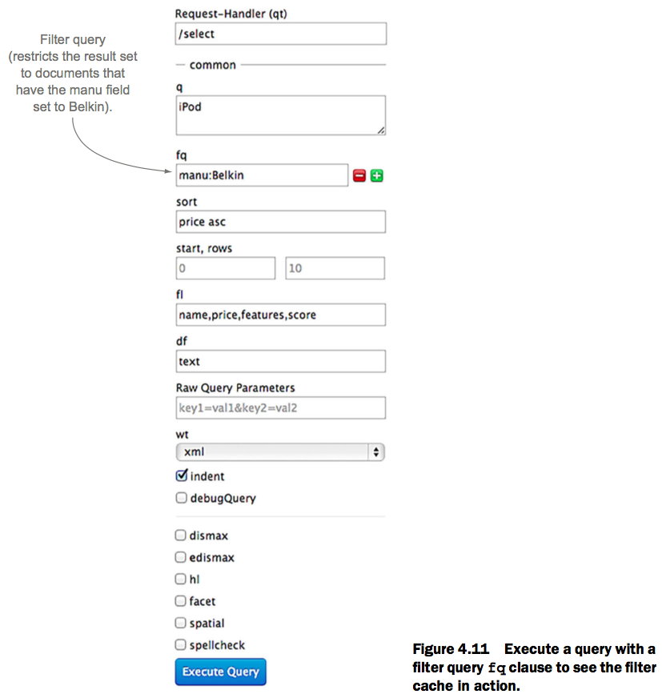

[TOC]


# 4장 Configuring Solr 		

* 이 장에서 다룰 내용
  * 쿼리 요청 처리
  * 검색 구성 요소를 사용하여 쿼리 처리 확장
  * 검색자 관리 및 예열(warming)
  * 캐시 동작 관리


지금까지 Solr가 어떻게 작동 하는지를 배우지 않고 이렇게 사용하면 된다라는 믿음만으로 제시된 것들을 많이 사용했습니다. 이 장과 다음 장에서는 Solr 구성 방법과 구성 설정이 Solr의 동작에 미치는 영향에 대해 알아볼 것입니다. Solr의 설정은 예제 서버의 설정 파일에 Solr의 가능한 모든 설정이 포함되어 있기 때문에 처음에는 힘들 수 있습니다. 이 장에서 주로 다루는 부분은 Solr에 대한 가장 중요한 구성 설정, 특히 Solr가 클라이언트 응용 프로그램에서 요청을 처리하는 방법에 영향을 주는 설정을 소개할 것입니다. 이 장에서 얻는 지식은 나머지 책 전체에 적용됩니다. 이 장을 읽은 후에는 Solr 서버에서 쿼리를 실행하는 방법을 확실하게 이해할 수 있을 것입니다.

2 장에서 배웠 듯이 Solr는 구성을 따로 변경할 필요없이 즉시 사용할 수 있습니다. 그러나 어느 시점에서는 특정 검색 응용 프로그램 요구 사항에 맞게 Solr를 최적화해야합니다. 대체적으로 많이 사용되는 Solr의 설정인 세 가지의 기본 XML 파일에 초점을 맞출 것입니다.

* solr.xml - 관리, 로깅, 샤딩 및 SolrCloud와 관련된 특성을 정의합니다
* solrconfig.xml - 특정 Solr 코어의 기본 설정을 정의합니다
* schema.xml - 필드 및 필드 유형을 포함하여 색인 구조를 정의합니다.

이 장에서는 solrconfig.xml에 대해 알아볼 것입니다. 5 장에서는 schema.xml에 대한 모든 것을 배우게 되며 인덱스가 어떻게 구성되어 있는지를 설명합니다. solr.xml에 대해서는 수동으로 파일을 변경할 필요가 없으므로 핵심 관리 API를 소개 할 12장까지는  그 목적에 대해 설명하지 않도록 하겠습니다.

대부분의 Solr 구성은 XML 문서에 지정되어 있고, 이 장에서 볼 solrconfig.xml 파일에는 XML 조각을 보여주는 수많은 코드 목록이 들어 있습니다. 그러나 우리의 주요 초점은 구성 설정 뒤에 있는 개념으로, 특정 XML 구문보다는 주로 설명이 필요합니다.

먼저 Solr 서버를 시작할 때 구성 관점에서 어떤 일이 발생하는지 살펴 보겠습니다. Solr는 Jetty에서 Java 웹 응용 프로그램으로 실행된다고 했었던 2장을 떠올려보십시오. Solr 웹 응용 프로그램은 전역 Java 시스템 등록 정보 (solr.solr.home)를 사용하여 구성 파일을 찾을 루트 디렉토리를 식별합니다. 예제 서버의 경우 Solr 홈 디렉토리 (solr.solr.home)는 $SOLR_INSTALL/example/solr/입니다.

그런 다음 Solr은 홈 디렉토리에서 autodiscovered 코어의 기본 등록 정보를 정의하는 core.properties 파일이 포함 된 하위 디렉토리를 검색합니다. 예를 들어, 예제 서버에는 /solr/collection1/ 디렉토리에 core.properties 파일이 있습니다. core.properties 파일에는 코어의 이름을 정의하는 단일 행 name = collection1이 포함되어 있으며 이는 collection1 코어에 대한 자동 발견을 트리거하는 데 필요합니다. 그림 4.1은 solr 초기화 프로세스 중에 core.properties 및 solrconfig.xml을 사용하여 collection1 코어를 만들고 설정하는 방법을 보여줍니다.

이전 버전의 Solr에서는 solr.xml에 코어를 정의해야했습니다.이 코어에서는 코어 디렉토리를 설정해야했으므로 core 정의를 solr.xml에 추가해야했습니다. core.properties를 사용하면 더 이상 solr.xml에 코어를 추가하는 추가 단계가 필요하지 않습니다. 또한 새로운 접근 방법을 사용하면 코어들을 자체포함 시키는 것을 허용하므로,  중앙 구성 파일에 모든 코어를 정의 할 필요가 없습니다.

예제 collection1 코어의 core.properties 파일에는 필수 name 매개 변수 만 포함됩니다. 그러나 자동 검색된 코어의 정의를 세부적으로 조정할 수있는 여러 가지 선택적 매개 변수를 설정할 수도 있습니다. 표 4.1에서는 자동 발견 된 코어를 정의하기 위해 core.properties에 지정할 수있는 매개 변수를 보여줍니다.


**표 4.1 core.properties를 사용하는 자동 발견 된 코어의 구성 등록 정보**

| 파라미터          | 설명                                       |
| ------------- | ---------------------------------------- |
| name          | 코어의 이름을 지정합니다. 필수.                       |
| config        | 구성 파일의 이름을 지정합니다. 기본값은 solrconfig.xml    |
| dataDir       | 인덱스 파일 및 업데이트 로그 (tlog)가 포함 된 디렉토리의 경로를 지정합니다. 기본값은 인스턴스 디렉토리 아래의 데이터입니다. |
| ulogDir       | 업데이트 로그 (tlog)가 포함 된 디렉토리의 경로를 지정합니다.    |
| schema        | 스키마 문서의 이름을 설정합니다. 기본값은 schema.xml입니다.   |
| shard         | 이 코어의 샤드 ID를 설정합니다. 샤딩에 대한 더 자세한 정보는 12 장과 13 장을 참조하십시오. |
| collection    | 이 코어가 속한 SolrCloud 콜렉션의 이름. 컬렉션은 13 장에서 다룹니다. |
| loadOnStartup | true의 경우,이 코어는 Solr 초기화 프로세스 중에 로드되어 새로운 searcher가 코어 용으로 오픈됩니다. |
| transient     | Solr의 transient-CacheSize 임계 값에 도달하면이 코어를 자동으로 언로드 할 수 있음을 나타냅니다 (고급 옵션). |


이 장의 주요 초점이 collection1 예제 코어의 solrconfig.xml 파일이기 때문에 아직은 표 4.1에 나열된 속성에 대해 신경 쓸 필요는 없습니다.


중요한 것은 core.properties를 사용하여 Solr가 시작할 때 코어를 자동 발견 할 수 있다는 것을 이해하는 것입니다. 코어가 발견되면 Solr는 `$SOLR_HOME/$instanceDir/conf/solrconfig.xml` 아래에서 solrconfig.xml 파일을 찾습니다. 여기서 $instanceDir/는 core.properties 파일이있는 디렉토리입니다. Solr는 solrconfig.xml 파일을 사용하여 코어를 초기화합니다.
이제 Solr가 시작하는 동안 설정 파일을 식별하는 방법을 살펴 보았으므로 solrconfig.xml의 주요 섹션을 이해하는 것에 초점을 맞추겠습니다. 그러면 이 장의 나머지 부분에서 무엇이 제공 될지 알 수 있을 것입니다.


## 4.1 Overview of solrconfig.xml

2장에서 수행했던 사전 구성된 예제 서버와 Solritas 예제 검색 UI를 사용했던 것을 토대로 solrconfig.xml의 개념을 설명하도록 하겠습니다. 시작하기 위해 다음 목록에 표시된 명령을 사용하여 2장에서 사용했던 예제 서버를 시작하는 것이 좋습니다.

**Listing 4.1 명령 행에서 예제 서버를 시작하기위한 명령**

```
cd $SOLR_INSTALL/example
java -jar start.jar
```

서버를 시작했으면 http://localhost:8983/ solr의 Solr 관리 콘솔로 이동하여 왼쪽에있는 collection1 링크를 클릭 한 다음 Files 링크를 클릭하십시오. 그러면 collection1 코어의 모든 구성 파일이 디렉토리 구조로 표시됩니다. solrconfig.xml을 클릭하여 컴퓨터에서 실행중인 collection1 코어의 활성 구성 설정을 표시하십시오. 이 목록은 solrconfig.xml 압축 된 버전을 보여 주며 주요 요소에 대한 아이디어를 제공합니다.


Solrconfig.xml에는 여러 가지 복잡한 섹션이 있습니다. 좋은 소식은 특정 요구가 발생할 때까지 이들에 대해 걱정할 필요가 없다는 것입니다. 다른 한편, 솔라리스의 유연성과 제어 및 확장 할 수있는 동작 유형을 보여주기 때문에 solrconfig.xml에있는 내용을 주의 깊게 살펴보는 것이 좋습니다.

이 장을 구성 할 때 우리는 XML 문서의 요소 순서를 따르기보다는 이전 섹션을 기반으로하는 순서로 구성을 하도록 하였습니다. solrconfig.xml의 request-handler 설정 이전에 캐시 관련 설정있을 지라도 캐시에 대해 알아보기 전에 Solr의 request-handler 프레임 워크에 대해 알아볼 것입니다. 캐싱을 사용하여 특정 유형의 요청을 최적화하는 것에 대해 걱정하기 전에 요청 처리 방법을 이해해야하기 때문에 이렇게 결정하였습니다. 이는 이 장을 진행하면서 XML 문서를 건너뛰어야 한다는 것을 의미합니다.

```
Index settings deferred to chapter 5
solrconfig.xml 파일에는 색인 관리 설정이 들어 있습니다. 그러나 다음 장에서는 색인 관련 설정에 대한 설명은 생략 할 것입니다.
색인 생성 프로세스에 대한 기본적인 이해를 얻은 후에 이에 대해 알아볼 것입니다. 특히 다음의 요소들은 5장까지 무시해도 됩니다.
<dataDir> ... </dataDir>
<directoryFactory name="DirectoryFactory" class="..."/>
<indexConfig> ... </indexConfig>
<updateHandler class="solr.DirectUpdateHandler2"> ...
<updateRequestProcessorChain name="langid"> ...
```


### 4.1.1 Common XML data-structure and type elements

solrconfig.xml을 통해 작업 할 때 Solr가 다양한 데이터 구조와 유형을 나타내는 데 사용하는 일반적인 XML 요소를 접하게 됩니다. 표 4.2에서는 Solr가 solrconfig.xml 문서 전체에서 사용하는 요소 유형에 대한 간략한 설명과 예제를 제공합니다. XML 검색 결과에서 이러한 요소를 접하게 될 것이므로 이 Solr 관련 구문을 익히는 데 시간을 할애하셔야 합니다.


`<arr>`과 `<lst>`의 주된 차이점은 `<list>`의 모든 하위 요소에는 name 특성이 있지만 `<art>`의 자식 요소에는 이름이 지정되지 않는다는 것입니다.


### 4.1.2 Applying configuration changes

구성에 대해 배우는 것이 가장 흥미로운 작업이 아니므로 관심을 유지하는 데 도움이됩니다. 이 장을 진행하면서 구성 변경 사항을 테스트 해보는 것이 좋습니다. Solr 코어를 다시 로드하기 전까지는 변경사항이 적용되지 않습니다. Solr는 solrconfig.xml의 변경 사항을 감시하여 자동으로 적용하지 않습니다. 구성 변경 사항을 적용하려면 명시적인 조치를 취해야합니다. 현재로써 구성 변경 사항을 적용하는 가장 쉬운 방법은 그림 4.2와 같이 관리 콘솔의 핵심 관리 페이지에서 Reload 버튼을 사용하는 것입니다.

Solr를 로컬에서 실행하고 있는 경우 collection1 코어의 Reload 버튼을 클릭하여 기능이 제대로 작동하는지 확인하십시오. 이 장 끝에서 Core Admin API를 사용하여 프로그래밍 방식으로 코어를 Reload하는 또 다른 방법을 살펴 보겠습니다.


### 4.1.3 기타 설정 (Miscellaneous settings)

지금까지 구성 배경에 대해 살펴 보았습니다. 이제 Solr 서버의 기타 설정을 살펴봄으로써 solrconfig.xml을 살펴 보겠습니다. 다음 목록은 이 절에서 설명 할 구성 설정을 나타냅니다.


#### 루씬 버전 (LUCENE VERSION)

Lucene과 Solr는 이전 버전과의 호환성을 중요하게 생각합니다. `<luceneMatchVersion>` 요소는 색인이 기반으로하는 Lucene의 버전을 제어합니다.  구동 시 다음과 같이 예제 서버에 지정된 버전을 사용하십시오.

```
<luceneMatchVersion>4.7</luceneMatchVersion>
```

이제 Solr를 몇 달 동안 실행하고 수백만 문서의 색인을 생성 한 후에 Solr의 최신 버전으로 업그레이드 해야한다고 가정해보겠습니다. 업데이트 된 Solr 서버를 시작하면 `<luceneMatchVersion>`을 사용하여 색인의 기반이되는 버전과 지정된 버전보다 상위 버전에 종속된 Lucene 기능을 비활성화할지 여부를 결정합니다.

이전 색인에 대해 업그레이드 된 Solr 버전을 실행할 수 있지만, Lucene의 새로운 기능과 버그 수정을 이용하려면 `<luceneMatchVersion>`을 올려야 할 수도 있습니다. 이 경우 모든 문서의 색인을 다시 생성하거나 Lucene의 내장 색인 업그레이드 도구를 사용할 수 있습니다. 나중에 겪을 문제에 대비해 업그레이드 도구를 실행하는 방법에 대한 지침을 JavaDoc으로 제공 할 것입니다.


#### 종속된 JAR 파일 로딩 (LOADING DEPENDENCY JAR FILES)

`<lib>` 요소를 사용하면 Solr의 런타임 클래스 경로에 JAR 파일을 추가하여 플러그인 클래스를 찾을 수 있습니다. `<lib>` 요소가 어떻게 동작하는지보기 위해 solr 예제 파일의 `<lib>` 요소 중 몇 개를 살펴 보겠습니다.

```
<lib dir="../../../contrib/langid/lib/" regex=".*\.jar" />
<lib dir="../../../dist/" regex="solr-langid-\d.*\.jar" />
```

각 `<lib>` 요소는 디렉토리의 파일과 일치하는 디렉토리와 정규식을 식별합니다. dir 속성은 코어 디렉토리 루트에서 평가되는 상대 경로 (일반적으로 코어 instanceDir이라고 함)를 사용합니다. 예제 서버의 collection1 코어의 경우 instanceDir은 `$SOLR_INSTALL/example/solr/collection1/`입니다. `$SOLR_INSTALL/`은 Solr 배포 아카이브를 압축 해제 한 디렉토리의 변수 이름임을 기억하십시오. 결과적으로, 이전에 보여준 두 개의 예제 `<lib>` 요소는 Solr의 클래스 경로에 다음 JAR 파일을 추가합니다.

- jsonic-1.2.7.jar (from contrib/langid/lib/)
- langdetect-1.1-20120112.jar (from contrib/langid/lib/)
- apache-solr-langid-4.7.0.jar (from dist/)

사용중인 Solr 4 버전에 따라 apache-solr-langid.jar 파일의 버전 번호가 다를 수 있습니다. 대신에 path 속성을 사용하여 다음과 같이 단일 JAR 파일을 식별 할 수 있습니다.

```
<lib path="../../../dist/solr-langid-4.7.0.jar" />
```

또한 $SOLR_HOME/lib/ 디렉토리 (예 : $SOLR_INSTALL/example/solr/lib/)에 플러그인 용 JAR 파일을 저장할 수 있습니다.


#### JMX 활성화 (ENABLE JMX)

`<jmx>` 요소는 Solr의 MBean을 활성화하여 시스템 관리자가 Nagios와 같은 널리 사용되는 시스템 모니터링 도구에서 코어 Solr 구성 요소를 모니터링하고 관리 할 수 있도록합니다. 요컨대, MBean은 Java Management Extensions (JMX) API를 사용하여 구성 등록 정보 및 통계를 제공하는 Java 객체입니다. MBean은 JMX 호환 도구에 의해 자동 발견되고 내부 조사 될 수 있습니다. 이를 통해 Solr는 기존 시스템 관리 인프라에 통합 될 수 있습니다. JMX를 통한 Solr의 외부 모니터링을 가능하게하는 방법에 대해서는 12 장에서 자세히 다룰 것입니다.


Solr의 MBean을 실제로 보기 위해 외부 JMX 지원 모니터링 툴이 필요하지는 않습니다. Solr 관리 콘솔은 모든 Solr의 MBeans에 대한 액세스를 제공합니다. 그림 4.3은 collection1 코어를 위한 MBean의 스크린 샷입니다.
이 장 전반에 걸쳐 관리 콘솔에서 Solr의 MBean을 검사하는 예제가 더 많이 나올 것입니다. 지금은 Solr가 요청을 처리하는 방법을 배우는 단계로 넘어 가도록 하겠습니다.


## 4.2 쿼리 요청 처리 (Query request handling)

Solr의 주요 목적은 검색하는 것이므로 Solr에서 검색 요청을 처리하는 것이 가장 중요한 프로세스 중 하나입니다. 이 섹션에서는 Solr이 검색 요청을 처리하는 방법과 특정 검색 요구 사항에 더 잘 부합하도록 요청 처리를 사용자 정의하는 방법을 배워보도록 하겠습니다.


### 4.2.1 요청 처리 개요 (Request-handling overview)

Solr에 대한 요청은 HTTP를 통해 발생합니다. Solr을 쿼리하려면 HTTP GET 요청을 보냅니다. 또는 Solr에서 문서의 색인을 생성하려면 HTTP POST 요청을 사용합니다. 다음 목록은 Example Solr 서버를 질의하기위한 HTTP GET 요청을 보여줍니다. (Listing 2.1에서 반복).


이 URL을 웹 브라우저에 입력하거나 curl과 같은 명령 줄 도구를 사용하거나 책과 함께 제공되는 예제 드라이버 응용 프로그램을 사용하면 직접 쿼리를 입력하지 않아도 됩니다. 예제 드라이버를 사용하여 이 요청을 실행하려면 다음과 같이 입력합니다.

```
cd $SOLR_IN_ACTION
java -jar solr-in-action.jar listing #.#
```

\#.\# 매개 변수는 실행 목록의 번호 (예 : 4.4)로 대체해야합니다. 코드 예제를 실행하기 위해 복사하고 붙여 넣거나 추가 입력을 할 필요가 없으며 모든 Java 플랫폼에서 작동하기 때문에 책의 예제 코드에서 http 유틸리티를 사용하는 것이 좋습니다. Listing 4.4에서 이 유틸리티를 실행할 때의 출력은 다음과 같습니다.

```
java -jar solr-in-action.jar listing 4.4
INFO [main] (ExampleDriver.java:92) - Found example class sia.Listing for arg http
INFO [main] (ExampleDriver.java:125) - Running example Listing with args: -
     listing 4.4
Feb 13, 2013 6:21:32 PM org.apache.solr.client.solrj.impl.HttpClientUtil
     createClient
INFO: Creating new http client,
     config:maxConnections=128&maxConnectionsPerHost=32&followRedirects=false
Sending HTTP GET request (listing 4.4):
    http://localhost:8983/solr/collection1/select?
      q=iPod&
      fq=manu:Belkin&
      sort=price asc&
      fl=name,price,features,score&
      df=text&
      wt=xml&
      start=0&
      rows=10
Solr returned: HTTP/1.1 200 OK
<?xml version="1.0" encoding="UTF-8"?>
<response>
...
</response>
```

http 유틸리티는 Solr 서버의 주소를 재정의 하거나 XML 대신 JSON과 같은 응답 유형으로 변경할 수 있는 다른 옵션을 제공합니다. 전체 옵션 목록을 보려면 java -jar solr-in-action.jar listing -h를 입력하십시오.
그림 4.4는 이 Solr 요청 처리와 관련된 이벤트의 순서와 주요 구성 요소를 보여줍니다. 그림 4.4의 왼쪽 상단에서 시작하여,

1. 클라이언트 응용 프로그램은 http://localhost:8983/solr/collection1/select?q=....에 HTTP GET 요청을 보냅니다. 쿼리 매개 변수는 GET 요청의 쿼리 문자열에 함께 전달됩니다.
2. Jetty로 요청을 받아들이고 요청 경로의 /solr 컨텍스트를 사용하여 Solr의 통합 요청 디스패처로 라우팅합니다. 통합 요청 디스패처는 Solr 웹 애플리케이션의 /*에 매핑되는 Java 서블릿 필터를 의미하는 전문 용어입니다. org.apache.solr.servlet.SolrDispatchFilter를 참조하십시오.
3. Solr의 요청 Dispatcher는 요청 경로의 collection1 부분을 사용하여 코어 이름을 결정합니다. 그런 다음 디스패처는 collection1 코어에 대해 solrconfig.xml에 등록 된 /select 요청 처리기를 찾습니다.
4. /select 요청 처리기(request handler)는 검색 컴포넌트의 파이프 라인을 사용하여 요청을 처리합니다 (4.2.4 절에서 다룹니다).
5. 요청이 처리 된 후 결과는 response writer 컴포넌트에 의해 형식화되고 클라이언트 응용 프로그램에 반환됩니다. 기본적으로 /select 처리기는 결과를 XML로 반환합니다. response writer는 섹션 7.7에서 다룹니다.

요청 디스패처의 주요 목적은 collection1과 같은 요청을 처리 할 올바른 코어를 찾은 다음 요청을 코어에 등록 된 /select와 같은 적절한 요청 처리기로 라우팅하는 것입니다. 실제로 대부분의 응용 프로그램에서는 요청 디스패처의 기본 구성만으로 충분합니다. 반면에 사용자 정의 검색 요청 처리기를 정의하거나 /select와 같이 기존 핸들러 중 하나를 사용자 정의하는 것이 일반적입니다. 요청 처리기를 사용자 정의하는 방법을 더 잘 이해하기 위해 /select 처리기가 작동하는 방법을 파헤쳐 봅시다.


### 4.2.2 검색 핸들러 (Search handler)

아래 목록은 solrconfig.xml에서 /select 요청 처리기의 정의를 보여줍니다.


그 뒤에는 모든 요청 처리기가 위의 sold.SearchHandler와 같은 Java 클래스로 구현됩니다. 런타임에 solr.SearchHandler는 빌트인 Solr 클래스 인 org.apache.solr.handler.component.SearchHandler를 해석합니다. 일반적으로 언제든지 당신은 solr를 보게됩니다. 일반적으로 solrconfig.xml에서 solr가 클래스의 접두어로 표시 될 때마다 "analysis.", "schema.", "handler.", "search.", "update.", "core.", "request.", "update.processor.", "util.", "spelling.", "handler.component.", "handler.dataimport."와 같은 Solr의 코어 Java 패키지 중 하나로 번역된다는 것을 알고 있습니다. 이 단축 표기법은 Solr의 구성 문서가 복잡해지지 않도록 도와줍니다.

Solr에는 요청 처리기의 두 가지 주요 유형인 쿼리 처리를 위한 검색 핸들러와 인덱싱을위한 업데이트 핸들러가 있습니다. 다음 장에서는 업데이트 처리기에 대해 자세히 알아보고 색인 처리에 대해 다룹니다. 지금은 그림 4.5와 같이 검색 요청 처리기가 쿼리를 처리하는 방법에 대해 집중적으로 살펴 보겠습니다.
그림 4.5에 있는 검색 핸들러 구조는 Solr의 쿼리 처리 파이프 라인을 응용 프로그램에 쉽게 적용 할 수 있도록 설계되었습니다. 예를 들어, 고유 한 요청 처리기를 정의하거나 더 일반적으로 /select와 같은 기존 요청 처리기에 사용자 정의 검색 구성 요소를 추가 할 수 있습니다. 일반적으로 검색 핸들러는 다음 단계로 구성되며 solrconfig.xml에서 각 단계를 사용자 정의 할 수 있습니다.

1. 다음을 사용하여 매개 변수 장식을 요청하십시오.
   1.  defaults- 클라이언트가 명시 적으로 제공하지 않은 요청의 기본 매개 변수를 설정합니다.
   2.  invariants- 매개 변수를 고정 값으로 설정합니다. 이 값은 클라이언트가 제공 한 값을 재정의합니다.
   3.  appends- 클라이언트가 제공 한 매개 변수와 결합 할 추가 매개 변수
2. 첫 번째 구성 요소 - 사전 처리 작업을 수행하기 위해 먼저 실행되는 검색 구성 요소 체인 (선택 사항)
3. 구성 요소 - 최소한 쿼리 구성 요소를 포함해야하는 검색 구성 요소의 주 체인
4. last-components- 후 처리 작업을 수행하기 위해 마지막으로 적용되는 선택 구성 요소 체인


요청 핸들러는 solrconfig.xml의 모든 단계를 정의 할 필요가 없습니다. 4.5 절에서 볼 수 있듯이 /select는 defaults 섹션만 정의합니다. 즉, 다른 모든 단계는 기본 solr.SearchHandler 구현에서 상속됩니다. 주 구성 요소 섹션이 정의되지 않은 경우 검색 구성 요소의 기본 목록이 사용됩니다. 이 기본 검색 구성 요소 목록은 4.2.4 절에서 다룹니다. 실제로는 클라이언트 응용 프로그램을 단순화하기 위해 일반적으로 사용자 정의 된 요청 처리기가 사용됩니다. 예를 들어, 2 장에서 소개 한 Solritas 예제는 사용자 정의 요청 처리기 인 /browse를 사용하여 Solritas의 클라이언트 측 코드를 단순하게 유지하면서 기능이 풍부한 검색 경험을 제공합니다.


### 4.2.3 Browse request handler for Solritas: an example

웹 서비스와 객체 지향 디자인의 핵심은 클라이언트 코드의 복잡성을 숨기는 것입니다. Solr는 응용 프로그램에 대한 사용자 정의 검색 요청 처리기를 검증된 디자인 패턴으로 정의 할 수 있게끔 하여 Solr 클라이언트의 복잡성을 숨길 수 있습니다. 예를 들어 모든 쿼리에서 맞춤법 검사를 사용하기 위해 올바른 매개 변수를 보내도록 요청하는 대신 기본적으로 맞춤법 교정이 활성화 된 사용자 지정 요청 처리기를 사용할 수 있습니다.

Solr 예제 서버에는 Solritas 예제 애플리케이션을 지원하기 위해 이 디자인 패턴의 훌륭한 예제가 미리 구성되어 있습니다. 아래 목록은 solrconfig.xml의 /browse 요청 처리기에 대한 간략한 정의를 보여줍니다.


solrconfig.xml 파일에서 /browse 요청 처리기의 모든 섹션을 살펴 보는 것이 좋습니다. 한 가지 분명한 것은 Solr의 많은 훌륭한 기능을 입증하기 위해 이 핸들러를 구성하는 데 많은 노력을 기울였다는 것입니다. Solr를 시작하기 전에 애플리케이션과 같이 뭔가를 구성 할 필요가 없습니다. Solr에 익숙해지면 시간이 지남에 따라 맞춤형 요청 처리기를 구축 할 수 있게될 것입니다.

Solritas 예제를 사용하여 /browse 요청 처리기에 대해 알아봅시다. Solr 서버가 실행중인 상태에서 브라우저를 열어 http://localhost:8983/solr/collection1/browse로 이동하고, 그림 4.6과 같이 검색 상자에 iPod을 입력하십시오.
그림 4.6을 살펴보고 이 간단한 쿼리에 대해 사용된 모든 검색 기능을 살펴보십시오. Solritas 검색 양식은 내부에서 /browse 요청 처리기에 쿼리를 제출합니다. 우리는 아래의 로그를 볼 수 있습니다.

```
INFO: [collection1] webapp=/solr path=/browse params={q=iPod} hits=3 status=0 QTime=22
```

검색 양식에서 보낸 유일한 매개 변수는 q = iPod이지만 응답에는 패싯, 유사 항목, 맞춤법 교정, 페이징 및 히트 하이라이팅이 포함됩니다.


q = iPod과 같은 간단한 요청에 대한 기능들이 참 인상적입니다! 짐작할 수 있듯이 이러한 기능은 /browse 요청 처리기의 기본 매개 변수를 사용하여 활성화됩니다.

목록 4.6의 기본 `<lst>` 요소는 클라이언트 응용 프로그램에서 명시적으로 전송하지 않은 경우 쿼리 매개 변수의 기본값을 제공하는 name/value 쌍의 정렬 된 목록입니다. 예를 들어 응답 작성기 유형 매개 변수 wt의 기본값은 velocity (`<str name="wt">velocity</str>`)입니다. Velocity는 Java로 작성된 오픈 소스 템플릿 엔진입니다 (http://velocity.apache.org/engine/index.html).

이전에 표시된 로그 메시지에 따르면 양식에서 보낸 유일한 매개 변수는 q였습니다. (다른 모든 매개 변수는 기본값으로 설정됩니다.) 처리 된 실제 쿼리를보기 위해 약간의 실험을 해보도록 하겠습니다. 응답 작성기 type velocity를 사용하는 대신 wt 매개 변수를 xml로 설정하여 Velocity에서 제공 하는 HTML 데코레이션 없이 raw form으로 응답을 볼 수 있습니다. 또한 모든 쿼리 매개 변수를 보려면 echoParams 값을 all로 설정해야합니다. 이는 클라이언트에서 명시적으로 매개 변수를 전달하여 기본값을 무시하도록 하는 좋은 예입니다. 다음 목록은 쿼리 URL과 응답과 함께 반환 된 `<params>` 요소의 일부를 보여줍니다. 이 요청을 실행하기 위해 책의 소스 코드와 함께 제공되는 http 도구를 사용할 수 있습니다. /browse 요청 처리기로 보낸 매개 변수의 수가 얼마나 많은지 확인해보십시오.

**Listing 4.7 List of parameters sent to the /browse request handler for q=iPod**

```
Request
http://localhost:8983/solr/collection1/browse?q=iPod&wt=xml&echoParams=all

Response
...
   <lst name="params">
      <str name="facet">on</str>
      <str name="mlt.fl">text,features,name,sku,id,manu,cat,title,
        description,keywords,author,resourcename</str>
      <str name="f.manufacturedate_dt.facet.range.gap">+1YEAR</str>
      <str name="f.price.facet.range.gap">50</str>
      <str name="q.alt">*:*</str>
      <str name="f.content.hl.fragsize">200</str>
      <str name="v.layout">layout</str>
      <str name="echoParams">all</str>
      <str name="fl">*,score</str>
      <str name="f.price.facet.range.end">600</str>
      <str name="hl.simple.post">&lt;/b&gt;</str>
      <str name="f.name.hl.fragsize">0</str>
      <arr name="facet.field">
        <str>cat</str>
        <str>manu_exact</str>
        <str>content_type</str>
        <str>author_s</str>
      </arr>
      <str name="hl.encoder">html</str>
      <str name="v.template">browse</str>
      <str name="spellcheck.alternativeTermCount">2</str>
      <str name="f.popularity.facet.range.end">10</str>
      <str name="f.manufacturedate_dt.facet.range.start">
        NOW/YEAR-10YEARS</str>
      <str name="spellcheck.extendedResults">false</str>
      <str name="spellcheck.maxCollations">3</str>
      <str name="hl.fl">content features title name</str>
      <str name="f.content.hl.maxAlternateFieldLength">750</str>
      <str name="spellcheck.collate">true</str>
      <str name="wt">xml</str>
      <str name="defType">edismax</str>
      <str name="rows">10</str>
      <str name="facet.range.other">after</str>
      <str name="f.popularity.facet.range.start">0</str>
      <str name="f.title.hl.alternateField">title</str>
      <str name="facet.pivot">cat,inStock</str>
      <str name="f.title.hl.fragsize">0</str>
      <str name="spellcheck">on</str>
      <str name="spellcheck.maxCollationTries">5</str>
      <arr name="facet.range">
      <str>price</str>
      <str>popularity</str>
      <str>manufacturedate_dt</str>
    </arr>
    <str name="hl.simple.pre">&lt;b&gt;</str>
    <str name="hl">on</str>
    <str name="title">Solritas</str>
    <str name="df">text</str>
    <arr name="facet.query">
        <str>ipod</str>
        <str>GB</str>
    </arr>
    ...     <= There are many more default parameters in this request not shown here.
  </lst>
  ...
```

Listing을 살펴보면 검색 요청 처리기의 매개 변수 데코레이션이 Solr의 강력한 기능이라는 것을 분명히 알 수 있습니다. 특히 기본 목록은 응용 프로그램에 두 가지 주요 이점을 제공합니다.

* 한 곳에서 응용 프로그램에 적합한 기본값을 설정하여 클라이언트 코드를 단순화하는 데 도움이됩니다. 예를 들어 응답 작성자 유형 wt를 속도로 설정하면 클라이언트 응용 프로그램에서 이 매개 변수 설정에 대해 걱정할 필요가 없습니다. 게다가 Velocity를 다른 템플릿 엔진으로 바꾼 경우에도 클라이언트 코드를 변경할 필요가 없습니다!
* 패싯과 같은 복잡한 구성 요소를 미리 구성하여 클라이언트 코드를 간단하게 유지하면서 모든 쿼리에 대해 일관된 동작을 설정할 수 있습니다. Listing 4.7에서 볼 수 있듯이 요청에는 Solritas에서 사용하는 검색 구성 요소를 구성하는 데 필요한 여러 가지 복잡한 매개 변수가 포함되어 있습니다. Solritas에 대해 패싯 구성 요소를 구성하는 데는 20개 이상의 매개 변수가 있습니다.

/browse 핸들러는 Solr 쿼리 처리에서 가능한 것의 좋은 예이지만, 기본 매개 변수가 Solritas 데이터 모델과 밀접하게 결합되어 있기 때문에 응용 프로그램에서 사용할 수는 없습니다. 예를 들어, 범위 패싯은 Solritas 스키마에서 고유하고 응용 프로그램에 적용되지 않는 price, popularity 및 manufacturedate_dt 필드들로 대해 구성됩니다. 따라서 각각의 사용자 고유의 응용 프로그램 요청 처리기를 설계 할 때는 /browse 처리기를 100% 재사용 가능한 솔루션이 아닌 예제로 취급해야합니다.


### 4.2.4 Extending query processing with search components (검색 구성 요소를 사용하여 쿼리 처리 확장)

디폴트 집합 이외에 / browse 요청 처리기는 `<last-components>` 요소를 사용하여 기본 검색 구성 요소 세트를 적용한 후 요청에 적용 할 검색 구성 요소의 배열 `<arr>`을 정의합니다. 4.6 목록에서 /browse 요청 처리기는 아래와 같았습니다.

```
<arr name="last-components">
   <str>spellcheck</str>
</arr>
```


이 구성은 검색 구성 요소의 기본 집합이 적용된 다음 맞춤법 검사 구성 요소가 적용된다는 의미입니다. 이는 검색 요청 처리기에 대한 일반적인 디자인 패턴입니다. 그림 4.7은 쿼리 처리의 `<components>` 단계에서 적용되는 6 개의 내장 검색 구성 요소 체인을 보여줍니다.


#### 쿼리 구성 요소

쿼리 구성 요소는 Solr의 쿼리 처리 파이프 라인의 핵심입니다. 상위 수준에서 쿼리 구성 요소는 4.3 절에서 설명하는 활성 검색자(active searcher)를 사용하여 쿼리를 구문 분석하고 실행합니다. 특정 쿼리 파싱 전략은 defType 매개 변수에 의해 제어됩니다. 예를 들어, /browse 요청 처리기는 eDisMax 쿼리 구문 분석기 (`<str name="defType"> edismax </str>`)를 사용하며, 이에 대해서는 7 장에서 설명합니다.

쿼리 구성 요소는 쿼리에서 일치하는 색인의 모든 문서를 식별합니다. 그런 다음 일치하는 문서 집합을 패싯 구성 요소와 같은 쿼리 처리 체인의 다른 구성 요소에서 사용할 수 있습니다. 쿼리 구성 요소는 항상 활성화되며 다른 모든 구성 요소는 쿼리 매개 변수를 사용하여 명시적으로 활성화해야합니다.


#### 패싯 구성 요소

쿼리 구성 요소에 의해 식별 된 결과 집합이 제공된 경우 패싯 구성 요소는 활성화 된 경우 필드 수준 패싯을 계산합니다. 8장에서 faceting에 대해 자세히 다룹니다. 지금으로써의 핵심 패러다임은 패싯이 모든 검색 요청에 내장되어 있으며 쿼리 요청 매개 변수를 사용하여 활성화해야한다는 것입니다. /browse의 경우 패싯은 기본 매개 변수 `<str name="facet">true</str>`를 사용하여 활성화됩니다.


#### MORE LIKE THIS 구성요소

쿼리 구성 요소에 의해 생성 된 결과 집합이 주어지면 "More Like This" 구성 요소는 검색 결과의 문서와 유사한 다른 문서를 식별합니다. 이 구성 요소와 유사한 동작의 예를 보려면 Solritas 예에서 하드 드라이브를 검색해보십시오. 그림 4.8과 같이 유사한 문서 목록을 보려면 “Samsung SpinPoint P120 SP2514N - hard drive - 250 GB - ATA-133” 결과에 대한 유사 링크를 클릭하십시오.
우리는 16장에서 More Like This 구성요소 (component)에 대해 다룹니다.


#### 하이라이트 구성 요소

하이라이트 구성 요소를 사용하면 일치하는 문서에서 텍스트의 관련성이 높은 부분을 강조 표시합니다. 히트 강조 표시는 9 장에서 다룹니다.


#### STATS 구성 요소

stats 구성 요소는 일치하는 문서의 숫자 필드에 대한 최소, 최대, 합계, 평균 및 표준 편차와 같은 간단한 통계를 계산합니다. stats 컴포넌트가 생성하는 예제를 보려면 Listing 4.8에서와 같이 GET 요청을 실행합니다.


#### 디버그 구성 요소

디버그 구성 요소는 실행 된 구문 분석 된 쿼리 문자열과 결과 집합의 각 문서에 대해 점수가 계산 된 방식에 대한 자세한 정보를 반환합니다. 구문 분석 문제를 추적하는 데 도움이되는 구문 분석 된 쿼리 값이 반환됩니다. 디버그 구성 요소는 순위 문제를 해결하는 데 유용합니다. 작동중인 디버그 구성 요소를 보려면 브라우저에 http://localhost:8983/solr/collection1/browse?q=iPod&wt=xml&debugQuery=true 를 입력하십시오.

이것은 응답 형식 유형 wt를 xml(velocity 대신)로 변경하고 HTTP GET 요청에서 debug = true를 사용하여 디버그 구성 요소를 사용할 수 있다는 점을 제외하고는 Solritas 형식에서 실행 한 것과 동일한 쿼리입니다. 다음 목록은 디버그 구성 요소에 의해 생성 된 XML 출력의 일부를 보여줍니다.


사용자가 입력 한 일회성 쿼리 iPod이 수많은 필드에서 많은 부스트로 구성된 매우 복잡한 쿼리를 생성하는 방법에 주목하십시오. 더 복잡한 쿼리는 eDisMax 쿼리 파서로 생성됩니다. 기본값은 defType 매개 변수에 의해 활성화됩니다. eDisMax 파서는 7 장에서 다룹니다.


#### 마지막 구성 요소로 맞춤법 검사 추가

6 개의 내장 검색 구성 요소가 요청을 처리 한 후에 /browse 검색 처리기는 `<last-components>` 단계에 나열된 맞춤법 검사 구성 요소를 호출합니다. 이 목록은 solrconfig.xml의 맞춤법 검사 구성 요소 정의를 보여줍니다.


구성 요소 "spellcheck"의 이름은 /browse 요청 처리기의 `<last-components>` 섹션에 나열된 것과 일치합니다. Listing 4.10의 설정이 의미를 갖기 전에 Solr의 철자 교정 기능이 어떻게 작동하는지에 대한 더 많은 배경 지식이 필요하다면 10장의 구성 요소를 살표보십시오. 이 시점에서의 검색 구성 요소의 주요 고려 사항은 `<last-components>`를 사용하여 검색 구성요소가 어떻게 요청 처리 파이프 라인에 추가되는지 입니다.

이 시점에서 Solr가 쿼리 요청을 처리하는 방법을 확실하게 이해하고 있어야합니다. 다른 구성 항목으로 이동하기 전에 Solr 관리 콘솔이 `Plugins/Stats > QUERYHANDLER` 아래의 모든 활성 검색 요청 처리기에 대한 액세스를 제공한다는 사실을 알고 있어야합니다. 그림 4.9는 /browse 검색 핸들러의 속성과 통계를 보여줍니다. 짐작 했겠지만 다른 MBean입니다.
이제 쿼리 성능을 최적화하는 데 도움이되는 구성 설정을 살펴 보겠습니다.


## 4.3 Managing searchers

`<query>` 요소에는 캐싱, 지연 필드 로드(lazy field load), 새로운 검색기 예열(new searcher warming)과 같은 기술을 사용하여 쿼리 성능을 최적화 할 수 있는 설정이 포함되어 있습니다. 최적의 쿼리 성능을 위해 처음부터 디자인하는 것이 검색 응용 프로그램의 성공에 중요하다는 것은 말할 필요도 없습니다. 이 섹션에서는 쿼리 성능을 최적화하기 위한 가장 중요한 기술 중 하나인 검색 프로그램 관리에 대해 배우게 됩니다.


### 4.3.1 New searcher overview (새로운 검색 사용자 개요)

Solr에서 쿼리는 검색자라는 구성 요소에 의해 처리됩니다. 주어진 시간에 Solr에는 오직 하나의 "활성(active)"검색자(searcher)가 존재합니다. 모든 검색 요청 처리기에 대한 모든 쿼리 구성 요소는 active searcher에 대한 쿼리를 실행합니다.

활성 탐색기(active searcher)에는 기본 Lucene 색인의 스냅 샷에 대한 읽기 전용 보기가 있습니다. Solr에 새 문서를 추가하면 현재 searcher의 검색 결과에 표시되지 않습니다. 그러면 새로운 문서를 검색 결과에 어떻게 포함 시킬 것인가라는 의문이 떠오르게 됩니다. 그 답은 현재 검색자(searcher)를 닫고 업데이트 된 색인의 읽기 전용보기가있는 새로운 것을 여는 것입니다. 이것은 Solr에게 문서를 위임한다는 것을 의미합니다. Solr의 커밋 프로세스는 앞서 설명한 것보다 복잡하지만 다음 장에서는 이러한 커밋의 자세한 사항에 대해서는 생략합니다. 지금은 새로운 검색자를 열어 검색 결과에 새로운 문서와 기존 색인을 업데이트하는 커밋 작업이 블랙 박스로 되어 있다고 생각을 하십시오.


그림 4.10은 예제 서버의 collection1 코어에 대한 활성 searcher MBean을 보여줍니다. 이 core는 Plugins/Stats 페이지의 CORE 섹션에서 사용할 수 있습니다.
CORE 페이지에서 searcherName 속성을 입력하십시오 (다이어그램에서 Searcher@25082661 main). 2.1.4 절에서했던 것처럼 모든 예제 문서를 서버에 다시 보내어 새로운 검색자 생성을 시작합시다.

```
cd $SOLR_INSTALL/example/exampledocs
java -jar post.jar *.xml
```

이제 CORE 페이지를 새로 고치고 searcherName 속성이 searcher의 다른 인스턴스가 되도록 변경했습니다. post.jar 명령을 수행하여 예제 문서를 추가 한 후 커밋을 보냈기 때문에 새로운 searcher가 작성되었습니다.
이제 커밋이 새로운 문서와 업데이트를 볼 수있는 새로운 검색자를 생성한다는 것을 알게되었으므로 새로운 검색자를 만드는 의미에 대해 생각해 봅시다. 첫째, 오래된 검색자가 파괴되어야합니다. 그러나 이전 searcher에 대해 현재 실행중인 쿼리가있을 수 있으므로 Solr는 진행중인 모든 쿼리가 완료 될 때까지 기다려야합니다.


또한 현재 검색자의 색인보기를 기반으로하는 캐시 된 오브젝트는 무효화되어야합니다. Solr의 캐시 관리에 대한 자세한 내용은 다음 섹션에서 살펴 보겠습니다. 지금은 특정 쿼리에서 캐시 된 결과 집합에 대해 생각해보십시오. 캐시 된 결과의 일부 문서가 삭제되고 이제 새 문서가 쿼리와 일치 할 수 있으므로 캐시 된 결과 집합이 새 검색자에게 유효하지 않다는 것이 분명해야합니다.

캐시 된 쿼리 결과 집합과 같이 사전 계산 된 데이터는 무효화되고 다시 계산되어야하기 때문에 인덱스에서 새로운 searcher를 여는 것이 잠재적으로 값 비싼 작업이 될 수 있습니다. 이는 사용자 환경에 직접적인 영향을 줄 수 있습니다. 검색 결과를 통해 사용자 페이징을 상상해보십시오. 새로운 검색자가 2 페이지를 클릭했지만 3 페이지를 요청하기 전에 열렸다고 상상하십시오. 사용자가 다음 페이지를 요청하면 이전에 계산 된 모든 필터와 캐시 된 문서는 더 이상 유효하지 않습니다. 주의를 기울이지 않으면 특히 쿼리가 복잡한 경우 사용자의 속도가 느려질 수 있습니다.

좋은 소식은 Solr에는 이러한 상황을 완화하는 데 도움이되는 여러 가지 도구가 있다는 것입니다. 우선, Solr는 백그라운드에서 새로운 searcher를 warming하고 새로운 검색 사용자가 완전히 warming 될 때까지 현재 검색 사용자를 활성 상태로 유지하는 개념을 지원합니다.


### 4.3.2 Warming a new searcher

Solr는 쿼리 성능이 크게 느려지는 것보다 결과가 다소 부족하더라도 빠른 시간 내에 제공되도록 하는 것이 더 좋습니다. 즉, 새로운 searcher가 예열(warm)되어 최적의 성능으로 쿼리를 실행할 준비가 될 때까지 Solr는 현재 searcher를 닫지 않습니다.

새로운 searcher를 웜업을 하는 것은 육상 경기에서 단거리 선수가 준비운동을 하는 것과 같습니다. 단거리 선수가 경기를 시작하기 전에 스타트 건이 발사 될 때 전속력으로 질주하기 위해 근육을 웜업시킵니다. 같은 방식으로, Solr은 "cold" searcher를 활성화해서는 안됩니다.

일반적으로 오래된 캐시의 autowarming과 cache-warming 쿼리 두 가지 유형의 예열 작업이 있습니다. 다음 섹션에서는 autowarming 캐시에 대해 더 배우게 될 것이며, Solr의 캐시 관리 기능을 살펴볼 것입니다.

cache-warming 쿼리는 새로운 searcher의 캐시를 채우기 위해 새로운 searcher에 대해 실행되는 (solrconfig.xml에) 미리 구성된 쿼리입니다. 다음 목록은 예제 서버에 대한 cache-warming 쿼리의 구성을 보여줍니다.


위 목록의 구성 설정은 커밋 이후와 같이 Solr에서 newSearcher 이벤트가 발생할 때마다 실행할 쿼리의 명명 된 목록 (`<arr name="queries">`)을 등록합니다. 또한 쿼리는 주석으로 처리되었습니다. 이는 warming 쿼리를 실행하는 데는 비용이 들기 때문에 고의적으로 처리한 것입니다. Solr 개발자는 응용 프로그램에 대해 예측 쿼리를 명시 적으로 구성해야합니다. cache-warming 쿼리는 응용 프로그램에 따라 다르므로 즉시 사용 가능한 기본값은 엄격한 예입니다. 자체 warming 쿼리를 구성하는 것은 사용자의 책임입니다.


#### CHOOSING WARMING QUERIES

쿼리를 실행하여 새로운 searcher를 준비하도록 하는 기능을 갖춰서 쿼리 성능을 향상시키기 위한 쿼리를 식별 할 수 있다면 큰 도움이됩니다. 일반적으로 애플리케이션의 경우 자주 사용되는 쿼리 요청 매개 변수 (q, fq, sort 등)가 있어야합니다. Solr 쿼리 구문을 아직 다루지 않았기 때문에 Solr 쿼리 구문에 대해 배우게 될 7 장까지 쿼리에 대한 설명을 표로 만들 것입니다. 7 장을 읽은 후에는 warming 질의를 생성하는 방법을 알게 될 것입니다. 현재로서는 Solr 쿼리 구조에 대해 조금 더 철저하게 이해하고나면 이 주제를 다시 한번 살펴볼 필요가 있다는 것을 기억하십시오.

또한 응용 프로그램에 대해 warming query가 필요하지 않다는 것을 언급해야 합니다. 커밋 후 쿼리 성능이 떨어지기 시작하면 워밍 쿼리 사용을 고려해야 합니다.


#### TOO MANY WARMING QUERIES

less의 오래된 격언은 warming 쿼리에 더 많이 적용됩니다. 각 쿼리는 실행하는 데 시간이 걸리므로 많은 warming 쿼리를 구성하면 새로운 searcher가 열리는 데 오랜 시간이 걸릴 수 있습니다. warming 쿼리 목록을 검색 응용 프로그램에 대한 중요한 쿼리 중 최소 집합으로 유지하는 것이 가장 좋습니다.

새로운 searcher가 워밍업하는 데 오랜 시간이 걸린다면 어떤 문제가 발생한 것인지 궁금할 것입니다. 응용 프로그램에서 너무 많은 사용자를 준비시키는 것(warming)은 너무 많은 리소스 (CPU 및 메모리)를 소비 할 수 있으므로 검색 성능이 저하 될 수 있습니다.


#### FIRST SEARCHER (첫 번째 검색 도구)

Solr 초기화 중에 또는 코어를 다시 로드 한 후에 첫 번째 searcher를 준비하는 개념도 있습니다. 첫 번째 searcher에 대한 warming 쿼리를 구성하는 데 가치가 있는지를 결정하기 한 것은 사용자에게 맡깁니다. 대부분의 Solr 사용자는 신규 및 첫 번째 searcher를 준비시키기 위해 동일한 쿼리를 사용합니다. Solr의 캐시 관리에 주의를 기울이기 전에 solrconfig.xml에 `<searColdSearcher>` 및 `<maxWarmingSearchers>`와 같은 두 가지 검색 자 관련 요소를 추가로 설명하고자합니다.

```
XInclude를 사용하여 다른 소스의 XML 요소 포함
Solr는 XInclude를 사용하여 XML 요소를 다른 파일에서 solrconfig.xml로 가져 오는 것을 지원합니다. 예를 들어 신규 및 첫 번째 검색 자의 warming 쿼리 목록을 복제하는 대신, 별도의 파일에서 목록을 유지하고 <xi:include href="warming-queries.xml" xmlns:xi="http://www.w3.org/ 2001/XInclude">를 사용하여 두 위치에 X를 포함시킬 수 있습니다.
```


#### USECOLDSEARCHER

`<useColdSearcher>` 요소는 새로운 검색 요청이 이루어지고 현재 등록 된 searcher가 없는 경우를 사용합니다. `<useColdSearcher>`가 false 인 경우 Solr는 warming searcher가 모든 warming 쿼리 실행을 완료 할 때까지 차단합니다. 예제 Solr 서버의 기본 구성 : `<useCold-Searcher>false</useColdSearcher>`

`<useColdSearcher>`가 true이면, Solr은 "warm" 방법과 관계없이 즉시 warming searcher를 등록합니다. 우리의 육상 경기의 비유로 돌아가서, false인 경우는 얼마나 오래 걸리든 간에 단거리 선수가 완전히 준비 될 때까지 경주 시작을 기다리는 출발 공식을 의미하고, true 값은 단거리 선수가 워밍업 된 것과 관계없이 경기가 즉시 시작된다는 것을 의미합니다.


#### MAXWARMINGSEARCHERS

새로운 searcher의 warming 프로세스가 완료되기 전에 새로운 커밋이 발생할 수 있습니다. 이는 다른 searcher가 워밍업해야한다는 것을 의미합니다. 이것은 특히 당신의 searcher가 워밍업에 상당한 시간을 할애 한다면 사실입니다. `<maxWarmingSearchers>` 요소를 사용하면 백그라운드에서 동시에 워밍업 할 수있는 최대 수의 searcher를 제어 할 수 있습니다. 일단 이 임계 값에 도달하면 새로운 커밋 요청이 실패하게 됩니다. 이는 백그라운드에서 너무 많은 warming searcher를 실행하면 서버에서 메모리와 CPU 리소스를 빠르게 소모 할 수 있기 때문에 성능에 좋습니다. Solr는 기본값 2로 시작합니다. 이 값은 다음과 같이 시작하는 것이 좋습니다.

`<maxWarmingSearchers>2</maxWarmingSearchers>`

서버가 최대 임계 값에 너무 자주 도달한다면, warming 로직을 다시 확인하여 새로운 searcher의 warming이 너무 오래 걸리지 않은지 확인하십시오.
이제는 searcher가 무엇인지, 그리고 응용 프로그램에 대해 searcher를 올바르게 관리하도록 Solr를 구성하는 방법에 대해 잘 숙지 했기를 바랍니다. 이제 캐싱을 사용하여 쿼리 성능을 최적화하는 더 많은 방법을 살펴 보겠습니다.


## 4.4 Cache management (캐시 관리)

Solr는 쿼리 성능을 향상시키기 위해 여러 가지 내장 된 캐시를 제공합니다. 특정 Solr 캐시의 세부 사항을 살펴보기 전에 Solr의 캐시 관리 기본 사항을 이해하는 것이 중요합니다.


### 4.4.1 Cache fundamentals (캐시 기본 사항)

Solr 캐시로 작업 할 때는 다음과 같은 네 가지 주요 문제가 있습니다.

* 캐시 크기 조정 및 제거 정책
* 적중률 및 축출(evictions)
* 캐시 된 개체 무효화
* 새로운 캐시 autowarming

대체로 말해서, Solr에서 적절한 캐시 관리는 set-it-and-forget-it 유형의 프로세스가 아닙니다. Solr의 실제 사용법에 따라 캐시를 주시하고 세밀하게 조정해야합니다. 캐시와 검색자 같은 중요한 구성 요소를 모니터링 할 때는 Solr 관리 콘솔이 여러분의 친구라는 것을 기억하십시오.


#### 캐시 크기

캐시 크기 조정의 관점에서 볼 때, 캐시가 너무 커져서 JVM에서 사용 가능한 메모리를 모두 사용하길 바라지는 않을 것입니다. Solr는 캐싱 된 모든 객체를 메모리에 유지하고 일부 캐싱 프레임워크에서 가능한 것처럼 디스크로 오버플로하지 않습니다. 결과적으로, Solr는 각 캐시의 오브젝트 수에 대한 상한값을 설정해야합니다. Solr는 캐시가 상한선에 도달하면 가장 최근에 사용했거나 자주 사용되는 제거 정책을 사용하여 오브젝트를 제거합니다.

LRU (Least Recently Used)는 객체가 캐시에서 마지막으로 요청 된 시간을 기반으로 캐시가 최대 임계 값에 도달하면 객체를 제거합니다. 캐시가 가득 차고 새 개체가 추가되면 LRU 정책은 가장 오래된 항목을 제거합니다. age는 캐시의 각 오브젝트가 마지막으로 요청 된 시간에 의해 판별됩니다. LRU 정책은 Solr의 기본 구성입니다.

또한 Solr은 캐시에서 요청되는 빈도에 따라 객체를 제거하는 LFU (Least Frequently Used) 정책을 제공합니다. 이는 최근에 사용 된 항목보다 캐시에서 더 많이 사용되는 항목에 우선 순위를 부여하려는 응용 프로그램에 유용합니다. Solr의 필터 캐시는 LFU 제거 정책을 사용하기에 적합합니다. 필터는 일반적으로 생성 및 저장 비용이 높기 때문에 필터 캐시를 작게 유지하고 응용 프로그램에서 가장 많이 사용되는 필터를 우선 순위로 사용합니다. 다음 섹션에서 필터 캐시에 대해 자세히 설명합니다.

캐시 크기 조정에 대한 일반적인 오해는 메모리를 사용할 수 있는 경우 캐시 크기를 상당히 크게 잡아야 한다는 것입니다. 이 접근 방식의 문제점은 커밋 후에 캐시가 무효화되면 JVM에서 가비지 수집해야하는 객체가 많아질 수 있다는 것입니다. 검색자를 닫으면 모든 캐시 된 값이 무효화됩니다. 가비지 수집을 적절히 조정하지 않으면 전체 가비지 수집으로 인해 서버가 오래 동안 일시 중지 될 수 있습니다. 12장의 Solr에 대한 가비지 수집 매개 변수 튜닝에 대해 더 배우게 될 것입니다. 지금은 지나치게 큰 캐시를 정의하지 않고 캐시의 일부 객체를 주기적으로 제거하도록하는 것이 중요합니다.


#### 히트 비율 및 축출(EVICTIONS)

히트 비율은 캐쉬 된 값을 찾는 캐쉬 읽기 요청의 비율입니다. 적중률은 애플리케이션이 캐시에서 얼마나 많은 이익을 얻고 있는지 나타냅니다. 이상적으로는 적중률을 가능한 한 1 (100 %)에 가깝게 유지하려고합니다. 낮은 적중률은 Solr가 캐싱의 이점을 얻지 못한다는 것을 나타냅니다.

축출 계수는 이전에 설명 된 축출 방침에 따라 캐시에서 축출 된 오브젝트 수를 표시합니다. 많은 수의 축출 코드를 갖는 것은 캐시의 최대 크기가 애플리케이션에 비해 너무 작을 수 있음을 나타냅니다. 축출 횟수와 적중률은 상호 관련이 있습니다. 높은 축출 횟수는 차선의 적중률로 이어질 수 있습니다. 적중률을 최적화하는 방법은 12 장에서 자세히 다룹니다.


#### 캐시 된 객체 무효화

대부분의 캐시 관리 시나리오에서는 응용 프로그램이 부족한 데이터를 반환하지 않도록 캐시 된 객체를 무효화하는 방법에 대해 걱정할 필요가 있습니다. 그러나 Solr에서는 캐시의 모든 객체가 특정 검색자 인스턴스에 연결되고 검색자가 닫히면 즉시 무효화되므로 걱정할 필요가 없습니다. searcher는 색인의 스냅 샷에 대한 읽기 전용 뷰입니다. 결과적으로 모든 캐시 된 객체는 검색자가 닫힐 때까지 유효합니다.


#### 새로운 캐시 AUTOMARMING

4.3 절에서 알아 본 것처럼, Solr는 커밋 후에 새로운 검색자를 생성하지만 새로운 검색 자의 완전히 warm 될 때까지 이전 검색자를 닫지 않습니다. Solr의 autowarming 프로세스는 곧 닫히게 될 검색자의 캐시에 있는 일부 키를 사용하여  새로운 검색자의 캐시 를 채울 수 있습니다. 캐시를 자동 워밍하는 것은 4.3.2 절에서 논의했듯이 캐시를 생성하기 위해 워밍 쿼리를 사용하는 것과는 다르다는 점에 유의하십시오.

모든 Solr 캐시는 autowarm에 대한 최대 오브젝트 수 또는 이전 캐시 크기 백분율을 나타내는 autowarmCount 속성을 지원합니다. 객체가 autowarm되는 방식은 특정 캐시에 따라 다릅니다. 곧 캐시 별 자동 워밍 전략에 대해 더 배우게 될 것입니다. 현재 핵심은 새로운 검색자를 열 때 캐시 된 객체의 하위 세트를 새로 고치기 위해 Solr의 캐시를 구성 할 수 있다는 것입니다. 그러나 모든 최적화 기술과 마찬가지로 이를 과도하게 사용하지 않도록 주의해야합니다.
이 시점에서 Solr의 캐시 관리 개념을 기본적으로 이해하고 있어야 합니다. 이제 Solr가 쿼리 성능을 최적화하는 데 사용하는 특정 유형의 캐시에 대해 알아 보도록하겠습니다. 가장 중요한 캐시 중 하나인 필터 캐시 시작합니다.


### 4.4.2 Filter cache (필터 캐시)

Solr에서 필터는 검색 조건을 필터 조건을 충족하는 문서로 제한하지만 채점에는 영향을주지 않습니다. 첫 번째 예제 쿼리가 이 목록에서 볼 수있는 것처럼 fq = manu : Belkin을 사용하여 Belkin으로 설정된 제조사 필드 (manu)가 있는 문서를 필터링 한 2.2.1 절의 예제를 보았습니다.


Solr는 이 쿼리를 실행할 때 인덱스의 어떤 문서가 필터와 일치하는지 나타내는 효율적인 데이터 구조를 계산하고 캐시합니다. 예제 서버의 경우이 필터와 일치하는 두 개의 문서가 있습니다.

현재 다른 쿼리가 동일한 필터 쿼리 (fq = manu : Belkin)로 Solr에 전송되었지만 q = USB와 같은 다른 쿼리가 전송되면 어떻게 될지 고려해보십시오 두 번째 쿼리가 첫 번째 쿼리의 필터 쿼리 결과를 사용할 수 있다면 좋지 않을까요? 이것이 Solr 필터 캐시의 목적입니다! 이 캐시가 실제로 작동하는지 확인하려면 collection1 코어에 대한 쿼리 페이지로 이동하여 그림 4.11과 같이 쿼리를 실행하십시오.

다음으로 collection1에 대한 Plugins / Stats 페이지로 이동하고 CACHE 링크를 클릭합니다. 그림 4.12는 filterCache MBean의 프로퍼티와 통계를 보여주고 있습니다. 쿼리를 여러 번 다시 실행하면 filterCache 통계가 변경됩니다.

작은 인덱스에 대해 필터 캐싱의 가치를 완전히 인식하기는 어렵지만 수백만 개의 문서가있는 인덱스를 생각하면 캐싱 필터가 쿼리 성능을 최적화하는 데 어떻게 도움이되는지 확인할 수 있습니다. 실제로 필터를 사용하여 쿼리를 최적화하는 것이 Solr의 가장 강력한 기능 중 하나입니다. 주로 필터가 여러 쿼리에서 재사용 가능하기 때문입니다. 지금은 7 장의 필터에 대한 더 자세한 설명을 저장하고 solrconfig.xml에서 필터 캐시가 어떻게 구성되는지에 초점을 맞출 것입니다. 목록 4.13은 필터 캐시의 기본 설정을 보여줍니다.




#### 필터 캐시 AUTOWARMING

   필터는 쿼리 최적화를 위한 강력한 도구 일 수 있지만 캐시 된 필터를 올바르게 관리하지 않으면 문제가 발생할 수 있습니다. 색인에 많은 수의 문서가 있거나 필터 기준이 복잡한 경우 필터를 작성하고 메모리에 저장하는 데 비용이 많이 듭니다. 필터가 응용 프로그램의 여러 쿼리에 적용될만큼 충분한 경우 결과 필터를 캐시하는 것이 좋습니다. 또한 새로운 검색자를 열 때 캐시 된 필터 중 일부를 자동으로 실행하고 싶을 수도 있습니다.


필터 캐시의 객체를 autowarming 하는 동안 일어나는 일을 이해하기 위해 필터 캐시의 내부를 살펴 봅시다. 지금까지는 기본 인덱스가 변경되어 필터와 같은 캐시 된 개체를 무효화하기 때문에 개체를 이전 캐시에서 새 캐시로 쉽게 이동할 수 없다는 것을 인지해야 합니다. 캐시의 각 객체에는 키가 있습니다. 필터 캐시의 경우 키는 manu : Belkin과 같은 필터 쿼리입니다. 새 캐시를 준비(warm)하려면 키의 하위 집합을 이전 캐시에서 가져 와서 필터를 다시 계산하는 새 검색자에 대해 실행합니다. 필터 캐시를 autowarming 하려면 Solr가 새로운 검색자를 사용하여 필터 쿼리를 다시 실행해야합니다. 따라서 필터 캐시의 자동 워밍은 Solr의 성능 및 자원 활용 문제의 원인이 될 수 있습니다.

수백 개의 필터가 캐시되고 autowarmCount가 100으로 설정된 시나리오를 상상해보십시오. 새로운 검색자를 준비하는 경우 Solr는 100 개의 필터 쿼리를 실행해야합니다. 100 개의 필터 대기열을 실행하는 데 65 초가 걸리고 매분마다 응용 프로그램 커밋이 변경된다고 가정 해보십시오. 이 시나리오에서는 백그라운드에서 너무 많은 사용자를 준비시켜야하는 문제에 빠져들게 됩니다.

필터 캐시에 autowarming을 활성화하는 것이 좋지만 autowarmCount 속성을 작은 숫자로 설정하여 시작할 것을 권장합니다. 또한 LFU 축출 정책은 필터 캐시를 더 작게 유지하고 응용 프로그램에서 가장 많이 사용되는 필터에 우선 순위를 부여 할 수 있으므로 필터 캐시에 더 적합하다고 생각합니다.
다음은 필터 캐시에 권장되는 구성 설정입니다.


응용 프로그램에서 사용하는 필터의 수와 인덱스에 대해 커밋하는 빈도에 따라 이러한 매개 변수를 실험해봐야 합니다.
캐시 된 필터 당 메모리 사용량과 관련하여 Solr는 일치하는 문서 세트의 크기에 따라 서로 다른 필터 표현을 사용합니다. 상한선으로 인덱스의 많은 문서와 일치하는 모든 필터에는 MaxDoc (색인의 문서 수) 비트의 메모리가 필요하다는 것을 알 수 있습니다. 예를 들어, 색인에 1,000 만 개의 문서가있는 경우 필터는 최대 1,000 만 비트의 메모리 또는 약 1.2MB의 메모리를 사용할 수 있습니다.


### 4.4.3 Query result cache (쿼리 결과 캐시)

쿼리 결과 캐시에는 쿼리에 대한 결과 집합이 들어 있습니다. 4.12 목록에서 두 번 이상 쿼리를 실행하면 인덱스에 대해 동일한 쿼리를 다시 실행하지 않고 쿼리 결과 캐시에서 결과가 제공됩니다. 이는 계산 비용이 많이 드는 쿼리 비용을 줄이기 위한 강력한 해결책이 될 수 있습니다. 쿼리 결과 캐시는 다음과 같이 정의됩니다.

```
<queryResultCache class="solr.LRUCache"
    size="512"
    initialSize="512"
    autowarmCount="0"/>
```

내부적으로 쿼리 결과 캐시는 쿼리를 키로, 내부 Lucene 문서 ID 목록을 값으로 사용합니다. 내부 Lucene 문서 ID는 검색자가 변경 될 수 있으므로 쿼리 결과 캐시 warming 시에 캐시 된 값을 다시 계산해야합니다.

쿼리 결과 캐시를 warm시키려면 Solr는 쿼리를 다시 실행해야하므로 비용이 많이 듭니다. 필터 캐시에 대해 autowarmCount 속성을 작게 유지하는 것과 동일한 조언이 쿼리 결과 캐시에도 적용됩니다. 즉, 이 캐시의 autowarmCount 속성을 기본값 인 0 이외의 값으로 설정하는 것이 좋습니다. 그러면 최근 쿼리 autowarming의 이점을 얻을 수 있습니다.
크기 조정 이외에도 Solr는 쿼리 결과 캐시의 사용법을 세밀하게 조정하는 데 도움이되는 기타 설정을 제공합니다.


#### QUERY RESULT WINDOW SIZE

2.2.4 절에서 우리는 최적의 쿼리 성능을 보장하기 위해 Solr에서 검색 결과를 페이징하는 것이 중요하다는 점을 강조했습니다. `<queryResultWindowSize>` 요소를 사용하면 쿼리를 실행할 때 추가 페이지를 준비 할 수 있습니다.

애플리케이션이 페이지 당 10개의 문서를 표시한다고 가정하면 대부분의 경우 사용자는 첫 번째 및 두 번째 페이지만 봅니다. `<queryResultWindowSize>`를 20으로 설정하여 쿼리를 다시 실행하면 결과의 두 번째 페이지를 검색하지 않아도됩니다. 일반적으로 이 요소를 가장 중요한 쿼리에서 사용하는 페이지 크기의 2 ~ 3 배로 설정합니다. 이 값을 너무 크게 설정하면 모든 쿼리가 사용자에게 표시해야 하는 것보다 많은 문서 로드하기 때문에 그만큼 성능에 대한 비용을 지불하게됩니다. 사용자가 1 페이지 이상 잘 가지 않는 경우에 이 요소를 페이지 크기로 설정하는 것이 좋습니다. 0보다 큰 시작 매개 변수를 찾고 Solr 로그 파일을 검색하여 결과의 추가 페이지에 대한 쿼리 백분율을 확인할 수 있습니다.


#### QUERY RESULT MAX DOCS CACHED

4.4.1 절에서 설명한 것처럼 Solr 캐시의 최대 크기를 설정해야합니다. 그러나 이것은 캐시의 각 개별 항목의 크기에는 영향을 미치지 않습니다. 캐시에 수백만 개의 문서가 저장된 결과 세트는 Solr의 사용 가능한 메모리에 큰 영향을 미칠 것이라 예상해볼 수 있습니다. `<queryResultMaxDocsCached>` 요소를 사용하면 쿼리 결과 캐시의 각 항목에 대해 캐시 된 문서 수를 제한 할 수 있습니다. 사용자는 대부분의 검색 응용 프로그램에서 처음 몇 페이지 만 보게되므로 일반적으로 이 값을 페이지 크기의 2 ~ 3 배 이하로 설정해야합니다.


#### ENABLE LAZY FIELD LOADING

Solr의 일반적인 디자인 패턴은 쿼리가 각 문서에 대한 필드의 서브 세트를 리턴하도록하는 것입니다. 예를 들어, 예제 쿼리 (Listing 4.12)에서 이름, 가격, 기능 및 점수 필드를 요청했습니다. 그러나 색인의 문서에는 카테고리, 인기도, 제작자 수 등과 같은 많은 필드가 있습니다. 응용 프로그램에서 이 공통 디자인 패턴을 채택한 경우 `<enableLazyFieldLoading>`을 true로 설정하여 원하지 않는 필드가 로드되지 않도록 할 수 있습니다. 예제 문서에는 필드가 많지 않으므로 이 설정의 이점을 간과하기 쉽습니다. 실제로 대부분의 문서는 필드가 많기 때문에 필드를 필요한 시점에 로드하는 것이 좋습니다.


### 4.4.4 Document cache

쿼리 결과 캐시에는 쿼리와 일치하는 내부 문서 ID 목록이 있으므로 쿼리 결과가 캐시 되어도 Solr는 검색 결과를 얻기 위해 디스크에서 문서를 로드해야합니다. 문서 캐시는 디스크에서 로드 된 문서를 메모리에 저장하고 내부 문서 ID로 키를 저장하는 데 사용됩니다. 따라서 쿼리 결과 캐시는 문서 캐시를 사용하여 캐시 된 결과 집합에 있는 문서의 캐시 된 버전을 찾습니다.

준비 중인(warming) 문서는 쿼리와 관련이 있고, 필터는 쿼리 결과 및 필터 캐시에서 autowarming 된다는 보장이 없기 때문에 이 캐시를 autowarming 하기 위한 괜찮은 argument가 있습니다. 끊임없이 색인을 생성하고 쿼리가 반환되는 문서가 계속 변경되는 경우에는 필터 및 쿼리 결과 캐시에 도움이되지 않는 문서를 다시 만드는 데 시간을 낭비 할 수 있습니다. 반면에 대부분의 색인이 비교적 정적이라면 문서 캐시가 도움이 될 것입니다.


### 4.4.5 Field value cache

우리가 언급 할 마지막 캐시는 Lucene이 관장하고, Solr가 관리하지 않는 필드 값입니다. 필드 값 캐시는 내부 문서 ID를 사용하여 저장된 필드 값에 빠르게 액세스 할 수있게합니다. 이는 sorting을 하는 동안과 응답을 위한 문서 빌딩시에 사용됩니다. 고급 주제이므로 Lucene JavaDoc (org.apache.lucene.search.FieldCache)을 참조하십시오.
지금까지 Solr는 요청 처리 파이프 라인을 사용하여 쿼리를 처리하는 방법과 새로운 검색자의 warming과 캐싱을 사용하여 쿼리 성능을 최적화하는 방법에 대해 배웠습니다.


## 4.5 Remaining configuration options (나머지 구성 옵션)

이 장의 solrconfig.xml 파일에서 가장 많이 사용되는 설정들에 대해 많이 다루었지만 아직 다루지 않은 많은 추가 기능들이 있습니다. Solr에는 유감스럽게도이 책에서 다룰 수 있는 범위를 벗어나는 많은 전문가 수준의 설정이 포함되어 있습니다. Solr의 가장 큰 특징 중 하나는 Solr와 함께 제공되는 solrconfig.xml 예제에 이러한 추가 설정의 대부분이 제어하는 방법과 이를 구성하는 방법을 설명하는 광범위한 설명이 포함되어 있다는 것입니다. Solr의 성능을 조정하고 새로운 기능을 사용하는 데 사용할 수있는 모든 설정들에 대해 자세히 알아 보려면 solrconfig.xml을 직접 탐험 해 보는 것이 좋습니다.

solrconfig.xml은 Solr에서 새로운 기능을 사용하는 방법의 핵심이므로 이 파일을 여기서 마지막으로 볼 것은 아닙니다. Solr in Action 전체에서 새로운 기능을 살펴볼 때 solrconfig.xml의 이러한 기능들이 어떻게 활성화되는지 확인할 수 있습니다. 응답 형식을 구성하는 방법, 새로운 검색 핸들러를 정의하는 방법 및 검색 응용 프로그램 용 구성 요소를 찾는 방법과 Solr 서버를 프로덕션 환경 및 최적의 관련성을 위해 올바르게 조정하는 방법을 확인할 수 있습니다. 간단히 말해서 Solr 구성에 대해 더 많은 것을 배울 수 있지만 Solr를 처음 시작하고 실행할 때 사용할 수 있는 구성 옵션의 종류에 대해 잘 알고 있어야합니다.


## 4.6 Summary (요약)

상대적으로 길었던 이번 장 읽은 뒤에 스스로를 칭찬해주십시오! 구성에 대해 학습하는 것이 가장 흥미로운 주제는 아니라는 것을 알고 있습니다. 이 시점에서 Solr를 구성하는 방법에 대해 확실하게 이해해야하며, 특히 쿼리 처리 성능을 최적화에 대해 이해해야합니다. 그 중에서도 Solr의 요청 처리 파이프 라인은 통합 요청 처리기와 구성 가능한 요청 처리기로 구성된다는 것을 알았습니다. 검색 요청 처리기가 네 단계로 이루어지고 각 단계를 사용자 정의 할 수있는 방법 또한 살펴 보았습니다. Solritas 응용 프로그램의 /browse 처리기는 기본 매개 변수 및 맞춤 구성 요소 (예 : 맞춤법 검사)를 사용하여 클라이언트 응용 프로그램 코드를 간소화하면서 기능이 풍부한 검색 경험을 제공하는 좋은 예입니다.

또한 Solr가 검색자라는 구성 요소와 함께 색인의 읽기 전용 뷰를 사용하여 쿼리 요청을 처리하는 방법을 배웠습니다. Solr에는 언제나 활성 검색 프로그램이 하나만 있으므로 색인을 업데이트하기 전에 새로운 검색 프로그램을 만들어야합니다. 현재 활성 검색자를 닫고 새 탐색자를 열면 쿼리 성능에 영향을 주는 값 비싼 연산이 될 수 있습니다. Solr는 쿼리 성능에 미치는 영향을 최소화하기 위해 새로운 검색자를 warming 하기 위해 정적 쿼리를 구성 할 수 있습니다. 새로운 검색자 워밍업 프로세스를 적절하게 관리하는 것은 검색 응용 프로그램에서 처리해야하는 가장 중요한 구성 작업 중 하나입니다. 이와 같은 내용에 대해서는 12 장에서 더 자세히 다루겠습니다.

Solr는 또한 애플리케이션에 맞게 세밀하게 조정해야하는 여러 가지 중요한 캐시를 제공합니다. 필터, 쿼리 결과, 문서 및 필드 값 캐시를 살펴 보았습니다. 각 캐시에 대해 응용 프로그램의 실제 사용량을 기반으로 최대 크기 및 축출 정책을 설정해야합니다. Solr 관리 콘솔은 히트 비율과 같은 주요 통계를 제공하여 캐시의 크기를 올바르게 결정할 수 있도록 합니다.

새로운 검색자를 만들 때 캐시를 준비되도록(warmed) 할 수 있으므로 쿼리 성능을 최적화하는 데 도움이됩니다. 예를 들어, 캐시 자동 워밍 (autowarming)을 사용하여 Solr의 필터 캐시에 애플리케이션의 쿼리에서 사용되는 가장 일반적인 필터를 미리 채울 수 있습니다. 강력한 자동 검색 기능을 갖춘 캐시 자동 워밍 (autowarming) 기능은 새로운 검색자가 warming되는 동안 대기 시간이 길어질 수 있습니다. 작은 autowarmCount 값으로 시작하고 검색자의 warm-up 시간을 면밀히 모니터링하는 것이 좋습니다. 캐시 설정에 대해서는 12장에서 더 자세히 다룹니다.

이 장에 제시된 구성 옵션이 일반적으로 가장 중요한 설정들을 나타내지만 이 장만으로는 사용 가능한 모든 구성 옵션을 다루기엔 부족합니다 (이 장 또는 이 책의 목표는 아닙니다). 우리의 목표는 Solr 구성의 작동 방식에 익숙해지도록하는 것이기 때문에 나머지 부분에서 구성 옵션 전반에 해당 기능을 소개하고 성능에 미치는 영향을 알기 전까지는 여러 추가 구성 옵션에 대한 내용은 뒤로 미루겠습니다.

이 장의 시작 부분에서 언급했듯이 색인 생성의 기본 사항을 다룰 때까지 solrconfig.xml의 색인 관련 설정을 건너 뛰기로 했었습니다. 다음 장에서는 Solr 색인 프로세스 및 색인 관련 구성 설정에 대해 배워보도록 하겠습니다.