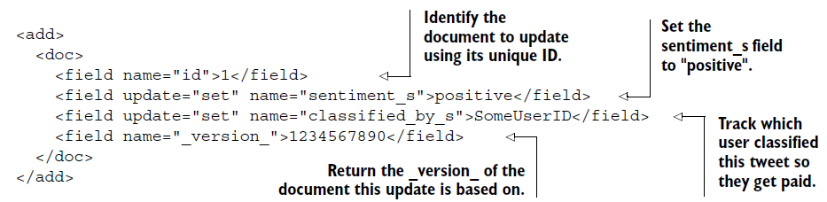

[TOC]

*  이 장에서 다룰 내용
*  문서 색인 생성을 위한 스키마 설계
   * schema.xml에서 필드 및 필드 유형 정의
   * 구조화 된 데이터에 필드 유형 사용
   * 업데이트 요청, 커밋 및 아토믹 업데이트 처리
   * solrconfig.xml에서 색인 설정 관리

3 장에서는 Solr가 가장 간단한 형식의 용어 사전과 각 용어가 나오는 문서 목록 인 역 색인을 사용하여 문서를 찾는 방법을 학습했습니다. Solr는 이 색인을 사용하여 사용자의 검색어에 있는 단어와 해당 단어가있는 문서를 비교합니다. 이 장에서는 Solr가 문서를 처리하여 색인을 작성하는 방법을 학습합니다. 문서 인덱싱의 핵심 요소는 텍스트 분석입니다. 이 장에서는 인덱싱 프로세스와 비 텍스트 필드에 초점을 맞추어 6 장까지 텍스트 분석에 대해 자세히 설명하도록 하겠습니다.

이 장을 학습하고 나면 Solr에서 문서를 색인화하는 방법을 알게되며 field들과 field type들, 스키마 설계와 같은 주요 개념을 이해하게 됩니다. Solr를 로컬로 실행하고 있다면 2 장에서 다루었던 Solr 예제 서버를 사용하여 이 장을 더 쉽게 이해할 수 있습니다. Solr를 실행하지 않고도 대부분의 예제를 계속 따라 할 수 있습니다. 이 장을 읽고
다시 돌아와 직접 실행해보십시오.


## 5.1 Example microblog search application

이 장과 다음 장에서는 Twitter와 같은 유명한 소셜 미디어 사이트에서 마이크로 블로그 콘텐츠를 검색하기 위한 색인 생성 및 텍스트 분석 솔루션을 설계하고 구현합니다. 마이크로 블로그는 사람들이 소셜 네트워크에서 서로 공유하는 짧은 비공식 메시지 및 기타 미디어에 대한 일반적인 용어를 의미합니다. 마이크로 블로그의 예로는 트위터의 트윗, 페이스 북의 글 및 Foursquare의 체크인이 있습니다. 이 장에서는 Solr에서 마이크로 블로그를 나타내는 필드와 필드 유형을 정의하고 Solr에 문서를 추가하는 방법을 학습합니다.

6 장에서는 내장 된 Solr 도구를 사용하여 마이크로 블로그 콘텐츠에 대한 텍스트 분석을 수행하는 방법을 학습합니다. 이 예제에서 다루게 될 문서의 유형과 사용자가 검색할 수 있는 방법에 대해 살펴 보도록하겠습니다.


### 5.1.1 Representing content for searching (검색을 위한 콘텐츠 표현)

먼저, 표 5.1은 Solr에서 문서 인덱싱에 대해 배우기 위해 사용하는 가상 트윗의 일부 필드를 보여줍니다. 소셜 미디어 콘텐츠를 분석하는 데 관심이 없다고 하더라도이 예를 통해 학습한 내용은 대부분의 검색 응용 프로그램에 광범위하게 적용됩니다.


Solr 색인의 각 문서는 필드로 구성되며 각 필드는 저장, 검색 및 분석 방법을 결정하는 특정 유형을 가집니다. 표 5.1에는 마이크로 블로그 문서에 8개의 필드가 있습니다. 사용자가 이 필드를 사용하여 마이크로 블로그를 찾는 방법에 대해 생각해보십시오. 일반적인 사용자가 쿼리를 작성하는 데 사용할 수 있는 정보가 포함되어 있기 때문에 screen_name, type, timestamp, lang 및 text 필드는 검색 관점에서 사용하기 좋은 후보라고 생각합니다. 예를 들어 특정 날짜 이 후((timestamp : [2012-05- 01T00 : 00 : 00Z TO * ]))에 발생한 특정 사용자 (screen_name : thelabdude)의 모든 영어 트윗 (lang : en)을 보려는 사용자를 상상해 볼 수 있습니다 .

이 필드를 모두 인덱싱 할 수 있지만 수백만 개의 문서와 쿼리 볼륨을 지원하는 대규모 시스템을 개발하는 경우에는 사용자가 검색 할만한 필드만 포함시키고 싶을 것입니다. 예를 들어 user_id 필드는 Twitter의 내부 식별자이므로 사용자가 이 필드를 검색하지는 않을 것입니다. 일반적으로 각 필드는 색인의 크기를 증가시키므로 사용자에게 가치 있는 필드만 포함시켜야합니다.

favorites_count 필드는 트윗 작성자가 작성한 즐겨 찾기의 수이며 트윗의 즐겨 찾기 수는 아닙니다. 이 필드는 UI 관점에서 유용한 정보를 가지기 때문에 흥미가 갑니다. 그러나 검색 쿼리의 매개 변수로서 좋은 후보는 아닙니다. 저장된 필드와 인덱싱 된 필드에 대해 알아볼 때 섹션 5.2에서 이러한 디스플레이 지향 필드를 처리하는 방법에 대해 설명합니다.

이제 사용자가 이러한 필드를 사용하여 쿼리를 작성하는 방법에 대해 생각해봅시다. 그러면 Solr 인덱스에서 이러한 필드를 나타내는 방법을 결정하는 데 도움이 될 것입니다. 그림 5.1은 예제 마이크로 블로그 검색 응용 프로그램의 필드를 기반으로 한 가상 검색 양식을 보여줍니다.


검색 관점에서 유용하다고 확인된 각 필드들이 양식에 표시됩니다. 이것은 사용자가 색인의 특정 필드를 검색하는 방법에 대해 생각해야한다는 점이 검색 응용 프로그램을 설계 할 때의 핵심 포인트입니다. 이는 Solr에서 필드를 정의하는 방법을 결정하는 데 도움이됩니다.
이제 예제 애플리케이션의 필드에 대한 개념적 이해와 사용자가 이 필드를 사용하여 문서를 검색하는 방법에 대해 알아 보았습니다. 다음으로, Solr에 문서를 추가하는 방법에 대한 고수준의 내용을 학습하도록 하겠습니다.


### 5.1.2 Solr 색인 생성 프로세스 개요

상위 수준에서 Solr 인덱싱 프로세스는 다음과 같은 세 가지 핵심 작업으로 분류됩니다.

1. 원시 형식(native format)의 문서를 XML 또는 JSON과 같은 Solr가 지원하는 형식으로 변환합니다.
2. 몇 가지 잘 정의 된 인터페이스 (일반적으로 HTTP POST) 중 하나를 사용하여 Solr에 문서를 추가합니다.
3. 인덱싱 중에 문서의 텍스트에 변형을 적용할 수 있도록 Solr를 구성합니다.

그림 5.2는 Solr에서 문서를 색인화하는 세 가지 기본 단계에 대한 개략적인 개요를 제공합니다.
Solr는 XML, JSON, CSV를 비롯한 여러 가지 문서 색인 생성 형식을 지원합니다. 그림 5.2에서는 자체 설명 형식이 이해하기 쉽기 때문에 XML을 선택했습니다. 다음은 Solr XML 형식을 사용하여 예제 트윗을 표시하는 방법입니다.


각 필드는 XML로 표현되며 구문은 다소 단순합니다. 각 필드의 필드 이름과 값을 정의하기만 하면 됩니다. 당신이 보지 못하는 것은 텍스트 분석(text analysis) 또는 필드 유형에 관한 것입니다. 그 이유는 그림 5.2에 표시된 schema.xml 문서에서 필드가 분석되는 방법을 정의하기 때문입니다.

Solr는  2 장에서 알아본 것 처럼 문서 추가 및 업데이트를 위한 문서 업데이트 서비스를 포함하여 모든 핵심 서비스에 기본 HTTP 기반 인터페이스를 제공한다는 것을 상기 해보십시오. 그림 5.2의 왼쪽 위에, Solr의 문서 업데이트 서비스에 대해 HTTP POST를 사용한 예제 트윗의 XML 전송이 나와 있습니다. 이 장의 뒷부분에서 XML, JSON 및 CSV와 같은 특정 문서 유형을 추가하는 방법에 대해 자세히 설명합니다. 지금은 문서에서 각 필드의 내용을 확인한 다음 텍스트 분석 프로세스를 호출하는 추상 구성 요소로 문서 업데이트 서비스를 생각해보십시오. 각 필드가 분석 된 후 결과 텍스트가 색인에 추가되므로 문서를 검색 할 수 있습니다.


5.5 절에서 색인 생성 프로세스가 작동하는 방식에 더 자세히 알아볼 것입니다. 인덱싱 프로세스에 대한 높은 수준의 개요는 아직까진 기본 개념에 더 중점을 두어야하기 때문에 지금으로써는 충분합니다. 그보다는 Solr가 그림 5.2에서 설명한 schema.xml을 사용하여 색인 생성 프로세스를 수행하는 방법에 대해 이해해야합니다.
schema.xml은 문서의 필드와 필드 유형을 정의합니다. 간단한 응용 프로그램의 경우 검색 할 필드와 해당 유형이 명확 할 수 있습니다. 그러나 일반적으로 스키마에 대한 사전 계획을 세우는 것이 좋습니다.


## 5.2 Designing your schema (스키마 디자인)

마이크로 블로그 검색 응용 프로그램 예제를 통해 문서를 작성하고 색인을 생성 할 필드를 정의해보았습니다. 실제로 이 프로세스는 실제 애플리케이션에서 항상 일어나지는 않고, 선행 설계 및 계획 작업을 수행하는 데 도움이 됩니다. 이 섹션에서는 검색 응용 프로그램의 주요 디자인의 고려 사항에 대해 알아 봅니다. 특히, 검색 응용 프로그램에 대한 다음과 같은 질문에  대한 답에 대해 배우게됩니다.

* 색인의 문서란 무엇입니까?
* 각 문서는 어떻게 고유하게 식별됩니까?
* 사용자가 문서에서 어떤 필드를 검색 할 수 있습니까?
* 검색 결과에서 사용자에게 표시 할 필드는 무엇입니까?

다른 질문들에 대한 답에 영향을 주는 검색 응용 프로그램에서 문서의 적절한 세분성을 결정하는 것부터 시작해봅시다.


### 5.2.1 Document granularity (문서 세분성)

Solr 인덱스에서 문서가 나타내야 하는 것을 결정하면 전체 스키마 디자인 프로세스가 진행됩니다. 어떤 경우에는 트윗 예제와 같이 명백합니다. 텍스트 콘텐츠는 일반적으로 짧기 때문에 각각의 트윗이 문서가됩니다. 그러나 기술적인 컴퓨터 책과 같이 색인을 생성하려는 내용이 큰 경우 큰 문서의 하위 섹션을 인덱싱 된 단위로 처리해야 할 수도 있습니다. 핵심은 사용자가 검색 결과에서 보고 싶은 내용이 무엇인가 입니다. 색인을 위한 문서가 무엇인지 생각하는데 도움이 될만한 다른 예제를 보도록 하겠습니다.

기술 컴퓨터 책을 판매하는 웹 사이트에서 "text analysis"을 검색한다고 가정 해보십시오. 사이트가 각 서적을 하나의 문서로 취급했다면 사용자는 검색 결과에서 Solr in Action을 볼 수 있지만 책에서 "text analysis"가 포함된 위치를 찾으려면 목차나 색인을 통해 해당 페이지로 이동해야합니다. 그림 5.3에서 왼쪽 이미지는 전체 책이 단일 문서로 색인 될 때 검색 결과가 어떻게 표시되는지 보여줍니다.

사이트에서 각 책의 개별 장을 색인의 문서로 취급 한 경우 검색 결과는 그림 5.3의 오른쪽에 표시된 것처럼 Solr in Action의 "Text analysis"장을 맨 위에 표시 할 수 있습니다. 그러나 text analysis가 검색의 핵심 개념이기 때문에 이 책과 다른 검색 서적의 다른 장의 대부분이 관련성이 높은 결과로 포함될 수 있습니다. 너무 세분화되어 있으면 사용자가 너무 많은 결과를 받게 될 수 있습니다.

또한 색인을 생성하는 콘텐츠의 유형을 고려해야 할 수도 있습니다. 기술적 인 컴퓨터 책을 챕터별로 나누는 것은 의미가 있지만 픽션 소설을 챕터별로 나누는 것은 좋은 접근 방법처럼 보이지는 않습니다. 결국 인덱스에서 문서를 만드는 것은 사용자의 선택이지만 문서 세분화가 사용자 환경에 미치는 영향을 확실하게 고려해야합니다. 일반적으로 사용자가 나무에 대한 숲을 놓치지 않고 가능한 한 세분화 된 문서를 원하게 됩니다.


```
Solr hit highlighting
Solr는 검색 결과에서 더 긴 문서의 관련 섹션을 강조 표시 할 수 있는 히트 강조 표시 기능을 제공합니다. 긴 문서를 더 작은 단위로 나눌 수는 없지만 사용자가 대용량 문서의 관련성이 높은 섹션으로 빠르게 이동할 수 있게하려는 경우에 유용합니다. 예를 들어 히트 하이라이트를 사용하여 해당 구문이 포함 된 모든 문서에서 "text analysis"라는 문구를 둘러싼 짧은 텍스트 미리보기를 표시 할 수 있습니다. 우리는 9장에서 하이라이트에 대해 깊이 있게 알아볼 것입니다.
```


### 5.2.2 Unique key (고유 키)

문서가 무엇인지 파악한 후에는 색인의 각 문서를 고유하게 식별하는 방법을 결정해야합니다. 책의 경우 ISBN 번호 일 수 있습니다. 챕터의 경우 ISBN 번호 + 챕터 번호가 될 수 있습니다. Solr는 각 문서에 대해 고유 한 식별자가 필요하지는 않지만 제공되는 경우 Solr는 이를 사용하여 색인에서 문서가 중복되지 않도록 합니다. 데이터베이스에 대한 사전 지식이 있는 경우 고유 식별자는 테이블의 행에 대한 기본 키에 해당한다고 생각하시면 됩니다. 동일한 고유 키를 가진 문서가 인덱스에 추가되면 Solr는 기존 레코드를 최신 문서로 덮어 씁니다. 우리는 섹션 5.3.5의 고유 키에 대해 알아볼 것입니다.

섹션 5.1의 예제 microblog 검색 응용 프로그램의 경우 트윗에는 이미 고유 식별자 필드 인 id가 포함되어 있습니다. 그러나 다양한 소셜 미디어 소스에서 콘텐츠를 색인 생성하는 경우 트위터와 같은 것을 추가 할 것입니다. 접두어로 이 문서를 동일한 숫자 ID 값을 가진 Facebook 게시물과 차별화 할 수 있습니다.


### 5.2.3 Indexed fields (색인 필드)

색인에 대해 문서가 나타내는 내용과 각 문서를 고유하게 식별하는 방법을 결정했으면 다음 단계는 문서에서 색인 필드를 결정하는 것입니다. 인덱싱 된 필드를 고려하는 가장 좋은 방법은 일반 사용자가 해당 필드를 사용하면 의미있는 쿼리가 될 수 있는지를 판단하는 것입니다. 또 다른 방법으로는 사용자가 검색 양식에서 쿼리 가능 옵션을 제공하지 않은 경우 사용자가 원하는 결과를 얻지 못하는지 판단해보는 것입니다.

예를 들어, 모든 책에는 제목과 저자가 있습니다. 책을 검색 할 때 사람들은 일반적으로 제목과 저자를 기준으로 관심 도서를 찾을 것이므로 이 필드들은 모두 색인을 생성해야합니다. 모든 책에는 편집자가 있지만 일반적으로 사용자는 책을 찾을 때 편집자의 이름으로 검색하지는 않으므로 편집자의 이름은 색인 필드 일 필요는 없습니다. 반대로 도서 출판 업계의 검색 색인을 작성하는 경우에는 사용자가 편집자의 이름으로 검색하기를 원할 것입니다. 따라서 이 때에는 색인 필드로 포함 시켜야 합니다.

검색을 활성화하는 것 외에도 필드 내의 값에 대한 정렬, 패싯, 그룹화, 쿼리 제안 기능을 제공하거나 함수 쿼리 실행이 필요한 경우 필드를 인덱싱해야합니다. 특정 고급 설정 (9 장 참조)을 사용하면 필드를 인덱싱하는 경우 히트 하이라이트의 속도를 높이는 데 유용합니다. 이 기능들 각각은 이 책의 후반부에서 다루며, 많은 사람들이 이 기능들을 정리하여 자신만의 챕터를 만듭니다. 기본적으로 검색 결과에서 원래 필드 값을 반환하지 않는 필드 값에 대한 연산을 수행해야하는 경우 필드를 인덱싱해야 할 가능성이 큽니다.

색인에 포함 할 필드를 결정하는 것은 모든 검색 응용 프로그램 마다 다릅니다. 문서의 색인 필드에 대해 잠시 생각해보십시오. 이 장의 나머지 부분을 진행하면서 이들을 참조해야하기 때문에 이 내용들을 숙지하고 있어야 합니다. 앞서 알아본 마이크로 블로그 예제에서는 screen_name, type, timestamp, lang 및 text 필드를 색인화해야합니다. id 및 user_id 필드는 Twitter에서 내부적으로 사용되기 때문에 사용자가 이 필드로 검색할 수 없게 하더라도 문제될 것이 없습니다.


### 5.2.4 Stored fields (저장된 필드)

사용자가 읽을 도서를 찾기 위해 편집자 이름으로 검색을 하지 않더라도 검색 결과에 편집자의 이름을 포함시키고 싶을 수도 있습니다. 일반적으로 문서에는 검색 관점에서 유용하지는 않지만 검색 결과에 포함시키면 유용한 필드들이 있을 수 있습니다.  Solr에서는 이를 저장 필드(Stored fields)라고합니다. 많이 사용되는 _count 필드는 인덱싱되지는 않지만 표시 목적으로 유용한 저장된 필드의 좋은 예입니다. 사용자는 검색 결과에서 어떤 저자가 다른 저자보다 더 인기가 있는지 확인 할 수 있는 것은 유용하지만 사용자가 이 필드로 검색하기를 원하지는 않을 것입니다. 물론 마이크로 블로그 검색 응용 프로그램의 screen_name, timestamp 및 text 필드와 같이 필드를 인덱싱하여 저장할 수 있습니다. 각 필드는 검색하여 결과에 표시 할 수 있습니다.

검색 응용 프로그램 아키텍트로써의 목표 중 하나는 색인 크기를 최소화하는 것입니다. Solr를 고려하고 있다면 대용량의 문서 및 사용자를 처리 할 수 있는 확장성이 필요한 응용 프로그램을 사용 중일 가능성이 큽니다. 인덱스의 각 저장된 필드는 디스크 공간을 사용하므로 저장된 값을 읽어 검색 결과에 반환하기 위해 CPU 및 I / O 리소스가 필요합니다. 그렇기 때문에 특히 대규모 응용 프로그램의 경우 저장된 필드를 현명하게 선택해야합니다.

이 시점에서 검색 응용 프로그램을 디자인하기 위한 방법들에 대해 잘 알고 있어야합니다. 계획을 세운 후에는 이제 소매를 걷어올리고 Solr의 schema.xml을 사용하여 디자인을 구현해야합니다. 그림 5.2에서 보았 듯이 schema.xml은 Solr가 문서의 색인을 생성하는 방법을 이해하는 데 사용하는 기본 구성 문서입니다. schema.xml의 주요 섹션을 미리 살펴보고 이 장의 다음 두 섹션에 걸쳐 어떤 것들이 저장되어 있는지 살펴 봅시다.


### 5.2.5 Preview of schema.xml (schema.xml 미리보기)

다음 몇 섹션에 걸쳐 예제 microblog 검색 응용 프로그램에서 사용할 schema.xml 문서를 작성해보도록 하겠습니다. schema.xml 파일은 Solr 코어의 conf/ 디렉토리에 있습니다. Solr 서버 예제의 schema.xml은 $ SOLR_INSTALL/example/solr/collection1/conf/에 있습니다. 다음 목록은 XML 구문과 중요한 요소에 대한 느낌을주기 위해 Solr와 함께 제공되는 schema.xml 를 합축하여 보여줍니다.


단번에 이 문서의 모든 세부 사항에 압도 당하기 쉽습니다. 이 장의 마지막 부분에서는 이러한 모든 세부 사항을 명확하게 이해하게 될 것이므로 자신 만의 schema.xml을 만들 수 있는 준비가 되어있을 것입니다. 지금은 schema.xml 문서의 세 가지 주요 섹션에 주목할 것입니다.

1. 문서의 기본 구조를 정의하는 데 사용되는 `<field>` 및 `<dynamicField>` 요소를 포함하는 `<fields>` 요소
2. `<fields>` 요소 뒤에 나열된 `<uniqueKey>` 및 `<copyField>`와 같은 기타 요소
3. 날짜, 숫자 및 텍스트 필드가 Solr에서 처리되는 방법을 결정하는 `<types>` 요소 하위의 필드 유형

우리는 다가올 페이지들에서 이 주요 섹션 각각에 대해 작업해볼 것입니다. 먼저 `<fields>` 섹션부터 살펴 보겠습니다.


## 5.3 Defining fields in schema.xml (schema.xml에 필드 정의하기)

schema.xml의 `<fields>` 섹션은 문서의 모든 필드에 대한 `<field>` 요소를 정의합니다. Solr는 schema.xml의 필드 정의를 사용하여 문서의 필드에 대해 수행해야하는 분석의 유형을 파악하여 역 검색 색인 (제 3 장 참조)에 용어 내용을 추가합니다. 이 절에서는 schema.xml에서 필드, 동적 필드 및 필드를 정의하는 방법을 학습합니다. 5.2 절의 스키마 디자인의 기본 개념을 살펴본 이후라면 예제 마이크로 블로그 검색 응용 프로그램에 `<field>` 요소를 정의 할 준비가 된 것입니다. 다음 목록은 예제 응용 프로그램의 인덱싱 된 필드와 저장된 필드를 정의합니다.


이 필드 정의를 통해 Solr는 마이크로 블로그 문서를 그림 5.1과 유사한 양식을 사용하여 검색 할 수 있도록 색인을 생성하는 방법을 알게됩니다. schema.xml에 필드를 정의 할 때 Solr에 제공해야하는 몇 가지 필수 속성이 있습니다.


### 5.3.1 Required field attributes (필수 필드 속성)

각 입력란에는 검색어를 구성 할 때 사용되는 고유 한 이름이 있습니다. 예를 들어, query screen_name : thelabdude는 screen_name 필드에서 thelabdude 값을 검색합니다. Listing 5.3에서는 screen_name 필드를 다음과 같이 정의했습니다.

```
<field name="screen_name"
  type="string"
  indexed="true"
  stored="true" />
```

비전문가(layman)의 용어로 이 정의는 screen_name 필드가 색인화되고 저장되며 문자열 값을 포함한다는 것을 의미합니다. 각 필드는 해당 필드에 사용할 `<fieldType>`을 식별하는 type 속성을 정의해야합니다. 우리는 다음 절에서 필드 유형을 자세하게 다룰 것입니다. 각 필드는 색인 생성 및 / 또는 저장 여부를 정의해야합니다. 5.2 절에서 논의했듯이 색인 필드를 검색하고 정렬 할 수 있으며 (나머지 기능에 대해서는이 설명서에서 다룰 예정 임) 저장된 필드는 표시 목적으로 검색 결과에 반환 될 수 있습니다. 예제에서의 대부분의 필드와 마찬가지로 필드가 색인화되고 저장 될 수 있습니다.

또한 Solr에 중첩 된 필드가 없다는 것을 알아 두십시오. 모든 필드는 schema.xml의 형제이며 이는 평면(flat) 문서 구조 임을 의미합니다.  3 장에서 알아보았 듯이 Solr의 문서는 flat 구조에서 비정규화 되어야 하며, 검색 요구 사항을 지원하는 데 필요한 모든 필드를 포함해야합니다. 즉, 관계형 구조가 없다는 것은 다른 문서와 조인하여 서비스 조회 또는 결과 생성에 대한 추가 정보를 가져올 수 있다는 의미입니다.

```
Solr의 조인
Solr의 문서 조인 (document joins)에 관한 내용을 틀림없이 웹에서 만나게 될 것입니다. 이 기능에 대해서는 15 장에서 자세하게 다룰 것입니다. Solr 조인은 SQL의 join 보다 서브 쿼리와 유사하다는 것을 이해하는 것이 중요합니다. 일반적인 사용 사례는 검색 기준과 일치하는 하위 문서의 상위 문서를 찾아내는 것입니다. 예를 들어, 마이크로 블로그 애플리케이션에서는 Solr 조인을 사용하여 리트 윗 대신 원본 게시물을 가져올 수 있습니다.
```

필드가 저장 될 때 혼란스러울만한 점은 Solr로 분석 된 값이 아닌 원래 값을 저장한다는 것입니다.  예를 들어, 목록 5.3에서 indexed = "true"와 stored = "true" 텍스트 필드를 선언했었습니다.  이는 텍스트 필드를 검색 할 수 있으며 검색 결과에 원래 텍스트를 반환 할 수 있다는 것을 의미합니다. Solr는 필드를 요청할 때 검색 결과에서 분석 된 값을 반환하지 않습니다. 물론 검색 결과에 필드를 반환하지 않는다면 저장할 필요는 없습니다.

인덱스의 크기가 커지고 쿼리 속도가 느려지더라도 문서의 모든 필드를 저장해야하는 경우도 있습니다. 색인이 생성 된 후 Solr 내의 문서에서 필드를 업데이트하려면 Solr가 각 필드의 원본 내용을(외부 소스에서 전체 문서를 다시 보내지 않고) 복사 할 수 있도록 모든 필드를 저장해야합니다. 문서 업데이트에 대해서는 5.6.3 절에서 자세히 설명합니다.


### 5.3.2 Multivalued fields (다중 값 필드)

지금까지 마이크로 블로그 검색 응용 프로그램에서는 간단한 몇가지 필드만을 사용했었습니다. 더 복잡한 문서 구조를 다룰 때의 Solr의 강점들에 대해 연습해보기 위해 몇 가지 필드를 추가해봅시다. 특히 각 문서와 관련 짓는 0개 이상의 링크가 포함 된 링크 필드에 대한 지원을 추가해 보겠습니다. Twitter에서 경험 해봤 듯이 사용자는 웹상의 사진이나 기사와 같은 관련 콘텐츠에 대한 링크를 퍼갈 수 있습니다. 다음은 두 개의 링크가 포함 된 또 다른 가상의 트윗의 예입니다.

```
Just downloaded the ebook of #SolrInAction from @ManningBooks http://bit.ly/T3eGYG to learn more about #Solr http://bit.ly/3ynriE
```

이 문서의 링크는 표 5.2에 표시된 웹 사이트로 연결되는 http://bitly.com에서 제공하는 단축 URL입니다.


검색 관점에서 변환 된 링크를 색인에 추가하면 사용자가 특정 웹 사이트 또는 페이지로 연결되는 소셜 미디어 콘텐츠를 찾을 수 있게 됩니다. 사용자가 Solr In Action 페이지 (http://manning.com/grainger/)를 링크시킨 모든 트윗을 찾고 싶다고 상상해보십시오. 이 예제에는 두 개의 링크가 포함되어 있으므로 한 필드에 두 개의 값을 인코딩하는 방법이 필요합니다. Solr에서는 문서 당 둘 이상의 값을 가질 수있는 필드를 다중 값 필드(Multivalued fields)라고합니다. schema.xml에서 필드 정의에 multiValued = "true"를 설정하여 다중 값 필드를 선언합니다.

```
<field name="link"
  type="string"
  indexed="true"
  stored="true"
  multiValued="true"/>
```

여러 링크를 가진 문서를 추가 할 때 이 목록에 설명 된대로 XML 문서에 여러 링크 필드를 추가합니다.


검색 할 때 "http://manning.com/grainger/"링크를 쿼리하면 Solr은 다중 값 필드의 모든 값에서 일치하는 항목을 찾습니다.

지금까지의 마이크로 블로그 문서에는 필드 수가 적어서 schema.xml에서 각 필드를 별도로 선언 할 수 있었습니다. 하지만 실제로는 모든 문서가 그렇게 단순하거나 희소하지는 않습니다. 더 크고 복잡한 문서 구조를 다루는 데 도움이되는 동적 필드(dynamic field)라는 또 다른 유형의 필드를 살펴 보겠습니다.


### 5.3.3 Dynamic fields (동적 필드)

Solr에서는 동적 필드를 사용하여 이름이 접두사 또는 접미사 패턴 (예 : s_ * 또는 * _s)과 일치하는 문서의 모든 필드에 동일한 정의를 적용 할 수 있습니다. 동적 필드는 특수한 명명 체계를 사용하여 이러한 종류의 glob 스타일 패턴과 일치하는 모든 필드에 동일한 필드 정의를 적용합니다. 동적 필드는 검색 애플리케이션을 구축 할 때 발생하는 다음과 같은 일반적인 문제를 해결합니다.

* 많은 필드가있는 문서 모델링
* 다양한 출처의 문서 지원
* 새 문서 소스 추가

동적 필드를 사용하여 수행 할 수 있는 작업들에 대한 이해를 위해 이러한 사용 사례 를 하나하나 살펴 보겠습니다. 무엇보다 Solr에서 동적 필드를 굳이 사용할 필요는 없다는 것을 알아야합니다. 위와 같은 사용 사례 중 어느 것도 애플리케이션에 적용되지 않는 경우에는 동적 필드를 사용하지 않는 것이 좋습니다.

또한 Solr는 스키마를 사용하는 문서의 색인을 생성 할 때까지 schema.xml의 동적 필드 정의를 무시합니다. 실제로 많은 Solr 사용자는 Solr 예제 스키마와 함께 제공되는 동적 필드의 광범위한 목록을 유지하고 있습니다. 필요할 때 그 자리에 있는 것이 맞지만 그 외에는 무시됩니다.


#### MODELING DOCUMENTS WITH MANY FIELDS (대량의 필드에 대한 문서화 모델링)

동적 필드는 접두사 또는 접미사 패턴을 일치시키고 schema.xml의 동일한 필드 정의를 일치하는 모든 필드에 적용하여 많은 필드가있는 문서를 모델링하는 데 도움이됩니다. Listing 5.3에서는 type, screen_name 및 lang 필드에 string 필드 유형을 사용했었습니다. 또한, 각 필드는 저장되고 색인됩니다.(이름 외에는 각 필드 정의가 완전히 동일)

이 세 가지 필드 외에도 수십 개의 문자열 필드가 저장되고 색인화되어 있다고 가정 해보십시오. 또한 각 필드에 대한 명시적으로 정의를 입력하거나 필드 이름에 접미사 패턴을 사용하여 이 모든 string 필드들을  단일 <dynamicField> 요소로 정의할 수 있습니다.

```
<dynamicField name="*_s" type="string" indexed="true" stored="true" />
```

이 glob 패턴을 사용하면 `_s`로 끝나는 이름을 가진 필드는 `subject_s`와 같이 이 필드 정의를 상속합니다. 또는 접두사 패턴 `s_*`을 사용할 수도 있습니다. 이와 같이 동적 필드는 많은 필드가 있을 때 입력을 절약하고 schema.xml을 단순화하는 데 도움이됩니다.

이전 섹션의 링크 필드와 같이 다중 값 필드에도 동적 필드를 사용할 수도 있습니다. 다음 동적 필드 정의에는 multiValued = "true"가 포함되어 있습니다.

```
<dynamicField name="*_ss" type="string" indexed="true" stored="true"
multiValued="true"/>
```

다중 값 링크의 경우 XML 문서는 아래 목록에서 볼 수있는 것처럼 여러 링크의 필드 이름으로 link_ss를 사용해야합니다.


#### SUPPORTING DOCUMENTS FROM DIVERSE SOURCES (다양한 출처의 문서 지원)

동적 필드의 또 다른 이점은 공통 기본 스키마를 공유하는 문서가 혼합되어 있어도 고유 한 필드가 있는 문서를 지원할 수 있다는 것입니다. 물론, 문서에 공통 기본 스키마가 없으면 동일한 인덱스가 아님을 의미할 것입니다! 소셜 미디어를 예로 Twitter, Facebook, YouTube 및 Google+에서 문서를 색인하면 각 소스의 문서에 각 소셜 네트워크에 대한 고유 한 필드가 있습니다.  이러한 소스 관련 필드를 동적 필드로 처리하는 것이 더 직관적이고 유지 관리가 쉽다고 생각합니다. 예를 들어, 다음 예제와 같이 각 소스에 대해 많은 필드를 정의하는 대신


`*_s` 접미사 패턴을 이름으로 사용하여 단일 문자열 동적 필드를 사용하여 동일하게 수행 할 수 있습니다.

```
<dynamicField name="*_s" type="string" indexed="true" stored="true" />
```

색인을 생성 할 때 다음 목록과 같이 `_s` 접미어가 붙은 필드를 보내야합니다.


#### ADDING NEW DOCUMENT SOURCES (새로운 문서 소스 추가하기)

이전에 발견하지 못한 필드가 있는 응용 프로그램의 새 데이터 소스를 추가하면 인덱싱 중에 필드를 포함 할 수 있으며 동적 필드를 사용할 때 자동으로 선택됩니다. 새로운 소셜 네트워크는 매일 온라인으로 보이므로 이 새로운 소스의 문서를 처리하기 위해 schema.xml을 지속적으로 수정하고 싶지는 않을 것입니다. 동적 필드를 사용하면 schema.xml을 변경하지 않고 새 문서 소스에서 도입 한 새로운 필드를 포함 할 수 있습니다.

콘텐츠가 네트워크에 게시되었을 때 달의 위상을 캡처하는 필드를 포함하는 새로운 소셜 네트워크에 대한 지원을 추가하려고한다고 가정합니다 (데이트 사이트 일 가능성이 있음). 동적 필드를 사용하면 이 필드를 문서의 문자열로 포함 할 수 있습니다.

```
<field name="moon_phase_s">waxing crescent</field>
```

동적 필드는 인덱싱 측면에서 편리한 기능이 될 수 있지만 쿼리 측면에는 실제적인 효력은 없습니다. 동적 필드로 인덱싱 된 문서를 쿼리 할 때는 쿼리에서 전체 필드 이름을 사용해야합니다.  `* _s : coffee`와 같은 접두어 또는 접미어 패턴을 사용해서 질의하여 모든 문자열 필드에서 일치하는 항목을 찾기 위해 쿼리를 공식화(formulate) 할 수 없습니다. 오히려`subject_s : coffee`, `keyword_s : coffee`와 같이 질의 할 문자열 필드를 명시적으로 식별해야합니다. 그러나 하나 이상의 필드 (동적 또는 정적)에서 일치 항목을 찾으려면 Solr는 복사 필드(Copy fields)를 사용하여 현명한 방법을 제공합니다.


### 5.3.4 Copy fields (복사 필드)

Solr에서 복사 필드를 사용하면 하나 이상의 다른 필드에서 하나의 필드를 채울 수 있습니다. 특히, 복사 필드는 대부분의 검색 응용 프로그램에서 일반적인 두 가지 사용 사례를 지원합니다.

* 단일 범용 필드에 여러 필드의 내용을 채우는 경우
* 동일한 필드 컨텐츠에 다른 텍스트 분석을 적용하여 새로운 검색 가능 필드를 작성하는 경우


#### CREATE A CATCH-ALL FIELD FROM MANY FIELDS (많은 필드에서 CATCH-ALL 필드 생성)

대부분의 검색 응용 프로그램에서 사용자는 쿼리를 입력 할 단일 검색 상자가 제공됩니다. 이 방법의 목적은 사용자가 복잡한 양식을 작성하지 않고도 신속하게 문서를 찾을 수 있도록 돕는 것입니다. Google에 간단한 검색 창이 얼마나 성공적 이었는지 생각해보십시오. 트윗 예제에서는 당신은 그것이 쉽게 느껴질 것입니다. (트윗 텍스트를 검색하기만 하면 됐었습니다.) 그러나 이 방법을 사용하면 트윗 예제에서는 사용자가 @thelabdude를 검색할 경우 텍스트가 아닌 screen_name 필드에 정보가 포함되어 있기 때문에 사용자가 원하는 결과를 찾지 못할 것입니다. 또한 트윗에 bit.ly 스타일의 단축 URL이 포함되어 있으면 텍스트 필드에서 "resolved" URL에 대한 검색이 링크 필드에 저장된 것과 일치하지 않습니다. 여기서 원하는 것은 screen_name, text 및 resolved link 필드의 텍스트가 포함 된 포괄적 인 검색 필드입니다. 고맙게도 Solr는 `<copyField>` 지시문을 사용하여 문서의 다른 많은 필드에서 하나의 포괄적 인 검색 필드를 쉽게 만들 수 있습니다.

먼저 다른 필드가 복사 될 대상 필드를 정의해야합니다. 이 필드의 이름을 catch_all이라고합시다.


이것은 정의에 두 가지 중요한 측면이 있다는 점을 제외하고는 다른 모든 필드와 유사합니다.
첫째, 이 필드는 저장되지 않습니다 (stored = "false"). 이는 사용자에게 여러 필드가 결합 된 blob을 표시하지 않기 때문에 의미가 있습니다. Solr가 복사 필드를 반환할 원본 값이 없기 때문에 표시하고 싶어도 할 수 없습니다. Solr는 저장된 필드의 원래 값을 반환한다는 것을 기억하십시오.

둘째, 원본 필드 중 하나가 다중 값인 경우 대상 필드는 다중 값 필드 여야합니다 (multiValued = "true"). 이 경우 링크 필드는 다중 값을 갖기 때문에 복사 필드를 다중 값으로 정의해야합니다. 또한 소스 필드가 모두 단일 값인 경우에도 대상 필드에 둘 이상의 소스 필드를 복사하려면 multi-Valued = "true"로 설정해야합니다.

이제 대상 필드를 정의 했으므로 `<copyField>` 지시문을 사용하여 복사 할 필드를 Solr에게 알려줘야합니다. 다음 목록은 Solr의 `<copyField>` 지시문을 사용하여 screen_name, text 및 link 필드의 값을 catch_all 필드에 복사하는 방법을 보여줍니다.


`<copyField>` 요소는 schema.xml의 `<fields>` 및 `<types>` 요소의 형제(sibling)입니다. 왜 그런지 한번 생각해보십시오. 이것을 이해하는 가장 좋은 방법은 먼저 소스 및 대상 (dest) 필드를 정의한 다음 모든 필드가 정의 된 후에 copyField 지정 문과 연결해야한다는 것입니다.


#### APPLY DIFFERENT ANALYZERS TO A FIELD (필드에 다른 분석기 적용)

단일 필드의 내용을 다르게 분석하려고 할 수 있습니다. 6 장에서 볼 수 있듯이, 형태소 분석은 Recall (3 장에서 다룸)을 향상시키기 위해 용어를 하나의 stem으로 알려진 공통 기본 형태로 변형시키는 기법이다. 형태소 분석을 통해  fishing, fished, fishes라는 용어는 모두 fish라는 공통 stem로 축소 될 수 있습니다. 따라서 형태소 분석은 단어의 가능한 모든 언어적 형태를 생각하지 않고도 사용자가 문서를 찾을 수 있도록 도와줍니다. 이는 일반적인 텍스트 검색 필드에 대한 좋은 접근 방법입니다.

형태소 분석이 "type-ahead" 자동완성 기능에 미치는 영향을 고려하십시오. 이 경우 형태소 분석은 전체 용어가 아닌 계량 된 값만 제안 할 수 있다는 점에서 사용자에게 효과적입니다. 형태소 분석을 사용하면 예를 들어, 사용자가 자동완성 텍스트 상자에 human을 입력하기 시작했을 때 검색 응용 프로그램이 humane 또는 humanities를 제안 할 수 없습니다. Solr 복사 필드는 인덱스에 스토리지를 복제 할 필요없이 형태소 분석과 같은 특정 텍스트 분석 기능을 활성화 또는 비활성화 할 수있는 유연성을 제공합니다. schema.xml에서 다음 목록을 고려하십시오.


이 경우 텍스트 필드에는 stemmed_text라는 필드 유형이 있습니다. 이는 텍스트가 stem 되었음을 의미합니다. auto_suggest 필드는 stem되지 않습니다. <copyField> 지시문을 사용하여 auto_suggest 필드에 텍스트 필드의 문장이 없는 텍스트를 채웁니다. Solr는 텍스트 필드의 원시 분석되지 않은 내용을 auto_suggest 필드로 보냅니다.이 필드는 다른 텍스트 분석 전략을 허용합니다. 원본 텍스트 값은 한 번만 저장됩니다. 다시 말하면 검색 결과에서 auto_suggest 필드의 원래 값을 반환하지 않으므로 "false"가 저장됩니다. 10 장에서 자체 자동 완성 기능을 구현하는 방법에 대해 자세히 배울 수 있습니다.


### 5.3.5 Unique key field (고유 키 필드)

5.2.2 절에서 고유 한 ID 값을 사용하여 색인에서 고유하게 식별 가능한 문서를 만드는 것에 대해 알아보았습니다. 요약하면 각 문서에 대해 고유 식별자 필드를 제공하여 Solr는 색인 생성 중에 중복을 피할 수 있습니다. 또한 여러 서버에 Solr 색인을 배포하려는 경우 문서의 고유 식별자를 제공해야합니다. 이러한 이유로 처음부터 문서의 고유 식별자를 정의해 놓는 것이 좋습니다. 마이크로 블로그의 예제에서 id 필드는 고유하므로 schema.xml의 `<uniqueKey>` 요소를 사용하여 문서의 고유 키로 해당 필드를 사용하도록 Solr을 구성합니다.


한 가지 주의해야 할 것은 Solr가 인덱싱 중에 값을 변경하지 않도록하는 `<uniqueKey />` 필드에 string 또는 long과 같은 기본 필드 유형을 사용하는 것이 가장 좋습니다. 텍스트 기반 키의 형식으로 문자열을 사용하지 않으면 Solr가 결과를 올바르게 반환하지 않는 경우가 있습니다. 고유 한 키 필드에 대한 문제를 해결하고 문자열 또는 다른 기본 필드 유형 중 하나를 사용하십시오.

이 시점에서 우리는 schema.xml에서 필드를 정의하는 기본 적인 부분을 모두 다뤘습니다.  다중 값(multivalued), 동적(dynamic), 복사 필드(copy fields)를 사용해야하는 시점에 대해서도 잘 알고 있어야합니다. 이제 필드 유형을 정의하는 방법을 배우기 위해 Solr의 schema.xml의 다음 주요 섹션을 살펴볼 차례입니다.


## 5.4 Field types for structured nontext fields (구조화 된 비 텍스트 필드의 필드 유형)

이 섹션에서는 날짜, 언어 코드 및 사용자 이름과 같은 구조화 된 데이터를 처리하기 위한 필드 유형을 정의하는 방법을 학습합니다. 6장에서는 트윗 예제의 본문과 같은 텍스트 필드의 필드 유형을 정의하는 방법을 학습합니다. 일반적으로 Solr는 숫자, 날짜 및 지리적 위치 필드와 같은 구조화 된 데이터에 대해 여러 가지 내장된 필드 유형을 제공합니다. 그림 5.4는 Solr에서 보다 일반적으로 사용되는 필드 유형의 클래스 다이어그램을 보여줍니다.


가장 일반적인 필드 유형 중 하나 인 string을 살펴봄으로써 비 문자 데이터의 필드 유형에 대해 알아봅시다.


### 5.4.1 문자열 필드

우리의 트윗 예제의 경우 텍스트 필드 외에도 screen_name, type, timestamp, lang을 색인 필드로 설정했었습니다. 이제 각 필드에 대해 적절한 유형을 결정해야합니다. 이러한 각 필드에는 분석 할 필요가없는 구조화 된 데이터가 들어 있습니다. 예를 들어 lang 필드에는 en과 같이 트윗의 언어를 식별하는 데 사용되는 표준 ISO-639-1 언어 코드가 들어 있습니다. 사용자는 그림 5.5와 같이 lang 필드를 쿼리하여 영어 트윗을 찾을 수 있습니다.

언어 코드는 이미 표준화되어 있기 때문에 색인 작성 및 쿼리 처리 중에 Solr가 코드를 변경하는 것을 원하지는 않을 것입니다. Solr는 어떤식으로든 변경하면 안되는 구조화 된 값을 포함하는 필드에 문자열 필드 유형을 제공합니다. 다음 목록은 schema.xml에 문자열 필드 유형이 정의 된 방법을 보여줍니다.


그 뒤에는 모든 필드 유형이 Java 클래스 (이 경우 solr.StrField)로 구현됩니다. 런타임에 solr.StrField는 내장 된 Solr 클래스 인 org.apache.solr.schema.StrField로 해석됩니다. schema.xml에서 클래스의 접두사로`solr.`을 볼 때마다 정규화 된 Java 패키지 인 org.apache.solr.schema로 변환됩니다. 이 단축 표기법은 schema.xml의 복잡도를 줄이는 데 도움이됩니다. sortMissing-Last 및 omitNorms 속성은 5.4.4 절에서 더 자세히 설명 할 고급 옵션입니다.


lang 필드에 문자열 필드 유형을 사용하면 Solr는 문서에서 값 en을 가져 와서 색인 생성 중에 en으로 변경되지 않은 색인에 저장합니다. 쿼리시 정확한 값 en을 영어 문서와 일치시키기 위해 전달해야합니다. 그림 5.5에서 사용자는 영어를 선택 했으므로 양식을 처리 할 때 영어로 번역해야합니다. `<fieldType>` 문자열 또한 screen_name 및 type 필드에 좋은 유형으로 보이지만 타임 스탬프는 어떨까요?


### 5.4.2 Date fields (날짜 입력란)

날짜 필드로 검색하는 일반적인 방법은 사용자가 날짜 범위를 지정할 수 있도록하는 것입니다. 그림 5.5에서 사용자는 지정된 날짜 이후에 발생한 마이크로 블로그를 검색했습니다 (2012 년 5 월 1일). 쿼리 측면에서 이것은 타임 스탬프 필드에 대한 범위 쿼리 일 것입니다 :

```
timestamp:[2012-05-01T00:00:00Z TO *]
```

날짜 범위 내에서 검색하는 것이 일반적인 경우이기 때문에 Solr은 다음에 표시된 tdate라는 최적화 된 기본 제공 <fieldType>을 제공합니다.


분명히, 이것은 문자열 유형보다 무서워 보입니다! precisionStep 및 positionIncrementGap과 같은 추가 속성은 5.4.4 절에서 다루는 고급 옵션입니다. Solr.TrieDateField는이 필드 유형을 구현하는 Java 클래스 이름 지정 하기 위한 Solr의 약어입니다. 이 경우 org.apache.solr.schema.TrieDateField입니다. trie는 고급 정밀도에 따라 숫자 및 날짜 값을 효율적으로 검색 할 수있는 고급 트리 기반 데이터 구조입니다.

인덱싱 중에 Solr는 날짜를 구문 분석하는 방법을 알아야합니다. 5.1 절에서 우리가 인덱싱을 위해 Solr에 보낸 예제 XML 문서에는 timestamp 필드가 다음과 같이 포함되어 있음을 상기하십시오.

```xml
<add>
  <doc>
    ...
    <field name="timestamp">2012-05-22T09:30:22Z</field>
    ...
  </doc>
</add>
```

schema.xml에서 timestamp 필드는 tdate 유형을 사용하도록 구성됩니다.

```xml
<field name="timestamp" type="tdate" indexed="true" stored="true" />
```

일반적으로 Solr는 날짜가 ISO-8601 Date/Time 형식 (yyyy-MMddTHH : mm : ssZ)이 될 것이라 예상합니다. 트윗 (2012-05-22T09 : 30 : 22Z)의 날짜는 다음과 같이 분석됩니다.

```
yyyy = 2012
MM = 05
dd = 22
HH = 09 (24-hr clock)
mm = 30
ss = 22
Z = UTC Timezone (Z is for Zulu)
```

Solr에게 다른 형식으로 날짜를 보내면 인덱싱 중에 유효성 검사 오류가 발생하고 문서가 거부됩니다.


#### DATE GRANULARITY

다음으로 색인에서 날짜의 세분성을 결정해야합니다. 이렇게하면 사용자가 날짜를 사용하여 쿼리해야하는 방식을 다시 이해할 수 있습니다. 사용자가 주간에 문서를 쿼리하는 경우에만 초 또는 밀리 초의 정밀도로 날짜를 인덱싱 할 필요가 없습니다. 문서를 날짜순으로 정렬해야하는 경우 시간 단위의 세밀도가 투박할 수 있기 때문에 이 경우 분 수준의 세밀도를 원할 수 있습니다.

인덱싱 중에 Solr는 날짜 필드에 정확한 정밀도를 얻는데 도움을 주는 날짜 연산을 지원합니다. 시간 단위로 날짜를 인덱싱하기만하면 된다고 가정해 봅시다. 이렇게하면 색인의 공간을 절약 할 수 있지만 검색 시 사용자가 시간 범위보다 더 구체적으로 설정할 수는 없습니다. 색인을 생성 할 때 마지막에 /HOUR을 사용하여 날짜를 보낼 수 있습니다. /는 Solr에게 특정한 세분성으로 "잘라 낼" 것을 지시합니다. 예를 들어 시간 단위로 트윗을 인덱싱 할 수있는 방법을 살펴 보겠습니다.

```xml
<field name="timestamp">2012-05-22T09:30:22Z/HOUR</field>
```

인덱스에서 예제 문서의 타임 스탬프 필드 값은 2012-05-22T09:00:00Z 입니다. Date/Time을 정확하게 지정하는 것 외에도 Solr는 NOW 키워드를 지원하여 Solr 서버의 현재 시스템 시간을 얻어올 수 있습니다. 특정 날짜 또는 NOW 키워드를 Solr의 날짜 연산과 결합하여 강력한 날짜 계산을 수행 할 수 있습니다. 예를 들어, NOW / DAY는 현재 날짜의 자정으로 평가되고 NOW / DAY + 1DAY는 내일 자정으로 평가됩니다. 오늘부터 모든 문서를 조회하려면 [NOW / DAY TO NOW / DAY + 1 일}의 타임 스탬프를 사용하면됩니다. 7 장에서 이와 같은 범위 쿼리를 더 자세히 살펴 보겠습니다.

tdate 필드는 날짜 범위 쿼리를 수행해야하는 필드에 적합한 선택이지만 날짜 값 당 더 많은 토큰이 저장되므로 인덱스에 더 많은 공간이 필요하다는 점을 감안해야합니다. Solr JavaDocs에 따르면 precisionStep = "6"은 Solr가 날짜에 인덱스를 저장하기 위한 긴 필드에 적합한 값입니다. 우리는 5.4.4 절에서 정확한 정확도를 선택하는 방법을 다룹니다.


### 5.4.3 Numeric fields (숫자 필드)

대부분의 경우 Solr의 숫자 필드는 예상대로 작동합니다. 예를 들어, 5.1 절에서 favorite_count 필드가 트위터의 작성자가 다른 사용자에 의해 "즐겨 찾기"된 횟수를 나타내는 방법에 대해 설명했습니다. 이것은 직관적 인 검색 필드가 아니지만 표시 및 정렬 관점에서 유용합니다. 즉, 인기있는 작성자의 콘텐츠를보기 위해이 필드에서 일치하는 트윗을 정렬하려는 사용자가 있다고 상상할 수 있습니다. schema.xml에서 우리는 필드를 다음과 같이 선언했었습니다.

```xml
<field name="favorites_count" type="int" indexed="true" stored="true" />
```

int 필드 유형은 다음과 같이 정의됩니다.

```xml
<fieldType name="int" class="solr.TrieIntField"
    precisionStep="0" positionIncrementGap="0"/>
```

이 필드에서 범위 쿼리를 지원할 필요가 없으므로 precision-Step = "0"을 선택했습니다. 이 옵션은 빠른 범위 쿼리에 사용되는 고정밀 단계와 관련된 추가 저장 비용을 들이지 않고도 정렬에 가장 적합합니다. 또한 기본 유형이 문자열 기반 인 경우 Solr는 숫자 정렬 대신 어휘 정렬을 수행하기 때문에 문자열 필드로 정렬해야하는 숫자 필드의 색인을 생성해서는 안됩니다. 즉, 문자열 기반 필드 유형을 사용하여 숫자 필드를 인덱싱하는 경우 정렬은 1, 2, 3, ... 10 대신 1, 10, 2, 3 ...과 같은 결과를 반환합니다.

지금까지 구조화 된 정보를 포함하는 필드를 인덱싱하는 주요 개념에 대해 설명했습니다. 다음 장에서 이러한 유형의 비 텍스트 필드에 대한 특정 사례들에 대해 알아보겠습니다. 15 장에서 Solr의 지리 정보 검색에 대해 토론 할 때 위도와 경도를 나타내는 데 사용되는 <fieldType>을 예로 들어 설명합니다. 지금은 필드 유형에 대한 고급 구성 옵션에 대한 간략한 설명과 함께 이 섹션을 마무리 해 보겠습니다.


### 5.4.4 Advanced field type attributes (고급 필드 유형 속성)

Solr는 고급 동작을 가능하게 하기 위해 필드 유형의 선택적 속성을 지원합니다. 표 5.3은 <fieldType> 요소에 대한 고급 속성을 나타냅니다.


precisionStep에 대해 자세히 살펴 보겠습니다. 이 Attribute는 새로운 Solr 사용자가 흔히 겪게되는 혼란의 원인입니다. 지금 당장은 다음에 나올 설명을 건너 뛰고 검색 응용 프로그램 구현 후에 정렬 및 범위 쿼리의 성능을 향상시킬 수있는 방법이 필요한 경우 돌아와도 됩니다.


#### CHOOSING THE BEST PRECISIONSTEP FOR NUMERIC FIELDS (NUMERIC FIELDS에 가장 적합한 정밀도 선택)

반드시 발생하는 두 가지 일반적인 사용 사례는 범위 쿼리라고 하는 숫자 또는 날짜 필드의 값 범위와 일치하는 문서를 찾고 숫자 및 날짜 필드별로 결과를 정렬하는 것입니다. 앞에서 설명한 것처럼 Solr는 효율적인 범위 쿼리와 숫자 및 날짜 값 정렬을 지원하기 위해 trie 데이터 구조를 사용합니다. Solr 인스턴스에서 범위 쿼리와 정렬을 지원하기 위해 precisionStep에 가장 적합한 값을 선택하는 방법을 배워봅시다.

먼저, precisionStep을 고려해볼 필요가 있는지 여부를 결정하려면 인덱스에 숫자 또는 날짜 필드가 있는지 살펴보고 사용자가 해당 필드의 값 범위를 검색 할 때 문서에서 찾기를 원하는 지 봐야합니다. 각 필드에 대해 인덱싱 할 수 있는 값의 범위를 생각해보십시오. 수백만 개의 고유 한 값들이 있을 수 있습니까? 아니면 소수입니까? Solr 용어에서 필드의 고유 한 값의 수를 필드의 카디널리티라고 합니다.

미국 전역에서 판매 할 주택을 찾기 위한 Solr 색인에 대해 생각해보십시오. 주택 구매자는 일반적으로 특정 지역 및 가격대의 주택을 검색할 것입니다. 이 응용 프로그램의 일반적인 쿼리는 다음과 같습니다. city : Denver AND price : [250000 TO 300000]. 주택 가격은 효율적인 범위 검색을 지원해야하는 분야의 좋은 예입니다. 이 응용 프로그램은 미국 전역의 목록을 가지고 있고, 가격 필드는 낮은 10,000 달러에서 10,000,000 달러 이상의 다양한 값을 가지고 있어서 해당 카디널리티가 커집니다.

다음으로 정가에 가장 적합한 필드 유형을 결정해야합니다. 주택 가격을 센트로 보는 것은 드물기 때문에 대부분의 주택 가격이 가장 가까운 달러로 반올림될 것입니다. 따라서 int 또는 long 필드로 충분합니다. 또한 Solr의 정수에 대한 최대 값은 2,147,483,647 (21 억)이며이 최대 값을 초과하는 목록을 볼 가능성은 거의 없습니다. 가능한 한 필드 유형에 대해 절약하는 것이 좋습니다. 즉, 4 바이트 정수이면 충분할 경우 8 바이트 길이를 사용하지 마십시오. 이렇게하면 디스크의 색인 크기가 줄어들고 검색 및 정렬 중에 메모리 사용이 줄어 듭니다. 주택 정가 필드를 다음과 같이 정의 할 수 있습니다.

```xml
<field name="listing_price" type="tint" indexed="true" stored="true" />
```

범위 쿼리를 지원하려면 필드를 인덱싱해야하며 집값을 검색 결과에 표시하려면 필드도 저장해야합니다. Solr 예제 schema.xml에서 tint 필드 유형은 다음과 같이 정의됩니다.

```xml
<fieldType name="tint" class="solr.TrieIntField"
  precisionStep="8"
  positionIncrementGap="0"/>
```

precisionStep="8"인 TrieInt 필드를 사용하여 327,500 달러의 가격으로 색인이 생성되는 것을 살펴 보겠습니다. trie 기반 필드에 대해 예상해보면 Lucene이 필드의 각 값에 대해 여러 용어를 생성할 것이고, 각 용어의 정밀도는 떨어질 것입니다. 즉, 두 가지 주택 가격이 낮은 정밀도로 중복되는 용어를 갖게됩니다. Lucene은 범위 쿼리를 충족시키기 위해 일치해야하는 용어의 수를 줄이기 위해 이 작업을 수행합니다. 표 5.4는 precisionStep="8"을 사용하여 327,500 달러의 정가에 대해 색인 된 용어를 보여줍니다.


이 표는 각 정밀도 단계에서 Lucene이 원래 값에서 최하위 비트를 제거 (8 * step count)하여 색인 된 용어의 정밀도를 떨어뜨리는 것을 보여줍니다.

예를 들어, 2 단계에서 집값 327,500 달러와 326,800 달러는 모두 인덱스에 262144라는 용어를 사용합니다. 즉, 범위 쿼리는 두 가격 대신 262144와 일치해야합니다. 사실, 262144라는 단일 용어는 262,144 달러에서 327,679 달러 사이의 가격으로 수천 가구에 대해 동일하게 적용됩니다. 즉, 8의 precisionStep을 사용하면 Solr는 단일 용어 인 262144를 사용하여 262,144 달러와 327,679 달러 사이의 가격으로 수천 가구를 매치 할 수 있습니다.

더 세밀한 step size를 사용한 것에 대한 영향을 보기 위해 정가에 precisionStep="4"로 설정하여 위와 비교해 봅시다. 표 5.5는 precisionStep = "4"를 사용하는 경우 327,500 달러의 가격으로 인덱싱되는 용어를 보여줍니다.


위의 표는 더 세밀한 정밀도 단계를 사용하면 더 많은 용어가 인덱싱된다는 것을 보여줍니다. 정밀도 단계를 8로 사용하는 경우 6 대 4 만 나타납니다. 일반적으로 정밀도 단계가 작으면 가격 당 더 많은 용어가 인덱싱되므로 색인의 크기가 커집니다. 그러나 Lucene은 더 많은 용어로 검색 공간을 더 빨리 좁힐 수 있기 때문에 더 많은 용어를 사용하는 것이 더 빠른 범위 쿼리를 가능하게 합니다. 여기서 예상되는 것은 Lucene이 trie에서 가능한 가장 낮은 정밀도를 사용하여 범위의 중심을 검색 할 수 있다는 것입니다. 그러나 범위의 상한선과 하한선을 더 정확하게 검색해야하므로 색인된 용어를 더 많이 사용하면 범위 경계를보다 효율적으로 일치시킬 수 있습니다.

이를 확인하기 위해 무작위로 생성 된 50 만 개의 정가를 110,000 달러 ~ 5,000,000 달러 사이의 색인으로 작성하여 비공식적인 벤치 마크를 수행했습니다. 인덱싱 후 10,000 개의 임의 범위 쿼리를 생성하여 평균 쿼리 성능에 대해 예측할 수 있었습니다. 표 5.6은 결과를 요약 한 것입니다.


인덱스 크기는 문서 당 약 8 바이트 씩 다르다는 점에 유의하십시오. 표 5.5에서는 세밀한 step size를 사용할 때 문서 당 4 바이트의 정수형 용어 두 개가 추가로 만들어졌습니다. 요약하면 정밀도 단계를 선택할 때 공간 고려 사항을 범위 쿼리 성능과 균형을 맞추어야합니다. TrieInt 정가 필드의 경우 4의 정밀도 단계로 인해 고유 가격별로 색인되는 용어가 증가하지만 특히 필드의 카디널리티가 큰 경우 (고유 값이 많은 경우)에는 약간 더 빠른 범위 검색이 이루어집니다.


## 5.5 Sending documents to Solr for indexing (색인 생성을 위해 Solr에게 문서 보내기)

우리는 이제 Solr에 문서를 추가하기 위한 색인 생성 프로세스에 대해 충분히 알게되었습니다. 이 섹션에서는 Solr에게 색인을 생성하기 위해 문서를 보내는 방법과 그 뒷면에서 일어나는 일을 살펴 봅니다. 이 섹션의 마치고 나면 응용 프로그램에서 Solr에 대한 문서 인덱싱을 시작할 수 있게됩니다. 이 장에서 다루었던 예제 트윗의 색인을 만드는 방법부터 배워보도록 하겠습니다.


### 5.5.1 Indexing documents using XML or JSON (XML 또는 JSON을 사용하여 문서 인덱싱)

5.1 절에서 설명했듯이 Solr를 사용하면 간단한 XML 문서 구조를 사용하여 문서를 추가 할 수 있습니다. Listing 5.12는 이전에 봤었던 트윗 예제를 위한 구조를 보여줍니다. 여기서는 동적 필드를 사용하도록 필드의 이름을 변경했습니다. 예를 들어, screen_name_s에는 문자열을 의미하는 _s 접미사가 붙어있습니다. schema.xml을 변경하지 않고도 이러한 필드들을 문서에 추가할 수 있으므로 편의상 이런식으로 사용합니다. 실제 응용 프로그램을 빌드하는 경우 schema.xml에 Listing 5.3과 같이 명시적으로 필드를 선언해야 할 수도 있지만 이 예제에서는 동적 필드를 사용해도 올바르게 작동합니다.


이 XML 문서를 Solr에 전달하여 이 두 개의 트윗을 색인화 해 봅시다. Solr 예제에는 XML 문서를 예제 서버에 게시 할 수 있는 간단한 명령 줄 응용 프로그램이 포함되어 있습니다. 워크 스테이션에서 명령행을 열고 다음 목록에 표시된 명령을 실행하십시오.


이제 예제 Solr 서버에서 두 개의 예제 트윗이 인덱싱됩니다. 확인하려면 웹 브라우저에서 http://localhost:8983/solr/#/의 Solr 관리자 패널로 이동한 후 왼쪽의 메뉴에서 collection1 아래의 쿼리를 클릭하고 그림 5.6과 같이 query type_s : post를 실행합니다.

내부적으로는 post.jar 응용 프로그램이 http://localhost:8983/solr/collection1/update의 HTTP를 통해 Solr의 업데이트 처리기로 XML 문서를 보냅니다. 업데이트 처리기는 문서 추가, 업데이트 및 삭제를 지원합니다. 5.6 절에서 업데이트 요청 처리기에 대해 자세히 설명합니다.

XML 외에도 Solr 업데이트 요청 처리기는 널리 사용되는 JSON 및 CSV 데이터 형식을 지원합니다. XML을 사용하여 예제 트윗을 인덱싱하는 대신 이 목록에 표시된대로 JSON을 사용할 수 있었습니다.


post.jar 유틸리티를 사용하여 JSON을 Solr에 보내고 있지만 XML이 기본 유형이기 때문에 시스템 속성 타입(system property type)을 application/json으로 설정하여 JSON을 전송하고 있음을 애플리케이션에 명시적으로 알려줘야합니다.

```
java -Dtype=application/json -jar post.jar ch5/tweets.json
```


이 명령에 `-Dtype=application/json` 옵션을 사용하는 것이 중요합니다. 이는 `-jar` 옵션 앞에 위치해야합니다. post.jar에서 지원하는 전체 옵션 목록을 보려면 java -jar post.jar --help를 실행하여 확인 할 수 있습니다.

XML 및 JSON 문서를 추가하는 두 가지 방법을 모두 사용해보았다면 색인에 4개의 문서가 생성되었다고 생각했을 수도 있습니다. 하지만 문서에서는 id 필드를 사용하기 때문에 색인에는 두 개의 문서만 생성되어 있습니다. 이전과 같이 type_s:post 쿼리를 다시 수행하여 직접 확인해보십시오. 이것은 Solr가 unique key 필드(이 예제에서는 schema.xml에 정의된 id필드)를 사용하여 기존 문서를 업데이트하는 방법을 보여줍니다.

post.jar 응용 프로그램의 출력을 자세히 보면 문서를 POSTing 한 후에 Solr에게 커밋을 전달합니다. 문서를 Solr에게 전달하는 방법과 관계없이 커밋되기 전까지는 검색 할 수 없습니다. 커밋 프로세스는 상당히 복잡하며 섹션 5.6에서 자세히 다룹니다. SolrJ라는 유명한 Solr 용 Java 기반 클라이언트에 대해 학습함으로써 문서 색인 생성 방법에 대해 계속해서 알아보도록 하겠습니다.


### 5.5.2 Using the SolrJ client library to add documents from Java (SolrJ 클라이언트 라이브러리를 사용하여 Java에서 문서 추가)

SolrJ는 Java 응용 프로그램에서 Solr 서버와 통신하기 위해 Solr 프로젝트와 함께 제공되는 Java 기반 클라이언트 라이브러리입니다. 이 섹션에서는 자바를 사용하여 문서를 전달하기 위한 간단한 SolrJ 클라이언트를 구현할 것 입니다. Java 개발자가 아니거나 응용 프로그램이 Java로 작성되지 않은 경우 .NET, Ruby, Python 및 PHP와 같은 다른 언어에서 사용할 수있는 다른 많은 Solr 클라이언트 라이브러리가 있습니다. 다양한 언어에 사용할 수있는 Solr 클라이언트 라이브러리에 대한 자세한 내용은 12 장 (12.8.2 절)을 참조하십시오.

다음 Listing은 SolrJ를 사용하여 두 개의 트윗 예제 문서를 색인에 추가하고 하드 커밋을 수행하는 간단한 예를 제공합니다. 커밋 한 후 예제 코드는 모든 문서 쿼리 (* : *)를 Solr에 전달하여 검색 결과에서 인덱싱 한 문서를 가져옵니다.


이 기본 예제에서 알 수 있듯이 SolrJ API를 사용하면 Solr에 쉽게 연결하여 문서를 추가하고, 쿼리를 보내 결과를 가져올 수 있습니다. 이를 시작하려면 Solr 서버의 URL이 필요합니다.이 예에서는 http://localhost:8983/solr/collection1입니다. SolrJ는 백그라운드에서 HTTP를 사용하여 Solr 서버와 통신하기 위해 Apache HttpComponents 클라이언트 라이브러리를 사용합니다. 5.5.1 절에서 Solr가 XML과 JSON을 지원하는 방법을 살펴보았습니다. 따라서 SolrJ가 Solr에 연결하기 위해 이러한 형식 중 하나를 사용하고 있는지 궁금 할 수도 있습니다. SolrJ는 기본적으로 javabin이라는 내부 바이너리 프로토콜을 사용합니다. Java-to-Java 통신을 수행 할 때 javabin 프로토콜은 XML 또는 JSON을 사용하는 것보다 효율적입니다.

단일 Solr 서버에 요청을 보내는 것 외에도 SolrJ에는 대규모 인덱싱, Solr 인스턴스 간의 로드 밸런싱, SolrCloud 구성에서 Solr 서버의 위치 자동 발견 및  Java 응용 프로그램 내부의 nonserver 모드를 포함하고 있습니다. 12장에서 SolrJ에 대해 자세히 살펴볼 때 이 옵션들을 다뤄볼 것입니다.


### 5.5.3 Other tools for importing documents into Solr (문서를 Solr로 가져오기 위한 다른 도구들)

우리는 post.jar 응용 프로그램과 Java로 된 인기있는 SolrJ 클라이언트를 사용하여 기본 HTTP POST를 사용하여 Solr에 문서를 전달하는 방법을 살펴 보았습니다. 이것만이 문서를 Solr로 가져올 수있는 유일한 방법은 아닙니다. Solr는 성숙하고 널리 채택 된 오픈 소스 기술이기 때문에 다른 시스템의 문서를 추가 할 수있는 강력한 유틸리티를 제공합니다. 이 절에서는 Solr 색인을 생성하는 데 사용할 수 있는 세 가지 도구에 대해 소개합니다.

* Data Import Handler (DIH)
* ExtractingRequestHandler, aka Solr Cell
* Nutch

각 도구들이 강력하다는 것을 우리는 전체 장을 하나씩 살펴보면서 쉽게 알아챌 수 있을 것입니다. 지금은 이러한 도구들에 대해 간략하게 살펴보면서 색인 populating 옵션을 알고 자합니다.


#### DATA IMPORT HANDLER

DIH (Data Import Handler)는 웹 사이트나 관계형 데이터베이스와 같은 하나 이상의 외부 소스에서 데이터를 Solr으로 가져 오는 확장 기능입니다. DIH는 Oracle, Postgres, MySQL 또는 MS SQL Server와 같은 최신 JDBC 드라이버를 제공하는 모든 데이터베이스에서 작동합니다. 상위 수준에서는 데이터베이스 연결 매개 변수와 SQL 쿼리를 Solr에 제공하고 DIH 구성 요소는 데이터베이스를 쿼리하고 결과를 문서로 변환합니다. 또한 Solr가 인덱스화 할 문서로 XML 파일이나 외부 웹 사이트의 데이터를 쉽게 가져올 수 있습니다. 12장에서 DIH에 대해 더 자세히 다루고, 부록 C에 data import mapping 예제들을 제공하므로 PDF 및 MS Word 문서와 같은 풍부한 이진 문서를 인덱싱하기 위한 또 다른 도구를 살펴 보겠습니다.


#### EXTRACTINGREQUESTHANDLER

일반적으로 Solr Cell이라고하는 ExtractingRequestHandler를 사용하면 PDF, MS Office 및 OpenOffice 문서와 같은 이진 파일에서 추출한 텍스트 내용을 인덱싱 할 수 있습니다. Solr Cell은 백그라운드에서 Apache Tika 프로젝트를 사용하여 추출 작업을 수행합니다. 특히, Tika는 문서 유형을 감지하고 텍스트와 메타 데이터를 추출하기 위해 바이너리 문서를 구문 분석할 수 있도록 설정들을 제공합니다. 예를 들어 PDF 문서를 ExtractingRequestHandler에 보내면 title, subject, kewords, body_text와 같은 필드가 Solr 색인에 자동으로 채워집니다. 이 책에서는 ExtractingRequestHandler에 대한 많은 설정 옵션을 다루지는 않지만, 12 장에서 다시 간단하게 알아볼 것입니다. 여기서는 이진 파일을 문서로 Solr에 색인화하는 데 도움이 되는 튜토리얼에 사용될 것입니다.


#### NUTCH

Apache Nutch는 Java 기반 오픈 소스 웹 크롤러입니다. Nutch는 Solr을 사용하여 검색 가능한 웹 페이지를 만들도록 Solr와 통합합니다. 따라서 애플리케이션이 거대한 규모로 하이퍼 링크 된 페이지를 크롤링해야하는 경우 Nutch는 아마도 당신에게 좋은 시작점이 될 것입니다. Nutch에 대한 더 자세한 정보는 프로젝트 홈페이지인 http://nutch.apache.org에서 찾을 수 있습니다.

지금까지 Solr에 문서를 보내어 색인을 생성하는 방법을 살펴 보았습니다. 이제는 Solr에서 업데이트 처리기라는 구성 요소를 사용하여 이러한 요청을 처리하는 방법에 대해 알아보겠습니다.


## 5.6 Update handler (업데이트 처리기)

이전 섹션에서는 HTTP POST 요청을 사용하여 Solr에 새로운 문서를 전달해보았습니다. 이 새 문서를 추가하라는 요청은 Solr의 업데이트 처리기에서 처리합니다. 일반적으로 업데이트 처리기는 인덱스에 대한 모든 업데이트와 요청 커밋 및 최적화를 처리합니다. 표 5.7은 업데이트 처리기에서 지원하는 일반적인 요청 유형에 대한 개요를 제공합니다.


표 5.7에 XML을 사용하는 업데이트 요청의 예가 나와 있지만 업데이트 요청 처리기는 JSON, CSV 및 javabin과 같은 다른 형식도 지원합니다. 내부적으로 업데이트 요청 처리기는 Content-Type HTTP 헤더를 보고 Content-Type:text/xml과 같은 요청 형식을 결정합니다.
다음 목록은 solrconfig.xml의 업데이트 처리기 구성을 보여줍니다.


업데이트 처리기에서 수행하는 가장 중요한 작업 중 하나는 문서를 색인에 커밋하여 검색 결과에 표시 할 수 있도록 요청을 처리하는 것입니다.


### 5.6.1 Committing documents to the index (색인에 문서 커밋)

이 섹션에서는 Solr가 문서를 인덱스에 커밋하여 검색 할 수있게 하는 방법에 대해 자세히 설명합니다. 문서가 Solr에 추가되면 색인에 커밋 될 때까지 검색 결과에 반환되지 않습니다. 즉, 쿼리 관점에서 볼 때 문서는 커밋 될 때까지 표시되지 않습니다. Solr 4에는 "soft"커밋과 일반("hard"라고도 함) 커밋 두 가지 유형의 커밋이 있습니다. 먼저 일반 커밋이 어떻게 작동하는지 살펴 보겠습니다. 그러면 soft 커밋의 목적을 이해하는 데 도움이됩니다.


#### NORMAL COMMIT (일반 커밋)

일반 또는 하드 커밋은 커밋되지 않은 모든 문서를 디스크에 플러시하고 검색자라고 하는 내부 구성 요소를 새로 고쳐서 새로 커밋 된 문서를 검색 할 수 있도록 하는 커밋입니다. 검색자를 색인의 모든 커밋 된 문서를  읽기 전용으로 볼 수 있다고 생각할 수 있습니다. 검색자의 작동 방식에 대한 자세한 내용은 4.3 절을 참조하십시오. 지금은 하드 커밋이 새 검색자를 열어야 하기 때문에 쿼리 성능에 영향을 줄 수 있는 값 비싼 작업이 될 수 있다는 것을 이해하는 것으로 충분합니다.

일반 커밋이 성공하면 새로 커밋 된 문서는 영구 저장 장치에 안전하게 보존되고 정상적인 유지 관리 작업 또는 서버 충돌로 인해 서버가 다시 시작될 때까지 계속 유지됩니다. 고 가용성을 위해 디스크 장애가 발생해도 다른 서버로 장애 조치를 수행하는 솔루션이 필요한데 이에 대해서는 13 장에서 설명합니다.


#### SOFT COMMIT

소프트 커밋은 Solr 4의 새로운 기능으로 실시간에 근접한 (NRT) 검색을 지원합니다. 13장에서 NRT 검색에 대해 더 자세히 알아봅니다. 현재로서는 소프트 커밋을 내구성 스토리지로 플러시하는 것과 같이 커밋되지 않은 커밋의 값 비싼 부분을 건너 뛰어 거의 실시간으로 검색 할 수있는 메커니즘으로 생각할 수 있습니다. 소프트 커밋의 비용이 저렴하므로 매초마다 소프트 커밋을 실행하여 새로 인덱싱 된 문서를 Solr에 추가하고 이를 약 1 초 내에 검색 할 수 있습니다. 그러나 문서가 결국 내구성있는 저장소로 플러시되는 것을 보장하기 위해 어느 시점에서 hard 커밋을 해야합니다.

* 요약
  * 하드 커밋은 문서를 검색 가능하게 하지만 문서를 내구성이 뛰어난 저장소로 플러시해야하므로 비용이 많이 듭니다.
  * 소프트 커밋 (soft commit)도 마찬가지로 문서를 검색 가능하게하지만 영구 저장 장치로 플러시되지 않습니다.

13장에서 다시 SolrCloud의 컨텍스트에서 NRT 검색에 대해 알아봅니다.


#### AUTOCOMMIT

일반 또는 소프트 커밋의 경우 다음 세 가지 전략 중 하나를 사용하여 자동으로 문서를 커밋하도록 Solr을 구성 할 수 있습니다.

* 지정된 시간 내에 각 문서를 커밋합니다.
* 커밋되지 않은 문서의 사용자 지정 임계 값에 도달하면 모든 문서를 커밋하십시오.
* 모든 문서를 10 분 간격과 같이 일정한 시간 간격으로 보냅니다.

hard 및 soft 커밋에 대한 Solr의 자동 커밋 동작은 solrconfig.xml에서 설정됩니다. 다음 XML 스니펫은 Solr가 50,000 개의 문서를 매 10 분마다 커밋하는 예제 구성을 보여줍니다.


자동 커밋을 수행 할 때 정상적인 동작은 새로운 검색자를 여는 것입니다. 그러나 Solr을 사용하면 `<openSearcher>false</ openSearcher>`를 지정하여이 동작을 비활성화 할 수 있습니다. 이 경우 문서는 디스크로 플러시되지만 검색 결과에는 표시되지 않습니다. Solr는 커밋되지 않은 업데이트 (다음 섹션 참조)의 트랜잭션 로그 크기를 최소화하고 대량 인덱싱 프로세스 중에 너무 많은 검색 프로그램을 열지 않도록 하기 위해 이 옵션을 제공합니다.

색인을 생성 할 500만 개의 문서가 있고 50,000개의 문서를 자동 커밋하도록 Solr을 설정했다고 가정해보십시오. 즉, Solr는 500만 개의 문서 인덱싱 과정에서 100개의 자동 커밋을 수행합니다. 이 시나리오에서는 새로운 검색자가 100번 워밍업하는 것이 아니라 모든 문서가 인덱싱되면 새로운 검색자를 warming하는 패널티를 지불하는 것이 더 나은 방법입니다. 물론 클라이언트 응용 프로그램은 100만 건의 문서마다 일시적인 하드 커밋 요청을 전송하여 일부 문서가 검색 결과에 더 빨리 표시되도록 할 수도 있습니다. 요점은 모든 자동 커밋 이후에 새로운 검색자를 열 필요가 있는지 생각해 보자는 것입니다. 인덱싱하는 문서 수가 자동 커밋 임계 값보다 큰 경우 `<openSearcher>false</ openSearcher>`를 설정하고 클라이언트가 모든 문서의 색인을 생성하면 최종 커밋을 수행하도록 할 수 있습니다.

또한 `<autoCommit>` 요소의 openSearcher 속성과 표 5.7에 설명 된 `<commit>` 요청의 waitSearcher 속성을 혼동하지 마십시오. 새로운 검색자는 `<commit>` 요청을 보낼 때 항상 열리고 warming 합니다. waitSearcher 속성은 새로운 검색자가 완전히 워밍업 될 때까지 클라이언트 코드가 차단되어야하는지 여부를 나타냅니다. 4장에서 배웠 듯이 새로운 검색기를 warming 하는 시간이 오래 걸릴 수 있으므로 주의해서 `waitSearcher="true"` 속성을 사용하십시오.

solrconfig.xml의 `<autoSoftCommit>` 요소를 사용하여 자동으로 소프트 커밋을 수행하도록 Solr을 설정 할 수도 있습니다. 그러나 XML 스니펫에서 볼 수 있듯이 1 초 (1000ms)와 같이 소프트 커밋에 훨씬 더 작은 값을 사용하고자 할 것입니다.


이제 커밋되지 않은 업데이트를 잃지 않도록하는 업데이트 처리기의 또 다른 강력한 기능에 대해 살펴 보겠습니다.


### 5.6.2 Transaction log

Solr는 트랜잭션 로그를 사용하여 Solr가 수락 한 업데이트가 인덱스에 커밋 될 때까지 영구 저장소에 저장되도록합니다. 클라이언트 응용 프로그램이 10,000 개의 문서를 커밋하는 시나리오를 상상해보십시오. 클라이언트가 인덱싱 할 문서를 전달한 후 클라이언트가 커밋을 보내기 전에 Solr에서 충돌이 일어날 경우 트랜잭션 로그가 없다면 커밋되지 않은 문서는 손실됩니다. 특히 트랜잭션 로그는 세 가지 주요 용도로 사용됩니다.

* 실시간 획득 및 atomic 업데이트를 지원하는 데 사용됩니다.
* 쓰기 내구성(durability)을 커밋 프로세스에서 분리합니다.
* SolrCloud의 샤드 리더와 복제본 동기화를 지원합니다 (13장 참조).

트랜잭션 로그는 solrconfig.xml의 코어에 설정됩니다.


모든 업데이트 요청은 트랜잭션 로그에 기록됩니다. 트랜잭션 로그는 커밋이 발생 할 때까지 계속 커집니다. 커밋  중에 활성된 트랜잭션 로그가 처리 된 후 새 트랜잭션 로그 파일이 열립니다. 그림 5.7은 업데이트 요청을 처리하는 단계를 보여줍니다.

그림 5.7의 구성 요소 중에서 request dispatcher와 response writer와 같은 일부 요소들이 친숙하게 느껴져야 합니다. 이것은 쿼리 요청 처리에 대해 배울 때 4장에서 설명한 것과 동일한 구성 요소입니다. 중요한 개념을 강조하기 위해 그림 5.7의 일련의 이벤트를 살펴 보겠습니다.

1. 클라이언트 응용 프로그램은 HTTP POST를 사용하여 업데이트 요청을 보냅니다. 클라이언트는 요청을 JSON, XML 또는 Solr의 내부 바이너리 javabin 형식으로 보낼 수 있습니다. 우리는 Listing 5.15에서 SolrJ를 사용하여 빌드 된 예제 클라이언트를 보았습니다.
2. Jetty는 Solr 웹 응용 프로그램에 요청을 전달합니다.
3. Solr의 request dispatcher는 요청 경로의 "collection1"부분을 사용하여 코어 이름을 결정합니다. 그런 다음 디스패처는 collection1 코어에 대해 solrconfig.xml에 등록 된 /update request handler를 찾습니다.
4. update request handler가 요청을 처리합니다. 문서를 추가 또는 갱신 할 때, 업데이트 핸들러는 요청에서 각 문서의 각 필드를 처리하기 위해 schema.xml을 사용합니다. 또한 request handler는 설정 가능한 업데이트 요청 프로세서(update request processor)를 연속적(chain)으로 호출하여 인덱싱 중에 각 문서에 대한 추가 작업을 수행합니다. 이에 대한 예제는 6 장에서 볼 수 있습니다. 6 장에서는 인덱싱 중에 언어 업데이트를 수행하기 위해 업데이트 요청 프로세서를 사용합니다.
5. ADD 요청이 트랜잭션 로그에 기록됩니다.
6. 업데이트 요청이 영구 저장소에 안전하게 저장되면 response writer를 사용하여 클라이언트 응용 프로그램에 응답이 전송됩니다. 이 시점에서 클라이언트 응용 프로그램은 업데이트 요청이 성공적임을 인식하고 처리를 계속할 수 있습니다.


트랜잭션 로그를 사용하면 트랜잭션 로그 길이 (커밋되지 않은 업데이트 수)와 하드 커밋 빈도 간의 균형을 유지하는 것이 가장 중요합니다. 트랜잭션 로그가 커지면 다시 시작하는 데 시간이 오래 걸리고 복구 프로세스가 지연 될 수 있습니다.

예를 들어, 문서의 평균 크기가 5KB이고 문서가 10만 개가 될 때 트랜잭션 로그는 3.7GB 이상으로 커질 수 있습니다. 물론 문서 당 5KB라면 큰 문서입니다. 이와는 대조적으로 우리가 이 장에서 사용한 것과 같은 마이크로 블로그 문서의 경우에는 커밋 할 때마다 10만 건의 문서가 문제가 되지는 않습니다. 주요 특징은 자동 커밋 설정을 구성 할 때 트랜잭션 로그의 크기를 고려해야한다는 것입니다. 이전 섹션에서 배운 것처럼 자동 커밋 설정에 `<openSearcher>false</openSearcher>`를 설정하여 쿼리 측면에 영향을 주지 않고 하드 커밋을 실행할 수 있습니다. 그러나 이것은 어떤 시점에서 클라이언트 응용 프로그램이 모든 업데이트를 검색 결과에 표시 할 수 있도록 전체 하드 커밋을 실행해야 함을 의미합니다.


### 5.6.3 Atomic updates

새로운 버전의 문서를 전달하여 Solr의 기존 문서를 업데이트 할 수 있습니다. 그러나 행의 특정 열을 업데이트 할 수 있는 데이터베이스와 달리 Solr를 사용하면 전체 문서를 업데이트 해야합니다. Solr는 내부적으로 기존 문서를 삭제하고 새 문서를 만듭니다. 이것은 하나의 필드를 변경했든지 모든 필드를 변경했든지에 관계없이 발생합니다.

클라이언트 관점에서 볼 때 응용 프로그램은 문서의 새 버전을 완성해서 보내야합니다. 다른 소스에서 문서를 만들 수 있는 일부 응용 프로그램의 경우 큰 문제는 아닙니다. Solr를 기본 데이터 저장소로 사용하는 다른 사용자의 경우 단일 필드를 업데이트하기 위해 전체 문서를 다시 만드는 것은 문제가 될 수 있습니다. 실제로 이 작업을 수행하려면 사용자가 전체 문서를 쿼리하고 업데이트를 적용한 후 완성된 문서를 다시 Solr로 보내야합니다.

기존 문서의 모든 필드를 요청하고, 필드의 하위 집합을 업데이트하고, 새 버전을 Solr로 전달하는 이 패턴은 실제로 일반적인 과정입니다. 결과적으로, Atomic 업데이트는 변경하려는 필드에만 업데이트를 보낼 수있는 Solr의 새로운 기능입니다. 이것은 Solr의 데이터베이스 업데이트가 작동하는 방식에 더 많은 도움을 줍니다. Solr는 여전히 새 문서를 삭제하고 작성하지만 클라이언트 응용 프로그램 코드에는 가려져 있습니다.


#### FIELD-LEVEL UPDATES

마이크로 블로그 검색 예제로 돌아가서 트윗이 다시 retweet 된 횟수를 보유하고 있는 기존 문서의 새 필드에 대한 색인을 생성한다고 가정 해 봅시다. 우리는 이 새로운 필드를 트윗의 인기를 나타내는 지표로 사용합니다. 해당 기능의 구현을 간단하게 하기 위해 이 필드를 하루에 한 번 업데이트 할 것입니다. 일일 볼륨 통계를 내는 것이 더 유용하겠지만 구현을 쉽게하기 위해 집계 된 값을 고수 할 것입니다. 우리는 Atomic 업데이트에 초점을 맞춰 학습할 것입니다.

새 필드의 이름으로 retweet_count_ti를 지정합니다. 이 필드는 동적 필드를 사용하므로 이 새로운 필드를 추가하기 위해 schema.xml을 업데이트 할 필요가 없습니다. _ti 접미어는 schema.xml의 다음 동적 필드를 적용합니다.


Solr는 id = 1 인 기존 문서를 찾아 인덱스에서 저장된 모든 필드를 검색하고 기존 문서를 삭제 한 다음 새 retweet_count_ti 필드와 기존의 모든 필드를 유지한 새 문서를 만듭니다. 클라이언트 응용 프로그램이 id 필드와 새 필드만 전송하기 때문에 이 필드가 작동하도록 모든 필드를 저장해야합니다. 다른 모든 필드는 기존 문서에서 가져와야합니다.

retweet_count_ti 필드를 설정하기 위해 update = "set"지시문을 사용하거나 업데이트 프로세스가 매일 실행되기 때문에 이전 날짜를 계산할 수 있으므로 update = "inc"를 사용하여 기존 값을 증가시킬 수 있습니다. set 및 inc 외에도 add를 사용하여 다중 값 필드에 새 값을 추가 할 수 있습니다.


##### OPTMISTIC CONCURRENCY CONTROL

이제 마이크로 블로그의 sentiment를 분류하는 방법으로 군집 소싱(crowd sourcing)을 사용하는 약간 더 복잡한 예를 생각해보십시오. 요컨대, 우리는 사용자에게 각 문서를 긍정적, 중립적 또는 부정적으로 분류하여 지불하게됩니다. 정서 (sentiment)영역은 사용자가 제품이나 레스토랑에 대한 부정적인 정보를 찾을 수있게 하는 데 유용 할 수 있습니다.

분류가 완료되면 Solr에서 각 마이크로 블로그 문서를 sentiment 라벨로 업데이트해야합니다. retweet count 예제에서 우리는 자동 프로세스를 사용하여 하루에 한 번 retweet_count_ti 필드를 업데이트했습니다. 하지만 sentiment 분류를 사용하면 언제든지 sentiment_s 필드를 업데이트 할 수 있습니다. 이는 두 명의 사용자가 동일한 문서의 sentiment 레이블을 동시에 업데이트 시도를 할 수도 있다는 것을 의미합니다. 당연히 사용자가 라벨을 지정하기 전에 명시적으로 문서를 잠그는 과정이 필요하지만 이는 불필요하게 느려질 수 있는 데다가 우리는 문서를 두 번 분류하는 것에 대한 비용을 지불하는 것을 원치 않을 것입니다. 따라서 낙관적(optimistic) 동시성 제어와 같은 동일한 문서에 대한 동시 업데이트를 방지하는 몇 가지 방법이 필요합니다.

충돌을 피하기 위해 Solr는 `_version_`이라는 특수 버전 추적 필드를 사용하여 낙관적 동시성 제어를 지원합니다. 특수 버전 필드는 schema.xml에 다음과 같이 정의해야합니다.


새 문서가 추가되면 Solr는 자동으로 고유 한 버전 번호를 지정합니다. 동시 업데이트를 방지해야하는 경우 업데이트 요청에 따라 업데이트의 정확한 버전을 포함해야합니다. 특정 `_version_`을 포함하는 다음 업데이트 요청을 고려하십시오.



Solr는 이 업데이트를 처리 할 때 요청의 `_version_` 값을 색인 또는 트랜잭션 로그에서 가져온 최신 버전의 문서와 비교합니다. 일치하면 Solr는 업데이트를 적용합니다. 일치하지 않으면 업데이트 요청이 실패하고 오류가 사용자에게 반환합니다. 클라이언트 응용 프로그램은 오류 응답을 처리하여 사용자에게 다른 사용자가 이미 문서를 분류했음을 알릴 수 있습니다. 대부분의 업데이트가 초기 시도에서 작동하고 충돌이 거의 발생하지 않는다고 가정하기 때문에 이 접근 방식을 "낙관적(optimistic)"이라고합니다.

`_version_` 필드를 사용하여 동시성 제어를 시행하면 클라이언트 응용 프로그램이 Solr에서 현재 `_version_`을 어떻게 얻을 수 있을까요? 가장 좋은 방법은 실시간 get 요청을 사용하는 것입니다. 예를 들어 ID가 1 인 예제 문서의 `_version_` 필드를 얻으려면 다음 HTTP GET 요청을 보내십시오. http://localhost:8983/solr/collection1/get?id=1&fl=id,\_version\_.

실시간 get은 인덱스에 커밋되었는지 여부에 관계없이 최신 버전의 문서를 반환합니다. 따라서 실시간 get 및 atomic 업데이트는 인덱스에 대해 활성화 된 트랜잭션 로그에 의존합니다.
Solr에는 `_version_` 필드로 동시 업데이트를 처리하는 다른 옵션이 있습니다. 표 5.8은 업데이트 요청에서 `_version_`의 값에 따라 Solr가 어떻게 동작하는지에 대한 개요를 제공합니다.


이 간단한 예제에서 알 수 있듯이 Atomic 업데이트는 Solr의 데이터 관리 기능에 새로 추가 된 강력한 기능입니다. Solr 4를 사용하면 업데이트 해야 할 필드를 업데이트 할 문서의 고유 식별자와 함께 보내 기존 문서를 업데이트 할 수 있습니다.


## 5.7 Index management (색인 관리)

4 장에서는 Solr 색인 생성에 대한 배경 지식이 생길 때까지 solrconfig.xml의 색인 관리 설정에 대한 설명을 미뤘었습니다. 이제 Solr의 인덱스 관리 설정에 대해 알아볼 준비가되었습니다. 이 섹션에서는 인덱싱 된 문서의 저장 방법부터 변경해야 할 가능성이 가장 큰 인덱스 관련 설정에 대한 내용까지를 중점적으로 설명합니다. Solr의 대부분의 인덱스 관련 설정은 전문가용입니다. 이것이 의미하는 바는 변경시 주의를 기울여야하며 대부분의 경우 Solr 설치 시의 기본 설정이 적절하다는 것입니다.


### 5.7.1 Index storage (색인 저장)

문서가 색인에 커밋되면 디렉토리라는 구성 요소를 사용하여 내구성 있는 저장소에 기록됩니다. 디렉토리 구성 요소는 Solr에게 다음과 같은 주요 이점을 제공합니다.

* 디스크의 파일에 쓰거나 JDBC를 사용하여 데이터베이스에 문서를 저장하는 등의 영구 저장소에 대한 읽기 및 쓰기에 대한 세부 정보를 감춥니다.
* 파일 시스템 기반 저장소의 OS 수준 잠금과 같은 인덱스 손상을 방지하기 위한 저장소 별 잠금 메커니즘을 구현합니다.
* Solr를 JVM 및 OS 특성에서 격리합니다.
* NRT 검색과 같은 특정 유스 케이스를 지원하도록 기본 디렉토리 구현의 동작을 확장 할 수 있습니다.

Solr는 몇 가지 다른 디렉토리 구현을 제공하며 Solr 설치에 가장 적합한 최상의 디렉토리 구현이란 것은 없습니다. Solr의 특정 애플리케이션에 가장 적합한 구현 방법을 결정하기 위해 연구를 해봐야합니다. 실제로 이는 OS, JVM 유형 및 사용 사례에 따라 다릅니다. 그러나 4 장에서 배웠 듯이 Solr는 쉽게 구성 할 수 있습니다. Solr의 인덱스 스토리지가 기본적으로 어떻게 구성되어 있는지 살펴보고나면 기본 구성을 변경해야할지를 결정하는 데 도움을줍니다.


#### DEFAULT STORAGE CONFIGURATION (기본 저장 장치 구성)

기본적으로 Solr는 데이터를 코어의 데이터 디렉토리에 있는 로컬 파일 시스템에 저장하는 디렉토리 구현을 사용합니다. 예를 들어, 예제 서버는 $SOLR_INSTALL/example/solr/collection1/data/에 색인을 저장합니다. 데이터 디렉토리의 위치는 solrconfig.xml의 `<dataDir>` 요소에 의해 제어됩니다.


solr.data.dir 속성의 기본값은 데이터이지만 solr.xml에서 각 코어에 대해 다음과 같이 재정의 할 수 있습니다.


가장 먼저 고려해야 할 사항은 인덱스의 데이터 디렉토리에 인덱스의 저장 용량이 충분한지 여부입니다. 또한 데이터 디렉토리가 빠른 읽기 및 쓰기를 지원하는 것이 중요합니다. 일반적으로 읽기 성능에 조금 더 우선 순위가 부여됩니다. 디스크 I/O를 최적화하기 위한 전략은 이 책의 범위를 벗어나지만 여기에 염두에 두어야 할 몇 가지 기본 지침이 있습니다.

* 각 코어는 디스크를 다른 프로세스와 경쟁 할 필요가 없습니다.
* 동일한 서버에 여러 개의 코어가 있는 경우 각 인덱스에 대해 별도의 물리 디스크를 사용하는 것이 좋습니다.
* 고품질의 고속 디스크를 사용하거나 예산이 충분할 경우 SSD (Solid State Drive) 사용을 고려하십시오.
* 시스템 관리자와 서버의 RAID 옵션에 대해 의논하십시오.
* 파일 시스템 캐싱을 위해 OS에서 사용할 수있는 메모리 (RAM)의 양은 디스크 I/O 요구에 상당한 영향을 줄 수 있습니다.

이러한 고려 사항과 Solr의 성능에 미치는 영향에 대해서는 12 장에서 자세히 설명합니다.


#### CHOOSING A DIRECTORY IMPLEMENTATION (디렉토리 구현 선택)

스토리지 문제를 해결하고나면 스토리지 솔루션에 가장 적합한 디렉토리 구현을 고려해야합니다. Solr가 사용하는 기본 디렉토리 구현은 solrconfig.xml의 `<directory-Factory>` 요소로 구성된 solr.NRTCachingDirectoryFactory입니다.

```
<directoryFactory name="DirectoryFactory"
    class="${solr.directoryFactory:solr.NRTCachingDirectoryFactory}"/>
```

NRTCachingDirectoryFactory는 NRT 검색 지원을 추가하기 위해 solr.StandardDirectory-Factory를 감싼 래퍼 클래스입니다. 런타임시 StandardDirectoryFactory는 그림 5.8에서와 같이 운영 체제 및 JVM 유형에 따라 특정 디렉토리 구현을 선택합니다.
그림 5.8을 기반으로, Solr를 위한 파일 시스템 기반의 세 가지 디렉토리 옵션이 있습니다 :

* MMapDirectory : 인덱스를 읽을 때 메모리 매핑 I/O를 사용합니다. Oracle JVM을 사용하여 64 비트 Windows, Solaris 또는 Linux OS에 설치하는 경우 가장 적합한 옵션입니다.
* SimpleFSDirectory : Java RandomAccessFile을 사용합니다. 32 비트 Windows에서 실행하지 않는 한 피해야합니다.
* NIOFSDirectory : java.nio 최적화를 사용하여 동일한 파일의 읽기 동기화를 방지합니다. 오래 지속되는 JVM 버그로 인해 Windows에서 피해야합니다.


Solr 관리 콘솔의 핵심 관리 페이지를 사용하여 Solr 서버에 대해 활성화 된 디렉토리 구현을 결정할 수 있습니다. 그림 5.9는 collection1 core 예제의 디렉토리 정보를 찾는 위치를 보여줍니다.


solrconfig.xml에서 디렉토리 팩토리를 명시 적으로 설정하여 기본 선택을 대체 할 수 있습니다. 예를 들어 그림 5.9에서 Solr은 NRTCachingDirectory 구현을 사용하고 있습니다. MMapDirectory를 사용하도록 변경하려면 solrconfig.xml을 다음과 같이 변경해야합니다.

```
<directoryFactory name="DirectoryFactory"
  class="${solr.directoryFactory:solr.MMapDirectoryFactory}"/>
```

MMapDirectory 구현은 이러한 최신 운영 체제의 가상 메모리 관리 기능을 보다 지능적으로 사용하여 읽기 성능을 최적화하므로 64 비트 Windows, Solaris 및 Linux에서 실행할 때 최상의 옵션입니다.


#### Segment merging (세그먼트 병합)

세그먼트는 Lucene 색인의 자체 포함 된 읽기 전용 하위 집합입니다. 한 세그먼트가 내구성이 뛰어난 저장소로 플러시되면 변경되지 않습니다. 새 문서가 색인에 추가되면 새 세그먼트에 쓰여집니다. 따라서 색인에 많은 활성 세그먼트가 있을 수 있습니다. 각 쿼리는 완전한 결과 집합을 얻기 위해 모든 세그먼트의 데이터를 읽어야합니다. 어떤 시점에서 작은 세그먼트를 너무 많이 사용하면 쿼리 성능에 부정적인 영향을 미칠 수 있습니다. 작은 세그먼트를 더 작은 세그먼트로 결합하는 것을 일반적으로 세그먼트 병합이라고 합니다.


#### SHOULD I OPTIMIZE MY INDEX? (내 색인을 최적화해야합니까?)

최적화는 Lucene이 기존 세그먼트를 지정된 수의 큰 세그먼트로 병합하도록 강제하는 작업입니다. 기본값은 1입니다. 예를 들어 32 세그먼트가있는 인덱스는 최적화 후 큰 세그먼트 하나만을 갖게 됩니다. Solr의 메모리, CPU 및 디스크 I/O 측면에서 볼 때, 특히 대규모 인덱스의 경우 최적화는 비용이 많이 드는 작업이라고 할 수 있습니다. 큰 인덱스의 경우 전체 최적화를 하는데 몇 시간까지 걸리는 경우는 드뭅니다.

Solr 사용자 메일링 리스트에서 가장 일반적인 질문 중 하나는 색인을 최적화 할지 여부입니다. 이는 이해가 가는 부분입니다. 누구든 최적화 된 색인을 원하지 않겠습니까? 그러나 Solr 커뮤니티에서 현 시점에 제안되고 있는 것은 인덱스를 최적화하는 것보다는 Solr의 세그먼트 병합 정책을 미세 조정하는 것이 낫다는 것입니다. 또한 최적화 된 인덱스를 가지고 있다고 해서 갑자기 쿼리가 갑자기 빨라지는 것을 의미하지는 않습니다. 반대로 최적화되지 않은 색인 수용하는 쿼리 성능을 사용할 수도 있습니다. 인덱스를 최적화하는 데는 몇 가지 유효한 유스 케이스가 있지만 이는 12장에서 다루겠습니다.


#### EXPERT-LEVEL MERGE SETTINGS (전문가 수준의 병합 설정)

기본적으로 모든 세그먼트 병합 설정은 solrconfig.xml에서 주석 처리되어 있습니다. 대부분의 설치에서 특히 기본 설정을 시작할 때 기본 설정이 작동해야하기 때문에 의도적으로 설계된 것입니다. 또한 각 요소는 전문가 수준 설정이라는 레이블이 붙어 있어야합니다. 표 5.9에서는 solrconfig.xml의 세그먼트 병합 관련 요소에 대한 개요를 제공합니다.


이러한 전문가 수준 설정이 주석 처리 되었더라도 백그라운드에서 실행 중인 인덱스에서 여전히 병합이 가능합니다. 지금은 이러한 설정을 변경해야 할 충분한 이유가있을 때까지 세그먼트 병합을 위해 최적화를 피하고 기본 구성을 사용 것을 권장합니다. 세그먼트 병합과 관련하여 아무 것도하지 않는 것이 서버에 대한 올바른 접근 방법 일 가능성이 높습니다. 응용 프로그램에서 색인 처리량이 문제가 되는 경우에 대한 설정을 12장에서 다시 자세히 검토해볼 수 있습니다.


#### HANDLING DELETES (삭제 처리)

지금까지 살펴본 내용으로 세그먼트는 내구성이 뛰어난 저장소로 플러시 된 후에 변경되지 않는다는 것을 알아야합니다. 이는 삭제가 기존 세그먼트에서 문서를 삭제하지 않는다는 것을 의미합니다. 삭제 된 문서는 삭제가 포함 된 세그먼트가 병합 될 때까지 색인에서 제거되지 않습니다. 요컨대, Lucene은 별도의 데이터 구조에서 삭제를 추적 한 다음 병합 할 때 삭제를 적용합니다. 대부분의 경우이 병합 프로세스에 대해 걱정할 필요는 없지만 12 장에서 세그먼트 병합이 작동하는 방식과 성능에 미치는 영향에 대해 자세히 살펴 보겠습니다.


## 5.8 Summary (요약)

이 시점에서 우리는 Solr 색인 프로세스를 잘 이해하고 있어야 합니다. 요약하면 스키마 디자인 프로세스에 대해 배우면서 이 장을 시작했었습니다. 특히, 문서 세분성, 문서 고유성 및 필드의 색인화, 저장 또는 둘 다를 결정하는 방법에 대한 고려 사항들을 알아보았습니다.

다음으로 다중 값 및 동적 필드를 포함하여 schema.xml에서 필드를 정의하는 방법을 배웠습니다. 우리는 동적 필드가 다양한 출처에서 유입되는 많은 문서와 필드를 가진 문서를 지원하는 데 얼마나 유용한 지 보았습니다. 또한 포괄적인 텍스트 검색 필드를 채우거나 색인 생성 중에 동일한 텍스트에 다른 텍스트 분석을 적용하기 위해 Solr의 `<copyField>` 지시문을 사용하는 방법을 배웠습니다.

다음으로, 문자열, 날짜 및 숫자 필드 유형에 대한 Solr의 지원을 사용하여 구조화 된 데이터로 작업하는 방법을 살펴 보았습니다. 우리는 Solr의 올림 처리자 (/)를 사용하여 /HOUR와 같은 시간 단위 정밀도로 날짜 값을 인덱싱했습니다. 또한 Solr는 숫자와 날짜 필드에 대한 효율적인 범위 쿼리와 정렬을 지원하기 위해 trie 기반 필드를 제공한다는 것을 알게 되었습니다. numeric과 date 필드에 precisionStep 속성을 사용하여 더 큰 인덱스 크기 또는 보다 느린 범위의 쿼리 성능 간의 균형을 조정하는 방법을 살펴 보았습니다.

schema.xml을 이해하고 HTTP 및 SolrJ를 사용하여 XML 및 JSON 문서를 Solr에 보내는 방법을 배웠습니다. Solr는 extracting request handler (Solr Cell)를 사용하여 관계형 데이터베이스 (DIH)에서 문서를 가져오고 PDF 및 Microsoft Word 문서와 같은 풍부한 바이너리 문서를 인덱싱하기 위해 추가 도구를 도입했습니다.

문서가 처리 된 후에는 NRT 검색을 위해 일반 커밋이나 소프트 커밋을 사용하여 커밋해야합니다. 우리는 Solr가 커밋되지 않은 업데이트를 잃지 않도록 트랜잭션 로그를 사용하는 방법을 보여줬습니다. 새 문서를 추가하는 것 외에도 Solr의 Atomic 업데이트 지원을 사용하여 기존 문서를 업데이트하는 방법을 배웠습니다. 또한 특수 `_version_` 필드를 사용하여 낙관적(optimistic) 동시성 제어를 사용하여 동시 업데이트를 방지하는 방법을 살펴 보았습니다.

다음으로 다시 solrconfig.xml의 인덱스 관련 설정에 대한 설명으로 돌아와 이 장을 마쳤습니다. 특히 Solr가 디렉토리 구성 요소를 사용하여 인덱스를 저장하는 위치와 방법을 보여줬습니다. 또한 세그먼트 병합에 대해 배웠고 인덱싱 처리량에 대한 요구 사항을 보다 잘 이해할 때까지 인덱스 최적화 또는 세그먼트 병합 설정 변경을 피하는 것이 좋다는 것을 배웠습니다. 12장에서 전문가 수준 인덱싱 성능 요인에 대해 자세히 살펴보겠습니다.

다음 장에서는 텍스트 분석을 심층적으로 살펴봄으로써 계속 색인 생성 프로세스에 대해 배우게됩니다. 6장을 마친 후에는 응용 프로그램을 위한 강력한 인덱싱 솔루션을 설계하고 구현하기 위한 견고한 토대를 갖게 될 것입니다.