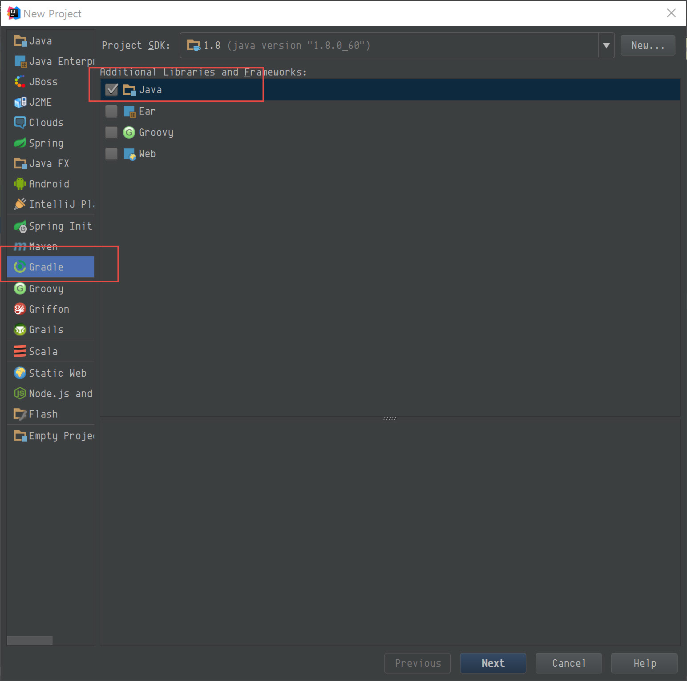
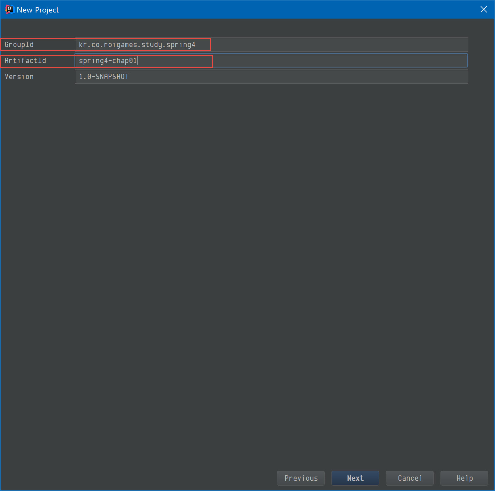
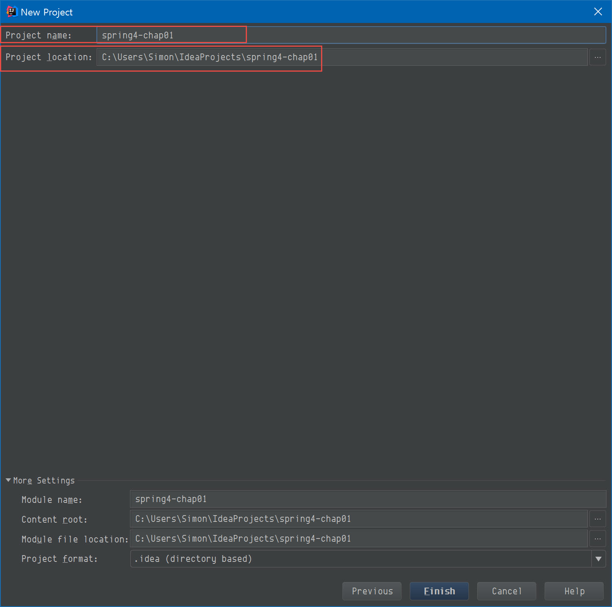
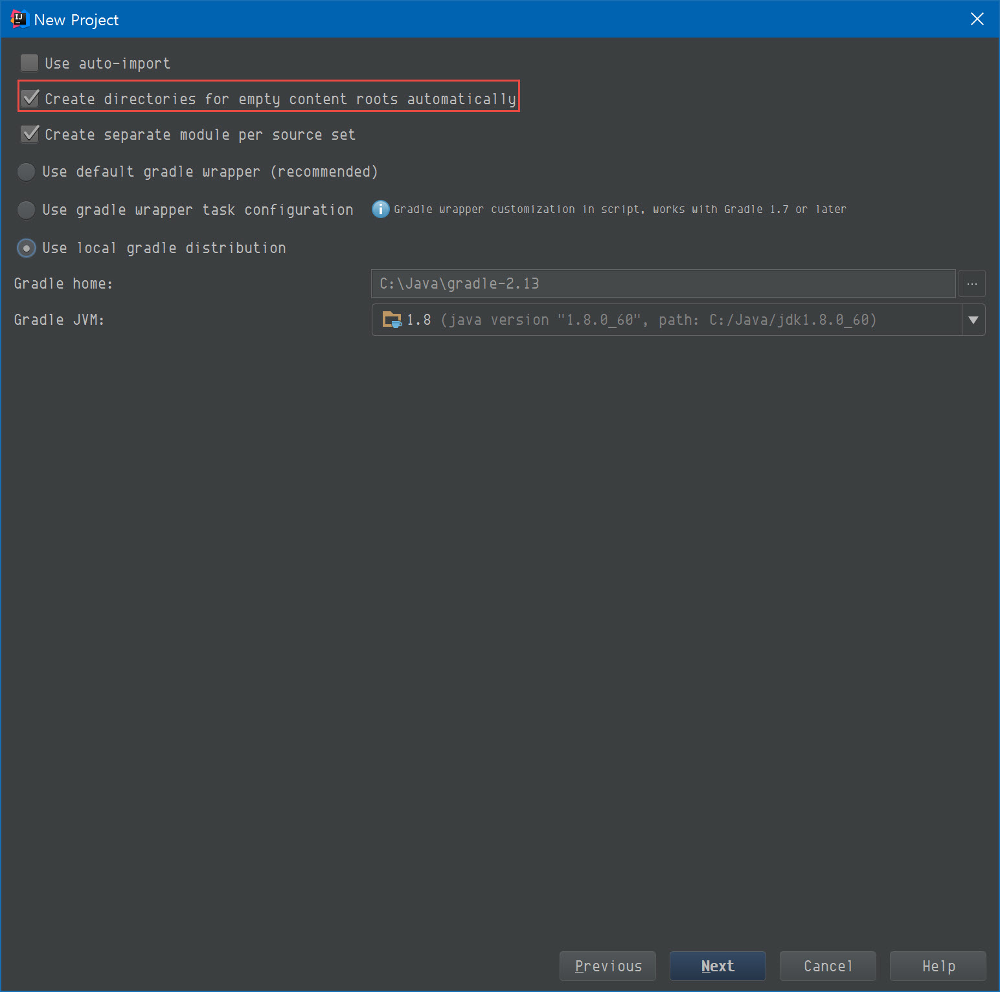
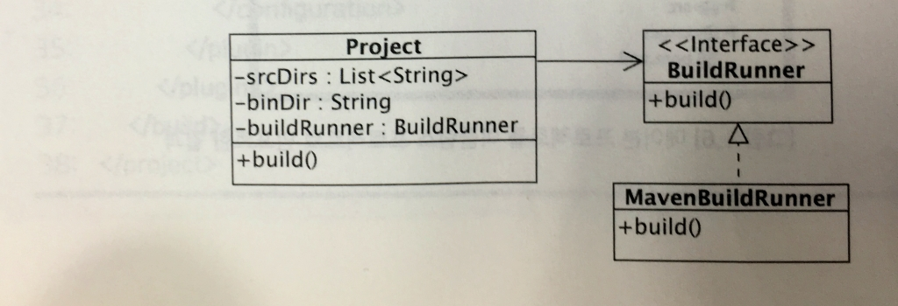

# 01. 스프링 프레임워크


* http://spring.io/team
* https://start.spring.io/


| 프로젝트       | 설명                                       |
| :--------- | ---------------------------------------- |
| 스프링 프레임워크  | 스프링 이용해서 어플리케이션 개발할 때 기반이 되는 프레임워크. DI와 AOP 기능 제공. 스프링 MVC, 스프링 ORM 등의 기능도 포함 |
| 스프링 데이터    | 데이터 연동을 위한 단일 API 제공. 이 API 기반으로 JPA, MongoDB, Neo4j, Redis등의 RDBMS와 NoSQL과의 연동을 **적은양의 코드로 처리** |
| 스프링 시큐리티   | 인증과 허가에 대한 기반 프레임워크와 모듈 제공. **웹 어플리케이션을 위한 보안을 간단한 설정과 약간의 코드로 구현** |
| 스프링 배치     | 배치 처리를 위한 기반 프레임워크 제공. 데이터 처리, 흐름제어, 실패 재처리 등 기능 제공 |
| 스프링 인터그레이션 | 시스템 간의 연동을 위한 메시징 프레임워크 제공               |
| 스프링 소셜     | 트위터, 페이스북 등 소셜 네트워크 연동을 위한 기능 제공         |


* 이외 스프링 모바일, 스프링 웹서비스, 스프링 AMQP, 스프링 HAEOAS(Hypermedia As the Engine of Application State) - 참고: http://spring.io/projects


# 02. 설치 및 주요 모듈


## 빌드 도구 : Gradle

###  설치

* [http://www.gradle.org/](http://www.gradle.org/)

* 설치 파일 압축을 풀고 설치 경로를 `GRADLE_HOME` 환경변수로 설정

* `GRADLE_OPTS`에 Gradle 전용 JVM 옵션 설정

* `GRADLE_USER_HOME` : 없으면 `$HOME/.gradle`. 여기에 의존 *.jar 파일등이 저장된다.

* `JAVA_OPTS`에 자바 애플리케이션 공용 JVM 옵션 설정

* `*.build` 파일의 인코딩

  - 기본적으로 Java의 `file.encoding` 시스템 프라퍼티를 따른다.
  - 윈도우 환경에서 UTF-8로 빌드 파일을 만들려면 `GRADLE_OPTS=-Dfile.encoding=UTF-8` 형태로 강제 지정

  ```
  export GRADLE_OPTS="-Dfile.encoding=UTF-8 -Xmx512m -XX:PermSize=64m -XX:MaxPermSize=256m"
  ```

  ​

### 실행 속도 높이기

* `${HOME}/.gradle/gradle.properties`

  ```
  org.gradle.daemon=true
  ```

  * Gradle이 데몬으로 떠서 실행되기 때문에 초기 로딩 시간이 줄어든다.
  * 3시간동안 Gradle 작업이 없으면 데몬이 자동 종료

  ​

##  스프링 모듈

* 기본 모듈 

  ```xml
  <dependency>
      <groupId>org.springframework</groupId>
      <artifactId>spring-context</artifactId>
      <version>4.3.2.RELEASE</version>
  </dependency>
  ```

  ```groovy
  compile 'org.springframework:spring-context:4.3.2.RELEASE'
  ```


## 스프링 프레임워크 주요 모듈

* 제공하는 기능에 따라 별도 모듈로 분리


| 모듈                     | 설명                                       |
| ---------------------- | ---------------------------------------- |
| spring-beans           | 스프링 컨테이너를 이용해 객체를 생성하는 기본 기능 제공          |
| spring-context         | 객체 생성, 라이프 사이클 처리, 스키마 확장 기능 제공          |
| spring-aop             | AOP(Aspect Oriented Programming) 기능 제공   |
| spring-web             | REST 클라이언트, 데이터 변환 처리, 서블릿 필터, 파일 업로드 지원 |
| spring-webmvc          | 스프링 기반의 MVC 프레임워크. 웹 어플리케이션 개발에 필요한 컨트롤러,뷰 구현 제공 |
| spring-websocket       | 스프링 MVC에서 웹 소켓 연동 처리할수 있도록 함             |
| spring-oxm             | XML 과 자바 객체 간의 매핑을 처리하기 위한 API제공         |
| spring-tx              | 트랜잭션 처리를 위한 추상 레이어 제공.                   |
| spring-jdbc            | JDBC 프로그래밍을 보다 쉽게 할수 있는 템플릿 제공           |
| spring-orm             | 하이버네이트, JPA, Mybatis 등과의 연동을 지원          |
| spring-jms             | JMS 서버와 메시지를 쉽게 주고 받을 수 있도록 하기 위한 템플릿,어노테이션 제공 |
| spring-context-support | 스케줄링, 메일발송, 캐시 연동, 벨로시티 등 부가 기능 제공       |


#  03. 첫 번째 스프링 프로그램

## 3.1 프로젝트 만들기

`basic` 폴더 내의 `build.gradle`

```groovy
group 'springsample'
version '1.0-SNAPSHOT'

apply plugin: 'java'
apply plugin: 'idea'

sourceCompatibility = 1.8

// 소스 인코딩 지정방법 1
[compileJava, compileTestJava]*.options*.encoding = 'UTF-8'
// 소스 인코딩 지정밥법 2
//tasks.withType(Compile) {
//    options.encoding = 'UTF-8'
//}

repositories {
    mavenCentral()
}

ext {
    slf4jVersion = '1.7.21'
    logbackVersion = '1.1.7'
}

List loggers = [
        "org.slf4j:slf4j-api:${slf4jVersion}",
        "org.slf4j:jcl-over-slf4j:${slf4jVersion}",
        "org.slf4j:log4j-over-slf4j:${slf4jVersion}",
        "org.slf4j:jul-to-slf4j:${slf4jVersion}",
        "ch.qos.logback:logback-core:${logbackVersion}",
        "ch.qos.logback:logback-classic:${logbackVersion}"
]

dependencies {
    compile loggers

    compile 'org.springframework:spring-context:4.3.2.RELEASE'
    compile 'org.springframework:spring-test:4.3.2.RELEASE'
    compile 'org.projectlombok:lombok:1.16.10'

    testCompile group: 'junit', name: 'junit', version: '4.12'
}

configurations {
    all.collect { configuration ->
        configuration.exclude group: 'commons-logging', module: 'commons-logging'
        configuration.exclude group: 'log4j', module: 'log4j'
        configuration.exclude group: 'org.slf4j', module: 'slf4j-log4j12'
        configuration.exclude group: 'org.slf4j', module: 'slf4j-jcl'
        configuration.exclude group: 'org.slf4j', module: 'slf4j-jdk14'
    }
}
```


### gradle 이용하기

* scaffolding 생성

```shell
gradle init --type=java-library
```

* build.gradle 수정
  * basic 내의 gradle 내용을 보고 수정한다.
  * settings.gradle : rootProject.name
  * build.gradle : group/version


### intellij 이용하기













* build.gradle 수정
  - basic 내의 gradle 내용을 보고 수정한다.
  - settings.gradle : rootProject.name
  - build.gradle : group/version


## 3.2 이클립스에서 메이븐 프로젝트 임포트하기

* intellij 에서 gradle 프로젝트 사용하는것으로 대체

  ​

## 3.3 pom.xml 파일에 스프링 의존 설정하기

* build.gradle에서 아래의 의존 설정하는 것으로 대체

  ```groovy
  compile 'org.springframework:spring-context:4.3.2.RELEASE'
  compile 'org.springframework:spring-test:4.3.2.RELEASE'
  ```

  ​

## 3.4 스프링이 관리할 객체의 코드




* BuildRunner.java

  ```java
  import java.util.List;

  public interface BuildRunner {

      public void build(List<String> srcDirs, String binDir);

  }
  ```

* MavenBuildRunner.java

  ```java
  import java.util.List;

  public class MavenBuildRunner implements BuildRunner {

      private String mavenPath;

      public void build(List<String> srcDirs, String binDir) {
          String info = "메이븐 경로: " + mavenPath + "\n";
          for (String srcDir : srcDirs) {
              info += "소스 경로: " + srcDir + "\n";
          }

          info += "클래스파일 경로: " + binDir + "\n";

          System.out.printf("MavenBuildRunner.build() 실행\n%s", info);
      }

      public void setMavenPath(String mavenPath) {
          this.mavenPath = mavenPath;
      }
  }
  ```

* Project.java

  ```java
  import java.util.List;

  public class Project {

      private List<String> srcDirs;
      private String binDir;
      private BuildRunner buildRunner;

      public void build() {
          buildRunner.build(srcDirs, binDir);
      }

      public void setSrcDirs(List<String> srcDirs) {
          this.srcDirs = srcDirs;
      }

      public void setBinDir(String binDir) {
          this.binDir = binDir;
      }

      public void setBuildRunner(BuildRunner buildRunner) {
          this.buildRunner = buildRunner;
      }
  }
  ```


## 3.5 스프링을 사용하지 않고 객체 조립/사용하기

```java
import java.util.ArrayList;
import java.util.List;

public class Main {

    public static void main(String[] args) {
        MavenBuildRunner buildRunner = new MavenBuildRunner();
        buildRunner.setMavenPath("c:\\apache-maven-3.1.1");

        Project sampleProject = new Project();
        List<String> srcDirs = new ArrayList<String>();
        srcDirs.add("src");
        srcDirs.add("srcReousrces");
        sampleProject.setSrcDirs(srcDirs);
        sampleProject.setBinDir("bin");
        sampleProject.setBuildRunner(buildRunner);

        sampleProject.build();
    }
}
```


## 3.6 스프링으로 객체 조립하기 : 스프링 설정

```xml
<?xml version="1.0" encoding="UTF-8"?>
<beans xmlns:xsi="http://www.w3.org/2001/XMLSchema-instance"
       xmlns="http://www.springframework.org/schema/beans"
       xsi:schemaLocation="http://www.springframework.org/schema/beans http://www.springframework.org/schema/beans/spring-beans.xsd">
    <bean id="mvnBuildRunner" class="MavenBuildRunner">
        <property name="mavenPath" value="c:\apache-maven-3.1.1"/>
    </bean>
    <bean id="sampleProject" class="Project">

        <property name="srcDirs">
            <list>
                <value>src/</value>
                <value>srcResources</value>
            </list>
        </property>
        <property name="binDir" value="bin"/>
        <property name="buildRunner" ref="mvnBuildRunner"/>
    </bean>
</beans>
```


* 빈 이름 : mvnBuildRunner

  * mavenPath 프로퍼티 값으로 "c:\apache-maven-3.1.1" 설정

* 빈 이름 : sampleProject

  * srcDirs 프로퍼티 값 : ["src/","srcResources/"]의 List

  * binDir 프로퍼티 값 : "bin/"

  * buildRunner 프로퍼티 값 : mvnBuildRunner 빈 객체

    ​

## 3.7 스프링으로 객체 조립하기 : 스프링을 이용한 객체 생성 및 사용

* 스프링 : 설정 정보로 부터 생성한 스프링 빈 객체를 생성/조립/관리
  * **컨테이너**
* `GenericXmlApplicationContext`
  * XML 설정 파일로 부터 스프링 컨테이너 생성

```java
import org.springframework.context.support.AbstractApplicationContext;
import org.springframework.context.support.GenericXmlApplicationContext;

public class MainBySpring {

    public static void main(String[] args) {
        String configLocation = "classpath:applicationContext.xml";
        AbstractApplicationContext ctx =
            new GenericXmlApplicationContext(configLocation);
        Project project = ctx.getBean("sampleProject", Project.class);
        project.build();

        ctx.close();
    }

}
```

