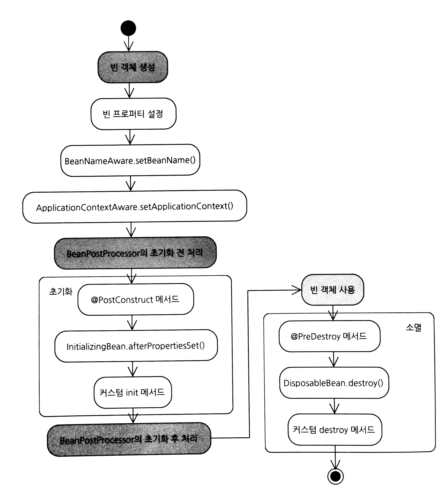

# 03. 빈 라이프사이클과 빈 범위

[TOC]

## 01. 빈 객체의 라이프 사이클

* 스프링 컨테이너
    * 빈 객체 생성
    * 프로퍼티 할당, 초기화 수행
    * 빈 소멸

* 빈 라이프 사이클 관리
    * interface(InitializingBean, DisposableBean)
    * annotation(@PostConstruct, @PreDestroy)
    * custom init,destory method

### 1.1 빈 라이프 사이클 개요



* 컨테이너는 빈 객체를 생성하고, 프로퍼티를 설정한 다음에 빈의 초기화를 진행
* 종료시점에 빈 객체의 소멸과정 진행


### 1.2 InitializingBean 인터페이스와 DispoableBean 인터페이스

* o.s.beans.factory.InitializingBean : 빈의 초기화 과정에서 실행될 메소드를 정의
* o.s.beans.factory.DisposableBean : 빈의 소멸 과정에서 실행될 메소드를 정의

```java
public interface InitializingBean {
	void afterPropertiesSet() throws Exception;
}

public interface DisposableBean {
	void destroy() throws Exception;
}
```

```java
public class ConnPool1 implements InitializingBean, DisposableBean {

	@Override
	public void afterPropertiesSet() throws Exception {
		System.out.println("ConnPool1.afterPropertiesSet()");
	}

	@Override
	public void destroy() throws Exception {
		System.out.println("ConnPool1.destroy()");
	}
}
```

### 1.3 @PostConstruct 어노테이션과 @PreDesctory 어노테이션

* JSR 250 에 정의
* CommonAnnotationBeanPostProcessor 전처리기를 스프링 빈으로 등록 필요
    * `<context:annotation-config>` 태그 사용하면 됨.
    * AnnotationConfigApplicationContext를 사용할 경우 별도의 설정을 추가할 필요가 없다.
* 초기화와 소멸 과정에서 사용될 메서드는 파라미터를 가져서는 안된다.

```java
package net.madvirus.spring4.chap03;

import javax.annotation.PostConstruct;
import javax.annotation.PreDestroy;

public class ConnPool2 {

	@PostConstruct
	public void initPool() {
		System.out.println("ConnPool2.initPool()");
	}

	@PreDestroy
	public void destroyPool() {
		System.out.println("ConnPool2.destroyPool()");
	}
}
```

### 1.4 커스텀 init 메소드와 커스텀 destory 메소드

* 외부 라이브러리 사용하려는데 init() 메소드를 제공하지만, annotation도 없고 인터페이스도 상속받지 않았다면..
* Annotation과 마찬가지로 대상 메서드는 파라미터를 가져서는 안된다.

```xml
<bean class="net.madvirus.spring4.chap03.ConnPool3"
    init-method="init" destroy-method="destroy" />
```

```java
@Bean(initMethod = "init", destroyMethod = "destroy")
public ConnPool3 connPool3() {
    return new ConnPool3();
}
```

### 1.5 ApplicationContextAware 인터페이스와 BeanNameAware 인터페이스

* 빈으로 사용된 객체에서 스프링 컨테이너에 접근하고 싶거나
* 빈 객체에서 로그를 기록할 때 빈의 이름을 남기고 싶다면(외부에서 결정하는 요소)
* `o.s.context.ApplicationContextAware`, `o.s.beans.factory.BeanNameAware` 사용

* o.s.context.ApplicationContextAware
    * 초기화 과정에서 컨테이너(ApplicationContext)를 전달받는다.
* o.s.beans.factory.BeanNameAware
    * 초기화 과정에서 빈 이름을 전달받는다.

```java
public class WorkScheduler implements ApplicationContextAware {

	private WorkRunner workRunner;
	private ApplicationContext ctx;

	@Override
	public void setApplicationContext(ApplicationContext applicationContext) throws BeansException {
		this.ctx = applicationContext;
	}

	public void makeAndRunWork() {
		for (long order = 1; order <= 10; order++) {
			Work work = ctx.getBean("workProto", Work.class);
			work.setOrder(order);
			workRunner.execute(work);
		}
	}

	public void setWorkRunner(WorkRunner workRunner) {
		this.workRunner = workRunner;
	}

}
```

```java
package net.madvirus.spring4.chap03;

import org.springframework.beans.factory.BeanNameAware;

public class WorkRunner implements BeanNameAware {

	private String beanId;

	@Override
	public void setBeanName(String name) {
		this.beanId = name;
	}

	public void execute(Work work) {
		System.out.printf("WorkRunner[%s] execute Work[%d]\n", beanId, work.getOrder());
		work.run();
	}

}

```

## 02. 빈 객체 범위(Scope)

* 싱글톤(singleton)
* 프로토타입(prototype)
* re*quest, session*

### 2.1 싱글톤 범위
* 기본값으로, 스프링은 빈객체를 한번만 생성한다.
* 스프링 컨테이너가 초기화되고 종료되기 전까지 빈 객체는 한개만 생성하고 반환.

```xml
<bean class="net.madvirus.spring4.chap03.ConnPool1" />
<bean class="net.madvirus.spring4.chap03.ConnPool1" scope="singleton"/>
```

```java
@Bean
@Scope("singleton")
public ConnPool1 pool1() {
    return new ConnPool1();
}
```

### 2.2 프로토타입 범위
* 프로토타입 범위 빈을 getBean() 으로 구할 경우, 스프링 컨테이너는 매번 새로운 객체를 생성(프로토 타입)
    * 스프링 컨테이너는 프로토타입 범위를 가진 빈의 ==**초기화까지만 담당**==한다
    * 스프링 컨테이너를 종료한다고 해서 생성된 프로토타입의 빈의 소멸 과정이 실행되지는 않는다.

```xml
<bean id="workProto" class="net.madvirus.spring4.chap03.Work"
    scope="prototype">
    <property name="timeout" value="2000" />
    <property name="type" value="#{T(net.madvirus.spring4.chap03.Work$WorkType).SINGLE}" />
</bean>
```

```java
@Bean
@Scope("prototype")
public Work workProto() {
    Work work = new Work();
    work.setTimeout(2000);
    work.setType(WorkType.SINGLE);
    return work;
}
```


### 그외 scope

spring framework 4.3.2에서는 7가지의 scope를 제공하고 있다.

* request
  * HTTP 요청별로 인스턴스화 되며 요청이 끝나면 소멸
  * spring mvc web application 용도
* session
  * HTTP 요청별로 인스턴스화 되며 세션이 끝나면 소멸
  * spring mvc web application 용도
* global session
  * 전역 세션 스코프의 빈. 포틀릿[^1] 기반의 웹 어플리케이션 용도.
  * 표준 서블릿 기반의 웹 어플리케이션에서 사용하면 표준 HTTP Session 범위(session scope)가 사용되고 에러가 발생하지 않는다.
  * spring mvc web application 용도
* application
  * ServletContext 레벨의 scope
  * ServletContext의 attribute에 저장되어 접근할 수 있다.
* websocket
  * WebSocket 요청시 생성되며 connection 종료시 소멸


그외 

* thread
  * sprint 3.0에서 지원되던 scope. 현재 기본 scope에서 제외되어 있음
  * 사용하기 원한다면 SimpleThreadScope(custom scope)를 등록하여 사용해야 한다.
* custom
  * org.springframework.beans.factory.config.Scope를 구현하고 커스텀 scope를 spring의 설정에 등록하여 사용


------

[^1]: “포틀릿은 복합페이지의 컨텍스트내에 결집되기 위해 특별히 고안된 웹컴포넌트이다. 통상 많은 포틀릿들은 포탈페이지의 단일 요청(request)로 호출된다. 각 포틀릿은 마크업 조각을 생성한다. 그것은 다른 포틀릿의 마크업과 겹합되어 전체 포탈페이지 마크업이 된다.” (JSR 168 포틀릿 스펙중)

   