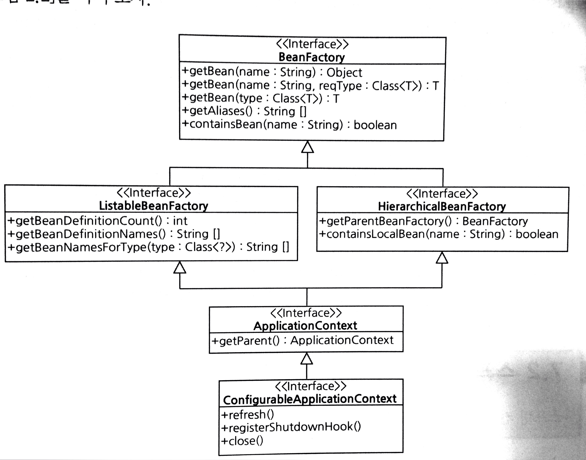

[TOC]

# 01. DI(Dependency Injection)와 스프링
- 의존 주입의 의미로 스프링의 가장 기본적인 요소


## 1.1 의존(Dependency)이란?

```java
public class FilePrinter {

	public void print(String filePath) throws IOException {
	// 의존하는 타입을 로컬 변수(br 변수)로 정의
    	try (BufferReader br = new BufferReader(new FileReader(filePath))) {
        	String line = null;
            while ((line = br.readLine()) != null) {
            	System.out.println(line);
            }
        }
    }
}
```
- ==의존 타입을 로컬 변수로 정의== 한 예
- print 메서드를 실행하기 위해 필요한 *BufferReader* 클래스
- **FilePrinter 클래스는 BufferReader 클래스에 의존한다고 할 수 있다.**

```java
public class FileEncryptor {
	// 의존 객체를 필드(encryptor 필드)로 정의
	private Encryptor encryptor = new Encryptor();

    public void encrypt(File src, File target) throws IOException {
    	try (FileInputStream is = new FileInputStream(src);
        		FileOutputStream out = new FileOutputStream(target)) {
			byte[] data = new byte[512];
            int len = -1;
            while ((len = is.read(data)) != -1) {
        		encryptor.encrypt(data, 0, len);
                out.write(data, 0, len);
            }
		}
    }
}
```
- **의존하는 타입을 필드로 정의** 한 예

- 타입에 의존

  - 해당 타입의 객체를 사용

  - 앞의 두 예에서는 의존 타입의 객체를 **직접 생성**해 사용

    ```java
    try (BufferReader br = new BufferReader(new FileReader(filePath))) {
      
    private Encryptor encryptor = new Encryptor();
    ```

----

```java
public class FileEncryptor {

	private Encryptor encryptor;

	// 생성자 파라미터
	public FileEncryptor(Encryptor encryptor) {
		this.encryptor = encryptor;
	}

	// 프로퍼티 설정
    public void setEncryptor(Encryptor encryptor) {
    	this.encryptor = encryptor;
    }
}
```
- 의존 타입의 객체를 외부에서 전달받는 경우
  - 생성자 파라미터 방식
  - 프로퍼티 설정 방식


## 1.2 의존 객체를 직접 생성하는 방식의 단점

```java
public class FileEncryptor {
	// 의존 객체를 직접 생성
	private Encryptor encryptor = new Encryptor();

    public void encrypt(File src, File target) throws IOException {
    	try (FileInputStream is = new FileInputStream(src);
        		FileOutputStream out = new FileOutputStream(target)) {
                ...
        		encryptor.encrypt(data, 0, len);
                ...
		}
    }
}
```
- 요구사항 변경
  - Encrptor -> 하위 클래스인 FastEncryptor 클래스로 사용 요청
  ```java
    public FileEncryptor {
    	private Encryptor encryptor = new FastEncryptor();
    }
  ```
  -   FileEncryptor 클래스는 사용할 객체의 구체적인 타입이 중요하지 않음
      -   Encryptor 기반이면 OK
  -   위와 같은 변경이 필요하다면 ==Encryptor 클래스를 사용하는 부분을 다 찾아 변경해줘야 함==

- 개발 효율의 저하
  - 구현되지 않은 기능으로 인한 대기 상태
    ```java
    public class Encryptor {
    	// 향후 구현을 위해 임시 조치
    	public void encrypt(byte[] data, int offset, int len) {
        	throw new UnsupportedOperationException();
        }
    }
    ...
    public class FileEncryptor {
    	private Encryptor encryptor = new Encryptor();

    public void encrypt(File src, File target) throws IOException {
    	...
            // Encryptor class가 구현되지 않았으므로 항상 UnsupportedOperationException 발생
            encryptor.encrypt(data, 0, len);
        }
    }
    ```

  - FileEncryptor 클래스의 테스트 불가(빨리 내놔 나 퇴근하게!  )

    - 사용하는 곳이 많을 수록 코드 완성이 늦어지게 된다.
    - 개발 생산성이 전체적으로 낮아지는 상황이 발생


## 1.3 DI를 사용하는 방식의 코드 : 의존 객체를 외부에서 조립함

```java
public class FileEncryptor {
	private Encryptor encryptor;

	public FileEncryptor(Encryptor encryptor) {
      	//생성자로 전달받은 객체를 필드에 할당
    	this.encryptor = encryptor;
    }

    public void encrypt(File src, File target) throws IOException {
	...

    //DI 방식으로 전달받은 객체를 사용
    encryptor.encrypt(data, 0, length);
    ...

    }
}
```
- ==의존 객체를 외부로 부터 전달 받음==
    - 생성자를 이용하는 방식과 비슷.
- DI(Dependency Injection(의존 주입))
    - 의존하는 객체를 생성하지 않고 외부의 누군가가 의존하는 객체를 넣어주는 방식(객체를 연결한다 :wire)

----

- 객체를 직접 생성하지 않는다면 누가 객체를 생성하고 서로 연결해 주는가?
- 객체를 생성하고 객체들을 서로 연결해주는 역활 => ==**조립기**==
  - ==스프링의 역할==

```java
public class Assembler {
	private FileEncryptor fileEnc;
    private Encryptor enc;

	public Assembler() {
		enc = new Encryptor();
        fileEnc = new FileEncryptor(enc);
    }

    public FileEncryptor fileEncryptor() {
    	return fileEnc;
    }
}
.
.
public class Main() {
	public void init() {
    	//조립기를 이용해 Encryptor 생성
    	Assembler assembler = new Assembler();
        FileEncryptor fileEnc = assembler.fileEncryptor();
        fileEnc.encrypt(srcFile, targetFile);
    }
}
```
---

- FileEncryptor가 사용해야 할 Encryptor 객체의 타입이 FastEncryptor 객체의 타입으로 변경되어야 한다면 ==조립기의 코드를 바꿈==으로서 수정 범위를 최소화 할 수 있다.
```java
public class Assembler {
    private FileEncryptor fileEnc;
  	private Encryptor enc;
  
    public Assembler() {
    	enc = new FastEncryptor();
    	fileEnc = new FileEncryptor(enc);
    }
  	...
}
```
- 구현이 완료되지 않은 클래스때문에 대기 할 필요가 없다.
```java
public void testFileEncryptor() {
	Encryptor fakeEncryptor = new Encryptor() {
    	@Override
        public void encrypt(byte[] data, int offset, int len) {
        	for (int i = offset; i < len; i++) data[i] = data[i] + (byte)10;
        }
    };

    File Encryptor fileEncryptor = new FileEncryptor(fakeEncryptor);
    try {
    	// fakeEncryptor를 이용해 테스트 가능
        fileEncryptor.encrypt(srcFile, targetFile);
        // tagetFile에 생성된 데이터 내용 확인
        ...
    } catch (IOException ex) {
    	...
    }
}
```
* Encryptor의 기능이 구현될때까지 기다릴 필요없이 Dummy 클래스를 생성해 업무를 진행할 수 있다.
* ==Test Framework : **Mockito**==


## 1.4 생성자 방식과 프로퍼티 설정 방식
* 의존 객체 전달 방식
    * 생성자 방식
        * 객체 생성시 의존 객체를 생성자 파라미터로 전달
        * 장점
            * 객체 생성 시점에 의존하는 객체를 모두 전달받을 수 있어 해당 객체에 대해 검증하는 코드를 생성자에 추가시 이후 사용 가능 상태임을 보장 가능.
        * 단점
            * 파라미터 이름만으로는 의존 객체의 타입 판별이 힘들다
            * 파라미터의 개수가 증가할수록 코드 가독성이 저하
    * 프로퍼티 방식
        * 의존 객체를 전달받기 위한 별도의 메서드 이용
        * JavaBeans 규칙에 따름
            * **setPropertyName()**
        * 장점
            * 어떤 타입의 의존 객체를 설정하는지 메서드 이름으로 명확하게 알 수 있다.
        * 단점
            * 객체 생성 후 의존 객체가 모두 설정되었다고 보장할 수 없다. : 사용하면 안되는 상태일수 있다.

```java
public class FileEncryptor {
	private Encryptor encryptor;

    //생성자 방식
	public void FileEncryptor(Encryptor enc) {
    	//의존 객체 검증 코드
    	if (enc == null) throw new IllegalArgumentException();
    	this.encryptor = enc;
	}

    //프로퍼티 방식
    //encryptor 파라메터의 타입이 Encryptor임을 명확하게 알 수 있다.
	public void setEncryptor(Encryptor encryptor) {
		this.encryptor = encryptor;
	}
}
```


## 1.5 스프링은 객체를 생성하고 연결해 주는 DI 컨테이너

```java
String configLocation = "classpath:applicationContext.xml";
AbstractApplicationContext ctx = new GenericXmlApplicationContext(configLocation);
Project project= ctx.getBean("sampleProject", Project.class);
project.build();
ctx.close();
```

*  GenericXmlApplicationContext
   * 조립기 기능 구현 클래스
   * XML 파일에 정의된 설정 정보를 읽어와 객체 생성 및 연결 후 내부적으로 보관(```GenericXmlapplicationContext```)
   * 생성한 객체를 보관하기 때문에 ==Object Container==

*  Spring Bean Object
   * <bean> tag
   * 스프링 컨테이너가 생성해서 보관하는 객체
   * 일반적인 Java Object와 동일

*  Spring Container

    

   * Spring Bean 생성 및 관리
   * XML 파일에서 **bean** 태그로 지정된 object들을 생성하여 <이름, Bean Object> 쌍으로 스프링 컨테이너에 보관
   * 스프링 컨테이너에 보관중인 객체를 사용하기 위해서 ==Bean Object==와 ==연결된 이름==을 사용해 객체 참조
      ```Project project = ctx.getBean("sampleProject", Project.class);```
   * Bean Object간의 연결 처리 <- **DI**
     * 의존객체를 설정하는 Bean은 프로퍼티 설정 메서드를 제공해야 한다.
       * A타입 객체의 prop1 property 설정을 위한 setProp1()

   ​


# 02. 스프링 컨테이너 종류


* BeanFactory, ApplicationContext
* BeanFactory
  * 객체 생성 및 DI 처리 기능 제공 인터페이스
  * 가장 단순한 DI 컨테이너
* ApplicationContext
  * BeanFactory의 기능 구현 제공
  * 다양한 부가 기능 제공
    * 편리한 트랜잭션 처리
    * 자바 코드 기반 스프링 설정
    * 애노테이션을 이용한 Bean 설정
    * 스프링을 이용한 웹 개발
    * 메시지 처리
    * 기타 기능
* 주로 ApplicationContext를 사용

###### ApplicationContext 인터페이스 클래스 계층 구조

* GenericXmlApplicationContext
  * XML 파일을 설정 정보로 사용하는 스프링 컨테이너
  * 독립형 어플리케이션 개발시


* AnnotationConfigApplicationContext
  * 자바 코드를 설정 정보로 사용하는 스프링 컨테이너
  * 독립형 어플리케이션 개발시


* GenericGroovyApplicationContext
  * 그루비 언어로 작성된 설정 정보를 사용하는 스프링 컨테이너
  * 독립형 어플리케이션 개발시


* XmlWebApplicationContext
  * 웹 어플리케이션을 개발할 때 사용하는 스프링 컨테이너. XML 파일을 설정 정보로 사용


* AnnotationConfigWebApplicationContext
  * 웹 어플리케이션을 개발할 때 사용하는 스프링 컨테이너. 자바 코드를 설정 정보로 사용

  ​

* `GenericApplicationContext` 클래스 상속받는 세개의 클래스는 ==스프링 컨테이너를 코드에서 직접 생성==

* `WebApplicationContext` 로 끝나는 두개의 클래스는 ==스프링 MVC 이용할때 사용==

  * web.xml과 같은 설정파일에서 간접적으로 사용


# 03. 스프링 DI 설정

스프링 DI 설정

* XML
* 자바 코드
* 그루비 코드


## 3.1 메이븐 프로젝트 의존 설정
* **여기선 gradle 기준으로 설정한다.**

```groovy
group 'springsample'
version '1.0-SNAPSHOT'

apply plugin: 'java'
apply plugin: 'idea'

sourceCompatibility = 1.8

// 소스 인코딩 지정방법 1
[compileJava, compileTestJava]*.options*.encoding = 'UTF-8'
// 소스 인코딩 지정밥법 2
//tasks.withType(Compile) {
//    options.encoding = 'UTF-8'
//}

repositories {
    mavenCentral()
}

ext {
    slf4jVersion = '1.7.21'
    logbackVersion = '1.1.7'
}

List loggers = [
        "org.slf4j:slf4j-api:${slf4jVersion}",
        "org.slf4j:jcl-over-slf4j:${slf4jVersion}",
        "org.slf4j:log4j-over-slf4j:${slf4jVersion}",
        "org.slf4j:jul-to-slf4j:${slf4jVersion}",
        "ch.qos.logback:logback-core:${logbackVersion}",
        "ch.qos.logback:logback-classic:${logbackVersion}"
]

dependencies {
    compile loggers

    compile 'org.springframework:spring-context:4.3.2.RELEASE'
    compile 'org.springframework:spring-test:4.3.2.RELEASE'
    compile 'org.projectlombok:lombok:1.16.10'

    testCompile group: 'junit', name: 'junit', version: '4.12'
}

configurations {
    all.collect { configuration ->
        configuration.exclude group: 'commons-logging', module: 'commons-logging'
        configuration.exclude group: 'log4j', module: 'log4j'
        configuration.exclude group: 'org.slf4j', module: 'slf4j-log4j12'
        configuration.exclude group: 'org.slf4j', module: 'slf4j-jcl'
        configuration.exclude group: 'org.slf4j', module: 'slf4j-jdk14'
    }
}
```


## 3.2 예제에서 사용할 클래스 구성


##### 의존성 주입 방식
* 생성자 방식
    * User
    * PasswordChgangeService
* 프로퍼티 설정 방식
    * AuthenticationService
    * UserRepository

##### 각 클래스의 기능
* User
  * 사용자 정보 보관, 암호 일치 여부 및 암호 변경 기능 제공
* UserRepository
  * User 객체 보관, ID를 이용한 User 객체 검색 기능
* AuthFailLogger
  * AuthenticationService가 인증 실패시 기록을 출력
* AuthenticationService
  * 인증 기능 수행
* PasswordChangeService
  * 암호 변경 기능 수행

##### 각 클래스의 소스 코드
###### User
```java
package net.madvirus.spring4.chap02;

public class User {

	private String id;
	private String password;

	public User(String id, String password) {
		this.id = id;
		this.password = password;
	}

	public String getId() {
		return id;
	}

	public boolean matchPassword(String inputPasswd) {
		return password.equals(inputPasswd);
	}

	public void changePassword(String oldPassword, String newPassword) {
		if (!matchPassword(oldPassword))
			throw new IllegalArgumentException("illegal password");
		password = newPassword;
	}
}

```
###### UserRepository
```java
package net.madvirus.spring4.chap02;

import java.util.HashMap;
import java.util.List;
import java.util.Map;

public class UserRepository {

	private Map<String, User> userMap = new HashMap<>();

	public User findUserById(String id) {
		return userMap.get(id);
	}

	public void setUsers(List<User> users) {
		for (User u : users)
			userMap.put(u.getId(), u);
	}
}
```

###### AuthFailLogger
```java
package net.madvirus.spring4.chap02;

public class AuthFailLogger {

	private int threshold;
	private int failCounts;

	public void insertBadPw(String userId, String inputPw) {
		System.out.printf("AuthFail [type=badpw, userid=%s, pw=%s]\n", userId, inputPw);
		failCounts++;
		if (threshold > 0 && failCounts > threshold) {
			notifyTooManyFail();
			failCounts = 0;
		}
	}

	private void notifyTooManyFail() {
		System.out.println("너무 많은 로그인 시도 실패");
	}

	public void setThreshold(int thresold) {
		this.threshold = thresold;
	}

}
```

###### AuthenticationService
```java
package net.madvirus.spring4.chap02;

public class AuthenticationService {

	private UserRepository userRepository;
	private AuthFailLogger failLogger;

	public AuthInfo authenticate(String id, String password) {
		User user = userRepository.findUserById(id);
		if (user == null)
			throw new UserNotFoundException();

		if (!user.matchPassword(password)) {
			failLogger.insertBadPw(id, password);
			throw new AuthException();
		}

		return new AuthInfo(user.getId());
	}

	public void setUserRepository(UserRepository userRepository) {
		this.userRepository = userRepository;
	}

	public void setFailLogger(AuthFailLogger failLogger) {
		this.failLogger = failLogger;
	}

}
```

###### PasswordChangeService
```java
package net.madvirus.spring4.chap02;

public class PasswordChangeService {

	private UserRepository userRepository;

	public PasswordChangeService(UserRepository userRepository) {
		this.userRepository = userRepository;
	}

	public void changePassword(String userId, String oldPw, String newPw) {
		User user = userRepository.findUserById(userId);
		if (user == null)
			throw new UserNotFoundException();

		user.changePassword(oldPw, newPw);
	}
}
```


## 3.3 XML을 이용한 DI 설정

###### XML 설정 기본 골격
```xml
<?xml version="1.0" encoding="UTF-8"?>

<beans xmlns="http://www.springframework.org/schema/beans"
	xmlns:xsi="http://www.w3.org/2001/XMLSchema-instance"
	xsi:schemaLocation="http://www.springframework.org/schema/beans
       http://www.springframework.org/schema/beans/spring-beans.xsd">

	<bean id="빈식별자1" class="생성할 객체의 완전한 클래스 이름">
    	<property name="프로퍼티이름">
        	<value>프로퍼티값</value>
        </property>
        <property name="프로퍼티이름" ref="다른 빈 식별자" />
	</bean>

	<bean id="빈식별자1" class="생성할 객체의 완전한 클래스 이름">
		<constructor-arg><value>인자값</value></constructor-arg>
		<constructor-arg><ref-bean="다른 빈 식별자" /></constructor-arg>
	</bean>
</beans>
```
###### bean 태그 : 생성할 객체 지정
* 스프링 컨테이너가 생성할 객체에 대한 정보를 지정할 때 사용
```xml
<bean id="authFailLogger" class="net.madvirus.spring4.chap02.AuthFailLogger"></bean>
...
<bean id="authenticationServcie" class="net.madvirus.spring4.chap02.AuthenticationService">
	<property name="failLogger" ref="authFailLogger" />
...
</bean>
```
*   class 속성
    * 패키지 이름을 포함한 완전한 클래스 이름으로 지정
*   id 속성
    * bean 태그를 이용해 생성하는 스프링 빈 객체의 고유한 이름으로 사용됨
    * 다른 bean 태그에서 참조할 때 사용
    * id 속성을 지정하지 않는 경우 클래스 이름을 기준으로 임의의 이름(==#숫자==) 생성
        * net.madvirus.spring4.chap02.AuthFailLogger==#0==
    * 스프링 컨테이너에서 직접 빈 객체를 구할 때 사용
    ```java
    GenericXmlApplicationContext ctx = new GenericXmlApplicationContext("classpath:config.xml");
    AuthFailLogger logger = ctx.getBean("authFailLogger", AuthFailLogger.class);
    logger.insertBadPw("bkchoi","123456");
    ```


###### <constructor-arg> 태그 : 생성자 방식 설정

```java
...
public User(String id, String password) {
	this.id = id;
    this.password = password;
}
...
```
```xml
<bean id="user1" class="net.madvirus.spring4.chap02.User">
	<constructor-arg value="bkchoi" />
    <constructor-arg value="1234" />
</bean>
```

* 객체 생성시 생성자의 파라미터 값을 설정해줘야 하는 경우 **bean**의 자식 태그로 사용
* 생성자 파라미터 개수 만큼의 **<constructor-arg>** 태그를 사용
* 기본적으로 **<constructor-arg>**의 순서가 생성자 파라미터의 순서가 된다.
  * **name**, **index** 속성을 이용해 순서를 명시적으로 입력할 수 있다.


* **<value>** 태그와 **value** 속성
  * 아래와 같은 타입의 경우 사용
    * 기본 데이터 타입(int 등)
    * 래퍼 타입(Integer 등)
    * String 타입
  * 스프링은 설정 파일에 지정한 값을 파라미터 타입에 맞게 변환해서 처리한다.(5장 참고)
```xml
<bean id="user1" class="net.madvirus.spring4.chap02.User">
	<constructor-arg><value>madvirus</value></constructor-arg>
    <constructor-arg value="qwer" />
</bean>
```


* **<ref>** 태그와 **ref** 속성
  * 다른 빈 객체를 사용해야 하는 경우 사용
```xml
<bean id="userRepository" class="net.madvirus.spring4.chap02.UserRepository">
</bean>
<bean id="pwChangeSvc" class="net.madvirus.spring4.chap02.PasswordChangeService">
	<constructor-arg><ref bean="userRepository" /></constructor-arg>
    <!--<constructor-arg ref="userRepository" />-->
</bean>
```


###### property 태그 : 프로퍼티 방식 설정

```xml
<bean id="authFailLogger" class="net.madvirus.spring4.chap02.AuthFailLogger">
	<property name="threshold" value="5" />
</bean>

<bean id="authService" class="net.madvirus.spring4.chap02.AuthenticationService">
	<property name="failLogger" ref="authFailLogger" />
    <property name="userRepository">
    	<ref bean="userRepository" />
    </property>
</bean>
```
* 프로퍼티 설정 방식 사용하는 경우 사용
* property 태그를 사용하면 `set프로퍼티이름()` 형식의 메서드를 이용해 값을 설정한다.
  * **value** 태그 또는 **value** 속성을 이용해 값 설정
  * **ref** 태그 또는 **ref** 속성을 이용해 값 설정
```xml
  <property name="threshold" value="5" /> -> setThreshold(5)
  <property name="failLogger" ref="authFailLogger" /> -> setFailLogger(authFailLogger)
```
*   **name** 속성에 지정된 이름을 기준으로 setter 함수를 찾아 설정한다.
    * Java Beans 규약

      ​

###### GenericXmlApplicationContext로 예제 실행하기
* XML 설정 파일 BeanFactory

> config.xml

```xml
<?xml version="1.0" encoding="UTF-8"?>

<beans xmlns="http://www.springframework.org/schema/beans"
	xmlns:xsi="http://www.w3.org/2001/XMLSchema-instance"
	xsi:schemaLocation="http://www.springframework.org/schema/beans
       http://www.springframework.org/schema/beans/spring-beans.xsd">

	<bean id="user1" class="net.madvirus.spring4.chap02.User">
		<constructor-arg value="bkchoi" />
		<constructor-arg value="1234" />
	</bean>

	<bean id="user2" class="net.madvirus.spring4.chap02.User">
		<constructor-arg value="madvirus" />
		<constructor-arg value="qwer" />
	</bean>

	<bean id="userRepository" class="net.madvirus.spring4.chap02.UserRepository">
		<property name="users">
			<list>
				<ref bean="user1" />
				<ref bean="user2" />
			</list>
		</property>
	</bean>

	<bean id="pwChangeSvc"
			class="net.madvirus.spring4.chap02.PasswordChangeService">
		<constructor-arg><ref bean="userRepository"/></constructor-arg>
	</bean>

	<bean id="authFailLogger" class="net.madvirus.spring4.chap02.AuthFailLogger">
		<property name="threshold" value="2" />
	</bean>

	<bean id="authenticationService"
			class="net.madvirus.spring4.chap02.AuthenticationService">
		<property name="failLogger" ref="authFailLogger" />
		<property name="userRepository" ref="userRepository" />
	</bean>
</beans>
```
```java
GenericXmlApplicationContext ctx = new GenericXmlApplicationContext("classpath:config.xml");
AuthenticationService authSvn = ctx.getBean("authenticationService", AuthenticationService.class);
authSvc.authenticate("bkchoi","1234");
```
* `GenericXmlApplicationContext` 사용해서 스프링 컨테이너 생성
* **classpath:config.xml**
    * 클래스패스에 위치한 config.xml 파일을 설정 파일로 사용하라는 의미
* GenericXmlApplicationContext의 getBean() 메서드를 이용해 빈 객체를 구한다.


* config.xml을 이용하는 코드
> MainByXml.java

```java
	package net.madvirus.spring4.chap02.main;

	import net.madvirus.spring4.chap02.AuthException;
	import net.madvirus.spring4.chap02.AuthenticationService;
    import net.madvirus.spring4.chap02.PasswordChangeService;
    import net.madvirus.spring4.chap02.UserNotFoundException;

    import org.springframework.context.support.GenericXmlApplicationContext;

    public class MainByXml {
        public static void main(String[] args) {
            GenericXmlApplicationContext ctx = 
                    new GenericXmlApplicationContext("classpath:config.xml");
            AuthenticationService authSvc = 
                    ctx.getBean("authenticationService", AuthenticationService.class);
            runAuthAndCatchAuthEx(authSvc, "bkchoi", "1111");
            runAuthAndCatchAuthEx(authSvc, "bkchoi", "11111");
            runAuthAndCatchAuthEx(authSvc, "bkchoi", "111111");
            try {
                authSvc.authenticate("bkchoi2", "1111");
            } catch (UserNotFoundException ex) {
            }
            authSvc.authenticate("bkchoi", "1234");
            PasswordChangeService pwChgSvc = ctx.getBean(PasswordChangeService.class);
            pwChgSvc.changePassword("bkchoi", "1234", "5678");
            runAuthAndCatchAuthEx(authSvc, "bkchoi", "1234");
            authSvc.authenticate("bkchoi", "5678");
            ctx.close();
        }

        private static void runAuthAndCatchAuthEx(
                AuthenticationService authSvc, String userId, String password) {
            try {
                authSvc.authenticate(userId, password);
            } catch (AuthException ex) {
            }
        }
    }
```
*   21-22라인의 getBean() 메서드는 **Bean**의 **타입**만 전달
    * 내부적으로 기술된 타입에 해당하는 **Bean**을 구해 반환한다.


**소스코드 리뷰**

* 코드내의 failLogger와 userRepository가 null이 아닌지 살펴본다


###### GenericXmlApplicationContext 설정 파일 지정

* **Bean**의 개수가 많은 경우 관리의 용이성을 위해 단일 xml 파일이 아니라 복수의 xml파일에 **Bean** 정보를 설정
```java
GenericXmlApplicationContext ctx = new GenericXmlApplicationContext(
											"classpath:/spring-member.xml",
											"spring:/spring-board.xml",
											"spring:/datasource.xml");
```
* GenericXmlApplicationContext 생성자
  * 생성자 가변인자 파라메터


* 설정 파일 위치 지정 방법
```java
//클래스 패스 하위의 특정 디렉토리에 위치한 경우 (conf/spring/)
GenericXmlApplicationContext ctx = new GenericXmlApplicationContext("classpath:/conf/spring/conf.xml");
//클래스 패스가 아닌 파일 시스템에서 설정 파일을 읽어오는 경우
GenericXmlApplicationContext ctx = new GenericXmlApplicationContext(
"file:src/main/resources/conf.xml", // 상대 경로인 경우 현재 디렉토리 기준
"file:/conf/local/conf2.xml"
// '*'를 이용해 특정 경로에 있는 모든 xml 파일을 읽어오기
GenericXmlApplicationContext ctx = new GenericXmlApplicationContext("classpath:/conf/spring-*.xml");
);
```


###### List, Map, Set 타입의 콜렉션 설정

* 콜렉션 태그에 해당하는 객체타입(spring 4.0.4 기준)
  * list -> java.util.ArrayList
  * map  -> java.util.LinkedHashMap
  * set  -> java.util.LinkedHashSet


  ​
List

```xml
<bean id="user1" class="net.madvirus.spring4.chap02.User">
...
</bean>
<bean id="user2" class="net.madvirus.spring4.chap02.User">
...
</bean>
<bean id="userRepository" class="net.madvirus.spring4.chap02.UserRepository">
    <property name="users">
        <list>
            <ref bean="user1" />
            <ref bean="user2" />
        </list>
    </property>
</bean>
```
* List 타입의 users 프로퍼티에 원소로 user1 빈과 user2 빈 객체를 담는 설정
* 아래의 자바 코드를 실행하는 것과 같은 효과
```java
List<User> refs = new ArrayList<>();
refs.add(user1);
refs.add(user2);
userRepository.setUsers(refs);
```
* List로 전달할 목록이 객체가 아니라 ==Integer나 String 같은 타입이라면 **value** 태그 사용==
```xml
<property name="servers">
	<list>
    	<value>10.50.0.1</value>
    	<value>10.50.0.2</value>
	</list>
</property>
```


Map

```xml
<bean id="monitor" class="net.madvirus.spring4.chap02.Monitor">
	<property name="sensorMap">
    	<map>
        	<entry>
            	<key>
                	<value>frontDoor</value>
                </key>
                <ref bean="sensor1" />
            </entry>
            <entry key="backDoor" value-ref="sensor2" />
        </map>
    </property>
</bean>
<bean id="sensor1" class="net.madvirus.spring4.chap02.Sensor">
</bean>
<bean id="sensor2" class="net.madvirus.spring4.chap02.Sensor">
</bean>
```
*   **entry** 태그를 이용해 **<키, 값>** 형태로 값 설정
    * **key** 태그, **key** 속성
    * **ref** 태그, **value-ref** 속성
*   값이 String이나 기본 데이터 타입의 래퍼 타입(Long 등) 이라면 **value**태그나 **value**속성 이용
    ```xml
                <property name="config">
                 	<map>
                     	<entry key="interval" value="1000" />
                      <entry key="period">
                        <value>2000</value>
                      </entry>
                 </map>
               </property>
    ```


Set

```xml
<bean id="sensor2" class="net.madvirus.spring4.chap02.Sensor">
	<property name="agentCodes">
    	<set>
        	<value>200</value>
        	<value>300</value>
		</set>
    </property>
</bean>
```


프로퍼티 타입이 제네릭을 사용한 콜렉션 타입인 경우

* 스프링에서 제네릭 타입을 지키는지 여부 확인
* 제네릭 타입에 맞지 않은 타입인 경우 **초기화 과정에서 타입 변환을 할 수 없다는 예외 발생**

```xml
<bean id="sensor2" class="net.madvirus.spring4.chap02.Sensor">...</bean>
<bean id="user2" class="net.madvirus.spring4.chap02.User">...</bean>
    ...
<bean id="monitor" class="net.madvirus.spring4.chap02.Monitor">
	<property name="sensorMap"><!-- Map<String, Sensor> 타입 -->
    	<map>
        	<entry>
            	<key>
                	<value>frontDoor</value>
                </key>
                <ref bean="sensor1" />
            </entry>
            <entry key="backDoor" value-ref="user2" /><!-- 타입 맞지 않음 -->
        </map>
    </property>
</bean>
```


###### Properties 타입 값 설정

* (키, 값) 쌍의 목록이 **설정 값의 목록을 의미하는 경우** Map보다 사용 빈도가 높다
* 외부 설정 파일로부터 정보를 읽어올 때 사용
```ini
 servers.list = 10.20.30.40:9001, 10.20.30.41:9002
 servers.timeout 3000
```

* Properties 타입의 프로퍼티를 가지며 처리하는 코드
```java
public class Sensor {
	private Properties additionalInfo;

    public void setAdditionalInfo(Properties additionalInfo) {
    	this.additionalInfo = additionalInfo;
    }
    ...
}
```
```xml
<bean id="sensor1" class="net.madvirus.spring4.sensor.Sensor">
	<property name="additionalInfo">
		<props>
        	<prop key="threshold">1500</prop>
            <prop key="retry">3</prop>
        </props>
    </property>
</bean>
```
* **prop** 태그의 key 속성 
  * Properties 객체의 프로퍼티 이름
* **prop** 태그의 몸체 값 
  * 해당 프로퍼티의 값

```xml
<bean id="sensor1" class="net.madvirus.spring4.sensor.Sensor">
	<property name="additionalInfo">
		<props>
        	threshold = 3000
        	retry = 5
        </props>
    </property>
</bean>
```


> java로 표현한 코드

```java
Properties prop = new Properties();
prop.setProperty("threshold","1500");
prop.setProperty("retry","3");
sensor1.setAdditionalInfo(prop);
```


###### c네임 스페이스와 p 네임스페이스를 생성자 방식/프로퍼티 방식 설정

* property 태그와 constructor-arg 태그의 축약형 지원

```xml
<?xml version="1.0" encoding="UTF-8"?>
<beans xmlns="http://www.springframework.org/schema/beans"
	xmlns:p="http://www.springframework.org/schema/p"	//필수 지정 (접두어는 변경 가능)
	xmlns:c="http://www.springframework.org/schema/c"	//필수 지정 (접두어는 변경 가능)
	xmlns:xsi="http://www.w3.org/2001/XMLSchema-instance"
	xsi:schemaLocation="http://www.springframework.org/schema/beans
       http://www.springframework.org/schema/beans/spring-beans.xsd">

	<bean id="user1" class="net.madvirus.spring4.chap02.User"
		c:id="bkchoi" c:password="1234" />

	<bean id="user2" class="net.madvirus.spring4.chap02.User"
		c:_0="madvirus" c:_1="qwer" />

	<bean id="pwChangeSvc"
			class="net.madvirus.spring4.chap02.PasswordChangeService"
			c:userRepository-ref="userRepository" />

	<bean id="authFailLogger" class="net.madvirus.spring4.chap02.AuthFailLogger"
			p:threshold="2" />

	<bean id="authenticationService" 
			class="net.madvirus.spring4.chap02.AuthenticationService"
			p:failLogger-ref="authFailLogger"
			p:userRepository-ref="userRepository" /> 

	<bean id="userRepository" class="net.madvirus.spring4.chap02.UserRepository">
		<property name="users">
			<list>
				<ref bean="user1" />
				<ref bean="user2" />
			</list>
		</property>
	</bean>
</beans>
```
*   생성자 값 설정(xmlns:c="http://www.springframework.org/schema/c")
    * **c:파라메터명**
    * **c:_인덱스**, **c:_인덱스-ref**
    * 인덱스는 0부터 시작

*   프로퍼티 값 설정(xmlns:p="http://www.springframework.org/schema/p)
    * **p:프로퍼티명**, **p:프로퍼티이름-ref**
*   ==네임스페이스 형식을 사용할 경우 이름이 **Ref로 끝나는 프로퍼티나 생성자 파라미터**에 대해서는 설정 할 수가 없다.==
    * 이 경우 property 태그, constructor-arg 태그를 사용해야 한다.

      ​

###### import 태그를 이용한 설정 파일 조합

```xml
<!-- 여러 경로에 위치한 설정 파일-->
classpath:/domain/order/*.xml
classpath:/domain/item/*.xml
classpath:/persistence-jpa/*.xml
classpath:/persistence-ibatis/*.xml
```

* java code 내 설정 파일 설정 방법
  * domain 영역에 새로운 모델이 추가되어 XML 설정을 추가해 한다면 자바 코드를 수정해야 한다.
```java
GenericXmlApplicationContext ctx =
	new GenericXmlApplicationContext("classpath:/domain/order/*.xml,		classpath:/domain/item/*.xml, classpath:/persistence-jpa/*.xml");

//domain은 동일하고 persistence만 ibatis 사용
GenericXmlApplicationContext ctx =
	new GenericXmlApplicationContext("classpath:/domain/order/*.xml,			classpath:/domain/item/*.xml, classpath:/persistence-ibatis/*.xml");
```

* XML 설정 파일을 이용하는 방법

  * <import> 태그의 resource 속성은 스프링 설정 파일의 경로 지정
```xml
<!-- domain-all.xml -->
<beans xmlns="http://www.springframework.org/schema/beans" ...>
<import resource="classpath:/domain/item/*.xml" />
<import resource="classpath:/domain/order/*.xml" />
</beans>
```

* java code 에서는 domain-all.xml을 대상으로 로드

```java
GenericXmlApplicationContext ctx = new GenericXmlApplicationContext("classpath:/domain/domain-all.xml,classpath:/persistence-ibatis/*.xml");
```
* 새로운 모델이 domain 영역에 추가되면 XML만 변경하면 된다.

```xml
<beans xmlns="http://www.springframework.org/schema/beans" ...>
<import resource="classpath:/domain/item/*.xml" />
<import resource="classpath:/domain/order/*.xml" />
<import resource="classpath:/domain/event/event.xml" /> <!-- 새로 추가 -->
</beans>
```


## 3.4 자바 코드를 이용한 DI 설정

* XML기반의 스프링 설정외에 Java Code나 Groovy를 이용한 설정이 가능


###### @Configuration과 @Bean을 이용한 빈 객체 설정

```java
import org.springframework.context.annotation.Bean;
import org.springframework.context.annotation.Configuration;

@Configuration //클래스를 스프링 설정으로 사용함을 의미
public class Config {

    @Bean  //메서드의 리턴 값을 빈 객체로 사용함을 의미
    public User user1() { //메서드의 이름을 빈 객체 식별자로 사용
		return new User("bkchoi", "1234");
    }
}
```
*   XML을 이용한 설정보다 직관적
*   @Configuration
    * 해당 클래스를 설정 정보로 사용하라는 의미
*   @Bean
    * 빈 객체를 생성하는 메서드에 적용
    * 메서드의 이름인 ==user1==이 빈 객체의 이름으로 사용됨

*   스프링 컨테이너 생성
    ```java
          AnnotationConfigApplicationContext ctx =
                  new AnnotationConfigApplicationContext(Config.class);
           User user1 = ctx.getBean("user1", User.class);
    ```


*   @Configuration 어노테이션 설정 클래스를 위한 스프링 컨테이너 생성
    * ==org.springframework.context.annotation.AnnotationConfigApplicationContext==

*   설정 정보 클래스를 생성자의 파라미터로 전달

*   빈 객체 식별값 지정

    *   빈 객체의 식별값을 지정하기 위해선 @Bean 어노테이션의 ==name 속성 활용==

        ```java
        @Bean(name="user2")
        public User user() {
        	return new User("madvirus","qwer");
        }
        ```

        ​

###### 의존 설정하기

```java
@Bean
public User user() {
	return new User("madvirus", "qwer") // 생성자에 값 직접 전달
}

@Bean
public AuthFailLogger authFailLogger() {
	AuthFailLogger logger = new AuthFailLogger();
    logger.setThreshold(2); //프로퍼티에 값 직접 전달
    return logger;
}
```
* 코드내에서 직접 설정
* 빈 객체를 참조해야 하는 경우 직접 메서드 호출해서 처리
> Config.java

```java
 package net.madvirus.spring4.chap02.conf;

 import java.util.Arrays;
 import net.madvirus.spring4.chap02.AuthFailLogger;
 import net.madvirus.spring4.chap02.AuthenticationService;
 import net.madvirus.spring4.chap02.PasswordChangeService;
 import net.madvirus.spring4.chap02.User;
 import net.madvirus.spring4.chap02.UserRepository;

 import org.springframework.context.annotation.Bean;
 import org.springframework.context.annotation.Configuration;

 @Configuration
 public class Config {

     @Bean
     public User user1() {
        return new User("bkchoi", "1234");
     }

     @Bean(name = "user2")
     public User user() {
        return new User("madvirus", "qwer");
     }

     @Bean
     public UserRepository userRepository() {
        UserRepository userRepo = new UserRepository();
        userRepo.setUsers(Arrays.asList(user1(), user())); // 빈 객체 참조 (check1)
        return userRepo;
     }

     @Bean
     public PasswordChangeService pwChangeSvc() {
        return new PasswordChangeService(userRepository()); // check2
     }

     @Bean
     public AuthFailLogger authFailLogger() {
        AuthFailLogger logger = new AuthFailLogger();
        logger.setThreshold(2);
        return logger;
     }

     @Bean
     public AuthenticationService authenticationService() {
        AuthenticationService authSvc = new AuthenticationService();
        authSvc.setFailLogger(authFailLogger());
        authSvc.setUserRepository(userRepository()); // check3
        return authSvc;
     }

 }
```
* **check1** 코드는 아래의 XML 설정과 동일한 의존 설정을 시행

  ```xml
  <bean id="userRepository" class="net.madvirus.spring4.chap02.UserRepository">
      <property name="users">
          <ref bean="user1" /> <!-- user1() 메서드 호출과 일치 -->
          <ref bean="user1" /> <!-- user() 메서드 호출과 일치 -->
      </property>
  </bean>
  ```

* **check2**와 **check3** 코드의 경우 userRepository()를 매번 호출하나 스프링 내부적으로 동일한 객체를 생성해서 반환해준다.

  * ==자바 빈 의존 설정을 할때 새로운 객체가 생성되지 않는다.==

  * 스프링이 @Configuration 클래스를 상속 받은 새로운 클래스를 만듦

    ```java
    public class SpringGenConfig extends Config {
      private UserRepository userRepository;

      @Override
      public UserRepository userRepository() {
        if (userRepository == null) {
          userRepository = super.userRepository();
        }
      }
      ....
    }
    ```

  * 런타임에 **CGLIB** 도구를 이용해 하위 클래스 생성

  * 하위 클래스를 만들고 메소드를 재정의하기 때문에 ==@Configuration 클래스와 @Bean 메서드는 final이면 안된다.==
  * ==@Bean 메서드는 하위 클래스에서 재정의 할 수 있어야 되므로 private이면 안된다.==


###### AnnotationConfigApplicationContext를 이용한 자바 코드 설정 사용

> MainByJavaConfig.java

```java
package net.madvirus.spring4.chap02.main;

import net.madvirus.spring4.chap02.AuthenticationService;
import net.madvirus.spring4.chap02.PasswordChangeService;
import net.madvirus.spring4.chap02.conf.Config;
import net.madvirus.spring4.chap02.conf.Config1;
import net.madvirus.spring4.chap02.conf.Config2;

import org.springframework.context.annotation.AnnotationConfigApplicationContext;

public class MainByJavaConfig {

	private static void main() {
		AnnotationConfigApplicationContext ctx =
				new AnnotationConfigApplicationContext(Config.class);

		AuthenticationService authSvc =
				ctx.getBean("authenticationService", AuthenticationService.class);
		authSvc.authenticate("bkchoi", "1234");

		PasswordChangeService pwChgSvc =
				ctx.getBean(PasswordChangeService.class);
		pwChgSvc.changePassword("bkchoi", "1234", "5678");

		ctx.close();
	}
}
```
* 설정으로 사용할 클래스를 AnnotationConfigApplicationContext의 파라메터로 전달


*   두개 이상의 설정 정보를 사용하는 경우
    * 설정 정보 클래스를 전부 파라메터로 전달
    ```java
     AnnotationConfigApplicationContext ctx =
                new AnnotationConfigApplicationContext(Config.class, ConfigSensor.class);
    ```

*   패키지 경로 전달 방법

    *   설정된 패키지 경로 및 하위 패키지에 위치한 @Configuration 어노테이션이 적용된 클래스를 모두 사용하게 된다.
```java
//단일 패키지 경로 지정
AnnotationConfigApplicationContext ctx =
	new AnnotationConfigApplicationContext("net.madvirus.spring4.chap02.conf");

//다중 패키지 경로 지정
AnnotationConfigApplicationContext ctx =
	new AnnotationConfigApplicationContext("net.madvirus.spring4.chap02.conf",
"net.madvirus.spring4.chap02.conf");
```


###### @import 어노테이션을 이용한 조합

* XML 설정부의 import 태그와 동일한 기능
```java
//단일 클래스 import
@Configuration
@Import(ConfigSensor.class)
public class Config {
	...
}
//다중 클래스 import
@Configuration
@Import( {ConfigSensor.class, ConfigDashboard.class} )
public class Config {
	...
}
```


###### XML 설정과 자바 설정의 차이점

* XML 설정의 특징
  * 설정 정보 변경시 XML만 수정하면 된다.
  * 많은 프레임워크/라이브러리가 XML 스키마를 이용한 설정의 편리함을 지원.
  * (IDE의 코드 자동 완성 기능이 빈약하면) XML 작성 과정이 다소 번거롭다.
  * 코드를 실행해야 설정 정보 오류를 확인할 수 있다.


* 자바 설정 방식의 특징
  * 컴파일러의 도움을 받기 때문에, 오타 등의 설정 정보 오류를 미리 알 수 있다.
  * 자바 코드이기 떄문에 IDE가 제공하는 코드 자동 완성 기능의 도움을 받을 수 있다.
  * 설정 정보를 변경하려면 자바 코드를 재컴파일 해주어야 한다.
  * XML 스키마 기반의 설정을 지원하는 프레임워크/라이브러리 중 아직 자바 기반의 편리한 설정을 지원하지 않는 경우가 있다.


## 3.5 XML 설정과 자바 코드 설정 함께 사용하기

###### XML 설정에서 자바 코드 설정 조합하기
* 다음 두 가지 코드를 XML 파일에 추가
    * `<context:annotation-config />`
    * @Configuration 어노테이션이 적용된 클래스를 스프링 설정 정보로 사용

```java
@Configuration
public class ConfigSensor {
	@Bean
    public Sensor sensor1() {
    	Sensor s = new Sensor();
        Properties properties = new Properties();
        properties.setProperty("threshold", "1500");
        properties.setProperty("retry", "3");
        s.setAdditionalInfo(properties);
        return s;
    }
}
...
```
```xml
<?xml version="1.0" encoding="UTF-8"?>

<beans xmlns="http://www.springframework.org/schema/beans"
	xmlns:context="http://www.springframework.org/schema/context"
	xmlns:xsi="http://www.w3.org/2001/XMLSchema-instance"
	xsi:schemaLocation="http://www.springframework.org/schema/beans
       http://www.springframework.org/schema/beans/spring-beans.xsd
       http://www.springframework.org/schema/context
       http://www.springframework.org/schema/context/spring-context.xsd">

	<context:annotation-config /> <!-- 추가 -->

	<bean class="net.madvirus.spring4.chap02.conf.ConfigSensor" /> <!-- 설정 정보 클래스 등록 -->

	<bean id="user1" class="net.madvirus.spring4.chap02.User">
		<constructor-arg value="bkchoi" />
		<constructor-arg value="1234" />
	</bean>
    ...
</beans>
```

* **<annotation-config>** 태그
  * @Configuration, @Autowired, @Resources 등의 어노테이션을 인식할 수 있도록 만들어주는 태그
  * 이 태그가 XML에 적용되어 있지 않다면 @Configuration이 적용된 빈 객체를 추가 할 수 없다.
  * 사용하기 위해 context 네임스페이스에 대한 XML 스키마 정보를 **beans** 루트 태그에 등록해야 한다.
    * `xmlns:context="http://www.springframework.org/schema/context"`
    * 두 개 이상의 XML 파일을 설정하는 경우 **annotation-config** 태그는 한 개의 XML 파일에만 추가해주면 된다.


###### 자바 코드 설정에서 XML 설정 조합하기

* @ImportResource 어노테이션 사용
  * 두개 이상의 XML 설정 사용시 ==배열== 로 전달

```java
// 단일 설정 파일 import
@Configuration
@ImportResource("classpath:config-sensor.xml")
public class ConfigWithXmlImport {
	@Bean
    public User user1() {
    	return new User("bkchoi", "1234");
    }
    ...
}

//다중 설정 파일 import
@Configuration
@ImportResource( {"classpath:config-sensor.xml", "classpath:config-ext.xml"} )
public class ConfigWithXmlImport {
	@Bean
    public User user1() {
    	return new User("bkchoi", "1234");
    }
    ...
}
```


# 04. 팩토리 방식의 스프링 빈 설정

- 객체 생성에 사용되는 static 메소드 지정

- FactoryBean 인터페이스를 이용한 객체 생성 처리

  ​

## 4.1 객체 생성을 위한 정적 메소드 설정

```java
package chap02.erp;

import java.util.Properties;

public abstract class ErpClientFactory {
	public static ErpClientFactory instance() {
		return new DefaultErpClientFactory(props);
	}

	protected ErpClientFactory() {
	}

	public abstract ErpClient create();
}
```

- ErpClientFactory 클래스는 ErpClient객체를 생성하는 기능을 제공
- **instance() 정적 메소드를 사용해야함** (생성자를 사용하지 않는다.)

```java
ErpClientFactory factory = ErpClientFactory.instance();
```

- static 메소드를 사용하여 객체를 생성해야할 경우
- ==**factory-method** 속성을 지정한다==

```xml
<bean id="factory" class="chap02.erp.ErpClientFactory"
    factory-method="instance">
</bean>
```

- factory-method 속성에 파라미터가 필요한 경우 ==&lt;constructor-arg&gt;== 태그를 사용

```java
public abstract class ErpClientFactory {
	public static ErpClientFactory instance(Properties props) {
		return new DefaultErpClientFactory(props);
	}
}
```

```xml
<bean id="factory" class="chap02.erp.ErpClientFactory"
    factory-method="instance">
    <constructor-arg>
        <props>
            <prop key="server">10.50.0.101</prop>
        </props>
    </constructor-arg>
</bean>
```


## 4.2 FactoryBean 인터페이스를 이용한 객체 생성 처리

```java
SearchClientFactoryBuilder builder = new SearchClientFactoryBuilder();

builder.server("10.20.1.100")
	.port(8181)
	.contentType(type==null? "json": type)
	.encoding("utf-8");

SearchClientFactory searchClientFactory = builder.build();
searchClientFactory.init();
```

- 이럴때 사용하는 것이 ==FactoryBean 인터페이스==이다.

  ```java
  public interface FactoryBean<T> {
  	T getObject() throws Exception;
  	Class<?> getObjectType();
  	boolean isSingleton();
  }
  ```

  * T getObject()

    * 실제 스프링 빈으로 사용될 객체를 리턴
  * Class<?> getObjectType()
    * 스프링 빈으로 사용될 객체의 타입을 리턴
  * boolean isSingleton()
    * getObject() 메소드가 매번 동일한 객체를 리턴하면 **true**, 매번 새로운 객체를 리턴하면 **false**를 리턴

- 스프링은 <bean> 태그에서 지정한 클래스나 @Bean 어노테이션이 적용된 메소드가 생성하는 객체가 FactoryBean 인터페이스를 구현한 경우, ==getObject()== 메소드가 리턴하는 객체를 실제 ==빈 객체를 사용==

  ​

```java
package chap02.search;

import org.springframework.beans.factory.FactoryBean;

public class SearchClientFactoryBean implements FactoryBean<SearchClientFactory> {

	private String server;
	private int port;
	private String contentType;
	private String encoding = "utf8";

	private SearchClientFactory searchClientFactory;

	public void setServer(String server) {
		this.server = server;
	}

	public void setPort(int port) {
		this.port = port;
	}

	public void setContentType(String contentType) {
		this.contentType = contentType;
	}

	public void setEncoding(String encoding) {
		this.encoding = encoding;
	}

	@Override
	public SearchClientFactory getObject() throws Exception {
		if (this.searchClientFactory != null)
			return this.searchClientFactory;
		SearchClientFactoryBuilder builder = new SearchClientFactoryBuilder();
		builder.server(server)
				.port(port)
				.contentType(contentType == null ? "json" : contentType)
				.encoding(encoding);
		SearchClientFactory searchClientFactory = builder.build();
		searchClientFactory.init();
		this.searchClientFactory = searchClientFactory;
		return this.searchClientFactory;
	}

	@Override
	public Class<?> getObjectType() {
		return SearchClientFactory.class;
	}

	@Override
	public boolean isSingleton() {
		return true;
	}

}
```

*   06: SearchClientFactoryBean 클래스가 생성할 스프링 빈 객체 타입 
    * SearchClientFactory
*   31-45: getObject()  메소드를 구현한 코드
    * SearchClientFactory를 생성하고 리턴
    * 매번 동일한 객체를 리턴하기 위해 보관하여 반환
*   47-50: getObjectType() 메소드는 스프링이 사용할 빈 객체의 타입을 리턴
*   52-55: isSingleton() 메소드 구현
    * getObject() 에서 동일한 객체를 리턴하므로 **true** 리턴

      ​


```xml
<bean id="searchClientFactory"
    class="chap02.search.SearchClientFactoryBean">
    <property name="server" value="10.20.30.40" />
    <property name="port" value="8888" />
    <property name="contentType" value="json" />
</bean>
```

```java
public static void main(String[] args) {
    GenericXmlApplicationContext ctx = 
            new GenericXmlApplicationContext("classpath:config-search.xml");
    SearchClientFactory factory = ctx.getBean("searchClientFactory", SearchClientFactory.class);
    System.out.println(factory);
    SearchClientFactory factory2 = ctx.getBean("searchClientFactory", SearchClientFactory.class);
    System.out.println("same instance = " + (factory == factory2));
    ctx.close();
}
```


#### 자바 코드 설정에서 FactoryBean 설정

```java
@Configuration
public class ConfigScan {

	@Bean
	public SearchClientFactoryBean orderSearchClientFactory() {
		SearchClientFactoryBean searchClientFactoryBean = new SearchClientFactoryBean();
		searchClientFactoryBean.setServer("10.20.30.40");
		searchClientFactoryBean.setPort(8888);
		searchClientFactoryBean.setContentType("json");
		return searchClientFactoryBean;
	}

	@Bean
	public SearchClientFactoryBean productSearchClientFactory() {
		SearchClientFactoryBean searchClientFactoryBean = new SearchClientFactoryBean();
		searchClientFactoryBean.setServer("10.20.30.41");
		searchClientFactoryBean.setPort(9999);
		searchClientFactoryBean.setContentType("json");
		return searchClientFactoryBean;
	}

	@Bean
	public ErpClientFactory erpClientFactory() {
		Properties props = new Properties();
		props.setProperty("server", "10.50.0.101");
		return ErpClientFactory.instance(props);
	}

	@Bean
	public SearchServiceHealthChecker searchServiceHealthChecker(
			SearchClientFactory orderSearchClientFactory,
			SearchClientFactory productSearchClientFactory
			) throws Exception {
		SearchServiceHealthChecker healthChecker = new SearchServiceHealthChecker();
		healthChecker.setFactories(Arrays.asList(
				orderSearchClientFactory, productSearchClientFactory
		));
		return healthChecker;
	}
}
```

* orderSearchClientFactory() 메소드의 리턴 타입은 SearchClientFactoryBean 클래스이다.
    * 하지만 getBean()에서는 ==SearchClientFactory 타입==을 사용한다.

```java
//빈 객체를 구할때는 FactoryBean이 생성하는 객체의 타입을 사용
SearchClientFactory orderSearchClientFactory = ctx.getBean("orderSearchClientFactory", SearchClientFactory.class);
```


#### 다른 빈 객체를 설정할때 SearchClientFactory 빈이 필요하면?

* 객체를 그대로 사용 : ==FactoryBean 구현 객체를 리턴하는 메소드를 호출해서 getObject() 메소드를 호출해서 필요한 객체를 구한다==.   


```java
@Bean
public SearchServiceHealthChecker searchServiceHealthChecker() throws Exception {
    SearchServiceHealthChecker healthChecker = new SearchServiceHealthChecker();
    healthChecker.setFactories(Arrays.asList(
            orderSearchClientFactory().getObject(), productSearchClientFactory.getObject()
    ));
    return healthChecker;
}
```

*  파라미터 전달 방법 : @Bean 어노테이션이 적용된 메소드에 파라미터가 존재할 경우, ==해당 파라미터의 **타입**과 **이름**을 사용하여 빈 객체를 전달==
    * searchServiceHealthChecker() 메소드의 첫번째 파라미터 타입이 **SearchClientFactory**이고, 파라미터 이름이 **orderSearchClientFactory**인 빈을 사용
    * orderSearchClientFactory() 이용해서 생성된 빈 객체가 첫번째 파라미터로 전달
    * ==파라미터를 이용해서 의존 객체 전달 방식은 **모든 빈**에 동일하게 적용된다==

```java
@Bean
public SearchServiceHealthChecker searchServiceHealthChecker(
        SearchClientFactory orderSearchClientFactory,
        SearchClientFactory productSearchClientFactory
        ) throws Exception {
    SearchServiceHealthChecker healthChecker = new SearchServiceHealthChecker();
    healthChecker.setFactories(Arrays.asList(
            orderSearchClientFactory, productSearchClientFactory
    ));
    return healthChecker;
}
```


## 05. 어노테이션을 이용한 객체 간 의존 자동 연결

*   스프링은 자동으로 스프링 빈 객체간의 의존을 설정해주는 기능 제공(XML에서 ref 태그 사용하지 않아도)

    *   스프링 코드 설정을 짧게 유지할수 있게 된다.

*   자동 설정을 위한 몇가지 방법
    * @Autowired

    * @Resource

    * @Inject

      ​

### 5.1 어노테이션 기반 의존 자동 연결을 위한 설정

* xml 추가 설정(@Autowired, @Resource)
    * xmlns:context="http://www.springframework.org/schema/context"
    * http://www.springframework.org/schema/context
       http://www.springframework.org/schema/context/spring-context.xsd
    * <context:annotation-config />

```xml
<beans xmlns="http://www.springframework.org/schema/beans"
	xmlns:context="http://www.springframework.org/schema/context"
	xmlns:xsi="http://www.w3.org/2001/XMLSchema-instance"
	xsi:schemaLocation="http://www.springframework.org/schema/beans
       http://www.springframework.org/schema/beans/spring-beans.xsd
       http://www.springframework.org/schema/context
       http://www.springframework.org/schema/context/spring-context.xsd">
   <context:annotation-config />
</beans>
```

*   <context:annotation-config />
    *   다수의 스프링 전처리기 빈을 등록
    *   이 중
        * ...AutowiredAnnotationBeanPostProcessor : @Autowired 어노테이션 처리, @Inject 어노테이션 처리
        * ...CommonAnnotationBeanPostProcessor : @Resource, @PostConstruct 등 어노테이션 처리
        * ...QualifierAnnotationAutowireCandidateResolver : @Qualifier 어노테이션 처리
        ```xml
        <bean class="org.springframework.beans.factory.annotation.AutowiredAnnotationBeanPostProcessor"/>
        <bean class="org.springframework.context.annotation.CommonAnnotationBeanPostProcessor"/>
        ```


> @Configuration 어노테이션을 이용한 자바 설정에서는 어노테이션을 알맞게 처리함.


### 5.2 @Autowired 어노테이션을 이용한 의존 자동 설정

*   org.springframework.beans.factory.annotation.AutowiredAnnotationBeanPostProcessor 어노테이션/@Autowired
    * 의존 관계를 자동을 설정할 때 사용

    * 생성자, 필드, 메소드 세곳에 적용 가능

      ​


##### 프로퍼티에 사용 

```java
@Autowired
public void setErpClientFactory(ErpClientFactory erpClientFactory) {
    this.erpClientFactory = erpClientFactory;
}
```

```xml
    <beans xmlns="http://www.springframework.org/schema/beans"
	xmlns:context="http://www.springframework.org/schema/context"
	xmlns:xsi="http://www.w3.org/2001/XMLSchema-instance"
	xsi:schemaLocation="http://www.springframework.org/schema/beans
       http://www.springframework.org/schema/beans/spring-beans.xsd
       http://www.springframework.org/schema/context
       http://www.springframework.org/schema/context/spring-context.xsd">

	<context:annotation-config />

	<bean id="orderService" class="chap02.shop.OrderService">
      	<!-- erpClientFactory 프로퍼티에 대한 설정이 없음 -->
	</bean>

	<bean id="ecFactory" class="chap02.erp.ErpClientFactory"
		factory-method="instance">
		<constructor-arg>
			<props>
				<prop key="server">10.50.0.101</prop>
			</props>
		</constructor-arg>
	</bean>
	</beans>
```

* ==동일 타입== 을 갖는 "ecFactory"빈을 erpClientFactory 프로퍼의 값으로 사용


##### 임의의 메소드

```java
@Autowired
//두 파라미터의 값으로 일치하는 타입을 가진 스프링 빈 객체 전달
public void init(ErpClientFactory erpClientFactory, SearchClientFactory searchClientFactory){
    this.erpClientFactory = erpClientFactory;
    this.searchClientFactory = searchClientFactory;

}
```

##### 생성자에 적용

```java
@Autowired
public OrderSearvice(ErpClientFactory erpClientFactory, SearchClientFactory searchClientFactory){
    this.erpClientFactory = erpClientFactory;
    this.searchClientFactory = searchClientFactory;

}
```

##### 필드 적용

```java
@Autowired
private ErpClientFactory erpClientFactory;

@Autowired
private SearchClientFactory searchClientFactory;
```


> @Autowired 어노테이션을 필드에 적용하면, 의존 객체를 전달받기 위한 메소드를 추가하지 않아도 됨

> ==XML 설정에서는 스프링이 생성자를 호출하는 반해 자바 코드 설정에서는 코드에서 생성자를 직접 호출한다.==
>
> - 자바 코드 설정에서는 생성자에 @Autowired  어노테이션을 적용하더라도 **의존 객체가 전달되지 않는다.**


####(1) @Autowired 어노테이션 적용 프로퍼티의 필수 여부 지정

*   스프링 @Autowired 어노테이션 발견하면,
    * @Autowired에 해당하는 스프링 빈 객체를 찾아서 설정
    * 해당 타입의 빈 객체가 존재하지 않으면, ==스프링 컨테이너 초기화 과정에서 익셉션 발생==
*   @Autowired 를 적용했지만, 익셉션이 아니라 null로 유지하고 싶다면
    * **required=false** 속성 지정
    ```java
    @Autowired(required = false)
    private SearchClientFactory searchClientFactory;
    ```


####(2) @Qualifier 어노테이션을 이용한 자동 설정 제한    

*   동일한 타입의 빈 객체를 두개 이상 정의
    * 스프링은 어떤 빈 객체를 사용해야 하는지 알수 없어 ==익셉션 발생==
    * xml과 ==**&lt;qualifier&gt;**== 태그를 이용해서 한정자를 지정, 자바 설정에서는 ==**@Qualifier**== 어노테이션 이용
    * @Autowired 어노테이션 사용 코드는 @Qualifier 어노테이션을 이용하여 **의존객체 한정**
    ```xml
    <bean id="orderSearchClientFactory"
    	class="chap02.search.SearchClientFactoryBean">
    	<qualifier value="order" />
    	<property name="server" value="10.20.30.40" />
    	<property name="port" value="8888" />
    	<property name="contentType" value="json" />
    </bean>
    ```

    ```java
    @Bean
    @Qualifier("order")
    public SearchClientFactoryBean orderSearchClientFactory() {
    	SearchClientFactoryBean searchClientFactoryBean = new SearchClientFactoryBean();
    	searchClientFactoryBean.setServer("10.20.30.40");
    	searchClientFactoryBean.setPort(8888);
    	searchClientFactoryBean.setContentType("json");
    	return searchClientFactoryBean;
    }
    ```
    * 두개 이상의 파라미터를 갖는 메소드나 생성자의 경우에 ==파라미터에 적용==
    ```java
    @Autowired
    public OrderService(ErpClientFactory erpClientFactory, 
    		@Qualifier("order") SearchClientFactory searchClientFactory){
    	this.erpClientFactory = erpClientFactory;
    	this.searchClientFactory = searchClientFactory;
    }
    ```

    ​
### 5.3 @Resouce 어노테이션을 이용한 의존 자동 설정

*   JSR250 spec : 객체의 초기화와 관련된 어노테이션 정의
    * javax.annotation.Resource 어노테이션은 의존 설정과 관련
    * 스프링은 필드나 프로퍼티 설정 메소드의 @Resource 어노테이션이 적용되어있으면, 빈 객체 할당

    | @Autowired       | @Resource        |
    | ---------------- | ---------------- |
    | 타입을 기준으로 빈 객체 선택 | 이름을 기준으로 빈 객체 선택 |


```java
public class ProductService {

	private SearchClientFactory searchClientFactory;

	@Resource(name = "productSearchClientFactory")
	public void setSearchClientFactory(SearchClientFactory searchClientFactory) {
		this.searchClientFactory = searchClientFactory;
	}
}
```

*   @Resource 어노테이션의 name 속성에 지정한 이름을 갖는 빈 객체 사용
    * 존재하지 않으면 익셉션 발생
    * name 속성 값을 지정하지 않으면, **필드 이름**이나 **프로퍼티 이름**을 사용
*   name 속성을 지정하지 않은 상태에서 필드 이름이나 프로퍼티 이름에 해당하는 스프링 빈이 존재하지 않으면
    * 일치하는 타입의 스프링 빈을 선택

    * 없거나, 두개 이상이면 익셉션 발생

      ​

### 5.4 @Inject 어노테이션을 이용한 의존 자동 설정

* JSR330 spec 
    * @Inject(javax.inject.Inject) : DI  목적으로 만들어진 어노테이션 
    * @Named 어노테이션 포함

* 사용전 @Inject 어노테이션 지원을 위한 jar 추가.(build.gradle)
```groovy
compile 'javax.inject:javax.inject:1'
```

* @Inject 어노테이션
    * 필드, 메소드, 생성자에 적용

```java
@Inject
public void setErpClientFactory(ErpClientFactory erpClientFactory) {
    this.erpClientFactory = erpClientFactory;
}
```

```java
@Autowired
public void setSearchClientFactory(@Qualifier("order") SearchClientFactory searchClientFactory) {
    this.searchClientFactory = searchClientFactory;
}
```

```java
@Inject
public void setSearchClientFactory(@Named("orderSearchClientFactory") SearchClientFactory searchClientFactory) {
    this.searchClientFactory = searchClientFactory;
}
```
*    @Named 어노테이션은 자동 설정 대상이 두 개 이상일 경우 특정한 빈을 선택할 목적으로 사용
     * @Qualifier 와의 차이점은 ==**빈의 이름**== 을 지정한다.

*    @Inject는 반드시 사용할 빈이 존재해야한다.(@Autowired의 required 속성과 달리)

              ​

### 5.5 @Configuration과 의존 설정

* @Configuration 어노테이션
    * 여러 클래스에 빈 정보를 나눠서 설정할수 있다.

```java
@Configuration
public class Config2 {

	@Bean
	public User user1() {
		return new User("bkchoi", "1234");
	}

	@Bean(name = "user2")
	public User user() {
		return new User("madvirus", "qwer");
	}

	@Bean
	public UserRepository userRepository() {
		UserRepository userRepo = new UserRepository();
		userRepo.setUsers(Arrays.asList(user1(), user()));
		return userRepo;
	}

}

@Configuration
public class Config1 {

	@Bean
	public PasswordChangeService pwChangeSvc() {
		return new PasswordChangeService(<<*userRepository*>>);
	}

	@Bean
	public AuthFailLogger authFailLogger() {
		AuthFailLogger logger = new AuthFailLogger();
		logger.setThreshold(2);
		return logger;
	}

	@Bean
	public AuthenticationService authenticationService() {
		AuthenticationService authSvc = new AuthenticationService();
		authSvc.setFailLogger(authFailLogger());
		authSvc.setUserRepository(<<*userRepository*>>);
		return authSvc;
	}

}
```
* Config2 : UserRepository 타입의 빈 정의
* Config1 : pwChangeSvr, authenticationService. UserRepository 의 타입 빈 필요.
* 다른 @Configuration 클래스에 정의된 빈 참조할때
     * @Autowired 나 @Resource등의 어노테이션 사용

```java
@Configuration
public class Config1 {

	@Autowired
	private UserRepository userRepository;
	
	@Bean
	public PasswordChangeService pwChangeSvc() {
		return new PasswordChangeService(userRepository);
	}

	@Bean
	public AuthFailLogger authFailLogger() {
		AuthFailLogger logger = new AuthFailLogger();
		logger.setThreshold(2);
		return logger;
	}

	@Bean
	public AuthenticationService authenticationService() {
		AuthenticationService authSvc = new AuthenticationService();
		authSvc.setFailLogger(authFailLogger());
		authSvc.setUserRepository(userRepository);
		return authSvc;
	}

}
```

| Spring              | javax.inject.* | javax.inject의 제약 / 설명                    |
| ------------------- | -------------- | ---------------------------------------- |
| @Autowired          | @Inject        | @Inject에는 'required'속성이 없다               |
| @Component          | @Named         | -                                        |
| @Scope("singleton") | @Singleton     | JSR-330의 기본 범위는 스프링의 prototype과 비슷하다. 하지만 스프링의 일반적인 기본값과 일관성을 유지하기 위해 스프링 컨테이너에서 선언된 JSR-330 빈은 기본적으로 singleton이다. <br> The JSR-330 default scope is like Spring's prototype. singleton 대신 다은 범위를 사용하려면 스프링의 @Scope 어노테이션을 사용해야 한다. <br><br> javax.inject도 @Scope 어노테이션을 제공한다. 그렇기는 하지만 이 어노테이션은 자신만의 어노테이션을 생성할 때만 사용하도록 만들어졌다. |
| @Qualifier          | @Named         | -                                        |
| @Value              | -              | 동일한 것이 없다                                |
| @Required           | -              | 동일한 것이 없다                                |
| @Lazy               | -              | 동일한 것이 없다                                |


## 06. 컴포넌트 스캔을 이용한 빈 자동 등록

* 특정 패키지에 위치한 클래스를 스프링 빈으로 자동으로 등록하고 의존 설정을 통해서 빈간의 의존 처리를 위해
    * 특정 패키지 또는 그 하위패키지에서 클래스를 찾아서 스프링 빈으로 등록
    * o.s.sterotype.Component 어노테이션

```java
@Component
public class ProductService {

	private SearchClientFactory searchClientFactory;

	@Resource(name = "productSearchClientFactory")
	public void setSearchClientFactory(SearchClientFactory searchClientFactory) {
		this.searchClientFactory = searchClientFactory;
	}

	public void createProduct(ProductInfo pi) {
		searchClientFactory.create().addDocument(toSearchDocument(pi));
	}

	private SearchDocument toSearchDocument(ProductInfo pi) {
		return new SearchDocument();
	}
}
```

* XML설정시 
    * &lt;context:component-scan&gt; 태그 이용
    * 스프링 컨테이너가 검색해서 스프링 빈으로 등록하기 때문에 ==의존 객체는 @Autowired,@Resource와 같은 어노테이션 사용== 해야한다.
    * <context:component-scan> 아래 빈을 등록하기 때문에, @Component, @Required, @Autowired, @Inject와 같은 어노테이션도 처리
        * AutowiredAnnotationBeanPostProcessor
        * CommonAnnotationBeanPostProcessor
        * ConfigurationClassPostProcessor

```xml
<beans xmlns="http://www.springframework.org/schema/beans"
	xmlns:context="http://www.springframework.org/schema/context"
	xmlns:xsi="http://www.w3.org/2001/XMLSchema-instance"
	xsi:schemaLocation="http://www.springframework.org/schema/beans
       http://www.springframework.org/schema/beans/spring-beans.xsd
       http://www.springframework.org/schema/context
       http://www.springframework.org/schema/context/spring-context.xsd">

	<context:component-scan base-package="chap02.shop">
	</context:component-scan>
</beans>
```

* Java 설정시
  * @ComponentScan 어노테이션을 사용
    * @Component 어노테이션이 붙은 클래스를 빈으로 등록.    

```java
@Configuration
@ComponentScan(basePackages = "chap02.shop")
```

> @component 어노테이션은 용도 별로 의미를 부여하는 하위타입이 존재
>
> * o.s.stereotype.Component : 스프링 빈
> * o.s.stereotype.Service : DDD에서의 서비스를 의미
> * o.s.stereotype.Repository : DDD에서의 리파지토리 의미/웹 MVC에서 DB구현 기술과 익셉션을 스프링 익셉션으로 변환
> * o.s.stereotype.Controller : 웹 MVC의 컨트롤러를 의미/웹 MVC에서 컨트롤러 객체


### 6.1 자동 검색된 빈의 이름과 범위

* 빈의 이름 : 검색된 클래스를 빈으로 등록할 때
    * 클래스의 이름(첫글자 소문자)을 빈의 이름으로 사용
    * 특정 이름 명시

```java
@Component
public class ProductService {
  ...
}

ProductService productService = ctx.getBean("productService", ProductService.class);
```

```java
@Component("orderSvc")
public class OrderService {

OrderService orderService = ctx.getBean("orderSvc", OrderService.class);
```


### 6.2 스캔 대상 클래스 범위 지정하기

* **<context:include-filter>** 태그와 **<context:exclude-filter>** 태그를 사용하면, 자동 스캔 대상에 포함 시킬 클래스, 제외시킬 클래스를 구체적으로 명시

| type 속성                               | 설명                                       |
| ------------------------------------- | ---------------------------------------- |
| annotation/FilterType.ANNOTATION      | 클래스에 지정한 어노테이션 적용 여부. "org.example.SomAnnotation" 과 같이 어노테이션 이름 입력 |
| assignable/FilterType.ASSIGNABLE_TYPE | 클래스가 지정한 타입으로 할당 가능한지의 여부. "org.example.SomeClass"와 같이 타입 이름을 입력 |
| regex/FilterType.REGEX                | 클래스 이름이 정규 표현식에 매칭되는지의 여부                |
| aspectj/FilterType.ASPECTJ            | 클래스 이름이 AspectJ의 표현식 매치 여부               |

```xml
<context:component-scan base-package="chap02.shop">;
	<context:include-filter type="regex" expression=".*Service"/>
	<context:exclude-filter type="aspectj" expression="net..*Dao"/>
</context:component-scan>;
```

```java
@Configuration
@ComponentScan(basePackages = "chap02.shop",
	includeFilters = {@Filter(type = FilterType.REGEX, pattern = ".*Service")},
	excludeFilters = @Filter(type = FilterType.ASPECTJ, pattern = "net..*Dao")
)
```


## 07. 스프링 컨테이너 추가 설명

#### 7.1 컨테이너의 빈 객체 구하기 위한 기본 메소드




#### 7.2 스프링 컨테이너의 생성과 종료

* 스프링 컨테이너 주기
    1. 컨테이너 생성
    2. 빈 메타 정보(XML이나 자바 기반 설정)을 이용해서 빈 객체 생성
    3. 컨테이너 사용
    4. 컨테이너 종료(빈 객체 제거)

* 1, 2 과정

```java
//빈 메타 정보를 컨테너 생성 시점에 제공
GenericXmlApplicationContext ctx =
                new GenericXmlApplicationContext("classpath:config.xml");
```

```java 
//컨테이너 먼저 생성 후 메타 정보 생성
//1.컨테이너 생성
GenericXmlApplicationContext ctx =
				new GenericXmlApplicationContext();
//2.메타 정보 제공
ctx.load("classpath:config.xml");
// 빈 객체 생성
ctx.refresh();
AnnotationConfigApplicationContext ctx = new AnnotationConfigApplicationContext();
ctx.register(Config.class);
ctx.refresh();
//refresh 호출 하지 않으면, 컨테이너가 초기화되지 않아 빈을 구할때 익셉션 발생
```

* 3 과정

```java
//3.컨테이너 사용
AutehticationService authSvr = ctx.getBean("authenticationService", AuthenticationService.class);
```

* 4 과정

```java
//4.컨테이너 종료
ctx.close();
```

* 강제 종료시에도 close() 메소드를 호출하고자 하면
    * registerShutdownHook() 메소드를 사용

```java
AnnotationConfigApplicationContext ctx =
    new AnnotationConfigApplicationContext(Config.class);
//JVM이 종료될 때, 컨테이너 종료 과정이 실행된다.
ctx.registerShutdownHook();
```

    * http://javacan.tistory.com/entry/86


#### 7.3 스프링 컨테이너 계층 구조

* 스프링 컨테이너는 부모-자식 관계의 계층 구조를 가질수 있다.
    * 자식에 속하는 컨테이너는 부모 컨테이너에 속한 빈을 ==참조 가능==
    * 부모 컨테이너에 속한 빈은 자식 컨테이너에 속한 빈 ==참조 불가능==

```java
GenericXmlApplicationContext parent = new GenericXmlApplicationContext("classpath:conf-parent.xml");
GenericXmlApplicationContext child = new GenericXmlApplicationContext();
child.setParent(parent);
child.load("classpath:conf-child.xml");
child.refresh();
```