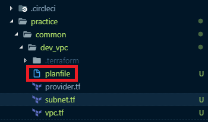

# 테라폼을 사용하여 테스트 환경 구축

Last Edited: Jun 25, 2019 4:38 PM
Tags: Important,Marketing

> asbubam's blog의 [AWS VPC Network with Terraform](https://blog.2dal.com/2017/09/17/aws-vpc-network-with-terraform/) 포스팅을 참고하여 구축하고 작성하였습니다.

## 프로바이더 초기화

1. 프로바이더를 설정할 파일 이름을 provider.tf로 생성하고 다음 스크립트를 작성한다.

        # 프로바이더 플러그인 설치 및 초기 설정을 위해 terraform init 명령 해야함
        provider "aws" {
          region = "ap-southeast-1"
        }

    - 프로바이더로 aws를 사용하고 region은 테스트용도로 싱가포르로 지정했다.
    - 여기에 작성되는 정보들은 각 프로바이더마다 key/value 값이 다르기 때문에 확인 후 작성해야한다.
2. 스크립트가 존재하는 위치에서 다음 명령을 실행하여 플러그인 설치 및 초기화를 진행한다.

        terraform init

3. 다음과 같이 출력 결과가 나타나면 성공이다.

        Initializing the backend...
        
        Initializing provider plugins...
        - Checking for available provider plugins...
        - Downloading plugin for provider "aws" (terraform-providers/aws) 2.16.0...
        
        The following providers do not have any version constraints in configuration,
        so the latest version was installed.
        
        To prevent automatic upgrades to new major versions that may contain breaking
        changes, it is recommended to add version = "..." constraints to the
        corresponding provider blocks in configuration, with the constraint strings
        suggested below.
        
        * provider.aws: version = "~> 2.16"
        
        Terraform has been successfully initialized!
        
        You may now begin working with Terraform. Try running "terraform plan" to see
        any changes that are required for your infrastructure. All Terraform commands
        should now work.
        
        If you ever set or change modules or backend configuration for Terraform,
        rerun this command to reinitialize your working directory. If you forget, other
        commands will detect it and remind you to do so if necessary.

4. 다음과 같이 plan 명령을 사용하여 작성된 테라폼 스크립트가 정상적으로 동작할지 미리 검사해볼 수 있다.

        terraform plan

5. 현재는 작성된 스크립트가 존재하지 않아서 No changes. 라고 출력된다.

        PS E:\works\git\2dal-infrastructure\practice\common\dev_vpc> terraform plan
        Refreshing Terraform state in-memory prior to plan...
        The refreshed state will be used to calculate this plan, but will not be
        persisted to local or remote state storage.

   ​     
        ------------------------------------------------------------------------
        
        No changes. Infrastructure is up-to-date.
        
        This means that Terraform did not detect any differences between your
        configuration and real physical resources that exist. As a result, no
        actions need to be performed.

## VPC 스크립트 작성

1. 프로바이더 파일과 동일한 위치에서 다음과 같이 [vpc.tf](http://vpc.tf) 파일을 작성한다.

        resource "aws_vpc" "dev" {
            cidr_block           = "172.16.0.0/16"
        
            # dns 관련 두 속성 중 하나라도 false이면 DNS 이름을 받지 못함
            enable_dns_hostnames = true # 퍼블릭 IP 주소를 갖는 인스턴스가 해당하는 퍼블릭 DNS 호스트 이름을 받는지 여부
            enable_dns_support   = true # DNS 확인이 지원되는지 여부
            
            instance_tenancy     = "default"    # default : 공유된 하드웨어, dedicated : 단일 테넌트 하드웨어, host : 격리된 전용 호스트
        
            tags = {
                Name = "dev"
            }
        }

    - resource에 지정된 aws_vpc는 aws 프로바이더에서 제공하는 예약어이며, AWS의 VPC에 대한 리소스를 정의하겠다는 의미이다.
    - aws_vpc 다음으로 오는 dev는 해당 리소스에 대한 이름을 지정한 것이다. 즉, 사용자 정의 값이기 때문에 임의의 이름을 지정할 수 있다.
    - resource 내의 각 key 값들은 모두 예약어이고, VPC를 구성하기 위한 설정이다.
        - 각 설정들에 대한 상세한 내용은 [여기](https://www.terraform.io/docs/providers/aws/r/vpc.html)를 참고
2. 저장 후 terraform plan 명령을 실행해본다.

        terraform plan

3. 실행 결과는 다음과 같다.

        Refreshing Terraform state in-memory prior to plan...
        The refreshed state will be used to calculate this plan, but will not be
        persisted to local or remote state storage.

   ​     
        ------------------------------------------------------------------------
        
        An execution plan has been generated and is shown below.
        Resource actions are indicated with the following symbols:
          + create
        
        Terraform will perform the following actions:
        
          # aws_vpc.dev will be created
          + resource "aws_vpc" "dev" {
              + arn                              = (known after apply)
              + assign_generated_ipv6_cidr_block = false
              + cidr_block                       = "172.16.0.0/16"
              + default_network_acl_id           = (known after apply)
              + default_route_table_id           = (known after apply)
              + default_security_group_id        = (known after apply)
              + dhcp_options_id                  = (known after apply)
              + enable_classiclink               = (known after apply)
              + enable_classiclink_dns_support   = (known after apply)
              + enable_dns_hostnames             = true
              + enable_dns_support               = true
              + id                               = (known after apply)
              + instance_tenancy                 = "default"
              + ipv6_association_id              = (known after apply)
              + ipv6_cidr_block                  = (known after apply)
              + main_route_table_id              = (known after apply)
              + owner_id                         = (known after apply)
              + tags                             = {
                  + "Name" = "dev"
                }
            }
        
        Plan: 1 to add, 0 to change, 0 to destroy.
        
        ------------------------------------------------------------------------
        
        Note: You didn't specify an "-out" parameter to save this plan, so Terraform
        can't guarantee that exactly these actions will be performed if
        "terraform apply" is subsequently run.

    - 설정한 스크립트를 실행하면 실제 AWS에서 반영되는 항목들에 대한 리스트가 출력된다.
    - known after apply로 표시된 부분은 plan 단계에서는 알 수 없는 항목들로, apply 명령을 실행한 후에 실제 리소스들이 AWS에 생성이 되면 확인이 가능하다.
    - Note를 보면 -out 파라미터가 지정되지 않아서 plan 내용이 저장되지 않아 apply 실행 시 동일하게 적용되지 않을 수 있다는 메시지가 출력된다.
        - Note 내용에 대한 자세한 정보는 [여기](https://blog.outsider.ne.kr/1313)를 참고
        - plan의 옵션에 대한 자세한 내용은 [여기](https://www.terraform.io/docs/commands/plan.html)를 참고

## Subnet 스크립트 작성

1. 다음과 같이 [subnet.tf](http://subnet.tf) 파일을 작성한다.

        resource "aws_subnet" "public_1a" {
          vpc_id            = "aws_vpc.dev.id"
          availability_zone = "ap-northeast-1a"
          cidr_block        = "172.16.1.0/24"
        
          tags = {
            Name = "public-1a"
          }
        }
        
        resource "aws_subnet" "public_1c" {
          vpc_id            = "aws_vpc.dev.id"
          availability_zone = "ap-northeast-1c"
          cidr_block        = "172.16.2.0/24"
        
          tags = {
            Name = "public-1c"
          }
        }

    - syntax는 VPC 생성 부분과 동일하다.
    - aws_subnet 설정에 대한 자세한 내용은 [여기](https://www.terraform.io/docs/providers/aws/r/subnet.html)를 참고
2. 이번에는 plan 명령 실행시 -out 옵션을 사용해본다.

        terraform plan -out=planfile

3. 실행 결과는 다음과 같다.

        Refreshing Terraform state in-memory prior to plan...
        The refreshed state will be used to calculate this plan, but will not be
        persisted to local or remote state storage.

   ​     
        ------------------------------------------------------------------------
        
        An execution plan has been generated and is shown below.
        Resource actions are indicated with the following symbols:
          + create
        
        Terraform will perform the following actions:
        
          # aws_subnet.public_1a will be created
          + resource "aws_subnet" "public_1a" {
              + arn                             = (known after apply)
              + assign_ipv6_address_on_creation = false
              + availability_zone               = "ap-northeast-1a"
              + availability_zone_id            = (known after apply)
              + cidr_block                      = "172.16.1.0/24"
              + id                              = (known after apply)
              + ipv6_cidr_block                 = (known after apply)
              + ipv6_cidr_block_association_id  = (known after apply)
              + map_public_ip_on_launch         = false
              + owner_id                        = (known after apply)
              + tags                            = {
                  + "Name" = "public-1a"
                }
              + vpc_id                          = "aws_vpc.dev.id"
            }
        
          # aws_subnet.public_1c will be created
          + resource "aws_subnet" "public_1c" {
              + arn                             = (known after apply)
              + assign_ipv6_address_on_creation = false
              + availability_zone               = "ap-northeast-1c"
              + availability_zone_id            = (known after apply)
              + cidr_block                      = "172.16.2.0/24"
              + id                              = (known after apply)
              + ipv6_cidr_block                 = (known after apply)
              + ipv6_cidr_block_association_id  = (known after apply)
              + map_public_ip_on_launch         = false
              + owner_id                        = (known after apply)
              + tags                            = {
                  + "Name" = "public-1c"
                }
              + vpc_id                          = "aws_vpc.dev.id"
            }
        
          # aws_vpc.dev will be created
          + resource "aws_vpc" "dev" {
              + arn                              = (known after apply)
              + assign_generated_ipv6_cidr_block = false
              + cidr_block                       = "172.16.0.0/16"
              + default_network_acl_id           = (known after apply)
              + default_route_table_id           = (known after apply)
              + default_security_group_id        = (known after apply)
              + dhcp_options_id                  = (known after apply)
              + enable_classiclink               = (known after apply)
              + enable_classiclink_dns_support   = (known after apply)
              + enable_dns_hostnames             = true
              + enable_dns_support               = true
              + id                               = (known after apply)
              + instance_tenancy                 = "default"
              + ipv6_association_id              = (known after apply)
              + ipv6_cidr_block                  = (known after apply)
              + main_route_table_id              = (known after apply)
              + owner_id                         = (known after apply)
              + tags                             = {
                  + "Name" = "dev"
                }
            }
        
        Plan: 3 to add, 0 to change, 0 to destroy.
        
        ------------------------------------------------------------------------
        
        This plan was saved to: planfile
        
        To perform exactly these actions, run the following command to apply:
            terraform apply "planfile"

    - 마찬가지로 생성될 리소스에 대한 정보들이 출력되고 아까와는 다르게 하단에 apply 명령 실행 시 planfile을 사용하라는 메시지가 보인다.
    - planfile을 사용함으로써 plan 이 후 tf 파일이 변경 되어 plan을 한 시점과 apply를 한 시점의 스크립트가 달라지는 것을 방지할 수 있다.
4. 다음과 같이 planfile이 생성된 것을 확인할 수 있다.

    

## Internet Gateway 스크립트 작성

1. 인터넷 연결을 위해 Internet Gateway를 생성하기 위한 internet_gateway.tf 파일을 작성한다.

        resource "aws_internet_gateway" "dev" {
          vpc_id = "aws_vpc.dev.id"
        
          tags = {
            Name = "dev"
          }
        }

    - syntax는 VPC 생성 부분과 동일하다.
    - aws_internet_gateway 설정에 대한 자세한 내용은 [여기](https://www.terraform.io/docs/providers/aws/r/internet_gateway.html)를 참고
2. 위와 마찬가지로 -out 옵션을 지정하여 plan 명령을 실행한다.

        terraform plan -out=planfile

## Route Table 스크립트 작성

1. 각 서브넷에서 인터넷 연결이 가능하도록 route_table.tf 스크립트를 작성한다.

        # dev_public
        resource "aws_route_table" "dev_public" {
          vpc_id = "aws_vpc.dev.id"
        
          route {
            cidr_block = "0.0.0.0/0"
            gateway_id = "aws_internet_gateway.dev.id"
          }
        
          tags = {
            Name = "dev-public"
          }
        }
        
        resource "aws_route_table_association" "dev_public_1a" {
          subnet_id      = "aws_subnet.public_1a.id"
          route_table_id = "aws_route_table.dev_public.id"
        }
        
        resource "aws_route_table_association" "dev_public_1c" {
          subnet_id      = "aws_subnet.public_1c.id"
          route_table_id = "aws_route_table.dev_public.id"
        }

    - 라우팅 테이블에 public Subnet과 Internet Gateway를 연결하여 외부 통신이 가능하도록 한다.
    - syntax는 VPC 생성 부분과 동일하다.
    - aws_route_table 설정에 대한 자세한 내용은 [여기](https://www.terraform.io/docs/providers/aws/r/route_table.html)를 참고
2. 위와 마찬가지로 -out 옵션을 지정하여 plan 명령을 실행한다.

        terraform plan -out=planfile

## Network ACL (NACL) 스크립트 작성

1. default로 생성되는 리소스들은 굳이 테라폼 스크립트를 작성하지 않아도 생성되지만 모든 리소스를 테라폼으로 관리하기 위해 nacl.tf 스크립트를 작성한다.

        resource "aws_default_network_acl" "dev_default" {
          default_network_acl_id = "aws_vpc.dev.default_network_acl_id"
        
          ingress {                 # 들어오는 트래픽(Inbound) 설정
            protocol   = -1         # 프로토콜을 지정 (-1인 경우 모든 프로토콜)
            rule_no    = 100        # 우선 순위 설정
            action     = "allow"    # 허용 여부 (allow | deny)
            cidr_block = "0.0.0.0/0"
            from_port  = 0
            to_port    = 0
          }
        
          egress {              # 나가는 트래픽(Outbound) 설정
            protocol   = -1     # 설정은 ingress와 동일
            rule_no    = 100
            action     = "allow"
            cidr_block = "0.0.0.0/0"
            from_port  = 0
            to_port    = 0
          }
        
          subnet_ids = [
            "aws_subnet.public_1a.id",
            "aws_subnet.public_1c.id",
          ]
        
          tags = {
            Name = "dev-default"
          }
        }

    - NACL은 기본적으로 들어오는 트래픽과 나가는 트래픽을 모두 allow 한다.
    - 해당 NACL을 위에서 생성한 subnet에 연동한다.
    - syntax는 VPC 생성 부분과 동일하다.
    - aws_default_network_acl 설정에 대한 자세한 내용은 [여기](https://www.terraform.io/docs/providers/aws/r/default_network_acl.html)를 참고
2. 위와 마찬가지로 -out 옵션을 지정하여 plan 명령을 실행한다.

        terraform plan -out=planfile

## Security Group 스크립트 작성

1. default Security Group 설정을 위해 security_group.tf 스크립트를 작성한다.

        resource "aws_default_security_group" "dev_default" {
          vpc_id = "aws_vpc.dev.id"
        
          ingress {     # 자기 자신의 Security Group의 모든 inboud 트래픽 허용
            protocol  = -1
            self      = true
            from_port = 0
            to_port   = 0
          }
        
          egress {      # 모든 outboud 트래픽 허용
            from_port   = 0
            to_port     = 0
            protocol    = "-1"
            cidr_blocks = ["0.0.0.0/0"]
          }
        
          tags = {
            Name = "dev-default"
          }
        }

    - syntax는 VPC 생성 부분과 동일하다.
    - aws_default_security_group 설정에 대한 자세한 내용은 [여기](https://www.terraform.io/docs/providers/aws/r/default_security_group.html)를 참고
2. 위와 마찬가지로 -out 옵션을 지정하여 plan 명령을 실행한다.

        terraform plan -out=planfile

## EC2 Instance 스크립트 작성

1. 샘플용 EC2 인스턴스를 생성하기 위해 sample_ec2.tf 스크립트를 작성한다.

        resource "aws_security_group" "sample_ec2" {
          name        = "sample_ec2"
          description = "open ssh port for sample_ec2"
        
          vpc_id = "aws_vpc.dev.id"
        
          ingress {
            from_port   = 22
            to_port     = 22
            protocol    = "tcp"
            cidr_blocks = ["0.0.0.0/0"]
          }
        
          egress {
            from_port   = 0
            to_port     = 0
            protocol    = "-1"
            cidr_blocks = ["0.0.0.0/0"]
          }
        
          tags {
            Name = "sample_ec2"
          }
        }
        
        resource "aws_eip" "sample_ec2_1a" {
          instance = "aws_instance.sample_ec2_1a.id"
          vpc      = true
        }
        
        resource "aws_instance" "sample_ec2_1a" {
          ami               = "${var.amazon_linux}"
          availability_zone = "ap-southeast-1a"
          instance_type     = "t2.nano"
          key_name          = "${var.dev_keyname}"
        
          vpc_security_group_ids = [
            "aws_security_group.sample_ec2.id",
            "aws_default_security_group.dev_default.id",
          ]
        
          subnet_id                   = "aws_subnet.public_1a.id"
          associate_public_ip_address = true
        
          tags = {
            Name = "sample_ec2-1a"
          }
        }

    - syntax는 VPC 생성 부분과 동일하다.
    - aws_instance 설정에 대한 자세한 내용은 [여기](https://www.terraform.io/docs/providers/aws/r/instance.html)를 참고
2. 위와 마찬가지로 -out 옵션을 지정하여 plan 명령을 실행한다.

        terraform plan -out=planfile

## 변수 스크립트 작성

1. tf 파일들에서 사용할 변수 설정을 위해 [variable.tf](http://variable.tf) 스크립트 작성

        variable "amazon_linux" {
          # Amazon Linux 2 AMI (HVM), SSD Volume Type
          default = "ami-0602ae7e6b9191aea"
        }
        
        variable "dev_keyname" {
          default = "yongho1037"
        }

2. 다른 tf 파일들에서 [var.xxx](http://var.xxx) 형식으로 변수를 참조한다.

        ex)
        var.amazon_linux
        var.dev_keyname

## 스크립트 실행

지금까지 Terraform을 사용하여 EC2 인스턴스를 실행하기 위한 환경을 구성했다. 아직까지는 실제 AWS 상에 리소스가 생성된 것이기 아니기 때문에 이제 terraform apply 명령으로 리소스를 생성해본다. 

1. AWSCLI를 사용하여 Credential 정보를 입력한다.

        aws configure

    - [direnv](https://direnv.net/) 도구를 사용하면 디렉토리 단위로 설정을 적용할 수 있다.
    - 관련해서 자세한 내용은 [여기](https://blog.outsider.ne.kr/1306)를 참고
2. 다음과 같이 Credential 정보를 입력한다.

        AWS Access Key ID [****************W7TA]: 
        AWS Secret Access Key [****************14zb]: 
        Default region name [ap-north-east-2]: ap-southeast-1
        Default output format [None]:

3. fmt 명령으로 표준 포맷에 맞게 파일을 수정한다. 

        terraform fmt

4. 실행 결과로 수정된 파일 리스트를 반환한다.

        nacl.tf
        security_group.tf
        vpc.tf

5. plan 명령으로 작성한 스크립트에 문제가 없는지, 리소스가 AWS 어떻게 반영될지 검사해본다.

        terraform plan -out=planfile

6. plan 명령으로 생성된 planfile을 기반으로 apply 명령을 실행하여 실제 AWS 환경에 리소스들을 생성한다.

        terraform apply "planfile"

    - 이미 plan을 실행하여 만들어진 planfile을 사용하기 때문에 추가적으로 plan을 실행하지 않는다. (planfile을 사용하지 않을 경우 기본적으로 plan 명령 실행 후 apply를 실행함)
7. 실행 결과는 다음과 같다.

        aws_vpc.dev: Creating...
        aws_vpc.dev: Creation complete after 7s [id=vpc-036c5d7cc3d9efdcc]
        aws_internet_gateway.dev: Creating...
        aws_subnet.public_subnet_2: Creating...
        aws_subnet.public_subnet_1: Creating...
        aws_default_security_group.dev_default: Creating...
        aws_security_group.sample_ec2: Creating...
        aws_subnet.public_subnet_1: Creation complete after 3s [id=subnet-09bca8ccd385777b8]
        aws_subnet.public_subnet_2: Creation complete after 3s [id=subnet-0d5946ab678dd0187]
        aws_default_network_acl.dev_default: Creating...
        aws_internet_gateway.dev: Creation complete after 3s [id=igw-0337c861cb501f992]
        aws_route_table.dev_public: Creating...
        aws_default_security_group.dev_default: Creation complete after 5s [id=sg-0e33850e7a5cd449d]
        aws_security_group.sample_ec2: Creation complete after 6s [id=sg-0c50972b72060cb33]
        aws_instance.sample_ec2: Creating...
        aws_route_table.dev_public: Creation complete after 3s [id=rtb-014475d6ee5b9f2fd]
        aws_route_table_association.dev_public_1: Creating...
        aws_route_table_association.dev_public_2: Creating...
        aws_route_table_association.dev_public_1: Creation complete after 1s [id=rtbassoc-00e75f41dc6305a48]
        aws_route_table_association.dev_public_2: Creation complete after 1s [id=rtbassoc-0ac7449c63783959c]
        aws_default_network_acl.dev_default: Creation complete after 6s [id=acl-0ab77606f601879da]
        aws_instance.sample_ec2: Still creating... [10s elapsed]
        aws_instance.sample_ec2: Still creating... [20s elapsed]
        aws_instance.sample_ec2: Creation complete after 26s [id=i-0f129d3aea9177fe1]
        aws_eip.sample_ec2: Creating...
        aws_eip.sample_ec2: Creation complete after 2s [id=eipalloc-0d4330dabd9705f61]
        
        Apply complete! Resources: 12 added, 0 changed, 0 destroyed.
        
        The state of your infrastructure has been saved to the path
        below. This state is required to modify and destroy your
        infrastructure, so keep it safe. To inspect the complete state
        use the `terraform show` command.
        
        State path: terraform.tfstate

## 리소스 제거

1. 제거 될 리소스를 확인하기 위해 planfile을 지정하지 않고 destroy 명령을 실행한다.

        terraform destroy

2. destroy를 진행하기 전에 plan을 실행하여 제거될 리소스를 확인 한 후 yes를 입력하여 리소스를 제거한다.

        aws_vpc.dev: Refreshing state... [id=vpc-053f1a6bcbcb583f6]
        aws_internet_gateway.dev: Refreshing state... [id=igw-0937969e03450b9de]
        aws_subnet.public_1c: Refreshing state... [id=subnet-0307fdbabe189273a]
        aws_subnet.public_1a: Refreshing state... [id=subnet-05845e16c9aba665f]
        aws_default_security_group.dev_default: Refreshing state... [id=sg-0c900542d952f1d20]
        aws_default_network_acl.dev_default: Refreshing state... [id=acl-065f3b073de4e37e1]
        aws_route_table.dev_public: Refreshing state... [id=rtb-0ca14829858d4c22d]
        aws_route_table_association.dev_public_1a: Refreshing state... [id=rtbassoc-0d9c32e45ff07ee27]
        aws_route_table_association.dev_public_1c: Refreshing state... [id=rtbassoc-066277f314126d73a]
        
        An execution plan has been generated and is shown below.
        Resource actions are indicated with the following symbols:
          - destroy
        
        Terraform will perform the following actions:
        
          # aws_default_network_acl.dev_default will be destroyed
          - resource "aws_default_network_acl" "dev_default" {
              - default_network_acl_id = "acl-065f3b073de4e37e1" -> null
              - id                     = "acl-065f3b073de4e37e1" -> null
              - owner_id               = "444926633043" -> null
              - subnet_ids             = [
                  - "subnet-0307fdbabe189273a",
                  - "subnet-05845e16c9aba665f",
                ] -> null
              - tags                   = {
                  - "Name" = "dev-default"
                } -> null
              - vpc_id                 = "vpc-053f1a6bcbcb583f6" -> null
        
              - egress {
                  - action     = "allow" -> null
                  - cidr_block = "0.0.0.0/0" -> null
                  - from_port  = 0 -> null
                  - icmp_code  = 0 -> null
                  - icmp_type  = 0 -> null
                  - protocol   = "-1" -> null
                  - rule_no    = 100 -> null
                  - to_port    = 0 -> null
                }
        
              - ingress {
                  - action     = "allow" -> null
                  - cidr_block = "0.0.0.0/0" -> null
                  - from_port  = 0 -> null
                  - icmp_code  = 0 -> null
                  - icmp_type  = 0 -> null
                  - protocol   = "-1" -> null
                  - rule_no    = 100 -> null
                  - to_port    = 0 -> null
                }
            }
        
          # aws_default_security_group.dev_default will be destroyed
          - resource "aws_default_security_group" "dev_default" {
              - arn                    = "arn:aws:ec2:ap-southeast-1:444926633043:security-group/sg-0c900542d952f1d20" -> null
              - egress                 = [
                  - {
                      - cidr_blocks      = [
                          - "0.0.0.0/0",
                        ]
                      - description      = ""
                      - from_port        = 0
                      - ipv6_cidr_blocks = []
                      - prefix_list_ids  = []
                      - protocol         = "-1"
                      - security_groups  = []
                      - self             = false
                      - to_port          = 0
                    },
                ] -> null
              - id                     = "sg-0c900542d952f1d20" -> null
              - ingress                = [
                  - {
                      - cidr_blocks      = []
                      - description      = ""
                      - from_port        = 0
                      - ipv6_cidr_blocks = []
                      - prefix_list_ids  = []
                      - protocol         = "-1"
                      - security_groups  = []
                      - self             = true
                      - to_port          = 0
                    },
                ] -> null
              - name                   = "default" -> null
              - owner_id               = "444926633043" -> null
              - revoke_rules_on_delete = false -> null
              - tags                   = {
                  - "Name" = "dev-default"
                } -> null
              - vpc_id                 = "vpc-053f1a6bcbcb583f6" -> null
            }
        
          # aws_internet_gateway.dev will be destroyed
          - resource "aws_internet_gateway" "dev" {
              - id       = "igw-0937969e03450b9de" -> null
              - owner_id = "444926633043" -> null
              - tags     = {
                  - "Name" = "dev"
                } -> null
              - vpc_id   = "vpc-053f1a6bcbcb583f6" -> null
            }
        
          # aws_route_table.dev_public will be destroyed
          - resource "aws_route_table" "dev_public" {
              - id               = "rtb-0ca14829858d4c22d" -> null
              - owner_id         = "444926633043" -> null
              - propagating_vgws = [] -> null
              - route            = [
                  - {
                      - cidr_block                = "0.0.0.0/0"
                      - egress_only_gateway_id    = ""
                      - gateway_id                = "igw-0937969e03450b9de"
                      - instance_id               = ""
                      - ipv6_cidr_block           = ""
                      - nat_gateway_id            = ""
                      - network_interface_id      = ""
                      - transit_gateway_id        = ""
                      - vpc_peering_connection_id = ""
                    },
                ] -> null
              - tags             = {
                  - "Name" = "dev-public"
                } -> null
              - vpc_id           = "vpc-053f1a6bcbcb583f6" -> null
            }
        
          # aws_route_table_association.dev_public_1a will be destroyed
          - resource "aws_route_table_association" "dev_public_1a" {
              - id             = "rtbassoc-0d9c32e45ff07ee27" -> null
              - route_table_id = "rtb-0ca14829858d4c22d" -> null
              - subnet_id      = "subnet-05845e16c9aba665f" -> null
            }
        
          # aws_route_table_association.dev_public_1c will be destroyed
          - resource "aws_route_table_association" "dev_public_1c" {
              - id             = "rtbassoc-066277f314126d73a" -> null
              - route_table_id = "rtb-0ca14829858d4c22d" -> null
              - subnet_id      = "subnet-0307fdbabe189273a" -> null
            }
        
          # aws_subnet.public_1a will be destroyed
          - resource "aws_subnet" "public_1a" {
              - arn                             = "arn:aws:ec2:ap-southeast-1:444926633043:subnet/subnet-05845e16c9aba665f" -> null
              - assign_ipv6_address_on_creation = false -> null
              - availability_zone               = "ap-southeast-1a" -> null
              - availability_zone_id            = "apse1-az1" -> null
              - cidr_block                      = "172.16.1.0/24" -> null
              - id                              = "subnet-05845e16c9aba665f" -> null
              - map_public_ip_on_launch         = false -> null
              - owner_id                        = "444926633043" -> null
              - tags                            = {
                  - "Name" = "public-1"
                } -> null
              - vpc_id                          = "vpc-053f1a6bcbcb583f6" -> null
            }
        
          # aws_subnet.public_1c will be destroyed
          - resource "aws_subnet" "public_1c" {
              - arn                             = "arn:aws:ec2:ap-southeast-1:444926633043:subnet/subnet-0307fdbabe189273a" -> null
              - assign_ipv6_address_on_creation = false -> null
              - availability_zone               = "ap-southeast-1c" -> null
              - availability_zone_id            = "apse1-az3" -> null
              - cidr_block                      = "172.16.2.0/24" -> null
              - id                              = "subnet-0307fdbabe189273a" -> null
              - map_public_ip_on_launch         = false -> null
              - owner_id                        = "444926633043" -> null
              - tags                            = {
                  - "Name" = "public-2"
                } -> null
              - vpc_id                          = "vpc-053f1a6bcbcb583f6" -> null
            }
        
          # aws_vpc.dev will be destroyed
          - resource "aws_vpc" "dev" {
              - arn                              = "arn:aws:ec2:ap-southeast-1:444926633043:vpc/vpc-053f1a6bcbcb583f6" -> null
              - assign_generated_ipv6_cidr_block = false -> null
              - cidr_block                       = "172.16.0.0/16" -> null
              - default_network_acl_id           = "acl-065f3b073de4e37e1" -> null
              - default_route_table_id           = "rtb-02b7c4e41d3cd4da3" -> null
              - default_security_group_id        = "sg-0c900542d952f1d20" -> null
              - dhcp_options_id                  = "dopt-8ff1d1e8" -> null
              - enable_classiclink               = false -> null
              - enable_classiclink_dns_support   = false -> null
              - enable_dns_hostnames             = true -> null
              - enable_dns_support               = true -> null
              - id                               = "vpc-053f1a6bcbcb583f6" -> null
              - instance_tenancy                 = "default" -> null
              - main_route_table_id              = "rtb-02b7c4e41d3cd4da3" -> null
              - owner_id                         = "444926633043" -> null
              - tags                             = {
                  - "Name" = "dev"
                } -> null
            }
        
        Plan: 0 to add, 0 to change, 9 to destroy.
        
        Do you really want to destroy all resources?
          Terraform will destroy all your managed infrastructure, as shown above.
          There is no undo. Only 'yes' will be accepted to confirm.
        
          Enter a value: yes
        
        aws_route_table_association.dev_public_1a: Destroying... [id=rtbassoc-0d9c32e45ff07ee27]
        aws_route_table_association.dev_public_1c: Destroying... [id=rtbassoc-066277f314126d73a]
        aws_default_security_group.dev_default: Destroying... [id=sg-0c900542d952f1d20]
        aws_default_network_acl.dev_default: Destroying... [id=acl-065f3b073de4e37e1]
        aws_default_network_acl.dev_default: Destruction complete after 0s
        aws_default_security_group.dev_default: Destruction complete after 0s
        aws_route_table_association.dev_public_1a: Destruction complete after 0s
        aws_route_table_association.dev_public_1c: Destruction complete after 0s
        aws_subnet.public_1a: Destroying... [id=subnet-05845e16c9aba665f]
        aws_subnet.public_1c: Destroying... [id=subnet-0307fdbabe189273a]
        aws_route_table.dev_public: Destroying... [id=rtb-0ca14829858d4c22d]
        aws_subnet.public_1a: Destruction complete after 1s
        aws_subnet.public_1c: Destruction complete after 2s
        aws_route_table.dev_public: Destruction complete after 2s
        aws_internet_gateway.dev: Destroying... [id=igw-0937969e03450b9de]
        aws_internet_gateway.dev: Still destroying... [id=igw-0937969e03450b9de, 10s elapsed]
        aws_internet_gateway.dev: Destruction complete after 11s
        aws_vpc.dev: Destroying... [id=vpc-053f1a6bcbcb583f6]
        aws_vpc.dev: Destruction complete after 1s
        
        Destroy complete! Resources: 9 destroyed.

## 참고

- [테라폼(Terraform) 기초 튜토리얼](https://www.44bits.io/ko/post/terraform_introduction_infrastrucute_as_code)