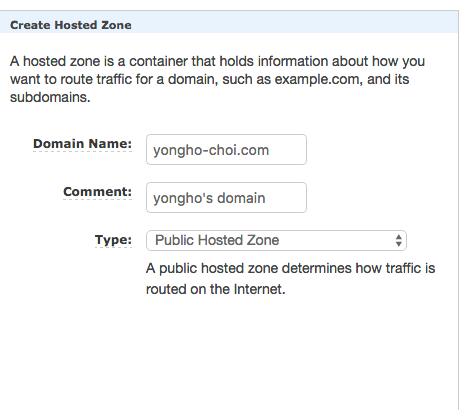
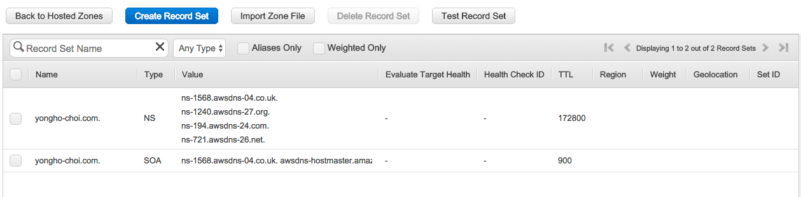
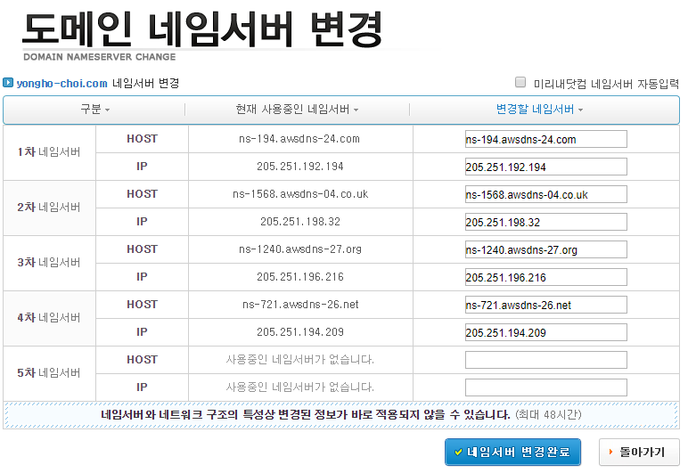

## Rout 53

* 도메인이 없는 경우 이 서비스를 사용하여 도메인을 구매하고 사용할 수 있음
* 도메인이 있는 경우 해당 도메인을 사용하여 DNS 구성 가능
* 호스트 영역 생성 시 자동으로 구역에 해당하는 4개의 이름 서버(NS) 레코드와 권한 시작(SOA) 레코드를 생성함
  * [Amazon Route 53에서 퍼블릭 호스팅 영역에 대해 생성하는 NS 및 SOA 리소스 레코드 세트](http://docs.aws.amazon.com/ko_kr/Route53/latest/DeveloperGuide/SOA-NSrecords.html) 참조
* 동일한 도메인 주소 값을 기준으로 트래픽 조절 가능
  * 예를 들어 하나의 도메인 주소에 여러 개의 IP를 pool로 구성하여 들어오는 트래픽을 순서대로 전달하다가 문제가 생긴 IP의 경우 pool에서 제거하여 트래픽 조절을 할 수 있다.
  * Rout 53뒤에 서로 다른 가용영역의 로드밸런서를 둬서 시스템을 안정적으로 운영할 수도 있음

### 역할

* 네임 서버 : 도메인 값에 대한 응답을 줌
* Health Check : 네임 서버의 Failover Routing Policy를 연동하면 특정 주소값에 문제가 생긴 것을 감지 가능
* Global에 위치한 다수의 Edge를 사용하여 서비스 하기 때문에 더욱 복잡한 레벨의 Routing Policy(Latency 또는 Geo 기반)를 부가적으로 사용할 수 있음

### 지원하는 레코드 형식

* A 레코드 : 서버 IP 관리
* CNAME : 도메인 별칭 레코드
* TXT 레코드 : 텍스트
* MX 레코드 : 메일 서비스를 위함
* NS 레코드 : 네임서버 레코드
* AAAA 레코드 : IPv6 IP
* SOA 레코드 : 도메인 정보
* PTR 레코드 :  역방향 정보
* STF 레코드 : 이베일 발신자 확인을 위함
* SPF 레코드 : SIP 통신을 위함
* SRV 레코드 : 도메인 정보를 나타내기 위함

## Public/Private Hosted Zone

* HostedZone : google.com과 같이 Route53에서 관리할 도메인의 주소 대역을 의미
  * google.com이라는 Hosted Zone을 생성하고 구성 절차를 마치면 mail.google.com과 같은 하위 도메인의 주소값을 제어할 수 있음.
* Public Hosted Zone : 전 세계에 걸쳐 사용하는 도메인 제어
* Private Hosted Zone : 특정 VPC 내에서만 사용하는 도메인 제어

## 특성

* CloudFront와 같이 전국에 있는 Edge 인프라에서 응답하므로 Client의 위치에 따라 가장 적합한 위치에서 빠르게 응답함

### Routing Policy

* Simple Policy : 다수의 A 레코드가 등록되어 있을 경우 라운드 로빈 방식으로 IP를 순서대로 전달
* Weighted Policy : 동일한 도메인 주소를 가진 응답 레코드를 복수로 생성하여 일정 비율로 IP를 전달
  * Weight 값은 0~255
  * 두 개의 ip가 할당 되어 있다고 가정하고 한쪽에는 weight값을 1, 다른 한쪽에는 weight값을 3을 주었다고 가정하면 weight값을 전체 weight값으로 나눈 값이 비율이 됨
    * 전체 weight값 = 1+3
    * wegith 값이 1인 경우 : 1/(3+1) = 25%
    * weght 값이 3인 경우 : 3(3+1) = 75%
  * 장애가 생긴 IP의 경우 이 weight 값을 0으로 주면 해당 IP로 트래픽이 갈 확률이 0%가 되므로 failover 처리가 가능
* Latency Based Policy : Latency 기반으로 가장 가까운 지역의 IP를 전달
  * Route 53은 사용자의 위치를 기준으로 리전별 응답 성능 데이터를 측정하고 있음
  * 측정한 데이터를 기준으로 사용자에게 가장 가까운 지역의 IP 선별
* Geolocation Based Policy : 국가별 사용자의 도메인 질의에 따라 IP 전달

### 외부 도메인 마이그레이션

* 외부에서 사용하던 도메인을 등록하여 DNS 서비스를 구성할 수 있음

* Route 53 => Hosted zones 메뉴를 선택해서 Hosted zone을 생성한다.

  

  * 생성 시 도메인 명을 현재 소유한 도메인 명으로 입력
  * Type은 외부에서 접근할 수 있도록 Public Hosted Zone으로 한다.

* 생성 된 Hosted zone을 선택해서 들어가보면 NS와 SOA 타입의 레코드가 생성된 것을 확인할 수 있다.

  

* 여기서 해당 도메인으로 DNS 서비스를 하기 위해서는 이 도메인을 발급한 업체의 관리 페이지로 들어가 네임서버를 변경해주어야 한다.

  

* 변경 후에 바로 이 도메인으로 라우팅이 가능하지는 않고, 하루나 이틀정도 소요될 수 있다.

  * DNS 확인 프로그램은 도메인 등록자 NS 레코드를 캐시하는데 레코드의 TTL(Time To Live)이 지정된 기간 동안 NS 레코드가 캐시되고 일반적으로 86,400 ~ 172,800(1~2일) 정도가 소요된다.
  * 이 시간은 서브 도메인을 만드는데 소요되는 시간이 아닌 Hosted zone을 생성하여 네임서버가 갱신되는 시간을 의미한다.

### 비용

* 도메인 구매시 $12
* 표준 쿼리
  * 월별 첫 10억 개 쿼리의 경우 쿼리 1백만 개당 $0.400
  * 월별 10억 개를 초과하는 쿼리의 경우 쿼리 1백만개당 $0.200
* 지연 시간 기반 라우팅 쿼리
  * 월별 첫 10억 개 쿼리의 경우 쿼리 1백만 개당 $0.600
  * 월별 10억 개를 초과하는 쿼리의 경우 쿼리 1백만개당 $0.300
* 지역 DNS 쿼리
  - 월별 첫 10억 개 쿼리의 경우 쿼리 1백만 개당 $0.700
  - 월별 10억 개를 초과하는 쿼리의 경우 쿼리 1백만개당 $0.350
* 상태 확인
  * 기본 상태확인
    * AWS 내 Ip의 경우 월별 상태 확인당 $0.50
    * 외부 Ip의 경우 월별 상태 확인당 $0.75
  * 선택적 상태확인 (HTTPS/스트링매칭/빠른간격/지연시간)
    - AWS 내 Ip의 경우 월별 상태 확인당 $1.00
    - 외부 Ip의 경우 월별 상태 확인당 $2.00

