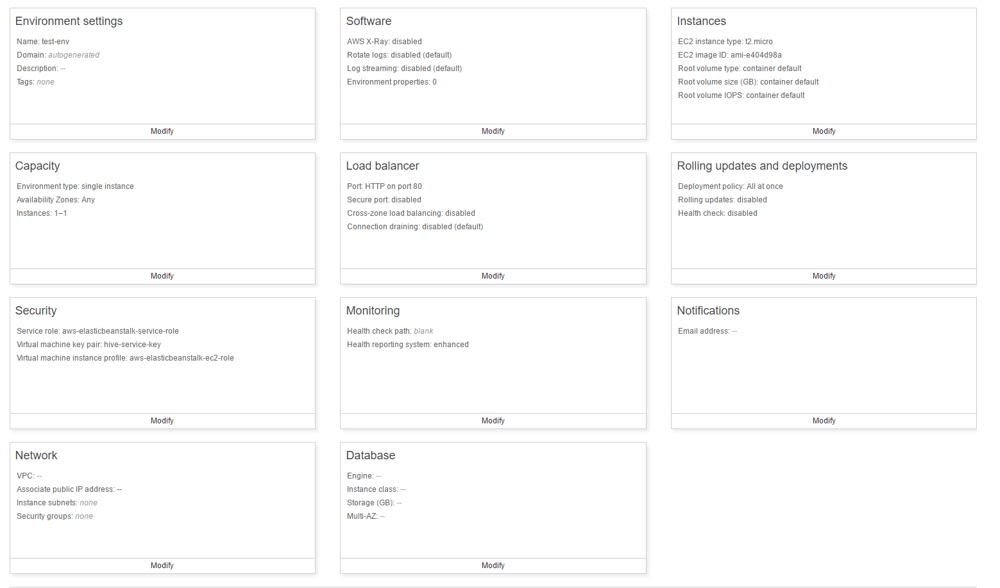
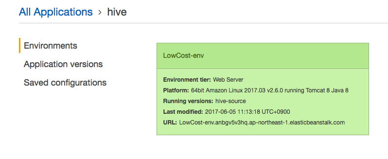
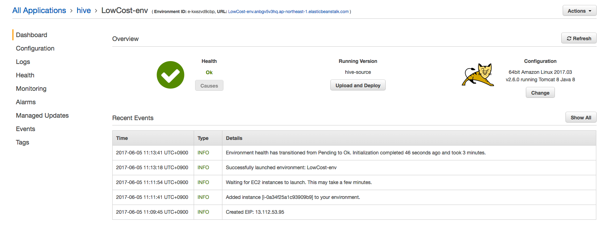
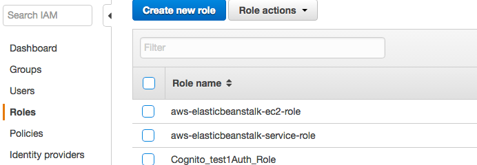
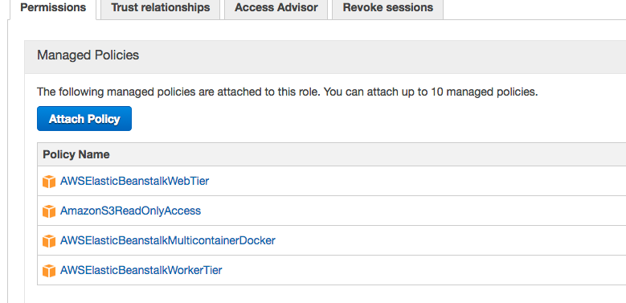

# Amazon ElasticBeanstalk

Amazon Elastic Beanstalk는 크게 Application 이라는 범주 내에 여러개의 Environment들로 구성될 수 있다. 현재 사내에서 개발하고 있는 서비스를 예로 들면 하이브라는 모바일 게임을 특정하는 hive Application 내에 각 컨텐츠 기능을 수행 할 hive-webserver 라는 environment가 존재할 수 있고, 채팅을 담당할 hive-chat 이라는 또하나의 environment가 존재할 수 있다.

environment를 생성할 때 default로 생성을 하게되면 저비용으로 구성되어 각 서비스들이 disable 된 상태로 생성이되는데, 이때 configuration을 설정하지 않으면 key pair가 지정되지 않은 채로 생성되기 때문에 key pair와 security group은 아래 configuration 페이지에서 지정을 해주고 가는 것이 좋다.




혹시나 key 설정을 하지 않은 경우 아래와 같이 다시 설정 페이지로 접속해서 설정을 해줄 수 있다. key pair 설정을 하고 나면 EC2 인스턴스가 재시작 된다.

1. Elastic Beanstalk 서비스 선택

   

2. Application 선택

   

3. Configuration 선택

   

4. Instances의 설정(톱니바퀴) 선택

   

5. EC2 key pair 지정


Beanstalk를 생성하는 절차는 Amazon Elastic Beanstalk 기술 설명서에 상세히 나와있으므로 여기서는 생략하고, Beanstalk를 사용하면서 추가적으로 구현한 부분에 대해서만 다루도록 한다. 

한가지 주의해야하는 점은 EC2 인스턴스를 직접 조작하여 종료나 시작하면 안되고 beanstalk의 App restart 기능을 이용해야 한다. EC 인스턴스를 직접 Stop 해버리면 다시 구동 시 해당 인스턴스는 제거되고 새로 생성되어 버린다.


## Hook

Beanstalk를 통해 Application과 Environment를 구성하는 과정 또는 구성 완료 후 업데이트 및 배포를 수행하는 중간에 원하는 스크립트를 수행하도록 하려면 Hook 기능을 사용하면 된다. 

Hook을 사용하는 방법은 Beanstalk를 통해 생성된 EC2 인스턴스에 접속해서 `/opt/elasticbeanstalk/hooks`에서 수행해야될 시점에 해당하는 하위 디렉토리 안에 스크립트를 위치시키면 된다. 아래 디렉토리 구조를 보면 단번에 느낌이 올 것이다.

```shell
├── appdeploy
│   ├── enact
│   │   ├── 01stop.sh
│   │   ├── 01stop_xray.sh
│   │   ├── 02clean.sh
│   │   ├── 02start_xray.sh
│   │   ├── 03deploy.sh
│   │   ├── 03_stop_proxy.sh
│   │   ├── 04config_deploy.sh
│   │   ├── 05start.sh
│   │   └── 09_start_proxy.sh
│   ├── post
│   │   └── 03monitor_pids.sh
│   └── pre
│       ├── 01clean.sh
│       ├── 01_configure_xray.sh
│       ├── 02unzip.sh
│       ├── 03config_clean.sh
│       ├── 03_configure_proxy.sh
│       └── 04config_generate.sh
├── configdeploy
│   ├── enact
│   │   ├── 01deploy.sh
│   │   ├── 01stop_xray.sh
│   │   ├── 02start_xray.sh
│   │   ├── 03_stop_proxy.sh
│   │   ├── 04restart.sh
│   │   └── 09_start_proxy.sh
│   ├── post
│   └── pre
│       ├── 01clean.sh
│       ├── 01_configure_xray.sh
│       ├── 02unzip.sh
│       ├── 03_configure_proxy.sh
│       └── 04config_generate.sh
├── postinit
│   └── 01processmgrstart.sh
├── preinit
│   ├── 00installpackages.sh
│   ├── 01_install_proxy.sh
│   ├── 01_install_xray_daemon.sh
│   ├── 01logs.sh
│   ├── 02misc.sh
│   ├── 03processmgrsetup.sh
│   └── 03setup_httpd_logging.sh
└── restartappserver
    ├── enact
    │   ├── 01stop_xray.sh
    │   ├── 02start_xray.sh
    │   ├── 03_stop_proxy.sh
    │   ├── 04restart.sh
    │   └── 09_start_proxy.sh
    ├── post
    └── pre
        ├── 01_configure_xray.sh
        ├── 02unzip.sh
        └── 03_configure_proxy.sh
```

* 기본적으로 위와 같이 각 디렉토리에 수행되어야 할 스크립트들이 작성된 것이 있으므로 참고해서 작성하면 된다.


### .ebextensions

hook 기능 외에 beanstalk를 통해 EC2 인스턴스가 생성될 때 원하는 설정이 필요할 수도 있다. 나의 경우에는 filebeat를 통해 로그를 전달하는 과정이 필요했기 때문에 filebeat 설치와 설정파일 갱신의 과정이 필요했는데 오토스케일링 때마다 filebeat를 설치하는 것은 비효율적이라고 생각하여 패키지 설치는 미리 해두고 AMI로 만들어 사용을 했고 설정 파일만 EC2 인스턴스 생성 시에 갱신하도록 구성을 하였다.

이를 위해 .ebextensions를 사용했는데, 미리 약속되어 있는 이 디렉토리 하위에 정해진 규칙을 준수하는 설정 파일들을 만들어두면 beanstalk를 통해 EC2 인스턴스를 생성할 때 작성해 놓은 설정들을 적용시킬 수가 있다.

* tomcat을 사용하는 경우 .ebextensions 디렉토리 구조

  ```
  web_app.war
            |
            |_.ebextensions
            |   |_ 01run.config
            |   |_ 02do.config
            |
            |_META-INF
            |
            |_WEB-INF
                 |_ classes
                 |_ lib
                 |_ web.xml
  ```

  * tomcat을 사용하는 경우 .ebextensions는 war 파일을 압축 해제했을 때 최상위에 위치해야한다. 


위와 같이 디렉토리 구조를 만들기 위해 나는 gradle을 활용하였다. 설정 파일은 resources 디렉토리에서 관리를 하였고, 아래와 같이 build.gradle 파일을 통해 war파일을 생성할 때 .ebextensions의 위치로 파일들을 복사하도록 하였다.

* build.gradle 파일에서 war 파일 설정

  ```
  war {
      from('src/main/resources/ebextensions') {
          into('.ebextensions')
      }
  }
  ```

  * src/main/resources/ebextensions로 디렉토리를 생성 한 후 하위에 설정 파일을 만든다.
  * gradle 빌드 시 war파일을 생성할 때, 해당 디렉토리의 설정 파일을 .ebextensions 디렉토리 안으로 복사한다.

* config 파일 작성 규칙

  * option_settings 하위에 key-value로 옵션 지정

    * namespace를 사용할 수도 있다.

    ```yaml
    option_settings:
      - option_name:  option name
        value:  option value
      - namespace: namespace
        option_name:  option name
        value:  option value
    ```

  * 약식으로 작성도 가능

    ```yaml
    option_settings:
      namespace:
        option name: option value
    ```

  * tomcat 설정 예

    ```yaml
    option_settings:
      - namespace:  aws:elasticbeanstalk:container:tomcat:jvmoptions
        option_name:  Xmx
        value:  256m
      - option_name: MYPARAMETER
        value: parametervalue
    ```


#### Hive에서 ebextensions 사용

jvm 옵션은 아마존 콘솔을 사용하여 설정할 수도 있지만 .ebextensions를 사용해서도 설정이 가능하다.

* tomcat 설정

  ```yaml
  option_settings:
    aws:elasticbeanstalk:container:tomcat:jvmoptions:
      Xms: 512m
      Xmx: 512m
      JVM Options: '-Xmn128m'
  ```


filebeat를 내려받고 설치하기 위해 `commands`를 사용하였고, 설정 파일은 S3에서 내려받아 복사하도록 하였다. 이 과정에서 S3에 접근하기 위한 권한이 필요하므로 IAM에 생성된 role을 지정하여 권한 설정을 수행하였다.

* filebeat를 내려 받고 설치

  ```yaml
  commands:
    filebeat_download:
      command: curl -L -O https://artifacts.elastic.co/downloads/beats/filebeat/filebeat-5.4.1-x86_64.rpm
      cwd: /home/ec2-user
    filebeat_install:
      command: rpm -vi filebeat-5.4.1-x86_64.rpm
      cwd: /home/ec2-user
    delete_filebeat_install_file:
      command: rm filebeat-5.4.1-x86_64.rpm
      cwd: /home/ec2-user
  ```
  * log 수집을 위해 filebeat를 내려받고, 설치한 후 설치 파일 제거
  * 오토 스케일링 시 매번 패키지를 설치해야 되므로 설치 관련된 부분은 미리 구성을 해 놓은 상태로 AMI를 사용하는 방식으로 변경

* S3에서 설정 파일을 받아서 기존 설정 파일을 덮어씌움

  ```yaml
  Resources:
    AWSEBAutoScalingGroup:
      Metadata:
        AWS::CloudFormation::Authentication:
          S3Access:
            type: S3
            roleName: aws-elasticbeanstalk-ec2-role
            buckets: hive-configurations
  files:
   /etc/filebeat/filebeat.yml:
      source: https://s3.ap-northeast-2.amazonaws.com/hive-configurations/filebeat.yml
      authentication: S3Access
  ```

  * S3에 버킷 생성 후 ebextensions에서 접근 권한 설정 후 다운로드

    * roleName에 해당하는 aws-elasticbeanstalk-ec2-role 설정에 S3에 대한 읽기 권한이 필요하다.

    * role 확인을 위해 IAM의 Roles를 선택

      

    * aws-elasticbeanstalk-ec2-role에 S3 읽기 권한 정책 추가

      

  ​


S3를 사용하지 않고, .ebextensions 디렉토리에 filebeat.yml을 넣은 채로 배포하여 beanstalk 구동 시 복사하도록 구성할 수도 있다.

* .ebextensions에 설정 파일을 위치시키고 container_commands를 사용하여 복사

  ```yaml
  container_commands:
    cp-filebeat-config:
      command: cp .ebextensions/filebeat.yml /etc/filebeat/filebeat.yml
  ```


지금까지 Elastic Beanstalk를 생성해보았고 Hook 기능과 .ebextensions를 통한 EC2 인스턴스 초기화에 대해서 알아보았는데, 내 경우에는 오토스케일링을 통해 EC2 인스턴스가 감소될 때 filebeat를 통해 전달되는 로그가 마무리 되지 않았는데 강제로 종료되어 버릴 수 있는 문제점이 있었다. 

그래서 EC2 인스턴스가 종료될 때 filebeat가 정상적으로 작업을 마쳤는지 확인하는 과정이 필요했고 이를 스크립트로 해결하려고 했는데 기본적으로 beanstalk에서는 EC2 종료시 스크립트를 수행시켜주는 기능이 없었다. (못찾은 것일 수도 있음) 그래서 리눅스의 서비스 기능을 통해 종료 시 스크립트를 수행하도록 하는 것으로 해결을 하였는데 이에 대해서는 다음 포스팅에서 다루도록 하겠다.


## 같이 보면 좋은 포스팅

* [[AWS] EC2 인스턴스에 Docker Swarm 구성](http://yongho1037.tistory.com/728)
* [[AWS] EC2 인스턴스에서 docker swarm 서비스를 통해 웹서버 구동 및 확장](http://yongho1037.tistory.com/729)


## 참고

* [war(Web Archives) 패키징 - Java EE 공식 지침)](https://docs.oracle.com/javaee/7/tutorial/packaging003.htm)
* [ebextensions의 설정 옵션들](http://docs.aws.amazon.com/ko_kr/elasticbeanstalk/latest/dg/customize-containers-ec2.html)