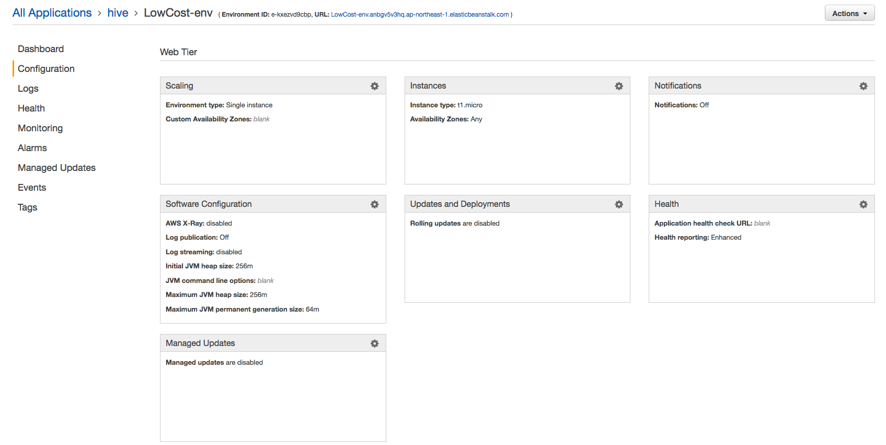
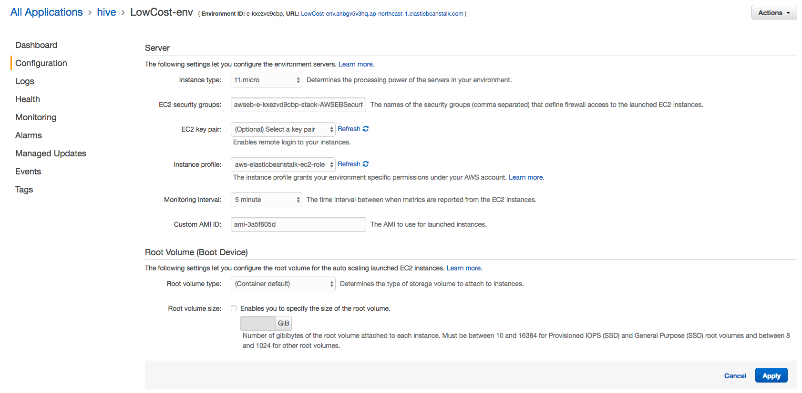

# Amazon ElasticBeanstalk

## EC2 인스턴스 설정

* Beanstalk의 어플리케이션 생성 과정에서는 EC2 인스턴스가 구동될 때 적용할 스크립트라던지 종료 스크립트와 같은 설정이 없음.
* ebextensions를 통해 확장 설정을 하던지, AMI를 사용해야 함.
* EC2 인스턴스를 직접 조작하여 종료나 시작하면 안되고 beanstalk의 App restart 기능을 이용해야 한다.
  * EC2 인스턴스를 직접 Stop 해버리면 다시 구동 시 해당 인스턴스는 제거되고 새로 생성됨


## Hook

* Amazon Beanstalk에서 내리는 명령에 따라 hook을 사용하여 해당 시점에 스크립트를 수행할 수 있다.
  * 각 EC2 인스턴스 기준이 아니고 Beanstalk를 통해 앱 서버를 배포하거나 업데이트하거나 재시작 시에 수행되는 스크립트 설정
* ​


### .ebextensions

* 배포되는 tomcat war파일에 생성하여 beanstalk 구성 시에 수행되도록 함

* 디렉토리 위치

  ```
  web_app.war
            |
            |_.ebextensions
            |   |_ 01run.config
            |   |_ 02do.config
            |
            |_META-INF
            |
            |_WEB-INF
                 |_ classes
                 |_ lib
                 |_ web.xml
  ```

* gradle 사용

  ```
  war {
      from('src/main/resources/ebextensions') {
          into('.ebextensions')
      }
  }
  ```

  * src/main/resources/ebextensions로 디렉토리를 생성 한 후 하위에 설정 파일을 만든다.
  * gradle 빌드 시 war파일을 생성할 때, 해당 디렉토리의 설정 파일을 .ebextensions 디렉토리 안으로 복사한다.

* config 파일 작성 규칙

  * option_settings 하위에 key-value로 옵션 지정

    * namespace를 사용할 수도 있다.

    ```yaml
    option_settings:
      - option_name:  option name
        value:  option value
      - namespace: namespace
        option_name:  option name
        value:  option value
    ```

  * 약식으로 작성도 가능

    ```yaml
    option_settings:
      namespace:
        option name: option value
    ```

  * tomcat 설정 예

    ```yaml
    option_settings:
      - namespace:  aws:elasticbeanstalk:container:tomcat:jvmoptions
        option_name:  Xmx
        value:  256m
      - option_name: MYPARAMETER
        value: parametervalue
    ```


#### Hive에서 ebextensions 사용

* tomcat 설정

  ```yaml
  option_settings:
    aws:elasticbeanstalk:container:tomcat:jvmoptions:
      Xms: 512m
      Xmx: 512m
      JVM Options: '-Xmn128m'
  ```

* host 설정

  * Case1 : filebeat를 beanstalk 환경 구축 시 내려 받고 설치

    ```yaml
    commands:
      filebeat_download:
        command: curl -L -O https://artifacts.elastic.co/downloads/beats/filebeat/filebeat-5.4.1-x86_64.rpm
        cwd: /home/ec2-user
      filebeat_install:
        command: rpm -vi filebeat-5.4.1-x86_64.rpm
        cwd: /home/ec2-user
    ```
    * log 수집을 위해 filebeat 설치
    * 오토 스케일링 시 매번 패키지를 설치해야 되므로 설치 관련된 부분은 미리 구성을 해 놓은 상태로 AMI를 사용하는 방식으로 변경

  * Case2 : 필요한 패키지를 설치한 후 AMI를 미리 구성하고 EC2 인스턴스가 구동될 때 S3에서 설정 파일을 받아서 기존 설정 파일을 덮어씌운 후 서비스 실행

    * S3에 버킷 생성 후 ebextensions에서 접근 권한 설정 후 다운로드

      ```yaml
      Resources:
        AWSEBAutoScalingGroup:
          Metadata:
            AWS::CloudFormation::Authentication:
              S3Access:
                type: S3
                roleName: aws-elasticbeanstalk-ec2-role
                buckets: hive-configurations
      files:
       /etc/filebeat/filebeat.yml:
          source: https://s3.ap-northeast-2.amazonaws.com/hive-configurations/filebeat.yml
          authentication: S3Access
      ```

      * roleName에 해당하는 aws-elasticbeanstalk-ec2-role 설정에 S3에 대한 읽기 권한이 필요하다.

      * role 확인을 위해 IAM의 Roles를 선택

        

      * aws-elasticbeanstalk-ec2-role에 S3 읽기 권한 정책 추가

        

    * ebextensions 디렉토리에 filebeat.yml을 넣은 채로 배포하여 beanstalk 구동 시 복사

      ```yaml
      container_commands:
        cp-filebeat-config:
          command: cp .ebextensions/filebeat.yml /etc/filebeat/filebeat.yml
      ```

      ​


### AMI 사용

* 미리 원하는 환경을 구성 한 후 AMI를 만든 후 beanstalk 생성 시 AMI를 사용
  * 로그 수집을 위해 filebeat를 설치하고 셋팅한 이미지를 AMI로 생성
* Beanstalk에서 tomcat을 선택했을 때 사용되는 AMI
  - ami-e404d98a
  - 이 AMI를 기반으로 필요한 패키지 설치 및 설정
* 기본적으로 Amazon Linux 기반으로 가능
  * ubuntu도 사용 가능하지만 추가적인 설정이 필요
    * Packer를 통한 이미지 빌드 수행 과정이 필요


## ssh 키 설정

* key pair를 지정하면 기존의 EC2 인스턴스는 종료되고 새로운 인스턴스가 생성됨.


### GUI 환경

1. Elastic Beanstalk 서비스 선택

   

2. Application 선택

   

3. Configuration 선택

   

4. Instances의 설정(톱니바퀴) 선택

   

5. EC2 key pair 지정


* beanstalk 생성 시에도 동일하게 설정 창에서 key pair 지정 가능


### CUI 환경

* awsebcli 설치

  ```shell
  $ pip install --upgrade --user awsebcli
  ```

* 환경 변수 등록 (Mac)

  ```shell
  $ export PATH=/User/yongho/Library/Python/<버전>/bin:$PATH
  ```

* 설치 확인

  ```shell
  $ eb --version
  ```

  ​


## 참고

* [war(Web Archives) 패키징 - Java EE 공식 지침)](https://docs.oracle.com/javaee/7/tutorial/packaging003.htm)
* [ebextensions의 설정 옵션들](http://docs.aws.amazon.com/ko_kr/elasticbeanstalk/latest/dg/customize-containers-ec2.html)
* ​