# Docker for AWS

[Docker for AWS](https://docs.docker.com/docker-for-aws/#docker-community-edition-ce-for-aws)는 Stable/Edge/Test 채널을 선택하여 구성할 수 있는데 안정화된 버전인 [Stable 채널](https://console.aws.amazon.com/cloudformation/home#/stacks/new?stackName=Docker&templateURL=https://editions-us-east-1.s3.amazonaws.com/aws/stable/Docker.tmpl)을 사용하도록 한다. `https://editions-us-east-1.s3.amazonaws.com/aws/stable/Docker.tmpl` 템플릿 파일을 기반으로 구성이 되는데 여기서 Resource 부분을 하나씩 살펴보도록 하겠다.

우선 각 항목에 자주 사용되는 `DependsOn`은 해당 설정의 종속성을 나타낸다. 예를들어 리소스 A의 특성을 리소스 B가 !Ref 를 사용하여 참조하면 다음 규칙이 적용된다.

* 리소스 A는 리소스 B 보다 먼저 생성됨
* 리소스 B는 리소스 A 보다 먼저 삭제됨


AMI로 moby linux를 사용하기 때문에 ssh로 연결 시 user 명이 다른 이미지들과는 달리 `docker`임에 주의! user 명 찾느라 한참 헤맸었다.


## 사용된 리소스들

* AWS::EC2::VPCGatewayAttachment

  ```json
  "AttachGateway": {
              "DependsOn": [
                  "Vpc",
                  "InternetGateway"
              ],
              "Properties": {
                  "InternetGatewayId": {
                      "Ref": "InternetGateway"
                  },
                  "VpcId": {
                      "Ref": "Vpc"
                  }
              },
              "Type": "AWS::EC2::VPCGatewayAttachment"
          }
  ```

  * EC2를 인터넷 게이트웨이에 Attach 시켜서 VPC에 속한 EC2가 인터넷에 접속할 수 있도록 한다.
  * Vpc와 InternetGateway에 의존적이므로 Properties에 각 항목에 대해 Ref로 설정했다.
  * 설정은 Ref를 통해 참조 형식으로 연결된다.

* AWS::Logs::LogGroup

  ```json
  "DockerLogGroup": {
              "Condition": "CreateLogResources",
              "Properties": {
                  "LogGroupName": {
                      "Fn::Join": [
                          "-",
                          [
                              {
                                  "Ref": "AWS::StackName"
                              },
                              "lg"
                          ]
                      ]
                  },
                  "RetentionInDays": 7
              },
              "Type": "AWS::Logs::LogGroup"
          }
  ```

  * CloudWatch의 LogGroup을 추가한다.
  * 내장함수인 Fn::Join을 사용하여 LogGroup의 이름을 설정한다.
    * "-"를 구분자로 사용하고, 현재의 StackName이 DockerTest라고 가정한다면 `DockerTest-lg`라는 이름으로 생성된다.
  * RetentionInDay를 7로 설정했기 때문에 CloudWatch 로그에 보관되는 일 수는 7일로 설정된다.
    * 이 이벤트 기간이 만료되면 로그는 자동으로 삭제된다.

* AWS::IAM::Policy

  ```json
  "DynDBPolicies": {
              "DependsOn": [
                  "ProxyRole",
                  "SwarmDynDBTable"
              ],
              "Properties": {
                  "PolicyDocument": {
                      "Statement": [
                          {
                              "Action": [
                                  "dynamodb:PutItem",
                                  "dynamodb:DeleteItem",
                                  "dynamodb:GetItem",
                                  "dynamodb:UpdateItem",
                                  "dynamodb:Query"
                              ],
                              "Effect": "Allow",
                              "Resource": {
                                  "Fn::Join": [
                                      "",
                                      [
                                          "arn:aws:dynamodb:",
                                          {
                                              "Ref": "AWS::Region"
                                          },
                                          ":",
                                          {
                                              "Ref": "AWS::AccountId"
                                          },
                                          ":table/",
                                          {
                                              "Ref": "SwarmDynDBTable"
                                          }
                                      ]
                                  ]
                              }
                          }
                      ],
                      "Version": "2012-10-17"
                  },
                  "PolicyName": "dyndb-getput",
                  "Roles": [
                      {
                          "Ref": "ProxyRole"
                      }
                  ]
              },
              "Type": "AWS::IAM::Policy"
          }
  ```

  * DynamoDB를 사용하기 위한 정책을 IAM에 추가한다.
  * dynamoDB에 데이터를 추가/삭제/변경/질의 를 사용할 수 있도록 권한을 부여했다.
  * PolicyDocument : 지정된 사용자 또는 그룹에 추가 할 권한이 포함된 정책 문서
  * PolicyName : 정책 이름.
    * IAM Role에 대한 정책 목록을 지정하려면 각 정책마다 고유한 이름이 필요.
  * Roles : 이 정책에 첨부할 AWS::IAM::Role의 이름.
    * Ref를 사용하여 지정하는 경우 DependsOn에 명시되어야함.

* AWS::ElasticLoadBalancing::LoadBalancer

  ```json
  "ExternalLoadBalancer": {
              "DependsOn": [
                  "AttachGateway",
                  "ExternalLoadBalancerSG",
                  "PubSubnetAz1",
                  "PubSubnetAz2",
                  "PubSubnetAz3"
              ],
              "Properties": {
                  "ConnectionSettings": {
                      "IdleTimeout": 600
                  },
                  "CrossZone": "true",
                  "HealthCheck": {
                      "HealthyThreshold": "2",
                      "Interval": "10",
                      "Target": "HTTP:44554/",
                      "Timeout": "2",
                      "UnhealthyThreshold": "4"
                  },
                  "Listeners": [
                      {
                          "InstancePort": "7",
                          "LoadBalancerPort": "7",
                          "Protocol": "TCP"
                      }
                  ],
                  "LoadBalancerName": {
                      "Fn::Join": [
                          "-",
                          [
                              {
                                  "Ref": "AWS::StackName"
                              },
                              "ELB"
                          ]
                      ]
                  },
                  "SecurityGroups": [
                      {
                          "Ref": "ExternalLoadBalancerSG"
                      }
                  ],
                  "Subnets": {
                      "Fn::If": [
                          "HasOnly2AZs",
                          [
                              {
                                  "Ref": "PubSubnetAz1"
                              },
                              {
                                  "Ref": "PubSubnetAz2"
                              }
                          ],
                          [
                              {
                                  "Ref": "PubSubnetAz1"
                              },
                              {
                                  "Ref": "PubSubnetAz2"
                              },
                              {
                                  "Ref": "PubSubnetAz3"
                              }
                          ]
                      ]
                  },
                  "Tags": [
                      {
                          "Key": "Name",
                          "Value": {
                              "Fn::Join": [
                                  "-",
                                  [
                                      {
                                          "Ref": "AWS::StackName"
                                      },
                                      "ELB"
                                  ]
                              ]
                          }
                      }
                  ]
              },
              "Type": "AWS::ElasticLoadBalancing::LoadBalancer"
          }
  ```

  * ConnectionSettings : 프런트엔드와 백엔드의 연결이 유휴 상태로 유지되는 기간 지정
  * CrossZone : zone간의 균형 조정을 사용할 수 있는지 여부.
    * true로 지정하여 CrossZone을 사용하게되면 로드 밸런서 노드가 트래픽을 모든 가용 영역(AZ)의 백엔드 인스턴스로 라우팅한다.
    * 기본 false
  * [HealthCheck](http://docs.aws.amazon.com/ko_kr/AWSCloudFormation/latest/UserGuide/aws-properties-ec2-elb-health-check.html) : 인스턴스의 응용프로그램 상태 확인
    * HealthyThreshold : 인스턴스가 정상임을 판정하기 위해 필요한 상태 검사 성공 횟수 지정
    * Interval : 개별 인스턴스의 상태 검사 사이의 간격 (초)
    * Target : 검사할 인스턴스의 프로토콜 및 포트 지정.
      * 프로토콜 : TCP, HTTP, HTTPS, SSL
      * 포트 : 1~65535
    * Timeout : 응답이 없는 경우 대기시간 (초).
      * 이 값은 Interval 값보다 작아야함.
    * UnhealthyThreshold : 인스턴스를 비정상 상태로 판정하기 전에 필요한 상태 검사 실패 횟수 지정
  * Listeners : 클라이언트의 요청을 수신 하기 위한 설정.
    * 하나의 로드밸런서에 여러개의 리스너를 가질 수 있음
    * 같은 포트에는 하나의 리스너만 등록 가능
    * 리스너의 속성 값을 업데이트하면 기존의 리스너는 삭제되고 업데이트된 속성으로 새로 만듬.
    * 업데이트 동안 클라이언트는 로드밸런서에 연결 불가능
    * InstancePort : 인스턴스 서버가 수신 대기하는 TCP 포트 지정.
      * 이 속성은 수정할 수 없음.
    * LoadBalancerPort : 외부 로드밸런서 포트 번호 지정.
      * 이 속성은 수정할 수 없음.
    * Protocol : 라우팅에 사용할 로드 밸런서 전송 프로토콜(HTTP, HTTPS, TCP, SSL) 지정.
      * 이 속성은 수정할 수 없음.
  * LoadBalancerName : 로드 밸런서 이름.
    * 지정하지 않으면 AWS CloudFormation이 고유한 값으로 지정.
  * SecurityGroups : VPC에서 로드 밸런서에 할당된 보안 그룹 목록.
    * 여기서는 Ref를 사용하여 ExternalLoadBalancerSG를 참조
  * Subnets : 로드밸런서에 연결할 가상 사설망(VPC)의 서브넷 ID 목록.
    * 같은 AZ에 있는 다수의 서브넷을 지정하지 않는 것이 좋음.
    * 여기서는 Fn::If를 사용하여 `HasOnly2AZs` 조건이 존재하는 경우 PubSubAZ1~2 두개만 사용하고, 그렇지 않으면 1~3 세개를 사용한다. `HasOnly2AZs`가 존재하므로 여기서는 두개의 AZ를 사용.
  * Tags : 임의의 태그 집합 (key-value)

* AWS::EC2::SecurityGroup

  ```json
  "ExternalLoadBalancerSG": {
              "DependsOn": "Vpc",
              "Properties": {
                  "GroupDescription": "External Load Balancer SecurityGroup",
                  "SecurityGroupIngress": [
                      {
                          "CidrIp": "0.0.0.0/0",
                          "FromPort": "0",
                          "IpProtocol": "-1",
                          "ToPort": "65535"
                      }
                  ],
                  "VpcId": {
                      "Ref": "Vpc"
                  }
              },
              "Type": "AWS::EC2::SecurityGroup"
          }
  ```

  * 외부 로드밸런서에 대한 SecurityGroup 설정
  * 여기서는 GroupName을 따로 명시하지 않았기 때문에 AWS CloudFormation이 고유한 ID로 생성.
  * GroupDescription : 보안 그룹에 대한 설명
  * SecurityGroupIngress : Amazon EC2 보안 그룹의 egress(출구) 규칙
    * CidrIp : Ipv4 CIDR 범위 지정
    * FromPort : TCP, UDP 프로토콜의 포트 범위 시작 값.
    * IpProtocol : IP 프로토콜 이름 또는 번호.
      * -1은 모든 프로토콜을 의미.
    * ToPort : Tcp, UDP 프로토콜의 포트 범위 끝.

* AWS::EFS::FileSystem

  ```json
  "FileSystemGP": {
              "Condition": "EFSSupported",
              "Properties": {
                  "FileSystemTags": [
                      {
                          "Key": "Name",
                          "Value": {
                              "Fn::Join": [
                                  "-",
                                  [
                                      {
                                          "Ref": "AWS::StackName"
                                      },
                                      "EFS-GP"
                                  ]
                              ]
                          }
                      }
                  ],
                  "PerformanceMode": "generalPurpose"
              },
              "Type": "AWS::EFS::FileSystem"
          }
  ```

  * Amazon Elastic File System에 새 파일 시스템 생성.
  * EC2에서 EFS 파일시스템을 마운트 하려면 AWS::EFS::MountTarget을 만들어야함.
  * FileSystemTags : 파일 시스템과 연결할 태그.
  * PerformanceMode : 파일 시스템의 성능 모드.
    * generalPurpose와 maxIO 중에 선택 가능.
    * generalPurpose를 사용할 것을 권장.

* AWS

  ```json
  "FileSystemMaxIO": {
              "Condition": "EFSSupported",
              "Properties": {
                  "FileSystemTags": [
                      {
                          "Key": "Name",
                          "Value": {
                              "Fn::Join": [
                                  "-",
                                  [
                                      {
                                          "Ref": "AWS::StackName"
                                      },
                                      "EFS-MaxIO"
                                  ]
                              ]
                          }
                      }
                  ],
                  "PerformanceMode": "maxIO"
              },
              "Type": "AWS::EFS::FileSystem"
          }
  ```

  * 위와 설명 동일.
  * 여기서는 성능 모드를 maxIO로 지정했음.

* AWS::EC2::InternetGateway

  ```json
  "InternetGateway": {
              "DependsOn": "Vpc",
              "Properties": {
                  "Tags": [
                      {
                          "Key": "Name",
                          "Value": {
                              "Fn::Join": [
                                  "-",
                                  [
                                      {
                                          "Ref": "AWS::StackName"
                                      },
                                      "IGW"
                                  ]
                              ]
                          }
                      }
                  ]
              },
              "Type": "AWS::EC2::InternetGateway"
          }
  ```

  * VPC에서 인터넷 연결을 위한 인터넷 게이트웨이 생성
  * 인터넷 게이트웨이를 만든 후 VPC에 연결
  * Tags : 이 리소스를 위한 임의의 태그 세트(key-value)

* AWS::AutoScaling::AutoScalingGroup

  ```json
  "ManagerAsg": {
              "CreationPolicy": {
                  "ResourceSignal": {
                      "Count": {
                          "Ref": "ManagerSize"
                      },
                      "Timeout": "PT20M"
                  }
              },
              "DependsOn": [
                  "SwarmDynDBTable",
                  "PubSubnetAz1",
                  "PubSubnetAz2",
                  "PubSubnetAz3",
                  "ExternalLoadBalancer"
              ],
              "Properties": {
                  "DesiredCapacity": {
                      "Ref": "ManagerSize"
                  },
                  "HealthCheckGracePeriod": 300,
                  "HealthCheckType": "ELB",
                  "LaunchConfigurationName": {
                      "Ref": "ManagerLaunchConfigAws1"
                  },
                  "LoadBalancerNames": [
                      {
                          "Ref": "ExternalLoadBalancer"
                      }
                  ],
                  "MaxSize": 5,
                  "MinSize": 0,
                  "Tags": [
                      {
                          "Key": "Name",
                          "PropagateAtLaunch": true,
                          "Value": {
                              "Fn::Join": [
                                  "-",
                                  [
                                      {
                                          "Ref": "AWS::StackName"
                                      },
                                      "Manager"
                                  ]
                              ]
                          }
                      },
                      {
                          "Key": "swarm-node-type",
                          "PropagateAtLaunch": true,
                          "Value": "manager"
                      },
                      {
                          "Key": "swarm-stack-id",
                          "PropagateAtLaunch": true,
                          "Value": {
                              "Ref": "AWS::StackId"
                          }
                      },
                      {
                          "Key": "DOCKER_FOR_AWS_VERSION",
                          "PropagateAtLaunch": true,
                          "Value": {
                              "Fn::FindInMap": [
                                  "DockerForAWS",
                                  "version",
                                  "forAws"
                              ]
                          }
                      },
                      {
                          "Key": "DOCKER_VERSION",
                          "PropagateAtLaunch": true,
                          "Value": {
                              "Fn::FindInMap": [
                                  "DockerForAWS",
                                  "version",
                                  "docker"
                              ]
                          }
                      }
                  ],
                  "VPCZoneIdentifier": [
                      {
                          "Fn::If": [
                              "HasOnly2AZs",
                              {
                                  "Fn::Join": [
                                      ",",
                                      [
                                          {
                                              "Ref": "PubSubnetAz1"
                                          },
                                          {
                                              "Ref": "PubSubnetAz2"
                                          }
                                      ]
                                  ]
                              },
                              {
                                  "Fn::Join": [
                                      ",",
                                      [
                                          {
                                              "Ref": "PubSubnetAz1"
                                          },
                                          {
                                              "Ref": "PubSubnetAz2"
                                          },
                                          {
                                              "Ref": "PubSubnetAz3"
                                          }
                                      ]
                                  ]
                              }
                          ]
                      }
                  ]
              },
              "Type": "AWS::AutoScaling::AutoScalingGroup",
              "UpdatePolicy": {
                  "AutoScalingRollingUpdate": {
                      "MaxBatchSize": "1",
                      "MinInstancesInService": {
                          "Ref": "ManagerSize"
                      },
                      "PauseTime": "PT20M",
                      "WaitOnResourceSignals": "true"
                  }
              }
          }
  ```

  * 오토 스케일링을 위한 설정

  * 오토 스케일링 그룹의 실행 구성 또는 서브넷 그룹 구성원이 변경되면 롤링 업데이트를 수행하기 위해 AutoPaling 그룹에 UpdatePolicy 특성을 추가할 수 있음.

  * DesiredCapacity : 오토 스케일링 그룹에 대해 원하는 용량을 지정
    * 오토 스케일링 그룹 SpotPrice에 대한 설정이 있어야 오토 스케일링이 수행된다.

  * HealthCheckGracePeriod : 새로운 EC2 인스턴스가 작동 된 후 오토 스케일링이 Health Check를 시작하는 시간(초)

  * HealthCheckType : Health Check를 하길 원하는 서비스 지정.
    * EC2 또는 ELB 지정

  * LaunchConfigurationName : AWS::AutoScaling::LaunchConfiguration의 이름 지정
    * 이를 지정하지 않을 경우 InstanceId를 설정해주어야 함.
    * 여기서는 Ref를 사용하여 ManagerLaunchConfigAws1 지정

  * LoadBalancerNames : 이 오토 스케일링 그룹과 관련된 로드 밸런서 목록.

  * MaxSize : 오토 스케일링 그룹의 최대 크기

  * MinSize : 오토 스케일링 그룹의 최소 크기

  * VPCZoneIdentifier : Amazone VPC의 서브넷 식별자 목록

    ​

## Demo

### visualizer 실행

1. CloudFormation에서 Output을 선택하여 manager 목록으로 이동

2. manager 목록 중 하나를 선택해서 ssh  접속.

   * 여기서 ssh 접속 user 명은 docker

3. docker service create 명령으로 visualizer 실행

   ```shell
   $ docker service create \
    --name=viz \
    --publish=5000:8080/tcp \
    --constraint=node.role==manager \
    --mount=type=bind,src=/var/run/docker.sock,dst=/var/run/docker.sock \
    dockersamples/visualizer
   ```

   * constraint : 컨테이너 구동에 제약을 줌.
     * 여기서는 역할이 manager인 노드들에만 적용
   * mount : 컨테이너가 다른 컨테이너 나 호스트 운영 체제의 파일 또는 디렉토리에서 읽고 쓸 수 있도록 마운트를 지원.
     * type으로 volume 또는 bind, tmpfs를 지정할 수 있다.
     * 여기서는 bind를 통해 디렉토리 또는 파일을 호스트에서 컨테이너로 바인드 마운트 한다.
   * Ingress Network
     * 여기서 5000번 포트를 publish 하고 있는데 이렇게 되면 모든 노드에 대해 5000번 포트가 열리게 된다. 그래서 해당 서비스가 어떤 노드에서 생성이 되든 ELB를 통해 들어온 5000번 요청은 manager에 의해 해당 서비스가 구동 중인 노드로 연결이 된다.
     * 서비스에 대한 로드밸런싱이 자동으로 수행 됨.

4. docker service ls 명령으로 생성된 서비스를 확인

   ```shell
   $ docker service ls
   ID            NAME  MODE        REPLICAS  IMAGE
   7rs5eh6hr6df  viz   replicated  1/1       dockersamples/visualizer:latest
   ```

5. 해당 서비스로 접속 테스트

   * ELB를 통해 접속해야 하므로 `<ELB주소>:5000`으로 접속한다.

     ```
     http://docker-for-aws-elb-1213289781.ap-northeast-1.elb.amazonaws.com:5000
     ```

6. 아래와 같이 노드에 대한 모니터링 화면이 출력되면 정상 동작

   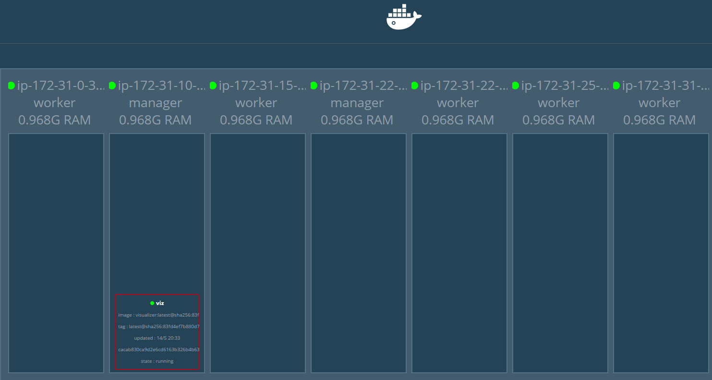

7. Ingress overay network를 사용하기 위해 network 생성

   ```shell
   $ docker network create --driver overlay vote-network
   ```

   * 이렇게 생성된 network는 모든 노드에 적용이 된다.

8. 시연용 웹페이지를 vote-network 내 서비스로 생성

   ```shell
   $ docker service create \
    --name=vote \
    --publish=3000:80 \
    --network=vote-network \
    subicura/sample_vote:1
   ```

9. 다시 visualizer를 확인해보면 vote라는 노드가 추가된 것을 확인할 수 있다.

   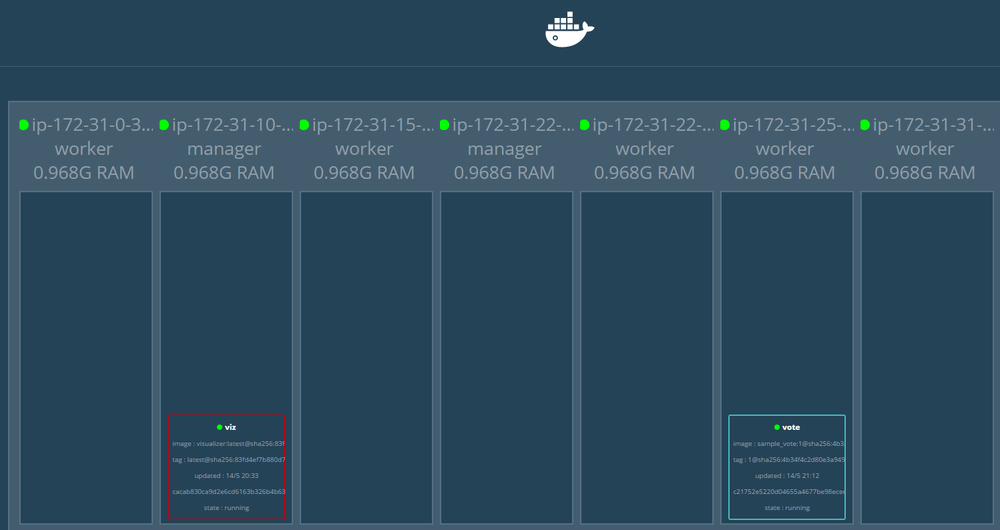

10. 생성한 서비스로 접속(아까와 같이 ELB 주소에 3000번 포트로)해보면 아래와 같은 페이지가 출력된다.

   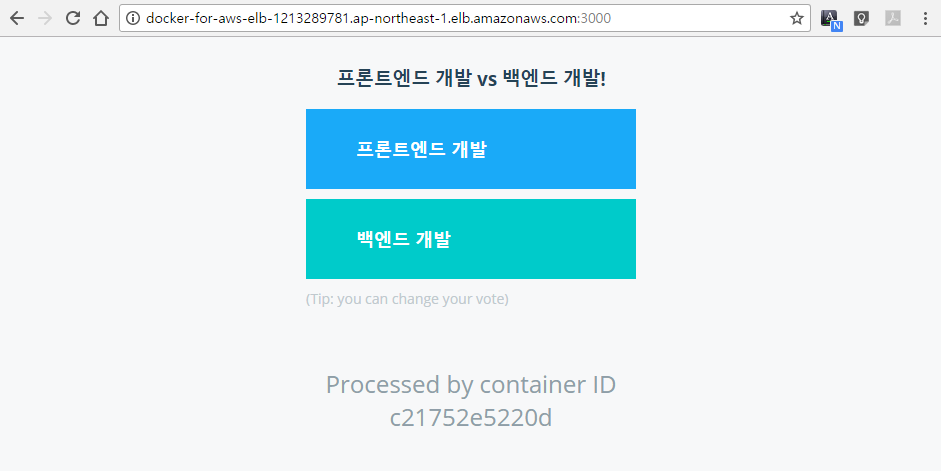

11. 현재 이 웹페이지를 출력하기 위해 한대의 서버(컨테이너)를 사용하고 있는데 scale 명령으로 간단히 3대로 늘려본다.

    ```shell
    $ docker service scale vote=3
    vote scaled to 3
    ```

    ```shell
    $ docker service ls
    ID            NAME  MODE        REPLICAS  IMAGE
    7rs5eh6hr6df  viz   replicated  1/1       dockersamples/visualizer:latest
    vbt88zkl2pjk  vote  replicated  3/3       subicura/sample_vote:1
    ```

    * docker service ls 명령으로 현재 활성화된 컨테이너들을 보면 vote라는 이름의 컨테이너의 복제본이 3개로 표시된 것을 볼 수 있다.

    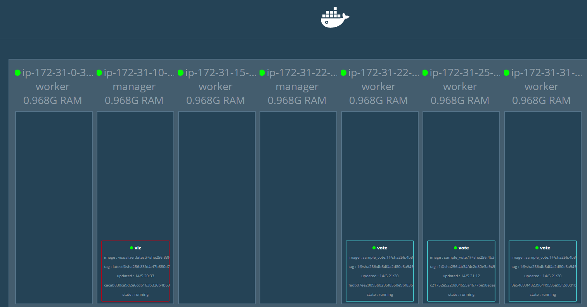

    * visualizer에도 vote 노드가 세개로 표시됨.

12. 샘플용 투표 웹페이지에 접속해서 새로고침을 여러번 해보며 하단의 container ID를 확인해보면 새로 생성된 3개의 서버로 분산되는 것을 확인할 수 있다.

13. 투표를 실제로 실행하기 위해서는 투표 결과를 저장하기 위해 redis를 사용하기 때문에 redis 서비스를 실행 시켜준다.

    ```shell
    $ docker service create \
     --network=vote-network \
     --name=redis \
     redis:alpine
    ```

    * vote 서비스와 같은 네트워크에 속해있어야 하기 때문에 --network 옵션으로 vote-network를 지정해주었다.

14. 투표 결과를 수행하기 위한 별도의 네트워크 생성

    ```shell
    $ docker network create --driver overlay result-network
    ```

15. postgresql 을 투표 결과 네트워크에 생성

    ```shell
    $ docker service create \
     --name=db \
     --network=result-network \
     --constraint=node.role==manager \
     --mount=type=volume,src=db-data,dst=/var/lib/postgresql/data \
     postgres:9.4
    ```

    * db를 manager로 선택한 이유는 manager 같은 경우 security group 설정이 내부에서만 접근 가능하도록 되어 있기 때문에 외부 노출을 막기 위해 manager 쪽에만 생성되도록 설정함.

16. worker 노드 생성

    ```shell
    $ docker service create \
     --name=worker \
     --network=vote-network \
     --network=result-network \
     subicura/sample_worker:latest
    ```

    * worker는 vote-network와 result-network 모두 사용하므로 둘 다 지정.
    * redis에서 값을 읽어서 db로 전달하는 역할

17. 관리자가 투표 결과를 볼 수 있도록 결과 노드 생성

    ```shell
    $ docker service create \
     --name=result \
     --publish=3001:80 \
     --network=result-network \
     --replicas 2 \
     subicura/sample_result:1
    ```

    * replicas 옵션을 사용하여 생성 시에 두개의 서버를 사용하도록 설정.

    * 현재까지의 노드 생성 현황은 아래와 같다.

      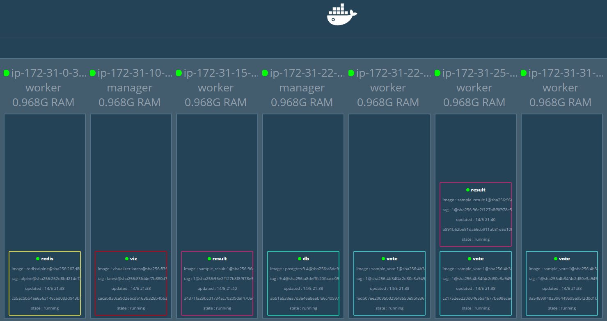

18. 결과 화면 페이지로 이동하면 투표 결과를 확인할 수 있다.

    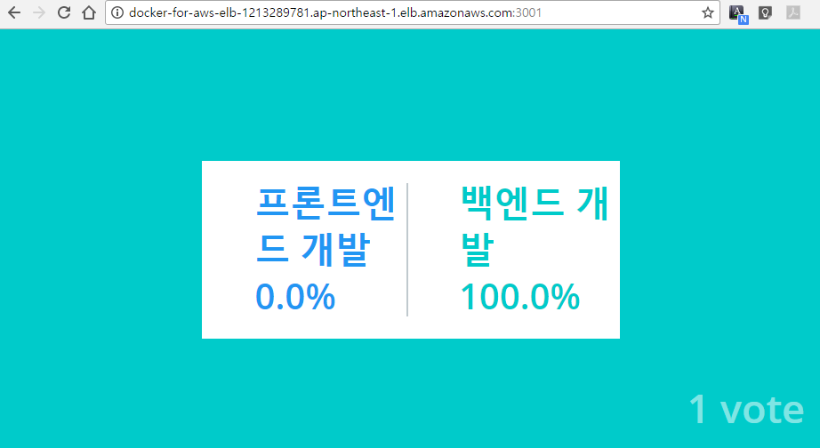

19. 서비스에 대한 업데이트가 발생하여 서비스를 업데이트 시켜야하는 경우에는 이미지를 버전 업해서 만든 후 현재의 vote 노드들을 해당 이미지로 update한다.

    ```shell
    $ docker service update \
     --image subicura/sample_vote:2 \
     vote
    ```

    * vote라는 이름의 노드에 기존의 버전 1을 사용하던 것을 버전 2로 변경.

    * 기본적으로 한대씩 롤링 업데이트를 수행하지만, 옵션을 통해 한번에 업데이트할 노드의 개수를 설정할 수 있다.

    * visualizer를 통해 노드를 확인해보면 버전2로 변경된 것을 볼 수 있다.

      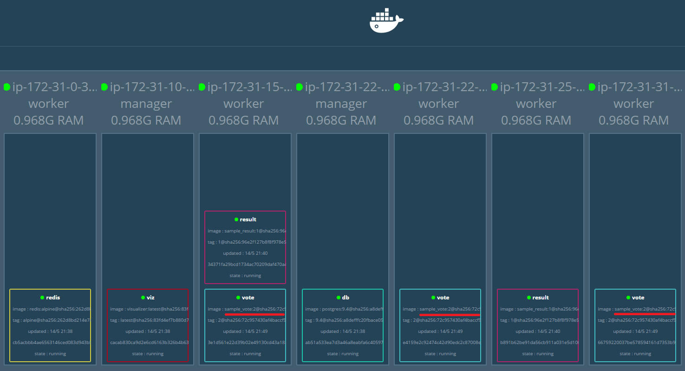

20. 변경된 웹페이지 확인

    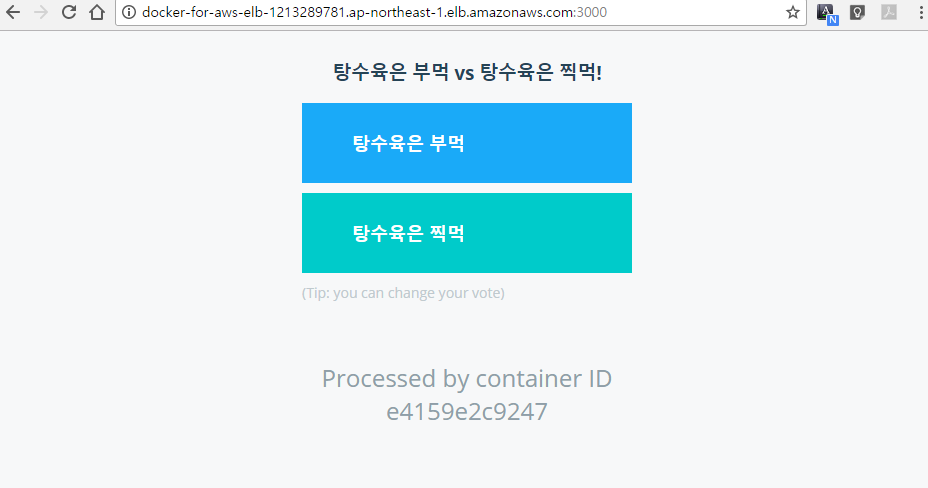

21. 결과화면에 대한 노드도 업데이트 수행

    ```shell
    $ docker service update \
     --image subicura/sample_result:2 \
     result
    ```

22. 변경된 결과 페이지 확인

    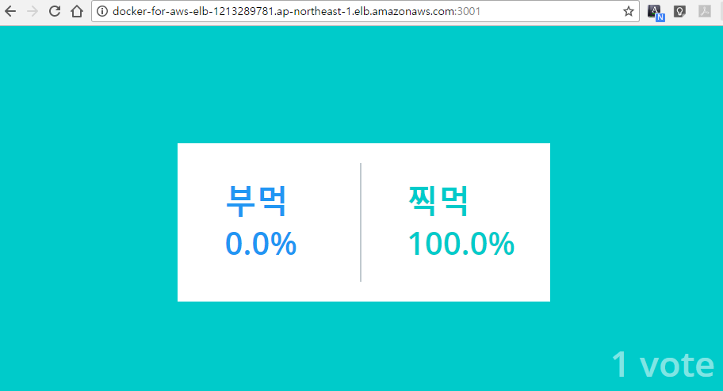

23. 모니터링을 위해 설정된 docker-compose 파일 다운로드

    * docker-stack.yml

      ```shell
      $ curl https://gist.githubusercontent.com/subicura/07a4e4f38768f9a1e6eeae37c6e1ad87/raw/8810e90be73bcd21ee2c65e6e5c220c4d08fd17c/docker-stack.yml > docker-stack.yml
      ```

      * 위 yaml 파일의 내용

        ```yaml
        version: "3"

        services:
          prometheus:
            image: prom/prometheus:latest
            networks:
              - monitoring
            ports:
              - 9001:9090
            volumes:
              - ./prometheus.yml:/etc/prometheus/prometheus.yml
            command: -config.file=/etc/prometheus/prometheus.yml -storage.local.path=/prometheu -alertmanager.url=http://alertmanager:9093
            deploy:
              placement:
                constraints:
                  - node.role == manager
          cadvisor:
            image: google/cadvisor:v0.24.1
            networks:
              - monitoring
            volumes:
              - /:/rootfs:ro
              - /var/run:/var/run
              - /sys:/sys:ro
              - /var/lib/docker/:/var/lib/docker/:ro
            deploy:
              mode: global
          node-exporter:
            image: basi/node-exporter:latest
            networks:
              - monitoring
            volumes:
              - /proc:/host/proc
              - /sys:/host/sys
              - /:/rootfs
              - /etc/hostname:/etc/host_hostname
            environment:
              HOST_HOSTNAME: /etc/host_hostname
            deploy:
              mode: global
            command: |
              -collector.procfs /host/proc -collector.sysfs /host/sys -collector.filesystem.ignored-mount-points "^/(sys|proc|dev|host|etc)($$|/)" --collector.textfile.directory /etc/node-exporter/ --collectors.enabled="conntrack,diskstats,entropy,filefd,filesystem,loadavg,mdadm,meminfo,netdev,netstat,stat,textfile,time,vmstat,ipvs"
          elasticsearch:
            image: elasticsearch
            networks:
              - monitoring
            environment:
              ES_JAVA_OPTS: -Xmx1G -Xms1G
            deploy:
              placement:
                constraints:
                  - node.role == manager
            command: -Etransport.host=0.0.0.0 -Ediscovery.zen.minimum_master_nodes=1
          grafana:
            image: basi/grafana:v4.1.1
            ports:
              - 9000:3000
            networks:
              - monitoring
            depends_on:
              - elasticsearch
              - prometheus
            environment:
              GF_SERVER_ROOT_URL: http://grafana.aws.subicura.com
              GF_SECURITY_ADMIN_PASSWORD: password
              PROMETHEUS_ENDPOINT: http://prometheus:9090
              ELASTICSEARCH_ENDPOINT: http://elasticsearch:9200

        networks:
          monitoring:
        ```

    * prometheus.yml

      ```shell
      $ curl https://gist.githubusercontent.com/subicura/ffff392ddd3f4a2ede0a4727fafaa0da/raw/1378a8414f86255e7cb4bda1f6018fe3166bae13/prometheus.yml > prometheus.yml
      ```

      * 위 yaml 파일의 내용

        ```yaml
        global:
          scrape_interval:     30s
          evaluation_interval: 30s
          external_labels:
              monitor: "prometheus-swarm"

        rule_files:

        scrape_configs:
          - job_name: 'prometheus'
            dns_sd_configs:
            - names:
              - 'tasks.prometheus'
              type: 'A'
              port: 9090

          - job_name: 'cadvisor'
            dns_sd_configs:
            - names:
              - 'tasks.cadvisor'
              type: 'A'
              port: 8080

          - job_name: 'node-exporter'
            dns_sd_configs:
            - names:
              - 'tasks.node-exporter'
              type: 'A'
              port: 9100
        ```

24. 다운받은 yaml 파일로 docker stack 수행

    ```shell
    $ docker stack deploy -c ./docker-stack.yml prometheus-stack
    ```

25. 생성된 노드 확인을 위해 visualizer 확인

    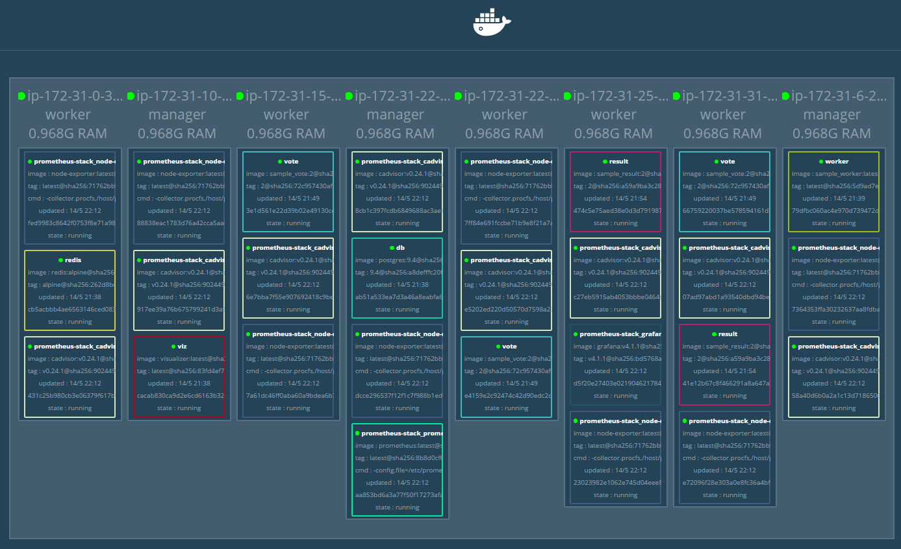

    * 모니터링을 위해서는 각 manager와 worker 노드에서 정보를 수집하기 위한 서비스들을 구동시켜야 하기 때문에 global 설정으로 각 노드에 해당 서비스들이 생성되었다.

26. prometheus로 접속

    ```
    http://docker-for-aws-elb-1213289781.ap-northeast-1.elb.amazonaws.com:9001
    ```

    * Status > Targets 페이지로 이동해보면 현재 수집하고 있는 노드들의 정보를 볼 수 있다.

      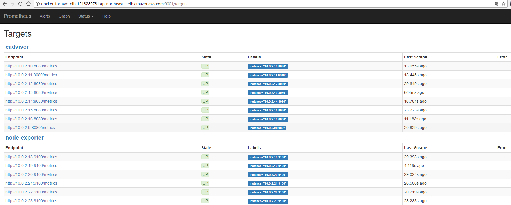

    * cAdvisor : 컨테이너의 정보 수집

    * node-exporter : 실제 호스트의 정보 수집

27. grafana로 접속

    ```
    http://docker-for-aws-elb-1213289781.ap-northeast-1.elb.amazonaws.com:9000
    ```

    * 최초 계정은 서비스 생성시 패스워드를 password로 지정했기 때문에 admin/password로 접속

    * 대쉬보드는 미리 만들어진 것을 import해서 사용

      * Home > import > 609 입력

    * 아래와 같이 모니터링할 항목들을 지정후 import

      

    * 아래와 같이 수집된 정보를 시각화해줌

      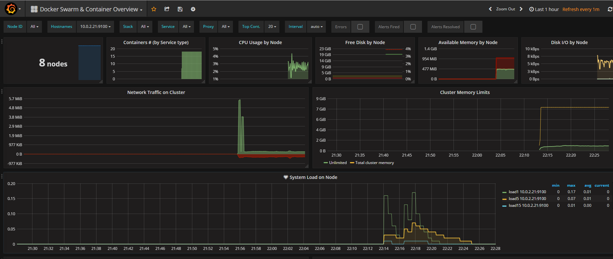

28. CloudWatch의 로그 확인

    * CloudWatch > 로그 > docker-for-aws-lg 선택

      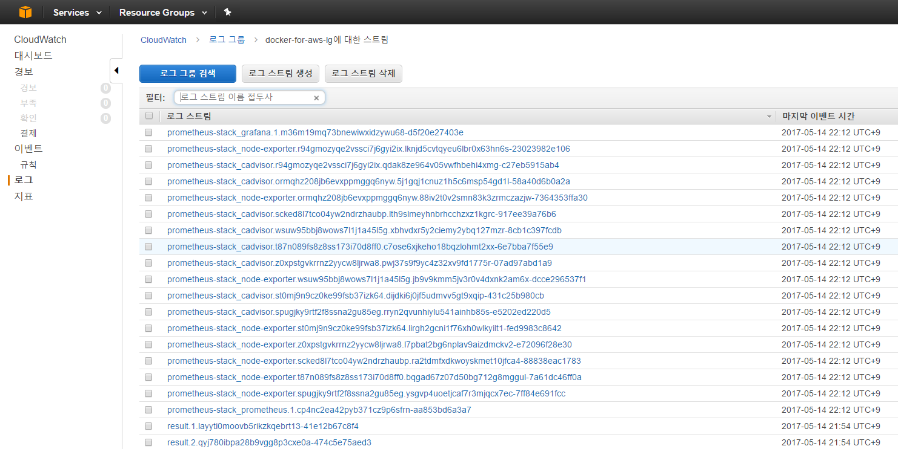

    ​

    ​


## 알아볼 것들

* Ingress 네트워크
* Overlay 네트워크
* docker stack


## 인터넷 게이트웨이

* 수평 확장되고 가용성이 높은 중복 VPC 구성요소
* VPC의 인스턴스와 인터넷 간에 통신을 할 수 있게 해줌.
* 네트워크 트래픽에 가용성 위험이나 대역폭 제약 조건이 발생하지 않음


### 목적

* 인터넷 라우팅 가능 트래픽에 대한 VPC 라우팅 테이블에 대상을 제공
* 퍼블릭 Ipv4 주소가 배정된 인스턴스에 대해 NAT(네트워크 주소 변환)를 수행


### 인터넷 액세스 활성화

* VPC에 인터넷 게이트웨이 연결
* 서브넷의 라우팅 테이블이 인터넷 게이트웨이를 가리키는지 확인
* 서브넷 인스턴스에 전역적으로 고유한 IP 주소가 있는지 확인
* 네트워크 액세스 제어 및 보안 그룹 규칙에서 적절한 트래픽이 인스턴스로, 그리고 인스턴스에서 흐르도록 허용되는지 확인

