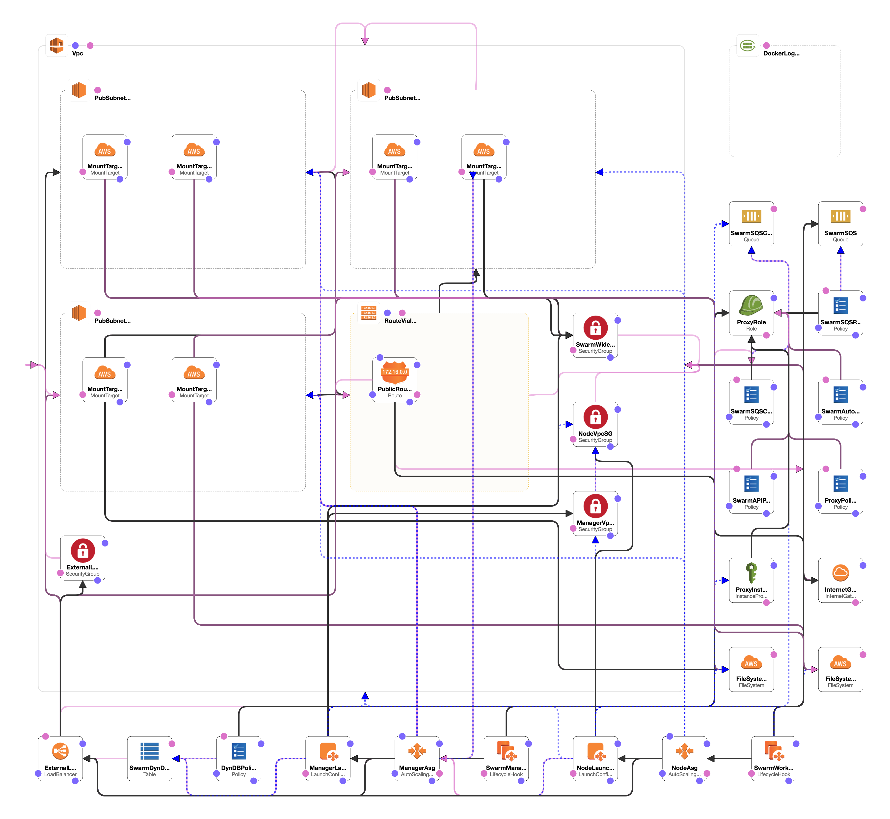

# Docker for AWS

[Docker for AWS](https://docs.docker.com/docker-for-aws/#docker-community-edition-ce-for-aws)는 Stable/Edge/Test 채널을 선택하여 구성할 수 있는데 안정화된 버전인 [Stable 채널](https://console.aws.amazon.com/cloudformation/home#/stacks/new?stackName=Docker&templateURL=https://editions-us-east-1.s3.amazonaws.com/aws/stable/Docker.tmpl)을 사용하도록 한다. `https://editions-us-east-1.s3.amazonaws.com/aws/stable/Docker.tmpl` 템플릿 파일을 기반으로 구성이 된다.




위의 그림은 CloudFormation의 디자이너 기능을 사용하여 Docker for aws의 템플릿을 도식화 한 것이다. 각 항목에 대한 설정을 하나씩 살펴볼 예정이고, 내용이 많아서 몇 차례 나눠서 포스팅을 할 예정이다.

우선 각 항목에 자주 사용되는 `DependsOn`은 해당 설정의 종속성을 나타낸다. 예를들어 리소스 A의 특성을 리소스 B가 !Ref 를 사용하여 참조하면 다음 규칙이 적용된다.

* 리소스 A는 리소스 B 보다 먼저 생성됨
* 리소스 B는 리소스 A 보다 먼저 삭제됨


AMI로 moby linux를 사용하기 때문에 ssh로 연결 시 user 명이 다른 이미지들과는 달리 `docker`임에 주의! user 명 찾느라 한참 헤맸었다.


## 필요한 권한

- CloudFormation에 의해 생성되는 리소스들
  - EC2 인스턴스 + 자동 확장 그룹
  - IAM 프로파일
  - DynamoDB 테이블
  - SQS 대기열
  - VPC + 서브넷 및 보안 그룹
  - ELB
  - CloudWatch 로그 그룹
- 배포하려는 지역의 AWS SSH 키
- EC2-VPC를 지원하는 AWS 계정


## 실행 정보

* 처음부터 필요한 모든 것을 생성하는 CloudFormation 템플릿으로 시작
* CloudFormation은 먼저 서브넷과 보안 그룹과 함께 새 VPC를 생성
* 두 개의 Auto Scaling Group 생성
  * Manager 용
  * Worker 용
* Manager 들이 먼저 시작되고, Raft에 의해 정족수(quorum)가 생성되고나면 Worker들이 시작되고 하나씩 swarm에 join 한다.
  * 이 단계에서 응용프로그램 배포 가능
* Auto Scaling Group에 의해 인스턴스 수가 증가되면 시작될 새 노드는 자동으로 swarm에 join 한다.
* ELB는 swarm으로의 트래픽 라우팅을 위해 설정된다.
* Docker for AWS에서 실행되는 컨테이너들은 Cloudwatch 로깅을 자동으로 구성한다.
  * 컨테이너의 로그를 CloudWatch에서 확인 가능
* Docker for AWS의 구성에는 swarm cluster를 위한 몇가지 시스템 컨테이너가 실행된다.
  * 원할한 수행을 위해 해당 컨테이너는 중지시키거나 변경시키지 않는 것이 좋다.


## 사용된 리소스들

### AttachGateway

* 리소스 : AWS::EC2::VPCGatewayAttachment

  ```json
  "AttachGateway": {
              "DependsOn": [
                  "Vpc",
                  "InternetGateway"
              ],
              "Properties": {
                  "InternetGatewayId": {
                      "Ref": "InternetGateway"
                  },
                  "VpcId": {
                      "Ref": "Vpc"
                  }
              },
              "Type": "AWS::EC2::VPCGatewayAttachment"
          }
  ```

  * EC2를 인터넷 게이트웨이에 Attach 시켜서 VPC에 속한 EC2가 인터넷에 접속할 수 있도록 한다.
  * Vpc와 InternetGateway에 의존적이므로 Properties에 각 항목에 대해 Ref로 설정했다.
  * 설정은 Ref를 통해 참조 형식으로 연결된다.


### Vpc

* 리소스 : AWS::EC2::VPC

  ```json
  "Vpc": {
        "Properties": {
          "CidrBlock": {
            "Fn::FindInMap": [
              "VpcCidrs",
              "vpc",
              "cidr"
            ]
          },
          "EnableDnsHostnames": "true",
          "EnableDnsSupport": "true",
          "Tags": [
            {
              "Key": "Name",
              "Value": {
                "Fn::Join": [
                  "-",
                  [
                    {
                      "Ref": "AWS::StackName"
                    },
                    "VPC"
                  ]
                ]
              }
            }
          ]
        },
        "Type": "AWS::EC2::VPC"
      }
  ```

  * Mapper에 설정된 VpcCidrs에서 Vpc에 해당하는 cidr 값을 가져와 사용

    ```json
    "vpc": {
      "cidr": "172.31.0.0/16"
    }
    ```

  * EnableDnsSupport : VPC에서 DNS 지원 여부

    * true 인 경우 Amazon DNS 서버는 인스턴스의 DNS 호스트 이름으로 ip 주소를 확인

  * EnableDnsHostnames : VPC에서 실행 된 인스턴스에서 DNS 호스트 이름을 가져올 지 여부

    * true인 경우 VPC의 인스턴스에서 DNS 호스트 이름을 가져온다.
    * true로 설정하려는 경우 EnableDnsSupport도 true로 설정되어야 함.

  * Tags : 여기서는 Name이라는 key로 CloudFormation 수행 시 지정했던 스택 이름을 뒤에 VPC를 붙여서 태그를 하나 생성한다.

    * Stack 이름이 docker-for-aws인 경우 docker-for-aws-VPC로 태그 생성


### InternetGateway

* 리소스 : AWS::EC2::InternetGateway

  ```json
  "InternetGateway": {
    "DependsOn": "Vpc",
    "Properties": {
      "Tags": [
        {
          "Key": "Name",
          "Value": {
            "Fn::Join": [
              "-",
              [
                {
                  "Ref": "AWS::StackName"
                },
                "IGW"
              ]
            ]
          }
        }
      ]
    },
    "Type": "AWS::EC2::InternetGateway"
  }
  ```
  * VPC에서 인터넷 연결을 위한 인터넷 게이트웨이 생성
  * EC2에서 해당 인터넷 게이트웨이를 사용하여 외부 인터넷에 연결
  * Tags : 이 리소스를 위한 임의의 태그 세트(key-value)
    * 스택 이름이 docker-for-aws라면 docker-for-aws-IGW로 태그 생성


### DockerLogGroup

* 리소스 : AWS::Logs::LogGroup

  ```json
  "DockerLogGroup": {
    "Condition": "CreateLogResources",
    "Properties": {
      "LogGroupName": {
        "Fn::Join": [
          "-",
          [
            {
              "Ref": "AWS::StackName"
            },
            "lg"
          ]
        ]
      },
      "RetentionInDays": 7
    },
    "Type": "AWS::Logs::LogGroup"
  }
  ```

  * CreateLogResources를 Conditions 섹션을 참조

    ```json
    "Conditions": {
      "CreateLogResources": {
        "Fn::Equals": [
          {
            "Ref": "EnableCloudWatchLogs"
          },
          "yes"
        ]
      }
      ...
    }
    ```

    * Conditions 섹션은 리소스가 작성되는 시기 또는 특성이 정의되는 시기를 정의하는 명령문이 포함됨
    * 예를들면, 값이 다른 값과 같은지를 비교할 수 있음
    * 조건의 결과에 따라 조건부로 리소스를 생성할 수 있음
    * 여기서 참조하는 CreateLogResources는 EnableCloudWatchLogs를 참조하고 있는데 이 값은 파라미터를 통해 유저의 입력에 따라 yes 또는 no 값이 설정된다. yes인 경우에만 해당 리소스를 생성

  * CloudWatch의 LogGroup을 추가한다.

  * 내장함수인 Fn::Join을 사용하여 LogGroup의 이름을 설정한다.
    * "-"를 구분자로 사용하고, 현재의 StackName이 DockerTest라고 가정한다면 `DockerTest-lg`라는 이름으로 생성된다.

  * RetentionInDay를 7로 설정했기 때문에 CloudWatch 로그에 보관되는 일 수는 7일로 설정된다.
    * 이 이벤트 기간이 만료되면 로그는 자동으로 삭제된다.


### DynDBPolicies

* 리소스 : AWS::IAM::Policy

  ```json
  "DynDBPolicies": {
    "DependsOn": [
      "ProxyRole",
      "SwarmDynDBTable"
    ],
    "Properties": {
      "PolicyDocument": {
        "Statement": [
          {
            "Action": [
              "dynamodb:PutItem",
              "dynamodb:DeleteItem",
              "dynamodb:GetItem",
              "dynamodb:UpdateItem",
              "dynamodb:Query"
            ],
            "Effect": "Allow",
            "Resource": {
              "Fn::Join": [
                "",
                [
                  "arn:aws:dynamodb:",
                  {
                    "Ref": "AWS::Region"
                  },
                  ":",
                  {
                    "Ref": "AWS::AccountId"
                  },
                  ":table/",
                  {
                    "Ref": "SwarmDynDBTable"
                  }
                ]
              ]
            }
          }
        ],
        "Version": "2012-10-17"
      },
      "PolicyName": "dyndb-getput",
      "Roles": [
        {
          "Ref": "ProxyRole"
        }
      ]
    },
    "Type": "AWS::IAM::Policy"
  }
  ```

  * DynamoDB를 사용하기 위한 정책을 IAM에 추가한다.
  * dynamoDB에 데이터를 추가/삭제/변경/질의 를 사용할 수 있도록 권한을 부여했다.
  * PolicyDocument : 지정된 사용자 또는 그룹에 추가 할 권한이 포함된 정책 문서
    * [IAM 정책 요소](http://docs.aws.amazon.com/ko_kr/IAM/latest/UserGuide/reference_policies_elements.html) 참조
  * PolicyName : 정책 이름.
    * IAM Role에 대한 정책 목록을 지정하려면 각 정책마다 고유한 이름이 필요.
  * Roles : 이 정책에 첨부할 AWS::IAM::Role의 이름.
    * Ref를 사용하여 지정하는 경우 DependsOn에 명시되어야함.


### ProxyRole

* 리소스 : AWS::IAM::Role

  ```json
  "ProxyRole": {
    "Properties": {
      "AssumeRolePolicyDocument": {
        "Statement": [
          {
            "Action": [
              "sts:AssumeRole"
            ],
            "Effect": "Allow",
            "Principal": {
              "Service": [
                "ec2.amazonaws.com",
                "autoscaling.amazonaws.com"
              ]
            }
          }
        ],
        "Version": "2012-10-17"
      },
      "Path": "/"
    },
    "Type": "AWS::IAM::Role"
  }
  ```

  * IAM Role 생성. 이를 통해 안전하게 AWS 리소스에 액세스 할 수 있게 함
  * AssumeRolePolicyDocument : 이 역할과 관련된 신뢰 정책
    * Statement의 내용은 [IAM 정책 요소](http://docs.aws.amazon.com/ko_kr/IAM/latest/UserGuide/reference_policies_elements.html) 참조
  * Path : 이 역할과 연결된 경로
    * IAM API 또는 AWS CLI를 사용하여 IAM 엔터티를 생성하는 경우, 해당 엔터티에 경로를 부여할 수 있음
    * 이를 통해 속한 조직의 부서를 식별하도록 할 수 있음
    * 예를 들면, /division_abc/subdivision_xyz/product_1234/engineering/


### SwarmDynDBTable

* 리소스 : AWS::DynamoDB::Table

  ```json
  "SwarmDynDBTable": {
    "DependsOn": "ExternalLoadBalancer",
    "Properties": {
      "AttributeDefinitions": [
        {
          "AttributeName": "node_type",
          "AttributeType": "S"
        }
      ],
      "KeySchema": [
        {
          "AttributeName": "node_type",
          "KeyType": "HASH"
        }
      ],
      "ProvisionedThroughput": {
        "ReadCapacityUnits": 1,
        "WriteCapacityUnits": 1
      },
      "TableName": {
        "Fn::Join": [
          "-",
          [
            {
              "Ref": "AWS::StackName"
            },
            "dyndbtable"
          ]
        ]
      }
    },
    "Type": "AWS::DynamoDB::Table"
  }
  ```

  * DynamoDB 테이블 생성.
    * CloudForamtion을 사용하면 일반적으로 DynamoDB 테이블을 병렬적으로 생성한다. 그러므로 인덱스가 있는 여러 테이블이 포함되어 있다면 테이블을 순차적으로 생성되도록 종속성을 선언해야 한다.
  * AttributeDefinitions : 테이블의 속성 정의 목록 (AttributeName, AttributeType)
    * 여기서는 node_type이 속성 이름, 속성 타입이 S라는 것은 문자열이라는 의미. N이면 숫자
  * KeySchema : 테이블의 기본키 설정
  * ProvisionedThroughput : 테이블의 처리량
    * ReadCapacityUnits : 최소 읽기 수
    * WriteCapacityUnits : 최소 쓰기 수


### ExternalLoadBalancer

* 리소스 : AWS::ElasticLoadBalancing::LoadBalancer

  ```json
  "ExternalLoadBalancer": {
    "DependsOn": [
      "AttachGateway",
      "ExternalLoadBalancerSG",
      "PubSubnetAz1",
      "PubSubnetAz2",
      "PubSubnetAz3"
    ],
    "Properties": {
      "ConnectionSettings": {
        "IdleTimeout": 600
      },
      "CrossZone": "true",
      "HealthCheck": {
        "HealthyThreshold": "2",
        "Interval": "10",
        "Target": "HTTP:44554/",
        "Timeout": "2",
        "UnhealthyThreshold": "4"
      },
      "Listeners": [
        {
          "InstancePort": "7",
          "LoadBalancerPort": "7",
          "Protocol": "TCP"
        }
      ],
      "LoadBalancerName": {
        "Fn::Join": [
          "-",
          [
            {
              "Ref": "AWS::StackName"
            },
            "ELB"
          ]
        ]
      },
      "SecurityGroups": [
        {
          "Ref": "ExternalLoadBalancerSG"
        }
      ],
      "Subnets": {
        "Fn::If": [
          "HasOnly2AZs",
          [
            {
              "Ref": "PubSubnetAz1"
            },
            {
              "Ref": "PubSubnetAz2"
            }
          ],
          [
            {
              "Ref": "PubSubnetAz1"
            },
            {
              "Ref": "PubSubnetAz2"
            },
            {
              "Ref": "PubSubnetAz3"
            }
          ]
        ]
      },
      "Tags": [
        {
          "Key": "Name",
          "Value": {
            "Fn::Join": [
              "-",
              [
                {
                  "Ref": "AWS::StackName"
                },
                "ELB"
              ]
            ]
          }
        }
      ]
    },
    "Type": "AWS::ElasticLoadBalancing::LoadBalancer"
  }
  ```

  * ConnectionSettings : 프런트엔드와 백엔드의 연결이 유휴 상태로 유지되는 기간 지정
  * CrossZone : zone간의 균형 조정을 사용할 수 있는지 여부.
    * true로 지정하여 CrossZone을 사용하게되면 로드 밸런서 노드가 트래픽을 모든 가용 영역(AZ)의 백엔드 인스턴스로 라우팅한다.
    * 기본 false
  * [HealthCheck](http://docs.aws.amazon.com/ko_kr/AWSCloudFormation/latest/UserGuide/aws-properties-ec2-elb-health-check.html) : 인스턴스의 응용프로그램 상태 확인
    * HealthyThreshold : 인스턴스가 정상임을 판정하기 위해 필요한 상태 검사 성공 횟수 지정
    * Interval : 개별 인스턴스의 상태 검사 사이의 간격 (초)
    * Target : 검사할 인스턴스의 프로토콜 및 포트 지정.
      * 프로토콜 : TCP, HTTP, HTTPS, SSL
      * 포트 : 1~65535
    * Timeout : 응답이 없는 경우 대기시간 (초).
      * 이 값은 Interval 값보다 작아야함.
    * UnhealthyThreshold : 인스턴스를 비정상 상태로 판정하기 전에 필요한 상태 검사 실패 횟수 지정
  * Listeners : 클라이언트의 요청을 수신 하기 위한 설정.
    * 하나의 로드밸런서에 여러개의 리스너를 가질 수 있음
    * 같은 포트에는 하나의 리스너만 등록 가능
    * 리스너의 속성 값을 업데이트하면 기존의 리스너는 삭제되고 업데이트된 속성으로 새로 만듬.
    * 업데이트 동안 클라이언트는 로드밸런서에 연결 불가능
    * InstancePort : 인스턴스 서버가 수신 대기하는 TCP 포트 지정.
      * 이 속성은 수정할 수 없음.
    * LoadBalancerPort : 외부 로드밸런서 포트 번호 지정.
      * 이 속성은 수정할 수 없음.
    * Protocol : 라우팅에 사용할 로드 밸런서 전송 프로토콜(HTTP, HTTPS, TCP, SSL) 지정.
      * 이 속성은 수정할 수 없음.
  * LoadBalancerName : 로드 밸런서 이름.
    * 지정하지 않으면 AWS CloudFormation이 고유한 값으로 지정.
  * SecurityGroups : VPC에서 로드 밸런서에 할당된 보안 그룹 목록.
    * 여기서는 Ref를 사용하여 ExternalLoadBalancerSG를 참조
  * Subnets : 로드밸런서에 연결할 가상 사설망(VPC)의 서브넷 ID 목록.
    * 같은 AZ에 있는 다수의 서브넷을 지정하지 않는 것이 좋음.
    * 여기서는 Fn::If를 사용하여 `HasOnly2AZs` 조건이 존재하는 경우 PubSubAZ1~2 두개만 사용하고, 그렇지 않으면 1~3 세개를 사용한다. `HasOnly2AZs`가 존재하므로 여기서는 두개의 AZ를 사용.
  * Tags : 임의의 태그 집합 (key-value)


### ExternalLoadBalancerSG

* 리소스 : AWS::EC2::SecurityGroup

  ```json
  "ExternalLoadBalancerSG": {
    "DependsOn": "Vpc",
    "Properties": {
      "GroupDescription": "External Load Balancer SecurityGroup",
      "SecurityGroupIngress": [
        {
          "CidrIp": "0.0.0.0/0",
          "FromPort": "0",
          "IpProtocol": "-1",
          "ToPort": "65535"
        }
      ],
      "VpcId": {
        "Ref": "Vpc"
      }
    },
    "Type": "AWS::EC2::SecurityGroup"
  }
  ```

  * 외부 로드밸런서에 대한 SecurityGroup 설정
  * 여기서는 GroupName을 따로 명시하지 않았기 때문에 AWS CloudFormation이 고유한 ID로 생성.
  * GroupDescription : 보안 그룹에 대한 설명
  * SecurityGroupIngress : Amazon EC2 보안 그룹의 egress(출구) 규칙
    * CidrIp : Ipv4 CIDR 범위 지정
    * FromPort : TCP, UDP 프로토콜의 포트 범위 시작 값.
    * IpProtocol : IP 프로토콜 이름 또는 번호.
      * -1은 모든 프로토콜을 의미.
    * ToPort : Tcp, UDP 프로토콜의 포트 범위 끝.


### PubSubnetAz1

* 리소스 : AWS::EC2::Subnet

  ```json
  "PubSubnetAz1": {
    "DependsOn": "Vpc",
    "Properties": {
      "AvailabilityZone": {
        "Fn::Select": [
          {
            "Fn::FindInMap": [
              "AWSRegion2AZ",
              {
                "Ref": "AWS::Region"
              },
              "AZ0"
            ]
          },
          {
            "Fn::GetAZs": {
              "Ref": "AWS::Region"
            }
          }
        ]
      },
      "CidrBlock": {
        "Fn::FindInMap": [
          "VpcCidrs",
          "pubsubnet1",
          "cidr"
        ]
      },
      "Tags": [
        {
          "Key": "Name",
          "Value": {
            "Fn::Join": [
              "-",
              [
                {
                  "Ref": "AWS::StackName"
                },
                "Subnet1"
              ]
            ]
          }
        }
      ],
      "VpcId": {
        "Ref": "Vpc"
      }
    },
    "Type": "AWS::EC2::Subnet"
  }
  ```

  * AvailabilityZone : 서브넷을 사용할 가용 영역

    * Fn::Select는 두번째 인자인 리스트에서 첫번째 인자로 주어진 인덱스에 해당하는 항목을 참조하여 반환

      * 여기서는 AWSRegion2AZ라는 맵에서 Fn::FindInMap을 사용하여 "AZ0"의 키에 해당하는 값을 반환한다. 그 값은 "0"

        ```json
        "Mappings": {
          ...
          "AWSRegion2AZ": {
            "ap-northeast-1": {
              "AZ0": "0",
              "AZ1": "1",
              "AZ2": "0",
              "EFSSupport": "no",
              "Name": "Tokyo",
              "NumAZs": "2"
            },
          ...
        }
        ```

    * Fn::GetAZs는 지정된 영역의 가용 영역을 나열하는 배열을 반환

      * 여기서는 AWS::Region을 참조하고 있으므로 현재 선택된 리전의 모든 가용영역이 반환된다.
      * 반환된 가용 영역 중 위에서 Fn::Select에 의해 선택된 인덱스가 0이므로 첫번째 가용영역이 AvailabilityZone이 된다.

  * CidrBlock : 서브넷 범위에 해당하는 CIDR 블록

    * Fn::FindInMap을 사용하여 VpcCidrs 맵의 서브키 pubsubnet1의 서브키 cidr의 값 참조

      ```json
      "VpcCidrs": {
        ...
        "vpc": {
          "cidr": "172.31.0.0/16"
        }
      }
      ```


### PubSubnetAz2~3

* 위의 PubSubnetAz1과 동일한 방식으로 동작
* AvailabilityZone 설정에서 AZ 선택 시 참조하는 항목만 AZ1~2로 증가


### FileSystemGP

* 리소스 : AWS::EFS::FileSystem

  ```json
  "FileSystemGP": {
    "Condition": "EFSSupported",
    "Properties": {
      "FileSystemTags": [
        {
          "Key": "Name",
          "Value": {
            "Fn::Join": [
              "-",
              [
                {
                  "Ref": "AWS::StackName"
                },
                "EFS-GP"
              ]
            ]
          }
        }
      ],
      "PerformanceMode": "generalPurpose"
    },
    "Type": "AWS::EFS::FileSystem"
  }
  ```

  * Condition에 의해 EFSSupported가 true인 경우에만 서비스 생성

    ```json
    "EFSSupported": {
      "Fn::Equals": [
        {
          "Fn::FindInMap": [
            "AWSRegion2AZ",
            {
              "Ref": "AWS::Region"
            },
            "EFSSupport"
          ]
        },
        "yes"
      ]
    }
    ```

    * Fn::FindInMap을 사용하여 AWSRegion2AZ의 서브키로 AWS::Region을 참조한 값을 사용하고 이를 통해 반환한 값에서 EFSSupport에 해당하는 값을 반환

      ```json
      "AWSRegion2AZ": {
        "ap-northeast-1": {
          "AZ0": "0",
          "AZ1": "1",
          "AZ2": "0",
          "EFSSupport": "no",
          "Name": "Tokyo",
          "NumAZs": "2"
        }
        ...
      }
      ```

      * 여기선 값이 no이므로 생성되지 않음

  * Amazon Elastic File System에 새 파일 시스템 생성.

  * EC2에서 EFS 파일시스템을 마운트 하려면 AWS::EFS::MountTarget을 만들어야함.

  * FileSystemTags : 파일 시스템과 연결할 태그.

  * PerformanceMode : 파일 시스템의 성능 모드.
    * generalPurpose와 maxIO 중에 선택 가능.
    * generalPurpose를 사용할 것을 권장.


### FileSystemMaxIO

* 리소스 : AWS::EFS::FileSystem

  ```json
  "FileSystemMaxIO": {
    "Condition": "EFSSupported",
    "Properties": {
      "FileSystemTags": [
        {
          "Key": "Name",
          "Value": {
            "Fn::Join": [
              "-",
              [
                {
                  "Ref": "AWS::StackName"
                },
                "EFS-MaxIO"
              ]
            ]
          }
        }
      ],
      "PerformanceMode": "maxIO"
    },
    "Type": "AWS::EFS::FileSystem"
  }
  ```

  * 위와 설명 동일.
  * 여기서는 성능 모드를 maxIO로 지정했음.
  * 마찬가지로 Condition에 해당하는 EFSSupported 값이 no이므로 서비스가 생성되지 않음


### ManagerAsg

* 리소스 : AWS::AutoScaling::AutoScalingGroup

  ```json
  "ManagerAsg": {
    "CreationPolicy": {
      "ResourceSignal": {
        "Count": {
          "Ref": "ManagerSize"
        },
        "Timeout": "PT20M"
      }
    },
    "DependsOn": [
      "SwarmDynDBTable",
      "PubSubnetAz1",
      "PubSubnetAz2",
      "PubSubnetAz3",
      "ExternalLoadBalancer",
      "ExternalLoadBalancer"
    ],
    "Properties": {
      "DesiredCapacity": {
        "Ref": "ManagerSize"
      },
      "HealthCheckGracePeriod": 300,
      "HealthCheckType": "ELB",
      "LaunchConfigurationName": {
        "Ref": "ManagerLaunchConfigAws2"
      },
      "LoadBalancerNames": [
        {
          "Ref": "ExternalLoadBalancer"
        }
      ],
      "MaxSize": 5,
      "MinSize": 0,
      "Tags": [
        {
          "Key": "Name",
          "PropagateAtLaunch": true,
          "Value": {
            "Fn::Join": [
              "-",
              [
                {
                  "Ref": "AWS::StackName"
                },
                "Manager"
              ]
            ]
          }
        },
        {
          "Key": "swarm-node-type",
          "PropagateAtLaunch": true,
          "Value": "manager"
        },
        {
          "Key": "swarm-stack-id",
          "PropagateAtLaunch": true,
          "Value": {
            "Ref": "AWS::StackId"
          }
        },
        {
          "Key": "DOCKER_FOR_AWS_VERSION",
          "PropagateAtLaunch": true,
          "Value": {
            "Fn::FindInMap": [
              "DockerForAWS",
              "version",
              "forAws"
            ]
          }
        },
        {
          "Key": "DOCKER_VERSION",
          "PropagateAtLaunch": true,
          "Value": {
            "Fn::FindInMap": [
              "DockerForAWS",
              "version",
              "docker"
            ]
          }
        }
      ],
      "VPCZoneIdentifier": [
        {
          "Fn::If": [
            "HasOnly2AZs",
            {
              "Fn::Join": [
                ",",
                [
                  {
                    "Ref": "PubSubnetAz1"
                  },
                  {
                    "Ref": "PubSubnetAz2"
                  }
                ]
              ]
            },
            {
              "Fn::Join": [
                ",",
                [
                  {
                    "Ref": "PubSubnetAz1"
                  },
                  {
                    "Ref": "PubSubnetAz2"
                  },
                  {
                    "Ref": "PubSubnetAz3"
                  }
                ]
              ]
            }
          ]
        }
      ]
    }
  ```

  * 오토 스케일링을 위한 설정

  * 오토 스케일링 그룹의 실행 구성 또는 서브넷 그룹 구성원이 변경되면 롤링 업데이트를 수행하기 위해 AutoPaling 그룹에 UpdatePolicy 특성을 추가할 수 있음.

  * CloudFormation의 CreationPolicy는 해당 리소스를 생성 시 적용하는 정책이다.

    * 지정된 개수를 초과하거나 제한 시간을 초과하는 경우 생성을 방지하기 위한 설정

    * 여기서 사용한 ResourceSignal은 리소스 생성 시 성공 신호의 수와 CloudFormation이 해당 리소스를 생성하기까지 기다리는 시간을 설정

      ```json
      "ManagerSize": {
        "AllowedValues": [
          "1",
          "3",
          "5"
        ],
        "Default": "3",
        "Description": "Number of Swarm manager nodes (1, 3, 5)",
        "Type": "Number"
      }
      ```

      * 명시된 ManagerSize는 파라미터를 통해 입력 받고, 입력이 없을 경우 3이 기본값이다.

    * Count : 리소스가 실패 신호를 받거나 제한시간이 만료되기 전에 지정된 수의 신호를 수신하지 않으면 리소스 생성이 실패하고 CloudFormation 스택을 롤백

    * Timeout : CloudFormation이 Count 속성에 지정한 신호 수를 기다리는 시간. 지정할 수 있는 최대시간은 12시간
      * 여기에 명시된 PT20M은 [ISO8601](https://en.wikipedia.org/wiki/ISO_8601#Durations) 형식으로 20분을 의미함.
      * P는 기간 표현의 시작 부분에 위치한 기간 지정자
      * T는 시간 구성요소 앞에 오는 시간 지정자
      * M은 분 단위의 값을 나타내는 분 지정자
    * 결국 지정된 매니저의 수만큼 리소스를 생성하는데 지정된 수가 20분동안 생성되지 않을 경우 실패로 간주하고 CloudFormation을 롤백한다.


* DesiredCapacity : 오토 스케일링 그룹에 대해 원하는 용량을 지정

    * 여기서는 파라미터로 지정된 매니저의 수만큼이 원하는 용량이 됨
    * 오토 스케일링 그룹 SpotPrice에 대한 설정이 있어야 오토 스케일링이 수행된다.
      * SpotPrice는 스팟 인스턴스를 사용하기 위한 가격 정책을 의미하는데 스팟 인스턴스는 EC2 인스턴스가 즉시 시작되는 것이 아니라 가용성에 따라 생성되고 종료되는 인스턴스를 의미한다. 
      * AWS는 온디맨드 인스턴스의 코어 그룹을 시작해서 보장된 컴퓨팅 리소스를 최소로 유지하고 필요 시에 스팟 인스턴스로 보완을 하는 형태를 권장한다.

* HealthCheckGracePeriod : 새로운 EC2 인스턴스가 작동 된 후 오토 스케일링이 Health Check를 시작하는 시간(초)

  * HealthCheckType : Health Check를 하길 원하는 서비스 지정.
    * EC2 또는 ELB 지정

  * LaunchConfigurationName : AWS::AutoScaling::LaunchConfiguration의 이름 지정
    * 이를 지정하지 않을 경우 InstanceId를 설정해주어야 함.
    * 여기서는 Ref를 사용하여 ManagerLaunchConfigAws1 지정

  * LoadBalancerNames : 이 오토 스케일링 그룹과 관련된 로드 밸런서 목록.

  * MaxSize : 오토 스케일링 그룹의 최대 크기

  * MinSize : 오토 스케일링 그룹의 최소 크기

  * VPCZoneIdentifier : Amazone VPC의 서브넷 식별자 목록

    * AvailabilityZones 속성을 사용하지 않는 경우에는 이 설정을 해주어야함.
    * 오토 스케일링 시 여기에 명시된 서브넷 리스트 중에 EC2 인스턴스를 생성


### ManagerLaunchConfigAws2

* 리소스 : AWS::AutoScaling::LaunchConfiguration

  ```json
  "ManagerLaunchConfigAws2": {
    "DependsOn": "ExternalLoadBalancer",
    "Properties": {
      "AssociatePublicIpAddress": "true",
      "BlockDeviceMappings": [
        {
          "DeviceName": "/dev/xvdb",
          "Ebs": {
            "VolumeSize": {
              "Ref": "ManagerDiskSize"
            },
            "VolumeType": {
              "Ref": "ManagerDiskType"
            }
          }
        }
      ],
      "IamInstanceProfile": {
        "Ref": "ProxyInstanceProfile"
      },
      "ImageId": {
        "Fn::FindInMap": [
          "AWSRegionArch2AMI",
          {
            "Ref": "AWS::Region"
          },
          {
            "Fn::FindInMap": [
              "AWSInstanceType2Arch",
              {
                "Ref": "ManagerInstanceType"
              },
              "Arch"
            ]
          }
        ]
      },
      "InstanceType": {
        "Ref": "ManagerInstanceType"
      },
      "KeyName": {
        "Ref": "KeyName"
      },
      "SecurityGroups": [
        {
          "Ref": "ManagerVpcSG"
        },
        {
          "Ref": "SwarmWideSG"
        }
      ],
      "UserData": {
        "Fn::Base64": {
          "Fn::Join": [
            "",
            [
              "#!/bin/sh\n",
              "export EXTERNAL_LB='",
              {
                "Ref": "ExternalLoadBalancer"
              },
              "'\n",
              "export DOCKER_FOR_IAAS_VERSION='",
              {
                "Fn::FindInMap": [
                  "DockerForAWS",
                  "version",
                  "forAws"
                ]
              },
              "'\n",
              "export LOCAL_IP=$(wget -qO- http://169.254.169.254/latest/meta-data/local-ipv4)\n",
              "export INSTANCE_TYPE=$(wget -qO- http://169.254.169.254/latest/meta-data/instance-type)\n",
              "export NODE_AZ=$(wget -qO- http://169.254.169.254/latest/meta-data/placement/availability-zone/)\n",
              "export NODE_REGION=$(echo $NODE_AZ | sed 's/.$//')\n",
              "export ENABLE_CLOUDWATCH_LOGS='",
              {
                "Ref": "EnableCloudWatchLogs"
              },
              "'\n",
              "export AWS_REGION='",
              {
                "Ref": "AWS::Region"
              },
              "'\n",
              "export MANAGER_SECURITY_GROUP_ID='",
              {
                "Ref": "ManagerVpcSG"
              },
              "'\n",
              "export WORKER_SECURITY_GROUP_ID='",
              {
                "Ref": "NodeVpcSG"
              },
              "'\n",
              "export DYNAMODB_TABLE='",
              {
                "Ref": "SwarmDynDBTable"
              },
              "'\n",
              "export STACK_NAME='",
              {
                "Ref": "AWS::StackName"
              },
              "'\n",
              "export STACK_ID='",
              {
                "Ref": "AWS::StackId"
              },
              "'\n",
              "export ACCOUNT_ID='",
              {
                "Ref": "AWS::AccountId"
              },
              "'\n",
              "export VPC_ID='",
              {
                "Ref": "Vpc"
              },
              "'\n",
              "export SWARM_QUEUE='",
              {
                "Ref": "SwarmSQS"
              },
              "'\n",
              "export CLEANUP_QUEUE='",
              {
                "Ref": "SwarmSQSCleanup"
              },
              "'\n",
              "export RUN_VACUUM='",
              {
                "Ref": "EnableSystemPrune"
              },
              "'\n",
              "export LOG_GROUP_NAME='",
              {
                "Fn::Join": [
                  "-",
                  [
                    {
                      "Ref": "AWS::StackName"
                    },
                    "lg"
                  ]
                ]
              },
              "'\n",
              "export ENABLE_EFS='",
              {
                "Fn::FindInMap": [
                  "AWSRegion2AZ",
                  {
                    "Ref": "AWS::Region"
                  },
                  "EFSSupport"
                ]
              },
              "'\n",
              "export EFS_ID_REGULAR='",
              {
                "Fn::If": [
                  "EFSSupported",
                  {
                    "Ref": "FileSystemGP"
                  },
                  ""
                ]
              },
              "'\n",
              "export EFS_ID_MAXIO='",
              {
                "Fn::If": [
                  "EFSSupported",
                  {
                    "Ref": "FileSystemMaxIO"
                  },
                  ""
                ]
              },
              "'\n",
              "export DOCKER_EXPERIMENTAL='true' \n",
              "export NODE_TYPE='manager'\n",
              "export INSTANCE_NAME='ManagerAsg'\n",
              "echo \"$EXTERNAL_LB\" > /var/lib/docker/swarm/lb_name\n",
              "echo \"# hostname : ELB_name\" >> /var/lib/docker/swarm/elb.config\n",
              "echo \"127.0.0.1: $EXTERNAL_LB\" >> /var/lib/docker/swarm/elb.config\n",
              "echo \"localhost: $EXTERNAL_LB\" >> /var/lib/docker/swarm/elb.config\n",
              "echo \"default: $EXTERNAL_LB\" >> /var/lib/docker/swarm/elb.config\n",
              "\n",
              "echo '{\"experimental\": '$DOCKER_EXPERIMENTAL', \"labels\":[\"os=linux\", \"region='$NODE_REGION'\", \"availability_zone='$NODE_AZ'\", \"instance_type='$INSTANCE_TYPE'\", \"node_type='$NODE_TYPE'\"] ' > /etc/docker/daemon.json\n",
              "if [ $ENABLE_CLOUDWATCH_LOGS == 'yes' ] ; then\n",
              "   echo ', \"log-driver\": \"awslogs\", \"log-opts\": {\"awslogs-group\": \"'$LOG_GROUP_NAME'\", \"tag\": \"{{.Name}}-{{.ID}}\" }}' >> /etc/docker/daemon.json\n",
              "else\n",
              "   echo ' }' >> /etc/docker/daemon.json\n",
              "fi\n",
              "\n",
              "chown -R docker /home/docker/\n",
              "chgrp -R docker /home/docker/\n",
              "rc-service docker restart\n",
              "sleep 5\n",
              "\n",
              "docker run --label com.docker.editions.system --log-driver=json-file --restart=no -d -e DYNAMODB_TABLE=$DYNAMODB_TABLE -e NODE_TYPE=$NODE_TYPE -e REGION=$AWS_REGION -e STACK_NAME=$STACK_NAME -e STACK_ID=\"$STACK_ID\" -e ACCOUNT_ID=$ACCOUNT_ID -e INSTANCE_NAME=$INSTANCE_NAME -e DOCKER_FOR_IAAS_VERSION=$DOCKER_FOR_IAAS_VERSION -v /var/run/docker.sock:/var/run/docker.sock -v /usr/bin/docker:/usr/bin/docker -v /var/log:/var/log docker4x/init-aws:$DOCKER_FOR_IAAS_VERSION\n",
              "\n",
              "docker run --label com.docker.editions.system --log-driver=json-file --name=guide-aws --restart=always -d -e DYNAMODB_TABLE=$DYNAMODB_TABLE -e NODE_TYPE=$NODE_TYPE -e REGION=$AWS_REGION -e STACK_NAME=$STACK_NAME -e INSTANCE_NAME=$INSTANCE_NAME -e VPC_ID=$VPC_ID -e STACK_ID=\"$STACK_ID\" -e ACCOUNT_ID=$ACCOUNT_ID -e SWARM_QUEUE=\"$SWARM_QUEUE\" -e CLEANUP_QUEUE=\"$CLEANUP_QUEUE\" -e RUN_VACUUM=$RUN_VACUUM -e DOCKER_FOR_IAAS_VERSION=$DOCKER_FOR_IAAS_VERSION -v /var/run/docker.sock:/var/run/docker.sock -v /usr/bin/docker:/usr/bin/docker docker4x/guide-aws:$DOCKER_FOR_IAAS_VERSION\n",
              "\n",
              "docker volume create --name sshkey\n",
              "\n",
              "docker run --label com.docker.editions.system --log-driver=json-file -ti --rm --user root -v sshkey:/etc/ssh --entrypoint ssh-keygen docker4x/shell-aws:$DOCKER_FOR_IAAS_VERSION -A\n",
              "\n",
              "docker run --label com.docker.editions.system --log-driver=json-file --name=shell-aws --restart=always -d -p 22:22 -v /home/docker/:/home/docker/ -v /var/run/docker.sock:/var/run/docker.sock -v /var/lib/docker/swarm/lb_name:/var/lib/docker/swarm/lb_name:ro -v /var/lib/docker/swarm/elb.config:/var/lib/docker/swarm/elb.config -v /usr/bin/docker:/usr/bin/docker -v /var/log:/var/log -v sshkey:/etc/ssh -v /etc/passwd:/etc/passwd:ro -v /etc/shadow:/etc/shadow:ro -v /etc/group:/etc/group:ro docker4x/shell-aws:$DOCKER_FOR_IAAS_VERSION\n",
              "\n",
              "if [ $ENABLE_EFS == 'yes' ] ; then\n",
              "    docker plugin install --alias cloudstor:aws --grant-all-permissions docker4x/cloudstor:$DOCKER_FOR_IAAS_VERSION CLOUD_PLATFORM=AWS EFS_ID_REGULAR=$EFS_ID_REGULAR EFS_ID_MAXIO=$EFS_ID_MAXIO DEBUG=1\n",
              "fi\n",
              "docker run --label com.docker.editions.system --log-driver=json-file --name=meta-aws --restart=always -d -p $LOCAL_IP:9024:8080 -e AWS_REGION=$AWS_REGION -e MANAGER_SECURITY_GROUP_ID=$MANAGER_SECURITY_GROUP_ID -e WORKER_SECURITY_GROUP_ID=$WORKER_SECURITY_GROUP_ID -v /var/run/docker.sock:/var/run/docker.sock docker4x/meta-aws:$DOCKER_FOR_IAAS_VERSION metaserver -iaas_provider=aws\n",
              "docker run --label com.docker.editions.system --log-driver=json-file --name=l4controller-aws --restart=always -d -v /var/run/docker.sock:/var/run/docker.sock -v /var/lib/docker/swarm:/var/lib/docker/swarm docker4x/l4controller-aws:$DOCKER_FOR_IAAS_VERSION run --log=4 --all=true\n"
            ]
          ]
        }
      }
    },
    "Type": "AWS::AutoScaling::LaunchConfiguration"
  }
  ```
  * EC2 인스턴스를 오토스케일링 그룹에서 구동시키기 위해 필요한 설정들을 지정한다.
    * EBS 볼륨
    * 파라미터로 받은 값에 의한 AMI, 보안그룹, 키 쌍 등의 값을 설정
  * 여기서 중요한 부분은 EC2 인스턴스를 구동시킬 때 실행되는 스크립트인 UserData 속성
    * ​

