## Docker for AWS Demo

아래 데모의 과정은 AWS Summit 2017에서 발표한 [AWS와 Docker Swarm을 이용한 쉽고 빠른 컨테이너 오케스트레이션 - 김충섭 개발자(퍼플웍스)](https://www.youtube.com/watch?v=16LNWMqphOA&list=PLORxAVAC5fUVm13IThQZUz0ee6Pso43sl&index=4) 에서의 데모 시연 과정을 정리한 것입니다.


시작에 앞서 [Docker for AWS](https://docs.docker.com/docker-for-aws/)를 통해 미리 정의된 AWS의 CloudFormation 템플릿을 사용하여 AWS 리소스들을 생성하고 아래 절차를 수행한다. (이 과정은 기본적으로 Next만 수행하면 되므로 생략) 

리소스들이 생성되는 시간은 대략 10분정도 소요


### Demo 수행 절차

1. CloudFormation에서 Output을 선택하여 manager 목록으로 이동

   * 그냥 EC2 인스턴스 메뉴로 들어가도 됨
   * 인스턴스 이름이 Manager와 Worker로 나뉘어서 생성이 되어 있음
   * docker swarm 명령은 manager를 통해서만 수행되고 수행된 명령에 따라 worker 또는 manager에 노드가 생성됨

2. manager 목록 중 하나를 선택해서 ssh  접속.

   - 여기서 ssh 접속 user 명은 docker

3. docker service create 명령으로 visualizer 실행

   ```shell
   $ docker service create \
    --name=viz \
    --publish=5000:8080/tcp \
    --constraint=node.role==manager \
    --mount=type=bind,src=/var/run/docker.sock,dst=/var/run/docker.sock \
    dockersamples/visualizer
   ```

   - constraint : 컨테이너 구동에 제약을 줌.
     - 여기서는 역할이 manager인 노드들에만 적용
   - mount : 컨테이너가 다른 컨테이너 나 호스트 운영 체제의 파일 또는 디렉토리에서 읽고 쓸 수 있도록 마운트를 지원.
     - type으로 volume 또는 bind, tmpfs를 지정할 수 있다.
     - 여기서는 bind를 통해 디렉토리 또는 파일을 호스트에서 컨테이너로 바인드 마운트 한다.
   - Ingress Network
     - 여기서 5000번 포트를 publish 하고 있는데 이렇게 되면 모든 노드에 대해 5000번 포트가 열리게 된다. 그래서 해당 서비스가 어떤 노드에서 생성이 되든 ELB를 통해 들어온 5000번 요청은 manager에 의해 해당 서비스가 구동 중인 노드로 연결이 된다.
     - 서비스에 대한 로드밸런싱이 자동으로 수행 됨.

4. docker service ls 명령으로 생성된 서비스를 확인

   ```shell
   $ docker service ls
   ID            NAME  MODE        REPLICAS  IMAGE
   7rs5eh6hr6df  viz   replicated  1/1       dockersamples/visualizer:latest
   ```

5. 해당 서비스로 접속 테스트

   - ELB를 통해 접속해야 하므로 `<ELB주소>:5000`으로 접속한다.

     ```
     http://docker-for-aws-elb-1213289781.ap-northeast-1.elb.amazonaws.com:5000
     ```

6. 아래와 같이 노드에 대한 모니터링 화면이 출력되면 정상 동작

   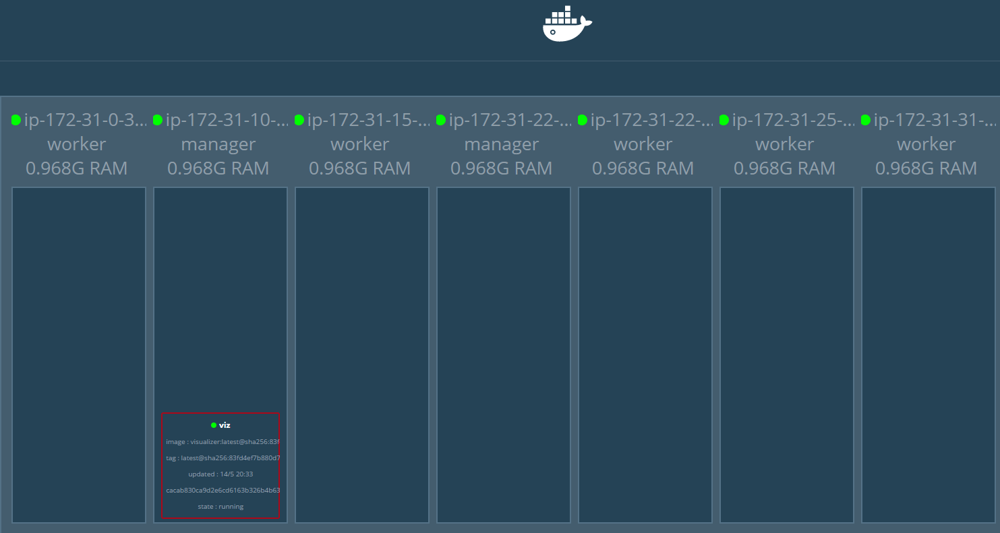

7. Ingress overay network를 사용하기 위해 network 생성

   ```shell
   $ docker network create --driver overlay vote-network
   ```

   - 이렇게 생성된 network는 모든 노드에 적용이 된다.

8. 시연용 웹페이지를 vote-network 내 서비스로 생성

   ```shell
   $ docker service create \
    --name=vote \
    --publish=3000:80 \
    --network=vote-network \
    subicura/sample_vote:1
   ```

9. 다시 visualizer를 확인해보면 vote라는 노드가 추가된 것을 확인할 수 있다.

   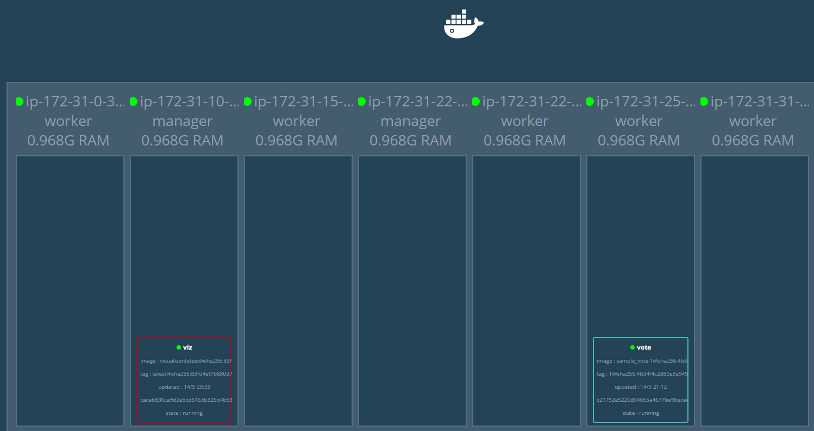

10. 생성한 서비스로 접속(아까와 같이 ELB 주소에 3000번 포트로)해보면 아래와 같은 페이지가 출력된다.

    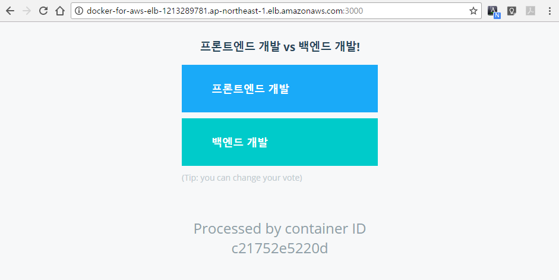

11. 현재 이 웹페이지를 출력하기 위해 한대의 서버(컨테이너)를 사용하고 있는데 scale 명령으로 간단히 3대로 늘려본다.

    ```shell
    $ docker service scale vote=3
    vote scaled to 3
    ```

    ```shell
    $ docker service ls
    ID            NAME  MODE        REPLICAS  IMAGE
    7rs5eh6hr6df  viz   replicated  1/1       dockersamples/visualizer:latest
    vbt88zkl2pjk  vote  replicated  3/3       subicura/sample_vote:1
    ```

    - docker service ls 명령으로 현재 활성화된 컨테이너들을 보면 vote라는 이름의 컨테이너의 복제본이 3개로 표시된 것을 볼 수 있다.

    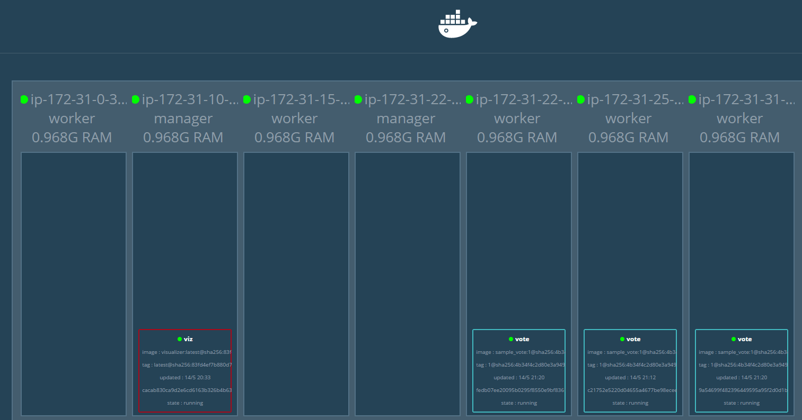

    - visualizer에도 vote 노드가 세개로 표시됨.

12. 샘플용 투표 웹페이지에 접속해서 새로고침을 여러번 해보며 하단의 container ID를 확인해보면 새로 생성된 3개의 서버로 분산되는 것을 확인할 수 있다.

13. 투표를 실제로 실행하기 위해서는 투표 결과를 저장하기 위해 redis를 사용하기 때문에 redis 서비스를 실행 시켜준다.

    ```shell
    $ docker service create \
     --network=vote-network \
     --name=redis \
     redis:alpine
    ```

    - vote 서비스와 같은 네트워크에 속해있어야 하기 때문에 --network 옵션으로 vote-network를 지정해주었다.

14. 투표 결과를 수행하기 위한 별도의 네트워크 생성

    ```shell
    $ docker network create --driver overlay result-network
    ```

15. postgresql 을 투표 결과 네트워크에 생성

    ```shell
    $ docker service create \
     --name=db \
     --network=result-network \
     --constraint=node.role==manager \
     --mount=type=volume,src=db-data,dst=/var/lib/postgresql/data \
     postgres:9.4
    ```

    - db를 manager로 선택한 이유는 manager 같은 경우 security group 설정이 내부에서만 접근 가능하도록 되어 있기 때문에 외부 노출을 막기 위해 manager 쪽에만 생성되도록 설정함.

16. worker 노드 생성

    ```shell
    $ docker service create \
     --name=worker \
     --network=vote-network \
     --network=result-network \
     subicura/sample_worker:latest
    ```

    - worker는 vote-network와 result-network 모두 사용하므로 둘 다 지정.
    - redis에서 값을 읽어서 db로 전달하는 역할

17. 관리자가 투표 결과를 볼 수 있도록 결과 노드 생성

    ```shell
    $ docker service create \
     --name=result \
     --publish=3001:80 \
     --network=result-network \
     --replicas 2 \
     subicura/sample_result:1
    ```

    - replicas 옵션을 사용하여 생성 시에 두개의 서버를 사용하도록 설정.

    - 현재까지의 노드 생성 현황은 아래와 같다.

      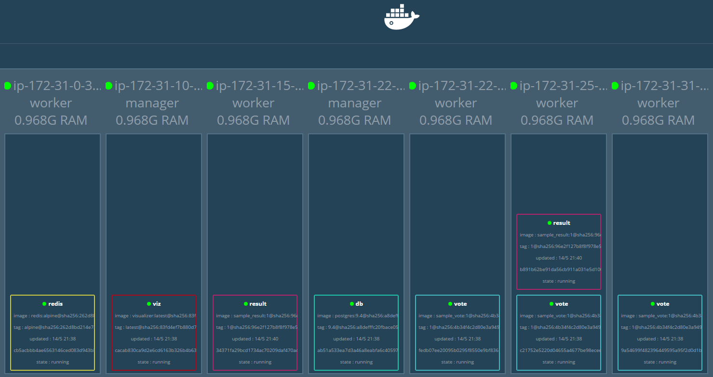

18. 결과 화면 페이지로 이동하면 투표 결과를 확인할 수 있다.

    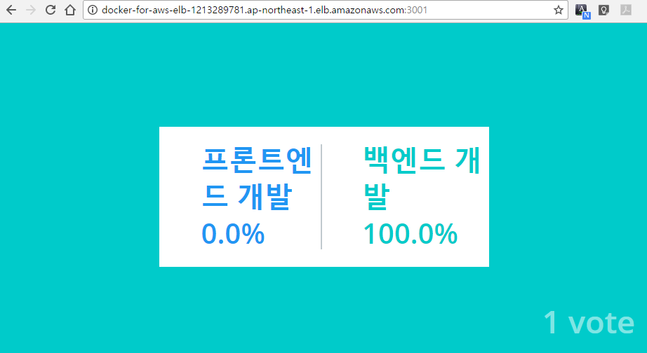

19. 서비스에 대한 업데이트가 발생하여 서비스를 업데이트 시켜야하는 경우에는 이미지를 버전 업해서 만든 후 현재의 vote 노드들을 해당 이미지로 update한다.

    ```shell
    $ docker service update \
     --image subicura/sample_vote:2 \
     vote
    ```

    - vote라는 이름의 노드에 기존의 버전 1을 사용하던 것을 버전 2로 변경.

    - 기본적으로 한대씩 롤링 업데이트를 수행하지만, 옵션을 통해 한번에 업데이트할 노드의 개수를 설정할 수 있다.

    - visualizer를 통해 노드를 확인해보면 버전2로 변경된 것을 볼 수 있다.

      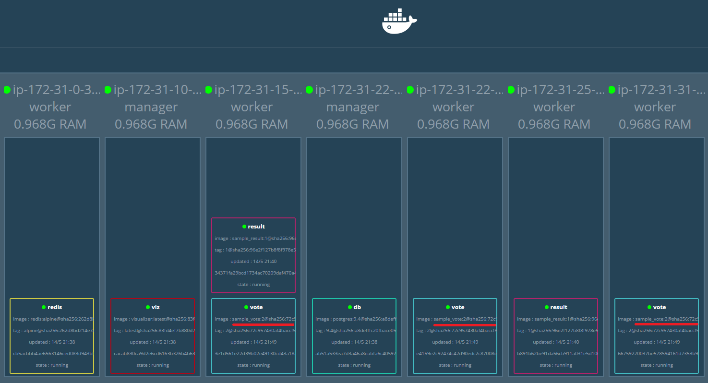

20. 변경된 웹페이지 확인

    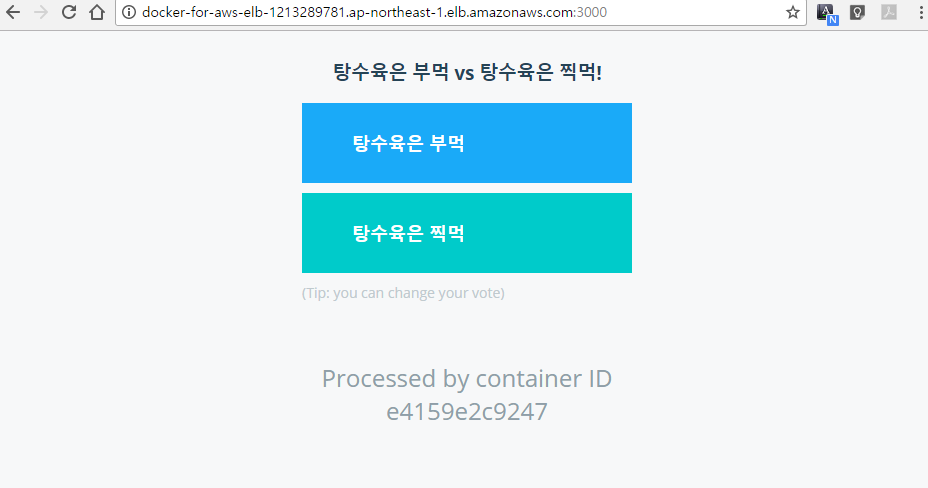

21. 결과화면에 대한 노드도 업데이트 수행

    ```shell
    $ docker service update \
     --image subicura/sample_result:2 \
     result
    ```

22. 변경된 결과 페이지 확인

    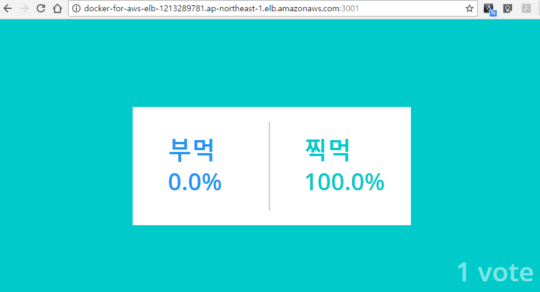

23. 모니터링을 위해 설정된 docker-compose 파일 다운로드

    - docker-stack.yml

      ```shell
      $ curl https://gist.githubusercontent.com/subicura/07a4e4f38768f9a1e6eeae37c6e1ad87/raw/8810e90be73bcd21ee2c65e6e5c220c4d08fd17c/docker-stack.yml > docker-stack.yml
      ```

      - 위 yaml 파일의 내용

        ```yaml
        version: "3"

        services:
          prometheus:
            image: prom/prometheus:latest
            networks:
              - monitoring
            ports:
              - 9001:9090
            volumes:
              - ./prometheus.yml:/etc/prometheus/prometheus.yml
            command: -config.file=/etc/prometheus/prometheus.yml -storage.local.path=/prometheu -alertmanager.url=http://alertmanager:9093
            deploy:
              placement:
                constraints:
                  - node.role == manager
          cadvisor:
            image: google/cadvisor:v0.24.1
            networks:
              - monitoring
            volumes:
              - /:/rootfs:ro
              - /var/run:/var/run
              - /sys:/sys:ro
              - /var/lib/docker/:/var/lib/docker/:ro
            deploy:
              mode: global
          node-exporter:
            image: basi/node-exporter:latest
            networks:
              - monitoring
            volumes:
              - /proc:/host/proc
              - /sys:/host/sys
              - /:/rootfs
              - /etc/hostname:/etc/host_hostname
            environment:
              HOST_HOSTNAME: /etc/host_hostname
            deploy:
              mode: global
            command: |
              -collector.procfs /host/proc -collector.sysfs /host/sys -collector.filesystem.ignored-mount-points "^/(sys|proc|dev|host|etc)($$|/)" --collector.textfile.directory /etc/node-exporter/ --collectors.enabled="conntrack,diskstats,entropy,filefd,filesystem,loadavg,mdadm,meminfo,netdev,netstat,stat,textfile,time,vmstat,ipvs"
          elasticsearch:
            image: elasticsearch
            networks:
              - monitoring
            environment:
              ES_JAVA_OPTS: -Xmx1G -Xms1G
            deploy:
              placement:
                constraints:
                  - node.role == manager
            command: -Etransport.host=0.0.0.0 -Ediscovery.zen.minimum_master_nodes=1
          grafana:
            image: basi/grafana:v4.1.1
            ports:
              - 9000:3000
            networks:
              - monitoring
            depends_on:
              - elasticsearch
              - prometheus
            environment:
              GF_SERVER_ROOT_URL: http://grafana.aws.subicura.com
              GF_SECURITY_ADMIN_PASSWORD: password
              PROMETHEUS_ENDPOINT: http://prometheus:9090
              ELASTICSEARCH_ENDPOINT: http://elasticsearch:9200

        networks:
          monitoring:
        ```

    - prometheus.yml

      ```shell
      $ curl https://gist.githubusercontent.com/subicura/ffff392ddd3f4a2ede0a4727fafaa0da/raw/1378a8414f86255e7cb4bda1f6018fe3166bae13/prometheus.yml > prometheus.yml
      ```

      - 위 yaml 파일의 내용

        ```yaml
        global:
          scrape_interval:     30s
          evaluation_interval: 30s
          external_labels:
              monitor: "prometheus-swarm"

        rule_files:

        scrape_configs:
          - job_name: 'prometheus'
            dns_sd_configs:
            - names:
              - 'tasks.prometheus'
              type: 'A'
              port: 9090

          - job_name: 'cadvisor'
            dns_sd_configs:
            - names:
              - 'tasks.cadvisor'
              type: 'A'
              port: 8080

          - job_name: 'node-exporter'
            dns_sd_configs:
            - names:
              - 'tasks.node-exporter'
              type: 'A'
              port: 9100
        ```

24. 다운받은 yaml 파일로 docker stack 수행

    ```shell
    $ docker stack deploy -c ./docker-stack.yml prometheus-stack
    ```

25. 생성된 노드 확인을 위해 visualizer 확인

    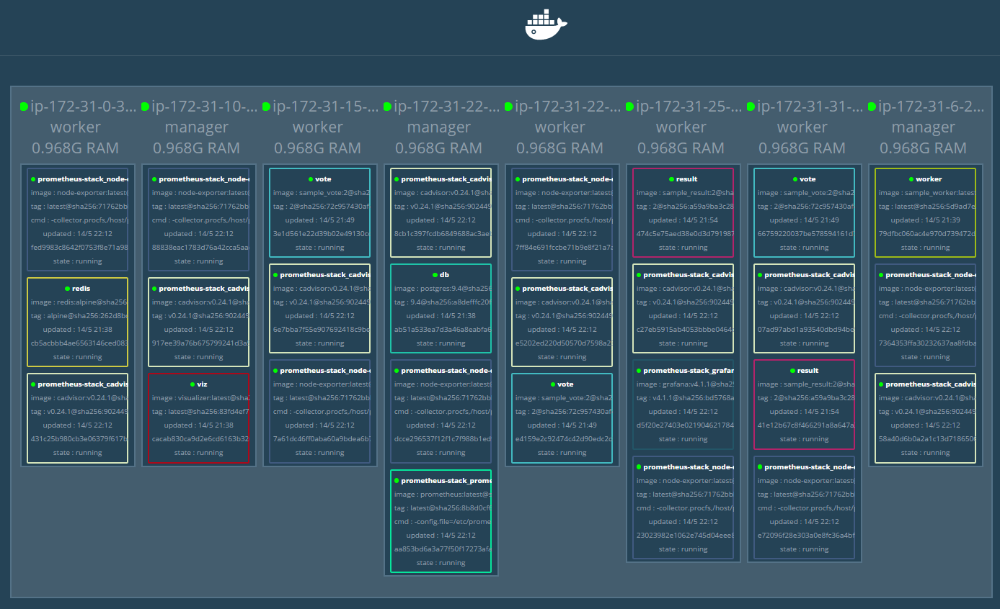

    - 모니터링을 위해서는 각 manager와 worker 노드에서 정보를 수집하기 위한 서비스들을 구동시켜야 하기 때문에 global 설정으로 각 노드에 해당 서비스들이 생성되었다.

26. prometheus로 접속

    ```
    http://docker-for-aws-elb-1213289781.ap-northeast-1.elb.amazonaws.com:9001
    ```

    - Status > Targets 페이지로 이동해보면 현재 수집하고 있는 노드들의 정보를 볼 수 있다.

      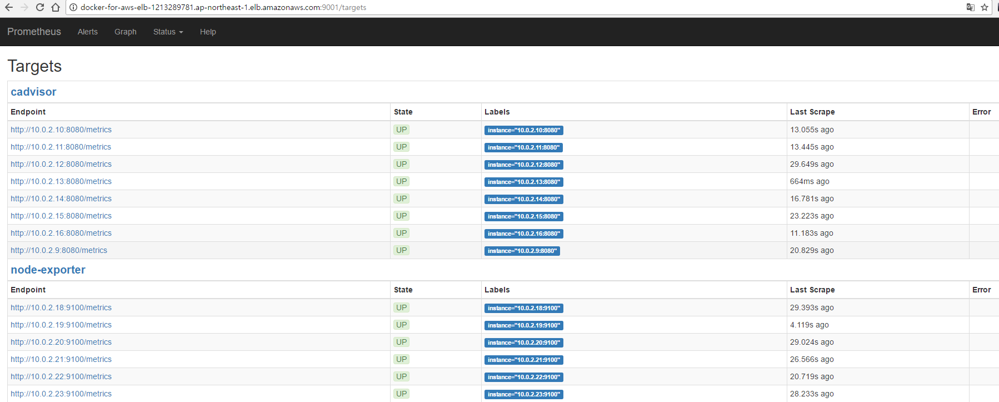

    - cAdvisor : 컨테이너의 정보 수집

    - node-exporter : 실제 호스트의 정보 수집

27. grafana로 접속

    ```
    http://docker-for-aws-elb-1213289781.ap-northeast-1.elb.amazonaws.com:9000
    ```

    - 최초 계정은 서비스 생성시 패스워드를 password로 지정했기 때문에 admin/password로 접속

    - 대쉬보드는 미리 만들어진 것을 import해서 사용

      - Home > import > 609 입력

    - 아래와 같이 모니터링할 항목들을 지정후 import

      

    - 아래와 같이 수집된 정보를 시각화해줌

      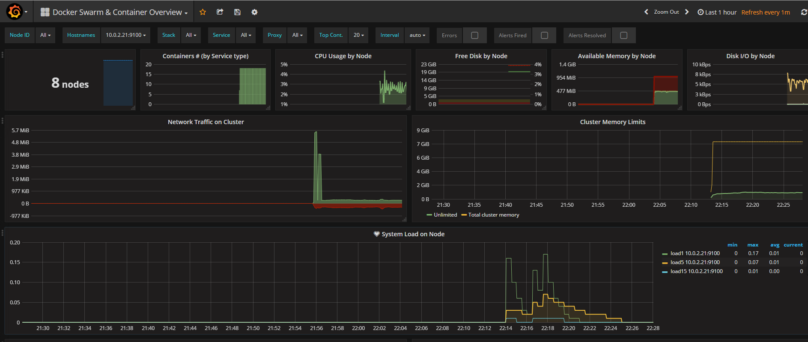

28. CloudWatch의 로그 확인

    - CloudWatch > 로그 > docker-for-aws-lg 선택

      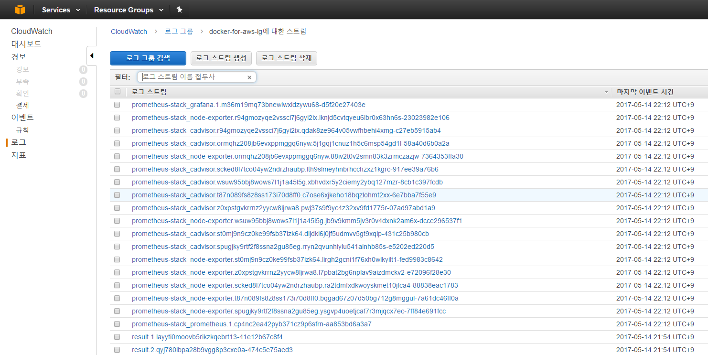

    ​

    ​

## 알아볼 것들

- Ingress 네트워크
- Overlay 네트워크
- docker stack