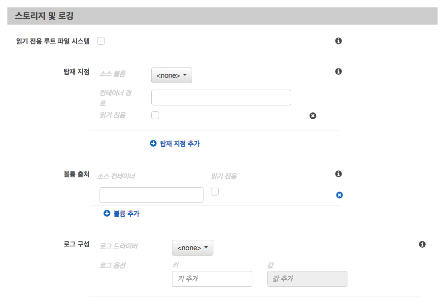

# ECS

## 주요 구성 요소

* Container Instance

  * Amazon ECS 에이전트를 실행 중이며 클러스터에 등록된 Amazon EC2 인스턴스
  * 각 인스턴스가 EC2 서버 한대라고 생각하면 됨

* Container

  * 태스크의 일부로 작성된 Linux 컨테이너

* Cluster

  * Container Instance의 논리적인 그룹

    

* Task Definitions

  * 작업 정의 : 컨테이너에 대한 정의

    

* Tasks

  * 정의 해놓은 작업을 Container Instance로 배포 (작업 정의의 단일 인스턴스)

    

* Service

  * 배포된 각 작업들이 Container Instance에서 구동된 것을 서비스라고 함.

    


## Amazon ECS 작업 스케쥴링

* ECS는 long running 하는 stateless한 서비스 및 애플리케이션을 위한 서비스 스케쥴러를 제공
  * 상태 저장이 없어야 오토스케일링이 가능하기 때문에 stateless 해야함
* 서비스 스케쥴러는 지정된 수의 작업이 지속적으로 실행되도록 하고, 작업이 실패할 경우에는 해당 작업을 다시 스케쥴한다.
  * 원하는 작업 개수 지정 시에는 ALB를 사용하는 경우 고정된 포트로 원하는 작업의 개수만큼 컨테이너 인스턴스가 필요하므로 원하는 작업 수 이상의 컨테이너 인스턴스를 지정해야함
* 서비스 스케쥴러는 선택적으로 ELB에 작업을 등록시킬 수 있음
* 서비스 스케쥴러 또한 작업 정의와 같이 유지 관리 중인 서비스를 업데이트할 수 있음


## 작업 정의

### 고급 컨테이너 구성


* CPU 단위 : ECU 값
  * CPU 코어마다 1024개의 cpu 단위가 존재
  * docker run —cpu-shares 옵션에 매핑됨
* 필수 (essential) : true인 경우 컨테이너가 중지되면 작업의 일부인 다른 모든 컨테이너도 중지됨
* 진입점 (entryPoint) : docker run의 —entrypoint 옵션에 매핑
* 명령 (command) : 컨테이너로 전달되는 명령
  * docker run의 command 파라미터에 매핑
* 작업 디렉터리 (workingDirectory) : docker run의 —workdir에 매핑
* Env 변수 (environment) : docker run의 —env 옵션에 매핑


### 네트워크 설정


* 네트워킹 비활성화 (disableNetworking) : true일 경우 컨테이너 내에서 네트워킹이 비활성화됨
* 링크 (links) : 포트 매핑 필요 없이 컨테이너 간 통신이 가능하도록 함.
  * docker run 의 —link와 매핑
* 호스트 이름 (hostname) : 컨테이너에 사용할 호스트 이름
  * docker run의 —hostname 옵션에 매핑
* DNS 서버 (dnsServers) : 컨테이너에 제공되는 DNS 서버 목록
  * docker run의 —dns 옵션에 매핑
* DNS 검색 도메인 (dnsSearchDomains) : 컨테이너에 제공되는 DNS 검색 도메인의 목록
  * docker run의 —dns-search 옵션에 매핑
* 추가 호스트 (extraHosts) : 컨테이너의 /etc/hosts 파일에 추가할 호스트 이름 및 IP 주소 매핑의 목록
  * docker run의 —add-host 옵션에 매핑


### 스토리지 및 로깅



* 읽기 전용 루트 파일 시스템 (readonlyRootFilesystem) : true일 경우 루트 파일 시스템에 대한 읽기 전용 엑세스 부여

  * docker run의 —ready-only 옵션에 매핑

* 탑재 지점 (mountPoints) : 컨테이너에서 데이터 볼륨의 탑재 지점

  * docker run의 —volume 옵션에 매핑
  * 볼륨이 존재하지 않을 경우 [작업에서 데이터 볼륨 사용](http://docs.aws.amazon.com/ko_kr/AmazonECS/latest/developerguide/using_data_volumes.html) 참조


  * 소스 볼륨 (sourceVolume) : 탑재할 볼륨의 이름
  * 컨테이너 경로 (containerPath) : 호스트 볼륨을 탑재할 컨테이너의 경로
  * 읽기 전용 (readyOnly) : true 일 경우 컨테이너에는 볼륨에 대한 읽기 전용 엑세스가 부여됨
    * 기본 값 false

* 볼륨 출저 (volumesFrom) : 다른 컨테이너로부터 탑재할 데이터 볼륨

  * docker run의 —volumes-from 옵션에 매핑
  * 소스 컨테이너 (sourceContainer) : 탑재할 볼륨이 위치한 컨테이너의 이름
  * 읽기 전용 (readOnly) : true일 경우 컨테이너에는 볼륨에 대한 읽기 전용 엑세스가 부여됨
    * 기본 값 false

* 로그 구성 (logConfiguration) : 컨테이너의 로그 구성 사항

  * docker run 의 —log-driver 옵션에 매핑
  * 기본적으로 Docker 데몬이 사용하는 것과 동일한 로깅 드라이버를 사용
  * 작업 정의에서 awslogs 로그 드라이버를 사용하여 CloudWatch Logs로 컨테이너 로그를 보낼 수 있음
    * [awslogs 로그 드라이버 사용](http://docs.aws.amazon.com/ko_kr/AmazonECS/latest/developerguide/using_awslogs.html) 참조
    * 아래 로그 드라이버를 선택해서도 awslogs를 사용할 수 있음

* 로그 드라이버 (logDriver) : 컨테이너에 사용할 로그 드라이버

  * Amazon ECS 컨테이너 에이전트가 기본적으로 통신할 수 있는 로그 드라이버

* 로그 옵션 (options) : 로그 드라이버로 보낼 구성 옵션


### 보안/리소스 제한/DOCKER 레이블


* 권한이 있음 (privileged) : true일 경우 컨테이너에는 호스트 컨테이너 인스턴스에 대한 승격된 권한을 부여 받음(root 사용자와 비슷)
  * docker run의 —privileged 옵션에 매핑
* 사용자 (user) : 컨테이너 내부에서 사용할 사용자 이름
  * docker run의 —user 옵션에 매핑
* Docker 보안 옵션 (dockerSecurityOptions) : SELinux 및 AppArmor 다중 수준 보안 시스템에 사용자 지정 레이블을 제공할 문자열 목록
  * docker run의 —security-opt 옵션에 매핑
  * Amazon ECS 컨테이너 에이전트는 `ECS_SELINUX_CAPABLE=true` 또는 `ECS_APPARMOR_CAPABLE=true` 환경 변수를 사용하여 해당 인스턴스에서 사용 가능한 로깅 드라이버를 등록해야 해당 인스턴스에 배치된 컨테이너가 이들 보안 옵션을 사용할 수 있음
  * [Amazon ECS 컨테이너 에이전트 구성](http://docs.aws.amazon.com/ko_kr/AmazonECS/latest/developerguide/ecs-agent-config.html) 참조
* 사용자 제한 (ulimits) : 컨테이너에 설정하 ulimits의 목록
  * docker run의 —ulimit 옵션에 매핑
* Docker 레이블 (dockerLabels) : 컨테이너에 추가할 레이블의 키/값 맵
  * docker run의 —label 옵션에 매핑


## 서비스

* Amazon ECS는 단일 ECS 클러스터에서 작업 정의에 지정된 수("원하는 개수")의 인스턴스를 동시에 실행 및 관리할 수 있게 해줌
* 서비스에서 작업이 중지되는 경우 해당 작업은 종료되었다가 다시 시작됨.
  * 이 프로세스는 원하는 실행 작업 수에 도달할 때까지 계속 됨
  * 해당 컨테이너 인스턴스의 docker 컨테이너가 제거되었다가 다시 생성됨.
* 필요한 경우 ELB를 사용하여 서비스의 작업에 트래픽을 균등하게 분산하도록 구성할 수 있음
  * [서비스 로드 밸런싱](http://docs.aws.amazon.com/ko_kr/AmazonECS/latest/developerguide/service-load-balancing.html) 참조
* 서비스 스케쥴러가 최소 상태 백분율 및 최대 백분율 파라미터를 사용하여 배포 전략 결정
  * [서비스 정의 파라미터](http://docs.aws.amazon.com/ko_kr/AmazonECS/latest/developerguide/service_definition_paramters.html) 참조
* 서비스 스케쥴러 동작 방식 (다음의 로직으로 가용 영역 간의 작업을 밸런싱)
  * 클러스터에서 어느 컨테이너 인스턴스가 서비스의 작업 정의를 지원할 수 있는지 판단
    * 필요한 CPU, 메모리, 포트 및 컨테이너 인스턴스 속성과 같은 것들로
  * 인스턴스와 동일한 가용영역에서 이 서비스의 최소 실행 작업 수를 기준으로 유효한 컨테이너 인스턴스를 정렬.
    * 여기서 최소 실행 작업수라는 것은 각 컨테이너 인스턴스가 구동 중인 작업수가 제일 작은 컨테이너 인스턴스가 우선순위가 높다는 것을 의미
  * 위에서 결정된 컨테이너 인스턴스로 작업을 배치
* ​


## ECU

* AWS에서는 EC2 머신의 성능을 표현하기 위해 ECU(Elastic Compute Units)라는 단위로 표현

* 1ECU = 1 core 1.0-1.2 GHz 2007 Opteron or 2007 Xeon processor로 정의

  * [참고](http://aws.amazon.com/ec2/instance-types/)

* ECU = Virtual Core 개수 * Physical CPU에 따른 ECU 값

  

* EC2의 각 인스턴스 타입별로 vCPU 수가 정해져 있지만 이는 계열(family)에 따라 호스트의 사양이 다르기 때문에 vCPU 수가 같다고 해서 같은 성능을 보장하지는 않음.

  * 그래서 표준적인 CPU 성능이 필요했기 때문에 AWS에서는 이를 위해 ECU라는 CPU 성능 단위를 만들었음
  * 1ECU는 PassMark-CPU 라는 성능점수로 400점이며, 쿼드코어 CPU 1개의 [PassMark](http://confluence.kthcorp.com/pages/createpage.action?spaceKey=AWS&title=PassMark)-CPU 성능점수가 8800점.
  * **22개의 ECU가 일반적으로 포털에서 사용하는 쿼드코어 CPU1개와 동일**
  * **일반적으로 웹서버가 평균 10% 미만을 사용한다고 할 때 2.2개의 ECU면 충분하며, 피크치를 고려해도 10ECU정도면 충분**
    * [PassMark – CPU Mark](http://www.cpubenchmark.net/multi_cpu.html) 참고

* EC2 인스턴스에서 사양 확인

  ```shell
  $ lscpu
  ```

* 참고

  * [EC2 인스턴스 타입별 CPU 성능 측정](http://awsdog.tistory.com/entry/EC2-EC2-%EC%9D%B8%EC%8A%A4%ED%84%B4%EC%8A%A4-%ED%83%80%EC%9E%85Instance-Type%EB%B3%84-CPU-%EC%84%B1%EB%8A%A5%EC%9D%84-%EC%B8%A1%EC%A0%95%ED%95%B4%EB%B3%B4%EC%9E%90)
  * [AWS EC2 사양 검토](http://hochul.net/blog/aws-ec2-%EC%82%AC%EC%96%91%EC%9A%A9%EB%9F%89-%EA%B2%80%ED%86%A0/)
  * ​


## AMI

* Amazon ECS-Optimized Amazon Linux AMI
  * 아마존에서 docker를 사용하기에 최적화 된 환경을 Amazon Linux에 구축한 AMI
  * Amazon Linux인데 CoreOS인 것처럼 리소스를 최소화 시킴


## ELB

### ALB (Application Load Balancer)

* OSI 모델의 일곱 번째 계층인 응용 프로그램 계층에서 작동

* 요청을 받으면 우선 순위에 따라 리스너의 규칙을 검토하여 적용 할 규칙을 결정한 후 라운드 로빈 라우팅 알고리즘을 사용하여 작업 대상 그룹에서 대상을 선택함.

  * 여기서 작업 대상은 ECS에서 작업 대상에 자동으로 추가해주는 컨테이너 인스턴스를 말함

* 라운드 로빈 방식이 아닌 트래픽 기반의 로드 밸런싱을 하도록 리스너 규칙을 구성할 수도 있음

  

* 대상 그룹 내의 특정 대상이 여러 대상 그룹에 등록되어 있더라도 각 대상 그룹에 대한 라우팅은 독립적으로 수행됨

  * 즉, 속해있는 대상 그룹의 규칙 따라 각각 라우팅 됨

* ELB 특성 상 대상 그룹에서 비정상적인 대상을 탐지하고 정상적인 대상에만 트래픽을 라우팅함

* 응용 프로그램에 대한 요청의 흐름을 방해하지 않고 로드 밸런서에 대상을 추가 및 제거할 수 있기 때문에 자동으로 확장이 가능

* 오토 스케일링 설정이 안되어 있는 경우에는 작업의 수를 증가시키거나 감소시키는 작업을 수동으로 수행해야 한다.

  * 작업 개수를 늘리는 경우
    * ECS => 클러스터 => 서비스 선택 후 업데이트 버튼 클릭 => 작업 개수 폼의 값 조정
    * ECS => 클러스터 => ECS 인스턴스 => ECS 인스턴스 조정 => 원하는 인스턴스 개수 폼의 값 조정
    * EC2 => Instances 에서 인스턴스 생성 확인
    * EC2 => Load Balancing에서 TargetGroup 선택 => Target Group 리스트 중 해당 EC2 컨테이너 인스턴스에 해당하는 TargetGroup 선택 후 Targets 탭 선택 =>  Edit 버튼을 클릭 하여 새로 추가된 EC2 인스턴스를 TargetGroup에 추가
  * 작업 개수를 줄이는 경우
    * ECS => 클러스터 => 서비스 선택 후 업데이트 버튼 클릭 => 작업 개수 폼의 값 조정
    * ECS => 클러스터 => ECS 인스턴스 => ECS 인스턴스 조정 => 원하는 인스턴스 개수 폼의 값 조정
      * 인스턴스 개수를 줄이면 자동으로 EC2 인스턴스를 terminated 시킴
      * 완벽히 제거하려면 수동으로
    * EC2 => Load Balancing에서 TargetGroup 선택 => Target Group 리스트 중 해당 EC2 컨테이너 인스턴스에 해당하는 TargetGroup 선택 후 Targets 탭 선택 =>  Edit 버튼을 클릭 하여 제거된 EC2 인스턴스를 TargetGroup에서 제거


#### ALB를 사용할 떄의 이점 (CLB 사용 시 보다)

* 경로(URL) 기반 라우팅 지원
* 단일 EC2 인스턴스에 여러 포트를 사용하여 여러 서비스로 요청 라우팅을 지원
  * CLB는 하나의 EC2 인스턴스에 하나의 포트만 사용 가능
* 컨테이너화 된 애플리케이션 지원
  * ECS는 작업 예약 시 사용하지 않는 포트를 동적으로 선택하여 대상 그룹에 작업을 등록할 수 있음
* 상태 검사가 대상 그룹 단위로 정의되기 때문에 CloudWatch에서 메트릭을 대상 그룹 단위로 모니터링 할 수 있음
* 액세스 로그는 추가 정보를 포함하여 압축 된 형식으로 저장됨
* 로드 밸런서 성능이 향상됨


## Auto Scaling

* CloudWatch 경보에 의해 서비스를 확장하고 축소하는 조정 정책을 만들어서 서비스 Auto Scaling을 구성할 수 있음
* ECS => 클러스터 => Service => 서비스 리스트 중 해당 서비스 선택 => 업데이트 버튼 클릭 => Auto Scaling 설정 선택
* Minimum number of tasks : 최소로 유지할 작업의 개수
* Desired number of tasks : 원하는 작업의 개수
* Maximum number of tasks : 최대로 확장될 수 있는 작업의 개수
* IAM role for Service Auto Scaling : IAM 역할과 서비스 조정 정책을 구성할 수 있음


* 새 경보 생성을 선택하여 경보에 대한 구성을 한다.
  * 경보 임계 값을 위와 같이 설정하면 CPU 사용률이 1분동안 75%를 넘으면 CloudWatch 경보가 트리거 된다.


* 경보 설정을 저장한 후 정책에 대한 설정을 한다.
  * 위와 같이 설정하면 Cloud Watch에서 경보가 트리거 될 때 원하는 서비스의 작업이 설정된만큼 추가된다.
  * 추가될 작업 수가 1이상인 경우 휴지 시간에 설정된 시간에 따라 조정 작업간의 딜레이가 생긴다.


## ECR

* Docker Container Registry

- ECR에 저장된 이미지는 ECS에서 사용할 수 있음.
- IAM 롤 사용 가능
- HTTPS를 통해 컨테이너 이미지를 송수신
- 이미지는 S3로 저장이 되며, S3 서버측 암호화를 사용해서 자동으로 이미지를 암호화함
- 사용을 위해서는 awscli 필요
- Amazon ECR API를 사용해서도 이미지를 푸시하고 가져올 수 있지만 docker 명령을 사용할 것을 권장


### 비용

* 초기 비용이나 약정은 없음
* 리포지토리에 저장한 데이터와 인터넷으로 전송한 데이터양에 대한 요금만 지불
* 프리티어 유저인 경우 해당 기간 동안 매월 500MB의 스토리지를 무료 제공
* 프리티어 유저인 경우 해당 기간 동안 매월 15GB의 데이터 전송을 무료 제공
* 스토리지는 월별 GB당 0.10 USD
* 수신 데이터는 무료
* 같은 리전에 있는 EC2에서 ECR을 사용하는 경우에는 무료


### 리포지토리

* 레지스트리가 여러 리포지토리를 포함하고 있는 개념
* 각 리포지토리에 이미지를 푸시하거나 가져올 수 있음.
* 리포지토리 이름은 네임스페이스를 지원
  * 이를 통해 리포지토리를 그룹화 할 수 있음
  * 즉, 동일한 레지스트리를 여러 팀이 사용하는 경우 네임스페이스로 구분하여 리포지토리를 분리할 수 있다. 이렇게 구성하면 같은 이름의 이미지를 사용하더라도 네임스페이스가 다르기 때문에 간섭없이 사용 가능
* ecr:GetAuthorizationToken 권한이 있는 사용자만 레지스트리에 인증할 수 있고, 리포지토리를 사용할 수 있음.


### 사용하기

* registry에 접속하기 위한 docker login 인증 정보 얻기

  ```shell
  $ aws ecr get-login
  ```

  * 반환된 텍스트를 복사하여 명령 실행
    * 텍스트에 포함된 패스워드는 12시간 동안 유효한 권한 부여 토큰
    * [GetAuthorizationToken](http://docs.aws.amazon.com/AmazonECR/latest/APIReference/API_GetAuthorizationToken.html) API를 통해 base64로 인코딩된 토큰을 가져올 수 있지만 docker login 명령에서 디코딩해서 사용해야함. 
    * 위의 AWS CLI 명령을 사용하면 자동으로 토큰을 가져오고 디코딩하고 docker login 명령으로 변환해 주기 때문에 이를 사용하면 편리
  * 위 명령 수행 시 반환되는 텍스트에서 마지막 인자에 해당하는 주소가 레지스트리 주소.
  * 명령을 그대로 복사하여 실행할 경우 ps -e 명령을 통해 password를 볼 수가 있음.
  * 안전하지 않은 시스템일 경우 docker login시 -p  옵션을 생략하고 대화형으로 로그인해야함.

* 이후 해당 ECR 주소를 사용하여 docker push 명령으로 이미지를 푸시할 수 있음.


## 참고

* [Amazon EC2 Container Service](http://docs.aws.amazon.com/ko_kr/AmazonECS/latest/developerguide/Welcome.html)