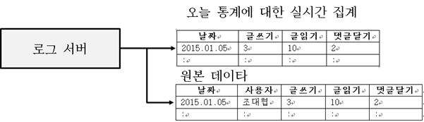
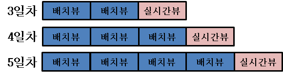
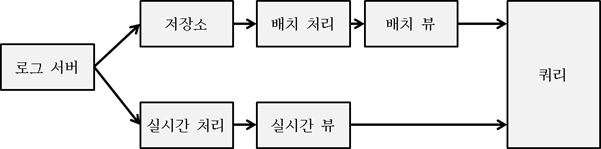
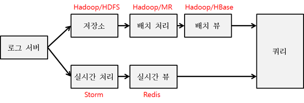
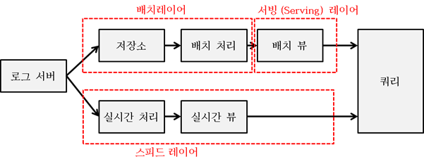

# 람다 아키텍처

* 트위터에서 스트리밍 컴퓨팅을 담당했던 네이선 마츠에 의해 소개된 아키텍처
* 실시간 분석을 지원하는 빅데이터 아키텍처

## 페이스북 같은 SNS 애플리케이션

* 모바일 애플리케이션이며 글쓰기, 읽기, 댓글 달기, 스크롤하기, 페이지 넘기기 등의 약 1000여 개의 사용자 이벤트가 있다고 가정

* 사용자 수는 대략 1억명

* 매일 각 사용자의 행동 패턴을 서버에 저장하여 일별로 사용자 이벤트의 개수를 통계로 추출

* 여기서 원하는 쿼리 결과는 각 이벤트별 모든 사용자의 이벤트 수행 횟수를 얻어오는 것이다.

* 클라이언트 디바이스에 전달되는 데이터

  * 사용자 : 홍길동

  * 날짜 : 2017년 5월 27일

    | 이벤트 종류 | 횟수   |
    | ------ | ---- |
    | 글쓰기    | 3    |
    | 글읽기    | 10   |
    | 댓글 달기  | 2    |
    | ...    | ...  |

* 이를 데이터베이스에 저장한다면 아래와 같은 컬럼으로 구성

  | 날짜        | 사용자  | 글쓰기  | 글읽기  | 댓글 달기 |
  | --------- | ---- | ---- | ---- | ----- |
  | 2017.5.27 | 홍길동  | 3    | 10   | 2     |
  | ...       | ...  | ...  | ...  | ...   |

* RDBM에 저장하고 쿼리를 통해 원하는 정보를 가져올 수 있다.

* 하지만 이벤트가 늘어나 컬럼이 1000개가 되고 1억명이 사용하는 시스템이라면 원하는 정보를 가져오기 위해 많은 부하가 발생한다.

  * 하루에 최대 1000개 칼럼 짜리 1억개의 레코드가 생성
  * 한달이면 30억개의 레코드가 생성
  * 이러한 데이터를 쿼리를 통해 합을 계산하여 가져오면 수행시간이 너무 오래 걸리게 된다.

###  배치 사용

* 전통적인 접근 방식으로 배치를 활용
  * 어떤 특정 시간에 계산을 미리 해 놓음
  * 데이터를 모아 놓았다가 밤마다 그 날짜의 사용자들의 이벤트들의 합을 매일 계산해놓은 테이블을 만들어둔다.
* 테이블을 매일 미리 만들어두면 1년분의 데이터라도 365행 밖에 되지 않기 때문에 속도 문제가 해결됨

### 실시간 데이터의 반영

#### 테이블 조인

* 배치 테이블을 사용하면 성능 문제는 해결되지만 배치 주기에 따라 최대 1일의 편차를 두게 된다.

  * 실시간 반영이 불가능

* 배치 테이블과 그 날의 데이터 테이블 두개를 같이 사용하는 것으로 해결

  * 어제까지의 데이터는 일별 배치로 생성된 테이블을 사용하고 오늘 데이터 부분은 사용자별로 기록된 로그 테이블을 사용하여 두 테이블을 조인

  * 오늘의 데이터

    | 날짜        | 사용자  | 글쓰기  | 글읽기  | 댓글달기 |
    | --------- | ---- | ---- | ---- | ---- |
    | 2017.5.27 | 홍길동  | 3    | 10   | 2    |
    | ...       | ...  | ...  | ...  | ...  |

  * 어제까지 데이터

    | 날짜        | 글쓰기  | 글읽기  | 댓글달기 |
    | --------- | ---- | ---- | ---- |
    | 2017.5.26 | 3    | 10   | 2    |
    | ...       | ...  | ...  | ...  |

#### 실시간 집계 테이블의 활용

* 하루에 쌓이는 데이터양이 많지 않다면 문제가 되지 않지만, 이 시나리오에서 처럼 하루에 쌓이는 데이터가 일 최대 1억건이 되는 경우에는 문제가 된다.

  * 오늘 쌓이는 데이터가 1억건인데 이를 조인을 수행하여 결과를 얻어낸다면 좋은 성능을 기대하기 어렵다.
  * 배치는 매일 돌리되 오늘 데이터에 대한 통계 값을 실시간으로 업데이트하는 방법을 생각해 볼 수 있다.

* 로그 서버를 두고, 클라이언트에서 받은 로그를 기존과 동일하게 원본 데이터 테이블에 계속 저장하고, 오늘 통계에 대한 실시간 집계 테이블에 개별 이벤트의 값을 계산해서 더해준다.

  

  * 오늘 데이터를 위한 실시간 집계 테이블을 추가로 생성하여 오늘 쌓인 이벤트들의 합을 누적
  * 이렇게 하면 오늘 데이터에 대한 로그를 쿼리할 필요 없이 누적된 결과만 가져오면 된다.

* 실시간 집계 테이블과 배치 테이블을 조인하여 빠르게 실시간 통계를 볼 수 있다.

  

## 람다 아키텍처 활용

* 데이터의 흐름

  

  1. 배치 처리를 위해 로그 서버는 모든 로그 데이터를 저장소에 저장
  2. 배치 처리 단계에서 일일 또는 일정한 시간을 주기로 배치 처리로 계산 후 배치 뷰(배치 테이블)를 만든다.
  3. 1과 동시에 로그 서버는 실시간 처리를 위해 실시간 처리 쪽으로도 데이터를 전송한다.
  4. 실시간 처리 단계에서 데이터를 실시간으로 집계하고 실시간 집계 테이블을 만든다.
  5. 이 두 개의 뷰를 합쳐서 통계를 만든다.

* 배치 뷰는 배치로 돌때만 쓸 수 있고, 평상시에는 읽기만 가능

  * 데이터가 변경되는 것을 막음

* 실시간 뷰는 실시간으로 데이터를 읽고 쓸 수 있는 시스템 사용

* 위 예제에서는 컬럼의 개수를 카운팅하는 정도의 간단한 시나리오를 예로 들었지만 실제 빅 데이터 분석에서는 단순 통계뿐만 아니라 복잡한 수식이나 다단계를 거쳐야 하는 데이터 파일의 가공이 필요하다.

  * 처리 계층에 프로그램을 이용하여 알고리즘을 삽입할 수 있어야 한다.

* 람다 아키텍처에 대한 솔루션 매핑

  

  * 저장소는 대량의 데이터를 저비용으로 안정성 있게(유실 없게) 저장할 수 있는 것이 필요
    * 하둡의 HDFS
  * 이러한 대량의 데이터를 배치로 처리 할 때 될 수 있으면 신속하게 복잡한 알고리즘을 적용해서 계산할 수 있는 계층이 필요
    * 하둡의 MR(Map & Reduce)
  * 이렇게 계산 된 배치 데이터를 저장할 장소가 필요
    * 하둡의 HBase
      * NoSQL
      * 위 예와 같은 데이터를 저장하고 고속으로 액세스할 수 있도록 함.
  * 실시간 처리는 복잡한 알고리즘으로 빠르게 데이터를 처리할 수 있는 솔루션이 필요
    * 대표적으로 Apache Storm
  * 실시간 뷰를 위한 빠른 읽기와 쓰기를 지원해야 함
    * Redis와 같은 인메모리 기반의 NoSQL

### 람다 아키텍처의 솔루션 조합

| 단계     | 솔루션                                      |
| ------ | ---------------------------------------- |
| 저장소    | HDFS, Amazon S3                          |
| 배치 처리  | Map & Reduce                             |
| 배치 뷰   | HBase, Elephant DB, Apache Drill, Amazon RedShift, HP Vertica |
| 실시간 처리 | Storm, Spark                             |
| 실시간 뷰  | Redis, RDBMS                             |

### 람다 아키텍처 계층(Layer)화

* **스피드 레이어** : 실시간 데이터를 처리하는 부분
* **배치 레이어** : 배치 저장소와 배치 처리부분
  * 저장소에는 가공 전의 원본 데이터를 모두 저장
  * 데이터가 처리되고 나서도 저장소에 데이터를 삭제하지 않는다.
  * 유실 되었을 때 복구가 가능해야함
  * 새로운 뷰를 제공하고자 할때 기존의 원본 데이터를 가지고 있으므로 새로운 뷰의 통계 분석이 가능
* **서빙 레이어** : 배치에 의해서 처리된 요약 데이터를 제공하는 부분