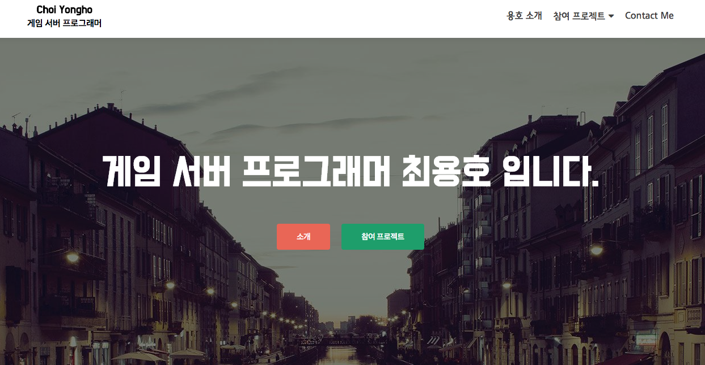

평소에 블로그를 관리하는 것과 홈페이지 만드는 것에 관심이 있어서 개인 홈페이지를 만들어 구글 클라우드에 올려서 사용하고 있었고, 오래 전부터 티스토리 블로그를 운영하고 있었습니다. 이 후에는 깃헙에 jekyll 기반의 기술 블로그를 만들어서 사용하기도 했는데 포스팅의 불편함 때문에 오래 지속하지는 못하고 있었습니다. 그래서 워드프레스를 고려하게 되었었는데, 당시에는 어떻게 시작해야 할 지 막막하기도 하고, 귀찮기도 해서 미루고 있던 중 이번에 한빛 미디어에서 워드프레스 만들기라는 책의 리뷰를 맡게 되어 이번 기회에 홈페이지를 새로 만들어보자 라는 목표가 생겼습니다. 

책을 받자마자 느낀 점은 **표지가 정말 이쁘다!** 였습니다. 무지개 빛깔의 그라데이션이 뭔가 워드프레스 로고와 어울렸고, 빨리 책을 펴보고 싶게끔 만들었습니다. 책의 목차를 살펴보니 대충 어떠한 식으로 진행 될 것이다라는 것이 느껴졌는데, 완성된 홈페이지가 머릿속에 그려지면서 잠시 후면 이 상상속의 홈페이지를 갖게 될 것이라는 기대감에 곧바로 읽어나가기 시작했습니다. 

책은 **초보자도 쉽게 읽고 따라 할 수 있도록** 친절하게 작성이 되어 있어서 저 또한 워드프레스는 처음 사용해보지만 막힘 없이 따라할 수 있었습니다. 책의 진도가 나아갈 수록 점점 더 만들어보고 싶은 홈페이지들에 대한 영감이 떠오르게 되었고, 개인 홈페이지를 시작으로 현재 속해있는 단체의 홈페이지나 사내 팀 기술블로그 또는 금은방을 하시는 친척분을 위한 쇼핑몰 페이지를 만들어보고 싶은 욕구가 마구 샘솟았습니다. 쇼핑몰을 만들기 위해서는 일반 홈페이지보다는 번거로운 작업들이 있기 때문에 여유를 갖고 만들어보기로 결정하고 [개인 홈페이지](http://www.yongho-choi.com)를 먼저 만들어 보았습니다. 책을 읽어나가면서 메인 페이지를 제외한 다른 페이지들은 이쁘게 꾸미지는 못했지만 대략적인 구색을 갖춘 홈페이지 하나를 만드는데 **4시간 정도**가 걸렸고,  다시 만들면 훨씬 더 빨리 만들 수 있을 것 같았습니다. 



이렇게 빠른 시간 내에 만드는 데에도 그 전에 한달여간 공들여 만든 홈페이지보다 훨씬 더 보기 좋은 퀄리티의 홈페이지가 만들어졌습니다. 만들다보니 왜 워드프레스가 이렇게 강세인지 느낄 수가 있었고, 플러그인들을 사용하면 간단하게 만들 수 있는 홈페이지의 종류가 무궁무진 할 것 같다는 생각이 들었습니다. 


### 플러그인 소개

책에도 **유용한 플러그인**들을 소개하고 있는데 하나하나가 정말 꿀팁이었습니다. 이 책이 아니었다면 이러한 플러그인들을 찾아보는데도 상당한 시간이 걸렸을 것 같습니다. 아래에 그러한 플러그인들을 정리해보았습니다.

- Contact Form 7
  - 고객의 CS 페이지 (문의하기)
- Shortcodes Ultimate
  - 짤막한 코드 (숏 코드)를 사용하여 기능을 구현 가능
  - 자주하는 질문 페이지
- Pricing Table Builder - Easy Pricing Tables
  - 제품이나 서비스의 값을 표시하는 가격표
  - 와탭의 구매 페이지랑 거의 흡사한거보니 와탭도 워드프레스 기반인듯
- KBoard
  - 게시판
- Korea SNS
  - 컨텐츠를 SNS에 공유
- P3 (Plugin Performance Profiler)
  - 성능 측정 도구
  - 플러그인 설치는 웹 페이지 성능에 영향을 준다.
  - 무분별한 플러그인 설치는 지양
- Yoast SEO
  - 검색 엔진 최적화
  - 콘텐츠가 검색 엔진 최적화에 잘 맞게 작성되었는지 체크
- WP Content Copy Protection & No Right Click
  - 불펌과 복사를 막아줌
- iThemes Security
  - 해킹 공격을 차단
  - 해킹 내역을 메일로 알림
- BackWPup
  - 수동 백업, 주기적인 백업 지원
  - 드롭박스로 자동 백업 가능


### 해본 것들과 느낀 점

책에서 본격적인 제작에 들어가기전에 호스팅 업체를 정하고, 서버를 할당받고, 도메인을 구매하는 과정이 있었는데, 저의 경우 도메인은 이미 가지고 있었고, 클라우드 환경의 서버를 사용 중이었기 때문에 이부분은 책의 내용과 다르게 구성을 했었습니다. 간략하게 구조를 설명하면, 구글 클라우드 플랫폼에 Compute Engine을 사용하여 서버를 구동시켰고, 워드프레스 구동은 docker를 사용하여 구축하였습니다.

책의 내용이 현재 워드프레스의 최신 버전과 동일했기 때문에 책에 포함된 그림이나 메뉴 구성이 똑같아서 따라하기가 좋았습니다. (이래서 기술 관련된 책은 최신판을 구매해야..)


아래는 제가 책을 보며 느꼈던 점과 유용했던 정보들에 대해 간략하게 요약해보았습니다.

- 댓글을 관리하는 시스템이 생소했다.
  - 기본이 관리자가 승인을 해야하는 시스템.
  - 승인 하지 않아도 작성되도록 정책을 설정할 수가 있다.
- 일반 포스트와 정적 페이지를 구분해서 작성할 수 있는 시스템
  - 획기적이다.
  - 블로그와 홈페이지를 자유자재로 구성할 수 있다.
- 회원 가입 기능도 간편하게 설정할 수 있다.
  - 일반 설정의 누구나 가입할 수 있습니다 선택
  - 새 사용자에 대한 권한 설정도 5단계의 권한 중 선택하는 방식으로 간편하게 할 수 있다.
- 테마마다 설정이 모두 다르다.
  - 사용자 정의하기 메뉴를 통해 각 테마별 설정을 할 수 있다.
- 해상도 별 레이아웃을 쉽게 볼 수 있다.
  - 레이아웃 토글 키를 이용하여 PC, 태블릿, 스마트폰 화면을 미리볼 수 있다.
- 헤더 이미지를 여러개 저장해서 랜덤으로 이미지가 노출되도록 할 수 있다.
- 다음이나 네이버에서 제공하는 블로그에서처럼 위젯을 선택하여 원하는 위치에 배치하여 사용할 수 있다.
- 마인드맵을 통해 제작할 웹 사이트의 메뉴를 미리 구성해보고 이를 토대로 실제 웹페이지를 만든다.
- 폰트
  - 우아한 형제들
- 로고
  - 포토스케이프
- 이미지 다운로드 웹사이트
  - 무료
    - [픽사베이](http://www.pixabay.com)
    - [언스플래시](https://unsplash.com)
    - [픽점보](http://picjumbo.com)
    - [모그파일](http://morguefile.com)
  - 유료
    - [게티이미지뱅크](http://www.gettyimagesbank.com)
    - [토픽이미지](http://www.topicimages.com)
- 유료 테마
  - [테마포레스트](http://themeforest.net)
- Zerif Lite 테마 적용
  - 적용 시 사이즈 문제 발생
  - 책에는 한글 번역을 위해 파일을 다운 받아 사용해야 하는 이슈가 있었는데 현재는 테마 적용시 번역이 자동으로 수행 됨.
- 자식 테마 지정
  - 자식 테마를 사용하는 이유는 원본에 영향을 주지 않은 상태로 기능을 추가할 수 있기 때문.
  - style.css 파일에는 반드시 주석문도 포함시켜야 한다.
    - 주석 내용 중 Theme Name과 Template는 필수 사항이므로 반드시 작성해야함.
  - 해당 정보가 테마의 헤더 정보가 됨.
  - 자세한 사항은 [여기](https://codex.wordpress.org/ko:Child_Themes) 참조


### 개발자들을 위한 팁!

혹시나 책을 읽으시는 분이 **개발자**이시라면, 저와 같이 서버를 직접 구축해서 사용하시는 분들도 계실 것입니다. 그런 분들을 위한 팁을 드리자면 먼저 워드프레스의 데이터베이스는 아래와 같이 구성되어 있습니다.

* 데이터베이스 구조

  ```
  +-----------------------+
  | Tables_in_wordpress   |
  +-----------------------+
  | wp_commentmeta        |
  | wp_comments           |
  | wp_links              |
  | wp_options            |
  | wp_postmeta           |
  | wp_posts              |
  | wp_term_relationships |
  | wp_term_taxonomy      |
  | wp_termmeta           |
  | wp_terms              |
  | wp_usermeta           |
  | wp_users              |
  +-----------------------+
  ```


만약 사용 중인 서버를 **다른 서버로 이전**해야하는 경우가 생긴다면 워드프레스의 모든 파일들과 데이터베이스 내용을 옮겨야 합니다. 이 때 워드프레스는 해당 서버의 `/var/www/html`디렉토리 내에 있는 파일들을 새로운 서버에 복사하고, 데이터베이스 또한 백업 후 해당 서버에 복원을 시켜야 합니다.

이 때 발생하는 문제가 홈페이지의 고유 주소가 이전 서버 주소로 되어 있다는 것인데, 이 때문에 페이지를 이동하려고 하면 이전 서버로 접속하려고 하여 에러가 발생합니다. 이 때는 아래와 같이 데이터베이스를 직접 조작하여 주소를 변경시켜주면 됩니다.

```sql
sql> update wp_options set option_value='이전할 주소' where option_name='siteurl';
sql> update wp_options set option_value='이전할 주소' where option_name='home';
```

제가 작업했던 내용의 예는 아래와 같습니다.

```sql
mysql> select * from wp_options where option_value like "%yongho-choi.com%";;
+-----------+-------------+----------------------------+----------+
| option_id | option_name | option_value               | autoload |
+-----------+-------------+----------------------------+----------+
|         1 | siteurl     | http://www.yongho-choi.com | yes      |
|         2 | home        | http://www.yongho-choi.com | yes      |
+-----------+-------------+----------------------------+----------+
2 rows in set (0.01 sec)

mysql> update wp_options set option_value='http://www.newurl.com' where option_name='siteurl';
Query OK, 1 row affected (0.28 sec)
Rows matched: 1  Changed: 1  Warnings: 0

mysql> update wp_options set option_value='http://www.newurl.com' where option_name='home';
Query OK, 1 row affected (0.19 sec)
Rows matched: 1  Changed: 1  Warnings: 0
```

제가 찾은 방법은 이 것이지만, 더 효율적인 방법이 있을 수 있으므로 찾아보시는 걸 추천드립니다. 


또 다른 이슈로는 **파일 업로드 시 파일 사이즈 초과**로 인해 업로드가 불가능한 경우가 있었는데, 이는 설정을 통해 해결할 수가 있습니다. 하지만 호스팅 업체를 통해 서버를 제공받아 사용하는 경우 파일 사이즈를 너무 크게 하는 경우 해당 서버의 용량이 부족해지는 문제가 발생할 수 있기 때문에 주의하시기를 바랍니다. 파일 사이즈를 늘리는 방법은 아래와 같습니다.

* 워드프레스 파일들이 위치한 디렉토리 최상위에서 php.ini 파일을 만들거나 수정하여 아래 내용 추가

  ```
  upload_max_filesize = 64M
  ```

  ​