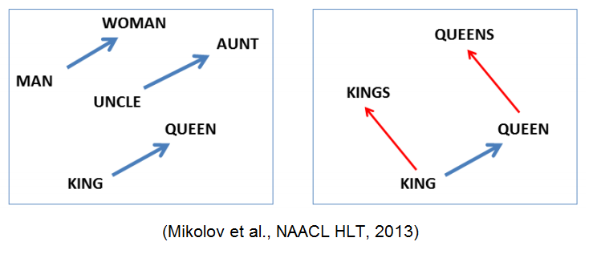

# Word2Vec

* NLP(Natural Language Processing, 자연어 처리) : 컴퓨터가 인간이 사용하는 언어를 이해하고, 분석할 수 있게 하는 분야를 총칭하는 말.
  * 기본적으로 컴퓨터가 어떤 단어에 대해 인지할 수 있게 하기 위해서는 수치적인 방식으로 단어를 표현할 수 있어야 한다.
  * 수치화를 통해 단어의 개념적 차이를 나타내기는 근본적으로 힘들다.

## one-hot encoding

n개의 단어가 들어있는 사전(Dictionary)을 가지고 있다고 가정하고, 단어를 표현하기 위해서 길이가 n인 벡터를 하나 만들고, 그 단어가 해당되는 자리에 1을 셋팅하고 나머지 자리에는 0을 셋팅한다. 

* 사전이 [감자, 딸기, 사과, 수박]인 경우, 사과는 벡터로 [0,0,1,0]과 같이 표현될 수 있다.

* 이러한 방식은 나름 좋은 성능을 내긴 했지만 **단어가 본질적으로 다른 단어와 어떤 차이점을 가지는 지 이해할 수 없다**는 아주 큰 단점이 존재했다.

  

* 이러한 단점을 극복하기 위해 연구자들은 단어가 가지는 의미 자체를 다차원 공간에서 **벡터화** 하는 방식을 고안하게 되었다.

## 의미 자체까지 벡터화

단어의 의미 자체를 벡터화 할 수 있게 된다면 기본적으로 이것을 사용해서 할 수 있는 일들이 굉장히 많아진다.

* 단어들이 실수 공간에서 흩어져 있다고 생각할 수 있기 때문에 각 단어들 사이의 유사도를 측정할 수가 있다.
* 여러개의 단어에 대해 다룰 때에도 더해서 평균을 내는 등 수치적으로 쉽게 다룰 수 있다.
* 의미 자체가 벡터로 수치화되어 있기 때문에, 벡터 연산을 통해서 추론을 내릴 수 있다.
  * 예를 들어, '한국'에 대한 벡터에서 '서울'에 대한 벡터를 빼고, '도쿄'에 대한 벡터를 넣는다면, 이 벡터 연산 결과를 통해 나온 새로운 벡터와 가장 가까운 단어를 찾게되면 '일본'이라는 결과를 얻을 수 있다.