# 인터넷

## 패킷 스위칭

* 지리적으로 떨어져 설치된 컴퓨팅 자원에 서로 다른 장소에서 일하는 과학자가 접근하기 위한 연결 수단이 필요
* 그 전까지는 장거리 통신에서 서킷 스위칭(circuit switching) 사용
  * 송수신 단말 사이에 회로(circuit) 연결을 해두고 정보 전달 수행
  * 회로보다 작은 단위인 회선(line)을 길게 짜 맞추어 연결한 것
  * 송수신이 일어나는 동안 연결 유지. 전용선
  * 회선은 모든 송수신이 끝날 때까지 그 연결 전용으로만 사용해야 함.
  * 통신이 끝나면 회선 사이의 연결을 모두 끊은 후 다른 정보를 송수신하기 위해 각각 다른 회선과 다시 연결.
  * 가용성 면에서 제한적
* 패킷 스위칭은 하나의 송수신에 회선을 전용으로 할당해야 할 필요가 없으므로 가용성을 높일 수 있다.
  * 회선 자체는 공유하되, 송수신 내용을 패킷이라는 작은 뭉치로 나눈 뒤 저장 후 전달(store and forward) 절차를 사용
  * 네트워크의 각 노드는 같은 네트워크의 여러 노드에 연결되고, 연결된 회선으로 노드 사이에 패킷을 주고 받을 수 있다.
  * 각각의 노드는 수신한 패킷을 저장하고 이후 목적지에 가까운 다른 노드로 이를 전달
  * 서킷 스위칭과 비교해 가장 중요한 차이점은 같은 회선을 이용해 여러 노드로의 송수신이 동시에 진행될 수 있다는 점.
  * 한번에 많은 송수신 패킷을 처리할 수 있으므로 가용성 증대.
* 패킷 스위칭 자체는 추상화된 개념.
* 구체화 하기 위해 네트워크의 각 노드가 어떻게 데이터 패킷을 꾸릴지, 어떻게 패킷을 네트워크를 통해 보낼지를 정형화해 둔 프로토콜이 필요
* 이렇게 발전한 프로토콜을 통칭해 TCP/IP 스택 또는 TCP/IP Suite라고 한다.

## TCP/IP 스택의 계층 구조

* 목적에 따라 여러 프로토콜을 갈아 끼울 수 있게 계층을 추상화하여 나누고, 각 계층이 저마다의 소임에 충실할 수 있게끔 설계하여 각기 독립적인 계층이 다른 계층을 뒷바침하고 데이터를 적절히 연계할 수 있다.
* 우아하게만 보이는 TCP/IP 스택에도 여기저기 땜질한 자국도 많이 보이는데 프로토콜 작성자마다 성능이니 확장성이니 하는 핑계로 쓸모있긴 하지만 설계 철학에 반하는 복잡한 예외사항으로 범벅을 해두었다.
* 게임 제작에는 주로 TCP/IP의 상위 계층을 주로 다룸
  * 최적화를 위해서는 하위 계층이 어떻게 동작하는지, 상위 계층과는 어떤 식으로 상호작용하는지 알아두는 것이 좋다.
* OSI 7계층 중 게임 개발과 관련이 있는 물리/링크/네트워크/전송/응용 계층에 대해 살펴본다.
* 각 계층은 저마다 자기 윗단 계층을 지원하기 위해 수행해야 하는 역할이 있다.
  1. 윗단 계층에서 데이터 블록을 수신
  2. 계층 헤더를 추가해 패킷을 꾸린다
  3. 데이터를 아랫단 계층으로 전달해 송신 과정을 계속해 나간다.
  4. 아랫단 계층에서 수신된 데이터를 받는다.
  5. 헤더를 제거하여 수신된 데이터의 패킷을 푼다.
  6. 수신된 데이터를 윗단 계층으로 전달해 수신처리를 계속해 나간다.
* 객체지향에 비유하자면 계층은 인터페이스, 각 프로토콜이나 프로토콜 집합은 그 인터페이스를 구체화한 구현물.
* 각 계층마다 헤더를 가지고 있고 층을 거쳐갈 수록 헤더를 붙이거나 제거하는 식으로 전달됨.

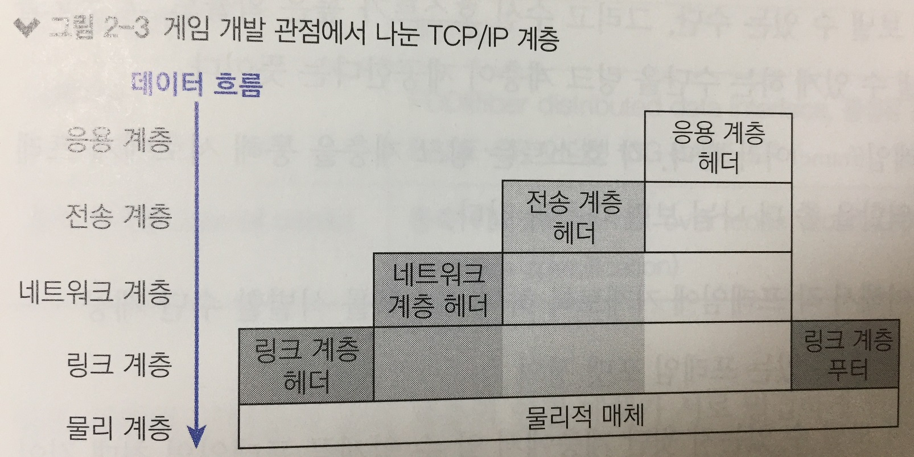

### 물리 계층

* 가장 기본적인 하드웨어 전송을 지원
* 네트워크로 연결된 컴퓨터, 즉 호스트 사이의 물리적 연결을 책임짐
* 물리적으로 연결된 매체가 있어야 정보 전달이 가능
  * 전화선, 동축케이블, 광섬유케이블 등
  * 핸드폰, 노트북과 같은 전파를 사용한 정보 전달도 포함

### 링크 계층

* 전자기학을 벗어나 컴퓨터학이 본격적으로 적용되는 곳

* 송신 호스트가 정보를 꾸려 물리 계층을 통해 정보를 보낼 수 있는 수단, 그리고 수신 호스트가 높은 확률로 그 정보를 수신하여 안에 담긴 정보를 꺼낼 수 있게 하는 수단을 제공

* 링크 계층의 송수신 단위를 프레임(frame)이라고 함.

* 링크 계층의 역할

  * 특정 목적지에 주소를 부여해서 각 프레임에 기재토록 하여 호스트를 식별할 수단 제공
  * 수신 측 주소와 데이터를 담을 수 있는 프레임 포맷 정의
  * 한 번에 데이터를 얼마까지 보낼 수 있는지 윗단 계층에서 알 수 있게끔 프레임의 최대 길이를 정의
  * 물리 계층을 거쳐 전달된 신호를 의도된 호스트가 수신할 수 있게 프레임을 물리적인 전기 신호로 변환하는 방법 정의

* 의도된 호스트에 프레임이 전달될지 아닐지는 확률적으로 결정되며 항상 보장되는 것은 아니라는 점에 유의

* 링크 계층에서는 프레임이 도착하였는지 확인하거나 실패하였을 때 다시 보내는 등의 시도를 전혀 하지 않는다.

  * 이러한 이유로 링크 계층을 비신뢰성(unreliable) 통신이라 함.

* 물리 계층을 구현하고자 하는 물리적 연결 매체마다 대응되는 하나 이상의 프로토콜이 링크 계층에 존재

  * 랜선 연결은 1000BASE-T 같은 이더넷 계열 프로토콜로 통신

  * 전파 연결은 와이파이 프로토콜 또는 장거리 무선 프로토콜인 3G나 4G로 통신

    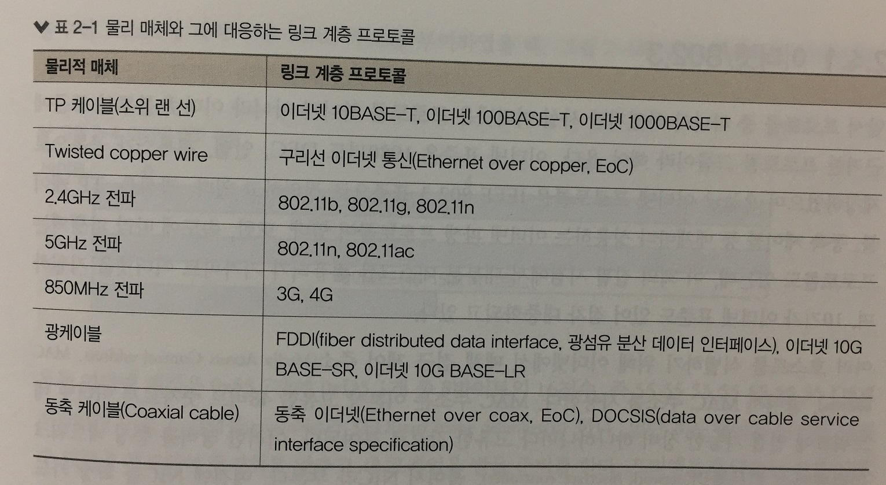

* 링크 계층의 구현물과 물리 계층의 연결 매체가 서로 밀접하게 연관되어 있다 보니 일부 모형에서는 이 두 가지를 합쳐 하나의 계층으로 묘사하기도 한다.

  * 하나 이상의 링크 계층 프로토콜을 지원하는 물리적 연결 매체도 있으므로, 서로 다른 계층으로 구별해 두는 편이 좋음.

* 두 호스트 사이에 꼭 한 벌의 물리적 연결 매체와 링크 계층 프로토콜 조합만 쓰는 것은 아니다.

  * 한뭉치의 데이터를 보내는 과정에서 데이터가 서로 다른 여러 매체와 링크 프로토콜을 거쳐 갈 수도 있다.
  * 즉, 네트워크 게임을 하면서 발생하는 데이터를 송신하는 과정에서, 다양한 링크 계층 프로토콜이 두루 이용될 수 있다.

* 다양한 링크 계층 프로토콜 중에서 가장 많이 접하게 되는 이더넷에 대해서는 알아둘 필요가 있다.

#### 이더넷/802.3

* 이더넷은 프로토콜 하나가 아니라 이더넷 블루북 표준에 근거한 프로토콜 그룹이다.

* 이더넷 표준은 1980년도 DEC, 인텔, 제록스가 공동으로 제창

* 오늘날 이더넷 프로토콜은 IEEE 802.3 표준으로 정의

* 광섬유, TP 케이블, 동축 케이블 등 매체마다 상응하는 이더넷 파생 프로토콜이 있다.

  * 속도에 따라 파생되는 프로토콜도 있음

* 여러 호스트를 식별하기 위해 이더넷에서는 매체 접근 제어 주소(Media Access Control address. MAC)를 사용

  * MAC 주소는 이론상 고유한 48비트 숫자
  * 이더넷 네트워크에 연결 가능한 장비 하나하나 마다 고유한 값으로 부여
    * 이러한 장비를 통칭하여 네트워크 인터페이스 컨트롤러(Network Interface Controller. NIC)라고 한다.
  * 범용 고유 식별자(universally unique identifier. UUID)의 일종으로 기기마다 고유한 값을 부여해야 한다.
    * 그래서 NIC 제조업체는 하드웨어 제조 과정에서 MAC 주소를 기기에 새겨 넣음.
  * 첫 24비트는 OUI(organizationally unique identifier)로서 제조업체 식별코드로 IEEE가 제조사마다 고유한 번호를 할당해준다.
  * 나머지 24비트를 고유하게 할당하는 일은 제조업체 책임.

* 이더넷만 MAC 주소를 사용하는 것은 아니고, 와이파이나 블루투스 등 대부분의 IEEE 802 링크 계층 프로토콜에서 사용

* 이더넷 패킷 구성

  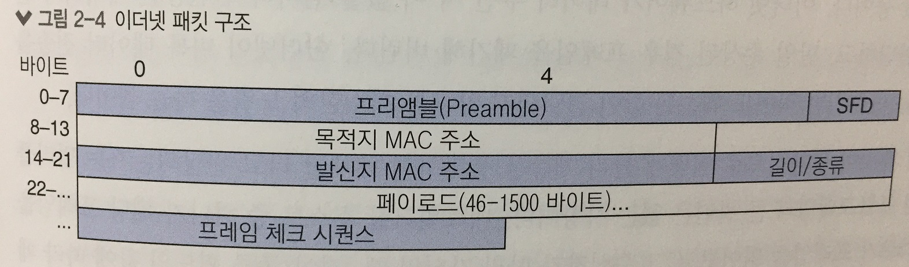

  * 모든 이더넷 패킷은 0x55 7개에 0xD5 1개 총 8바이트의 16진수로 시작.
    * 이를 프리앰블(preamble)과 SFD(start frame delimiter)라 한다.
    * 밑단 하드웨어는 이러한 이진수 패턴을 체크하여 동기화를 맞추고 새 프레임을 받을 준비를 한다.
    * 프리앰블과 SFD는 보통 NIC 하드웨어가 걸러내며, 프레임을 구성하는 나머지 바이트 열을 이더넷 모듈에 넘겨 처리한다.
  * SFD 뒤에 따라붙는 6바이트는 프레임의 수신자로 설정된 기기의 MAC 주소를 나타냄
    * 브로드캐스트 주소를 의미하는 특수 MAC주소도 있음.
      * FF:FF:FF:FF:FF:FF로 나타내고 LAN 상 연결된 모든 호스트에 전달하고자 할 때 사용
  * 길이/종류 필드는 오버로드하여 길이나 종류 둘 중 하나로 사용.
    * 길이 필드로 사용하는 경우 프레임에 포함된 페이로드의 길이를 바이트 단위로 나타낸다.
    * 종류 필드로 사용하는 경우 이더타입(EtherType) 고유 식별자 값을 기록해 페이로드 내 데이터를 어떻게 해석해야 하는지 표시
    * 이더넷 모듈이 이 필드를 처리할 때 정확하게 해석할 수 있게, 이더넷 표준은 페이로드의 최대 길이를 1500바이트로 정의해두었다.
      * 이를 최대 전송 유닛(maximum transmission unit. MTU)라 하며, 한 번 전송에 최대한 담을 수 있는 데이터의 양을 뜻함.
      * 오늘날 이더넷 NIC는 1500바이트를 넘어서는 정보 프레임을 지원하기도 함.
      * 최대 9000바이트 까지 MTU를 갖게 되는데 이를 지원하는 NIC는 프레임 헤더에 특정 이더타입 값을 기록하여 밑단 하드웨어에서 수신된 데이터에 따라 프레임의 크기를 계산한다.
    * 이더넷 표준은 이더타입의 최솟값을 0x0600, 즉 10진수로 1536으로 정해둠.
      * 그러므로 길이/종류 필드 값이 1500이하인 경우에는 길이로 해석하고, 1536 이상인 경우에는 종류로 판단
  * 페이로드(payload)란 프레임에 담겨 전송되는 데이터 그 자체를 뜻한다.
    * 대개 원하는 호스트로 전달하고 싶은 네트워크 계층 패킷이 담겨 있다.
  * 프레임 체크 시퀀스(frame check sequence. FCS)
    * CRC32 (32-bit cyclic redundancy checksum) 값
    * 여러 값에 걸쳐 연산하여 얻은 체크섬 값
    * 연산에 포함되는 것은 발신자와 수신자 주소 각각, 길이/종류 필드, 페이로드, 그리고 패딩 값 등
    * 이더넷 하드웨어가 데이터 수신 시 이 값을 검사하여 전송된 데이터가 손상되었는지 판단
    * 만일 손상된 경우 프레임을 폐기해버림
      * 이더넷이 비록 데이터 전송을 보장해 주지는 못하지만 적어도 훼손된 값이 전달되지 않도록 최소한의 노력은 하는 셈

* 이더넷 패킷에 대한 요약

  * 네트워크 상 호스트 중 하나가 해당 프레임을 받으면 호스트가 프레임을 읽어보고 그 수신자가 마침 자신일 때, 길이/종류 필드의 값에 따라 페이로드에서 데이터를 꺼내어 처리한다.

* 초기엔 소규모 이더넷 네트워크에선 허브(hub)라는 장비로 여러 호스트를 한데 묶어 연결했다.

  * 이런식으로 연결된 네트워크에선 이더넷 패킷의 전기 신호가 네트워크상 모든 호스트에 전달되었는데, 그 패킷이 자기 것인지 아닌지 여부는 각 호스트가 스스로 판단해야 했다.
  * 네트워크 규모가 확장 될수록 이 같은 방식은 효율이 저하될 수 밖에 없었다.

* 오늘날 최신 네트워크에서는 스위치(switch)라는 장비로 여러 호스트에 연결한다.

  * 스위치의 포트에 호스트를 연결해 두면 스위치는 그 호스트의 MAC주소, 혹은 IP 도 같이 기억해 두었다가 그 주소로 패킷을 전달할 일이 있을 때, 연결된 여러 호스트에 일일이 보내지 않고도 해당 호스트를 특정하여 최단경로로 보낼 수 있다.

### 네트워크 계층

* 링크 계층만 있어도 주소가 부여된 호스트 사이에 데이터를 주고 받기에 충분할 것 같은데 어째서 TCP/IP 같은 부가적인 계층이 필요할까?
  * MAC 주소가 하드웨어에 각인되어 유연성이 떨어진다.
    * 웹서버를 하나 열었는데 인기를 끌어 매일 수천명의 사용자가 이더넷으로 방문한다고 가정.
    * 링크 계층만 써서 서비스를 하면 서버에 접속하기 위해 이더넷 NIC 장비의 MAC 주소를 사용자들이 알아야한다.
    * 어느날 과부하를 견디지 못하고 NIC 카드가 고장난 경우 새 NIC 카드를 장착해야 하는데 새 카드의 MAC 주소는 이전과 달라지기 때문에 사용자는 더이상 이전 주소로 접속할 수 없게 된다.
    * 따라서 쉽게 설정할 수 있는 주소 체계가 MAC 주소 위에 병행하여 필요하다.
  * 링크 계층으론 인터넷을 보다 작은 네트워크망으로 나눌 수 없다.
    * 전체 인터넷이 링크 계층으로만 되어 있다고 하면 모든 컴퓨터가 단일망에 연결되어 있어야 한다.
    * 이더넷에서는 각 프레임을 네트워크상 모든 호스트에 전달해야하고, 전송자가 애초 의도한 수신자가 바로 자신인지 여부는 호스트 스스로 판단해야 한다.
    * 프레임 하나하나를 보낼 때마다 지구상 연결된 모든 호스트로 일일이 전달해야 한다.
    * 네트워크망을 지역마다 서로 다른 보안 영역으로 구분해 둘 수단이 없다.
    * 같은 사무실 내 호스트에서만 메시지를 브로드캐스트하거나 집 안에 있는 컴퓨터 사이에서만 파일 공유할 수 있는 수단이 없다.
  * 링크 계층에는 한 종류의 링크 프로토콜을 그와 다른 링크 프로토콜로 번역하는 방법이 정의 되어 있지 않다.
    * 여러 종류의 물리 계층과 링크 계층 프로토콜을 두는 까닭은 바로 서로 상이한 네트워크 사이에서 용도에 가장 알맞은 최적의 구현을 각자 선택하게끔 하자는 근본 철학에서 비롯된다.
    * 그러므로 링크 계층 위에 별도의 주소체계를 두어 하나의 링크 프로토콜과 다른 링크 프로토콜이 서로 통신할 방법을 규정할 필요가 있다.
* 네트워크 계층의 역할은 링크 계층 위에 논리 주소 체계 인프라를 구축하는 것.
  * 주소 걱정 없이 쉽게 호스트 하드웨어를 교체할 수 있다.
  * 여러 호스트를 그룹으로 묶어 서브네트워크로 격리할 수 있다.
  * 멀리 떨어진 서브네트워크 사이에 링크 계층 프로토콜이나 물리적 매체가 각기 다르더라도 서로 통신할 수 있다.

#### IPv4

* 오늘날 네트워크 계층에 필요한 기능을 구현하는데 가장 널리 이용되는 프로토콜.
* 논리 주소 체계로 각 호스트마다 개별적인 주소를 부여
* 서브넷 체계로 주소 공간의 논리적 부분집합을 나누어 물리적 서브네트워크를 정의하는데 사용
* 라우팅 체계로 서브넷 사이에서 데이터를 서로 전달

##### IP 주소와 패킷 구조

* IPv4의 핵심은 바로 IP 주소.

* 인터넷 상 호스트마다 고유한 IP 주소를 부여해 두면, 발신 호스트가 패킷을 보낼 때 패킷 헤더에 목적 호스트의 IP 주소를 기록하기만 하면 된다.

* 패킷에는 우선 헤더 자리를 마련해 네트워크 계층 기능에 필요한 데이터를 담아두고 그 뒤에 윗단 계층의 데이터를 전송할 페이로드가 붙는다.

  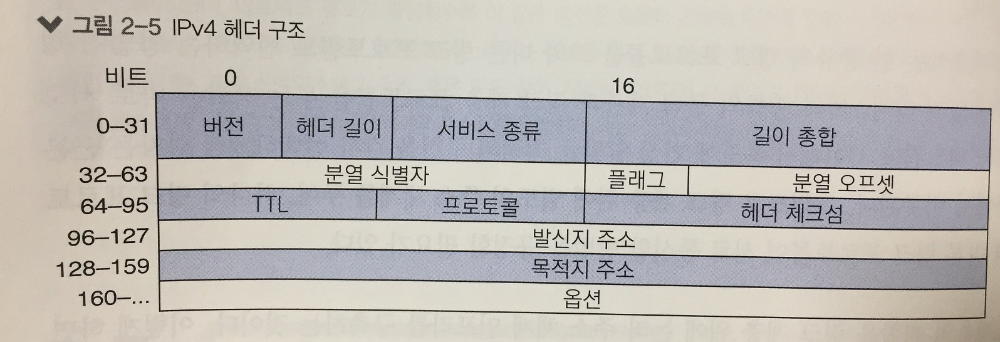

  * 버전(4비트) : 이 패킷이 지원하는 IP 종류를 표시. 
    * Ipv4라면 이 숫자는 4가 된다.
  * 헤더길이(4비트) : 헤더의 길이를 32비트 워드로 표시.
    * IP 헤더 뒷부분에 옵션 필드가 여럿 붙을 수 있으므로 헤더의 길이는 가변적
    * 길이 필드에 정확히 어디서 헤더가 끝나고 이어 포장된 실제 데이터가 시작되는지 나타내주어야 한다.
  * 서비스 종류(8비트) : 혼잡 제어나 서비스 식별자 등 다양한 용도로 사용.
  * 패킷 길이(16비트) : 전체 패킷의 길이를 바이트 단위로 표시
    * 길이는 헤더와 페이로드를 더한 것.
    * 16비트로 나타낼 수 있는 최대 숫자 65535(바이트)가 최대 패킷의 길이.
    * IP 헤더의 최소 길이는 20바이트이므로 Ipv4 패킷에서 페이로드가 담을 수 있는 최대 길이는 65515 바이트
  * 분열 식별자(16비트), 분열 플래그(3비트), 분열 오프셋(13비트) : 분열된, 즉 조각난 패킷을 다시 조립하는데 사용
  * TTL(time to live)(8비트) : 패킷을 전달할 수 있는 횟수 제한
  * 프로토콜(8비트) : 페이로드 내용을 해석하는 데 어떤 프로토콜을 써야 하는지 나타낸다.
    * 윗단 계층이 데이터를 어떻게 다루는지 나타낸다는 점에서 이더넷 프레임의 이더필드와 비슷
  * 헤더 체크섬(16비트) : IPv4 헤더의 무결성을 검증하는데 사용하는 체크섬을 기록.
    * 헤더 부분만 계산해 둔 것임에 유의
    * 페이로드의 무결성을 검증하는 것은 윗단 계층의 몫
    * 링크 계층 프로토콜에서 이미 체크섬으로 프레임 전체의 무결성 검사를 하는 경우(예를 들어 이더넷헤더의 FCS 필드)가 많기 때문에 불필요한 편.
  * 발신지 주소(32비트), 목적지 주소(32비트) : 패킷 발신지와 목적지의 IP 주소
    * 목적지의 경우 특수 주소값을 쓰면 여러 호스트로 동시에 패킷을 보낼 수 있다.

#### 직접 라우팅과 주소 결정 프로토콜(ARP)

* 서로 다른 링크 계층 프로토콜로 연결된 네트워크 사이에 IPv4로 어떻게 패킷을 전달하는지 이해하려면, 먼저 단일 링크 계층 프로토콜의 단일 네트워크에서 패킷이 전달되는 방식부터 이해해야한다.

* IPv4 프로토콜은 IP 주소로 패킷의 목적지를 지정.

* 링크 계층이 패킷을 전달하게 하려면 먼저 IP 주소를 링크 계층이 이해할 수 있는 주소 형태로 바꿔 프레임에 포함해주어야 한다.

* IP주소는 링크 계층이 아닌 네트워크 계층의 개념이기 때문에 IP 주소만으로는 이더넷 모듈을 통해 패킷을 전달할 수 없다.

* 링크 계층은 IP 주소를 이에 대응하는 MAC 주소로 변환하기 위해 주소 결정 프로토콜(address resolution protocol. ARP)를 사용한다.

  * ARP는 기술적으로는 링크 계층 주소를 직접 사용하는 링크 계층 프로토콜로서 네트워크 계층이 제공하는 라우팅을 필요로하지 않는다. 
  * 그렇지만 IP주소를 포함하는 등 네트워크 계층의 추상화를 침범하는 부분이 있으므로 전적으로 링크 계층 프로토콜로만 보기보다는 두 계층 사이의 다리 역할을 한다고 이해하면 좋다.

* ARP 구성

  1. NIC가 어느 MAC 주소에 대응되는지 질의하는 패킷 구조

  2. 짝을 이루는 여러 NIC와 MAC 주소 쌍을 정리해둔 표

     | IP Address | MAC Address       |
     | ---------- | ----------------- |
     | 18.19.0.1  | 01:01:01:00:00:10 |
     | 18.19.0.3  | 01:01:01:00:00:30 |

#####  ARP 절차

1. IP를 구현한 모듈이 링크 계층을 거쳐 어떤 호스트에 패킷을 보내고자 할 때, 먼저 수신자의 IP 주소에 대응하는 MAC 주소를 ARP 테이블에서 찾아본다.

2. 테이블에서 MAC 주소를 찾았다면 IP 모듈은 해당 MAC 주소를 포함한 링크 계층 프레임을 만들어 이를 링크 계층 모듈에 전달하여 발신한다.

3. 테이블에서 찾지 못한 경우 ARP 모듈이 링크 계층 네트워크에서 도달 가능한 모든 호스트에 아래와 같은 구조의 ARP 패킷을 발신하여 올바른 MAC 주소를 찾고자 시도하게 된다.

   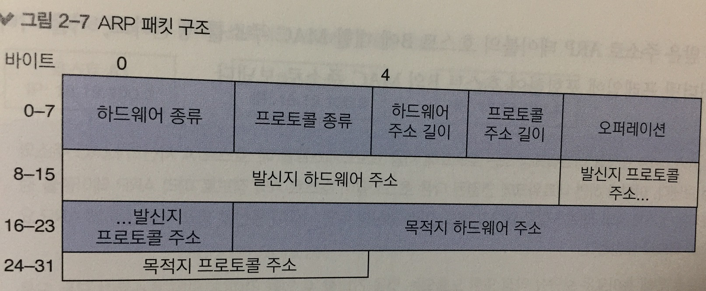

   * 하드웨어 종류(16비트) : 링크 계층이 호스트된 하드웨어 종류를 정의
     * 이더넷의 경우 1
   * 프로토콜 종류(16비트) : 네트워크 계층 프로토콜의 이더타입 값과 일치
     * IPv4라면 0x0800
   * 하드웨어 주소 길이(8비트) : 링크 계층 하드웨어 주소의 길이를 바이트로 나타냄
     * 대부분의 경우 MAC 주소는 6바이트
   * 프로토콜 주소 길이(8비트) : 네트워크 계층 논리 주소의 바이트 길이
     * IPv4의 IP 주소 길이는 4바이트
   * 오퍼레이션(16비트) : 1 또는 2의 값. 이 패킷이 정보 요청인지(1) 아니면 응답인지(2)를 지정
   * 발신지 하드웨어 주소(가변길이), 발신지 프로토콜 주소(가변길이) : 각각 패킷 발신지의 하드웨어 주소 및 네트워크 계층 주소를 나타냄
     * 이들 주소의 길이는 패킷 앞부분에 명시된 길이 필드와 일치해야한다.
   * 목적지 하드웨어 주소(가변길이), 목적지 프로토콜 주소(가변길이) : 각각 패킷 목적지의 하드웨어 주소 및 네트워크 계층 주소를 나타냄
     * 주소 질의를 요청하는 경우 목적지 하드웨어 주소는 알수 없는 상태이므로 패킷을 받는 측에선 이 내용을 무시함

4. 3번의 과정을 세분화

   1. 호스트 A가 B의 MAC 주소를 모르는 경우 ARP 요청 패킷을 만드는데, 오퍼레이션 필드는 1로, 발신지 프로토콜 주소 필드는 18.19.0.1로 발신지 하드웨어 필드는 01:01:01:00:00:10, 목적지 프로토콜 주소 필드는 18.19.0.2로 각각 설정
   2. 이 패킷을 이더넷 프레임에 감싸 이더넷 브로드캐스트 주소 FF:FF:FF:FF:FF:FF로 발신
      * 브로드캐스트 주소를 사용하면 네트워크 상 모든 호스트가 이 프레임을 받아 살펴보게된다.
   3. 호스트 C는 패킷을 받아도 응답하지 않는다.
      * IP 주소가 패킷상 목적지 프로토콜의 주소와 다르기 때문
   4. 호스트 B는 IP가 일치하므로 자신의 ARP 패킷을 하나 만들어 응답
      * 자기 주소를 발신지로, 호스트 A의 주소를 목적지로
   5. 호스트 A가 패킷을 받으면 새로 받은 주소로 ARP 테이블의 호스트 B에 대한 MAC 주소를 갱신
   6. 이를 기다리던 IP 패킷을 이더넷 프레임에 포함하여 호스트 B의 MAC 주소로 전송

   * Note
     * 호스트 A가 ARP 요청을 네트워크상 모든 호스트에 처음 브로드캐스트할 때, 호스트 A 자신의 MAC주소와 IP 주소를 포함해서 보낸다.
     * 이렇게 하면 네트워크에 연결된 다른 호스트들이 호스트 A의 정보로 미리 ARP 테이블을 갱신해둘 수 있다. 
     * 아직은 호스트 A의 정보가 필요 없다고 해도, 미리 갱신해두면 나중에 통신할 필요가 생겼을 떄 ARP 요청부터 보내지 않아도 되므로 요긴하다.
     * 악성 호스트가 모든 IP를 자기 것인양 조작한 ARP 패킷을 뿌릴 수 있다.
     * ARP 정보가 검증된 것인지 확인할 방도가 없다면 스위치 장비가 의도치 않게 모든 패킷을 악성 호스트에 전달해 바치는 결과가 나타날 수 있다.
     * 패킷을 훔쳐보는데 그치지 않고 전달되어야 할 패킷이 전달되지 못하여 네트워크 전체의 트래픽이 혼란에 빠지게 될 수 있다.

#### 서브넷과 간접 라우팅

* 두개의 큰 회사(알파와 브라보)가 있다고 가정 (각각 100대의 호스트를 가지고 있음)

  * 각 회사는 대규모 내부망을 구축
  * 양 사의 네트워크를 서로 연결하여 메시지를 주고 받고자 함
  * 이더넷 케이블을 링크 계층 네트워크에 연결하는 경우
    * 이더넷 패킷은 네트워크상 모든 호스트를 거쳐야 함
    * 기존의 100대의 호스트에 전달되던 이더넷 환경에서 다른 회사의 네트워크에 연결되면 200대의 호스트로 전달됨. (트래픽 두배 증가)
    * 특정 호스트에만 전달되면 될 패킷이 전체 호스트에 전달되므로 보안상으로도 문제가 있음.
  * 링크 계층 수준에서 직접 연결되지 않은 호스트 사이에서도 서로 패킷을 주고받을 수 있게 네트워크 계층에서 라우팅할 필요가 있음.

* 두 회사의 네트워크 계층 연결

  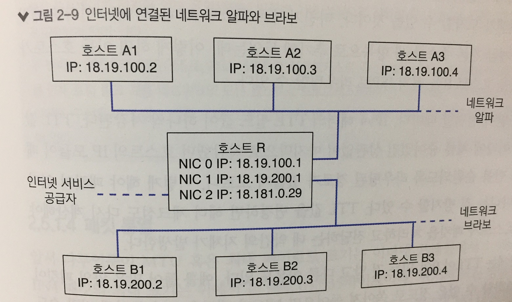

  * 호스트 R은 라우터라 불리는 특수 형태의 호스트
  * 라우터 한대에 NIC가 여러개 장착됨
  * 각 NIC마다 고유 IP 주소가 배정
  * 네트워크 알파의 모든 IP 주소의 공통 접두사는 18.19.100
  * 네트워크 브라보의 모든 IP 주소의 공통 접두사는 18.19.200
  * 서브넷 마스크(subnet mask)는 32비트 숫자로서, IP 주소와 동일하게 숫자 네 개를 마침표로 구분
    * 어느 두 호스트의 IP주소를 각각 서브넷 마스크와 비트 AND 연산하여 그 결과가 같으면 두 호스트는 같은 서브넷에 속함.
    * 브로드캐스트 주소는 네트워크 주소상 서브넷 마스크 영역 외의 비트를 모두 1로 한값.
      * 18.19.100.1의 서브넷이 255.255.255.0이라면 가용 비트는 맨 뒷자리 8비트이므로 8비트가 모두 1이되면 255가 됨.
      * 즉, 18.19.100.255가 브로드캐스트 주소가 된다.
  * CIDR(classless inter-domain routing) 표기법
    * 서브넷 마스크를 이진수로 쓰면 1이 n개 나온 뒤 0이 (32-n)개 붙는 형식
      * 255.255.255.0이면 1이 24개, 0이 8개.
      * 32-24(1개수) = 8(0개수)
    * 서브넷을 표기할 때 먼저 네트워크 주소를 쓰고 슬래시(/)로 구분한 뒤 서브넷 마스크의 1인 비트 개수를 적는 식
    * 위 예제의 IP주소를 CIDR로 표기하면 1의 개수가 24개이므로 18.19.100.0/24 

* 각 호스트의 IP 모듈은 라우팅 테이블을 보유하여 서브넷 간 패킷 전달에 이용

  * 원격 호스트에 IP 패킷을 보내도록 어떤 호스트의 IPv4 모듈에 요청하면 먼저 IP 모듈은 ARP 테이블을 써서 직접 라우팅할지, 아니면 간접 라우팅할지부터 결정해야 한다.

  * 이를 위해 라우팅 테이블을 참조

  * 라우팅 테이블엔 도달 가능한 목적지 서브넷마다 패킷을 어떻게 전달할지에 대한 정보가 한 줄씩 기록되어있다.

    * 호스트 A1의 라우팅 테이블

      | 행 번호 | 목적지 서브넷        | 게이트웨이       | NIC                |
      | ---- | -------------- | ----------- | ------------------ |
      | 1    | 18.19.100.0/24 |             | NIC 0(18.19.100.2) |
      | 2    | 18.19.200.0/24 | 18.19.100.1 | NIC 0(18.19.100.2) |

    * 호스트 B1의 라우팅 테이블

      | 행 번호 | 목적지 서브넷        | 게이트웨이       | NIC                |
      | ---- | -------------- | ----------- | ------------------ |
      | 1    | 18.19.200.0/24 |             | NIC 0(18.19.200.2) |
      | 2    | 18.19.100.0/24 | 18.19.100.1 | NIC 0(18.19.200.2) |

    * 호스트 R의 라우팅 테이블

      | 행 번호 | 목적지 서브넷        | 게이트웨이       | NIC                |
      | ---- | -------------- | ----------- | ------------------ |
      | 1    | 18.19.100.0/24 |             | NIC 0(18.19.100.1) |
      | 2    | 18.19.200.0/24 | 18.19.100.1 | NIC 1(18.19.200.1) |

  * 목적지 서브넷 열은 대상 IP 주소가 포함된 서브넷을 가리킴

  * 게이트웨이 열은 다른 서브넷의 링크 계층으로 패킷을 전달하기 위해 거쳐야할 현재 서브넷상 다음 호스트의 IP 주소를 가리킴

  * 게이트웨이 호스트는 직접 라우팅으로 도달 가능해야 한다.

    * 게이트웨이 란이 비어있으면 목적지 서브넷 전체가 직접 라우팅으로 도달 가능하다는 뜻으로 링크 계층으로 직접 래킷을 보낼 수 있다.

  * NIC 열은 패킷을 전달하는 데 사용할 NIC가 어느 것인지 가리킴

* 18.19.100.2에 위치한 호스트 A1이 패킷 18.19.200.2의 호스트 B1에 전달할 때 다음 과정을 거친다.

  1. 호스트 A1이 발신자 주소 18.19.100.2, 수신자 주소 18.19.200.2로 IP 패킷을 만든다.
  2. 호스트 A1의 IP 모듈은 라우팅 테이블을 한 줄씩 위에서 아래로 훑어가다 IP 주소 18.19.200.2를 포함하는 목적지 서브넷 항목 중 첫번째 것을 찾는다.
     * 위 표에서 두번째 행이 찾아짐
  3. 제 2행에 등록된 게이트웨이 주소는 18.19.100.1이다.
     * 호스트 A1은 ARP와 이더넷 모듈을 이용해 패킷을 이더넷 프레임으로 꾸려 18.19.100.1에 해당하는 MAC 주소를 가진 호스트로 발신한다.
     * 이 패킷은 곧 호스트 R에 도착
  4. 호스트 R의 NIC 0번, 곧 IP 주소가 18.19.100.1인 이더넷 모듈은 프레임을 받아 그 페이로드가 IP 패킷임을 감지하고 IP 모듈에 올려보낸다.
  5. 호스트 R의 IP모듈은 패킷 주소가 18.19.200.2인 것을 확인하고 해당 IP로 패킷 전달을 시도한다.
  6. 호스트 R의 IP 모듈은 18.19.200.2를 포함하는 서브넷 항목을 라우팅 테이블에서 찾는다.
     * 위 표에서 2행에 해당.
  7. 2행엔 게이트웨이가 없으므로 이 서브넷은 직접 도달 가능
     * NIC 칼럼이 IP주소 18.19.200.1인 NIC 1을 가리킴
     * 이 NIC는 예시로 들었던 네트워크 브라보에 연결되어 있음.
  8. 호스트 R의 IP 모듈은 NIC 1에서 구동 중인 이더넷 모듈에 패킷을 넘겨준다. 
     * IP 모듈은 ARP와 이더넷 모듈을 이용해 패킷을 이더넷 프레임으로 꾸려 IP 주소 18.19.200.2에 해당하는 MAC 주소를 가진 호스트로 발신
  9. 호스트 B1의 이더넷 모듈이 프레임을 받아 그 페이로드가 IP 패킷임을 감지하고 IP 모듈에 올려보낸다.
  10. 호스트 B1의 IP 모듈은 수신자 IP 주소가 자기 것임을 확인
    * 상위 계층에서 계속 처리할 수 있게 페이로드의 내용을 윗단 계층으로 올려보낸다.

* 내부 네트워크에서 인터넷으로 패킷을 보내려면 어떻게 해야 할까?

  * 인터넷 서비스 공급자(internet service provider, ISP)로부터 공인 IP와 게이트웨이를 제공받아야 한다.

  * ISP로부터 18.181.0.29, 게이트웨이 18.181.0.1을 제공 받았다고 가정

    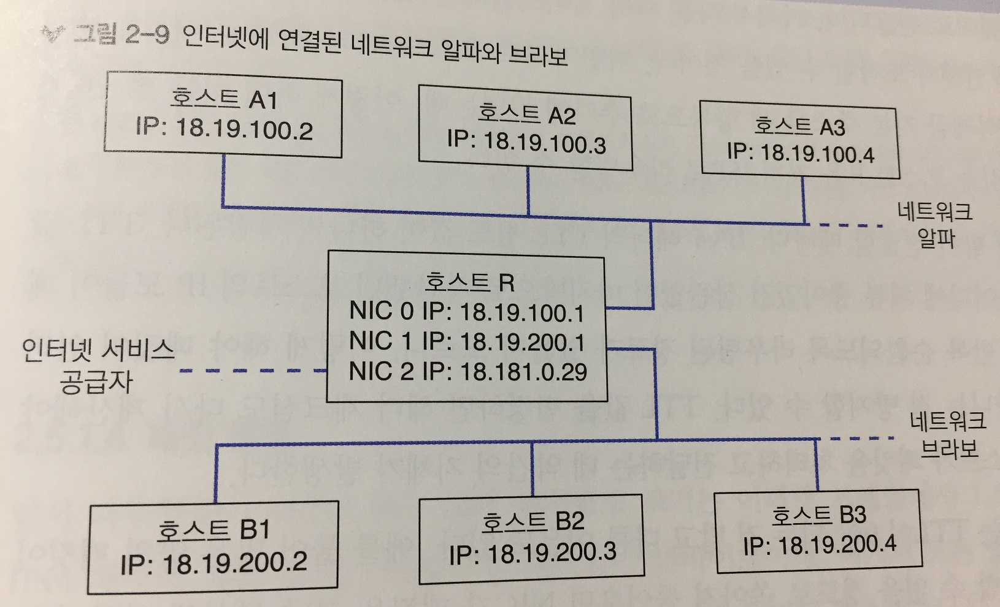

    - 인터넷 접근이 가능한 호스트 A1의 라우팅 테이블

      | 행 번호 | 목적지 서브넷        | 게이트웨이       | NIC                |
      | ---- | -------------- | ----------- | ------------------ |
      | 1    | 18.19.100.0/24 |             | NIC 0(18.19.100.2) |
      | 2    | 18.19.200.0/24 | 18.19.100.1 | NIC 0(18.19.100.2) |
      | 3    | 0.0.0.0/0      | 18.19.100.1 | NIC 0(18.19.100.2) |

    - 인터넷 접근이 가능한 호스트 B1의 라우팅 테이블

      | 행 번호 | 목적지 서브넷        | 게이트웨이       | NIC                |
      | ---- | -------------- | ----------- | ------------------ |
      | 1    | 18.19.200.0/24 |             | NIC 0(18.19.200.2) |
      | 2    | 18.19.100.0/24 | 18.19.200.1 | NIC 0(18.19.200.2) |
      | 3    | 0.0.0.0/0      | 18.19.200.1 | NIC 0(18.19.200.2) |

    - 인터넷 접근이 가능한 호스트 R의 라우팅 테이블

      | 행 번호 | 목적지 서브넷        | 게이트웨이       | NIC                |
      | ---- | -------------- | ----------- | ------------------ |
      | 1    | 18.19.100.0/24 |             | NIC 0(18.19.100.1) |
      | 2    | 18.19.200.0/24 | 18.19.100.1 | NIC 1(18.19.200.1) |
      | 3    | 18.181.0.0./24 | 18.181.0.1  | NIC 2(18.181.0.29) |
      | 4    | 0.0.0.0/0      | 18.181.0.1  | NIC 2(18.181.0.29) |

  * 목적지 서브넷 주소 0.0.0.0/0은 기본 주소(default address)라 하는데, 모든 IP가 이 서브넷에 포함되기 때문

    * 호스트 R이 패킷을 받았는데 그 대상 주소가 1~3열 어느것에도 해당하지 않는 경우라면 마지막의 기본 주소에는 항상 대응이 된다.
    * 해당 패킷은 새로 장착한 NIC를 거쳐 ISP의 게이트웨이로 전달되며, 거기서 다른 여러 게이트웨이를 잇는 경로를 거쳐 패킷이 원래 의도한 목적지에 언젠가 도착할 수 있을 것이다.
    * 호스트 A1과 B1에도 인터넷 패킷을 호스트 R로 전달하게끔 기본 주소를 새 항목으로 추가해두었기 떄문에 인터넷용 패킷을 호스트 R을 거쳐 ISP로 라우팅할 수 있다.

* 게이트웨이가 패킷을 받아 전달할 때마다 IPv4 헤더의 TTL 필드 값이 하나씩 차감된다.

  * TTL 값이 0이되면 패킷이 어디에 체류 중이었건 상관 없이 마지막으로 차감했던 호스트의 IP 모듈이 패킷을 폐기한다.
  * 반복 순환되도록 라우팅된 경로가 있으면 해당 패킷이 영원히 인터넷을 떠돌아다니게 되기 때문에 이를 방지하기 위해서 TTL이 필요하다.
  * TTL 값을 변경하면 헤더 체크섬도 다시 계산해야하는데, 이 때문에 호스트가 패킷을 처리하고 전달하는데 약간의 지체가 발생한다.

* TTL이 0이 되는 것 외에도 패킷이 누락되는 경우가 있다.

  * 많은 양의 패킷이 라우터의 NIC에 소화할 수 없을 정도로 쏟아져 들어오면 NIC가 패킷을 그냥 무시해버릴 수도 있다.
  * NIC가 여러 개 장착된 라우터에 패킷이 들어오는데 NIC 중 하나가 이들 패킷 전부를 외부로 전달하여야 하는 경우, 그 NIC가 처리를 감당할 수 있을 정도로 빠르지 않다면 패킷 중 일부가 누락될 수 있다.

* 여러가지 누락될 수 있는 경우로 인해 IPv4를 포함하여 네트워크 계층의 모든 프로토콜은 비신뢰성 프로토콜로 취급한다.

  * 패킷이 도착한다 해도 원래 보낸 순서대로 도착한다는 보장도 없고, 단 한번만 전달된다는 보장도 없다. 
  * 네트워크가 혼잡하다보면 라우터가 패킷 하나는 이쪽 경로로 라우팅하고 같은 목적지의 다른 패킷은 다른 쪽 경로로 라우팅할 수 있다.
    * 경로는 저마다 길이가 다를 것이고 그러다 보니 나중에 보낸 패킷이 먼저 도착할 수도 있다.
  * 어떤 경우엔 패킷이 여러 경로로 동시에 전달될 수도 있는데, 그 중 하나가 먼저 도착하고 나머지가 또 다시 도착하는 경우도 생긴다.

##### 중요 IP 주소

* 127.0.0.1
  * 루프백(loopback) 또는 로컬 호스트 주소(localhost address)
  * 패킷을 127.0.0.1로 보내려하면 IP 모듈은 외부로 패킷을 보내지 않는다.
  * 대신 이 패킷을 고스란히 다시 받은 것처럼 만들어 윗단 계층이 처리하게 올려보낸다.
* 255.255.255.255
  * 제로 네트워크 브로드캐스트 주소(zero network broadcast address)
  * 패킷을 현재 로컬 링크 계층 네트워크의 모든 호스트로 브로드캐스트하지만, 라우터를 거쳐 외부로 나가지는 못하게 한다.

#### 패킷 분열

* MTU 혹은 최대 페이로드 크기는 이더넷 프레임에서 1500바이트

* IPv4 패킷의 최대 크기는 65535 바이트

* IP 패킷을 하단 링크 계층 프레임으로 감싸서 보내야 한다면 어떻게 링크 계층의 MTU 보다도 큰 패킷을 처리할 수 있을까?

  * 답은 바로 패킷을 분열하는 것(fragmentation)
  * IP 모듈이 목표 링크 계층의 MTU보다 큰 패킷을 송신해야 할 때, IP 모듈은 패킷을 MTU 크기의 여러 조각으로 패킷을 분열한다.
  * 분열된 IP 패킷은 보통의 IP 패킷과 외견상 차이가 없지만 헤더의 몇몇 필드에 특정 값이 지정된다.
    * 분열 식별자 필드 (16비트) : 분열된 조각이 원래 어느 패킷에 있었는지 나타내는 숫자
      * 한 패킷에서 쪼개져 나온 모든 조각은 이 필드의 값이 같다.
    * 분열 플래그 필드 (13비트) : 오프셋을 8바이트 블록 단위로 나타내며, 원래 패킷의 시작 지점부터 따졌을 때 이 조각의 위치를 가리킨다.
      * 각 조각의 숫자는 서로 모두 달라야 한다.
      * 13비트로 65535바이트까지 오프셋을 가리킬 수 있어야 하므로 8바이트 블록 단위로 표기
      * 항상 8로 곱해서 사용해야 하며, 8의 배수가 아닌 값은 오프셋으로 지정할 수 없다.
      * 0x02로 지정하면 DF(don't fragment), 즉 분열 금지 플래그가 된다.
        * 패킷 크기보다 MTU 크기가 작은 링크로 패킷을 전달하려 하면 IP 모듈은 DF 플래그가 설정된 패킷의 경우 분열하는 대신 그냥 걸러버린다.
    * 분열 오프셋 필드 (3비트) : MF 플래그(more fragments flag)
      * 아직 남은 조각이 더 있다는 의미
      * 이 플래그가 켜진 패킷을 받은 호스트는 남아있는 다른 조각을 모두 받을 때까지 처리를 미뤄두었다가 다 받은 후에서야 패킷을 다시 조립해 윗단 계층으로 넘겨야 한다.
      * 마지막 조각의 플래그는 항상 꺼져 있어야 한다. 그래야 원래 패킷에 더이상 남은 조각이 없다는 걸 수신측에 알려줄 수 있다.
  * IP 모듈이 IP 패킷을 여러 조각으로 쪼갤 때, 쪼갠 조각마다 패킷을 만들고 필드 값을 적절히 채워 넣는다.

* IPv4 패킷의 분열 예제

  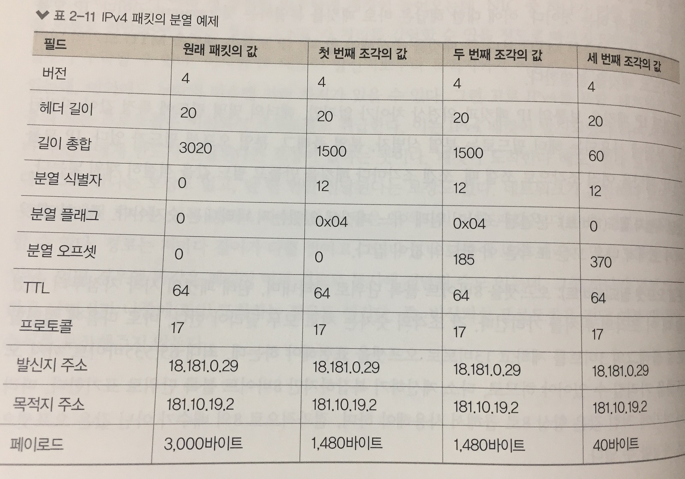

  * 분열 식별자 필드 값은 모두 12로 세 조각이 모두 같은 패킷에서 비롯되었음을 나타냄
  * 첫 번째 조각에 MF 플래그가 설정되어 있고 분열 오프셋은 0으로 원래 패킷 첫 부분의 데이터임을 나타냄
    * 이 때 패킷의 필드 값이 1500
    * 대개 IP 모듈은 조각 수를 줄이기 위해 조각을 나눌 때 가능한 한 크게 나눈다.
  * IP 헤더가 20바이트 이므로 조각 데이터에 총 1480바이트를 담을 수 있다.
    * 다음 조각 데이터의 오프셋이 1480에서 시작해야 함
    * 분열 오프셋 필드는 8바이트 블록 단위로 기재해야 하므로 1480 나누기 8 값이 기재된다. 즉, 185
  * 마지막 세번째 조각은 MF 플래그가 꺼져 있어 이것이 마지막 조각임을 나타냄
  * 원래 패킷에서 헤더를 제외한 데이터 길이는 3000바이트
    * 이를 쪼개면 첫번째 조각이 1480바이트
    * 두번째도 1480바이트
    * 세번째 조각에는 남은 데이터가 40바이트
    * 40바이트에 헤더 20바이트를 붙이면 60바이트가 된다.

* 수신자가 패킷을 올바르게 처리하려면 패킷 조각 하나하나가 최종 호스트까지 전달되어 원래의 쪼개기 전 패킷으로 재조립되어야 한다.

  * 패킷 조각을 받으면 수신자 IP 모듈은 64KB(IP 패킷의 최대 크기) 버퍼를 만들고 조각의 데이터를 버퍼상 정확한 오프셋 위치에 복사해 넣는다.
  * 버퍼에는 발신자 IP 주소와 분열 식별자 번호를 붙여두어 이 후 추가로 패킷 조각을 받게 되면 조각의 발신자와 식별자를 토대로 해당하는 버퍼를 끄집어내어 새로 받은 데이터를 복사해 나간다.
  * MF 플래그가 꺼져 있는 조각을 받으면 원래 패킷의 길이를 계산할 수 있는데, 조각의 길이에 조각의 오프셋을 더하면 된다. 
  * 패킷 하나를 온전히 조립해내도록 모든 데이터 조각을 받으면 IP 모듈은 조립된 패킷을 윗단 계층에 넘겨 계속 처리한다.

* IP 패킷 분열의 비효율적인 면

  1. 네트워크로 실제 보내는 데이터양이 증가한다.
     * 헤더 정보 20바이트가 조각마다 더해지므로 적은 양이지만 누적되면 부담이 될 수 있다.
  2. 조각 중 하나라도 잃어버리면 다른 조각 전체를 몽땅 버려야 한다.
     * 대개의 경우 분열 기능 자체를 쓰지 않는 것이 좋다.
     * 대신에 IP 패킷의 크기를 링크 계층 MTU보다 작게 잡는 편이 낫다.
     * MTU 최대 크기은 1500바이트를 조각에서 전부 IP 페이로드에 쓸 수는 없다.
       * 20바이트는 IP 헤더
       * VPN이나 IPSec 등 여타 프로토콜이 필요로하는 데이터와 나눠써야 한다.
       * IP 페이로드는 1300바이트 내외로 잡아야 안전하다.

#### IPv6

* IPv4는 32비트 주소 체계로 약 42억개의 고유 IP 주소를 배당할 수 있다.

  * 사설망과 네트워크 주소 변환 덕에 이보다 조금 더 많은 수의 호스트를 인터넷에 연결할 수 있음

* 이미 32비트 고유 IP 주소는 고갈된지 오래됨

* 주소 고갈 문제 및 비효율성 해소를 위해 IPv6가 고안되었다.

* IPv6는 IP 주소의 길이가 128비트

  * 여덟 묶음의 네 글자 16진수로 표현

  * 묶음마다 콜론으로 구분

    | 형식                      | 주소                                      |
    | ----------------------- | --------------------------------------- |
    | 줄여 쓰지 않음                | 2001:4a60:0000:08f1:0000:0000:0000:1013 |
    | 각 묶음(hexlet)의 앞자리 0을 생략 | 2001:4a60:0:08f1:0:0:0:1013             |
    | 연달아 나오는 0 묶음을 생략        | 2001:4a60:0:8f1::1013                   |

    * 각 16진수 묶음의 앞자리 0은 생략 가능
    * 0만 있는 묶음은 통째로 생략해 콜론 두 개로 사용 가능
    * 주소가 항상 16바이트이므로 빠진 숫자에 0을 채워넣으면 원래 모양으로 돌려놓을 수 있다.

  * 첫 64비트는 보통 네트워크를 나타내며 네트워크 접두사(network prefix)라 한다.

  * 나머지 64비트는 개별 호스트를 나타내어 인터페이스 식별자(interface identifier)라 한다.

  * 고정 IP를 사용하려는 경우 인터페이스 식별자를 수동으로 지정해주면 된다.

  * 동적 IP를 사용하려는 경우 식별자를 그때그때 랜덤 생성.

    * 가장 보편적으로 NIC의 EUI-64와 같은 값으로 둔다.
    * EUI-64가 이미 고유한 값으로 보장되기 떄문
    * EUI(Extended Unique Identifier) : IEEE 표준으로써 링크 계층 상에서 유일 식별성을 갖추기 위한 주소 형식

  * 기존 ARP에서 하던 역할은 IPv6의 NDP(neighbor discovery protocol, 인접 노드 발견 프로토콜)가 대체

    * DHCP의 기능도 일부 포함

  * NDP를 이용해 라우터는 네트워크 접두사와 라우팅 정보를 선전하고, 호스트는 각자의 IP 주소와 링크 계층 주소를 질의하고 공시한다.

  * 라우터 레벨에서는 더이상 패킷 분열을 지원하지 않는다.

    * 이로써 모든 분열 관련 필드를 IP 헤더에서 제거하여 패킷의 대역폭을 절약할 수 있다.
    * 링크 계층 라우터가 받은 IPv6 패킷이 처리하기에 너무 크다면 그 라우터는 패킷을 버리고 발신자에게 패킷이 너무 커서 걸러버렸다고 답한다.
      * 응답을 받은 발신자는 더 작은 패킷을 보내는 것으로 대응.
      * 가장 작은 MTU를 예상을 해서 미리 제약을 두는 것보다는 충분히 큰 것을 보내 본 다음에 너무 크다는 응답이 있을 때만 작게 보내면 되므로 한층 유연하고 효율적.

### 전송 계층

* 네트워크 계층의 역할은 원격 네트워크상 서로 멀리 떨어진 호스트 사이에 통신을 촉진하는 것.

* 전송 계층의 역할은 이들 호스트상 개별 프로세스 사이의 통신을 가능케 하는 것.

  * 호스트 한대에 여러 프로세스가 동시에 구동 가능하므로 호스트 A에서 호스트 B로 IP 패킷을 보냈다라는 것으로는 불충분

* 전송 계층에서는 개별 프로세스로 패킷을 전달하기 위해 포트라는 개념을 도입

* 포트는 16비트 부호 없는 숫자로서 특정 호스트의 통신 종단점을 나타냄

  * IP주소가 거리의 건물 주소라면 포트는 건물 내 입주한 사무실 번호에 비유할 수 있음

* 어떤 프로세스가 특정 포트를 바인딩해 두면 전송 계층 모듈은 이후 그 포트로 전달되는 모든 패킷을 그 프로세스에 전달해 준다.

* 이론상으로는 16비트 내 어떤 포트에든 바인딩하여 자신이 의도하는 어느 용도로든 사용할 수 있다.

  * 같은 호스트의 두 프로세스가 서로 같은 포트에 바인딩 하려 하면 문제가 야기됨
  * 대부분의 운영체제에서 여러 프로세스가 같은 포트에 바인딩하려 할 때 특별한 플래그를 설정해야만 이를 허용
  * 포트를 둘러싼 혼선을 미연에 방지하고자 IANA기구 산하 ICANN 부서에선 포트 번호 등록제를 운영하여 여러 프로토콜과 애플리케이션 개발자가 각자 필요로하는 포트를 등록하여 사용하는 것을 권장한다.
  * 전송 계층 프로토콜 하나당 오로지 하나의 포트만 등록할 수 있다.
  * 포트번호 0~1023까지는 시스템 포트(system port) 또는 예약 포트(reserved port)
    * 사용자 포트와 유사하지만 더 까다롭고 많은 검토 단계를 거쳐야 IANA에 등록할 수 있다.
    * 운영체제에서는 이 포트들을 특별히 취급하여 오직 루트 레벨 프로세스만 시스템 포트에 바인딩할 수 있다.
  * 포트번호 1024~49151까지는 사용자 포트(user port) 또는 등록 포트(registered port)
    * 개발자는 공식적으로 IANA에 이 범위 내 포트 번호를 요청할 수 있다.
    * IANA에서 검토 후 포트 등록을 승인
    * IANA에 다른 프로토콜이나 응용프로그램용으로 이미 등록된 상태라면 사용하지 않는 것이 바람직함.
    * 그렇다고 해서 전송 계층의 구현 수준에서 이를 차단하지는 않음.
    * 예를 들어 mysql이 3306이라는 포트를 사용한다고 해서 응용프로그램 개발자가 3306을 사용하지 못하는 것은 아니지만 IANA에 이미 등록된 포트이므로 가급적 피하는 것이 좋음.
  * 나머지 포트 번호 49152~65535까지는 동적 포트(dynamic port)
    * IANA 관할 밖이며 어느 프로세스가 쓰던 제약이 없다.
    * 동적 포트만 써서 개발하다 나중에 필요한 시점에 IANA에 등록 포트를 요청하는 것이 정석.

* 응용 프로그램이 사용할 포트를 정하면 이후 전송 계층 프로토콜을 통해 실제 데이터를 보낸다.

  | 이름                                       | 약자   | 프로토콜 번호 |
  | ---------------------------------------- | ---- | ------- |
  | 전송 제어 프로토콜(transmission control protocol) | TCP  | 6       |
  | 사용자 데이터그램 프로토콜(user datagram protocol)   | UDP  | 17      |
  | 데이터그램 혼잡 제어 프로토콜(datagram congestion control protocol) | DCCP | 33      |
  | 스트림 제어 전송 프로토콜(stream control transmission protocol) | SCTP | 132     |

  ​

#### UDP (user datagram protocol)

* 경량 프로토콜로서 데이터를 포장하여 호스트의 어떤 포트에서 다른 호스트의 또 어떤 포트로 전달하는데 사용

* UDP 데이터그램은 페이로드 앞에 8바이트 헤더를 붙여서 만든다.

  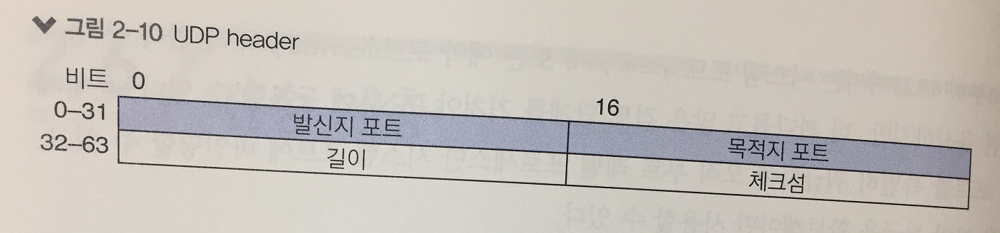

  * 발신자 포트(16비트) : 데이터그램의 출처가 되는 포트 번호를 기재
    * 수신자가 발신자에게 응답하고자 할 때 사용
  * 목적지 포트(16비트) : 데이터그램의 목적지가 되는 포트 번호를 기재
    * UDP 모듈은 이 포트에 바인딩해 둔 프로세스에 데이터그램을 전달
  * 길이(16비트) : UDP 헤더와 페이로드의 합친 길이
  * 체크섬(16비트) : 헤더와 페이로드, 그리고 IP 헤더 몇몇 필드를 엮어 계산한 체크섬 값
    * 필수사항은 아님
    * 계산하지 않을 경우 0으로 채운다.
    * 밑단 계층에서 자체적으로 체크섬을 돌려보므로 이 필드는 잘 쓰지 않는 편

* 각 데이터그램은 자체로 완결된 것으로 두 호스트 간 어떤 공유 상태에도 의존하지 않는다.

  * 일단 패킷을 전송하면 신경쓰지 않아도 된다.
  * 네트워크가 불안정하더라도 트래픽을 제한해 주지않음
  * 데이터를 순서대로 전달해주지 않음
  * 데이터의 전달을 보장해주지 않음

#### TCP (transmission control protocol)

* UDP로 호스트 사이에 불연속적인 데이터그램만 주고받을 수 있다면, TCP로는 양쪽의 호스트 사이에 연결을 계속 유지한 채로 **신뢰성 있게** 데이터의 스트림을 주고 받을 수 있다.

* TCP는 의도된 수신자에게 모든 데이터를 순서대로 전달하려 최선을 다한다.

  * 이를 위해 UDP에 비해 큰 헤더가 필요
  * 연결된 호스트마다 간단치 않은 연결 상태 추적 메커니즘이 동작함
  * 수신자는 데이터를 받았는지 여부를 발신자에게 ACK(acknowledgment) 할수 있다.
  * 발신자는 ACK가 없는 부분의 데이터를 다시 보낼 수 있다.

* TCP의 데이터 전송 단위를 일컬어 TCP 세그먼트라 한다.

  * "마디"라는 의미에서 유추할 수 있듯이 TCP는 긴 스트림 데이터를 보내는 용도로 설계됨

  * 이 스트림으로 이어진 여러 마디 중 하나를 잘라 하위 계층의 패킷으로 포장한 것이 세그먼트

  * TCP 헤더가 먼저 오고 그 다음에 세그먼트 데이터가 이어진다.

* 아래 그림은 TCP 헤더를 나타냄

  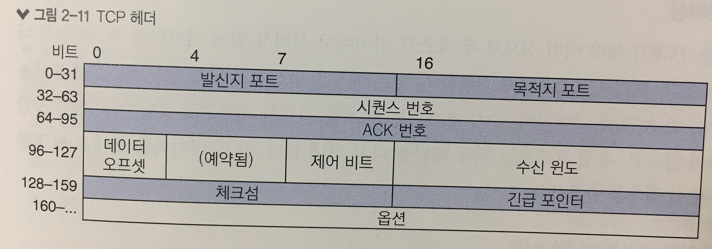

  * 발신지 포트(16비트), 목적지 포트(16비트) : 전송 계층 포트 번호
  * 시퀀스 번호(32비트) : 단조 증가하는 식별 번호
    * 개념상 TCP로 보내는 각 세그먼트마다 시퀀스 번호가 식별자로 부여됨
    * 발신자와 수신자는 데이터 전송 중도에 답신을 위한 표식으로 이 번호를 사용
  * ACK 번호(32비트) : 발신자가 응답받기를 기다리는 다음 시퀀스 번호
    * TCP는 데이터를 모두 순서를 지켜 전송하므로 호스트가 매번 기다리는 시퀀스 번호는 그 전에 받은 번호에 항상 1을 더한 값이 된다.
    * 수신자가 ACK 번호를 보내면 그 ACK 번호에 해당하는 시퀀스 뿐만 아니라 그 아래 모든 시퀀스를 받았다는 뜻이므로 주의
  * 데이터 오프셋(4비트) : 헤더의 길이를 32비트 워드로 지정
    * TCP헤더와 데이터 사이에 옵션 헤더를 최대 44바이트까지 사용할 수 있다.
    * 데이터 오프셋은 옵션 헤더가 끝나고 데이터가 시작되는 지점을 가리킴
  * 제어 비트(9비트) : 헤더의 메타 정보 플래그를 포함
  * 수신 윈도(16비트) : 발신자가 데이터 전송에 사용하는 버퍼 용량이 얼마나 남았는지 알려주는 역할
    * 흐름제어에 사용
  * 긴급 포인터(16비트) : 세그먼트 데이터 시작 위치를 기준으로 긴급 데이터의 위치를 나타냄
    * 제어 비트에 URG 플래그가 설정된 경우에만 유용

##### 신뢰성

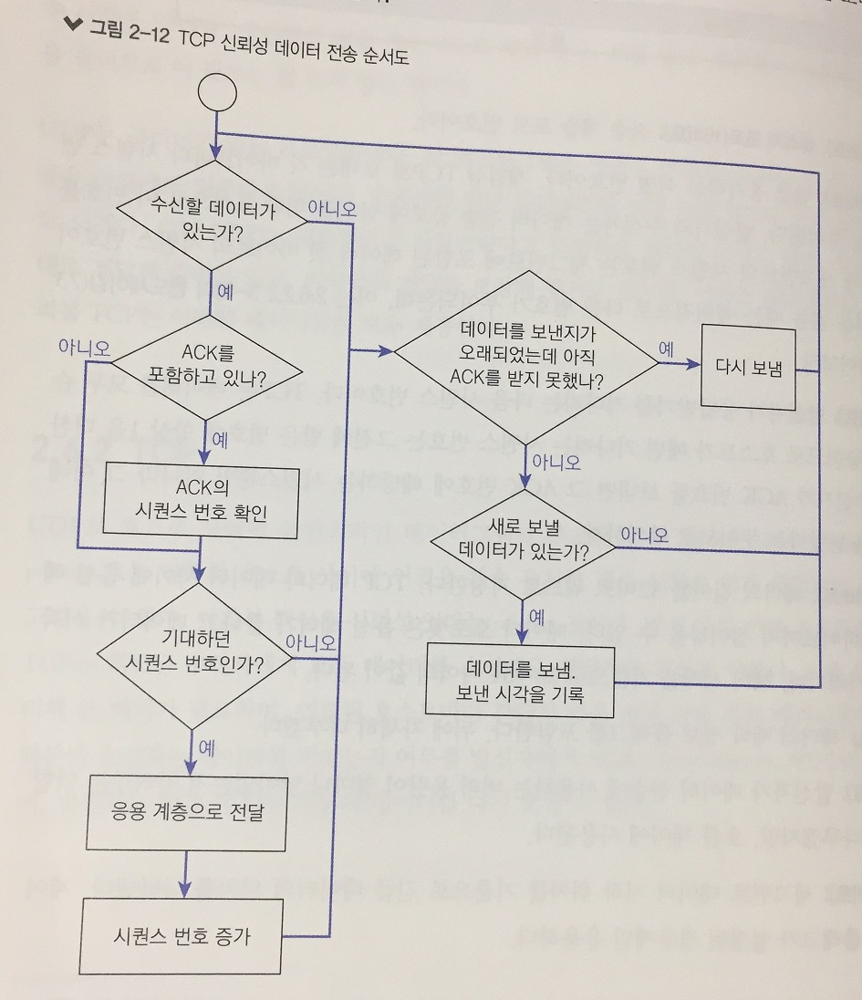

* 고유하게 식별할 수 있는 패킷을 발신 호스트가 수신 호스트에 보내놓고 확인응답(ACK)을 기다리며, 수신 호스트는 ACK를 기재한 패킷으로 응답

* 한참동안 ACK가 오지 않으면 송신 호스트는 원래 패킷을 다시 보내본다. 

* 모든 데이터를 보내고 ACK를 받을 때까지 이 절차를 반복

* TCP가 신뢰성 전달을 하기 위해 채택한 구현 전략에서는 시퀀스 번호 추적과 데이터 재전송이 필요하므로 각 호스트는 열려 있는 모든 TCP 연결에 대해 상태 변수를 유지해야한다.

* RFC793에 정의된 주요 상태 변수와 표준 약칭

  | 변수        | 약자      | 정의                                       |
  | --------- | ------- | ---------------------------------------- |
  | 송신 다음 번호  | SND.NXT | 호스트가 보낼 다음 세그먼트의 시퀀스 번호                  |
  | 송신 미확인 번호 | SND.UNA | 아직 ACK를 받지 않은 데이터의 가장 앞 시퀀스 번호           |
  | 송신 윈도     | SND.WND | 호스트가 보낼 수 있는 데이터의 현재 용량(미확인 데이터에 대해 ACK를 받으면 최대 용량으로 리셋) |
  | 수신 다음 번호  | RCV.NXT | 호스트가 받을 것으로 예측되는 시퀀스 번호                  |
  | 수신 윈도     | RCV.WND | 호스트가 받을 수 있는 데이터의 현재 용량(수신 버퍼를 초과하지 않도록) |

##### 3-웨이 핸드셰이킹

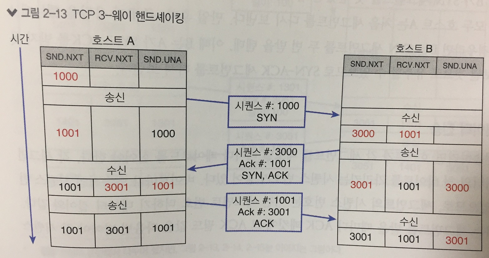

* 호스트 A가 첫 번쨰 세그먼트를 보내 연결을 시작

  * 이 세그먼트에는 SYN 플래그가 설정되어 있고 초기 시퀀스 번호를 1000으로 지정
  * 이는 호스트 A가 앞으로 시퀀스 번호 1000부터 시작하는 TCP 연결을 시작했다는 것을 호스트 B에게 인지시켜줌
  * 호스트 B는 이에 따라 연결 상태 유지에 필요한 자원을 할당해야 한다.

* 호스트 B가 연결을 받아줄 수 있는 상황이면 SYN 플래그와 ACK 플래그 둘 다 켜진 패킷으로 응답

  * 이 때 응답 패킷의 ACK 번호는 호스트 A가 처음 보내준 시퀀스 번호 더하기 1
  * 1000번 세그먼트는 잘 받았으니 이제 그 뒤의 세그먼트를 기다리겠다는 의미

* 호스트 B가 A로 보내는 스트림의 첫 번째 시퀀스 번호(위 예에서는 3000)는 호스트 B가 임의로 선택

* 호스트 A와 B 사이의 연결에 두 개의 스트림이 한 쌍으로 존재하게 됨

  * 하나는 A에서 B로, 또 하나는 B에서 A로 가는 스트림
  * 각 스트림의 시퀀스 번호 체계가 서로 다르다는 점을 유념
  * A에서 B로 가는 스트림은 호스트 A가 랜덤으로 지정, B에서 A로 가는 스트림은 호스트 B가 랜덤으로 지정.

* 세그먼트에 SYN 플래그가 켜져 있다는 것은 이제 스트림으로 데이터를 보내기 시작할테니 이 시퀀스 번호 더하기 1을 기준으로 바이트 순서를 매기도록 하라는 의미.

* 두번째 세그먼트를 보면 SYN외에도 ACK 플래그와 ACK 번호가 포함되어 있는데 이는 아까 보내준 데이터 중 이 ACK 번호까지는 다 받았으니 다음 세그먼트를 보내주는 것으로 알고 있겠다는 의미

* 호스트 A가 B에게 이 세그먼트를 응답으로 받고 나면 지금 당장은 더 보낼 데이터가 없으므로 호스트 B가 보내준 첫 번째 시퀀스 번호를 잘 받았다고 응답만 해주면 된다. 

  * SYN 플래그는 끄고 ACK만 켜서 호스트 B가 보내준 시퀀스 번호에 1을 더한 3001을 ACK 번호로 하여 응답

* 시간이 초과되어 호스트 A가 SYN-ACK 세그먼트를 받지 못한 경우

  1. 호스트 B가 SYN 세그먼트를 못 받음
  2. B가 응답은 보냈지만 A가 못받음

  * 두 경우 모두 호스트 A는 처음 세그먼트를 다시 보냄
  * 2번의 경우처럼 B가 응답을 했는데 A가 못받은 경우라면 B는 SYN 세그먼트를 두번 받게 되는데, 이 때 B는 A가 SYN-ACK를 받지 못해서 다시 보낸 것으로 유추할 수 있으므로 SYN-ACK 세그먼트를 다시 보낸다.

##### 데이터 전송

* 데이터를 전송하려면 호스트가 각 세그먼트를 보낼 때마다 페이로드를 실어야한다.
* 각 세그먼트에는 데이터의 첫 바이트를 가리키는 시퀀스 번호가 붙어 있다.
  * 바이트마다 연속적인 시퀀스 번호가 붙어 있음.
  * 세그먼트의 시퀀스 번호는 이전 세그먼트 번호 더하기 데이터 길이와 같다.
* 수신자는 세그먼트를 받을 때마다 ACK 패킷에 그 ACK 필드 값을 다음번 받아야 할 시퀀스 번호로 기재하여 응답.
  * 가장 마지막으로 받은 세그먼트 번호 더하기 데이터길이와 같음

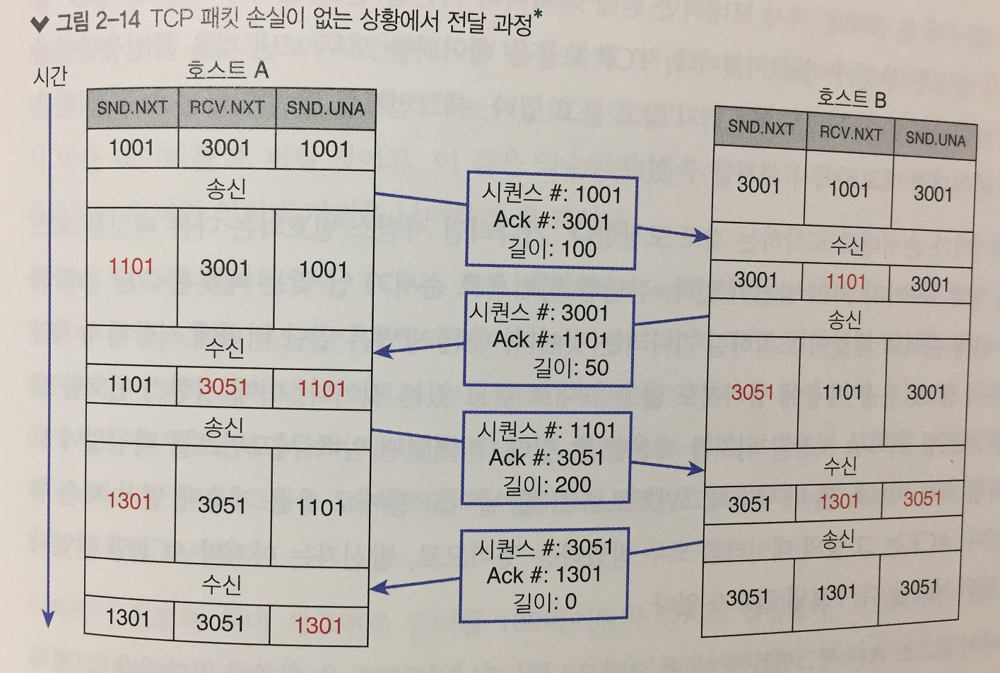

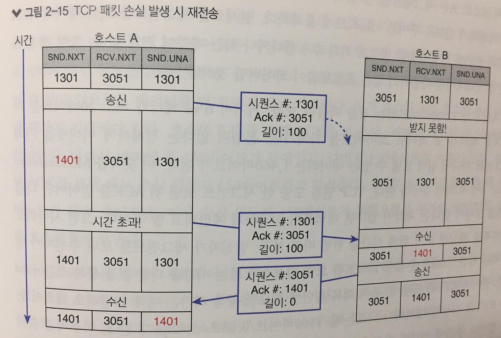